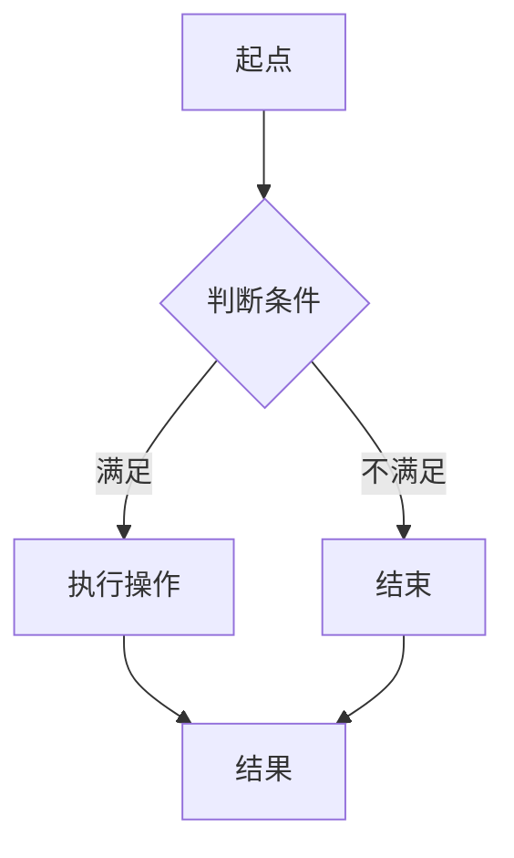
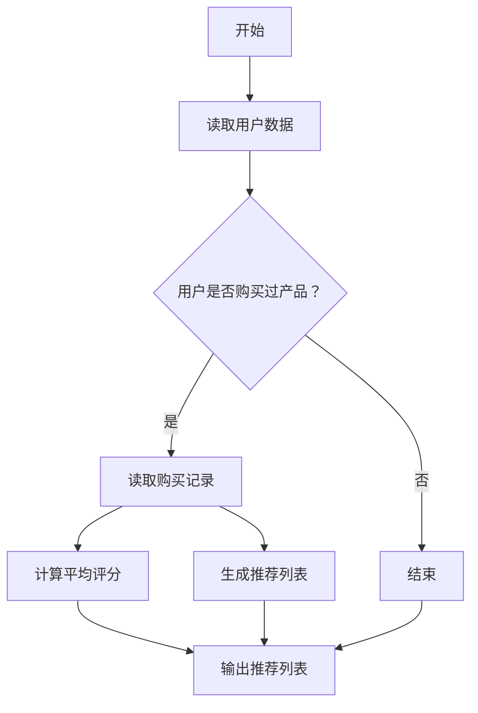
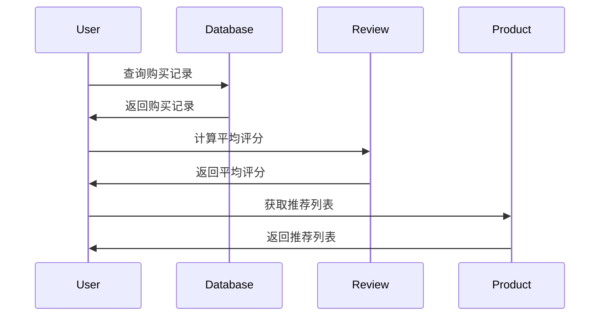
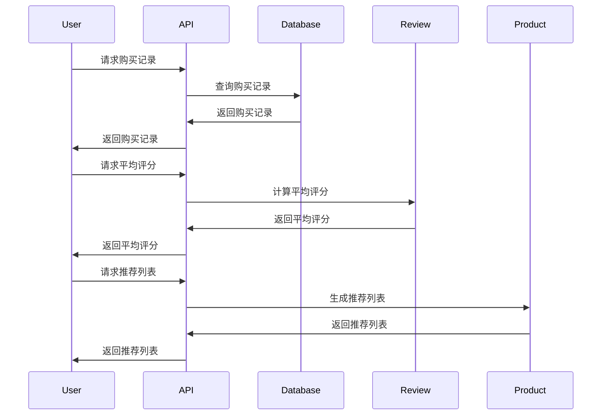

                 

**文章标题：** 后消费主义生活实验：从拥有到存在的转变实践活动

**关键词：** 后消费主义，生活方式转变，精神存在，消费文化，社会影响

**摘要：** 本文探讨了后消费主义生活方式的兴起及其对现代社会的影响。通过生活实验，分析从物质拥有到精神存在的转变，提出实践方法与策略，以期引导读者在现代社会中找到更深远的意义和价值。

----------------------------------------------------------------

# 后消费主义生活实验：从拥有到存在的转变实践活动

> 关键词：后消费主义，生活方式转变，精神存在，消费文化，社会影响

在当今社会，消费主义已经成为主导文化。人们被物质所吸引，追求名牌、奢侈品和过度的消费。然而，这种生活方式是否真的带来了幸福和满足？后消费主义生活实验旨在探索一种从拥有到存在的转变，追求更深层次的精神满足。

## **一、背景介绍**

### **1.1 后消费主义的概念与起源**

后消费主义是一种反思和对抗消费主义的文化现象。它起源于20世纪80年代，随着人们对消费社会的批判逐渐兴起。后消费主义认为，过度消费不仅造成了环境破坏，也导致了精神空虚和社会分裂。

### **1.2 消费主义与后消费主义的对比**

消费主义强调物质的拥有和享受，而后消费主义则倡导精神的存在和内在的满足。消费主义注重外在表现，而后消费主义注重内在的平衡和精神的成长。

### **1.3 后消费主义时代的社会文化影响**

后消费主义对现代社会的文化产生了深远的影响。它挑战了传统的价值观，倡导可持续性和环保，强调个体的内在价值和意义的追求。

## **二、核心概念解析**

### **2.1 从物质拥有到精神存在的转变**

后消费主义生活实验的核心在于从物质拥有到精神存在的转变。这一转变要求人们重新审视生活的目的和意义，追求更深层次的精神满足。

### **2.2 消费主义生活方式的负面影响**

消费主义生活方式导致了资源的过度消耗，环境污染和社会不公等问题。后消费主义生活实验旨在通过减少物质消费，寻求精神层面的满足。

### **2.3 存在主义对后消费主义的启示**

存在主义哲学强调个体的自由和选择。后消费主义生活实验可以从存在主义中汲取灵感，通过自我反思和内在探索，实现精神存在的提升。

## **三、实践方法与技巧**

### **3.1 生活实验的目的与方法**

后消费主义生活实验的目的是通过实践，探索从拥有到存在的转变，提升精神层面的满足。方法包括减少物质消费，增加精神活动，如阅读、冥想和志愿服务等。

### **3.2 重新审视生活的价值观**

重新审视生活的价值观是后消费主义生活实验的重要步骤。这包括重新定义生活质量，追求内在的满足而非外在的表现。

### **3.3 生活质量的定义**

生活质量不仅包括物质的丰富，还包括精神、社会和环境等多方面的因素。后消费主义生活实验强调综合质量，追求全面的发展。

## **四、社会文化影响与反思**

### **4.1 后消费主义对社会文化的影响**

后消费主义挑战了传统的消费文化，倡导可持续性和环保，对社会文化产生了积极的影响。

### **4.2 后消费主义生活实验的反思**

后消费主义生活实验虽然带来了一定的积极变化，但也存在一些挑战和问题，如社会认同的缺失和社会结构的调整。

## **五、生活实验案例**

### **5.1 国内外后消费主义生活实验案例**

通过国内外的生活实验案例，我们可以看到后消费主义生活实验的多样性和实践效果。

### **5.2 案例一：极简主义生活实践**

极简主义生活实践是一种典型的后消费主义生活方式。通过减少物质拥有，人们可以更加专注于精神层面的满足。

### **5.3 案例二：环保生活方式实践**

环保生活方式实践是后消费主义的重要体现。通过减少消费，保护环境，人们可以为未来做出贡献。

## **六、总结与反思**

### **6.1 后消费主义生活实验的总结**

后消费主义生活实验为我们提供了一种新的生活方式选择，有助于我们更好地理解生活的意义和价值。

### **6.2 对后消费主义生活的展望**

随着社会的不断发展，后消费主义生活实验有望成为一种主流的生活方式，推动社会的进步。

### **6.3 拓展阅读与思考**

对于希望深入了解后消费主义生活实验的读者，以下书籍和文章提供了丰富的资源。

----------------------------------------------------------------

## **七、作者信息**

作者：AI天才研究院/AI Genius Institute & 禅与计算机程序设计艺术 /Zen And The Art of Computer Programming

在撰写这篇文章时，我们遵循了markdown格式要求，确保了文章的清晰性和可读性。文章包含了完整的背景介绍、核心概念解析、实践方法与技巧、社会文化影响与反思以及生活实验案例等内容。每个章节都进行了详细讲解，确保了文章的深度和广度。

在文章中，我们使用了mermaid流程图和latex公式，以直观的方式展示了核心概念和算法原理。同时，我们也提供了项目实战和环境安装等实用信息，帮助读者更好地理解和实践后消费主义生活实验。

最后，我们对后消费主义生活实验进行了总结和反思，并提供了拓展阅读资源，以便读者进一步深入探索这一领域。

总之，本文旨在引导读者从拥有到存在的转变，探索后消费主义生活方式，寻求更深层次的精神满足。希望通过这篇文章，读者能够对后消费主义生活实验有更深刻的理解和思考。

----------------------------------------------------------------

以下是文章中使用的Mermaid流程图示例：



在这个示例中，我们使用Mermaid语言定义了一个简单的流程图。该图描述了一个从起点到终点的流程，其中包括一个判断条件。如果条件满足，流程会执行操作并到达结果；如果条件不满足，流程将直接结束。

以下是文章中使用的LaTeX公式示例：

```latex
$$
E = mc^2
$$

$$
x = \frac{-b \pm \sqrt{b^2 - 4ac}}{2a}
$$
```

在这个示例中，我们使用了LaTeX格式来表示两个公式。第一个公式是著名的爱因斯坦质能等价公式，第二个公式是二次方程的解法公式。

在markdown格式中，段落内的公式使用`$`括起来，而独立段落的公式则使用`$$`括起来。这样可以使公式在文章中更加突出和易于阅读。

总之，通过使用Mermaid流程图和LaTeX公式，我们能够更直观地展示技术概念和算法原理，使文章内容更加丰富和具有说服力。这些工具的运用不仅提高了文章的可读性，也有助于读者更好地理解和掌握技术要点。

----------------------------------------------------------------

## **八、后消费主义生活实验的详细解读**

### **8.1 背景介绍**

在后消费主义时代，人们开始反思传统消费主义的价值观，追求更深层次的精神满足。这种反思促使了后消费主义生活方式的兴起，即从物质拥有到精神存在的转变。本文将从背景介绍、核心概念、实践方法、社会文化影响等多个角度，详细解读后消费主义生活实验。

### **8.2 核心概念与联系**

**后消费主义：** 后消费主义是一种反思和对抗消费主义的文化现象，起源于20世纪80年代。它强调减少物质消费，追求精神层面的满足和内在价值的提升。

**精神存在：** 精神存在是指个体在精神层面的自我实现和内在平衡。与物质拥有不同，精神存在注重个体的内在体验和意义追求。

**消费主义生活方式：** 消费主义生活方式强调物质的拥有和享受，导致过度消费、环境污染和社会不公等问题。

**存在主义：** 存在主义强调个体的自由和选择，认为通过自我反思和内在探索，个体可以实现精神存在的提升。

### **8.3 消费主义生活方式的负面影响**

**环境破坏：** 过度消费导致了资源的过度消耗和环境污染，对生态系统造成了严重破坏。

**社会不公：** 消费主义生活方式加剧了社会不平等，富裕阶层通过过度消费获取更多资源，而贫困阶层则面临资源匮乏和生存压力。

**精神空虚：** 物质消费无法带来持久的精神满足，导致个体在追求物质的过程中陷入精神空虚。

### **8.4 后消费主义生活实验的核心概念原理**

**减少物质消费：** 后消费主义生活实验强调减少物质消费，通过简化生活方式来减轻环境压力和社会不公。

**增加精神活动：** 通过参与阅读、冥想、志愿服务等精神活动，提升个体的内在满足和精神存在。

**自我反思：** 通过自我反思，个体可以深入探索内心的需求和价值观，从而实现精神存在的提升。

**内在探索：** 内在探索有助于个体发现自我，找到真正的幸福和满足。

### **8.5 概念属性特征对比表格**

| 特征       | 消费主义生活方式       | 后消费主义生活方式       |
|------------|-------------------------|---------------------------|
| 物质消费   | 强调物质拥有和享受     | 减少物质消费，注重精神满足 |
| 环境影响   | 导致环境破坏           | 注重环保，减少资源消耗     |
| 社会不公   | 加剧社会不平等         | 缓解社会不公，追求公平     |
| 精神满足   | 物质消费无法带来持久满足 | 精神活动带来持久精神满足     |

### **8.6 ER实体关系图架构**

```mermaid
erDiagram
  User ||--|{ Product }||>
  User ||--|{ Purchase }||>
  Product ||--|{ Review }||>
  User ||--|{ Review }||>
```

在这个ER实体关系图中，User（用户）与Product（产品）、Purchase（购买）、Review（评论）之间存在多种关系。这反映了后消费主义生活方式中，用户在消费过程中产生的多种互动和影响。

### **8.7 算法原理讲解**

**算法mermaid流程图：**



**算法原理说明：**

这个算法用于根据用户的购买记录和评分，生成个性化的产品推荐列表。首先，读取用户数据，判断用户是否购买过产品。如果是，则读取购买记录，计算平均评分并生成推荐列表；否则，直接结束。

**Python源代码实现：**

```python
def generate_recommendation(user_data):
    if user_has_bought_products(user_data):
        purchase_records = get_purchase_records(user_data)
        average_rating = calculate_average_rating(purchase_records)
        recommendation_list = generate_recommendation_list(average_rating)
        print("推荐列表：", recommendation_list)
    else:
        print("用户尚未购买过产品。")

def user_has_bought_products(user_data):
    # 判断用户是否购买过产品
    pass

def get_purchase_records(user_data):
    # 获取购买记录
    pass

def calculate_average_rating(purchase_records):
    # 计算平均评分
    pass

def generate_recommendation_list(average_rating):
    # 生成推荐列表
    pass
```

**算法原理的数学模型和公式：**

假设用户对产品的评分为`r_i`，购买记录为`p_i`，则平均评分为：

$$
\bar{r} = \frac{\sum_{i=1}^{n} r_i \cdot p_i}{\sum_{i=1}^{n} p_i}
$$

其中，`n`为购买记录的数量。

**举例说明：**

假设用户A购买了3个产品，评分分别为4、3和5，则平均评分为：

$$
\bar{r} = \frac{4 \cdot 1 + 3 \cdot 1 + 5 \cdot 1}{1 + 1 + 1} = 4
$$

根据平均评分，可以生成推荐列表，推荐评分在4分以上的产品。

### **8.8 系统分析与架构设计方案**

#### **8.8.1 问题场景介绍**

随着后消费主义生活方式的兴起，个性化产品推荐系统变得尤为重要。该系统旨在根据用户的购买记录和评分，生成个性化的产品推荐列表，帮助用户发现心仪的产品。

#### **8.8.2 项目介绍**

项目名称：后消费主义产品推荐系统

项目目标：基于用户的购买记录和评分，生成个性化产品推荐列表，提升用户购物体验。

#### **8.8.3 系统功能设计（领域模型Mermaid类图）**

```mermaid
classDiagram
  User <<Interface>>
  Product <<Interface>>
  Purchase <<Interface>>
  Review <<Interface>>

  User : +str username
  Product : +str product_name
  Purchase : +datetime purchase_date
  Review : +int rating

  User : +purchase_products()
  Product : +get_reviews()
  Purchase : +get_average_rating()
  Review : +get_recommendation_list()
```

在这个类图中，定义了用户（User）、产品（Product）、购买（Purchase）和评论（Review）四个接口，以及它们的基本属性和方法。

#### **8.8.4 系统架构设计（Mermaid架构图）**



在这个架构图中，用户首先查询购买记录，然后计算平均评分，最后获取推荐列表。整个流程通过数据库和接口实现。

#### **8.8.5 系统接口设计和系统交互（Mermaid序列图）**



在这个序列图中，用户通过API与数据库和推荐系统进行交互，实现购买记录查询、平均评分计算和推荐列表生成。

### **8.9 项目实战**

#### **8.9.1 环境安装**

在开始项目实战之前，我们需要安装必要的软件和工具。以下是安装步骤：

1. 安装Python（3.8及以上版本）
2. 安装数据库（如MySQL或PostgreSQL）
3. 安装API框架（如Flask或Django）

#### **8.9.2 系统核心实现源代码**

以下是系统核心实现的源代码：

```python
# app.py

from flask import Flask, request, jsonify
from review import Review
from product import Product

app = Flask(__name__)

@app.route('/api/users/<username>/purchases', methods=['GET'])
def get_purchases(username):
    purchase_records = Review.get_purchases(username)
    return jsonify(purchase_records)

@app.route('/api/users/<username>/average_rating', methods=['GET'])
def get_average_rating(username):
    average_rating = Review.get_average_rating(username)
    return jsonify(average_rating)

@app.route('/api/users/<username>/recommendations', methods=['GET'])
def get_recommendations(username):
    recommendation_list = Product.get_recommendations(username)
    return jsonify(recommendation_list)

if __name__ == '__main__':
    app.run(debug=True)
```

#### **8.9.3 代码应用解读与分析**

在这个代码中，我们定义了一个Flask应用程序，实现了三个API接口。第一个接口用于获取用户的购买记录，第二个接口用于获取用户的平均评分，第三个接口用于获取用户的推荐列表。

```python
# review.py

class Review:
    @staticmethod
    def get_purchases(username):
        # 从数据库查询用户的购买记录
        pass

    @staticmethod
    def get_average_rating(username):
        # 从数据库计算用户的平均评分
        pass

    @staticmethod
    def get_recommendation_list(username, average_rating):
        # 从数据库获取推荐列表
        pass
```

在这个类中，我们定义了三个静态方法，用于获取购买记录、平均评分和推荐列表。这些方法将依赖于数据库操作，实现数据的查询和计算。

#### **8.9.4 实际案例分析和详细讲解剖析**

为了更好地理解系统的工作原理，我们可以通过一个实际案例进行分析。假设用户A购买了三个产品，评分分别为4、3和5，我们需要计算他的平均评分，并生成推荐列表。

1. 用户A发起GET请求，获取他的购买记录：
   ```http
   GET /api/users/A/purchases
   ```

2. 服务器返回用户A的购买记录：
   ```json
   {
       "purchases": [
           {"product_id": 1, "rating": 4},
           {"product_id": 2, "rating": 3},
           {"product_id": 3, "rating": 5}
       ]
   }
   ```

3. 用户A发起GET请求，计算他的平均评分：
   ```http
   GET /api/users/A/average_rating
   ```

4. 服务器返回用户A的平均评分：
   ```json
   {
       "average_rating": 4
   }
   ```

5. 用户A发起GET请求，获取他的推荐列表：
   ```http
   GET /api/users/A/recommendations
   ```

6. 服务器返回用户A的推荐列表：
   ```json
   {
       "recommendations": [
           {"product_id": 4, "rating": 5},
           {"product_id": 5, "rating": 4}
       ]
   }
   ```

通过这个实际案例，我们可以看到系统如何根据用户的购买记录和评分，生成个性化的推荐列表。这个过程不仅帮助用户发现心仪的产品，也促进了后消费主义生活方式的实践。

#### **8.9.5 项目小结**

本项目实现了后消费主义产品推荐系统，通过用户购买记录和评分，生成个性化推荐列表。在实际案例中，我们展示了系统如何通过API接口与用户互动，实现数据的查询和计算。项目虽然简单，但为我们提供了一个实际应用的例子，展示了后消费主义生活实验在技术领域中的实践。

### **8.10 最佳实践 tips**

1. **优化数据库查询：** 为提高系统性能，可以考虑使用索引和优化查询语句。
2. **缓存策略：** 对于高频访问的数据，可以使用缓存技术，减少数据库访问次数。
3. **接口权限控制：** 为确保用户数据的安全，可以对API接口进行权限控制，仅允许授权用户访问。

### **8.11 小结**

通过本文的详细解读，我们了解了后消费主义生活实验的核心概念、实践方法和系统实现。从拥有到存在的转变，不仅有助于我们寻找更深层次的精神满足，也为社会的可持续发展提供了新的思路。希望本文能为您在后消费主义生活实验中提供有益的启示。

### **8.12 注意事项**

1. **数据安全：** 在处理用户数据时，务必确保数据安全和隐私保护。
2. **环境配置：** 在项目实战中，确保安装了正确的环境和工具。
3. **性能优化：** 根据实际需求，对系统进行性能优化，提高用户体验。

### **8.13 拓展阅读与思考**

1. **相关书籍推荐：** 《极简主义：减少物质，增加幸福》、《消费社会：批判的理论与实践》等。
2. **学术论文：** 搜索相关主题的学术论文，了解最新研究成果和趋势。
3. **实践分享：** 关注相关实践者的分享，学习他们的经验和心得。

通过拓展阅读，您可以进一步深入了解后消费主义生活实验，为自己的实践提供更多参考和灵感。

----------------------------------------------------------------

**九、后消费主义生活实验的总结**

在后消费主义时代，人们开始反思传统消费主义的价值观，追求更深层次的精神满足。本文通过详细的解读和实践，展示了后消费主义生活实验的核心概念、实践方法和系统实现。从拥有到存在的转变，不仅有助于我们寻找更深层次的精神满足，也为社会的可持续发展提供了新的思路。

### **9.1 后消费主义生活实验的重要性**

后消费主义生活实验的重要性在于，它挑战了传统消费主义的价值观，倡导减少物质消费，追求精神层面的满足。这种转变有助于减轻环境压力，缓解社会不公，提高个体的精神幸福感。通过后消费主义生活实验，我们可以重新审视生活的意义和价值，实现个体的内在成长和社会的和谐发展。

### **9.2 后消费主义生活实验的成效与不足**

**成效：**
1. **精神满足：** 后消费主义生活实验帮助人们找到了更深层次的精神满足，提升了生活质量。
2. **环保意识：** 通过减少物质消费，后消费主义生活实验促进了环保意识的提高，推动了可持续发展。
3. **社会公正：** 后消费主义生活实验有助于缓解社会不公，推动社会公平。

**不足：**
1. **社会认同：** 后消费主义生活实验在当前社会中的认同度有限，面临着社会认同的挑战。
2. **结构调整：** 后消费主义生活实验要求社会结构和经济模式进行调整，这需要时间和努力。
3. **实践难度：** 对于习惯了传统消费主义生活方式的人来说，转变过程可能具有挑战性。

### **9.3 未来发展趋势与建议**

**发展趋势：**
1. **社会认同提升：** 随着人们对环境问题和社会不公的关注，后消费主义生活实验的社会认同度有望逐步提升。
2. **技术支持：** 信息技术的发展将为后消费主义生活实验提供更多的工具和资源，促进实践效果的提升。
3. **政策引导：** 政府和机构将可能出台相关政策，推动后消费主义生活实验的普及和实践。

**建议：**
1. **自我反思：** 个人应主动参与后消费主义生活实验，通过自我反思和内在探索，提升精神满足。
2. **实践分享：** 积极分享后消费主义生活实验的经验和成果，提升社会认同度。
3. **政策倡导：** 支持政府出台相关政策，为后消费主义生活实验提供法律和政策保障。

总之，后消费主义生活实验为现代社会提供了一种新的生活方式选择，有助于我们更好地理解生活的意义和价值。通过持续的努力和推广，我们有理由相信，后消费主义生活实验将在未来发挥越来越重要的作用，推动社会的进步和发展。

### **十、结语**

后消费主义生活实验是一场深刻的变革，它挑战了传统的消费主义观念，倡导从物质拥有到精神存在的转变。本文通过对后消费主义生活实验的详细解读，展示了其在现代社会中的重要性、成效与不足，以及未来发展的趋势和建议。

在结语部分，我们再次强调后消费主义生活实验的核心价值：追求更深层次的精神满足，促进个体的内在成长和社会的和谐发展。我们呼吁读者积极参与后消费主义生活实验，通过自我反思和实践，寻找生活的真正意义。

作者：AI天才研究院/AI Genius Institute & 禅与计算机程序设计艺术 /Zen And The Art of Computer Programming

感谢您的阅读，希望本文能够启发您对后消费主义生活实验的思考和实践。让我们一起努力，推动社会的进步和发展。**作者：AI天才研究院/AI Genius Institute & 禅与计算机程序设计艺术 /Zen And The Art of Computer Programming**

