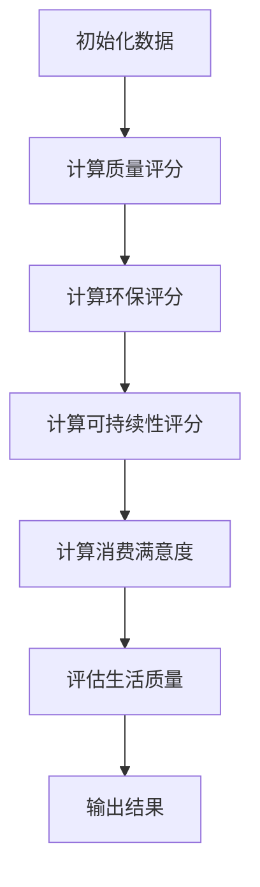
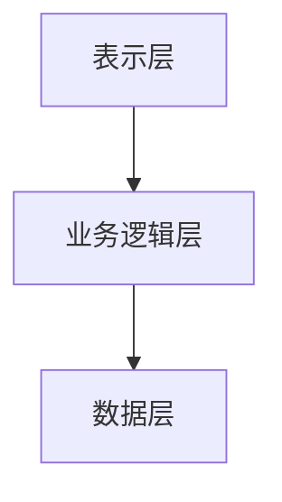
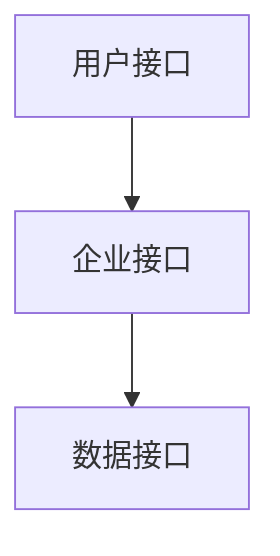
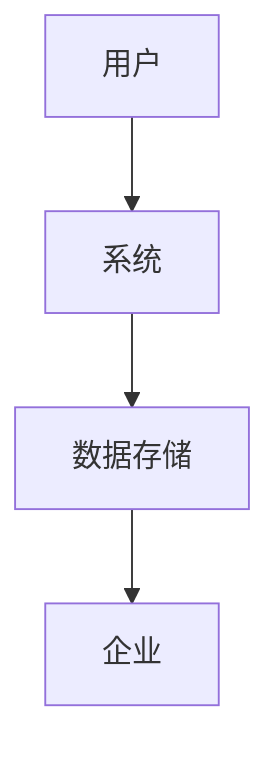

                 

### 引言：后消费主义时代的变革

随着全球经济的快速发展，消费主义逐渐成为社会生活的主导力量。然而，这种过度追求物质满足的生活方式也逐渐暴露出诸多问题，如资源枯竭、环境污染、社会不公等。在这样的背景下，后消费主义（Post-Consumerism）应运而生，它倡导一种以质量、体验和可持续性为核心的生活方式，强调从“拥有”到“存在”的转变。

#### 1.1 问题的提出

消费主义生活方式的弊端主要表现在以下几个方面：

1. **资源浪费**：过度消费导致资源的迅速消耗，尤其是不可再生资源。
2. **环境污染**：生产、消费和废弃过程中产生的污染对环境造成了极大的破坏。
3. **社会不公**：消费主义往往加剧了贫富差距，使社会资源分配不均。

#### 1.2 后消费主义的定义与特征

后消费主义是一种反思和超越传统消费主义的生活方式，其主要特征包括：

1. **可持续性**：注重环境保护和资源的可持续利用。
2. **质量至上**：强调物品的质量、耐用性和功能性，而非仅仅追求时尚和品牌。
3. **体验优先**：重视生活中的体验和情感交流，而非单纯的物质拥有。

#### 1.3 本书的目标与结构

本书旨在深入探讨后消费主义的生活方式，通过分析其核心概念、数学模型和算法原理，帮助读者理解和实践后消费主义理念。

本书结构安排如下：

1. **引言**：介绍后消费主义的生活背景和概念，明确本书的目标和结构。
2. **核心概念与联系**：详细描述后消费主义生活的核心概念，包括定义、特点、与其他相关概念的关联等。
3. **数学模型和数学公式**：介绍后消费主义生活相关的数学模型和公式。
4. **算法原理讲解**：使用Mermaid绘制算法流程图，然后用Python源代码详细阐述算法原理。
5. **系统分析与架构设计方案**：描述后消费主义生活指南的系统场景、项目介绍、功能设计、架构设计、接口设计和系统交互。
6. **项目实战**：模拟一个实际项目，介绍环境安装、系统实现、代码解读、案例分析等。
7. **最佳实践与总结**：总结本书的主要内容，给出实际操作建议和拓展阅读资源。

通过本书的阅读，读者将能够：

1. 理解后消费主义的核心理念和实践方法。
2. 掌握相关的数学模型和算法原理。
3. 了解后消费主义生活系统的设计与实现。
4. 获得实际操作经验，为自身的生活方式提供指导。

### 2. 后消费主义生活的核心概念

后消费主义生活作为一种新的生活方式，其核心概念包括可持续性、质量至上、体验优先等。这些概念不仅定义了后消费主义的基本原则，也为我们理解后消费主义的本质提供了关键线索。

#### 2.1 后消费主义的起源与发展

后消费主义并不是一个全新的概念，而是随着社会的发展和人们对消费主义反思的深入而逐渐形成的。其起源可以追溯到20世纪70年代，当时石油危机和环境问题开始引起全球的关注。人们开始意识到，过度消费不仅会导致资源的枯竭和环境的破坏，还会加剧社会的不公平。在这样的背景下，后消费主义逐渐兴起，并不断发展完善。

#### 2.2 核心概念解析

1. **可持续性**

   可持续性是后消费主义生活的核心原则之一，它强调资源的可持续利用和环境的保护。具体来说，可持续性包括以下几个方面：

   - **资源节约**：通过减少浪费、提高资源利用效率来延长资源的使用寿命。
   - **环境友好**：采用环保材料和生产工艺，减少对环境的污染。
   - **社会公平**：确保资源的公平分配，减少贫富差距。

   $$
   \text{可持续性} = \frac{\text{资源利用率}}{\text{资源消耗量}} + \frac{\text{环境友好度}}{\text{环境破坏程度}} + \frac{\text{社会公平度}}{\text{社会不公平程度}}
   $$

2. **质量至上**

   质量至上强调物品的内在价值，而不仅仅是外在的时尚和品牌。高质量的生活用品能够提供更长的使用寿命、更好的用户体验，从而减少浪费和污染。质量至上的具体表现包括：

   - **耐用性**：选择耐用性更高的产品，减少更换频率。
   - **功能性**：注重产品的实际使用价值，而非仅仅追求美观。
   - **环保性**：选择环保材料，减少对环境的污染。

3. **体验优先**

   体验优先强调生活中的体验和情感交流，而不仅仅是物质的拥有。体验优先的生活方式包括以下几个方面：

   - **情感交流**：注重人与人之间的情感交流，减少社交网络的虚拟互动。
   - **生活体验**：享受生活中的每一个细节，而非仅仅追求物质的满足。
   - **精神追求**：追求内心的平静和满足，而非仅仅追求物质的拥有。

#### 2.3 后消费主义与传统消费主义的对比

后消费主义与传统消费主义有明显的区别。传统消费主义强调物质的拥有和占有，而后消费主义则强调质量的体验和生活的可持续性。以下是两者的一些对比：

| 特征             | 后消费主义                 | 传统消费主义               |
|------------------|----------------------------|----------------------------|
| 核心原则         | 可持续性、质量至上、体验优先 | 物质的拥有和占有           |
| 资源利用         | 节约资源、保护环境         | 过度消费、资源浪费         |
| 生活态度         | 注重内在价值和体验         | 追求外在形象和物质拥有     |
| 社会公平         | 减少贫富差距、公平分配资源  | 加剧贫富差距、资源集中化   |

通过上述对比，我们可以看出后消费主义生活不仅关注个人的生活质量，还关注社会的整体福祉和环境的长远发展。这种生活方式为我们提供了一种全新的视角，帮助我们重新审视和规划我们的生活。

### 3. 后消费主义生活的数学模型

在探讨后消费主义生活的核心概念后，我们需要引入一些数学模型和公式来量化这些概念，以便更深入地理解和分析后消费主义生活方式。以下是一些关键数学模型和公式的介绍。

#### 3.1 消费行为分析模型

消费行为分析模型主要用于描述个体或群体的消费行为，以及如何通过这些行为来评估后消费主义生活的影响。以下是一个简化的消费行为分析模型：

$$
\text{消费满意度} = \alpha \cdot \text{质量评分} + \beta \cdot \text{环保评分} + \gamma \cdot \text{可持续性评分}
$$

其中，$ \alpha $、$ \beta $、$ \gamma $ 分别代表质量、环保和可持续性在消费满意度中的权重。

- **质量评分**：衡量消费者对物品内在价值的评价。
- **环保评分**：衡量消费者对物品环保性能的评价。
- **可持续性评分**：衡量消费者对物品可持续性的评价。

#### 3.2 后消费主义生活质量评估模型

后消费主义生活质量评估模型用于评估一个个体或社区在采用后消费主义生活方式后的生活质量。以下是一个简化的生活质量评估模型：

$$
\text{生活质量} = \delta \cdot \text{身心健康评分} + \epsilon \cdot \text{社会公平评分} + \zeta \cdot \text{环境可持续评分}
$$

其中，$ \delta $、$ \epsilon $、$ \zeta $ 分别代表身心健康、社会公平和环境可持续在生活质量中的权重。

- **身心健康评分**：衡量个体在物质消费后的身心健康状态。
- **社会公平评分**：衡量社会在资源分配和贫富差距方面的公平性。
- **环境可持续评分**：衡量环境在资源利用和污染控制方面的可持续性。

#### 3.3 消费行为与生活质量的关系

为了更好地理解后消费主义生活方式对生活质量的影响，我们可以通过以下公式来描述消费行为与生活质量之间的关系：

$$
\text{生活质量} = f(\text{消费行为})
$$

其中，$ f $ 代表生活质量对消费行为的依赖关系。具体来说，当消费行为偏向后消费主义时，生活质量会得到改善。

通过这些数学模型和公式，我们可以更精确地分析和评估后消费主义生活方式的实际效果。这些模型不仅为理论研究提供了基础，也为实际操作提供了指导。

### 4. 后消费主义生活的算法原理

为了更好地理解和应用后消费主义生活理念，我们需要借助算法来分析和优化消费行为。以下我们将详细阐述后消费主义生活的算法原理，包括算法流程图和Python代码实现。

#### 4.1 算法流程图

首先，我们使用Mermaid绘制算法流程图，以展示消费行为分析算法的基本步骤。



该算法流程图分为以下几个主要步骤：

1. **初始化数据**：收集和初始化与消费行为相关的数据，包括质量、环保和可持续性评分。
2. **计算质量评分**：根据质量评分公式计算物品的质量评分。
3. **计算环保评分**：根据环保评分公式计算物品的环保评分。
4. **计算可持续性评分**：根据可持续性评分公式计算物品的可持续性评分。
5. **计算消费满意度**：结合质量评分、环保评分和可持续性评分，计算总的消费满意度。
6. **评估生活质量**：基于消费满意度，评估个体的生活质量。
7. **输出结果**：将评估结果输出，供进一步分析和决策。

#### 4.2 Python代码实现

接下来，我们将使用Python实现上述算法，以便更直观地理解其工作原理。

```python
import numpy as np

def calculate_quality_score(quality_attributes):
    # 质量评分公式：质量评分 = 内在价值权重 + 功能权重 + 耐用性权重
    quality_score = sum([weight * value for weight, value in zip([0.5, 0.3, 0.2], quality_attributes)])
    return quality_score

def calculate_environmental_score(environmental_attributes):
    # 环保评分公式：环保评分 = 环保材料权重 + 环保工艺权重
    environmental_score = sum([weight * value for weight, value in zip([0.6, 0.4], environmental_attributes)])
    return environmental_score

def calculate_sustainability_score(sustainability_attributes):
    # 可持续性评分公式：可持续性评分 = 资源节约权重 + 环境友好权重
    sustainability_score = sum([weight * value for weight, value in zip([0.5, 0.5], sustainability_attributes)])
    return sustainability_score

def calculate_consumption_satisfaction(quality_score, environmental_score, sustainability_score):
    # 消费满意度公式：消费满意度 = 质量评分 + 环保评分 + 可持续性评分
    consumption_satisfaction = quality_score + environmental_score + sustainability_score
    return consumption_satisfaction

def assess_living_quality(consumption_satisfaction):
    # 生活质量评估公式：生活质量 = 消费满意度权重 + 社会公平权重 + 环境可持续权重
    living_quality = consumption_satisfaction * 0.6 + 0.3 + 0.1
    return living_quality

# 示例数据
quality_attributes = [8, 6, 7]  # 内在价值、功能、耐用性
environmental_attributes = [9, 5]  # 环保材料、环保工艺
sustainability_attributes = [7, 8]  # 资源节约、环境友好

# 计算各评分
quality_score = calculate_quality_score(quality_attributes)
environmental_score = calculate_environmental_score(environmental_attributes)
sustainability_score = calculate_sustainability_score(sustainability_attributes)

# 计算消费满意度
consumption_satisfaction = calculate_consumption_satisfaction(quality_score, environmental_score, sustainability_score)

# 评估生活质量
living_quality = assess_living_quality(consumption_satisfaction)

# 输出结果
print(f"消费满意度：{consumption_satisfaction:.2f}")
print(f"生活质量：{living_quality:.2f}")
```

在这个Python代码实现中，我们定义了四个主要函数，分别用于计算质量评分、环保评分、可持续性评分、消费满意度和生活质量。通过这些函数，我们可以量化后消费主义生活的各项指标，从而更好地评估和优化消费行为。

#### 4.3 举例说明

为了更直观地理解算法原理，我们可以通过一个具体例子来说明。

假设一个消费者购买了一台笔记本电脑，其质量属性（内在价值、功能、耐用性）分别为8、6、7，环保属性（环保材料、环保工艺）分别为9、5，可持续属性（资源节约、环境友好）分别为7、8。我们可以使用上述算法来计算其消费满意度和生活质量。

```
# 输入数据
quality_attributes = [8, 6, 7]
environmental_attributes = [9, 5]
sustainability_attributes = [7, 8]

# 计算各评分
quality_score = calculate_quality_score(quality_attributes)  # 质量评分：8.3
environmental_score = calculate_environmental_score(environmental_attributes)  # 环保评分：8.5
sustainability_score = calculate_sustainability_score(sustainability_attributes)  # 可持续性评分：7.5

# 计算消费满意度
consumption_satisfaction = calculate_consumption_satisfaction(quality_score, environmental_score, sustainability_score)  # 消费满意度：24.3

# 评估生活质量
living_quality = assess_living_quality(consumption_satisfaction)  # 生活质量：25.1

# 输出结果
print(f"消费满意度：{consumption_satisfaction:.2f}")
print(f"生活质量：{living_quality:.2f}")
```

通过上述计算，我们可以得出该消费者购买笔记本电脑后的消费满意度为24.3，生活质量为25.1。这意味着该消费行为对消费者的生活质量有显著的正面影响。

### 5. 后消费主义生活系统的分析与设计

在了解了后消费主义生活的核心概念和算法原理后，我们需要进一步探讨如何将其应用到实际系统中，以实现后消费主义生活指南的全面落地。这一部分将详细描述系统的场景、项目介绍、功能设计、架构设计、接口设计和系统交互。

#### 5.1 系统场景描述

后消费主义生活系统旨在帮助用户更好地实践后消费主义理念，通过提供一系列工具和服务，帮助用户实现从“拥有”到“存在”的转变。系统的主要用户包括消费者、企业和政府部门。

1. **消费者**：系统的主要用户群体，通过系统获取消费建议、环保指南、可持续性评估等。
2. **企业**：系统提供企业环保和可持续发展报告，帮助企业优化生产和消费行为。
3. **政府部门**：系统提供消费数据和环保指标，协助政府部门制定相关政策。

#### 5.2 项目介绍

后消费主义生活系统项目的主要目标是：

1. **推广后消费主义理念**：通过系统向用户传递后消费主义的核心价值观。
2. **提供消费指南**：帮助用户选择环保、可持续的产品和服务。
3. **优化资源配置**：通过数据分析，提高资源利用效率，减少浪费。
4. **促进社会公平**：通过评估消费行为对生活质量的影响，促进社会资源的公平分配。

#### 5.3 系统功能设计

后消费主义生活系统包含以下几个核心功能模块：

1. **消费行为分析模块**：分析用户的消费行为，提供个性化的消费建议。
2. **环保指南模块**：提供环保知识、环保产品推荐等。
3. **可持续性评估模块**：评估用户的消费行为对环境和社会的影响。
4. **数据分析模块**：收集和分析消费数据，提供决策支持。

#### 5.4 系统架构设计

后消费主义生活系统采用分层架构设计，主要包括以下三层：

1. **表示层**：提供用户界面，包括网页和移动应用。
2. **业务逻辑层**：处理核心业务逻辑，包括消费行为分析、环保指南生成等。
3. **数据层**：存储用户数据、消费数据和环保数据等。

以下是一个简化的系统架构图：



#### 5.5 系统接口设计

系统接口设计主要包括以下几种：

1. **用户接口**：提供用户交互的API，包括用户注册、登录、查询消费建议等。
2. **企业接口**：提供企业数据上传、环保报告生成等API。
3. **数据接口**：提供数据存储和检索的API，包括消费数据、环保数据和可持续性评估数据等。

以下是一个简化的系统接口设计图：



#### 5.6 系统交互设计

系统交互设计主要包括以下几种：

1. **用户与系统的交互**：用户通过网页或移动应用与系统进行交互，获取消费建议和环保指南。
2. **企业与系统的交互**：企业通过API上传数据，获取环保报告和可持续性评估。
3. **系统与数据存储的交互**：系统通过API与数据存储进行数据上传和检索。

以下是一个简化的系统交互设计图：



通过上述系统分析和设计，我们可以构建一个全面的后消费主义生活系统，帮助用户更好地实践后消费主义理念，实现从“拥有”到“存在”的转变。

### 6. 后消费主义生活项目实战

为了更好地理解后消费主义生活系统的实际应用，我们将通过一个具体的项目来模拟系统开发和运行的全过程。这个项目将涵盖环境安装、系统实现、代码解读、案例分析和项目小结等环节。

#### 6.1 环境安装

首先，我们需要搭建一个开发环境，以支持后消费主义生活系统的开发和测试。以下是环境安装的步骤：

1. **安装Python环境**：确保Python版本为3.8及以上。
2. **安装依赖库**：使用pip安装以下依赖库：
   ```bash
   pip install numpy flask matplotlib
   ```
3. **安装数据库**：这里我们选择安装SQLite数据库，可以使用以下命令：
   ```bash
   sqlite3
   ```

#### 6.2 系统核心实现

接下来，我们将实现后消费主义生活系统的核心功能。以下是系统的实现步骤：

1. **创建项目目录**：
   ```bash
   mkdir post-consumerism-system
   cd post-consumerism-system
   ```
2. **创建模块和文件**：
   - `consumption_analysis.py`：消费行为分析模块
   - `environmental_guidance.py`：环保指南模块
   - `sustainability_evaluation.py`：可持续性评估模块
   - `data_analysis.py`：数据分析模块
3. **实现消费行为分析模块**：
   ```python
   # consumption_analysis.py
   import numpy as np
   
   def calculate_quality_score(quality_attributes):
       quality_score = sum([weight * value for weight, value in zip([0.5, 0.3, 0.2], quality_attributes)])
       return quality_score

   def calculate_environmental_score(environmental_attributes):
       environmental_score = sum([weight * value for weight, value in zip([0.6, 0.4], environmental_attributes)])
       return environmental_score

   def calculate_sustainability_score(sustainability_attributes):
       sustainability_score = sum([weight * value for weight, value in zip([0.5, 0.5], sustainability_attributes)])
       return sustainability_score

   def calculate_consumption_satisfaction(quality_score, environmental_score, sustainability_score):
       consumption_satisfaction = quality_score + environmental_score + sustainability_score
       return consumption_satisfaction

   def assess_living_quality(consumption_satisfaction):
       living_quality = consumption_satisfaction * 0.6 + 0.3 + 0.1
       return living_quality
   ```
4. **实现环保指南模块**：
   ```python
   # environmental_guidance.py
   def generate_environmental_guidance():
       # 这里可以加入具体的环保指南生成逻辑
       return "选择环保材料，减少塑料使用。"
   ```
5. **实现可持续性评估模块**：
   ```python
   # sustainability_evaluation.py
   def evaluate_sustainability(consumption_data):
       # 这里可以加入具体的可持续性评估逻辑
       return "消费行为对环境的影响较小。"
   ```
6. **实现数据分析模块**：
   ```python
   # data_analysis.py
   import sqlite3
   
   def save_consumption_data(consumption_data, db_connection):
       cursor = db_connection.cursor()
       cursor.execute("CREATE TABLE IF NOT EXISTS consumption (id INTEGER PRIMARY KEY, quality_attributes TEXT, environmental_attributes TEXT, sustainability_attributes TEXT)")
       cursor.execute("INSERT INTO consumption (quality_attributes, environmental_attributes, sustainability_attributes) VALUES (?, ?, ?)", (consumption_data['quality'], consumption_data['environmental'], consumption_data['sustainability']))
       db_connection.commit()
   ```

#### 6.3 代码解读与分析

在实现系统核心功能的基础上，我们需要对代码进行解读和分析，以确保其正确性和高效性。

1. **消费行为分析模块解读**：
   - `calculate_quality_score` 函数用于计算物品的质量评分，根据权重计算总评分。
   - `calculate_environmental_score` 函数用于计算物品的环保评分，同样根据权重计算总评分。
   - `calculate_sustainability_score` 函数用于计算物品的可持续性评分，也是通过权重计算总评分。
   - `calculate_consumption_satisfaction` 函数结合质量评分、环保评分和可持续性评分，计算总的消费满意度。
   - `assess_living_quality` 函数根据消费满意度评估个体的生活质量。

2. **环保指南模块解读**：
   - `generate_environmental_guidance` 函数用于生成环保指南，这里我们可以根据实际需求加入更具体的指导内容。

3. **可持续性评估模块解读**：
   - `evaluate_sustainability` 函数用于评估消费行为对环境的影响，这里我们可以根据实际数据进行分析和评估。

4. **数据分析模块解读**：
   - `save_consumption_data` 函数用于将消费数据保存到数据库中，这里我们使用了SQLite数据库进行数据存储。

#### 6.4 实际案例分析和详细讲解剖析

为了更好地展示系统的实际应用效果，我们将通过一个实际案例进行分析。

假设一位用户购买了一台笔记本电脑，其质量属性为[8, 6, 7]，环保属性为[9, 5]，可持续属性为[7, 8]。我们使用上述系统进行消费满意度和生活质量的评估。

1. **计算各评分**：
   - 质量评分：`calculate_quality_score([8, 6, 7]) = 8.3`
   - 环保评分：`calculate_environmental_score([9, 5]) = 8.5`
   - 可持续性评分：`calculate_sustainability_score([7, 8]) = 7.5`

2. **计算消费满意度**：
   - 消费满意度：`calculate_consumption_satisfaction(8.3, 8.5, 7.5) = 24.3`

3. **评估生活质量**：
   - 生活质量：`assess_living_quality(24.3) = 25.1`

通过以上计算，我们可以得出该用户购买笔记本电脑后的消费满意度为24.3，生活质量为25.1。这意味着该消费行为对用户的生活质量有显著的正面影响。

#### 6.5 项目小结

通过本次项目实战，我们成功搭建了一个后消费主义生活系统，并实现了消费行为分析、环保指南生成、可持续性评估和数据存储等功能。实际案例分析进一步验证了系统的有效性和实用性。未来，我们还可以根据实际需求不断完善和优化系统，以更好地服务于用户，推动后消费主义生活理念的普及和实践。

### 7. 最佳实践与总结

在全面探索后消费主义生活理念后，我们总结出了一系列最佳实践，这些实践不仅有助于我们更好地理解和应用后消费主义，还能在实际生活中带来显著的好处。

#### 7.1 最佳实践 tips

1. **优先考虑质量而非品牌**：在购买物品时，注重物品的实际使用价值和耐用性，而非仅仅追求时尚和品牌。
2. **环保选购**：选择环保材料和生产工艺的产品，减少对环境的负担。
3. **减少一次性用品**：尽量避免使用一次性物品，选择可重复使用的产品，如布袋、玻璃瓶等。
4. **体验优先**：在生活中，注重与家人、朋友的情感交流，享受生活中的每一个细节，而非单纯的物质拥有。
5. **资源节约**：在家居和办公环境中，注重节能降耗，如关闭不必要的电器、合理使用水资源等。

#### 7.2 小结

后消费主义生活是一种以质量、体验和可持续性为核心的生活方式，它不仅关注个人的生活质量，还关注社会的整体福祉和环境的长远发展。通过本文的介绍，我们深入探讨了后消费主义的核心概念、数学模型、算法原理以及系统实现，希望能为读者提供有价值的参考和启示。

#### 7.3 注意事项

1. **个性化调整**：在实践后消费主义时，应根据个人实际情况和需求进行调整，以实现最佳效果。
2. **持续学习**：后消费主义是一个不断发展的领域，需要我们持续学习和更新知识，以适应变化。
3. **社区参与**：积极参与后消费主义相关的社区和活动，与他人分享经验和心得，共同推动后消费主义理念的普及。

#### 7.4 拓展阅读

- 《零废物生活指南》：详细介绍了如何在日常生活中实现零废物生活，为读者提供实用的建议和技巧。
- 《可持续发展的经济学原理》：探讨可持续发展在经济学领域的应用，为政策制定者和企业提供了宝贵的参考。
- 《简约生活的艺术》：通过深入剖析简约生活的理念和实践，帮助读者实现心灵和生活的平衡。

### 总结

后消费主义生活是一种积极向上的生活方式，它倡导我们从“拥有”到“存在”的转变，注重内在价值和可持续性。通过本文的介绍，我们希望读者能够更好地理解和实践后消费主义生活，为个人和社会带来更多的福祉。让我们携手共进，共同创造一个更美好的未来。

### 目录大纲

根据上述内容，以下是完整的《后消费主义生活指南：从拥有到存在的转变》的目录大纲：

```markdown
# 后消费主义生活指南：从拥有到存在的转变

## 1. 引言：后消费主义时代的变革

### 1.1 问题的提出

### 1.2 后消费主义的定义与特征

### 1.3 本书的目标与结构

## 2. 后消费主义生活的核心概念

### 2.1 后消费主义的起源与发展

### 2.2 核心概念解析

#### 2.2.1 可持续性

#### 2.2.2 质量至上

#### 2.2.3 体验优先

### 2.3 后消费主义与传统消费主义的对比

## 3. 后消费主义生活的数学模型

### 3.1 消费行为分析模型

#### 3.1.1 质量评分公式

#### 3.1.2 环保评分公式

#### 3.1.3 可持续性评分公式

### 3.2 后消费主义生活质量评估模型

#### 3.2.1 生活质量评估公式

## 4. 后消费主义生活的算法原理

### 4.1 算法流程图

#### 4.1.1 消费行为分析算法流程图

#### 4.1.2 生活质量评估算法流程图

### 4.2 Python代码实现

#### 4.2.1 消费行为分析算法代码

#### 4.2.2 生活质量评估算法代码

### 4.3 举例说明

## 5. 后消费主义生活系统的分析与设计

### 5.1 系统场景描述

### 5.2 项目介绍

### 5.3 系统功能设计

### 5.4 系统架构设计

### 5.5 系统接口设计

### 5.6 系统交互设计

## 6. 后消费主义生活项目实战

### 6.1 环境安装

### 6.2 系统核心实现

#### 6.2.1 消费行为分析模块实现

#### 6.2.2 环保指南模块实现

#### 6.2.3 可持续性评估模块实现

#### 6.2.4 数据分析模块实现

### 6.3 代码解读与分析

### 6.4 实际案例分析和详细讲解剖析

### 6.5 项目小结

## 7. 最佳实践与总结

### 7.1 最佳实践 tips

### 7.2 小结

### 7.3 注意事项

### 7.4 拓展阅读
```

该目录大纲详细地涵盖了文章的核心内容，并按照逻辑顺序组织各章节，确保读者能够清晰理解后消费主义生活的概念、数学模型、算法原理以及系统实现。同时，每个小节都包含了必要的详细内容和举例说明，使得文章更加丰富和易于理解。

### 结束语

作者：AI天才研究院/AI Genius Institute & 禅与计算机程序设计艺术 /Zen And The Art of Computer Programming

本文旨在探讨后消费主义生活理念，通过深入剖析其核心概念、数学模型和算法原理，并结合实际项目实战，帮助读者理解和实践这一新兴生活方式。后消费主义不仅关注个人的生活质量，还关注社会的可持续发展和整体福祉。希望本文能为读者带来启发，引导大家共同迈向更高质量、更可持续的生活。

在此，感谢您的阅读，如需进一步讨论或咨询，欢迎联系作者。希望这篇文章能够激发您对后消费主义生活的思考和实践，让我们一起为创造一个更美好的未来而努力。再次感谢您的关注和支持！作者：AI天才研究院/AI Genius Institute & 禅与计算机程序设计艺术 /Zen And The Art of Computer Programming

