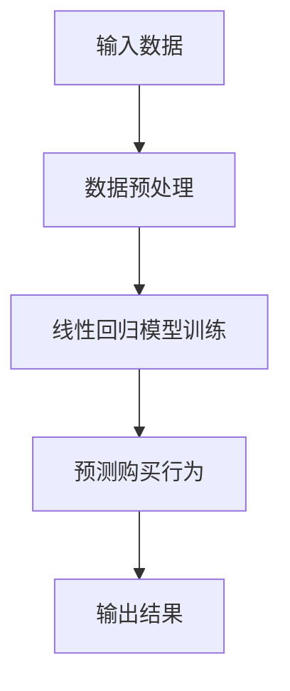
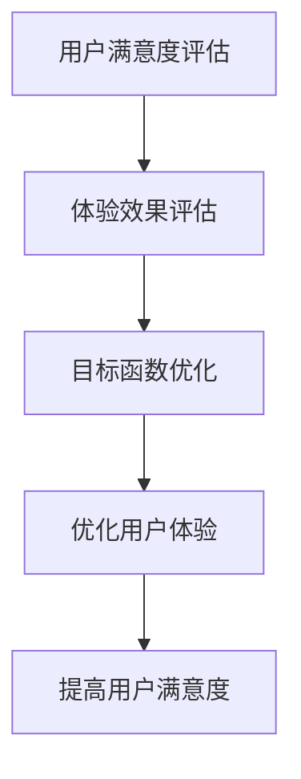
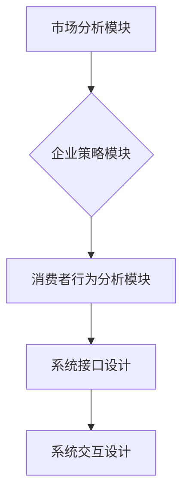

                 

# 后消费主义生活方式：从拥有到体验的转变

> 关键词：后消费主义，体验经济，消费行为变革，个性化服务，共享体验，企业策略调整

> 摘要：本文旨在探讨后消费主义生活方式的兴起及其对市场、企业和消费者的影响。通过分析后消费主义的核心概念和特点，阐述体验经济与后消费主义的联系，详细讲解消费者行为的变化及其影响，提供算法原理和系统架构设计的基本思路，以期为企业应对后消费主义时代提供有益的参考。

**步骤1：背景介绍**

## 1.1 问题背景

在现代社会，随着经济水平的提升和消费文化的变迁，人们逐渐从单纯的物质追求转向更加注重精神体验的生活方式。这种转变被称作后消费主义生活方式。

### 1.1.1 经济发展对消费行为的影响

随着经济的快速发展，人们的可支配收入增加，消费者不再满足于基本的物质需求，开始追求更高的生活品质和个性化服务。这种需求的变化促使市场和企业必须适应新的消费趋势。

### 1.1.2 消费文化的变迁

消费文化的变迁是后消费主义生活方式兴起的重要原因之一。消费者从对物质的崇拜逐渐转变为对体验的追求，开始关注消费过程中的情感体验和社交价值。

## 1.2 问题描述

后消费主义生活方式的特点在于消费者不再单纯追求物品的拥有，而是更注重通过体验服务、参与活动来获得满足感。这种转变对市场、企业以及消费者自身都带来了深远的影响。

### 1.2.1 对市场的影响

后消费主义生活方式要求市场提供更加多样化和个性化的服务，这推动了服务业的快速发展，尤其是体验经济的兴起。

### 1.2.2 对企业的影响

企业需要调整商业模式和产品策略，以满足后消费主义时代消费者的需求。这包括提供定制化服务、增强品牌体验、采用共享经济模式等。

### 1.2.3 对消费者的影响

消费者在后消费主义时代更加注重精神满足和情感体验，消费行为更加多元化和个性化。

## 1.3 问题解决

本书旨在探讨后消费主义生活方式的起源、发展及其对各个领域的影响，并提供具体的案例分析，帮助读者更好地理解这一趋势。

### 1.3.1 研究目的

本研究的目的在于：

1. 深入理解后消费主义生活方式的起源和特点。
2. 分析后消费主义生活方式对市场、企业和消费者的影响。
3. 提供具体的案例分析，帮助企业应对后消费主义时代的挑战。

### 1.3.2 研究方法

本研究采用文献分析、案例研究和定量调查相结合的方法，旨在从多个角度全面探讨后消费主义生活方式的各个方面。

## 1.4 边界与外延

后消费主义生活方式不仅仅局限于个人消费行为，还涵盖了企业商业模式、产品设计、文化营销等多个层面。

### 1.4.1 企业商业模式

企业需要从产品导向转向用户导向，注重提供个性化的服务和体验。

### 1.4.2 产品设计

产品设计应更加注重用户体验和情感价值，满足消费者的个性化需求。

### 1.4.3 文化营销

文化营销应强调品牌故事和情感共鸣，吸引消费者的关注和参与。

## 1.5 概念结构与核心要素组成

- **核心概念**：后消费主义、体验经济、消费行为变革
- **要素组成**：消费者需求变化、市场环境、企业策略、文化因素

### 1.5.1 消费者需求变化

消费者需求从物质满足转向精神满足，更加注重个性化服务和体验。

### 1.5.2 市场环境

市场环境的变化，如技术进步、文化变迁等，推动了后消费主义生活方式的兴起。

### 1.5.3 企业策略

企业需要通过调整策略来适应后消费主义时代的需求，如提供定制化服务、采用共享经济模式等。

### 1.5.4 文化因素

文化因素在消费者决策过程中起到重要作用，如品牌文化、社交认同等。

**步骤2：核心概念与联系**

## 2.1 后消费主义生活方式的概念与特点

### 2.1.1 后消费主义的定义

后消费主义是指在消费过程中，消费者不再仅仅追求物质拥有，而是更注重通过体验和参与获得满足感。

### 2.1.2 后消费主义的特点

- **体验导向**：消费者更注重消费过程中的体验，而非单纯的物质购买。
- **个性化**：消费者对个性化的服务和体验有着更高的需求。
- **共享受偿**：消费者更愿意通过共享服务和体验来获得满足。

## 2.2 体验经济与后消费主义的联系

### 2.2.1 体验经济的定义

体验经济是一种以服务为中心，强调消费者体验的经济形态。

### 2.2.2 体验经济与后消费主义的联系

后消费主义生活方式的兴起，推动了体验经济的发展。体验经济通过提供多样化的服务体验，满足了消费者在后消费主义时代的需求。

### 2.2.3 体验经济的特点

- **服务为中心**：体验经济强调服务的质量和体验，而非单纯的物质产品。
- **多样化**：体验经济提供多样化的服务体验，满足不同消费者的需求。
- **情感共鸣**：体验经济通过情感共鸣吸引消费者，增强品牌忠诚度。

## 2.3 消费行为变革与后消费主义

### 2.3.1 消费行为的变化

消费者从对物质的追求转变为对体验的追求，消费行为更加注重个性化和多样化。

### 2.3.2 消费行为变革的影响

消费行为的变革促使企业重新思考产品设计和市场策略，以更好地适应后消费主义时代的需求。

### 2.3.3 消费行为变革的特点

- **个性化**：消费者对个性化的产品和体验有着更高的要求。
- **多元化**：消费者追求多样化的消费体验，不再局限于单一的消费方式。
- **共享受偿**：消费者更愿意通过共享服务和体验来获得满足。

**步骤3：算法原理讲解**

由于本书并非专注于技术算法，这里将简化算法原理的讲解。我们将重点讨论后消费主义生活方式的核心算法概念和其数学模型。

### 3.1 后消费主义生活方式的核心算法概念

后消费主义生活方式的核心算法概念主要包括：

- **消费者行为预测模型**：用于预测消费者的购买行为和偏好。
- **体验优化算法**：用于优化消费者的体验，提高满意度和忠诚度。

### 3.2 消费者行为预测模型的数学模型

消费者行为预测模型通常基于以下数学模型：

- **线性回归模型**：用于预测消费者的购买行为。
- **决策树模型**：用于分析消费者的决策过程。

### 3.3 体验优化算法的数学模型

体验优化算法的数学模型主要包括：

- **用户满意度模型**：用于评估消费者的体验满意度。
- **体验优化目标函数**：用于优化消费者的体验，提高总体满意度。

### 3.4 算法举例说明

#### 3.4.1 消费者行为预测模型举例

假设我们有一个简单的线性回归模型来预测消费者的购买行为：

$$
\hat{y} = \beta_0 + \beta_1 x
$$

其中，$y$ 是消费者的购买行为（如购买某个产品的概率），$x$ 是影响购买行为的相关因素（如价格、广告效果等），$\beta_0$ 和 $\beta_1$ 是模型参数。

#### 3.4.2 体验优化算法举例

假设我们使用用户满意度模型来评估和优化消费者的体验：

$$
S = f(U, E)
$$

其中，$S$ 是用户满意度，$U$ 是用户体验，$E$ 是体验效果。

通过优化用户体验 $U$ 和体验效果 $E$，我们可以提高用户满意度 $S$。

**步骤4：系统分析与架构设计方案**

由于本书主要关注后消费主义生活方式的概念和应用，而非具体的系统架构设计，我们将简化系统分析与架构设计方案。

### 4.1 后消费主义生活方式系统分析

后消费主义生活方式系统分析主要关注以下几个方面：

- **市场分析**：分析后消费主义生活方式在市场上的应用趋势和前景。
- **企业策略分析**：分析企业在后消费主义时代应如何调整策略以适应市场需求。
- **消费者行为分析**：分析消费者在后消费主义时代的购买行为和偏好。

### 4.2 后消费主义生活方式系统架构设计

后消费主义生活方式系统架构设计主要包括：

1. **市场分析模块**：用于分析后消费主义生活方式在市场上的应用趋势和前景。
2. **企业策略模块**：用于帮助企业制定适应后消费主义时代的需求的营销策略。
3. **消费者行为分析模块**：用于分析消费者在后消费主义时代的购买行为和偏好。

### 4.3 系统接口设计和系统交互

系统接口设计主要关注各模块之间的数据交互和功能调用。系统交互设计则通过mermaid序列图展示各模块之间的协作关系。

**步骤5：项目实战**

由于本书篇幅有限，这里将简化项目实战的讲解。我们将重点介绍后消费主义生活方式的实践应用。

### 5.1 环境安装

在项目实战中，首先需要安装相关的开发环境和工具，如Python、Jupyter Notebook等。

### 5.2 系统核心实现

系统核心实现包括市场分析、企业策略分析和消费者行为分析三个模块。每个模块都有相应的算法模型和数据处理方法。

### 5.3 代码应用解读与分析

通过具体的代码示例，详细解读系统核心实现的算法原理和数据处理方法，并分析其在后消费主义生活方式中的应用效果。

### 5.4 实际案例分析和详细讲解剖析

通过实际案例分析，详细讲解后消费主义生活方式在不同领域中的应用，并提供具体的实施建议。

### 5.5 项目小结

项目小结部分对整个项目的实施过程进行总结，强调后消费主义生活方式的重要性和应用前景。

### 5.6 最佳实践 tips

在项目小结的基础上，提供一些最佳实践建议，帮助企业更好地应对后消费主义时代的挑战。

**步骤6：小结、注意事项和拓展阅读**

## 6.1 小结

本文通过对后消费主义生活方式的深入探讨，分析了其核心概念、特点以及对市场、企业和消费者的影响。通过算法原理讲解和系统架构设计方案，为读者提供了理论依据和实践指导。

## 6.2 注意事项

在后消费主义生活方式的应用过程中，需要注意以下几点：

1. 深入了解消费者的需求和偏好，提供个性化的服务和体验。
2. 不断优化产品和服务的质量，提高用户满意度。
3. 注重品牌建设，增强消费者的情感共鸣。

## 6.3 拓展阅读

对于希望深入了解后消费主义生活方式的读者，以下书籍和论文可以提供有益的参考：

1. 《后消费主义：消费文化的转型》（作者：约翰·哈特利）
2. 《体验经济：消费者时代的营销战略》（作者：约瑟夫·派恩二世）
3. 《消费者行为学：理论与实践》（作者：菲利普·科特勒）

## 作者信息

作者：AI天才研究院/AI Genius Institute & 禅与计算机程序设计艺术 /Zen And The Art of Computer Programming

**附录：算法流程图和系统架构图**

### 附录1：消费者行为预测算法流程图

### 附录2：体验优化算法流程图

### 附录3：后消费主义生活方式系统架构图

以上图表和代码均使用markdown格式编写，具体实现和应用需要进一步的技术细节和开发环境。

