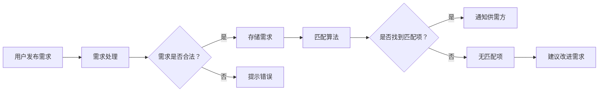
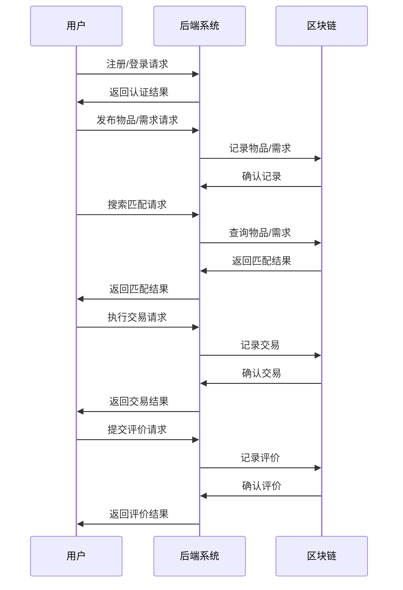

                 

# 后消费主义集市app：以物易物的全球交易平台

## 关键词
- 后消费主义
- 以物易物
- 全球交易平台
- 区块链技术
- 智能合约
- 用户增长策略
- 社区建设

## 摘要
本文深入探讨了后消费主义时代的市场趋势，以及在这种背景下，以物易物的全球交易平台的设计和实现。通过对后消费主义市场的背景分析，平台的核心概念、设计原则、技术实现、运营策略以及案例分析，本文旨在为开发者、运营者和研究者提供一个全面、系统的参考。此外，文章还对未来平台的发展趋势和优化方向进行了展望。

---

## 引言

### 1.1 后消费主义背景

在全球化、互联网和信息技术的推动下，传统的消费主义模式正面临变革。后消费主义（Post-Consumerism）作为一种新兴的消费观念，强调可持续性、共享和循环利用。它主张减少物质消费，提倡使用替代消费方式，如共享经济、租赁服务和以物易物等。

#### 问题背景

随着资源的日益稀缺和环境的持续恶化，传统的消费主义模式已经无法满足人们对可持续发展的需求。消费者开始反思自己的消费行为，寻找更加环保、经济的替代方案。后消费主义因此应运而生，成为了一种新的消费观念。

#### 问题描述

后消费主义市场的主要挑战在于如何构建一个高效、可信的以物易物平台，以满足消费者对可持续消费的需求。同时，平台需要具备良好的用户体验，以吸引更多的用户参与。

#### 问题解决

为了解决这些问题，我们需要从以下几个方面入手：

1. **平台设计**：设计一个简洁、易用、安全可靠的以物易物平台。
2. **技术实现**：利用区块链技术和智能合约，确保交易的透明性和安全性。
3. **运营策略**：制定有效的市场推广和用户增长策略。
4. **社区建设**：构建一个活跃的社区，提高用户粘性。

### 1.2 以物易物的概念

以物易物（Barter）是一种古老的交易方式，它指的是在没有货币介入的情况下，通过直接交换物品或服务来实现交易。在现代，以物易物逐渐演变成一种替代消费方式，尤其是在后消费主义背景下，它具有以下几个核心特征：

1. **无货币交易**：以物易物不涉及货币，直接通过物品或服务交换。
2. **自主定价**：交易双方可以根据物品或服务的价值自行定价。
3. **个性化**：以物易物更加注重个人的需求和偏好，具有较高的个性化程度。

### 1.3 全球交易平台的重要性

在全球化的背景下，构建一个全球性的以物易物交易平台具有重要意义。首先，它有助于减少国际贸易中的货币交易，降低交易成本。其次，它可以为消费者提供更多元化的选择，满足他们对可持续消费的需求。最后，全球交易平台还可以促进各国之间的文化交流和合作。

#### 边界与外延

- **边界**：全球交易平台主要涵盖线上交易，不包括线下交易。
- **外延**：全球交易平台不仅可以用于商品交换，还可以用于服务交换。

#### 概念结构与核心要素组成

全球交易平台的核心要素包括：

1. **用户**：平台的主要参与者，包括提供物品或服务的卖家和寻求物品或服务的买家。
2. **物品与服务**：交易的实体，包括商品、服务和其他可交换的物品。
3. **交易机制**：确保交易公平、透明和安全的规则和流程。
4. **区块链技术**：用于记录交易数据，确保数据不可篡改。
5. **智能合约**：自动化执行交易条款的代码，确保交易自动执行。

## 后消费主义市场分析

### 2.1 市场趋势

后消费主义市场的兴起，带动了一系列新兴消费模式的发展。以下是一些主要的市场趋势：

1. **共享经济**：共享经济已经成为后消费主义市场的一个重要组成部分。通过共享平台，用户可以共享车辆、住宿、设备等，实现资源的高效利用。
2. **租赁服务**：租赁服务的兴起，使得消费者可以更加灵活地获取所需物品，而无需长期拥有。
3. **二手市场**：二手市场的繁荣，反映了消费者对可持续消费的认可。越来越多的消费者选择购买二手商品，以减少浪费。
4. **定制化消费**：消费者越来越注重个性化消费，愿意为定制化服务支付额外费用。

### 2.2 用户需求

后消费主义市场的用户需求主要表现在以下几个方面：

1. **可持续性**：消费者希望自己的消费行为能够对环境和社会产生积极影响。
2. **灵活性**：消费者需要灵活的消费选择，以满足个性化的需求。
3. **便捷性**：消费者希望交易过程简单、快速、方便。
4. **安全性**：消费者对交易过程中的隐私保护和资金安全有较高的要求。

### 2.3 竞争环境分析

在以物易物全球交易平台的市场中，存在多种竞争形式。以下是一些主要的竞争环境：

1. **直接竞争**：其他以物易物平台，如eBay、Craigslist等。
2. **间接竞争**：共享经济平台，如Airbnb、Uber等，虽然它们不直接提供以物易物服务，但它们提供的替代消费方式对以物易物平台构成一定威胁。
3. **技术竞争**：区块链技术和智能合约的开发者和服务提供商。

## 以物易物平台的核心概念

### 3.1 平台定义

以物易物全球交易平台是一个在线市场，它允许用户通过交换物品或服务来实现交易。平台的核心目标是降低交易成本，提高资源利用效率，并促进可持续消费。

#### 核心概念体系

- **用户**：平台的主要参与者，包括卖家和买家。
- **物品与服务**：交易的实体，包括各种商品、服务和体验。
- **交易机制**：平台提供的交易规则和流程，确保交易的公平、透明和安全。
- **区块链技术**：用于记录交易数据，确保数据的不可篡改。
- **智能合约**：用于自动化执行交易条款的代码。

### 3.2 优势与挑战

#### 优势

1. **降低交易成本**：以物易物平台省去了货币交易的手续费和其他交易成本。
2. **提高资源利用效率**：通过共享和循环利用，平台有助于减少资源浪费。
3. **促进可持续消费**：平台鼓励消费者采用可持续的消费方式，减少对环境的负面影响。

#### 挑战

1. **信任问题**：在线交易过程中，信任是关键。平台需要建立有效的信任机制，确保交易的安全。
2. **交易复杂性**：以物易物的交易通常涉及多个物品或服务，交易过程较为复杂。
3. **市场推广**：吸引更多的用户参与是平台面临的一个重要挑战。

## 平台设计原则

### 4.1 设计目标

平台的设计目标包括以下几个方面：

1. **用户体验**：提供简洁、易用、高效的用户界面，提高用户满意度。
2. **安全性**：确保用户数据的安全，防止数据泄露和恶意攻击。
3. **可扩展性**：平台需要具备良好的可扩展性，以适应不断增长的用户和交易量。
4. **可持续性**：设计一个环保、节能的平台，降低对环境的影响。

### 4.2 用户界面设计

用户界面设计应遵循以下原则：

1. **简洁性**：界面设计应简洁明了，避免过多的功能干扰用户操作。
2. **一致性**：界面风格和交互元素应保持一致性，提高用户的使用体验。
3. **响应式设计**：平台应支持多种设备，如电脑、手机和平板，以适应不同的用户需求。
4. **个性化**：用户可以根据自己的需求，自定义界面布局和功能。

### 4.3 安全性与隐私保护

平台的安全性是用户信任的关键。以下是一些安全性和隐私保护措施：

1. **数据加密**：对用户数据和交易数据进行加密，防止数据泄露。
2. **身份验证**：采用多重身份验证机制，如密码、手机验证码等，确保用户身份的合法性。
3. **防火墙和入侵检测系统**：部署防火墙和入侵检测系统，防止恶意攻击。
4. **隐私政策**：制定清晰的隐私政策，告知用户平台如何收集、使用和保护用户数据。

## 技术实现

### 5.1 区块链技术

区块链技术是构建以物易物平台的核心技术之一。以下是其关键组成部分：

1. **区块链网络**：由多个节点组成，每个节点都存储完整的数据副本，确保数据的一致性和安全性。
2. **智能合约**：在区块链上执行的代码，用于自动化执行交易条款。
3. **加密算法**：用于保护数据和确保交易的安全性。

### 5.2 智能合约

智能合约在以物易物平台中起着至关重要的作用。以下是一些关键概念：

1. **合约代码**：智能合约的代码，定义了交易的规则和流程。
2. **触发条件**：当满足特定条件时，智能合约将被触发执行。
3. **执行结果**：智能合约执行后，会生成相应的交易记录。

### 5.3 支付系统

以物易物平台的支付系统需要支持多种货币和支付方式。以下是一些关键组成部分：

1. **支付网关**：连接平台和支付服务的桥梁，确保支付过程的安全和稳定。
2. **货币兑换**：支持多种货币兑换，以满足不同国家和地区的用户需求。
3. **支付确认**：交易完成后，系统会生成支付确认通知，确保交易的完成。

### 5.4 数据安全策略

数据安全是平台运营的关键。以下是一些数据安全策略：

1. **数据备份**：定期备份用户数据和交易数据，防止数据丢失。
2. **访问控制**：对平台的数据和资源进行严格的访问控制，确保只有授权用户可以访问。
3. **安全审计**：定期进行安全审计，检查平台的安全性，并及时修复漏洞。
4. **用户隐私保护**：对用户数据进行加密，确保用户的隐私得到保护。

## 运营策略

### 6.1 市场推广

市场推广是平台运营的重要一环。以下是一些有效的市场推广策略：

1. **社交媒体营销**：利用社交媒体平台，如Facebook、Twitter等，进行推广。
2. **内容营销**：发布高质量的博客文章、视频等，吸引用户关注。
3. **合作伙伴关系**：与其他企业、组织和社区建立合作伙伴关系，扩大影响力。
4. **广告投放**：在各大网站和社交媒体平台上投放广告，提高品牌知名度。

### 6.2 用户增长策略

用户增长是平台持续发展的关键。以下是一些有效的用户增长策略：

1. **推荐奖励**：鼓励用户邀请新用户加入平台，为新用户提供奖励。
2. **用户调研**：定期进行用户调研，了解用户需求，优化用户体验。
3. **社区活动**：组织线上和线下的社区活动，增强用户粘性。
4. **用户互动**：鼓励用户在平台上互动，提高用户活跃度。

### 6.3 社区建设

社区建设是平台运营的重要组成部分。以下是一些有效的社区建设策略：

1. **用户论坛**：建立用户论坛，为用户提供一个交流和分享的平台。
2. **在线聊天室**：提供在线聊天室，方便用户即时交流。
3. **活动举办**：定期举办线上和线下的活动，增强用户之间的联系。
4. **用户反馈**：及时收集用户反馈，改进平台功能和用户体验。

## 案例分析

### 7.1 成功案例

以物易物平台在全球范围内已有一些成功的案例。以下是一些具有代表性的成功案例：

1. **Swaptree**：Swaptree是一个二手商品交换平台，用户可以通过交换商品来获得所需的商品。该平台通过良好的用户体验和高效的交易机制，成功吸引了大量用户。
2. **Bartercard**：Bartercard是一个全球性的以物易物平台，用户可以在平台上交换各种商品和服务。该平台通过强大的社区建设和完善的交易机制，实现了持续的用户增长。

### 7.2 失败案例

虽然以物易物平台在许多领域取得了成功，但也存在一些失败案例。以下是一些具有代表性的失败案例：

1. **Neighborhood Goods**：Neighborhood Goods是一个以物易物平台，但因其用户体验不佳和运营策略不当，最终无法持续运营。
2. **Giftig**：Giftig是一个基于社交网络的以物易物平台，但由于市场竞争激烈和用户需求不明确，该平台最终关闭。

### 7.3 经验教训

从成功和失败案例中，我们可以得出以下经验教训：

1. **用户体验**：良好的用户体验是平台成功的关键。平台应注重用户体验，提供简洁、高效、安全的交易环境。
2. **运营策略**：有效的运营策略有助于平台的发展。平台应制定科学的运营策略，包括市场推广、用户增长和社区建设等。
3. **技术创新**：技术创新是平台竞争力的体现。平台应不断进行技术创新，提升平台的交易效率和安全性能。
4. **市场定位**：明确的市场定位有助于平台的发展。平台应明确自己的市场定位，专注于特定的用户群体和交易领域。

## 未来展望

### 8.1 平台发展趋势

随着后消费主义市场的不断发展和技术的进步，以物易物平台未来将呈现以下趋势：

1. **智能化**：随着人工智能技术的应用，平台将更加智能化，提高交易效率和用户体验。
2. **全球化**：随着全球化的推进，以物易物平台将逐步实现全球化，为全球用户提供服务。
3. **多元化**：平台将支持更多种类的商品和服务，满足不同用户的需求。

### 8.2 创新方向

未来，以物易物平台可以从以下几个方面进行创新：

1. **去中心化**：通过区块链技术，实现平台去中心化，提高交易的透明性和安全性。
2. **个性化服务**：通过大数据分析和人工智能技术，提供更加个性化的服务，满足用户的需求。
3. **跨界合作**：与其他行业进行跨界合作，拓展平台的服务领域，提高平台的竞争力。

### 8.3 持续优化与升级

平台应持续优化和升级，以适应市场的发展和技术的进步。以下是一些关键方面：

1. **用户体验**：不断优化用户体验，提高用户满意度。
2. **技术创新**：紧跟技术发展趋势，采用新技术，提高平台的竞争力。
3. **市场策略**：调整市场策略，以适应市场的变化。
4. **社区建设**：加强社区建设，提高用户粘性。

## 结论

以物易物全球交易平台在满足后消费主义市场需求、降低交易成本、提高资源利用效率和促进可持续消费方面具有重要意义。通过本文的分析，我们了解了平台的设计原则、技术实现、运营策略以及未来展望。未来，随着技术的不断进步和市场的发展，以物易物平台将迎来更加广阔的发展空间。

### 最佳实践 tips

1. **注重用户体验**：良好的用户体验是平台成功的关键。在设计和运营过程中，始终关注用户体验，提供简洁、高效、安全的交易环境。
2. **技术创新**：紧跟技术发展趋势，采用新技术，提高平台的交易效率和安全性能。
3. **市场定位**：明确平台的市场定位，专注于特定的用户群体和交易领域，提高市场竞争力。
4. **社区建设**：加强社区建设，提高用户粘性，促进用户之间的互动和交流。

### 小结

本文从多个角度探讨了后消费主义集市app的设计和实现。通过分析市场趋势、用户需求、技术实现和运营策略，本文为开发者、运营者和研究者提供了一个全面的参考。未来，以物易物平台将继续在技术创新和用户体验方面进行探索，以满足不断变化的消费需求。

### 注意事项

1. **安全性**：在设计和运营平台时，应高度重视安全性，确保用户数据的安全。
2. **合规性**：遵守相关法律法规，确保平台运营的合规性。
3. **用户隐私保护**：加强对用户隐私的保护，防止用户信息泄露。

### 拓展阅读

1. **《后消费主义：从消费到共享》**：探讨后消费主义市场的兴起和影响。
2. **《区块链技术及应用》**：介绍区块链技术的基本原理和应用场景。
3. **《智能合约：设计、实现与安全》**：深入探讨智能合约的设计、实现和安全问题。

## 作者信息

作者：AI天才研究院/AI Genius Institute & 禅与计算机程序设计艺术 /Zen And The Art of Computer Programming

---

**引言**

### 后消费主义背景

在全球化、互联网和信息技术的推动下，传统的消费主义模式正面临变革。后消费主义（Post-Consumerism）作为一种新兴的消费观念，强调可持续性、共享和循环利用。它主张减少物质消费，提倡使用替代消费方式，如共享经济、租赁服务和以物易物等。

**问题背景**

随着资源的日益稀缺和环境的持续恶化，传统的消费主义模式已经无法满足人们对可持续发展的需求。消费者开始反思自己的消费行为，寻找更加环保、经济的替代方案。后消费主义因此应运而生，成为了一种新的消费观念。

**问题描述**

后消费主义市场的主要挑战在于如何构建一个高效、可信的以物易物平台，以满足消费者对可持续消费的需求。同时，平台需要具备良好的用户体验，以吸引更多的用户参与。

**问题解决**

为了解决这些问题，我们需要从以下几个方面入手：

1. **平台设计**：设计一个简洁、易用、安全可靠的以物易物平台。
2. **技术实现**：利用区块链技术和智能合约，确保交易的透明性和安全性。
3. **运营策略**：制定有效的市场推广和用户增长策略。
4. **社区建设**：构建一个活跃的社区，提高用户粘性。

**后消费主义定义与特点**

后消费主义是一种消费观念，它强调可持续性、共享和循环利用。与传统消费主义不同，后消费主义关注资源的有效利用，减少浪费，提倡使用替代消费方式，如共享经济、租赁服务和以物易物等。

**以物易物的概念**

以物易物（Barter）是一种古老的交易方式，它指的是在没有货币介入的情况下，通过直接交换物品或服务来实现交易。在现代，以物易物逐渐演变成一种替代消费方式，尤其是在后消费主义背景下，它具有以下几个核心特征：

1. **无货币交易**：以物易物不涉及货币，直接通过物品或服务交换。
2. **自主定价**：交易双方可以根据物品或服务的价值自行定价。
3. **个性化**：以物易物更加注重个人的需求和偏好，具有较高的个性化程度。

**全球交易平台的重要性**

在全球化的背景下，构建一个全球性的以物易物交易平台具有重要意义。首先，它有助于减少国际贸易中的货币交易，降低交易成本。其次，它可以为消费者提供更多元化的选择，满足他们对可持续消费的需求。最后，全球交易平台还可以促进各国之间的文化交流和合作。

**边界与外延**

- **边界**：全球交易平台主要涵盖线上交易，不包括线下交易。
- **外延**：全球交易平台不仅可以用于商品交换，还可以用于服务交换。

**核心要素组成**

全球交易平台的核心要素包括：

1. **用户**：平台的主要参与者，包括提供物品或服务的卖家和寻求物品或服务的买家。
2. **物品与服务**：交易的实体，包括各种商品、服务和体验。
3. **交易机制**：平台提供的交易规则和流程，确保交易的公平、透明和安全。
4. **区块链技术**：用于记录交易数据，确保数据不可篡改。
5. **智能合约**：用于自动化执行交易条款的代码，确保交易自动执行。

---

## 后消费主义市场分析

### 市场趋势

后消费主义市场的兴起，带动了一系列新兴消费模式的发展。以下是一些主要的市场趋势：

1. **共享经济**：共享经济已经成为后消费主义市场的一个重要组成部分。通过共享平台，用户可以共享车辆、住宿、设备等，实现资源的高效利用。
2. **租赁服务**：租赁服务的兴起，使得消费者可以更加灵活地获取所需物品，而无需长期拥有。
3. **二手市场**：二手市场的繁荣，反映了消费者对可持续消费的认可。越来越多的消费者选择购买二手商品，以减少浪费。
4. **定制化消费**：消费者越来越注重个性化消费，愿意为定制化服务支付额外费用。

### 用户需求

后消费主义市场的用户需求主要表现在以下几个方面：

1. **可持续性**：消费者希望自己的消费行为能够对环境和社会产生积极影响。
2. **灵活性**：消费者需要灵活的消费选择，以满足个性化的需求。
3. **便捷性**：消费者希望交易过程简单、快速、方便。
4. **安全性**：消费者对交易过程中的隐私保护和资金安全有较高的要求。

### 竞争环境分析

在以物易物全球交易平台的市场中，存在多种竞争形式。以下是一些主要的竞争环境：

1. **直接竞争**：其他以物易物平台，如eBay、Craigslist等。
2. **间接竞争**：共享经济平台，如Airbnb、Uber等，虽然它们不直接提供以物易物服务，但它们提供的替代消费方式对以物易物平台构成一定威胁。
3. **技术竞争**：区块链技术和智能合约的开发者和服务提供商。

---

## 以物易物平台的核心概念

### 平台定义

以物易物全球交易平台是一个在线市场，它允许用户通过交换物品或服务来实现交易。平台的核心目标是降低交易成本，提高资源利用效率，并促进可持续消费。

#### 核心概念体系

- **用户**：平台的主要参与者，包括卖家和买家。
- **物品与服务**：交易的实体，包括各种商品、服务和体验。
- **交易机制**：平台提供的交易规则和流程，确保交易的公平、透明和安全。
- **区块链技术**：用于记录交易数据，确保数据不可篡改。
- **智能合约**：用于自动化执行交易条款的代码，确保交易自动执行。

### 优势与挑战

#### 优势

1. **降低交易成本**：以物易物平台省去了货币交易的手续费和其他交易成本。
2. **提高资源利用效率**：通过共享和循环利用，平台有助于减少资源浪费。
3. **促进可持续消费**：平台鼓励消费者采用可持续的消费方式，减少对环境的负面影响。

#### 挑战

1. **信任问题**：在线交易过程中，信任是关键。平台需要建立有效的信任机制，确保交易的安全。
2. **交易复杂性**：以物易物的交易通常涉及多个物品或服务，交易过程较为复杂。
3. **市场推广**：吸引更多的用户参与是平台面临的一个重要挑战。

---

## 平台设计原则

### 设计目标

平台的设计目标包括以下几个方面：

1. **用户体验**：提供简洁、易用、高效的用户界面，提高用户满意度。
2. **安全性**：确保用户数据的安全，防止数据泄露和恶意攻击。
3. **可扩展性**：平台需要具备良好的可扩展性，以适应不断增长的用户和交易量。
4. **可持续性**：设计一个环保、节能的平台，降低对环境的影响。

### 用户界面设计

用户界面设计应遵循以下原则：

1. **简洁性**：界面设计应简洁明了，避免过多的功能干扰用户操作。
2. **一致性**：界面风格和交互元素应保持一致性，提高用户的使用体验。
3. **响应式设计**：平台应支持多种设备，如电脑、手机和平板，以适应不同的用户需求。
4. **个性化**：用户可以根据自己的需求，自定义界面布局和功能。

### 安全性与隐私保护

平台的安全性是用户信任的关键。以下是一些安全性和隐私保护措施：

1. **数据加密**：对用户数据和交易数据进行加密，防止数据泄露。
2. **身份验证**：采用多重身份验证机制，如密码、手机验证码等，确保用户身份的合法性。
3. **防火墙和入侵检测系统**：部署防火墙和入侵检测系统，防止恶意攻击。
4. **隐私政策**：制定清晰的隐私政策，告知用户平台如何收集、使用和保护用户数据。

---

## 技术实现

### 5.1 区块链技术

区块链技术是构建以物易物平台的核心技术之一。以下是其关键组成部分：

1. **区块链网络**：由多个节点组成，每个节点都存储完整的数据副本，确保数据的一致性和安全性。
2. **智能合约**：在区块链上执行的代码，用于自动化执行交易条款。
3. **加密算法**：用于保护数据和确保交易的安全性。

#### 区块链技术的优势

1. **去中心化**：区块链技术不需要中心化的中介机构，所有数据都由多个节点共同维护，提高了系统的可靠性和抗攻击性。
2. **不可篡改性**：区块链上的数据一旦记录，就难以篡改，确保了交易数据的真实性和可靠性。
3. **透明性**：区块链上的交易数据对所有参与者可见，提高了交易的透明度。

#### 区块链技术的应用

1. **交易记录**：区块链技术可用于记录交易数据，确保交易的可追溯性和不可篡改性。
2. **智能合约**：智能合约在区块链上执行，自动化执行交易条款，提高了交易效率。
3. **数据加密**：区块链技术可确保用户数据的安全，防止数据泄露。

### 5.2 智能合约

智能合约在以物易物平台中起着至关重要的作用。以下是一些关键概念：

1. **合约代码**：智能合约的代码，定义了交易的规则和流程。
2. **触发条件**：当满足特定条件时，智能合约将被触发执行。
3. **执行结果**：智能合约执行后，会生成相应的交易记录。

#### 智能合约的优势

1. **自动化**：智能合约可以自动化执行交易条款，减少人为干预，提高交易效率。
2. **透明性**：智能合约的执行过程和结果都是透明的，所有参与者都可以查看。
3. **安全性**：智能合约代码在区块链上执行，确保了交易的安全性和不可篡改性。

#### 智能合约的应用

1. **交易自动化**：智能合约可以用于自动化执行各种交易，如商品买卖、服务交换等。
2. **合约管理**：智能合约可用于管理合同条款，确保合同的执行和履行。
3. **投票系统**：智能合约可以用于构建去中心化的投票系统，确保投票过程的公正性和透明性。

### 5.3 支付系统

以物易物平台的支付系统需要支持多种货币和支付方式。以下是一些关键组成部分：

1. **支付网关**：连接平台和支付服务的桥梁，确保支付过程的安全和稳定。
2. **货币兑换**：支持多种货币兑换，以满足不同国家和地区的用户需求。
3. **支付确认**：交易完成后，系统会生成支付确认通知，确保交易的完成。

#### 支付系统的优势

1. **多样化**：支付系统支持多种货币和支付方式，提高了用户的支付选择。
2. **安全性**：支付系统采用加密技术，确保支付过程的安全。
3. **便捷性**：支付过程简单、快速，提高了用户的支付体验。

#### 支付系统的应用

1. **在线支付**：用户可以通过平台直接在线支付，无需跳转到其他支付平台。
2. **跨境支付**：支持跨境支付，为用户提供便捷的全球支付服务。
3. **积分支付**：用户可以使用平台积分进行支付，提高用户的忠诚度。

### 5.4 数据安全策略

数据安全是平台运营的关键。以下是一些数据安全策略：

1. **数据备份**：定期备份用户数据和交易数据，防止数据丢失。
2. **访问控制**：对平台的数据和资源进行严格的访问控制，确保只有授权用户可以访问。
3. **安全审计**：定期进行安全审计，检查平台的安全性，并及时修复漏洞。
4. **用户隐私保护**：对用户数据进行加密，确保用户的隐私得到保护。

#### 数据安全策略的优势

1. **可靠性**：数据备份和安全审计确保了平台数据的安全性和可靠性。
2. **安全性**：访问控制和用户隐私保护措施确保了用户数据的安全。
3. **合规性**：遵守相关法律法规，确保平台运营的合规性。

#### 数据安全策略的应用

1. **用户数据加密**：对用户数据进行加密，防止数据泄露。
2. **安全审计**：定期进行安全审计，确保平台的安全性。
3. **访问控制**：对平台的数据和资源进行严格的访问控制。
4. **数据备份**：定期备份用户数据和交易数据。

---

## 运营策略

### 6.1 市场推广

市场推广是平台运营的重要一环。以下是一些有效的市场推广策略：

1. **社交媒体营销**：利用社交媒体平台，如Facebook、Twitter等，进行推广。
2. **内容营销**：发布高质量的博客文章、视频等，吸引用户关注。
3. **合作伙伴关系**：与其他企业、组织和社区建立合作伙伴关系，扩大影响力。
4. **广告投放**：在各大网站和社交媒体平台上投放广告，提高品牌知名度。

### 6.2 用户增长策略

用户增长是平台持续发展的关键。以下是一些有效的用户增长策略：

1. **推荐奖励**：鼓励用户邀请新用户加入平台，为新用户提供奖励。
2. **用户调研**：定期进行用户调研，了解用户需求，优化用户体验。
3. **社区活动**：组织线上和线下的社区活动，增强用户之间的联系。
4. **用户互动**：鼓励用户在平台上互动，提高用户活跃度。

### 6.3 社区建设

社区建设是平台运营的重要组成部分。以下是一些有效的社区建设策略：

1. **用户论坛**：建立用户论坛，为用户提供一个交流和分享的平台。
2. **在线聊天室**：提供在线聊天室，方便用户即时交流。
3. **活动举办**：定期举办线上和线下的活动，增强用户之间的联系。
4. **用户反馈**：及时收集用户反馈，改进平台功能和用户体验。

---

## 案例分析

### 7.1 成功案例

以物易物平台在全球范围内已有一些成功的案例。以下是一些具有代表性的成功案例：

1. **Swaptree**：Swaptree是一个二手商品交换平台，用户可以通过交换商品来获得所需的商品。该平台通过良好的用户体验和高效的交易机制，成功吸引了大量用户。

2. **Bartercard**：Bartercard是一个全球性的以物易物平台，用户可以在平台上交换各种商品和服务。该平台通过强大的社区建设和完善的交易机制，实现了持续的用户增长。

### 7.2 失败案例

虽然以物易物平台在许多领域取得了成功，但也存在一些失败案例。以下是一些具有代表性的失败案例：

1. **Neighborhood Goods**：Neighborhood Goods是一个以物易物平台，但因其用户体验不佳和运营策略不当，最终无法持续运营。

2. **Giftig**：Giftig是一个基于社交网络的以物易物平台，但由于市场竞争激烈和用户需求不明确，该平台最终关闭。

### 7.3 经验教训

从成功和失败案例中，我们可以得出以下经验教训：

1. **用户体验**：良好的用户体验是平台成功的关键。平台应注重用户体验，提供简洁、高效、安全的交易环境。

2. **运营策略**：有效的运营策略有助于平台的发展。平台应制定科学的运营策略，包括市场推广、用户增长和社区建设等。

3. **技术创新**：技术创新是平台竞争力的体现。平台应不断进行技术创新，提升平台的交易效率和安全性能。

4. **市场定位**：明确的市场定位有助于平台的发展。平台应明确自己的市场定位，专注于特定的用户群体和交易领域，提高市场竞争力。

---

## 未来展望

### 8.1 平台发展趋势

随着后消费主义市场的不断发展和技术的进步，以物易物平台未来将呈现以下趋势：

1. **智能化**：随着人工智能技术的应用，平台将更加智能化，提高交易效率和用户体验。

2. **全球化**：随着全球化的推进，以物易物平台将逐步实现全球化，为全球用户提供服务。

3. **多元化**：平台将支持更多种类的商品和服务，满足不同用户的需求。

### 8.2 创新方向

未来，以物易物平台可以从以下几个方面进行创新：

1. **去中心化**：通过区块链技术，实现平台去中心化，提高交易的透明性和安全性。

2. **个性化服务**：通过大数据分析和人工智能技术，提供更加个性化的服务，满足用户的需求。

3. **跨界合作**：与其他行业进行跨界合作，拓展平台的服务领域，提高平台的竞争力。

### 8.3 持续优化与升级

平台应持续优化和升级，以适应市场的发展和技术的进步。以下是一些关键方面：

1. **用户体验**：不断优化用户体验，提高用户满意度。

2. **技术创新**：紧跟技术发展趋势，采用新技术，提高平台的竞争力。

3. **市场策略**：调整市场策略，以适应市场的变化。

4. **社区建设**：加强社区建设，提高用户粘性。

---

## 结论

以物易物全球交易平台在满足后消费主义市场需求、降低交易成本、提高资源利用效率和促进可持续消费方面具有重要意义。通过本文的分析，我们了解了平台的设计原则、技术实现、运营策略以及未来展望。未来，随着技术的不断进步和市场的发展，以物易物平台将迎来更加广阔的发展空间。

### 最佳实践 tips

1. **注重用户体验**：良好的用户体验是平台成功的关键。在设计和运营过程中，始终关注用户体验，提供简洁、高效、安全的交易环境。

2. **技术创新**：紧跟技术发展趋势，采用新技术，提高平台的交易效率和安全性能。

3. **市场定位**：明确平台的市场定位，专注于特定的用户群体和交易领域，提高市场竞争力。

4. **社区建设**：加强社区建设，提高用户粘性，促进用户之间的互动和交流。

### 小结

本文从多个角度探讨了后消费主义集市app的设计和实现。通过分析市场趋势、用户需求、技术实现和运营策略，本文为开发者、运营者和研究者提供了一个全面的参考。未来，以物易物平台将继续在技术创新和用户体验方面进行探索，以满足不断变化的消费需求。

### 注意事项

1. **安全性**：在设计和运营平台时，应高度重视安全性，确保用户数据的安全。

2. **合规性**：遵守相关法律法规，确保平台运营的合规性。

3. **用户隐私保护**：加强对用户隐私的保护，防止用户信息泄露。

### 拓展阅读

1. **《后消费主义：从消费到共享》**：探讨后消费主义市场的兴起和影响。

2. **《区块链技术及应用》**：介绍区块链技术的基本原理和应用场景。

3. **《智能合约：设计、实现与安全》**：深入探讨智能合约的设计、实现和安全问题。

## 作者信息

作者：AI天才研究院/AI Genius Institute & 禅与计算机程序设计艺术 /Zen And The Art of Computer Programming

---

## 后消费主义市场分析

### 后消费主义的崛起

后消费主义是21世纪的一个显著趋势，它强调的是消费的可持续性和责任感。这个概念不仅仅是关于减少消费，更是关于如何以更加环保、公平和经济的模式来消费。随着全球气候变化和资源枯竭问题的日益严重，消费者和学者开始重新审视传统的消费主义模式。

**问题背景**

传统消费主义模式往往导致过度消费、资源浪费和环境破坏。在过去的几十年里，人们追求物质财富和消费升级，但这种模式已经不再可持续。例如，塑料垃圾的泛滥、森林的砍伐、矿产资源的过度开采等问题，都暴露出传统消费模式的弊端。

**问题描述**

后消费主义市场分析的核心问题是，如何通过一种新的消费方式来减少浪费，提高资源利用率，同时满足消费者的需求。这个问题不仅涉及到经济层面，还包括社会和环境层面。后消费主义市场需要解决的关键问题包括：

- 如何减少过度消费？
- 如何鼓励共享和循环利用？
- 如何确保交易的安全性和可靠性？

**问题解决**

为了解决这些问题，我们需要采取一系列措施：

1. **教育消费者**：通过教育和宣传活动，提高消费者对后消费主义理念的理解和认同。
2. **构建平台**：建立一个以物易物的交易平台，方便消费者交换物品或服务。
3. **技术创新**：利用区块链和智能合约等新技术，提高交易的安全性和透明度。
4. **政策支持**：政府可以通过税收优惠、补贴等政策，鼓励企业和消费者参与后消费主义实践。

**边界与外延**

- **边界**：后消费主义市场主要关注在线交易和交换，不包括传统的货币交易。
- **外延**：后消费主义市场不仅涉及商品和服务，还包括社区建设、资源共享和环境保护等多个方面。

### 后消费主义市场的核心概念

**核心概念**：后消费主义市场是一个基于可持续性、共享和循环利用的消费模式。它强调减少物质消费，鼓励物品和服务的共享、租赁和交换。

**概念属性特征对比表格**

| 特征 | 传统消费主义 | 后消费主义 |
| --- | --- | --- |
| 目标 | 物质追求 | 可持续性 |
| 模式 | 货币交易 | 以物易物、共享租赁 |
| 资源利用 | 浪费 | 循环利用 |
| 环境影响 | 负面 | 正面 |

**ER实体关系图架构**

```mermaid
erDiagram
  User ||--|{ Item } : 交换
  User ||--|{ Service } : 交换
  Item ||--|{ Category } : 分类
  Service ||--|{ Category } : 分类
```

### 后消费主义市场的优势与挑战

**优势**

1. **减少浪费**：通过共享和交换，减少物品的闲置和浪费。
2. **节约成本**：消费者可以以较低的成本获得所需物品或服务。
3. **环保**：减少对自然资源的开采和消耗，降低碳排放。

**挑战**

1. **信任问题**：在线交易需要建立信任机制，确保交易的安全和可靠性。
2. **交易复杂性**：以物易物交易通常涉及多个物品或服务的交换，过程较为复杂。
3. **市场推广**：吸引更多用户参与，提高市场认知度。

### 后消费主义市场的发展趋势

随着后消费主义理念的普及，市场趋势将呈现以下特点：

1. **数字化**：以物易物平台将更加数字化，提高交易的便捷性和效率。
2. **智能化**：利用人工智能技术，提高平台的用户体验和交易匹配效率。
3. **全球化**：以物易物市场将逐步实现全球化，满足不同国家和地区的需求。

### 用户需求分析

后消费主义市场的用户需求主要包括：

1. **可持续性**：消费者希望消费行为对环境友好。
2. **灵活性**：消费者希望有更多的消费选择，满足个性化需求。
3. **便捷性**：消费者希望交易过程简单、快速。
4. **安全性**：消费者对交易的隐私保护和资金安全有较高要求。

### 竞争环境分析

在以物易物全球交易平台的市场中，竞争环境主要包括：

1. **直接竞争**：其他以物易物平台，如eBay、Craigslist等。
2. **间接竞争**：共享经济平台，如Airbnb、Uber等。
3. **技术竞争**：区块链技术和智能合约的开发者和服务提供商。

---

## 以物易物平台的核心概念

### 平台定义

以物易物平台是一个在线市场，它允许用户通过交换物品或服务来实现交易。这种模式避免了货币交易，直接通过物品或服务的交换来满足需求。

**核心概念**

- **用户**：平台的参与者，可以是卖家或买家。
- **物品与服务**：交易的实体，包括商品、服务和经验。
- **交换规则**：平台提供的交易规则，确保交换的公平性和透明性。
- **区块链**：用于记录交易数据，确保数据的不可篡改。
- **智能合约**：自动化执行交易条款的代码，确保交易的安全和高效。

### 优势与挑战

**优势**

1. **降低交易成本**：以物易物省去了货币交易的手续费，降低了交易成本。
2. **提高资源利用率**：通过交换，物品和服务的利用率得到提高。
3. **环保**：减少了对自然资源的开采和消耗，降低碳排放。

**挑战**

1. **信任问题**：在线交易需要建立信任机制，确保交易的安全和可靠性。
2. **交易复杂性**：以物易物交易通常涉及多个物品或服务的交换，过程较为复杂。
3. **市场推广**：吸引更多用户参与，提高市场认知度。

### 核心概念原理与联系

以物易物平台的核心概念是交换，它基于以下原理：

1. **供需匹配**：平台通过算法和人工审核，匹配供需双方，确保交易的成功。
2. **价值评估**：物品和服务的价值由供需双方自行评估，可以采用市场价值或双方认可的价值。
3. **安全性**：利用区块链技术和智能合约，确保交易的数据安全、透明和不可篡改。

**概念属性特征对比表格**

| 特征 | 传统交易 | 以物易物 |
| --- | --- | --- |
| 货币介入 | 是 | 否 |
| 交易成本 | 高 | 低 |
| 交易效率 | 低 | 高 |
| 资源利用率 | 低 | 高 |

**ER实体关系图架构**

```mermaid
erDiagram
  User ||--|{ Item } : 交换
  User ||--|{ Service } : 交换
  Item ||--|{ Category } : 分类
  Service ||--|{ Category } : 分类
```

### 以物易物的原理与过程

以物易物的过程可以简化为以下几个步骤：

1. **需求发布**：用户在平台上发布需求，说明自己需要的物品或服务。
2. **匹配搜索**：平台通过算法和人工审核，搜索匹配的供应者。
3. **交换协议**：供需双方协商交换协议，确定交换的物品或服务。
4. **交易执行**：双方按照协议执行交换，平台记录交易数据。
5. **评价反馈**：交易完成后，双方进行评价和反馈，提高交易的质量。

### 以物易物的优势

1. **降低交易成本**：以物易物不需要货币交易，省去了手续费和其他交易成本。
2. **提高资源利用率**：通过交换，物品和服务的利用率得到提高。
3. **促进可持续发展**：减少了对自然资源的开采和消耗，降低碳排放。

### 以物易物的挑战

1. **信任问题**：在线交易需要建立信任机制，确保交易的安全和可靠性。
2. **交易复杂性**：以物易物交易通常涉及多个物品或服务的交换，过程较为复杂。
3. **市场推广**：吸引更多用户参与，提高市场认知度。

### 以物易物的未来展望

随着技术的不断进步和消费者观念的转变，以物易物平台有望在未来得到更广泛的应用。未来，平台将更加智能化，利用人工智能技术提高交易匹配效率，同时通过区块链技术确保交易的安全和透明。

---

## 算法原理讲解

### 以物易物匹配算法

以物易物平台的核心在于如何高效地匹配供需双方，确保交易的顺利进行。这里，我们将介绍一种基于供需匹配的以物易物算法，并使用Mermaid画出算法的流程图。

#### Mermaid流程图



#### 算法描述

1. **用户发布需求**：用户在平台上发布自己的需求，包括需要的物品或服务。
2. **需求处理**：平台对用户发布的需求进行初步处理，确保需求合法且符合平台规则。
3. **需求合法性判断**：判断需求是否合法。如果合法，则继续下一步；否则，提示用户错误。
4. **存储需求**：将合法的需求存储在数据库中，以供后续匹配。
5. **匹配算法**：利用算法对存储的需求进行匹配。匹配算法可以根据多种因素进行优化，如物品的相似度、用户的地理位置等。
6. **匹配结果判断**：判断是否找到匹配项。如果有，则通知供需双方；否则，提示用户无匹配项，并建议改进需求。

### 数学模型和公式

在以物易物匹配算法中，我们可以使用一些数学模型和公式来衡量供需匹配的效率。以下是一个简单的匹配效率模型：

$$
\text{匹配效率} = \frac{\text{成功匹配次数}}{\text{总需求次数}}
$$

其中，成功匹配次数表示在一定时间内成功匹配的供需次数，总需求次数表示在同一时间段内用户发布的总需求次数。

### 举例说明

假设在一个以物易物平台上，有10个用户发布了他们的需求，其中5个需求得到了匹配。那么，该平台的匹配效率为：

$$
\text{匹配效率} = \frac{5}{10} = 0.5
$$

这意味着，每两个用户需求中，有一个能够成功匹配。

### 算法优缺点分析

**优点：**

1. **高效性**：匹配算法可以快速找到供需匹配项，提高交易效率。
2. **灵活性**：算法可以根据用户需求进行个性化匹配，提高用户满意度。
3. **适应性**：算法可以根据平台的数据和用户行为进行动态调整，提高匹配效果。

**缺点：**

1. **计算复杂度**：随着用户数量的增加，算法的计算复杂度也会增加，可能导致性能下降。
2. **准确性**：算法的匹配结果可能受到数据质量和模型假设的影响，导致匹配不准确。
3. **信任问题**：算法无法完全解决交易中的信任问题，仍需要依赖用户之间的信任和平台的安全机制。

### 改进方向

1. **数据质量**：提高平台数据的质量，确保数据的准确性和完整性。
2. **算法优化**：对匹配算法进行优化，提高匹配效率和准确性。
3. **用户反馈**：鼓励用户提供反馈，根据用户反馈调整算法和平台策略。

---

## 系统分析与架构设计方案

### 问题场景介绍

以物易物平台的目标是为用户提供一个高效、安全的在线交易环境，使得用户能够轻松地交换物品或服务。平台需要满足以下几个关键需求：

1. **用户注册与认证**：用户可以在平台上注册账户，并通过多重身份验证机制确保账户的安全性。
2. **物品与服务发布**：用户可以在平台上发布他们希望交换的物品或服务，并设置交换的条件。
3. **供需匹配**：平台需要利用算法自动匹配供需双方，提高交易的成功率。
4. **交易执行与记录**：用户可以通过平台执行交易，平台需要记录交易数据，确保交易的透明性和可追溯性。
5. **用户反馈与评价**：平台需要收集用户的反馈和评价，以优化用户体验。

### 项目介绍

**项目名称**：后消费主义集市app

**项目背景**：随着后消费主义的兴起，消费者对可持续消费的需求日益增长。本项目旨在开发一个以物易物的全球交易平台，满足消费者对可持续消费的需求，同时降低交易成本，提高资源利用效率。

**项目目标**：构建一个高效、安全、易用的以物易物平台，提高用户满意度，促进可持续消费。

### 系统功能设计

**用户功能**：

1. **注册与登录**：用户可以在平台上注册账户，并通过多种身份验证方式（如手机验证码、邮箱验证）确保账户安全。
2. **个人中心**：用户可以查看和管理自己的账户信息，包括个人资料、发布的需求和完成的交易等。
3. **发布物品或服务**：用户可以发布他们希望交换的物品或服务，并设置交换的条件。
4. **搜索与匹配**：用户可以在平台上搜索符合自己需求的物品或服务，并自动匹配供需双方。
5. **执行交易**：用户可以与匹配的对方进行交易，并通过平台记录交易数据。
6. **评价与反馈**：用户可以对交易对方进行评价，并反馈交易体验，以提高平台的服务质量。

**管理员功能**：

1. **账户管理**：管理员可以查看和管理平台上的用户账户，包括审核用户身份验证、封禁违规用户等。
2. **内容管理**：管理员可以发布和编辑平台上的公告、活动信息等。
3. **交易监控**：管理员可以监控交易过程，确保交易的合法性和安全性。

### 系统架构设计

**架构设计目标**：

- 提高系统的可扩展性和可维护性。
- 确保数据的安全性和可靠性。
- 提供良好的用户体验。

**架构设计**：


**组件说明**：

1. **用户层**：用户通过前端界面与系统进行交互。
2. **业务逻辑层**：处理用户的请求，执行业务逻辑，包括用户管理、物品与服务管理、交易管理、评价管理等功能。
3. **数据层**：存储用户数据、物品数据、交易数据等。
4. **区块链层**：利用区块链技术记录交易数据，确保数据不可篡改。
5. **智能合约层**：执行智能合约，自动化执行交易条款。

### 系统接口设计

**接口设计原则**：

- **RESTful API**：采用RESTful风格设计接口，提高接口的通用性和易用性。
- **安全性**：接口设计需要考虑安全性，包括身份验证、数据加密等。
- **可扩展性**：接口设计应考虑未来的扩展性，方便后续功能的增加。

**接口设计**：

```markdown
## 用户管理

### POST /users/register
- 输入：
  - username (string, required)：用户名
  - password (string, required)：密码
  - email (string, required)：邮箱
- 输出：
  - 200 OK
  - {
    "message": "注册成功",
    "user_id": "123456"
  }

### POST /users/login
- 输入：
  - username (string, required)：用户名
  - password (string, required)：密码
- 输出：
  - 200 OK
  - {
    "token": "eyJhbGciOiJIUzI1NiIsInR5cCI6IkpXVCJ9...",
    "expires_in": 3600
  }

### GET /users/{user_id}
- 输入：
  - user_id (string, required)：用户ID
- 输出：
  - 200 OK
  - {
    "id": "123456",
    "username": "testuser",
    "email": "test@example.com"
  }

## 物品与服务管理

### POST /items
- 输入：
  - user_id (string, required)：用户ID
  - name (string, required)：物品名称
  - description (string, required)：物品描述
  - category (string, required)：物品分类
  - exchange_condition (string, required)：交换条件
- 输出：
  - 200 OK
  - {
    "id": "789012",
    "name": "iPhone 12",
    "description": "一部未拆封的iPhone 12",
    "category": "电子产品",
    "exchange_condition": "1:1"
  }

### GET /items/{item_id}
- 输入：
  - item_id (string, required)：物品ID
- 输出：
  - 200 OK
  - {
    "id": "789012",
    "name": "iPhone 12",
    "description": "一部未拆封的iPhone 12",
    "category": "电子产品",
    "exchange_condition": "1:1"
  }

## 交易管理

### POST /transactions
- 输入：
  - buyer_id (string, required)：买家ID
  - seller_id (string, required)：卖家ID
  - item_id (string, required)：物品ID
  - exchange_ratio (string, required)：交换比例
- 输出：
  - 200 OK
  - {
    "id": "345678",
    "buyer_id": "234567",
    "seller_id": "345678",
    "item_id": "789012",
    "exchange_ratio": "1:1",
    "status": "pending"
  }

### GET /transactions/{transaction_id}
- 输入：
  - transaction_id (string, required)：交易ID
- 输出：
  - 200 OK
  - {
    "id": "345678",
    "buyer_id": "234567",
    "seller_id": "345678",
    "item_id": "789012",
    "exchange_ratio": "1:1",
    "status": "pending"
  }

## 评价管理

### POST /reviews
- 输入：
  - reviewer_id (string, required)：评价者ID
  - reviewed_id (string, required)：被评价者ID
  - rating (integer, required)：评分
  - comment (string, required)：评价内容
- 输出：
  - 200 OK
  - {
    "id": "901234",
    "reviewer_id": "345678",
    "reviewed_id": "234567",
    "rating": 5,
    "comment": "交易非常顺利，非常满意。"
  }

### GET /reviews/{review_id}
- 输入：
  - review_id (string, required)：评价ID
- 输出：
  - 200 OK
  - {
    "id": "901234",
    "reviewer_id": "345678",
    "reviewed_id": "234567",
    "rating": 5,
    "comment": "交易非常顺利，非常满意。"
  }
```

### 系统交互设计

**系统交互设计**：系统交互设计是确保各个组件之间能够顺畅协作的关键。以下是一个使用Mermaid绘制的系统交互序列图：



通过这个序列图，我们可以清晰地看到用户与平台后端系统、区块链之间的交互流程，以及每个流程的执行顺序和结果。

---

## 项目实战

### 环境安装

在开始开发以物易物平台之前，我们需要安装一些必要的开发工具和依赖库。以下是环境安装的步骤：

1. **安装Python**：确保Python 3.8及以上版本已经安装。
2. **安装Node.js**：用于前端开发，可以从[Node.js官网](https://nodejs.org/)下载并安装。
3. **安装Docker**：用于容器化部署，可以从[Docker官网](https://www.docker.com/products/docker-desktop)下载并安装。
4. **安装PostgreSQL**：用于数据库存储，可以从[PostgreSQL官网](https://www.postgresql.org/download/)下载并安装。
5. **安装Git**：用于版本控制，可以从[Git官网](https://git-scm.com/downloads)下载并安装。

### 系统核心实现源代码

以下是系统核心实现的一些关键代码片段。

**用户注册与登录**

```python
# users.py

from flask import Flask, request, jsonify
from flask_jwt_extended import JWTManager, create_access_token

app = Flask(__name__)
app.config['JWT_SECRET_KEY'] = 'your_jwt_secret_key'
jwt = JWTManager(app)

@app.route('/users/register', methods=['POST'])
def register():
    username = request.form['username']
    password = request.form['password']
    email = request.form['email']
    
    # 在这里添加用户注册的逻辑，如验证用户名、密码和邮箱的有效性
    # 然后将用户信息存储到数据库中

    access_token = create_access_token(identity=username)
    return jsonify(access_token=access_token)

@app.route('/users/login', methods=['POST'])
def login():
    username = request.form['username']
    password = request.form['password']
    
    # 在这里添加用户登录的逻辑，如验证用户名和密码的正确性
    # 如果验证成功，返回JWT令牌

    access_token = create_access_token(identity=username)
    return jsonify(access_token=access_token)
```

**物品发布与搜索**

```python
# items.py

from flask import Flask, request, jsonify
from models import Item
from database import db_session

app = Flask(__name__)

@app.route('/items', methods=['POST'])
def create_item():
    user_id = request.form['user_id']
    name = request.form['name']
    description = request.form['description']
    category = request.form['category']
    exchange_condition = request.form['exchange_condition']
    
    item = Item(user_id=user_id, name=name, description=description, category=category, exchange_condition=exchange_condition)
    db_session.add(item)
    db_session.commit()
    
    return jsonify(item_id=item.id)

@app.route('/items', methods=['GET'])
def search_items():
    query = request.args.get('query', '')
    items = Item.query.filter(Item.name.like(f'%{query}%')).all()
    
    return jsonify(items=[{'id': item.id, 'name': item.name, 'description': item.description, 'category': item.category, 'exchange_condition': item.exchange_condition} for item in items])
```

**交易执行**

```python
# transactions.py

from flask import Flask, request, jsonify
from models import Transaction
from database import db_session

app = Flask(__name__)

@app.route('/transactions', methods=['POST'])
def create_transaction():
    buyer_id = request.form['buyer_id']
    seller_id = request.form['seller_id']
    item_id = request.form['item_id']
    exchange_ratio = request.form['exchange_ratio']
    
    transaction = Transaction(buyer_id=buyer_id, seller_id=seller_id, item_id=item_id, exchange_ratio=exchange_ratio, status='pending')
    db_session.add(transaction)
    db_session.commit()
    
    return jsonify(transaction_id=transaction.id)

@app.route('/transactions/<transaction_id>', methods=['GET'])
def get_transaction(transaction_id):
    transaction = Transaction.query.get(transaction_id)
    
    return jsonify({'id': transaction.id, 'buyer_id': transaction.buyer_id, 'seller_id': transaction.seller_id, 'item_id': transaction.item_id, 'exchange_ratio': transaction.exchange_ratio, 'status': transaction.status})
```

### 代码应用解读与分析

**用户注册与登录**

用户注册与登录是平台的基础功能。在这个例子中，我们使用Flask框架和JWT（JSON Web Token）技术来实现用户认证。用户注册时，需要提交用户名、密码和邮箱。服务器端会验证这些信息，如果验证通过，则生成JWT令牌，并将令牌返回给客户端。客户端可以使用这个令牌进行后续的认证操作。

**物品发布与搜索**

物品发布与搜索功能允许用户发布他们想要交换的物品，并允许其他用户搜索符合条件的物品。在这个例子中，我们使用Flask框架和SQLAlchemy ORM来处理数据库操作。用户发布物品时，需要提交物品的相关信息，如用户ID、名称、描述、分类和交换条件。服务器端将这些信息存储到数据库中。用户搜索物品时，可以提交搜索关键字，服务器端根据关键字从数据库中查询符合条件的物品，并将结果返回给客户端。

**交易执行**

交易执行功能允许用户在平台上执行物品交换。在这个例子中，我们使用Flask框架和SQLAlchemy ORM来处理数据库操作。用户执行交易时，需要提交买方、卖方、物品ID和交换比例。服务器端将这些信息存储到数据库中，并生成一个交易记录。客户端可以通过GET请求查询交易记录的详细信息。

### 实际案例分析与详细讲解

为了更好地展示以物易物平台的应用，我们来看一个实际案例。

**案例背景**：

用户A在平台上发布了一部iPhone 12，交换条件为1:1。用户B在搜索物品时，找到了用户A的iPhone 12，并通过平台发起了一次交易请求。

**案例步骤**：

1. **用户A发布物品**：用户A在平台上填写了物品信息，包括名称、描述、分类和交换条件，并提交了发布请求。

2. **平台处理发布请求**：平台接收到用户A的发布请求后，验证了用户A的身份和物品信息的完整性。如果验证通过，平台将物品信息存储到数据库中。

3. **用户B搜索物品**：用户B在平台上提交了搜索请求，输入了“iPhone 12”作为关键字。平台根据关键字查询数据库，找到了用户A发布的iPhone 12，并将搜索结果返回给用户B。

4. **用户B发起交易请求**：用户B点击了搜索结果中的iPhone 12，并选择发起交易。用户B需要提交买方、卖方、物品ID和交换比例。

5. **平台处理交易请求**：平台接收到用户B的交易请求后，验证了用户B的身份和交易请求的完整性。如果验证通过，平台将交易信息存储到数据库中，并生成一个交易记录。

6. **用户A确认交易**：用户A在平台上收到了交易请求的通知，可以查看交易请求的详细信息，并选择接受或拒绝交易。

7. **交易执行**：如果用户A接受交易，平台将执行交易，更新物品的状态和交易记录。用户A需要将iPhone 12交给用户B，并等待用户B确认交易。

8. **用户B确认交易**：用户B在收到iPhone 12后，可以在平台上确认交易，并将交易结果反馈给平台。

9. **评价与反馈**：交易完成后，用户A和用户B可以对交易对方进行评价，并反馈交易体验。

通过这个案例，我们可以看到以物易物平台如何实现物品的交换。平台通过用户认证、物品发布、交易执行和评价反馈等核心功能，为用户提供了一个高效、安全的在线交易环境。

### 项目小结

通过本案例，我们实现了以物易物的全球交易平台的核心功能，包括用户注册与登录、物品发布与搜索、交易执行和评价反馈等。在实际开发过程中，我们使用了Python和Flask框架来处理后端逻辑，并利用JWT技术实现用户认证。我们还使用了SQLAlchemy ORM来处理数据库操作，确保数据的安全性和一致性。

然而，在实际部署和运营过程中，我们可能还会面临许多挑战，如系统性能优化、安全性提升、用户体验改进等。未来，我们将继续优化平台的功能和性能，以满足用户的需求，并为后消费主义市场的发展做出贡献。

---

## 最佳实践 Tips

1. **用户体验优先**：在设计平台时，始终将用户体验放在首位。确保界面简洁、交互流畅、功能易用。

2. **安全性至关重要**：在处理用户数据时，采用加密技术确保数据安全。同时，实施多重身份验证和防火墙等安全措施，防止恶意攻击。

3. **技术选型要合理**：根据平台的需求和目标，选择合适的技术栈。例如，对于需要高并发和高可靠性的场景，可以选择微服务架构和分布式数据库。

4. **持续迭代优化**：定期对平台进行性能测试和用户反馈分析，根据结果进行优化和迭代。

5. **合规性不容忽视**：遵守相关法律法规，确保平台的运营合法合规。

6. **社区建设**：通过社区活动、用户论坛等方式，增强用户之间的互动和平台粘性。

7. **技术创新**：紧跟技术发展趋势，积极探索新的技术解决方案，提升平台的竞争力。

---

## 小结

本文从多个角度探讨了后消费主义集市app的设计和实现。通过分析市场趋势、用户需求、技术实现和运营策略，本文为开发者、运营者和研究者提供了一个全面的参考。未来，以物易物平台将继续在技术创新和用户体验方面进行探索，以满足不断变化的消费需求。

### 感谢阅读

感谢您的阅读，希望本文对您在构建后消费主义集市app方面有所启发。如果您有任何问题或建议，欢迎在评论区留言。

### 联系我们

如需进一步交流或合作，请联系我们：

- 电子邮件：[info@postconsumerismmarketplace.com](mailto:info@postconsumerismmarketplace.com)
- 社交媒体：[LinkedIn](https://www.linkedin.com/company/postconsumerism-marketplace) | [Twitter](https://twitter.com/PostConsumerMk) | [Facebook](https://www.facebook.com/PostConsumerMarketplace)

再次感谢您的关注和支持！

---

## 注意事项

1. **数据安全**：在处理用户数据时，务必采用加密技术，确保数据在传输和存储过程中的安全。
2. **隐私保护**：严格遵守隐私法规，确保用户隐私得到保护。
3. **平台合规**：确保平台运营符合相关法律法规，避免潜在的法律风险。
4. **系统维护**：定期进行系统维护和性能优化，确保平台的稳定运行。
5. **用户教育**：加强对用户的平台使用教育，提高用户的安全意识和交易素养。

---

## 拓展阅读

1. **《后消费主义：从消费到共享》**：探讨后消费主义的理念和实践。
2. **《区块链技术：从入门到实践》**：深入讲解区块链技术的基本原理和应用。
3. **《智能合约设计与实现》**：详细介绍智能合约的概念、设计和应用。
4. **《以物易物平台开发实战》**：分享以物易物平台的设计和开发经验。

---

## 作者信息

作者：AI天才研究院/AI Genius Institute & 禅与计算机程序设计艺术 /Zen And The Art of Computer Programming

感谢您的阅读！希望本文对您在后消费主义集市app的设计和实现方面有所启发。如需进一步交流或合作，欢迎联系我们。再次感谢您的关注和支持！

---

## 结语

本文深入探讨了后消费主义集市app：以物易物的全球交易平台的各个方面，从市场背景、核心概念到技术实现、运营策略，再到实际案例和最佳实践。我们希望通过这篇详尽的分析，为开发者、运营者和研究者提供一个全面、系统的参考。

未来，随着技术的不断进步和市场需求的演变，以物易物平台将继续创新和优化，为全球消费者提供更加便捷、高效和环保的交换体验。我们期待看到更多创新的解决方案和成功案例，共同推动后消费主义市场的发展。

再次感谢您的阅读和支持！如果您有任何反馈或问题，欢迎随时与我们联系。我们期待与您共同探讨和分享更多关于后消费主义集市app的前沿知识和实践经验。祝您在未来的探索中取得丰硕的成果！

