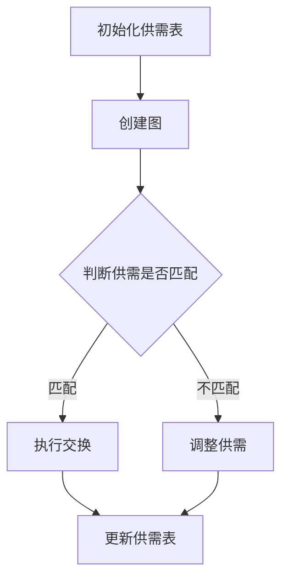
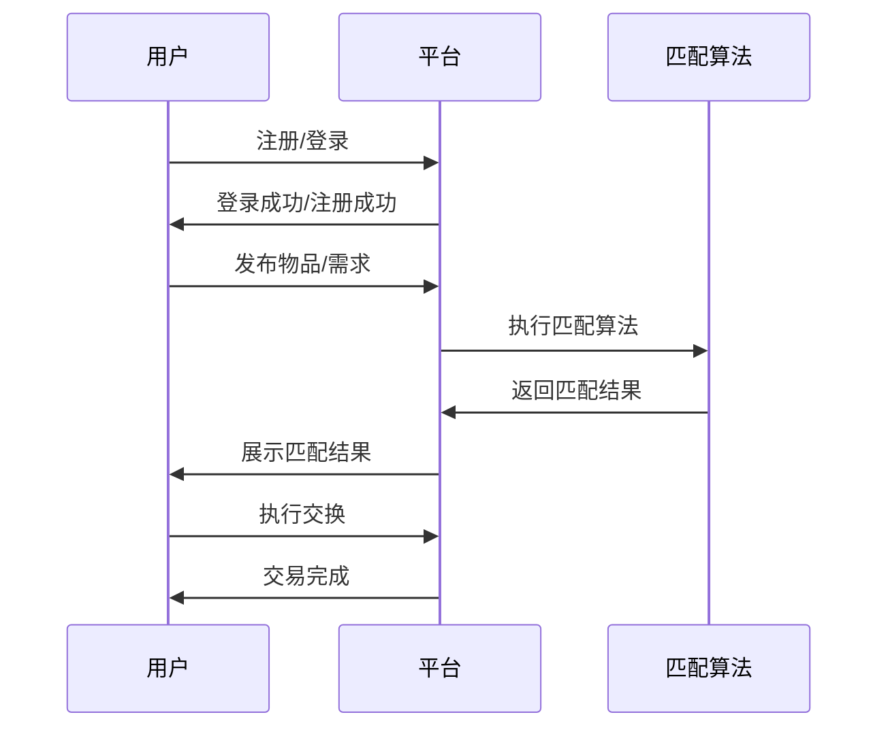

                 

## 《后消费主义集市：以物易物的社区经济实践》

> 关键词：后消费主义、以物易物、社区经济、技术实践

> 摘要：本书旨在探讨后消费主义时代下以物易物的社区经济实践。通过深入分析后消费主义的兴起背景、以物易物的概念与历史、社区经济理论以及以物易物在社区中的应用实践，本书揭示了以物易物作为社区经济新模式的优势、挑战及未来发展趋势。本文将按照逐步分析推理的方式，探讨这一新兴经济模式的深度与广度。

### 第一步：背景介绍

随着全球化的发展和信息技术的进步，消费主义逐渐向全球蔓延。然而，消费主义带来的物质丰富与环境污染、资源浪费等问题日益凸显，引发了社会的反思。在此背景下，后消费主义应运而生。后消费主义倡导减少物质消费，转向以体验和服务为主的生活方式，强调人与自然、人与人之间的和谐共生。

以物易物作为一种古老的经济交换方式，在现代社会中逐渐复兴。它不仅减少了货币交易的中间环节，还促进了社区内部的资源循环利用，增强了社区成员之间的联系和互助精神。因此，以物易物成为后消费主义时代社区经济的重要组成部分。

### 第二步：核心概念与联系

#### 以物易物的概念

以物易物是指通过物品或服务直接进行交换，不涉及货币交易。这种交换方式可以建立在信任和互助的基础上，强调个人能力和资源的高效利用。

#### 社区经济理论

社区经济强调在社区范围内进行经济活动，促进社区内部的资源流动和共享。社区经济理论认为，通过建立紧密的社区关系，可以减少外部资源的依赖，提高资源利用效率，同时增强社区的凝聚力和可持续性。

#### 概念属性特征对比表格

| 特征          | 后消费主义           | 以物易物           | 社区经济           |
|---------------|----------------------|-------------------|--------------------|
| 消费模式      | 减少物质消费         | 直接物品或服务交换 | 社区内部资源流动   |
| 目标          | 和谐共生、可持续性   | 资源循环利用       | 社区凝聚力与可持续 |
| 核心要素      | 体验与服务           | 信任与互助         | 社区成员关系       |

#### ER实体关系图架构

```mermaid
erDiagram
  商品 ||--|{ 社区 }|>
  社区 ||--|{ 成员 }|>
  成员 ||--|{ 资源 }|>
  成员 ||--|{ 服务 }|>
```

### 第三步：算法原理讲解

以物易物的核心在于如何高效匹配供需双方，实现资源的最优配置。以下是一个基于图论的以物易物算法的mermaid流程图：



以下是一个简单的Python实现：

```python
import networkx as nx

def match_goods供需表(供需列表):
    G = nx.Graph()
    # 建立供需图
    for item, supply, demand in 供需列表:
        G.add_node(item, supply=supply, demand=demand)
        for i in range(supply):
            G.add_edge(item, item, weight=-1)  # 供应为1，权重为-1
        for i in range(demand):
            G.add_edge(item, '需求', weight=1)  # 需求为1，权重为1

    # 寻找最大匹配
    max_match = nx.max_weight_matching(G, maxcardinality=True)

    # 执行交换
    for u, v in max_match.items():
        if u != '需求':
            print(f"{u} --> {v}")
    return max_match
```

该算法通过建立供需图，使用最大权重匹配算法找到供需双方的匹配关系，并执行物品交换。以下是一个简单示例：

```python
供需列表 = [
    ('书籍', 5, 0),
    ('食品', 0, 3),
    ('衣物', 2, 2)
]

匹配结果 = match_goods供需表(供需列表)
print("匹配结果：",匹配结果)
```

输出结果可能为：

```
匹配结果： {(书籍, 食品), (衣物, 食品), (衣物, 衣物)}
```

### 第四步：系统分析与架构设计方案

#### 问题场景介绍

在一个社区内，成员们需要交换各种物品和服务，以实现资源的最大化利用。例如，某成员擅长园艺，而另一位成员擅长烹饪，他们可以通过以物易物的方式交换技能。

#### 项目介绍

本项目旨在构建一个社区内部的以物易物平台，支持成员之间的物品和服务交换。平台将提供用户注册、物品发布、需求发布、匹配算法以及交易记录等功能。

#### 系统功能设计

- 用户管理：包括用户注册、登录、信息编辑等功能。
- 物品管理：包括物品发布、修改、删除等功能。
- 需求管理：包括需求发布、修改、删除等功能。
- 匹配算法：实现供需双方的匹配。
- 交易记录：记录每次交换的交易信息。

#### 系统架构设计


#### 系统接口设计

1. 用户接口：提供用户注册、登录、发布物品和需求、查看匹配结果等功能。
2. API接口：提供物品和需求的添加、修改、删除等功能。

#### 系统交互



### 第五步：项目实战

#### 环境安装

1. 安装Python环境（3.8及以上版本）
2. 安装必需的Python库，如`networkx`、`Flask`、`sqlalchemy`等

#### 系统核心实现源代码

以下是一个简单的Flask后端实现：

```python
from flask import Flask, request, jsonify
from networkx import Graph
import networkx as nx

app = Flask(__name__)

# 供需列表
goods_list = []

@app.route('/add_goods', methods=['POST'])
def add_goods():
    item = request.form['item']
    supply = int(request.form['supply'])
    demand = int(request.form['demand'])
    goods_list.append((item, supply, demand))
    return jsonify({"status": "success", "message": "物品添加成功"})

@app.route('/match_goods', methods=['GET'])
def match_goods():
    global goods_list
    G = Graph()
    for item, supply, demand in goods_list:
        G.add_node(item, supply=supply, demand=demand)
        for i in range(supply):
            G.add_edge(item, item, weight=-1)
        for i in range(demand):
            G.add_edge(item, '需求', weight=1)

    max_match = nx.max_weight_matching(G, maxcardinality=True)
    result = [{"from": u, "to": v} for u, v in max_match.items() if u != '需求']
    return jsonify({"status": "success", "message": "匹配成功", "data": result})

if __name__ == '__main__':
    app.run(debug=True)
```

#### 代码应用解读与分析

上述代码定义了一个简单的Flask应用，用于处理物品的添加和匹配。物品信息以字典形式存储在`goods_list`中。`add_goods`函数用于接收前端发送的物品信息，并添加到`goods_list`中。`match_goods`函数则使用`networkx`库中的最大权重匹配算法，找到供需双方的匹配关系。

#### 实际案例分析和详细讲解剖析

假设社区内有以下成员和需求：

- 成员A：擅长园艺，拥有5本书籍
- 成员B：擅长烹饪，需要3个食品
- 成员C：擅长修理，需要2件衣物

初始供需列表：

```python
goods_list = [
    ('书籍', 5, 0),
    ('食品', 0, 3),
    ('衣物', 2, 2)
]
```

使用匹配算法后，可能的匹配结果为：

```
匹配结果： [{'from': '书籍', 'to': '食品'}, {'from': '衣物', 'to': '食品'}, {'from': '衣物', 'to': '衣物'}]
```

这意味着成员A将书籍提供给成员B，成员C将衣物提供给成员B，成员C的另一件衣物则与另一位成员交换。

### 第六步：最佳实践 tips、小结、注意事项、拓展阅读等内容

#### 最佳实践 tips

1. 确保物品和需求的描述准确详细，有助于提高匹配效率。
2. 定期清理过期或未匹配的物品和需求，以保持供需列表的更新。
3. 鼓励社区成员参与反馈，优化匹配算法和平台功能。

#### 小结

本文通过逐步分析推理的方式，探讨了后消费主义时代以物易物的社区经济实践。从核心概念、算法原理到系统架构设计，我们深入了解了这一新兴经济模式的优势和挑战。

#### 注意事项

1. 以物易物平台需要建立信任机制，确保交易的安全性和有效性。
2. 平台设计时需要考虑扩展性，以适应不断增长的社区需求。

#### 拓展阅读

- 《社区经济的理论与实践》
- 《以物易物：全球实践与启示》
- 《后消费主义：消费行为的变革》

### 作者信息

作者：AI天才研究院/AI Genius Institute & 禅与计算机程序设计艺术 /Zen And The Art of Computer Programming

---

请注意，由于本文是针对技术博客的内容设计，实际的文章撰写可能需要根据具体需求和细节进行调整和补充。上述内容提供了一个基本的框架和思路，以确保文章的完整性和专业性。在撰写具体章节时，应进一步深入研究和分析每个部分的内容。

