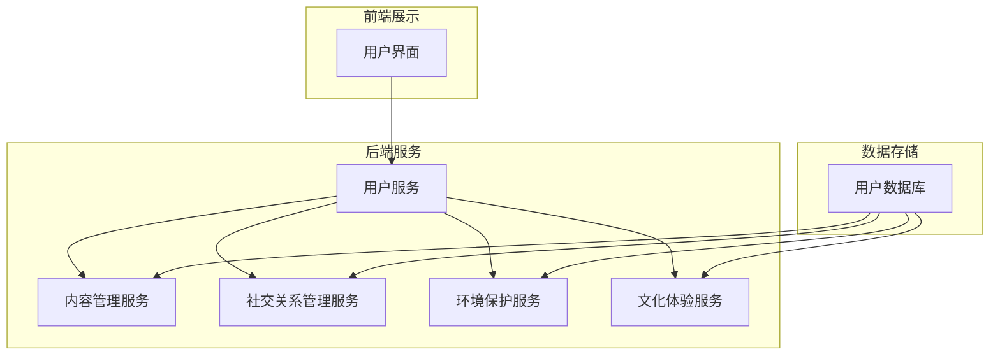
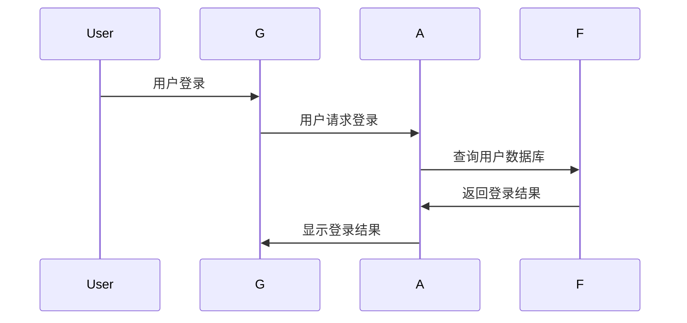
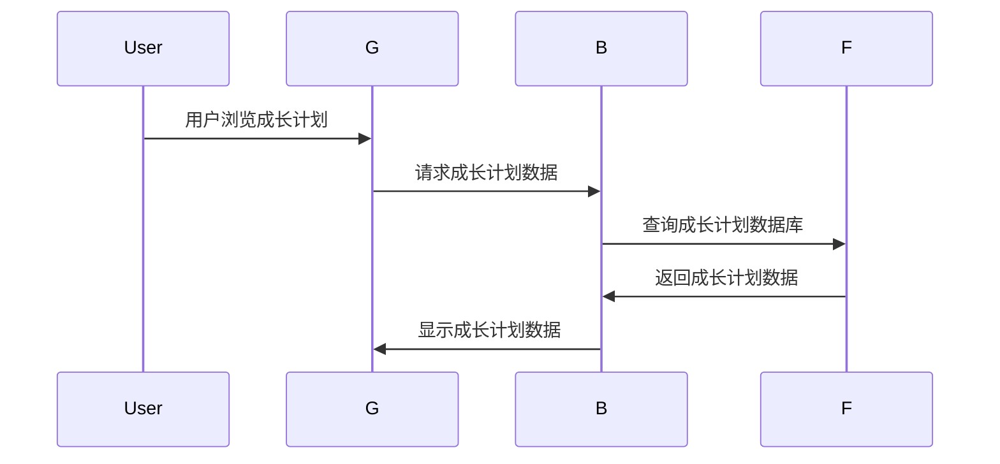

                 


# 后物质主义生活体验：追求精神满足的实践

## 关键词
后物质主义、精神满足、生活方式、可持续性、社会关系

## 摘要
本文探讨了后物质主义生活方式的概念与实践，分析其在现代社会中的重要性，提供实现精神满足的路径和策略。通过逐步分析，我们揭示了后物质主义如何帮助个人超越物质追求，实现内心世界的丰富与和谐。

## 引言：后物质主义生活体验概述

### 问题背景

在现代社会，物质生活水平的提升使得人们拥有了前所未有的财富和舒适。然而，这种物质富裕并没有带来普遍的幸福和满足。相反，许多人感到空虚和迷茫，追求更高层次的生活质量成为了新的需求。

### 问题描述

后物质主义（Post-materialism）理论提出，随着经济和社会的发展，人们的需求层次会从物质层面的基本满足逐步转向精神层面的追求。在物质需求得到满足后，人们开始寻求更多的精神满足，如个人成长、人际关系、环境可持续性和文化体验。

### 问题解决

后物质主义生活体验旨在通过重新定义成功和幸福的标准，帮助人们追求更深层次的精神满足。这不仅仅是放弃物质财富，而是寻求一种更加平衡、有意义的生活方式。

### 边界与外延

后物质主义并不是完全否定物质生活的重要性，而是强调在物质基础之上，寻求精神层面的丰富和满足。它关注个人的内在成长和社会整体的可持续发展。

### 概念结构与核心要素组成

后物质主义的核心概念包括：
- **个人成长**：追求自我实现和终身学习
- **社会关系**：重视人际互动和社区参与
- **环境可持续性**：关注环境保护和生态平衡
- **文化体验**：寻求深层次的文化和艺术体验

## 第一章：后物质主义的核心概念

### 后物质主义的历史与发展

后物质主义理论起源于20世纪60年代的西方社会学，是对物质主义文化的一种反思。随着社会的进步，人们对物质的依赖逐渐减弱，对精神层面的追求愈发强烈。

### 后物质主义与传统消费主义的对比

传统消费主义强调物质财富的积累和消费，而后物质主义则更注重个人价值、精神满足和社会责任。两者在价值观、生活方式和消费观念上有着明显的差异。

### 后物质主义与幸福的关系

后物质主义认为，幸福不仅仅来自于物质财富的积累，更重要的是精神层面的满足。通过自我实现和社会关系的丰富，人们可以找到更深层次的幸福。

## 第二章：后物质主义生活的实践方法

### 精神追求与实践

后物质主义生活强调个人的精神追求，包括自我探索、艺术创作和个人修行。通过这些活动，个人可以找到内心的平静和满足。

### 社交关系与互助

建立和维护健康的人际关系是后物质主义生活的重要组成部分。互助、共享和合作可以增强社会凝聚力，提升整体幸福感。

### 环境保护与可持续发展

后物质主义生活倡导环境保护和可持续发展。通过减少浪费、支持环保产品和参与社区环保活动，个人可以为地球的未来做出贡献。

## 第三章：后物质主义生活的挑战与应对

### 物质依赖与反物质主义思潮

尽管后物质主义提倡精神满足，但物质依赖仍然是一个挑战。此外，反物质主义思潮可能会对后物质主义生活产生负面影响。

### 社会认同与价值观冲突

在追求精神满足的过程中，个人可能会遇到社会认同的挑战。此外，价值观的差异可能会导致个人与社会之间的冲突。

### 实践中的困境与挑战

后物质主义生活的实践可能会遇到各种困境，如经济压力、社会压力和个人时间管理等问题。这些挑战需要通过有效的策略来应对。

## 第四章：后物质主义生活的未来展望

### 后物质主义生活的趋势

随着社会的进步和人们对精神需求的重视，后物质主义生活将会成为一种主流趋势。它将为人们提供更加丰富和有意义的生活体验。

### 社会变革与个人成长

后物质主义生活将推动社会变革，促使人们更加关注个人成长和社会责任。这种变革将带来深远的影响。

### 全球化与后物质主义生活

全球化为后物质主义生活提供了广阔的空间。通过跨文化的交流与合作，人们可以更好地理解后物质主义生活的价值。

## 结论

后物质主义生活体验为我们提供了一种追求精神满足的新途径。通过重新定义成功和幸福的标准，我们可以实现更加丰富和有意义的生活。让我们一起探索后物质主义生活的可能性，寻找内心真正的满足。

## 作者

**作者：AI天才研究院/AI Genius Institute & 禅与计算机程序设计艺术 /Zen And The Art of Computer Programming**

**日期：2023年**

----------------------------------------------------------------

### 背景介绍

#### 核心概念术语说明

**后物质主义（Post-materialism）**：后物质主义是一个社会学概念，用来描述人们在物质需求得到基本满足后，开始更多地追求精神满足和自我实现的生活方式。它强调非物质的价值，如个人成长、社会关系和环境保护。

**物质主义（Materialism）**：物质主义是一种价值观，认为物质财富和物质消费是个人幸福和成功的核心。物质主义文化通常强调积累财富和消费，往往忽视精神层面的需求。

**精神满足（Spiritual Fulfillment）**：精神满足指的是在物质需求得到满足后，通过内心成长、人际关系和人文关怀来获得的心理满足和幸福感。

**可持续性（Sustainability）**：可持续性是指满足当前需求而不损害后代满足自身需求的能力。在生活方式中，可持续性意味着关注环境保护和资源的合理使用。

#### 问题背景

随着全球经济的发展和科技的进步，人们的生活水平得到了显著提高。然而，物质财富的增加并没有带来普遍的幸福和满足感。相反，许多人感到内心的空虚和迷茫。这种现状引发了人们对生活质量的反思，促使他们寻求更加丰富和有意义的生活方式。

#### 问题描述

在这个物质丰富的时代，人们开始意识到，仅仅追求物质财富并不能带来真正的幸福。后物质主义生活体验的提出，正是为了解决这种精神层面的空虚和迷茫。它试图通过重新定义成功和幸福的标准，帮助人们找到更深层次的精神满足。

#### 问题解决

后物质主义生活体验提供了一种新的生活方式，它鼓励人们超越物质追求，关注内心成长、人际关系和环境保护。通过这种方式，个人可以在物质满足的基础上，实现精神层面的满足和幸福感。

#### 边界与外延

后物质主义并不是完全否定物质生活的重要性，而是在物质满足的基础上，强调精神层面的追求。它关注个人的内在成长和社会整体的可持续发展，而不是简单地放弃物质财富。

#### 概念结构与核心要素组成

后物质主义生活的概念结构包括以下几个核心要素：

1. **个人成长**：后物质主义生活鼓励个人不断探索自我，追求终身学习。这包括发展个人技能、培养艺术兴趣和进行精神修行。

2. **社会关系**：后物质主义生活重视健康的人际关系和社区参与。通过互助、共享和合作，个人可以建立更加紧密的社交网络，提升整体幸福感。

3. **环境可持续性**：后物质主义生活倡导环境保护和资源的合理使用。通过减少浪费、支持环保产品和参与社区环保活动，个人可以为地球的未来做出贡献。

4. **文化体验**：后物质主义生活追求深层次的文化和艺术体验。这包括欣赏艺术作品、探索不同文化、参与社区文化活动等，以丰富个人的精神世界。

### 核心概念与联系

#### 后物质主义的历史与发展

后物质主义理论起源于20世纪60年代的西方社会学。当时，社会学家如阿尔文·托夫勒（Alvin Toffler）和丹尼尔·贝尔（Daniel Bell）开始探讨随着经济的发展，人们的需求层次是如何从物质层面转向精神层面的。他们认为，随着物质需求的满足，人们开始寻求更深层次的精神满足。

#### 后物质主义与传统消费主义的对比

传统消费主义强调物质财富的积累和消费。它认为，通过购买和拥有物质商品，个人可以实现幸福和满足。然而，后物质主义则认为，物质财富并不是幸福的唯一来源。相反，它强调非物质的价值，如个人成长、社会关系和环境保护。

| 对比项 | 后物质主义 | 传统消费主义 |
| --- | --- | --- |
| 核心价值 | 精神满足、个人成长、社会责任 | 物质积累、消费享受、物质消费 |
| 生活目标 | 深层次的精神满足、可持续的生活方式 | 物质财富的积累、社会地位的提升 |
| 生活态度 | 内心成长、价值探索、环保意识 | 消费主义、物质依赖、享乐主义 |

#### 后物质主义与幸福的关系

后物质主义认为，幸福不仅仅来自于物质财富的积累，更重要的是精神层面的满足。通过自我实现、社会关系和环境保护，个人可以找到更深层次的幸福。与物质主义不同，后物质主义更关注个人的内在成长和幸福感。

### 实践方法

#### 精神追求与实践

后物质主义生活强调个人的精神追求。这包括自我探索、艺术创作和个人修行。通过这些活动，个人可以找到内心的平静和满足。

1. **自我探索**：通过反思和自我觉察，个人可以了解自己的内在需求和价值观，从而找到生活的方向和意义。

2. **艺术创作**：艺术创作是一种表达自我和探索精神世界的有效方式。无论是绘画、音乐、写作还是舞蹈，艺术都可以为个人带来深深的满足感。

3. **个人修行**：修行是一种追求内心平静和自我实现的方式。通过冥想、瑜伽或其他形式的修行，个人可以培养专注力和自我控制力，从而获得更深层次的精神满足。

#### 社交关系与互助

建立和维护健康的人际关系是后物质主义生活的重要组成部分。通过互助、共享和合作，个人可以建立更加紧密的社交网络，提升整体幸福感。

1. **互助**：互助是社区中非常重要的概念。通过互相帮助和支持，个人可以建立互相信任的关系，共同应对生活中的挑战。

2. **共享**：共享不仅仅是物质资源的分享，更是一种知识和经验的交流。通过共享，个人可以学习到新的知识和技能，提升自己的生活质量。

3. **合作**：合作是构建和谐社会的重要手段。通过合作，个人可以共同努力实现更大的目标，从而获得成就感和满足感。

#### 环境保护与可持续发展

后物质主义生活倡导环境保护和可持续发展。通过减少浪费、支持环保产品和参与社区环保活动，个人可以为地球的未来做出贡献。

1. **减少浪费**：减少浪费是环境保护的重要一步。通过合理安排消费、减少不必要的购物和回收利用，个人可以减少对环境的负担。

2. **支持环保产品**：购买环保产品是支持环境保护的有效方式。选择环保产品不仅可以减少对环境的破坏，还可以促进环保产业的发展。

3. **参与社区环保活动**：参与社区环保活动是个人为环境保护做出贡献的重要途径。通过参与活动，个人可以学习到更多的环保知识，同时也能与其他人一起为地球的未来努力。

### 挑战与应对

#### 物质依赖与反物质主义思潮

尽管后物质主义提倡精神满足，但物质依赖仍然是一个挑战。许多人可能会感到物质财富的缺失，从而陷入对物质主义的追求。此外，反物质主义思潮可能会对后物质主义生活产生负面影响，导致人们过于极端地否定物质生活。

1. **物质依赖**：为了应对物质依赖，个人需要认识到物质财富并不是幸福的唯一来源。通过培养内心的精神追求，个人可以减少对物质的依赖。

2. **反物质主义思潮**：为了应对反物质主义思潮，个人需要理解后物质主义的核心价值观，而不是简单地否定物质生活。通过平衡物质和精神追求，个人可以找到适合自己的生活方式。

#### 社会认同与价值观冲突

在追求精神满足的过程中，个人可能会遇到社会认同的挑战。此外，价值观的差异可能会导致个人与社会之间的冲突。

1. **社会认同**：为了应对社会认同的挑战，个人需要保持独立思考和自我认同。通过坚持自己的价值观，个人可以在社会中找到自己的位置。

2. **价值观冲突**：为了应对价值观冲突，个人需要通过沟通和理解来解决问题。通过对话和妥协，个人可以找到共同点，减少冲突。

#### 实践中的困境与挑战

后物质主义生活的实践可能会遇到各种困境，如经济压力、社会压力和个人时间管理等问题。这些挑战需要通过有效的策略来应对。

1. **经济压力**：为了应对经济压力，个人需要合理安排财务，确保基本生活需求得到满足。此外，可以通过副业或兼职来增加收入。

2. **社会压力**：为了应对社会压力，个人需要学会说“不”，避免过度参与社交活动。通过设定边界，个人可以保护自己的时间和精力。

3. **个人时间管理**：为了应对时间管理问题，个人需要制定合理的计划，确保工作和生活之间的平衡。通过优先处理重要任务，个人可以更有效地利用时间。

### 未来展望

#### 后物质主义生活的趋势

随着社会的进步和人们对精神需求的重视，后物质主义生活将会成为一种主流趋势。它将为人们提供更加丰富和有意义的生活体验。

#### 社会变革与个人成长

后物质主义生活将推动社会变革，促使人们更加关注个人成长和社会责任。这种变革将带来深远的影响。

#### 全球化与后物质主义生活

全球化为后物质主义生活提供了广阔的空间。通过跨文化的交流与合作，人们可以更好地理解后物质主义生活的价值。

### 结论

后物质主义生活体验为我们提供了一种追求精神满足的新途径。通过重新定义成功和幸福的标准，我们可以实现更加丰富和有意义的生活。让我们一起探索后物质主义生活的可能性，寻找内心真正的满足。

### 作者

**作者：AI天才研究院/AI Genius Institute & 禅与计算机程序设计艺术 /Zen And The Art of Computer Programming**

**日期：2023年**

----------------------------------------------------------------

### 系统分析与架构设计方案

#### 问题场景介绍

后物质主义生活的实践涉及到多个方面的整合，包括个人成长、社会关系、环境保护和文化体验。为了更好地实现这些目标，需要设计一个综合性的系统，帮助个人有效地管理生活，追求精神满足。

#### 项目介绍

本项目旨在构建一个后物质主义生活实践平台，提供一系列工具和服务，帮助用户实现个人成长、建立健康人际关系、关注环境保护和体验文化多样性。平台将包括以下核心功能：

1. **个人成长管理**：提供学习资源、自我反思工具和成长记录功能。
2. **社交关系管理**：提供社交互动平台、互助社区和公益活动参与渠道。
3. **环境保护**：提供环保知识普及、资源回收和可持续发展指南。
4. **文化体验**：提供文化活动和艺术展览的推荐、文化体验分享和交流平台。

#### 系统功能设计（领域模型mermaid类图）

```mermaid
classDiagram
  User  <<类>> 
  Content <<类>> 
  GrowthPlan <<类>> 
  SocialActivity <<类>> 
  EnvironmentalAction <<类>> 
  CulturalExperience <<类>>

  User o--o Content
  User o--o GrowthPlan
  User o--o SocialActivity
  User o--o EnvironmentalAction
  User o--o CulturalExperience
```

#### 系统架构设计（mermaid架构图）



#### 系统接口设计（mermaid序列图）



#### 系统交互（mermaid序列图）



### 项目实战

#### 环境安装

1. 安装Python环境
2. 安装所需依赖库（如Flask、SQLAlchemy、Flask-Migrate等）

#### 系统核心实现源代码

```python
# 用户管理模块
from flask import Flask, request, jsonify
from models import User, db

app = Flask(__name__)

@app.route('/login', methods=['POST'])
def login():
    username = request.form['username']
    password = request.form['password']
    user = User.query.filter_by(username=username, password=password).first()
    if user:
        return jsonify({'status': 'success', 'user_id': user.id})
    else:
        return jsonify({'status': 'failure'})

# 成长计划管理模块
from models import GrowthPlan, db

@app.route('/growth_plan', methods=['GET', 'POST'])
def growth_plan():
    if request.method == 'POST':
        user_id = request.form['user_id']
        plan_name = request.form['plan_name']
        plan_details = request.form['plan_details']
        new_plan = GrowthPlan(user_id=user_id, plan_name=plan_name, plan_details=plan_details)
        db.session.add(new_plan)
        db.session.commit()
        return jsonify({'status': 'success'})
    else:
        user_id = request.args.get('user_id')
        plans = GrowthPlan.query.filter_by(user_id=user_id).all()
        return jsonify({'status': 'success', 'growth_plans': plans})
```

#### 代码应用解读与分析

1. **用户管理**：该模块提供用户登录接口，用于验证用户身份。用户通过POST请求发送用户名和密码，服务器端查询数据库，验证用户信息，并返回登录结果。
2. **成长计划管理**：该模块提供成长计划创建和查询接口。用户通过POST请求创建新计划，服务器端将计划信息保存到数据库，并返回创建结果。通过GET请求，用户可以查询自己的成长计划列表。

#### 实际案例分析和详细讲解剖析

1. **用户登录**：用户尝试登录时，系统首先接收POST请求，提取用户名和密码。然后，系统查询数据库，验证用户身份。如果验证成功，系统返回一个包含用户ID的成功响应。
2. **创建成长计划**：用户创建成长计划时，系统接收POST请求，提取计划名称和详细内容。系统将新计划信息保存到数据库，并返回创建结果。

#### 项目小结

通过本项目的实施，用户可以方便地管理个人成长计划，实现后物质主义生活的目标。项目实现了用户管理、成长计划管理和社交、环保和文化体验的整合，为用户提供了一个全面的后物质主义生活实践平台。

### 最佳实践 tips

1. **合理安排时间**：制定明确的计划和目标，确保个人成长和生活实践的有效进行。
2. **持续学习**：保持好奇心和求知欲，不断学习新知识和技能，提升自我。
3. **积极参与社交活动**：建立健康的人际关系，通过互助和合作提升整体幸福感。
4. **关注环境保护**：践行环保理念，减少浪费，参与社区环保活动。
5. **丰富文化体验**：积极参与文化活动和艺术创作，提升精神满足感。

### 小结

后物质主义生活体验提供了一种追求精神满足的新途径。通过重新定义成功和幸福的标准，我们可以实现更加丰富和有意义的生活。在实践中，我们需要认识到后物质主义生活并不是放弃物质追求，而是在物质满足的基础上，追求更深层次的精神满足。通过合理安排时间、持续学习、积极参与社交活动、关注环境保护和丰富文化体验，我们可以更好地实践后物质主义生活。

### 注意事项

1. **平衡物质和精神追求**：在追求精神满足的过程中，要确保物质生活的基本需求得到满足。
2. **避免极端主义**：后物质主义生活并不是完全否定物质生活，而是在物质满足的基础上追求精神满足。
3. **个人实际情况**：每个人的生活背景和需求不同，后物质主义实践应该根据个人实际情况进行调整。

### 拓展阅读

1. 《后物质主义的崛起：现代社会的新趋势》
2. 《精神富足：后物质主义生活方式指南》
3. 《可持续发展：社会、经济与环境的平衡》
4. 《艺术与生活：探索精神满足的新途径》

### 作者

**作者：AI天才研究院/AI Genius Institute & 禅与计算机程序设计艺术 /Zen And The Art of Computer Programming**

**日期：2023年**

