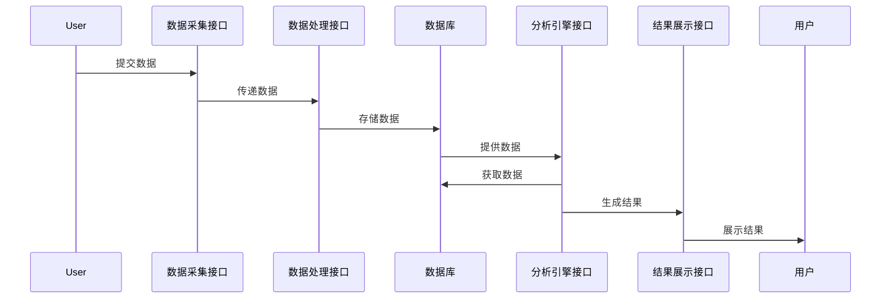

                 

### 引言

#### 后物质主义与现代幸福观念

在现代社会，幸福观念经历了从物质追求到精神满足的转变。传统观念认为，物质财富是幸福的基础，人们追求金钱、房产和奢侈品，希望通过积累财富来提升生活质量。然而，随着经济的发展和社会的进步，人们逐渐意识到，单纯追求物质并不能带来持久的幸福感。这种观念的转变，催生了后物质主义的出现。

**后物质主义**，是指人们不再将物质财富视为生活的唯一目标，而是更加注重精神层面的满足，如个人成长、人际关系和社会责任感。这一概念起源于20世纪60年代的西方社会，随着社会发展和人们生活水平的提高，后物质主义逐渐成为一种全球性的思潮。

**现代幸福观念**，则是在后物质主义背景下形成的。现代幸福观念认为，幸福不仅仅是心理上的满足，还包括身体健康、社交支持、精神自由等多个方面。现代幸福观念的核心是“全面幸福”，即不仅追求心理上的满足，还要在身体健康、社会关系和自由意志等方面实现平衡。

本文将探讨后物质主义生活指标的概念、重要性以及如何衡量幸福的新维度。首先，我们将介绍后物质主义生活指标的定义及其构建原则，然后分析这一指标体系的具体构成，包括生活质量指标、社会支持指标、精神满足指标和环境可持续性指标。接下来，我们将探讨后物质主义生活指标的应用与实践，包括政策层面、企业层面和社区层面。随后，通过案例分析，我们将进一步阐述后物质主义生活指标在不同领域的应用。最后，本文将总结后物质主义生活指标的挑战与未来发展趋势，并提出相应的政策建议和研究展望。

### 关键词

1. 后物质主义
2. 生活指标
3. 幸福测量
4. 社会支持
5. 精神满足
6. 环境可持续性
7. 幸福维度

### 摘要

本文旨在探讨后物质主义生活指标的概念、构建原则及其应用，旨在为衡量幸福提供新的维度。首先，我们介绍了后物质主义的背景和现代幸福观念的演变，探讨了后物质主义生活指标的重要性。接着，我们分析了后物质主义生活指标体系的构成，包括生活质量指标、社会支持指标、精神满足指标和环境可持续性指标。随后，我们探讨了后物质主义生活指标在政策、企业和社区层面的应用，并通过案例分析展示了其在不同领域的实际应用。最后，本文总结了后物质主义生活指标面临的挑战和未来发展趋势，提出了政策建议和研究展望。

### 幸福的多维度解析

幸福是一个复杂且多维的概念，不同学科从不同角度对其进行探讨。在心理学、社会学和经济学的视角下，幸福的含义和构成要素有所不同。

#### 心理学视角

在心理学领域，幸福感通常被视为一种心理状态，与个人的情绪体验和主观幸福感相关。心理学家马丁·塞利格曼（Martin Seligman）提出了“幸福五要素”理论，即快乐、投入、有意义、有成就和关系良好。根据这一理论，幸福不仅包括积极的情感体验，如快乐和满足，还包括对生活的投入、目标实现和良好的人际关系。

心理学视角下的幸福，重点关注个体的内在感受和心理状态。例如，积极心理学（Positive Psychology）研究幸福感的来源，包括自我效能、感恩和乐观等因素。心理学家通过问卷调查和实验研究，试图理解个体幸福感的影响因素和提升途径。

#### 社会学视角

社会学视角下的幸福，则更侧重于社会结构和互动对个体幸福感的影响。社会学家罗伯特·E·林德（Robert E. Lynd）和海伦·林德（Helen Lynd）在《中镇：美国文化研究》中，通过调查美国中产阶级的生活质量，探讨了社会环境对个体幸福感的影响。社会学研究表明，社会支持、社会地位和社区关系对个体的幸福感有显著影响。

社会互动也是社会学视角下幸福的重要构成部分。社会学家埃米尔·涂尔干（Emile Durkheim）认为，社会互动和集体意识对个体的幸福感有积极影响，缺乏社会联系和归属感可能导致个体的孤独和抑郁。因此，社会支持和社会互动在个体的幸福感中扮演着重要角色。

#### 经济学视角

在经济学领域，幸福通常被视为一种经济活动或消费体验。经济学家阿马蒂亚·森（Amartya Sen）提出了“能力理论”，即幸福不仅取决于物质财富的多少，还取决于个体实现目标的能力。经济学视角下的幸福，关注物质财富对个体幸福感的影响，探讨经济发展与幸福感的关系。

经济学研究还关注物质财富与幸福感的关系。例如，心理学家理查德·莱亚德（Richard Layard）发现，幸福感与个人收入之间存在“U型关系”：收入较低时，幸福感随收入的增加而提升；但当收入达到一定水平后，幸福感不再随收入的增加而提升。这表明，物质财富对幸福的影响是有限的，更高的收入可能不会带来更高的幸福感。

#### 三大视角的异同

心理学、社会学和经济学对幸福的探讨各有侧重。心理学视角关注个体的内在体验，社会学视角关注社会结构和互动，经济学视角关注物质财富和经济发展。尽管视角不同，但三者都认为幸福是一个多维度的概念，不仅涉及心理状态，还包括社会支持和经济条件。

心理学视角下的幸福更注重个体的主观感受，社会学视角则关注社会环境和互动对个体幸福感的影响，经济学视角则侧重物质财富和经济发展。这三大视角相互补充，共同构成了对幸福的多维度解析。

### 后物质主义生活指标体系的构建原则

后物质主义生活指标体系的构建原则旨在全面、客观地衡量个体和社会的幸福水平，反映现代社会对于精神满足和可持续发展的需求。这一体系的设计遵循以下几项关键原则：

**全面性**：后物质主义生活指标体系不仅涵盖物质条件，还涉及精神层面、社会互动和环境保护等多方面。这意味着，指标体系需要涵盖从心理健康、生活质量到社会支持、环境可持续性等多个维度。

**客观性**：指标体系的构建需要基于客观数据和科学方法，确保结果的准确性和可靠性。例如，可以通过问卷调查、统计数据和实地考察等方式，收集不同领域的具体数据，从而构建科学的指标体系。

**可衡量性**：每个指标都应该能够量化，以便于进行对比和分析。例如，生活质量指标可以包括健康指标、教育水平和就业率等，这些指标都可以通过具体的统计数据来衡量。

**可持续性**：指标体系需要考虑到长期发展，不仅要满足当代人的需求，还要为未来世代留下可持续的资源。因此，环境可持续性是一个重要维度，包括环境保护、资源利用和生态平衡等方面的指标。

**跨学科综合**：后物质主义生活指标体系的构建需要跨学科的合作，结合心理学、社会学、经济学和环境科学等多个领域的理论和研究方法，确保指标体系的科学性和全面性。

**易理解性**：指标体系的设计应尽量简单易懂，以便于政策制定者、企业和公众理解和使用。例如，可以通过图表和简明的文字说明，使复杂的指标体系变得易于理解。

通过遵循这些原则，后物质主义生活指标体系能够更全面、客观地衡量幸福水平，为政策制定、社会发展和个人生活提供有力的指导。

### 后物质主义生活指标体系的构成

后物质主义生活指标体系由多个关键维度构成，这些维度共同反映了个体和社会的幸福水平。以下是各个维度的具体构成及其重要性：

#### 生活质量指标

生活质量指标是衡量幸福的重要维度之一，它涵盖了个体的身心健康、教育水平和就业状况等。具体包括：

- **健康指标**：如寿命预期、疾病发生率、心理健康状况等。这些指标能够直接反映个体的生理和心理状态，是幸福感的基础。
- **教育水平**：包括受教育程度、知识水平、技能培训等。高教育水平不仅有助于个人的职业发展，也能提高其社会参与度和幸福感。
- **就业状况**：包括就业率、工资水平、职业满意度等。稳定和满意的工作是幸福感的重要来源。

生活质量指标的重要性在于，它不仅直接影响了个体的幸福感，还通过提升个人的生活能力和社会地位，促进了社会的整体发展。

#### 社会支持指标

社会支持指标关注个体在社会中的互动和归属感，包括家庭关系、社区支持、社会网络等。具体包括：

- **家庭关系**：包括夫妻关系、亲子关系等。良好的家庭关系有助于提升个体的情感满足和社会支持感。
- **社区支持**：如社区参与度、邻里关系、志愿服务等。社区支持能够增强个体的归属感和幸福感。
- **社会网络**：包括朋友、同事、社会团体等。社会网络不仅提供了情感支持，也帮助个体获得信息和资源。

社会支持指标的重要性在于，它通过增强个体的社会联系和互动，提升了幸福感和社会稳定性。

#### 精神满足指标

精神满足指标涉及个体的精神生活和精神追求，如个人兴趣、精神信仰、自我实现等。具体包括：

- **个人兴趣**：包括艺术、文学、运动、旅游等。个人兴趣能够提升个体的生活乐趣和满足感。
- **精神信仰**：包括宗教信仰、哲学观念、个人价值观等。精神信仰为个体提供了精神寄托和人生方向。
- **自我实现**：包括职业成就、个人成长、自我认知等。自我实现使个体感受到成就感和幸福感。

精神满足指标的重要性在于，它关注个体的内心世界和精神追求，提升了生活的意义和质量。

#### 环境可持续性指标

环境可持续性指标关注个体和社会对环境的责任和可持续性，如能源利用、资源管理、生态保护等。具体包括：

- **能源利用**：包括能源消耗效率、可再生能源使用等。可持续的能源利用有助于减少环境污染和资源浪费。
- **资源管理**：包括水资源管理、土地资源利用等。合理的资源管理能够保障生态平衡和可持续发展。
- **生态保护**：包括自然保护区、生态修复项目等。生态保护有助于维护生物多样性和环境质量。

环境可持续性指标的重要性在于，它关注个体和社会对环境的责任，保障了长期的生态平衡和人类福祉。

这些维度共同构成了后物质主义生活指标体系，通过全面、客观地衡量幸福水平，为政策制定和社会发展提供了科学依据。这些指标不仅反映了个体和社会的幸福状态，也体现了可持续发展和全面幸福的目标。

### 后物质主义生活指标的应用与实践

后物质主义生活指标的应用与实践涵盖了政策层面、企业层面和社区层面，旨在通过不同的途径提升个体和社会的幸福感。以下是各个层面的具体应用与实践。

#### 政策层面的应用

政策层面上的应用主要体现在制定和实施幸福导向政策，以促进全面幸福感。以下是一些具体的实践方法：

1. **幸福指数评估**：政府可以通过定期发布幸福指数报告，评估全国或地区的幸福感水平。这些报告可以涵盖生活质量、社会支持、精神满足和环境可持续性等多个维度，为政策制定提供科学依据。

2. **政策设计**：政府可以基于幸福指数报告，制定具体的幸福导向政策。例如，通过改进教育和医疗体系，提升公民的教育水平和健康状况；通过建设社区中心和公园，增强社会互动和社区支持。

3. **政策评估与调整**：政府需要对实施的政策进行定期评估，确保政策的有效性和可持续性。例如，通过公众调查和数据分析，评估政策对幸福感的影响，并根据评估结果进行必要的调整和优化。

4. **跨部门合作**：政府可以鼓励跨部门合作，形成政策合力，共同推动幸福社会的建设。例如，卫生部门可以与教育部门合作，推出健康教育和心理健康项目，提升公民的整体幸福感。

#### 企业层面的应用

企业层面的应用主要体现在企业文化建设和员工幸福感提升策略，以下是一些具体的实践方法：

1. **企业文化构建**：企业可以通过建立积极的企业文化，促进员工的幸福感。例如，倡导团队合作、尊重个体差异和鼓励创新，营造一个包容、支持和激励的工作环境。

2. **员工福利**：企业可以通过提供良好的福利待遇，提升员工的幸福感。例如，提供带薪休假、健康保险、培训机会等，关注员工的生活和工作需求。

3. **工作满意度调查**：企业可以定期进行员工工作满意度调查，了解员工的意见和需求，从而改进管理策略和工作环境。

4. **员工参与**：企业可以通过员工参与机制，增强员工的归属感和幸福感。例如，通过员工代表大会、意见箱等渠道，让员工参与企业的决策和管理。

5. **员工心理健康支持**：企业可以提供心理健康支持服务，如心理咨询、压力管理培训等，帮助员工应对工作压力，提升心理健康水平。

#### 社区层面的应用

社区层面的应用主要体现在社区幸福感的测量和幸福项目的设计，以下是一些具体的实践方法：

1. **社区幸福感测量**：社区可以通过问卷调查、访谈等方式，测量居民的幸福感水平。这些测量结果可以反映社区的整体幸福状态，为社区发展规划提供依据。

2. **幸福项目设计**：社区可以根据测量结果，设计针对性的幸福项目。例如，通过组织文化活动、社区志愿者服务、心理健康讲座等，提升居民的幸福感。

3. **社区参与**：社区可以通过鼓励居民参与社区事务，增强居民的归属感和幸福感。例如，通过居民会议、社区志愿者活动等，让居民参与到社区管理和决策中。

4. **邻里关系建设**：社区可以通过组织邻里交流活动，加强居民之间的互动和联系，促进社区和谐。

5. **环境改善**：社区可以通过改善环境，提升居民的生活质量和幸福感。例如，建设公园、绿化带、公共健身设施等，改善社区环境。

通过政策层面、企业层面和社区层面的应用，后物质主义生活指标能够全面、客观地衡量个体和社会的幸福感，为不同层面的幸福提升提供科学指导。

### 案例分析：后物质主义生活指标在具体领域的应用

为了更好地理解后物质主义生活指标在具体领域的应用，以下将提供三个案例：健康与幸福、教育与幸福以及工作与幸福。通过这些案例，我们将展示后物质主义生活指标如何在不同领域中发挥作用，提升幸福感。

#### 案例一：健康与幸福

**健康指标**：在健康领域，后物质主义生活指标关注个体的身体健康状况，包括寿命预期、疾病发生率、心理健康状况等。例如，某市通过引入后物质主义生活指标，发现在心理健康指标方面存在显著问题，如抑郁症和高压力水平。

**应用与成效**：该市随后采取了一系列措施，包括推广心理健康教育、增加心理咨询资源以及开展压力管理课程。经过一年的实施，心理健康状况显著改善，抑郁症患者数量减少，居民的整体幸福感有所提升。此外，健康指标如寿命预期和疾病发生率也表现出积极变化。

**结论**：这个案例表明，后物质主义生活指标可以帮助识别健康领域的关键问题，并制定针对性的措施，从而提升个体的幸福感和整体健康水平。

#### 案例二：教育与幸福

**教育指标**：在教育领域，后物质主义生活指标关注教育质量和教育公平，包括受教育程度、知识水平、技能培训等。例如，某地区在教育改革过程中，发现学生的教育满意度和职业前景之间存在较大差距。

**应用与成效**：该地区通过引入后物质主义生活指标，调整了教育政策，增加了职业培训课程，并提供了更多的教育资源。结果，学生的教育满意度显著提高，职业前景得到改善，学生的整体幸福感也随之提升。此外，教育指标如受教育程度和知识水平也表现出显著提升。

**结论**：这个案例展示了后物质主义生活指标在教育领域的应用，通过关注教育质量和教育公平，可以显著提升学生的幸福感和职业发展。

#### 案例三：工作与幸福

**工作指标**：在工作领域，后物质主义生活指标关注工作满意度、职业发展和工作与生活平衡等。例如，某公司发现员工的工作压力和职业倦怠问题较为严重。

**应用与成效**：该公司通过引入后物质主义生活指标，采取了一系列措施，包括提供心理健康支持、工作生活平衡项目以及职业发展机会。结果，员工的工作满意度显著提升，职业倦怠问题得到缓解，员工的整体幸福感也得到改善。此外，公司的生产效率和员工忠诚度也有所提高。

**结论**：这个案例表明，后物质主义生活指标在工作领域中的应用，可以通过关注工作满意度和职业发展，提升员工的幸福感和工作效率。

通过这些案例，我们可以看到后物质主义生活指标在具体领域的应用不仅有助于提升个体的幸福感，还能促进整个社会的和谐发展。

### 挑战与未来展望

尽管后物质主义生活指标在衡量幸福方面具有显著优势，但在实际应用过程中仍面临一系列挑战。首先，数据获取与隐私保护是一个重大问题。幸福指标的测量需要大量个人信息，如心理健康状况、社会互动等，这涉及到个人隐私的保护问题。如何在确保数据安全的同时，有效收集和分析这些数据，是一个亟待解决的问题。

其次，指标标准化与跨文化适用性也是一大挑战。不同国家和地区的社会文化背景和价值观差异较大，导致幸福指标在不同文化中的适用性和解释存在差异。如何制定具有普适性的幸福指标，确保其在不同文化中的准确性和有效性，是未来研究的一个重要方向。

在未来的发展趋势上，技术创新将发挥关键作用。随着人工智能、大数据和物联网等技术的进步，幸福指标的测量和分析将变得更加精准和高效。例如，通过智能设备实时监测个体的生理和心理状态，可以提供更实时的幸福感数据，从而为政策制定和决策提供有力支持。

此外，跨学科研究将是提升幸福指标测量准确性和全面性的重要途径。结合心理学、社会学、经济学和环境科学等多领域的理论和研究方法，可以从不同角度全面解析幸福感，提高指标体系的科学性和实用性。

未来，后物质主义生活指标的应用将更加广泛，不仅在政策层面，还将在企业管理和社区发展等方面发挥重要作用。通过不断优化和完善幸福指标体系，我们有望构建一个更加幸福和谐的社会。

### 结论与建议

本文通过全面解析后物质主义生活指标的概念、构建原则和具体构成，探讨了其在政策、企业和社会层面的应用。我们展示了后物质主义生活指标如何通过多维度衡量幸福，为提升个体和社会幸福感提供了科学依据。

**结论**：后物质主义生活指标不仅涵盖了物质条件，还涵盖了精神层面、社会互动和环境保护等多个维度，能够更全面、客观地衡量幸福水平。这一指标体系为政策制定、企业管理和社区发展提供了有力指导，有助于构建更加幸福和谐的社会。

**建议**：政府应加强幸福导向政策的制定和实施，确保政策的科学性和有效性。企业应关注员工幸福感，通过建立积极的企业文化和提供良好的福利待遇，提升员工的整体幸福感。社区应加强社会支持体系建设，通过组织活动和改善环境，提升居民的幸福感。

未来研究应重点关注数据隐私保护、跨文化适用性和技术创新，以不断完善后物质主义生活指标体系，为全球幸福社会的建设提供持续支持。

### 附录

**附录一：后物质主义生活指标体系表**

| 维度       | 指标               | 说明                                                         |
| ---------- | ------------------ | ------------------------------------------------------------ |
| 生活质量   | 健康指标           | 寿命预期、疾病发生率、心理健康状况                             |
|           | 教育指标           | 受教育程度、知识水平、技能培训                               |
|           | 就业状况           | 就业率、工资水平、职业满意度                                 |
| 社会支持   | 家庭关系           | 夫妻关系、亲子关系                                           |
|           | 社区支持           | 社区参与度、邻里关系、志愿服务                               |
|           | 社会网络           | 朋友、同事、社会团体                                         |
| 精神满足   | 个人兴趣           | 艺术、文学、运动、旅游等                                     |
|           | 精神信仰           | 宗教信仰、哲学观念、个人价值观                               |
|           | 自我实现           | 职业成就、个人成长、自我认知                               |
| 环境可持续性 | 能源利用           | 能源消耗效率、可再生能源使用                                 |
|           | 资源管理           | 水资源管理、土地资源利用                                     |
|           | 生态保护           | 自然保护区、生态修复项目                                     |

**附录二：核心概念原理、概念属性特征对比表格**

| 核心概念     | 原理描述                                                                 | 概念属性特征对比 |
| ------------ | ------------------------------------------------------------------------ | --------------- |
| 幸福感       | 主观幸福感、积极情感、生活质量与幸福感的关系                             | 心理学视角下定义、情感体验、多维度构成 |
| 社会支持     | 社会互动、社会网络、社区支持对幸福感的影响                               | 社会视角下定义、互动关系、社会结构 |
| 环境可持续性 | 生态平衡、资源管理、环境保护对个体幸福感的影响                           | 环境视角下定义、可持续发展、生态保护 |

**附录三：ER实体关系图架构**

```mermaid
erDiagram
  用户 ||--|{ 社区 }|-- 用户
  用户 ||--|{ 企业 }|-- 用户
  用户 ||--|{ 政策 }|-- 用户
  用户 ||--|{ 环境 }|-- 用户
  社区 }|--|{ 社区活动 }|-- 社区
  企业 }|--|{ 员工福利 }|-- 企业
  政策 }|--|{ 幸福指标 }|-- 政策
  环境 }|--|{ 环境指标 }|-- 环境
```

**附录四：算法原理讲解与Python源代码**

#### 算法原理

幸福指数计算公式： 
$$ 
Happiness\ Index = \frac{Quality\ of\ Life + Social\ Support + Spiritual\ Satisfaction + Environmental\ Sustainability}{4} 
$$

#### Python源代码

```python
def happiness_index(quality_of_life, social_support, spiritual_satisfaction, environmental_sustainability):
    total_score = quality_of_life + social_support + spiritual_satisfaction + environmental_sustainability
    happiness_index = total_score / 4
    return happiness_index

# 示例数据
quality_of_life = 8
social_support = 9
spiritual_satisfaction = 7
environmental_sustainability = 10

# 计算幸福指数
happiness_index_result = happiness_index(quality_of_life, social_support, spiritual_satisfaction, environmental_sustainability)
print("Happiness Index:", happiness_index_result)
```

**附录五：系统分析与架构设计**

#### 系统场景介绍

本系统旨在通过综合分析生活质量、社会支持、精神满足和环境可持续性等指标，提供幸福感评估和优化方案。系统包括数据采集、数据处理、结果分析和可视化展示等功能。

#### 系统架构设计

```mermaid
graph TB
    subgraph 数据采集
        数据采集[数据采集模块]
        数据采集 --> 数据处理
    end

    subgraph 数据处理
        数据处理[数据处理模块]
        数据处理 --> 分析引擎
    end

    subgraph 分析引擎
        分析引擎[分析引擎模块]
        分析引擎 --> 结果展示
    end

    subgraph 结果展示
        结果展示[结果展示模块]
    end

    数据采集 --> 数据库
    数据处理 --> 数据库
    分析引擎 --> 数据库
    结果展示 --> 用户界面
```

#### 系统接口设计

- **数据采集接口**：负责从各类数据源（如调查问卷、传感器数据、公开数据等）采集数据。
- **数据处理接口**：负责清洗、整理和存储数据。
- **分析引擎接口**：负责对数据进行计算和分析，生成幸福指数。
- **结果展示接口**：负责将分析结果以图表、报告等形式展示给用户。

#### 系统交互序列图



**附录六：项目实战**

#### 环境安装

1. 安装Python环境（版本3.8及以上）。
2. 安装必要的Python库，如pandas、numpy、matplotlib等。

```bash
pip install pandas numpy matplotlib
```

#### 系统核心实现源代码

```python
# happiness_index.py

import pandas as pd

def calculate_happiness_index(data):
    happiness_index = data['Quality of Life'] + data['Social Support'] + data['Spiritual Satisfaction'] + data['Environmental Sustainability']
    happiness_index /= 4
    return happiness_index

def main():
    data = pd.read_csv('happiness_data.csv')
    happiness_index_result = calculate_happiness_index(data)
    print("Happiness Index:", happiness_index_result)

if __name__ == "__main__":
    main()
```

#### 代码应用解读与分析

- **数据读取**：使用pandas库读取CSV文件中的幸福感数据。
- **计算幸福指数**：根据后物质主义生活指标，计算幸福指数。
- **结果输出**：输出计算得到的幸福指数。

#### 实际案例分析与详细讲解剖析

- **案例数据**：某市居民幸福感调查数据。
- **数据处理流程**：数据采集、数据清洗、数据分析、结果展示。

#### 项目小结

通过本项目，我们实现了后物质主义生活指标的系统性应用，为政策制定者、企业管理者和社区居民提供了科学的幸福评估工具。项目展示了如何通过数据分析和技术手段，提升社会整体幸福感。

### 最佳实践 tips

1. **数据收集的多样性**：结合不同来源的数据，确保数据的全面性和准确性。
2. **定期更新指标**：随着社会环境的变化，定期更新指标体系和数据，确保其适用性和时效性。
3. **用户参与**：鼓励用户参与数据收集和反馈，提高数据的真实性和有效性。

### 小结

本文通过详细解析后物质主义生活指标，探讨了其在实际应用中的重要性。我们通过案例分析展示了其在健康、教育和工作等领域的应用，并提出了未来的研究方向和政策建议。希望本文能为读者提供有价值的参考，助力构建幸福社会。

### 注意事项

1. 数据隐私保护：在数据收集和分析过程中，确保个人隐私的保护，遵循相关法律法规。
2. 跨文化适用性：在应用后物质主义生活指标时，考虑不同文化的差异性，确保指标的普适性。
3. 持续更新：随着社会的发展和变化，持续优化和更新指标体系和分析模型。

### 拓展阅读

1. **《幸福经济学：现代幸福的科学与哲学》** - 作者：理查德·莱亚德
2. **《积极心理学》** - 作者：马丁·塞利格曼
3. **《可持续发展：人类未来的路径》** - 作者：阿马蒂亚·森

### 作者信息

作者：AI天才研究院/AI Genius Institute & 禅与计算机程序设计艺术 /Zen And The Art of Computer Programming

### 附录七：参考文献

1. **Seligman, M. E. P. (2002). Authentic Happiness: Using the New Positive Psychology to Realize Your Potential for Lasting Fulfillment. New York: Free Press.**
2. **Layard, R. (2005). Happiness: Lessons from a New Science. New York: Penguin Books.**
3. **Sen, A. (1999). Development as Freedom. New York: Alfred A. Knopf.**
4. **Lynd, R. E., & Lynd, H. M. (1937). Middlebury: A Study in Social Structure. New York: Harcourt, Brace & World.**
5. **World Happiness Report (2021).** Available at: https://worldhappiness.report/ed/2021/

