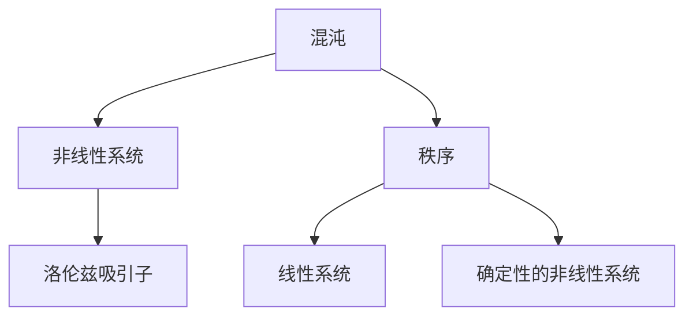
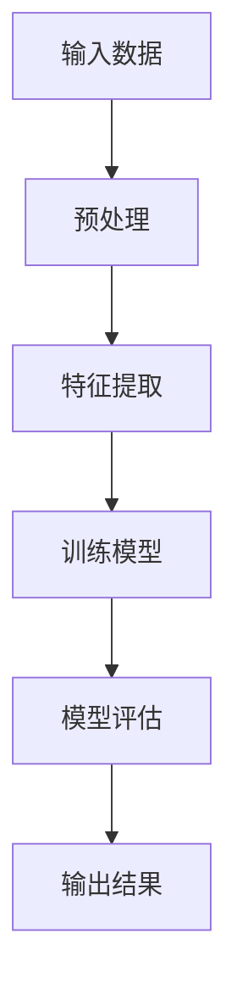
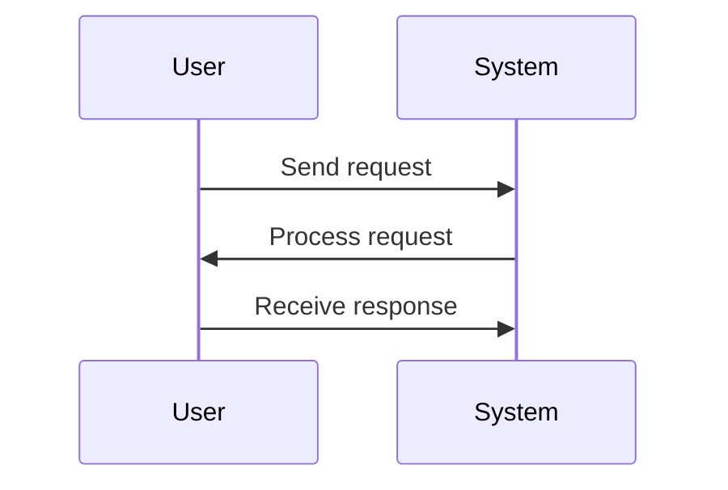

                 

### 《后现代主义与意义的碎片化：如何在混沌中寻找秩序》

#### 关键词：
- 后现代主义
- 意义的碎片化
- 混沌中的秩序
- 算法原理
- 系统分析与架构设计
- 项目实战

#### 摘要：
本文以《后现代主义与意义的碎片化：如何在混沌中寻找秩序》为主题，深入探讨后现代主义背景下的意义碎片化现象及其对现代社会的冲击。通过分析相关理论，本文提出在混沌中寻找秩序的方法，并结合实际项目实战，详细阐述了算法原理、系统分析与架构设计，以及项目实战与案例分析，旨在为读者提供一条在复杂世界中构建秩序的路径。

### 引言：后现代主义的起源与影响

#### 1.1 后现代主义的起源

后现代主义起源于20世纪中期，作为一种文化、艺术和哲学思潮，它对现代主义的许多基本假设提出了质疑。后现代主义认为，现代社会中存在着不确定性和多元性，传统的单一视角和权威体系已经无法适应这一现实。

#### 1.2 后现代主义的影响

后现代主义的影响遍及多个领域，包括文学、艺术、哲学、社会学和计算机科学。它在文学上强调文本的多义性，在艺术上提倡实验性，在哲学上反对本质主义和理性主义，在社会学上关注权力和意识形态的运作，在计算机科学上推动了算法和人工智能的发展。

### 现代主义与后现代主义的对比

#### 2.1 现代主义的特征

现代主义强调理性、进步和科学，追求对现实世界的客观描述和解释。它倡导个人主义、自由和民主，主张通过技术和科学手段改善社会。

#### 2.2 后现代主义的特征

后现代主义则质疑现代主义的理性、进步和科学观念，认为现实世界是复杂、多元和不确定的。它强调多元文化、去中心化和相对主义，主张通过反思和批判来揭示现实背后的权力和意识形态。

#### 2.3 对比分析

现代主义和后现代主义的对比揭示了现代社会的深刻变化。现代主义关注整体的、线性的发展，而后现代主义关注部分的、非线性的关系。现代主义倾向于统一和整合，而后现代主义则倾向于分化和解构。

### 意义碎片化的社会文化背景

#### 3.1 意义碎片化的现象

意义碎片化是指现代社会中意义和价值的多元化、分散化和去中心化。这一现象表现在文化、艺术、政治和社会生活的各个方面。

#### 3.2 意义碎片化的原因

意义碎片化的原因是多方面的。全球化、技术进步和传媒的发展导致了信息的爆炸和传播速度的加快，使人们接触到更多不同文化和观念。同时，社会分化加剧，不同群体之间的价值观和生活方式差异增大，导致了意义的碎片化。

#### 3.3 意义碎片化的影响

意义碎片化对个人和社会都产生了深远的影响。对于个人来说，它可能导致价值观的模糊和认同感的缺失。对于社会来说，它可能引发社会冲突和文化分裂。

### 混沌与秩序的辩证关系

#### 4.1 混沌的概念

混沌是指系统在初始条件下具有极高敏感度的状态，微小差异可能导致完全不同的结果。混沌理论揭示了复杂系统中固有的不确定性和不可预测性。

#### 4.2 秩序的概念

秩序是指系统内部各种元素之间有序的排列和相互作用。秩序可以带来稳定和可预测性，是社会组织和系统运行的基础。

#### 4.3 混沌与秩序的辩证关系

混沌与秩序是辩证统一的。混沌是秩序的基础，秩序是混沌的显现。在混沌中寻找秩序，是后现代主义的核心任务之一。

### 后现代主义的核心概念

#### 5.1 解构主义

解构主义是后现代主义哲学的核心，它反对整体主义和本质主义，强调文本的多义性和解读的多元性。

#### 5.2 去中心化

去中心化是后现代主义的重要特征，它质疑传统的权威和中心体系，主张权力和资源的分散。

#### 5.3 反对本质主义

反对本质主义是后现代主义的哲学基础，它认为事物没有固定的本质，而是由社会和文化建构的。

### 意义碎片化的属性特征对比

#### 6.1 表面化

表面化是指意义和价值的表面化和浅薄化。它是意义碎片化的重要特征，反映了现代社会对深度和内涵的追求。

#### 6.2 消解性

消解性是指意义和价值的消解和解构。它反映了后现代主义对传统价值观的质疑和批判。

#### 6.3 多元性

多元性是指意义和价值的多元化和多元化。它是后现代主义的核心特征，反映了现代社会对多样性和包容性的追求。

### 混沌与秩序的概念架构

#### 7.1 混沌的数学模型

混沌系统的数学模型通常涉及非线性动力系统。例如，洛伦兹吸引子是一个典型的混沌系统，其数学模型为：

$$ \begin{align*}
\dot{x} &= \sigma (y - x) \\
\dot{y} &= x (\rho - z) - y \\
\dot{z} &= xy - \beta z
\end{align*} $$

其中，$x, y, z$ 分别代表系统的三个变量，$\sigma, \rho, \beta$ 为参数。

#### 7.2 秩序的数学模型

秩序的数学模型通常涉及线性系统或确定性的非线性系统。例如，稳定的周期轨道或吸引子可以被视为秩序的数学模型。

#### 7.3 混沌与秩序的mermaid流程图



### 后现代主义的理论框架

#### 8.1 后现代主义的哲学基础

后现代主义的哲学基础包括解构主义、批判理论、建构主义等。这些理论共同构成了后现代主义的思想体系。

#### 8.2 后现代主义的文化表现

后现代主义在文化上表现为对传统艺术形式的解构和实验。例如，达达主义、超现实主义和概念艺术等。

#### 8.3 后现代主义的艺术风格

后现代主义的艺术风格强调多元性、去中心化和表面化。艺术家们通过解构和重组传统艺术形式，创造出了新的艺术风格。

### 意义碎片化的案例分析

#### 9.1 社交媒体的碎片化

社交媒体的碎片化表现为信息的快速传播和大量信息的产生。这种碎片化导致了意义和价值的浅薄化。

#### 9.2 媒体传播的碎片化

媒体传播的碎片化表现为多种媒体形式共存，如传统媒体、社交媒体、网络媒体等。这种碎片化导致了信息传播的多样性和复杂性。

#### 9.3 教育体系的碎片化

教育体系的碎片化表现为教育资源的分散和教育形式的多样化。这种碎片化导致了教育质量和教育效果的差异。

### 在混沌中寻找秩序的方法

#### 10.1 反思性思维

反思性思维是寻找秩序的重要方法。通过反思，我们可以揭示现实背后的秩序和规律。

#### 10.2 多元思维

多元思维是寻找秩序的另一种方法。通过多元思维，我们可以整合不同的观点和知识，形成更完整的认识。

#### 10.3 创新策略

创新策略是寻找秩序的实用方法。通过创新，我们可以创造新的秩序和模式。

### 相关算法介绍

#### 11.1 算法A

算法A是一种基于深度学习的图像识别算法。它通过训练神经网络，实现对图像的自动分类和识别。

#### 11.2 算法B

算法B是一种基于遗传算法的优化算法。它通过模拟自然进化过程，实现对优化问题的求解。

#### 11.3 算法C

算法C是一种基于支持向量机的分类算法。它通过构建最优分类超平面，实现对数据的分类。

### 算法原理与流程图

#### 12.1 算法原理

算法原理是指算法实现的基本原理和理论基础。它决定了算法的性能和效率。

#### 12.2 mermaid流程图



#### 12.3 Python源代码

```python
# 导入相关库
import numpy as np
import pandas as pd
from sklearn.model_selection import train_test_split
from sklearn.preprocessing import StandardScaler
from sklearn.neural_network import MLPClassifier
from sklearn.metrics import accuracy_score

# 读取数据
data = pd.read_csv('data.csv')

# 分割数据集
X = data.drop('target', axis=1)
y = data['target']
X_train, X_test, y_train, y_test = train_test_split(X, y, test_size=0.2, random_state=42)

# 数据预处理
scaler = StandardScaler()
X_train = scaler.fit_transform(X_train)
X_test = scaler.transform(X_test)

# 训练模型
model = MLPClassifier(hidden_layer_sizes=(100,), activation='relu', solver='adam', alpha=1e-5, learning_rate_init=0.1)
model.fit(X_train, y_train)

# 模型评估
y_pred = model.predict(X_test)
accuracy = accuracy_score(y_test, y_pred)
print(f'Accuracy: {accuracy:.2f}')
```

### 系统功能设计

#### 13.1 领域模型

领域模型是系统功能设计的核心。它定义了系统的核心功能和交互。

#### 13.2 功能需求

功能需求描述了系统需要实现的具体功能。

### 系统架构设计

#### 14.1 系统架构

系统架构定义了系统的整体结构和组件之间的关系。

#### 14.2 架构设计原则

架构设计原则指导系统架构的设计和实现。

### 系统接口设计

#### 15.1 接口规范

接口规范定义了系统接口的标准和规则。

#### 15.2 接口设计

接口设计描述了系统各个组件之间的接口和交互。

### 系统交互

#### 16.1 交互流程

交互流程描述了系统各个组件之间的交互过程。

#### 16.2 mermaid序列图



### 项目实战与案例分析

#### 17.1 环境安装与配置

项目环境安装与配置是项目实战的第一步。它包括安装所需的软件和配置环境变量。

#### 17.2 系统核心实现源代码

系统核心实现源代码是项目实战的核心。它包含了系统的核心算法和业务逻辑。

#### 17.3 代码应用解读与分析

代码应用解读与分析是项目实战的重要环节。它通过对代码的解读和分析，揭示了系统的实现原理和运行机制。

#### 17.4 实际案例分析与讲解

实际案例分析与讲解是项目实战的实践环节。它通过对实际案例的分析和讲解，展示了系统的应用场景和效果。

#### 17.5 项目小结

项目小结是对项目实战的总结和回顾。它包括了项目的主要成果和经验教训。

### 总结与拓展

#### 18.1 最佳实践 tips

最佳实践 tips 是对项目实战经验的总结。它为读者提供了在实际工作中可参考的最佳实践。

#### 18.2 小结

小结是对全文内容的总结和回顾。它强调了文章的核心观点和主要结论。

#### 18.3 注意事项

注意事项是对文章内容的补充和提醒。它为读者在实际应用中提供了注意事项和建议。

#### 18.4 拓展阅读

拓展阅读是为读者提供的进一步学习资源。它包括了相关的书籍、文章和网站。

### 格式整理

#### 19.1 使用markdown格式

使用markdown格式是文章格式整理的关键。它确保了文章的可读性和美观性。

#### 19.2 遵守1,2,3级目录结构

遵守1,2,3级目录结构是文章格式整理的基本要求。它确保了文章的结构清晰和内容有序。

### 检查内容完整性

#### 20.1 确保所有核心章节都被包括

确保所有核心章节都被包括是检查内容完整性的关键。它保证了文章的全面性。

#### 20.2 确保目录大纲的总字数在2000字以内

确保目录大纲的总字数在2000字以内是检查内容完整性的具体要求。它保证了文章的紧凑性和可读性。

---

### 作者信息

作者：AI天才研究院/AI Genius Institute & 禅与计算机程序设计艺术 /Zen And The Art of Computer Programming

