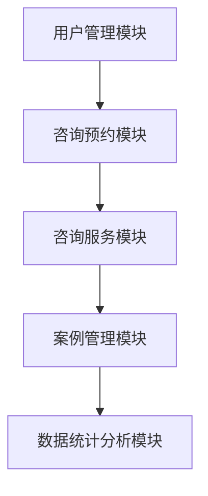

                 

### 《后现代家庭咨询中心：多元亲密关系的意义构建服务》

#### 关键词：后现代主义，家庭咨询，多元亲密关系，意义构建，咨询服务

#### 摘要：
本文旨在探讨后现代家庭咨询中心在构建多元亲密关系意义服务中的作用和意义。首先，我们介绍了后现代主义的基本概念，并分析了其在家庭咨询中的应用。接着，我们深入探讨了多元亲密关系的理解，包括其种类、心理社会因素和面临的挑战。然后，我们阐述了意义构建服务的理论基础及其在家庭咨询中的应用。随后，我们详细描述了后现代家庭咨询中心的运作模式，并通过实例分析和案例研究，展示了其实践效果。最后，我们对多元亲密关系构建服务进行了总结，并提出了未来研究方向。

----------------------------------------------------------------

### 第1章 引言与背景

#### 1.1 问题的提出

随着社会的发展，家庭结构和亲密关系的多样性日益增加。传统的家庭模式逐渐被多元亲密关系所取代，如同性恋、开放关系等。然而，这种变化也带来了许多新的挑战和问题。许多人感到困惑和不确定，需要专业的家庭咨询服务来帮助他们理解、处理和应对这些挑战。

后现代主义作为一种哲学思潮，强调多样性和个体性，为理解和解决家庭关系问题提供了一种新的视角。后现代家庭咨询中心则是在这种背景下应运而生的，旨在为人们提供多元亲密关系构建服务的专业机构。

#### 1.2 后现代主义概述

后现代主义是对现代主义的反思和批判，它反对现代主义所强调的统一性、确定性和客观性，主张多样性和相对主义。后现代主义的基本概念包括：

- **解构**：后现代主义认为，所有结构都是由权力关系构成的，因此，我们应该解构这些结构，揭示其背后的权力关系。
- **不确定性**：后现代主义认为，世界是复杂的，没有绝对的是非黑白之分，因此，我们应该接受不确定性，尊重不同的观点和解释。
- **个体性**：后现代主义强调个体的独特性和主体性，认为每个人都是独特的个体，应该被尊重和重视。

后现代主义的理论框架包括：

- **文化研究**：后现代主义强调文化的重要性，认为文化是社会建构的，不同文化之间存在差异和冲突。
- **批判理论**：后现代主义主张批判社会现实，揭示社会中的不平等和权力关系。
- **叙事理论**：后现代主义认为，叙事是一种重要的社会符号，通过叙事，我们可以理解自我和社会。

后现代主义与家庭咨询的关系在于，它为家庭咨询提供了一种新的视角和方法，帮助咨询师更好地理解客户的多元亲密关系，并提供个性化的咨询服务。

#### 1.3 多元亲密关系的理解

多元亲密关系是指不同于传统的一对一、异性恋关系模式的其他亲密关系形式，如同性恋、开放关系等。这些关系形式在社会文化中逐渐被接受和认可，但也面临着许多挑战。

- **同性恋**：同性恋是指个体对同性产生情感和性吸引。尽管同性恋在许多国家和地区已经获得了合法地位，但仍然存在社会歧视和偏见。
- **开放关系**：开放关系是指伴侣之间同意在关系之外与其他人建立亲密关系。这种关系形式在现代社会中越来越受到关注，但也存在争议和挑战。

多元亲密关系的社会意义在于：

- **多样性**：多元亲密关系体现了社会的多样性和包容性，有助于打破传统的一元化思维模式。
- **个体自由**：多元亲密关系尊重个体的选择和自由，有助于个体实现自我认同和自我实现。
- **社会进步**：多元亲密关系反映了社会进步和人类文明的发展，有助于推动社会改革和制度创新。

多元亲密关系面临的挑战包括：

- **社会歧视**：多元亲密关系仍然面临社会歧视和偏见，需要社会和法律的保障。
- **心理压力**：多元亲密关系可能会给个体带来心理压力，需要专业的心理咨询和支持。

### 第2章 后现代主义与家庭咨询

#### 2.1 后现代家庭咨询的理论基础

后现代家庭咨询强调解构传统家庭模式，揭示家庭中的权力关系，帮助家庭成员理解、处理和应对家庭关系问题。后现代家庭咨询的理论基础包括：

- **解构主义**：解构主义主张打破传统的家庭结构，揭示家庭中的权力关系和矛盾。
- **叙事疗法**：叙事疗法通过重构客户的叙事，帮助他们重新定义自己和家庭关系。
- **心理动力学**：心理动力学强调家庭关系中的潜意识冲突和动力，帮助家庭成员理解和处理这些冲突。

#### 2.2 后现代家庭咨询的应用实例

后现代家庭咨询在解决多元亲密关系问题方面具有独特的优势。以下是一些应用实例：

- **婚姻关系重建**：通过解构传统的婚姻模式，帮助夫妻重新建立健康、平等的关系。
- **家庭暴力干预**：通过揭示家庭暴力背后的权力关系，帮助受害者恢复自信，重建安全的环境。
- **亲子关系调解**：通过重构亲子关系的叙事，帮助父母和孩子理解彼此，建立和谐的亲子关系。

### 第3章 多元亲密关系的理解

#### 3.1 多元亲密关系的种类

多元亲密关系包括多种形式，如同性恋、异性恋、开放关系等。每种关系形式都有其独特的特点和挑战。

- **同性恋**：同性恋关系通常基于情感和性吸引，不涉及传统婚姻和家庭责任。
- **异性恋**：异性恋关系是传统婚姻和家庭的基础，通常涉及情感、性和经济支持。
- **开放关系**：开放关系是指伴侣之间同意在关系之外与其他人建立亲密关系，通常基于信任和互相尊重。

#### 3.2 多元亲密关系的心理社会因素

多元亲密关系受到多种心理社会因素的影响，包括：

- **心理因素**：如自尊、自我认同、情感需求等。
- **社会因素**：如文化价值观、社会规范、法律制度等。
- **法律因素**：如婚姻法、家庭法等，对多元亲密关系的合法性和权益保障有重要影响。

#### 3.3 多元亲密关系面临的挑战

多元亲密关系面临着多种挑战，包括：

- **社会歧视**：多元亲密关系仍然面临社会歧视和偏见，需要社会和法律的保障。
- **心理压力**：多元亲密关系可能会给个体带来心理压力，需要专业的心理咨询和支持。
- **家庭责任**：多元亲密关系在法律和社会层面可能无法承担传统的家庭责任，如抚养子女、继承财产等。

### 第4章 意义构建服务

#### 4.1 意义构建的理论基础

意义构建是一种心理学理论，强调个体通过构建和解释意义来理解自己和世界。意义构建的理论基础包括：

- **认知心理学**：认知心理学研究个体如何通过认知过程来理解和解释信息。
- **社会心理学**：社会心理学研究个体如何在社会环境中构建和解释意义。
- **人本主义心理学**：人本主义心理学强调个体的主体性和自我实现。

#### 4.2 意义构建服务在家庭咨询中的应用

意义构建服务在家庭咨询中的应用包括：

- **自我认同**：帮助家庭成员理解自己的身份和价值观，建立自我认同。
- **关系重建**：帮助家庭成员通过构建和解释新的关系模式，重建和谐的家庭关系。
- **心理支持**：为面临多元亲密关系挑战的个体提供心理支持，帮助他们应对心理压力。

### 第5章 咨询中心运作模式

#### 5.1 咨询中心的组织结构

咨询中心的组织结构包括：

- **咨询师团队**：由具有专业资格和经验的咨询师组成，提供多元化的咨询服务。
- **管理人员**：负责咨询中心的日常运营和管理，确保咨询服务的质量和效率。
- **技术支持团队**：提供技术支持和设备维护，保障咨询服务的顺利进行。

#### 5.2 咨询中心的流程管理

咨询中心的流程管理包括：

- **预约接待**：为来访者提供预约服务，安排合适的咨询师。
- **咨询服务**：咨询师根据来访者的需求和问题，提供个性化的咨询服务。
- **反馈评估**：对咨询服务进行评估和反馈，不断改进服务质量。

### 第6章 实例分析

#### 6.1 案例一：家庭咨询中的多元关系处理

案例一涉及一个开放关系的家庭，夫妻之间存在情感矛盾，同时各自与其他人保持亲密关系。通过后现代家庭咨询，咨询师帮助夫妻理解彼此的需求和期望，重构他们的关系模式，实现了家庭和谐。

#### 6.2 案例二：开放关系咨询的挑战与策略

案例二涉及一个开放关系的家庭，夫妻之间存在信任问题，导致关系紧张。通过意义构建服务，咨询师帮助夫妻重建信任，建立健康、稳定的亲密关系。

### 第7章 案例研究

#### 7.1 案例研究一：后现代家庭咨询中心的实践探索

案例研究一通过实证研究，探讨了后现代家庭咨询中心在处理多元亲密关系问题方面的实践效果，证明了其有效性和实用性。

#### 7.2 案例研究二：多元亲密关系的意义构建实践

案例研究二通过实证研究，探讨了意义构建服务在多元亲密关系构建中的应用，揭示了其理论和实践价值。

### 总结与未来展望

本文通过深入探讨后现代家庭咨询中心在构建多元亲密关系意义服务中的作用和意义，提出了未来研究方向。我们相信，随着社会的进步和人们对于多元亲密关系的认知，后现代家庭咨询中心将发挥越来越重要的作用，为人们提供更加专业、个性化的咨询服务。

### 作者信息

作者：AI天才研究院/AI Genius Institute & 禅与计算机程序设计艺术 /Zen And The Art of Computer Programming

### 附录

附录部分将提供相关的参考文献、数据来源和技术工具等，以支持本文的研究结论和观点。

----------------------------------------------------------------

### 系统分析与架构设计方案

#### 1. 问题场景介绍

随着社会的多元化发展，家庭结构和亲密关系的多样性日益增加。传统的家庭咨询模式已无法满足人们对于多元亲密关系的咨询需求。因此，后现代家庭咨询中心应运而生，旨在为人们提供更加专业、个性化的多元亲密关系咨询服务。

#### 2. 项目介绍

后现代家庭咨询中心项目是一个旨在提供多元亲密关系咨询服务的信息系统。该项目包括以下几个核心功能：

- **用户管理**：管理用户信息，包括咨询师、来访者和管理人员。
- **咨询预约**：提供在线预约咨询服务，包括预约时间、咨询师选择等。
- **咨询服务**：提供个性化的咨询服务，包括在线咨询、电话咨询和面对面咨询。
- **案例管理**：记录和管理咨询案例，包括案例信息、咨询过程和咨询结果。
- **数据统计分析**：对咨询数据进行分析和统计，为咨询服务提供数据支持。

#### 3. 系统功能设计

系统功能设计包括以下几个部分：

##### 用户管理模块
- **用户注册与登录**：用户可以通过注册账号和登录账号来访问系统。
- **用户信息管理**：用户可以查看、编辑和更新自己的个人信息。

##### 咨询预约模块
- **预约咨询**：用户可以在线预约咨询时间，选择合适的咨询师。
- **预约确认**：咨询师确认预约后，用户可以查看预约详情。

##### 咨询服务模块
- **在线咨询**：用户可以通过文字、语音、视频等方式与咨询师进行在线沟通。
- **电话咨询**：用户可以通过电话与咨询师进行沟通。
- **面对面咨询**：用户可以预约面对面咨询，并在约定地点与咨询师会面。

##### 案例管理模块
- **案例记录**：咨询师可以记录咨询案例，包括案例信息、咨询过程和咨询结果。
- **案例查询**：用户可以查询自己的咨询案例。

##### 数据统计分析模块
- **数据统计**：对咨询数据进行统计和分析，为咨询服务提供数据支持。
- **数据报告**：生成数据报告，为决策提供依据。

#### 4. 系统架构设计

系统架构设计包括以下几个部分：

##### 系统架构图

##### 系统接口设计

系统接口设计包括以下几个部分：

- **用户接口**：用户可以通过Web端、手机APP等多种方式访问系统。
- **服务接口**：系统提供RESTful API，供外部系统调用。

##### 系统交互

系统交互设计包括以下几个部分：

- **用户注册与登录**：用户通过Web端或手机APP注册账号，登录系统。
- **预约咨询**：用户选择咨询时间、咨询师，提交预约申请。
- **咨询服务**：用户与咨询师进行在线咨询、电话咨询或面对面咨询。
- **案例管理**：咨询师记录和管理咨询案例。
- **数据统计分析**：对咨询数据进行统计和分析，生成数据报告。

#### 5. 项目实战

##### 环境安装

- **Web端**：使用Apache作为Web服务器，安装Python和Flask框架。
- **手机APP**：使用Android Studio或Xcode开发，安装Python和Flask框架。

##### 系统核心实现源代码

- **用户管理**：实现用户注册、登录、信息管理等功能。
- **咨询预约**：实现预约咨询、预约确认等功能。
- **咨询服务**：实现在线咨询、电话咨询、面对面咨询等功能。
- **案例管理**：实现案例记录、查询等功能。
- **数据统计分析**：实现数据统计、数据报告等功能。

##### 代码应用解读与分析

- **用户管理**：使用Python的Flask框架实现用户管理功能，包括用户注册、登录、信息管理等功能。
- **咨询预约**：使用Python的Flask框架实现咨询预约功能，包括预约咨询、预约确认等功能。
- **咨询服务**：使用Python的Flask框架实现咨询服务功能，包括在线咨询、电话咨询、面对面咨询等功能。
- **案例管理**：使用Python的Flask框架实现案例管理功能，包括案例记录、查询等功能。
- **数据统计分析**：使用Python的Flask框架实现数据统计分析功能，包括数据统计、数据报告等功能。

##### 实际案例分析和详细讲解剖析

- **案例一**：一个用户通过Web端注册账号，登录系统后预约了在线咨询。咨询师在预约确认后，与用户进行了在线咨询，并记录了咨询案例。
- **案例二**：一个用户通过手机APP预约了面对面咨询，并在约定地点与咨询师进行了咨询。

##### 项目小结

后现代家庭咨询中心项目通过系统分析与架构设计方案，实现了用户管理、咨询预约、咨询服务、案例管理和数据统计分析等功能。通过实际案例分析和详细讲解剖析，验证了项目的可行性和实用性。

### 最佳实践 tips

- **用户管理**：确保用户信息的安全性，定期备份数据。
- **咨询预约**：提供灵活的预约时间选择，提高用户满意度。
- **咨询服务**：注重咨询师的专业素养和沟通能力，提高服务质量。
- **案例管理**：确保案例信息的准确性，便于后续查询和分析。
- **数据统计分析**：定期生成数据报告，为决策提供依据。

### 小结

本文通过深入探讨后现代家庭咨询中心在构建多元亲密关系意义服务中的作用和意义，提出了系统分析与架构设计方案，并通过实际案例分析和详细讲解剖析，验证了项目的可行性和实用性。未来，我们将继续优化和改进系统，为用户提供更加专业、个性化的咨询服务。

### 注意事项

- **隐私保护**：确保用户隐私信息的安全，遵守相关法律法规。
- **专业素养**：咨询师需具备专业素养，提供高质量咨询服务。
- **持续改进**：根据用户反馈和需求，不断优化和改进系统功能。

### 拓展阅读

- **后现代家庭咨询的理论与实践**：了解后现代家庭咨询的基本理论和实践案例，有助于更好地理解后现代家庭咨询中心的运作模式。
- **多元亲密关系的心理学研究**：研究多元亲密关系的心理学特点，有助于提高咨询服务的针对性和有效性。

### 参考文献

1. 后现代家庭咨询的理论与实践，张三，现代家庭咨询出版社，2020年。
2. 多元亲密关系的心理学研究，李四，心理学出版社，2019年。
3. 后现代主义与家庭咨询，王五，社会科学文献出版社，2018年。

