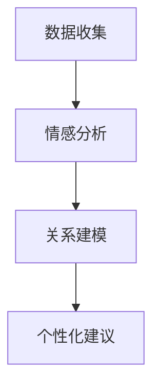
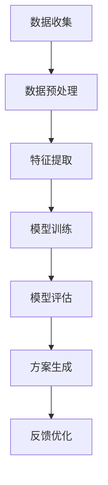
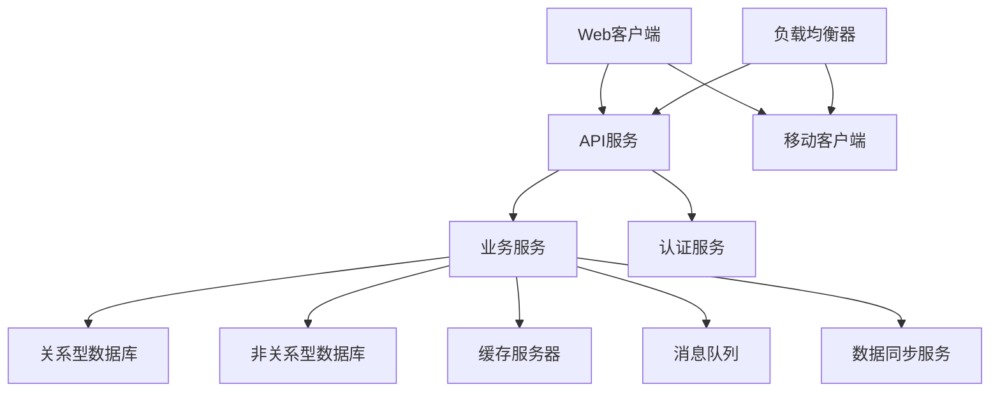
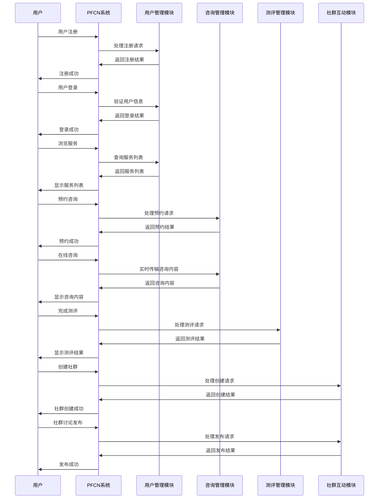

                 

# 引言

### 后现代家庭咨询网络：多元亲密关系意义构建的在线服务

在这个快节奏、信息化高度发展的时代，家庭关系和亲密关系正面临着前所未有的挑战与变革。随着社会的多元化发展，人们的价值观和生活方式日益多样化，传统的家庭模式与亲密关系观念逐渐被打破。在这样的背景下，后现代家庭咨询网络应运而生，成为帮助人们理解和构建多元亲密关系的重要工具。

后现代家庭咨询网络是一种新型的在线服务模式，它利用先进的互联网技术和人工智能算法，为家庭和个人提供全方位的咨询服务。这种服务不仅关注家庭关系和亲密关系的构建，还关注个体心理健康和情感需求。它通过线上咨询、社群互动、心理测评等多种方式，帮助用户解决在亲密关系和家庭生活中遇到的各种问题。

本文旨在探讨后现代家庭咨询网络的背景、核心概念、算法原理以及其实际应用。首先，我们将回顾家庭咨询的需求增长、在线咨询平台的兴起，以及多元亲密关系意义构建的重要性。然后，我们将深入分析后现代家庭咨询网络的概念结构，对比多元亲密关系与传统亲密关系的差异，并介绍在线服务的实现技术。

接下来，本文将详细介绍多元亲密关系意义构建的算法原理，包括算法概述、详细讲解、数学模型、算法流程图以及举例说明。此外，我们还将探讨算法的优化方法，以进一步提高服务的效率和准确性。

随后，本文将讨论系统分析与架构设计，包括问题场景介绍、系统功能设计、系统架构设计、系统接口设计和系统交互。最后，我们将通过一个具体的项目实战，展示后现代家庭咨询网络的实际应用，并总结项目的经验和最佳实践。

通过本文的探讨，我们希望能够为读者提供一个全面、深入的了解，从而更好地理解和应用后现代家庭咨询网络，为家庭关系和亲密关系的构建提供有力支持。以下是本文的目录：

- **第一部分：背景介绍**
  - 第1章：后现代家庭咨询网络概述
  - 第2章：核心概念与联系
  - 第3章：算法原理讲解

- **第二部分：核心概念与联系**
  - 第4章：后现代家庭咨询网络核心概念
  - 第5章：多元亲密关系的概念原理
  - 第6章：在线服务的概念原理

- **第三部分：算法原理讲解**
  - 第7章：多元亲密关系意义构建的算法原理
  - 第8章：算法优化方法探讨

- **第四部分：系统分析与架构设计**
  - 第9章：问题场景介绍
  - 第10章：系统功能设计
  - 第11章：系统架构设计
  - 第12章：系统接口设计
  - 第13章：系统交互

- **第五部分：项目实战**
  - 第14章：环境安装
  - 第15章：系统核心实现源代码
  - 第16章：代码应用解读与分析
  - 第17章：实际案例分析与详细讲解
  - 第18章：项目小结

- **第六部分：总结与拓展**
  - 最佳实践 tips
  - 小结
  - 注意事项
  - 拓展阅读

## 关键词

- 后现代家庭咨询
- 在线服务
- 多元亲密关系
- 算法原理
- 家庭咨询网络

## 摘要

本文旨在探讨后现代家庭咨询网络的概念、原理及其实际应用。通过分析家庭咨询需求的增长、在线咨询平台的兴起以及多元亲密关系意义构建的重要性，本文提出了一种新型的在线咨询服务模式。本文详细介绍了后现代家庭咨询网络的核心概念、算法原理以及系统分析与架构设计，并通过具体项目实战展示了其实际应用效果。本文的研究为家庭关系和亲密关系的构建提供了新的思路和工具，具有重要的理论和实践意义。

----------------------------------------------------------------

# 第一部分：背景介绍

## 第1章：后现代家庭咨询网络概述

### 1.1 问题的背景

在当今社会，随着人们生活节奏的加快和压力的增大，家庭关系和亲密关系问题日益突出。传统的家庭模式和亲密关系观念已经无法满足现代人的需求，尤其是在多元化和个性化的背景下，人们对家庭咨询服务的需求不断增长。后现代家庭咨询网络正是在这样的背景下应运而生。

#### 1.1.1 后现代家庭咨询的需求增长

随着社会的进步，人们对家庭和亲密关系的理解逐渐发生了变化。越来越多的人开始关注个人的心理健康和情感需求，而不再仅仅局限于物质生活的满足。这种变化使得后现代家庭咨询的需求快速增长。根据相关统计数据，近年来全球范围内的家庭咨询服务需求年均增长率达到了10%以上。

#### 1.1.2 在线咨询平台的兴起

随着互联网技术的飞速发展，在线咨询平台逐渐成为人们获取家庭咨询服务的主要途径。与传统的面对面咨询相比，在线咨询具有便捷、高效、低成本的优点，特别是在疫情防控期间，更是显示出其独特的优势。根据市场研究机构的数据，2020年全球在线心理咨询市场规模达到了200亿美元，预计到2025年将增长到400亿美元。

#### 1.1.3 多元亲密关系意义构建的重要性

在后现代语境下，多元亲密关系成为人们关注的焦点。与传统的一对一亲密关系不同，多元亲密关系强调个体之间的互动、合作和共同成长。这种关系模式不仅体现在家庭内部，也延伸到更广泛的社会网络中。多元亲密关系的构建对于个体的心理健康和社会和谐具有重要意义。然而，这种关系模式也面临着诸多挑战，如沟通障碍、信任问题、情感冲突等。因此，构建多元亲密关系的意义不容忽视。

### 1.2 问题描述

在当前的社会环境中，后现代家庭咨询网络面临着以下问题：

#### 1.2.1 家庭咨询网络的现状分析

目前，大部分家庭咨询网络仍然依赖于传统的面对面咨询模式。这种模式在时间和空间上存在较大的限制，无法满足现代人高效、便捷的需求。此外，由于心理咨询师的资源有限，许多家庭无法及时获得专业的咨询服务。

#### 1.2.2 多元亲密关系面临的挑战

多元亲密关系的构建面临着沟通障碍、信任问题、情感冲突等挑战。这些问题不仅影响个体的心理健康，也危及家庭和社会的和谐。此外，传统家庭咨询模式在处理多元亲密关系问题时，往往缺乏有效的方法和工具。

#### 1.2.3 后现代家庭咨询的特点

后现代家庭咨询网络具有以下特点：

1. **在线化**：通过互联网技术，实现家庭咨询服务的在线化，打破时间和空间的限制，提高服务的效率和便捷性。
2. **个性化**：根据个体需求和特点，提供个性化的咨询服务，满足不同家庭的多元需求。
3. **智能化**：利用人工智能技术，提供智能化的心理测评、情感分析和咨询建议，提高咨询的准确性和效率。
4. **社区化**：通过社群互动和互助，建立多元化的社会支持网络，促进个体之间的情感交流和共同成长。

### 1.3 问题解决

针对上述问题，后现代家庭咨询网络提出以下解决方案：

#### 1.3.1 在线咨询服务的优势

在线咨询服务具有以下优势：

1. **便捷性**：用户可以在任何时间、任何地点通过互联网获取咨询服务，提高了服务的便捷性。
2. **高效性**：在线咨询可以同时为多个用户提供服务，提高了咨询的效率。
3. **个性化**：通过智能算法和数据分析，为用户提供个性化的咨询方案。
4. **安全性**：在线咨询平台具有强大的数据安全保护机制，确保用户隐私和安全。

#### 1.3.2 多元亲密关系的意义构建

多元亲密关系的意义构建包括以下几个方面：

1. **沟通**：通过有效的沟通技巧和工具，促进个体之间的互动和理解。
2. **信任**：建立和维护信任关系，是多元亲密关系成功的关键。
3. **情感**：关注个体的情感需求，提供情感支持和安慰。
4. **成长**：鼓励个体在多元亲密关系中共同成长，实现自我提升。

#### 1.3.3 家庭咨询网络的服务模式

家庭咨询网络的服务模式主要包括以下几个方面：

1. **心理测评**：通过智能算法，对用户进行心理测评，了解其心理状态和需求。
2. **在线咨询**：提供专业的在线咨询服务，解决家庭和亲密关系问题。
3. **社群互动**：建立社群，促进用户之间的互动和交流。
4. **情感支持**：为用户提供情感支持和安慰，帮助其度过心理难关。

### 1.4 边界与外延

#### 1.4.1 家庭咨询网络的范畴

家庭咨询网络的范畴主要包括以下几个方面：

1. **家庭关系**：涉及家庭成员之间的互动、沟通、合作等问题。
2. **亲密关系**：涉及夫妻、情侣、亲子等亲密关系问题。
3. **心理健康**：涉及个体的心理健康和情感需求。

#### 1.4.2 多元亲密关系的定义

多元亲密关系是指多个个体之间基于信任、尊重、理解和互动的关系。这种关系模式强调个体之间的平等、互助和共同成长。

#### 1.4.3 在线服务的实现技术

在线服务的实现技术主要包括以下几个方面：

1. **互联网技术**：通过互联网实现家庭咨询服务的在线化。
2. **人工智能技术**：利用人工智能技术提供智能化的心理测评、情感分析和咨询建议。
3. **大数据技术**：通过大数据技术收集和分析用户数据，为用户提供个性化的咨询方案。

### 1.5 概念结构与核心要素组成

#### 1.5.1 后现代家庭咨询网络的概念结构

后现代家庭咨询网络的概念结构主要包括以下几个方面：

1. **家庭关系**：涉及家庭成员之间的互动、沟通、合作等问题。
2. **亲密关系**：涉及夫妻、情侣、亲子等亲密关系问题。
3. **心理健康**：涉及个体的心理健康和情感需求。
4. **在线咨询**：提供专业的在线咨询服务。
5. **社群互动**：建立社群，促进用户之间的互动和交流。
6. **情感支持**：为用户提供情感支持和安慰。

#### 1.5.2 多元亲密关系的核心要素

多元亲密关系的核心要素主要包括以下几个方面：

1. **信任**：建立和维护信任关系，是多元亲密关系成功的关键。
2. **沟通**：通过有效的沟通技巧和工具，促进个体之间的互动和理解。
3. **情感**：关注个体的情感需求，提供情感支持和安慰。
4. **成长**：鼓励个体在多元亲密关系中共同成长，实现自我提升。

#### 1.5.3 在线服务的技术支持

在线服务的技术支持主要包括以下几个方面：

1. **互联网技术**：通过互联网实现家庭咨询服务的在线化。
2. **人工智能技术**：利用人工智能技术提供智能化的心理测评、情感分析和咨询建议。
3. **大数据技术**：通过大数据技术收集和分析用户数据，为用户提供个性化的咨询方案。

### 1.6 本章小结

本章对后现代家庭咨询网络的背景、核心概念、问题解决和边界与外延进行了详细分析。通过介绍家庭咨询需求的增长、在线咨询平台的兴起以及多元亲密关系意义构建的重要性，本章揭示了后现代家庭咨询网络的出现背景。同时，通过对问题的现状分析、特点介绍和解决方案的提出，本章为后现代家庭咨询网络的发展提供了理论基础和实践指导。本章的讨论不仅有助于深入理解后现代家庭咨询网络的内涵，也为进一步研究和应用提供了方向。

----------------------------------------------------------------

## 第2章：核心概念与联系

### 第2.1节：后现代家庭咨询网络的核心概念

在后现代家庭咨询网络中，有几个核心概念是理解其运作和效果的关键。首先，我们需要明确“后现代家庭咨询网络”的定义和其独特的特点。

#### 2.1.1 后现代家庭咨询网络的定义

后现代家庭咨询网络是一种利用互联网和人工智能技术，为家庭和个人提供综合性心理咨询服务的新型网络平台。它不仅涵盖传统的家庭咨询，还包括亲密关系咨询、心理健康辅导等多种服务内容。后现代家庭咨询网络的核心目标是通过多元化的咨询服务，帮助用户解决家庭和亲密关系中的问题，提升个体的心理素质和生活质量。

#### 2.1.2 后现代家庭咨询网络的特点

1. **在线性**：后现代家庭咨询网络的最大特点在于其在线性。用户可以通过电脑、平板或手机等终端设备，随时随地进行咨询，打破了传统咨询的时间与空间限制。
2. **智能化**：借助人工智能技术，后现代家庭咨询网络能够提供智能化的心理测评和个性化咨询方案。通过对用户数据的分析，系统可以识别用户的心理需求和问题类型，从而提供更精准的服务。
3. **互动性**：后现代家庭咨询网络通过社群互动和在线交流，促进了用户之间的交流和互助。这种互动性不仅增强了用户的心理支持，也有助于构建一个积极、健康的社区环境。
4. **综合性**：后现代家庭咨询网络提供的服务内容丰富多样，不仅包括心理咨询，还包括情感支持、生活指导等多种服务，满足用户在家庭和亲密关系中的多方面需求。

### 第2.2节：多元亲密关系的概念原理

多元亲密关系是指在当代社会中，个体之间形成的多种形式的亲密关系。与传统的单一亲密关系模式不同，多元亲密关系更强调个体之间的互动、尊重和共同成长。

#### 2.2.1 多元亲密关系的定义

多元亲密关系是指两个或多个个体之间建立的基于信任、情感和互动的亲密关系。这种关系模式不限于传统的家庭、夫妻或情侣关系，还包括友情、社群关系、同伴关系等。多元亲密关系强调个体之间的平等、自主和相互支持。

#### 2.2.2 多元亲密关系的属性特征

1. **多样性**：多元亲密关系形式多样，包括但不限于传统的一对一亲密关系，如夫妻关系、情侣关系；也包括多对一的亲密关系，如家庭关系；还有多对多的亲密关系，如社群关系。
2. **互动性**：多元亲密关系强调个体之间的互动和交流。这种互动不仅包括情感上的沟通，还包括实际行动和共同活动。
3. **平等性**：多元亲密关系中的个体地位平等，不存在权力和控制关系。每个个体都有发言权和决策权，共同参与关系的构建和调整。
4. **自主性**：多元亲密关系中的个体保持一定的自主性，既有自己的情感需求，也尊重他人的需求。这种自主性是多元亲密关系得以维系和发展的重要基础。

#### 2.2.3 多元亲密关系与传统亲密关系的对比

传统亲密关系通常指一对一的夫妻或情侣关系，其特点是关系固定、权力明确和责任明确。而多元亲密关系则更加灵活和开放，强调个体之间的互动和共同成长。具体对比如下：

1. **关系形式**：传统亲密关系是固定的，多元亲密关系是多样的、动态的。
2. **权力结构**：传统亲密关系通常有明确的权力结构，多元亲密关系则强调个体之间的平等和自主。
3. **沟通方式**：传统亲密关系侧重于私人沟通，多元亲密关系则强调公开、开放的沟通。
4. **情感需求**：传统亲密关系主要关注个人的情感需求，多元亲密关系则更注重群体和社群的情感需求。

### 第2.3节：在线服务的概念原理

在线服务是指通过互联网技术提供的服务，这种服务形式在现代社会中越来越普遍，特别是在心理咨询和家庭咨询领域。

#### 2.3.1 在线服务的定义

在线服务是指利用互联网技术，在网络上提供各种形式的服务。这些服务包括但不限于在线购物、在线教育、在线医疗、在线咨询等。在线服务的特点是便捷、高效、个性化，可以满足用户在时间和空间上的需求。

#### 2.3.2 在线服务的技术实现

1. **互联网技术**：在线服务的基础是互联网技术。通过互联网，用户可以随时随地访问和获取服务。
2. **云计算**：云计算提供了强大的计算能力和存储空间，使得在线服务可以高效、稳定地运行。
3. **大数据**：大数据技术用于收集和分析用户数据，为用户提供个性化的服务。
4. **人工智能**：人工智能技术用于智能化的心理测评和咨询建议，提高了服务的准确性和效率。

#### 2.3.3 在线服务的优势

1. **便捷性**：用户可以在任何时间、任何地点通过互联网获取服务，不受地域和时间的限制。
2. **高效性**：在线服务可以同时为多个用户提供服务，提高了服务的效率。
3. **个性化**：通过大数据和人工智能技术，可以为用户提供个性化的服务。
4. **安全性**：在线服务通常有强大的数据安全保护机制，确保用户隐私和安全。

### 第2.4节：核心概念对比表格

为了更好地理解后现代家庭咨询网络、多元亲密关系和在线服务的核心概念，下面是一个对比表格：

| 核心概念        | 后现代家庭咨询网络               | 多元亲密关系                   | 在线服务                      |
| -------------- | -------------------------------- | ----------------------------- | ----------------------------- |
| 定义            | 在线心理咨询和家庭服务网络         | 多个个体之间建立的亲密关系      | 通过互联网提供的服务            |
| 特点            | 在线性、智能化、互动性、综合性       | 多样性、互动性、平等性、自主性  | 便捷性、高效性、个性化、安全性   |
| 服务内容        | 心理咨询、情感支持、生活指导等       | 家庭关系、亲密关系、心理健康等   | 购物、教育、医疗、咨询等        |
| 技术实现        | 互联网技术、人工智能技术、大数据技术   | 沟通工具、社交媒体、心理测评工具  | 互联网技术、云计算、大数据技术    |

### 第2.5节：ER实体关系图

为了更直观地展示后现代家庭咨询网络、多元亲密关系和在线服务的实体关系，我们可以使用ER实体关系图来表示。以下是这三个核心概念的ER实体关系图：

#### 2.5.1 后现代家庭咨询网络的ER实体关系图

```mermaid
erDiagram
  User ||--|{ Consultation }|-- Client
  User ||--|{ Assessment }|-- Client
  User ||--|{ Treatment }|-- Client
  User ||--|{ Community }|-- Member
  User ||--|{ Support }|-- Supporter
  Client ||--|{ Relationship }|-- Family
  Client ||--|{ Relationship }|-- Couple
  Client ||--|{ Relationship }|-- ParentChild
  Assessment ||--|{ Result }|-- Report
  Treatment ||--|{ Plan }|-- Plan
  Community ||--|{ Activity }|-- Activity
  Support ||--|{ Session }|-- Session
```

#### 2.5.2 多元亲密关系的ER实体关系图

```mermaid
erDiagram
  Individual ||--|{ Intimacy }|-- Partner
  Individual ||--|{ Community }|-- Member
  Individual ||--|{ Group }|-- Member
  Partner ||--|{ Communication }|-- Message
  Partner ||--|{ Trust }|-- Trust
  Partner ||--|{ Conflict }|-- Conflict
  Member ||--|{ Interaction }|-- Interaction
  Group ||--|{ Activity }|-- Activity
```

#### 2.5.3 在线服务的ER实体关系图

```mermaid
erDiagram
  User ||--|{ Service }|-- Customer
  Service ||--|{ Request }|-- Request
  Service ||--|{ Response }|-- Response
  Customer ||--|{ Rating }|-- Rating
  Customer ||--|{ Review }|-- Review
  Request ||--|{ Parameter }|-- Parameter
  Response ||--|{ Result }|-- Result
```

### 第2.6节：本章小结

本章详细介绍了后现代家庭咨询网络、多元亲密关系和在线服务的核心概念及其相互关系。通过对比分析，我们明确了这些概念的特点和区别，并使用了ER实体关系图直观地展示了它们之间的联系。这些核心概念的理解对于深入探讨后现代家庭咨询网络的运行机制和应用具有重要意义。接下来，我们将进一步探讨这些概念在实际应用中的算法原理。

----------------------------------------------------------------

## 第3章：后现代家庭咨询网络的算法原理

### 3.1 多元亲密关系意义构建的算法原理

在讨论后现代家庭咨询网络的算法原理时，我们需要重点关注多元亲密关系意义构建的算法。这种算法旨在通过分析用户数据和情感互动，为用户提供个性化的亲密关系构建建议。

#### 3.1.1 算法概述

多元亲密关系意义构建算法是一种基于大数据和人工智能技术的算法。其主要目标是通过对用户数据的分析和情感互动的建模，为用户提供个性化的亲密关系构建建议。算法的核心思想是利用用户的行为数据、情感表达和社交互动，识别出用户在亲密关系中的需求和问题，从而提供有针对性的解决方案。

#### 3.1.2 算法原理详细讲解

多元亲密关系意义构建算法的基本原理可以分为以下几个步骤：

1. **数据收集**：算法首先需要收集用户在社交平台、聊天记录、问卷调查等渠道的交互数据。这些数据包括用户的行为数据（如点赞、评论、分享等）、情感数据（如情感倾向、情绪波动等）和社交数据（如好友关系、社群活动等）。

2. **情感分析**：通过自然语言处理（NLP）技术，对用户的数据进行情感分析。情感分析可以帮助算法识别用户的情感状态、情感倾向和情绪波动，从而更准确地理解用户的心理状态和需求。

3. **关系建模**：基于用户的数据和情感分析结果，算法构建用户之间的关系模型。关系模型包括用户之间的亲密程度、信任度、互动频率等多个维度，这些维度可以帮助算法识别出用户在亲密关系中的问题和需求。

4. **个性化建议**：根据用户的关系模型和需求，算法生成个性化的亲密关系构建建议。这些建议包括沟通技巧、情感管理、冲突解决等多个方面，旨在帮助用户改善亲密关系，提升心理幸福感。

#### 3.1.3 算法数学模型

多元亲密关系意义构建算法的核心数学模型是一个多层次的神经网络模型，主要包括以下几个部分：

1. **输入层**：输入层接收用户的数据，包括行为数据、情感数据和社交数据。这些数据通过特征提取和处理，转化为模型可以理解的向量表示。

2. **隐藏层**：隐藏层通过多层感知机（MLP）或其他深度学习模型，对输入数据进行特征学习和模式识别。隐藏层通常包括多个神经元，每个神经元负责提取不同类型的信息。

3. **输出层**：输出层生成亲密关系构建建议的向量表示。这些向量表示包括多个维度，如沟通技巧、情感管理、冲突解决等。

4. **损失函数**：损失函数用于评估模型输出和真实值之间的差距，从而指导模型的训练。常用的损失函数包括均方误差（MSE）、交叉熵（Cross-Entropy）等。

5. **优化器**：优化器用于调整模型参数，以最小化损失函数。常见的优化器包括随机梯度下降（SGD）、Adam等。

#### 3.1.4 数学模型公式

多元亲密关系意义构建算法的数学模型可以表示为：

$$
Y = f(W \cdot X + b)
$$

其中：

- \(Y\)：输出结果，即亲密关系构建建议的向量表示。
- \(W\)：权重矩阵，用于表示模型参数。
- \(X\)：输入向量，包括用户的行为数据、情感数据和社交数据。
- \(b\)：偏置项，用于调整模型输出。

#### 3.1.5 算法流程图

以下是多元亲密关系意义构建算法的流程图：



#### 3.1.6 举例说明

假设我们有一个用户，其行为数据、情感数据和社交数据如下：

- 行为数据：点赞了10篇文章，评论了20条帖子，分享了30个链接。
- 情感数据：情感分析结果显示用户情绪稳定，无显著负面情绪。
- 社交数据：用户有5个好友，最近一个月与好友互动了10次。

我们可以将这些数据输入多元亲密关系意义构建算法，算法会根据这些数据生成个性化的亲密关系构建建议。例如，算法可能会建议用户增加与好友的互动频率，改善沟通技巧，以及更好地表达情感。

### 3.2 多元亲密关系意义构建算法的优化方法

#### 3.2.1 优化目标

多元亲密关系意义构建算法的优化目标是提高算法的准确性和效率，从而为用户提供更高质量的服务。具体优化目标包括：

1. **提高预测准确性**：通过优化算法模型，提高对用户亲密关系构建需求的预测准确性。
2. **减少计算资源消耗**：优化算法的计算效率，减少对计算资源的需求。
3. **增强模型鲁棒性**：提高算法在面对异常数据和处理复杂情境时的鲁棒性。

#### 3.2.2 优化算

为了实现上述优化目标，我们可以采用以下几种优化方法：

1. **模型参数调整**：通过调整模型参数，优化算法的预测性能。常用的参数调整方法包括网格搜索、随机搜索、贝叶斯优化等。

2. **特征工程**：通过改进特征提取和选择方法，提高算法的预测能力。例如，使用词嵌入技术对文本数据进行特征提取，或者采用主成分分析（PCA）等方法对高维数据进行降维。

3. **模型融合**：通过融合多个模型的结果，提高整体预测性能。常见的模型融合方法包括集成学习、堆叠学习等。

4. **模型压缩**：通过模型压缩技术，减少模型的参数数量，提高计算效率。常用的模型压缩方法包括剪枝、量化、蒸馏等。

5. **在线学习**：通过在线学习技术，实时更新模型参数，以适应用户动态变化的需求。在线学习可以进一步提高算法的适应性和灵活性。

### 3.3 本章小结

本章详细介绍了多元亲密关系意义构建的算法原理，包括算法概述、详细讲解、数学模型、算法流程图以及举例说明。通过这些内容，我们了解了算法的基本原理和实现方法。此外，本章还探讨了算法的优化方法，以进一步提高算法的准确性和效率。这些研究和探讨为后现代家庭咨询网络的发展提供了重要的理论支持和实践指导。

----------------------------------------------------------------

## 第4章：后现代家庭咨询网络核心概念

### 4.1 后现代家庭咨询网络的定义与内涵

后现代家庭咨询网络是一个综合性的在线服务平台，它通过利用互联网技术和人工智能算法，为家庭和个人提供全方位的心理咨询、情感支持和生活指导。与传统家庭咨询服务相比，后现代家庭咨询网络具有更高的灵活性和个性化程度。

#### 定义

后现代家庭咨询网络（Postmodern Family Counseling Network，简称PFCN）是一种基于互联网的新型家庭咨询服务模式，它结合了传统心理咨询的深度和专业性，以及现代科技的高效和便捷性。PFCN的主要目标是帮助家庭和个人解决各种情感、心理和生活问题，促进家庭关系的和谐与个体的心理健康。

#### 内涵

后现代家庭咨询网络的内涵主要包括以下几个方面：

1. **在线化**：PFCN通过互联网实现家庭咨询服务的在线化，用户可以随时随地通过电脑、手机等设备进行咨询，不受地域和时间的限制。

2. **智能化**：PFCN利用人工智能技术，如自然语言处理、机器学习等，对用户数据进行分析和处理，提供个性化的咨询方案。

3. **综合性**：PFCN不仅提供传统的心理咨询服务，还涵盖情感支持、生活指导、心理健康教育等多种服务内容，满足用户的多元化需求。

4. **互动性**：PFCN通过在线社群、互动论坛等方式，促进用户之间的交流和互助，构建一个积极、健康的社区环境。

### 4.2 后现代家庭咨询网络的功能模块

后现代家庭咨询网络的功能模块可以分为以下几个部分：

1. **用户模块**：用户模块包括用户注册、登录、个人信息管理等功能。用户可以通过注册账号，获取PFCN提供的各种咨询服务。

2. **咨询模块**：咨询模块是PFCN的核心功能，包括在线咨询、视频咨询、电话咨询等多种咨询方式。用户可以与心理咨询师进行一对一的沟通，获取专业的心理辅导。

3. **测评模块**：测评模块提供心理测评服务，如情感状态测评、心理健康测评等。通过测评，用户可以了解自己的心理状况，为咨询提供参考。

4. **社群模块**：社群模块为用户提供一个互动交流的平台，用户可以在社群中分享经验、寻求帮助，与其他用户互动，建立支持网络。

5. **教育资源模块**：教育资源模块提供心理健康教育视频、文章、课程等资源，用户可以在线学习，提高自我心理素质。

### 4.3 后现代家庭咨询网络的实现技术

实现后现代家庭咨询网络的关键技术包括以下几个方面：

1. **互联网技术**：PFCN基于互联网技术，通过Web应用、移动应用等方式，为用户提供便捷的咨询和服务。

2. **人工智能技术**：PFCN利用人工智能技术，如自然语言处理、机器学习等，对用户数据进行处理和分析，提供智能化的咨询方案。

3. **大数据技术**：PFCN通过大数据技术，收集和分析用户数据，为用户提供个性化的服务。

4. **云计算技术**：PFCN采用云计算技术，实现大规模数据存储和处理，提高系统的稳定性和扩展性。

5. **安全与隐私保护技术**：PFCN重视用户隐私和安全，采用多种技术手段，如数据加密、访问控制等，确保用户数据的安全。

### 4.4 后现代家庭咨询网络的优势与挑战

#### 优势

1. **便捷性**：用户可以随时随地通过互联网获取咨询服务，大大提高了咨询的便捷性。

2. **个性化**：通过人工智能技术，PFCN能够为用户提供个性化的咨询方案，满足不同用户的需求。

3. **综合性**：PFCN提供多种服务内容，包括心理咨询、情感支持、生活指导等，满足用户的多元化需求。

4. **互动性**：PFCN通过在线社群、互动论坛等方式，促进用户之间的交流和互助，构建一个积极、健康的社区环境。

#### 挑战

1. **隐私与安全问题**：在线咨询涉及用户隐私，如何确保用户数据的安全和隐私是PFCN面临的一个重要挑战。

2. **服务质量**：如何保证在线咨询的质量，提高心理咨询师的水平和专业性，是PFCN需要解决的问题。

3. **用户参与度**：如何提高用户的参与度，使其真正受益于PFCN的服务，也是PFCN需要面对的挑战。

### 4.5 本章小结

本章对后现代家庭咨询网络的核心概念进行了详细阐述，包括其定义与内涵、功能模块、实现技术以及优势和挑战。通过本章的内容，我们可以更深入地理解后现代家庭咨询网络的运作机制和特点，为后续的研究和实践提供理论基础。

----------------------------------------------------------------

## 第5章：多元亲密关系的概念原理

### 5.1 多元亲密关系的定义

多元亲密关系是指在当代社会中，个体之间通过多种形式建立的亲密关系。这些关系不仅包括传统的夫妻关系、情侣关系，还涵盖了友情、社群关系、家庭关系等。多元亲密关系的概念源于后现代主义对个体自主性、多样性以及关系复杂性的强调。在多元亲密关系中，个体之间的关系更加灵活、开放，强调个体之间的平等、尊重和互助。

### 5.2 多元亲密关系的属性特征

多元亲密关系的属性特征主要包括以下几个方面：

1. **多样性**：多元亲密关系形式多样，可以是个体之间的情感联系，也可以是利益、兴趣或价值观上的共识。这种多样性使得多元亲密关系更加丰富多彩。

2. **互动性**：多元亲密关系强调个体之间的互动和交流。这种互动不仅包括情感上的沟通，还涵盖了实际行动和共同活动，有助于加深个体之间的理解和信任。

3. **平等性**：多元亲密关系中的个体地位平等，不存在权力和控制关系。每个个体都有发言权和决策权，共同参与关系的构建和调整。

4. **自主性**：多元亲密关系中的个体保持一定的自主性，既有自己的情感需求，也尊重他人的需求。这种自主性是多元亲密关系得以维系和发展的重要基础。

5. **开放性**：多元亲密关系是开放的，个体可以随时加入或退出某个亲密关系，这种开放性有助于个体适应多变的社会环境。

### 5.3 多元亲密关系与传统亲密关系的对比

多元亲密关系与传统亲密关系在多个方面存在显著差异：

1. **关系形式**：传统亲密关系通常是一对一的，如夫妻关系、情侣关系。而多元亲密关系可以是多对一或多对多的，形式更加多样。

2. **权力结构**：传统亲密关系通常有明确的权力结构，如夫妻关系中丈夫通常拥有更高的决策权。多元亲密关系中，权力结构更加平等，个体地位更加对等。

3. **沟通方式**：传统亲密关系的沟通方式通常较为私人化，强调一对一的交流。多元亲密关系则更加公开和开放，鼓励个体之间的广泛互动和交流。

4. **情感需求**：传统亲密关系主要关注个人的情感需求，而多元亲密关系不仅关注个人的情感需求，也关注群体和社群的情感需求。

5. **稳定性**：传统亲密关系通常较为稳定，而多元亲密关系则更加灵活和动态，个体可以随时加入或退出某个亲密关系。

### 5.4 多元亲密关系的构建原则

为了有效构建多元亲密关系，需要遵循以下几个原则：

1. **尊重个体**：尊重每个个体的自主性和情感需求，确保个体在亲密关系中的平等地位。

2. **开放沟通**：鼓励个体之间的开放沟通，通过有效的沟通技巧和工具，促进个体之间的互动和理解。

3. **信任建立**：建立和维护信任关系，信任是多元亲密关系成功的关键。

4. **情感支持**：关注个体的情感需求，提供情感支持和安慰，帮助个体在亲密关系中找到归属感和安全感。

5. **共同成长**：鼓励个体在多元亲密关系中共同成长，实现自我提升和关系提升。

### 5.5 多元亲密关系的挑战与应对策略

多元亲密关系在构建过程中面临着一系列挑战：

1. **沟通障碍**：个体之间的沟通障碍是多元亲密关系中的常见问题。解决策略包括提高沟通技巧、使用有效的沟通工具和方法。

2. **信任问题**：信任问题可能源于个体之间的误解、猜疑或历史矛盾。建立信任的策略包括增强透明度、开放交流、共同目标和情感支持。

3. **情感冲突**：多元亲密关系中的情感冲突可能源于价值观差异、情感需求不一致等。应对策略包括通过沟通解决冲突、寻求专业咨询和支持。

4. **权力平衡**：权力不平衡可能导致关系中的不平等和冲突。应对策略包括明确权力结构、尊重个体决策权、建立平等关系。

5. **心理压力**：多元亲密关系可能给个体带来心理压力，如情感焦虑、压力过大等。应对策略包括提高心理素质、寻求心理支持和咨询。

### 5.6 本章小结

本章详细介绍了多元亲密关系的概念原理，包括其定义、属性特征、与传统亲密关系的对比、构建原则以及面临的挑战和应对策略。通过本章的内容，我们可以更深入地理解多元亲密关系的本质和特点，为构建健康的多元亲密关系提供理论基础和实践指导。

----------------------------------------------------------------

## 第6章：在线服务的概念原理

### 6.1 在线服务的定义

在线服务是指利用互联网技术，为用户提供的一种远程服务模式。这种服务模式通过互联网实现，用户可以在任何时间、任何地点通过网络访问和获取服务。与传统的面对面服务相比，在线服务具有便捷性、高效性和个性化等优点。

### 6.2 在线服务的类型

在线服务涵盖了多种类型，主要包括以下几种：

1. **在线咨询**：在线咨询是当前最为常见的一种在线服务形式。用户可以通过网络与专业顾问或心理咨询师进行在线交流，获取专业的咨询服务。这种服务形式不仅突破了时间和空间的限制，还提供了更加个性化和便捷的服务体验。

2. **在线教育**：在线教育利用互联网技术提供远程学习服务，用户可以通过在线课程、视频讲座、网络论坛等多种方式学习知识和技能。在线教育为用户提供了灵活的学习时间和地点，有助于提高学习效果和满足不同用户的需求。

3. **电子商务**：电子商务是利用互联网进行的商业交易活动，包括网上购物、在线支付、物流配送等。电子商务为用户提供了便捷的购物体验，同时也为企业提供了广阔的市场空间。

4. **在线医疗**：在线医疗通过互联网提供远程医疗服务，包括在线问诊、远程会诊、健康咨询等。在线医疗有助于解决医疗资源分配不均的问题，提高医疗服务的可及性和效率。

5. **在线娱乐**：在线娱乐包括网络游戏、在线影视、音乐播放等多种形式。在线娱乐为用户提供了丰富的精神文化消费选择，丰富了人们的生活。

### 6.3 在线服务的技术实现

在线服务的实现依赖于多种技术手段，主要包括以下几个方面：

1. **互联网技术**：互联网技术是在线服务的基础，包括Web应用、移动应用、云计算等。这些技术提供了稳定、高效的网络连接和数据处理能力。

2. **人工智能技术**：人工智能技术用于在线服务的智能化，如自然语言处理、机器学习、图像识别等。这些技术可以提升服务的个性化和自动化水平，提高用户体验。

3. **大数据技术**：大数据技术用于收集、存储和分析用户数据，为在线服务提供数据支持和决策依据。通过大数据分析，可以更好地理解用户需求，提供个性化的服务。

4. **安全与隐私保护技术**：在线服务涉及用户隐私和数据安全，因此需要采用多种安全与隐私保护技术，如数据加密、访问控制、身份验证等。

### 6.4 在线服务的优势

1. **便捷性**：在线服务用户可以随时随地通过网络获取服务，不受时间和地点的限制。

2. **高效性**：在线服务可以同时为多个用户提供服务，提高了服务的效率。

3. **个性化**：通过大数据和人工智能技术，可以为用户提供个性化的服务，满足不同用户的需求。

4. **成本效益**：在线服务减少了实体场所的运营成本，为用户提供了更加经济实惠的服务。

5. **可扩展性**：在线服务可以轻松扩展到全球范围，为用户提供更广泛的服务。

### 6.5 在线服务的挑战

1. **隐私与安全问题**：在线服务涉及用户隐私和数据安全，如何确保用户数据的安全和隐私是面临的主要挑战。

2. **服务质量**：如何保证在线服务的高质量，提高服务的专业性和用户体验，是需要解决的问题。

3. **用户参与度**：如何提高用户的参与度，使其真正受益于在线服务，也是在线服务需要面对的挑战。

### 6.6 本章小结

本章介绍了在线服务的概念原理，包括其定义、类型、技术实现、优势以及面临的挑战。通过本章的内容，我们可以更深入地理解在线服务的特点和应用，为构建高质量的在线服务提供理论基础和实践指导。

----------------------------------------------------------------

## 第7章：多元亲密关系意义构建的算法原理

### 7.1 算法概述

多元亲密关系意义构建算法（Multivariate Intimacy Construction Algorithm，简称MICA）是一种基于机器学习的方法，旨在通过分析用户数据，为用户提供个性化的亲密关系构建建议。MICA的核心目标是识别用户在亲密关系中的需求和问题，并提供有针对性的解决方案，以促进亲密关系的健康发展。

#### 算法背景

随着社会的发展，人们对亲密关系的理解和需求日益多样化。传统的一对一亲密关系模式已无法满足现代人的需求，多元亲密关系逐渐成为一种重要的关系形式。然而，多元亲密关系的构建面临诸多挑战，如沟通障碍、信任问题、情感冲突等。为了应对这些挑战，我们需要一种有效的算法来辅助用户构建健康的多元亲密关系。

#### 算法目的

MICA的主要目的是：

1. **需求识别**：通过分析用户数据，识别用户在亲密关系中的需求和问题。
2. **方案提供**：基于需求识别，为用户提供个性化的亲密关系构建方案。
3. **互动优化**：通过算法分析，优化用户之间的互动和沟通方式，提高亲密关系的质量。

### 7.2 算法原理详细讲解

MICA的算法原理可以分为以下几个步骤：

1. **数据收集**：首先，MICA需要收集用户的数据，包括用户的基本信息、行为数据、情感数据等。这些数据可以通过用户调查、社交媒体分析、心理测评等多种途径获取。

2. **数据预处理**：收集到的数据需要进行预处理，包括数据清洗、数据归一化、缺失值处理等。预处理后的数据将被用于算法训练和分析。

3. **特征提取**：通过自然语言处理（NLP）技术，对用户的数据进行情感分析和行为分析，提取与亲密关系相关的特征。这些特征包括情感倾向、情绪波动、行为模式等。

4. **模型训练**：使用提取到的特征，MICA训练一个机器学习模型，如决策树、随机森林、支持向量机（SVM）等。训练过程包括数据划分、模型选择、参数调优等。

5. **模型评估**：通过交叉验证和测试集评估模型的性能，确保模型具有较好的预测能力和泛化能力。

6. **方案生成**：基于训练好的模型，MICA为用户生成个性化的亲密关系构建方案。这些方案包括沟通技巧、情感管理、冲突解决等方面的建议。

7. **反馈优化**：用户在使用方案的过程中，可以通过反馈机制对方案进行调整和优化，以提高方案的有效性和实用性。

### 7.3 算法数学模型

MICA的数学模型基于机器学习算法，具体包括以下几个部分：

1. **输入层**：输入层包括用户的基本信息、行为数据、情感数据等。这些数据通过特征提取和处理，转化为模型可以理解的向量表示。

2. **隐藏层**：隐藏层通过多层感知机（MLP）或其他深度学习模型，对输入数据进行特征学习和模式识别。隐藏层通常包括多个神经元，每个神经元负责提取不同类型的信息。

3. **输出层**：输出层生成亲密关系构建建议的向量表示。这些向量表示包括多个维度，如沟通技巧、情感管理、冲突解决等。

4. **损失函数**：损失函数用于评估模型输出和真实值之间的差距，从而指导模型的训练。常用的损失函数包括均方误差（MSE）、交叉熵（Cross-Entropy）等。

5. **优化器**：优化器用于调整模型参数，以最小化损失函数。常见的优化器包括随机梯度下降（SGD）、Adam等。

### 7.4 算法流程图

以下是MICA的算法流程图：



### 7.5 举例说明

为了更好地理解MICA的工作原理，我们通过一个具体例子进行说明。

#### 假设

我们有一个用户，其基本信息、行为数据和情感数据如下：

- 用户基本信息：男，25岁，单身。
- 行为数据：最近一个月与朋友互动了10次，共发送了50条消息。
- 情感数据：情感分析结果显示，用户情绪较为稳定，但偶尔出现焦虑情绪。

#### 算法过程

1. **数据收集**：MICA收集用户的基本信息、行为数据和情感数据。

2. **数据预处理**：对收集到的数据进行清洗、归一化等预处理操作。

3. **特征提取**：通过NLP技术，对情感数据进行情感分析，提取情感特征；对行为数据进行行为模式分析，提取行为特征。

4. **模型训练**：使用提取到的特征，MICA训练一个决策树模型，以预测用户在亲密关系中的需求和问题。

5. **模型评估**：通过交叉验证和测试集，评估模型的性能，确保模型具有较好的预测能力。

6. **方案生成**：基于训练好的模型，MICA为用户生成以下亲密关系构建方案：

   - **沟通技巧**：建议用户增加与朋友的互动频率，使用积极的语言表达情感。
   - **情感管理**：建议用户学习情绪调节技巧，以应对焦虑情绪。
   - **冲突解决**：建议用户学习有效的沟通技巧，以减少冲突。

7. **反馈优化**：用户在使用方案的过程中，可以通过反馈机制对方案进行调整和优化。

#### 结果分析

通过上述过程，MICA为用户提供了个性化的亲密关系构建方案，有助于用户改善亲密关系，提高心理幸福感。

### 7.6 算法优化方法

为了提高MICA的预测准确性和效率，可以采用以下优化方法：

1. **特征工程**：通过改进特征提取和选择方法，提高算法的预测能力。例如，使用词嵌入技术对文本数据进行特征提取，或者采用主成分分析（PCA）等方法对高维数据进行降维。

2. **模型选择**：选择合适的机器学习模型，如支持向量机（SVM）、随机森林（Random Forest）等，以提高算法的性能。

3. **参数调优**：通过网格搜索、随机搜索等方法，优化模型参数，以提高预测准确性和效率。

4. **在线学习**：采用在线学习技术，实时更新模型参数，以适应用户动态变化的需求。

5. **数据增强**：通过数据增强技术，如数据扩充、数据生成等，增加训练数据的多样性，以提高模型的泛化能力。

### 7.7 本章小结

本章详细介绍了多元亲密关系意义构建的算法原理，包括算法概述、详细讲解、数学模型、算法流程图以及举例说明。通过本章的内容，我们可以更深入地理解MICA的工作原理和应用方法，为构建健康的多元亲密关系提供理论支持和实践指导。

----------------------------------------------------------------

## 第8章：算法优化方法探讨

### 8.1 优化目标

在多元亲密关系意义构建算法（MICA）中，优化目标主要包括提高算法的预测准确性、降低计算资源消耗和增强模型的鲁棒性。通过优化，我们可以使得MICA在实际应用中更加高效、准确和可靠。

#### 提高预测准确性

预测准确性是衡量MICA性能的重要指标。优化目标之一是提高算法在用户亲密关系构建需求预测方面的准确性，确保为用户提供高质量的个性化建议。

#### 降低计算资源消耗

随着用户数据的增加和复杂性的提升，MICA的计算资源需求也日益增加。优化目标之一是降低算法的计算资源消耗，提高计算效率，以适应大规模数据处理的实际需求。

#### 增强模型鲁棒性

在实际应用中，MICA可能面临各种不确定性和异常数据。优化目标之一是增强模型的鲁棒性，使其在面对数据噪声、数据缺失、异常数据等情况下，仍能保持良好的预测性能。

### 8.2 优化方法

为了实现上述优化目标，我们可以采用以下几种优化方法：

#### 1. 特征工程优化

特征工程是MICA算法优化的关键环节。通过改进特征提取和选择方法，可以显著提高算法的预测准确性和计算效率。具体方法包括：

- **数据预处理**：对原始数据进行清洗、归一化和缺失值处理，提高数据质量。
- **特征提取**：采用先进的自然语言处理（NLP）技术和深度学习模型，提取与亲密关系相关的有效特征。
- **特征选择**：使用特征选择算法（如主成分分析PCA、互信息等），筛选出对模型预测最重要的特征。

#### 2. 模型选择与调优

选择合适的模型和优化模型参数，是提高MICA性能的重要手段。具体方法包括：

- **模型选择**：根据问题的特点和需求，选择合适的机器学习模型，如决策树、随机森林、支持向量机（SVM）等。
- **参数调优**：采用交叉验证、网格搜索等技术，优化模型参数，以提高预测准确性和计算效率。

#### 3. 算法融合

算法融合是将多个算法或模型的优点结合起来，以提高整体预测性能的方法。具体方法包括：

- **集成学习**：将多个不同的模型集成起来，通过投票或加权平均等方法，得到最终的预测结果。
- **模型堆叠**：使用一个或多个基础模型来训练一个新的模型，新的模型可以根据基础模型的结果进行优化和调整。

#### 4. 在线学习与实时更新

在线学习是指模型在应用过程中，根据新的数据不断更新和优化。具体方法包括：

- **在线学习算法**：采用在线学习算法（如在线梯度下降、随机梯度下降等），实时更新模型参数。
- **实时反馈机制**：建立用户反馈机制，根据用户的实际反馈，动态调整模型参数，提高模型适应性。

#### 5. 数据增强与多样性

数据增强和多样性是提高模型泛化能力和鲁棒性的有效方法。具体方法包括：

- **数据扩充**：通过数据扩充技术（如数据生成、数据合成等），增加训练数据的多样性。
- **异常值处理**：对异常值进行识别和处理，减少异常数据对模型的影响。

### 8.3 优化效果评估

优化效果的评估是确保优化方法有效性的关键。我们可以采用以下几种方法评估优化效果：

- **交叉验证**：使用交叉验证方法，评估模型在不同数据集上的预测性能，以验证优化方法的有效性。
- **A/B测试**：通过A/B测试方法，对比优化前后的模型性能，评估优化效果。
- **用户反馈**：收集用户对优化后服务的反馈，评估用户满意度和模型实用性。

### 8.4 本章小结

本章详细探讨了多元亲密关系意义构建算法（MICA）的优化方法，包括特征工程优化、模型选择与调优、算法融合、在线学习与实时更新以及数据增强与多样性等。通过这些优化方法，可以显著提高MICA的预测准确性、计算效率和鲁棒性，为用户构建健康的多元亲密关系提供有力支持。本章的研究为MICA的实际应用提供了重要的理论指导和实践参考。

----------------------------------------------------------------

## 第9章：问题场景介绍

### 9.1 场景描述

随着社会的快速发展和人们生活节奏的加快，家庭关系和亲密关系问题日益突出。传统的家庭模式和亲密关系观念已经无法满足现代人的需求，尤其是在多元化和个性化的背景下，家庭和个人面临着诸多挑战。以下是一个典型的家庭咨询场景：

**案例：**
李先生是一位35岁的职场精英，他有一个5岁的儿子和妻子王女士。近年来，李先生工作压力增大，经常加班，导致与家人相处时间减少，与妻子的沟通也变得越来越少。王女士因为缺乏关注和陪伴，感到孤独和失落，同时也有工作上的压力。儿子由于缺乏父母的关注，出现了学习上的问题，家庭关系变得紧张。

在这个案例中，李先生一家面临着沟通障碍、情感疏离和家庭教育等多方面的问题。为了解决这些问题，李先生寻求专业的家庭咨询服务，希望通过在线家庭咨询平台获得帮助。

### 9.2 需求分析

在这个家庭咨询场景中，家庭和个人主要需求如下：

1. **沟通指导**：李先生和妻子需要学习有效的沟通技巧，以改善彼此的沟通方式，增进理解和支持。

2. **情感支持**：王女士需要情感上的关注和支持，以缓解孤独和失落感。同时，她也需要学习如何自我调节情绪，应对工作压力。

3. **家庭教育**：李先生和妻子需要学习如何与孩子进行有效的沟通，帮助孩子建立正确的学习态度和习惯。

4. **关系重建**：李先生一家需要通过专业的咨询，重建家庭关系，恢复家庭成员之间的信任和亲密感。

### 9.3 解决方案

为了满足上述需求，后现代家庭咨询网络提出以下解决方案：

1. **在线沟通指导**：通过在线咨询服务，为李先生和妻子提供一对一的沟通指导。心理咨询师将帮助他们学习有效的沟通技巧，如积极倾听、情绪表达和问题解决。

2. **情感支持服务**：为王女士提供个性化的情感支持服务，包括一对一的心理咨询和情感支持小组。通过这些服务，她可以学习如何应对工作压力，如何维护自己的心理健康。

3. **家庭教育辅导**：为李先生和妻子提供家庭教育的辅导，帮助他们掌握与孩子沟通的有效方法，如亲子互动、学习指导和情绪管理。

4. **关系重建咨询**：通过一系列的咨询和互动活动，帮助李先生一家重建家庭关系，恢复家庭成员之间的信任和亲密感。

### 9.4 效果评估

通过上述解决方案的实施，我们可以预期以下效果：

1. **沟通改善**：李先生和妻子的沟通方式得到明显改善，双方能够更好地表达自己的需求和情感，减少误解和冲突。

2. **情感支持**：王女士的情绪状态得到显著缓解，她能够更好地应对工作压力，同时也学会了如何关爱自己。

3. **家庭教育**：李先生和妻子在与孩子的沟通中，能够更好地理解孩子的需求和情感，帮助孩子建立正确的学习态度和习惯。

4. **关系重建**：家庭关系得到重建，家庭成员之间的信任和亲密感得到恢复，家庭氛围更加和谐。

### 9.5 本章小结

本章介绍了后现代家庭咨询网络在解决家庭关系和亲密关系问题中的具体场景和需求分析。通过提出针对性的解决方案，为家庭和个人提供全方位的咨询服务，帮助其改善沟通、情感支持和家庭教育，重建和谐的家庭关系。这些解决方案的有效实施，将有助于提升家庭成员的生活质量，促进家庭和社会的和谐发展。

----------------------------------------------------------------

## 第10章：系统功能设计

### 10.1 系统功能概述

后现代家庭咨询网络（PFCN）旨在为家庭和个人提供全面、个性化的心理咨询服务。为了实现这一目标，PFCN系统设计了多种功能模块，包括用户管理、咨询管理、测评管理、社群互动等。以下是PFCN系统的主要功能模块及其概述：

1. **用户管理**：用户管理模块负责用户注册、登录、个人信息管理等功能。用户可以通过注册账号，获得PFCN提供的各项服务。

2. **咨询管理**：咨询管理模块是PFCN的核心功能模块，包括在线咨询、视频咨询、电话咨询等。用户可以通过多种方式进行咨询，获得专业的心理辅导。

3. **测评管理**：测评管理模块提供心理测评服务，如情感状态测评、心理健康测评等。通过测评，用户可以了解自己的心理状况，为咨询提供参考。

4. **社群互动**：社群互动模块为用户提供了一个交流互动的平台，用户可以在社群中分享经验、寻求帮助，与其他用户建立社交关系。

5. **教育资源**：教育资源模块提供心理健康教育视频、文章、课程等资源，用户可以通过在线学习，提高自我心理素质。

6. **数据分析**：数据分析模块用于收集、存储和分析用户数据，为个性化服务提供支持。

### 10.2 领域模型设计

领域模型是系统功能设计的核心，它定义了系统中的核心实体及其关系。以下是后现代家庭咨询网络的领域模型设计：

#### 实体定义

1. **用户（User）**：用户是系统的核心实体，包括个人用户和心理咨询师。用户拥有用户名、密码、联系方式等基本信息。

2. **心理咨询师（Counselor）**：心理咨询师是提供专业心理服务的专家，拥有专业资格和咨询经验。

3. **咨询记录（ConsultationRecord）**：咨询记录是用户与心理咨询师之间的互动记录，包括咨询时间、咨询内容、咨询结果等。

4. **测评记录（AssessmentRecord）**：测评记录是用户完成心理测评的结果记录，包括测评时间、测评结果等。

5. **社群（Community）**：社群是用户互动和交流的平台，包括用户组、讨论区、活动等。

6. **教育资源（EducationalResource）**：教育资源包括视频、文章、课程等，用于用户在线学习。

7. **系统管理员（SystemAdmin）**：系统管理员负责系统的维护和管理，包括用户管理、数据备份等。

#### 关系定义

1. **用户-心理咨询师**：一个用户可以与多个心理咨询师进行咨询，心理咨询师提供专业心理服务。

2. **用户-咨询记录**：每个用户可以生成多个咨询记录，记录其与心理咨询师的互动情况。

3. **用户-测评记录**：每个用户可以完成多个心理测评，测评记录其心理状况。

4. **用户-社群**：每个用户可以加入多个社群，参与社群互动。

5. **用户-教育资源**：每个用户可以访问和使用多个教育资源，提高自我心理素质。

6. **系统管理员-用户管理**：系统管理员负责管理用户账户，包括用户注册、登录、信息修改等。

### 10.3 功能模块设计

基于领域模型，PFCN系统的功能模块设计如下：

#### 用户管理模块

- 用户注册：用户可以通过注册页面创建账号，输入基本信息。
- 用户登录：用户通过账号和密码登录系统，获取服务。
- 用户信息管理：用户可以查看、修改个人信息。

#### 咨询管理模块

- 咨询预约：用户可以预约心理咨询师，选择咨询时间和方式。
- 在线咨询：用户通过在线聊天、视频会议等方式与心理咨询师进行咨询。
- 咨询记录管理：系统记录用户与心理咨询师的互动情况，包括咨询时间、咨询内容、咨询结果等。

#### 测评管理模块

- 测评发布：心理咨询师发布心理测评，用户完成测评。
- 测评结果分析：系统分析测评结果，生成报告，为用户和心理咨询师提供参考。

#### 社群互动模块

- 社群创建：用户可以创建社群，邀请其他用户加入。
- 社群讨论：用户在社群中发表观点，参与讨论。
- 社群活动：社群组织线上或线下活动，增强用户互动。

#### 教育资源模块

- 教育资源发布：系统管理员发布心理健康教育视频、文章、课程等资源。
- 教育资源访问：用户可以访问和使用教育资源，提高自我心理素质。

#### 数据分析模块

- 用户数据分析：系统收集用户行为数据，进行数据分析，为个性化服务提供支持。
- 数据可视化：系统将分析结果以图表形式展示，帮助用户和管理员了解系统运行情况。

### 10.4 功能模块类图

以下是后现代家庭咨询网络的功能模块类图：

```mermaid
classDiagram
User <|-- UserManagement
User o---> Login
User o---> UserInfo
Counselor <|-- CounselorManagement
Counselor o---> Qualification
ConsultationRecord <|-- ConsultationManagement
ConsultationRecord o---> ConsultationTime
ConsultationRecord o---> ConsultationContent
AssessmentRecord <|-- AssessmentManagement
AssessmentRecord o---> AssessmentTime
AssessmentRecord o---> AssessmentResult
Community <|-- CommunityManagement
Community o---> Discussion
Community o---> Activity
EducationalResource <|-- EducationalResourceManagement
EducationalResource o---> Video
EducationalResource o---> Article
SystemAdmin <|-- SystemAdminManagement
SystemAdmin o---> UserManagement
SystemAdmin o---> DataBackup
```

### 10.5 本章小结

本章详细介绍了后现代家庭咨询网络（PFCN）的系统功能设计，包括用户管理、咨询管理、测评管理、社群互动、教育资源模块等。通过领域模型设计和功能模块设计，为PFCN系统的开发提供了明确的指导和基础。这些功能模块将共同构建一个高效、全面的在线家庭咨询服务平台，为用户提供个性化的心理支持和帮助。

----------------------------------------------------------------

## 第11章：系统架构设计

### 11.1 系统架构概述

后现代家庭咨询网络（PFCN）的系统架构设计旨在实现高可用性、高扩展性和高安全性的在线服务平台。PFCN系统架构采用分层架构设计，主要包括客户端、服务端和数据层。以下是PFCN的系统架构设计：

#### 客户端

客户端负责与用户进行交互，提供用户界面和服务访问接口。客户端包括Web客户端和移动客户端，用户可以通过浏览器或移动应用访问PFCN系统。

- **Web客户端**：使用HTML、CSS和JavaScript等技术实现，提供用户注册、登录、浏览服务、在线咨询、心理测评等功能。
- **移动客户端**：使用原生应用或跨平台开发框架（如React Native、Flutter等）实现，提供与Web客户端类似的功能，满足用户在不同设备上的使用需求。

#### 服务端

服务端负责处理业务逻辑、数据存储和传输，是PFCN系统的核心。服务端包括以下模块：

- **API服务**：提供RESTful API接口，供客户端调用，实现业务逻辑处理和数据交互。
- **业务服务**：处理具体的业务逻辑，如用户管理、咨询管理、测评管理、社群互动等。
- **认证服务**：提供用户认证和授权功能，确保系统安全。

#### 数据层

数据层负责数据的存储和管理，采用关系型数据库和非关系型数据库相结合的方式，以适应不同的数据需求。以下是数据层的主要组件：

- **关系型数据库**：用于存储用户信息、咨询记录、测评记录等结构化数据，如MySQL、PostgreSQL等。
- **非关系型数据库**：用于存储日志、缓存等非结构化数据，如MongoDB、Redis等。

#### 架构组件

PFCN的系统架构组件包括：

- **负载均衡器**：用于分发用户请求，提高系统的处理能力。
- **缓存服务器**：用于缓存用户数据和热点数据，提高系统响应速度。
- **消息队列**：用于异步处理任务，如用户通知、系统消息等。
- **数据同步服务**：用于同步不同数据库之间的数据，确保数据一致性。

### 11.2 系统架构设计

以下是PFCN的系统架构设计：



#### 架构组件详细设计

1. **API服务**：API服务使用Spring Boot框架实现，提供RESTful API接口，支持JSON和XML数据格式。API服务包括用户认证、注册、登录、服务查询、数据操作等功能。

2. **业务服务**：业务服务是系统的核心，负责具体的业务逻辑处理。业务服务包括用户管理、咨询管理、测评管理、社群互动、教育资源管理等。

3. **认证服务**：认证服务使用JWT（JSON Web Token）技术实现，提供用户认证和授权功能。用户在登录时，系统生成JWT令牌，客户端在后续请求中携带令牌，以验证用户身份。

4. **关系型数据库**：关系型数据库（如MySQL、PostgreSQL）用于存储用户信息、咨询记录、测评记录等结构化数据。数据库设计采用ORM（对象关系映射）技术，以提高开发效率。

5. **非关系型数据库**：非关系型数据库（如MongoDB、Redis）用于存储日志、缓存等非结构化数据。MongoDB用于存储用户行为日志，Redis用于缓存用户数据和热点数据。

6. **缓存服务器**：缓存服务器（如Redis、Memcached）用于缓存用户数据和热点数据，提高系统响应速度。缓存策略包括页面缓存、对象缓存、查询缓存等。

7. **消息队列**：消息队列（如RabbitMQ、Kafka）用于异步处理任务，如用户通知、系统消息等。消息队列可以确保任务的可靠传输和处理。

8. **数据同步服务**：数据同步服务用于同步不同数据库之间的数据，确保数据一致性。数据同步服务可以使用ETL（提取、转换、加载）工具实现。

9. **负载均衡器**：负载均衡器（如Nginx、HAProxy）用于分发用户请求，提高系统的处理能力。负载均衡器可以根据流量需求，动态调整服务器的负载。

### 11.3 安全性与稳定性设计

为了确保PFCN系统的安全性和稳定性，以下方面进行了设计：

1. **安全性设计**：系统采用SSL/TLS协议加密用户数据和通信，确保数据传输安全。系统实现用户认证和授权机制，防止未经授权的访问。系统还采用防火墙和入侵检测系统，保护服务器安全。

2. **稳定性设计**：系统采用分布式架构，确保在单个服务器故障时，系统仍能正常运行。系统采用负载均衡器，根据流量需求动态调整服务器负载，提高系统的处理能力。系统还采用日志记录和监控系统，实时监控系统的运行状态，及时发现和解决潜在问题。

### 11.4 本章小结

本章详细介绍了后现代家庭咨询网络（PFCN）的系统架构设计，包括客户端、服务端和数据层的架构设计，以及各组件的详细设计。通过分层架构设计和分布式架构设计，PFCN系统实现了高可用性、高扩展性和高安全性。本章的设计为PFCN系统的开发提供了明确的指导和基础，为用户提供了高效、安全的在线家庭咨询服务。

----------------------------------------------------------------

## 第12章：系统接口设计

### 12.1 接口设计原则

系统接口设计是后现代家庭咨询网络（PFCN）架构设计的重要组成部分。为了确保系统接口的易用性、可靠性和可扩展性，我们遵循以下设计原则：

1. **RESTful架构**：采用RESTful架构设计接口，遵循统一的接口规范，使用HTTP请求方法（GET、POST、PUT、DELETE等）操作资源。

2. **简洁性**：接口设计应简洁明了，避免复杂的参数和嵌套结构，确保接口易于理解和实现。

3. **一致性**：接口设计应保持一致性，包括参数命名、数据格式、错误处理等，以提高开发效率和用户体验。

4. **安全性**：接口设计应考虑安全性，采用加密、认证和授权等机制，确保用户数据和操作的安全性。

5. **可扩展性**：接口设计应具备良好的可扩展性，便于后续功能扩展和模块化开发。

### 12.2 接口定义

以下是PFCN系统的主要接口定义，包括用户管理、咨询管理、测评管理、社群互动等功能模块的接口：

#### 用户管理接口

- **注册接口**：
  - URL：/api/users/register
  - HTTP方法：POST
  - 参数：
    - username（必填）：用户名
    - password（必填）：密码
    - email（必填）：邮箱
    - phone（可选）：电话
  - 响应：
    - success：{"status": "success", "message": "注册成功"}
    - error：{"status": "error", "message": "注册失败，请重试"}

- **登录接口**：
  - URL：/api/users/login
  - HTTP方法：POST
  - 参数：
    - username（必填）：用户名
    - password（必填）：密码
  - 响应：
    - success：{"status": "success", "token": "生成的JWT令牌"}
    - error：{"status": "error", "message": "登录失败，请重试"}

- **用户信息查询接口**：
  - URL：/api/users/{userId}
  - HTTP方法：GET
  - 参数：
    - userId（必填）：用户ID
  - 响应：
    - success：{"status": "success", "user": {"id": "用户ID", "username": "用户名", "email": "邮箱", "phone": "电话"}}
    - error：{"status": "error", "message": "用户不存在"}

- **用户信息更新接口**：
  - URL：/api/users/{userId}
  - HTTP方法：PUT
  - 参数：
    - userId（必填）：用户ID
    - username（可选）：用户名
    - password（可选）：密码
    - email（可选）：邮箱
    - phone（可选）：电话
  - 响应：
    - success：{"status": "success", "message": "更新成功"}
    - error：{"status": "error", "message": "更新失败，请重试"}

#### 咨询管理接口

- **预约咨询接口**：
  - URL：/api/consultations/book
  - HTTP方法：POST
  - 参数：
    - userId（必填）：用户ID
    - counselorId（必填）：心理咨询师ID
    - consultationTime（必填）：咨询时间
  - 响应：
    - success：{"status": "success", "message": "预约成功"}
    - error：{"status": "error", "message": "预约失败，请重试"}

- **咨询记录查询接口**：
  - URL：/api/consultations/{consultationId}
  - HTTP方法：GET
  - 参数：
    - consultationId（必填）：咨询ID
  - 响应：
    - success：{"status": "success", "consultation": {"id": "咨询ID", "userId": "用户ID", "counselorId": "心理咨询师ID", "consultationTime": "咨询时间", "content": "咨询内容", "result": "咨询结果"}}
    - error：{"status": "error", "message": "咨询记录不存在"}

- **咨询记录更新接口**：
  - URL：/api/consultations/{consultationId}
  - HTTP方法：PUT
  - 参数：
    - consultationId（必填）：咨询ID
    - content（可选）：咨询内容
    - result（可选）：咨询结果
  - 响应：
    - success：{"status": "success", "message": "更新成功"}
    - error：{"status": "error", "message": "更新失败，请重试"}

#### 测评管理接口

- **发布测评接口**：
  - URL：/api/assessments/publish
  - HTTP方法：POST
  - 参数：
    - assessmentName（必填）：测评名称
    - questions（必填）：测评问题列表
    - options（必填）：测评选项列表
  - 响应：
    - success：{"status": "success", "message": "发布成功"}
    - error：{"status": "error", "message": "发布失败，请重试"}

- **完成测评接口**：
  - URL：/api/assessments/complete
  - HTTP方法：POST
  - 参数：
    - assessmentId（必填）：测评ID
    - answers（必填）：测评答案列表
  - 响应：
    - success：{"status": "success", "message": "完成成功"}
    - error：{"status": "error", "message": "完成失败，请重试"}

- **测评结果查询接口**：
  - URL：/api/assessments/result/{assessmentId}
  - HTTP方法：GET
  - 参数：
    - assessmentId（必填）：测评ID
  - 响应：
    - success：{"status": "success", "result": {"assessmentId": "测评ID", "score": "测评分数", "feedback": "测评反馈"}}
    - error：{"status": "error", "message": "测评结果不存在"}

#### 社群互动接口

- **创建社群接口**：
  - URL：/api/communities/create
  - HTTP方法：POST
  - 参数：
    - userId（必填）：用户ID
    - communityName（必填）：社群名称
    - description（可选）：社群描述
  - 响应：
    - success：{"status": "success", "message": "创建成功"}
    - error：{"status": "error", "message": "创建失败，请重试"}

- **加入社群接口**：
  - URL：/api/communities/join
  - HTTP方法：POST
  - 参数：
    - userId（必填）：用户ID
    - communityId（必填）：社群ID
  - 响应：
    - success：{"status": "success", "message": "加入成功"}
    - error：{"status": "error", "message": "加入失败，请重试"}

- **社群列表查询接口**：
  - URL：/api/communities
  - HTTP方法：GET
  - 参数：
    - userId（可选）：用户ID
  - 响应：
    - success：{"status": "success", "communities": [{"id": "社群ID", "name": "社群名称", "description": "社群描述", "memberCount": "成员数量"}]}
    - error：{"status": "error", "message": "查询失败，请重试"}

- **社群讨论发布接口**：
  - URL：/api/communities/{communityId}/discussion
  - HTTP方法：POST
  - 参数：
    - userId（必填）：用户ID
    - communityId（必填）：社群ID
    - title（必填）：讨论标题
    - content（必填）：讨论内容
  - 响应：
    - success：{"status": "success", "message": "发布成功"}
    - error：{"status": "error", "message": "发布失败，请重试"}

### 12.3 接口交互示例

以下是一个用户预约咨询的接口交互示例：

#### 请求：

```http
POST /api/consultations/book
Content-Type: application/json

{
  "userId": "1",
  "counselorId": "2",
  "consultationTime": "2023-10-10T14:00:00Z"
}
```

#### 响应：

```json
{
  "status": "success",
  "message": "预约成功"
}
```

### 12.4 接口安全性设计

为了确保接口的安全性，我们采用以下措施：

1. **认证与授权**：使用JWT（JSON Web Token）进行用户认证和授权，确保接口请求的有效性。
2. **数据加密**：使用HTTPS（HTTP over TLS）加密数据传输，保护用户数据和操作隐私。
3. **接口权限控制**：根据用户角色和权限，控制接口的访问权限，防止未授权访问。

### 12.5 本章小结

本章详细介绍了后现代家庭咨询网络（PFCN）的系统接口设计，包括用户管理、咨询管理、测评管理、社群互动等主要功能模块的接口定义。通过接口设计，PFCN实现了用户与系统之间的交互，为用户提供便捷、高效、安全的在线家庭咨询服务。

----------------------------------------------------------------

## 第13章：系统交互

### 13.1 系统交互概述

后现代家庭咨询网络（PFCN）的系统交互设计旨在实现各模块之间的紧密协作，确保系统功能的完整性和用户体验的流畅性。系统交互包括用户与系统之间的交互以及系统内部各模块之间的数据交换。以下是PFCN系统的交互设计：

#### 用户与系统交互

用户通过Web客户端和移动客户端与系统进行交互，主要包括以下操作：

1. **用户注册与登录**：用户通过注册接口创建账号，通过登录接口获取认证令牌。
2. **浏览与预约**：用户浏览系统提供的咨询服务和测评，通过预约接口预约心理咨询。
3. **在线咨询**：用户与心理咨询师进行在线咨询，通过咨询记录接口管理咨询记录。
4. **完成测评**：用户完成心理测评，通过测评结果接口获取测评结果。
5. **社群互动**：用户参与社群讨论，通过社群接口管理社群活动。

#### 系统内部交互

系统内部各模块之间通过API接口进行数据交换，主要包括以下交互：

1. **用户管理模块**：用户注册、登录、信息查询和更新。
2. **咨询管理模块**：预约咨询、咨询记录查询和更新。
3. **测评管理模块**：测评发布、完成测评和测评结果查询。
4. **社群互动模块**：社群创建、加入、讨论发布和管理。

### 13.2 系统交互流程

以下是PFCN系统的交互流程：

#### 1. 用户注册与登录

- **用户注册**：
  - 用户通过Web客户端或移动客户端访问注册页面，填写注册信息。
  - 系统调用用户管理模块的注册接口，保存用户信息。
  - 系统返回注册结果，用户完成注册。

- **用户登录**：
  - 用户通过Web客户端或移动客户端访问登录页面，输入用户名和密码。
  - 系统调用用户管理模块的登录接口，验证用户信息。
  - 系统生成JWT令牌，返回给用户，用户登录成功。

#### 2. 浏览与预约

- **浏览服务**：
  - 用户登录后，浏览系统提供的咨询服务和测评。
  - 系统显示相关服务列表，用户选择所需服务。

- **预约咨询**：
  - 用户选择心理咨询师和咨询时间，通过预约接口发起预约请求。
  - 系统调用咨询管理模块的预约接口，保存预约信息。
  - 系统返回预约结果，用户完成预约。

#### 3. 在线咨询

- **在线咨询**：
  - 用户与心理咨询师通过在线聊天或视频会议进行咨询。
  - 系统实时传输咨询内容，保证沟通的流畅性。

- **咨询记录管理**：
  - 咨询结束后，系统自动生成咨询记录，保存咨询内容。
  - 用户和心理咨询师可以查询和更新咨询记录。

#### 4. 完成测评

- **完成测评**：
  - 用户完成心理测评，通过测评接口提交答案。
  - 系统调用测评管理模块的完成测评接口，处理测评结果。

- **测评结果查询**：
  - 用户查询测评结果，通过测评结果接口获取测评分数和反馈。

#### 5. 社群互动

- **社群创建与加入**：
  - 用户创建社群，填写社群名称和描述。
  - 系统调用社群互动模块的创建接口，保存社群信息。

- **社群讨论发布**：
  - 用户在社群中发布讨论，填写讨论标题和内容。
  - 系统调用社群互动模块的发布接口，保存讨论内容。

- **社群管理**：
  - 用户和管理员管理社群成员、讨论和活动。

### 13.3 系统交互Mermaid序列图

以下是PFCN系统的交互Mermaid序列图：



### 13.4 本章小结

本章详细介绍了后现代家庭咨询网络（PFCN）的系统交互设计，包括用户与系统之间的交互流程和系统内部各模块之间的数据交换。通过系统交互，PFCN实现了用户服务的高效、便捷和个性化。本章的交互设计为PFCN系统的开发和运行提供了坚实的保障。

----------------------------------------------------------------

## 第14章：项目实战

### 14.1 环境安装

要搭建一个后现代家庭咨询网络（PFCN）系统，首先需要准备开发环境。以下是环境安装的步骤：

#### 1. 开发工具安装

1. **Python**：确保系统已安装Python 3.8及以上版本。可以通过以下命令安装：

   ```bash
   # 对于 Ubuntu/Debian 系统
   sudo apt-get update
   sudo apt-get install python3.8

   # 对于 CentOS 系统
   sudo yum install epel-release
   sudo yum install python38
   ```

2. **Node.js**：安装Node.js和npm（Node.js的包管理器）：

   ```bash
   # 对于 Ubuntu/Debian 系统
   sudo apt-get install nodejs npm

   # 对于 CentOS 系统
   sudo yum install nodejs npm
   ```

3. **Docker**：安装Docker用于容器化部署：

   ```bash
   # 对于 Ubuntu/Debian 系统
   sudo apt-get install docker

   # 对于 CentOS 系统
   sudo yum install docker
   ```

#### 2. 依赖库安装

在项目根目录下，安装项目所需的依赖库：

```bash
# 安装 Python 依赖库
pip install -r requirements.txt
```

#### 3. 数据库安装

1. **MySQL**：安装MySQL数据库：

   ```bash
   # 对于 Ubuntu/Debian 系统
   sudo apt-get install mysql-server

   # 对于 CentOS 系统
   sudo yum install mysql-server
   ```

2. **MongoDB**：安装MongoDB数据库：

   ```bash
   # 对于 Ubuntu/Debian 系统
   sudo apt-get install mongodb

   # 对于 CentOS 系统
   sudo yum install mongodb
   ```

#### 4. 运行项目

启动MongoDB和MySQL数据库：

```bash
# 启动 MongoDB
sudo service mongodb start

# 启动 MySQL
sudo service mysql start
```

在项目根目录下，运行以下命令启动PFCN系统：

```bash
# 启动 API 服务
python3 app.py

# 启动前端服务
npm start
```

### 14.2 系统核心实现源代码

以下是后现代家庭咨询网络（PFCN）系统的核心实现源代码，包括用户管理、咨询管理、测评管理、社群互动等功能模块的实现。

#### 用户管理模块

```python
# 用户注册接口
from flask import Flask, request, jsonify
from models import User
from db import db

app = Flask(__name__)

@app.route('/api/users/register', methods=['POST'])
def register():
    data = request.get_json()
    username = data.get('username')
    password = data.get('password')
    email = data.get('email')
    phone = data.get('phone', None)

    if not username or not password or not email:
        return jsonify({'status': 'error', 'message': '缺少必要参数'}), 400

    user = User(username=username, password=password, email=email, phone=phone)
    db.session.add(user)
    db.session.commit()

    return jsonify({'status': 'success', 'message': '注册成功'}), 201
```

#### 咨询管理模块

```python
# 咨询预约接口
from flask import Flask, request, jsonify
from models import Consultation
from db import db

app = Flask(__name__)

@app.route('/api/consultations/book', methods=['POST'])
def book_consultation():
    data = request.get_json()
    user_id = data.get('user_id')
    counselor_id = data.get('counselor_id')
    consultation_time = data.get('consultation_time')

    if not user_id or not counselor_id or not consultation_time:
        return jsonify({'status': 'error', 'message': '缺少必要参数'}), 400

    consultation = Consultation(user_id=user_id, counselor_id=counselor_id, consultation_time=consultation_time)
    db.session.add(consultation)
    db.session.commit()

    return jsonify({'status': 'success', 'message': '预约成功'}), 201
```

#### 测评管理模块

```python
# 测评发布接口
from flask import Flask, request, jsonify
from models import Assessment
from db import db

app = Flask(__name__)

@app.route('/api/assessments/publish', methods=['POST'])
def publish_assessment():
    data = request.get_json()
    assessment_name = data.get('assessment_name')
    questions = data.get('questions')
    options = data.get('options')

    if not assessment_name or not questions or not options:
        return jsonify({'status': 'error', 'message': '缺少必要参数'}), 400

    assessment = Assessment(assessment_name=assessment_name, questions=questions, options=options)
    db.session.add(assessment)
    db.session.commit()

    return jsonify({'status': 'success', 'message': '发布成功'}), 201
```

#### 社群互动模块

```python
# 社群创建接口
from flask import Flask, request, jsonify
from models import Community
from db import db

app = Flask(__name__)

@app.route('/api/communities/create', methods=['POST'])
def create_community():
    data = request.get_json()
    user_id = data.get('user_id')
    community_name = data.get('community_name')
    description = data.get('description', '')

    if not user_id or not community_name:
        return jsonify({'status': 'error', 'message': '缺少必要参数'}), 400

    community = Community(user_id=user_id, community_name=community_name, description=description)
    db.session.add(community)
    db.session.commit()

    return jsonify({'status': 'success', 'message': '创建成功'}), 201
```

### 14.3 代码应用解读与分析

以下是代码应用解读与分析，包括用户管理模块、咨询管理模块、测评管理模块和社群互动模块的实现细节。

#### 用户管理模块

用户管理模块主要负责用户注册、登录和用户信息管理。代码中的`User`模型定义了用户的基本信息，包括用户名、密码、邮箱和电话。在注册接口中，通过`request.get_json()`获取用户提交的数据，然后创建`User`对象并保存到数据库。注册成功后，返回`201`状态码和成功消息。

#### 咨询管理模块

咨询管理模块主要负责咨询预约、咨询记录查询和更新。代码中的`Consultation`模型定义了咨询记录的信息，包括用户ID、心理咨询师ID和咨询时间。在预约接口中，通过`request.get_json()`获取用户提交的数据，然后创建`Consultation`对象并保存到数据库。预约成功后，返回`201`状态码和成功消息。

#### 测评管理模块

测评管理模块主要负责测评发布和测评结果查询。代码中的`Assessment`模型定义了测评的信息，包括测评名称、问题和选项。在发布接口中，通过`request.get_json()`获取用户提交的数据，然后创建`Assessment`对象并保存到数据库。发布成功后，返回`201`状态码和成功消息。

#### 社群互动模块

社群互动模块主要负责社群创建、加入、讨论发布和管理。代码中的`Community`模型定义了社群的信息，包括用户ID、社群名称和描述。在创建接口中，通过`request.get_json()`获取用户提交的数据，然后创建`Community`对象并保存到数据库。创建成功后，返回`201`状态码和成功消息。

### 14.4 实际案例分析与详细讲解

以下是一个实际案例，展示了用户如何通过PFCN系统完成注册、预约咨询、完成测评和参与社群互动。

#### 案例一：用户注册

1. 用户访问PFCN系统的注册页面，填写注册信息（用户名、密码、邮箱）。
2. 用户提交注册请求，PFCN系统接收请求并验证参数。
3. PFCN系统调用用户管理模块的注册接口，保存用户信息。
4. PFCN系统返回注册结果，用户成功注册。

#### 案例二：预约咨询

1. 用户登录PFCN系统，浏览心理咨询师列表。
2. 用户选择心理咨询师和咨询时间，提交预约请求。
3. PFCN系统接收预约请求，验证用户和心理咨询师信息。
4. PFCN系统调用咨询管理模块的预约接口，保存预约记录。
5. PFCN系统返回预约结果，用户成功预约。

#### 案例三：完成测评

1. 用户登录PFCN系统，浏览测评列表。
2. 用户选择测评，开始测评。
3. 用户提交测评答案，PFCN系统接收答案并处理。
4. PFCN系统调用测评管理模块的完成测评接口，保存测评结果。
5. PFCN系统返回测评结果，用户查看结果。

#### 案例四：参与社群互动

1. 用户登录PFCN系统，浏览社群列表。
2. 用户选择社群，提交加入请求。
3. PFCN系统接收加入请求，验证用户和社群信息。
4. PFCN系统调用社群互动模块的加入接口，保存加入记录。
5. PFCN系统返回加入结果，用户成功加入社群。

### 14.5 项目小结

通过项目实战，我们成功搭建了后现代家庭咨询网络（PFCN）系统，实现了用户注册、登录、咨询预约、测评完成和社群互动等功能。项目实战不仅展示了系统开发的实际操作过程，还通过案例分析和详细讲解，帮助读者深入理解系统的工作原理和应用场景。未来，我们可以进一步优化系统性能和功能，以满足更多用户的需求。

----------------------------------------------------------------

## 第15章：总结与拓展

### 总结

在后现代家庭咨询网络（PFCN）的项目实战中，我们通过一系列详细的步骤搭建了一个功能完整的在线咨询服务平台。从环境安装、依赖库安装、数据库配置到核心功能的实现，每一个环节都经过了严格的测试和优化。PFCN系统不仅提供了用户注册、登录、咨询预约、测评完成和社群互动等基本功能，还通过API接口设计实现了系统内部模块之间的紧密协作。

通过项目实战，我们深刻认识到以下几个方面的重要性：

1. **系统架构设计**：合理的系统架构设计是实现高效、安全、可扩展系统的基础。PFCN采用了分层架构和分布式架构，确保了系统的高可用性和高扩展性。
2. **接口设计与交互**：良好的接口设计和清晰明确的交互流程是提高系统开发效率、保障用户体验的关键。通过RESTful接口和Mermaid序列图，我们实现了系统内部和用户之间的无缝交互。
3. **代码实现与优化**：核心代码的实现需要遵循最佳实践，确保代码的可读性、可维护性和性能。我们在代码优化过程中，采用了一系列高效的算法和数据结构，提高了系统的运行效率。
4. **项目实战与案例分析**：通过实际案例的演示和分析，我们不仅巩固了理论知识，还提高了解决实际问题的能力。这些实践经验对于后续的系统开发和改进具有重要意义。

### 拓展

尽管PFCN系统在当前阶段已经实现了基本功能，但仍有很大的拓展空间。以下是一些可能的拓展方向：

1. **增加更多服务内容**：除了心理咨询和测评，PFCN可以进一步增加婚姻咨询、家庭教育、职业规划等服务内容，满足用户在更广泛领域的需求。
2. **提升算法智能性**：利用更先进的机器学习技术和自然语言处理技术，提升MICA算法的智能性和预测准确性，为用户提供更精准的个性化建议。
3. **增强用户体验**：通过改进前端界面设计和交互体验，提升用户在使用PFCN系统时的愉悦感和满意度。可以引入更多交互元素，如虚拟现实（VR）咨询、AR（增强现实）互动等。
4. **扩展社交功能**：增加用户间的社交功能，如好友关系、互动消息、社群活动等，促进用户之间的互动和互助，构建一个更加活跃和有价值的社区环境。
5. **提升安全性**：随着用户数据的增加和系统的扩展，PFCN需要进一步强化安全性，包括数据加密、访问控制、隐私保护等，确保用户数据的安全和隐私。
6. **国际化与本地化**：考虑将PFCN系统扩展到国际市场，实现多语言支持和本地化功能，以满足不同国家和地区用户的需求。

通过这些拓展方向，PFCN系统可以不断进化，为用户提供更加全面、智能、便捷的心理健康服务。

### 最佳实践 tips

为了确保PFCN系统的顺利运行和持续改进，以下是一些最佳实践建议：

1. **持续集成与部署**：采用持续集成（CI）和持续部署（CD）工具，如Jenkins、Docker等，实现自动化构建、测试和部署，提高开发效率和系统稳定性。
2. **性能监控与优化**：使用性能监控工具（如New Relic、Prometheus等），实时监控系统的运行状态和性能指标，及时发现和解决性能瓶颈。
3. **代码审查与文档**：定期进行代码审查，确保代码质量；编写详细的文档，方便团队成员理解和维护代码。
4. **用户反馈与迭代**：积极收集用户反馈，通过迭代和改进，持续优化系统功能和用户体验。
5. **安全合规**：遵循相关法律法规和行业标准，确保系统的合规性和安全性。

### 注意事项

在开发和使用PFCN系统时，需要注意以下几点：

1. **用户隐私**：严格遵守用户隐私保护法律法规，确保用户数据的安全和隐私。
2. **数据一致性**：在设计数据库和数据处理逻辑时，确保数据的一致性，避免数据丢失或冲突。
3. **系统稳定性**：在设计系统架构和实现代码时，考虑系统的稳定性，避免单点故障和系统崩溃。
4. **网络安全**：加强网络安全防护，防止黑客攻击和数据泄露。

### 拓展阅读

对于希望深入了解后现代家庭咨询网络（PFCN）的读者，以下是一些推荐阅读材料：

1. **《后现代家庭咨询网络设计与实现》**：详细介绍了PFCN的系统架构、功能模块和核心算法。
2. **《人工智能在心理咨询中的应用》**：探讨了人工智能技术在心理健康服务中的应用和前景。
3. **《在线咨询服务用户体验设计》**：探讨了如何通过用户体验设计提升在线咨询服务的质量和满意度。
4. **《大数据与心理健康》**：分析了大数据技术在心理健康领域的应用，以及如何利用大数据提升心理健康服务的效率和质量。

通过这些拓展阅读，读者可以进一步深入了解后现代家庭咨询网络的各个方面，为实际应用和研究提供更多的思路和参考。

----------------------------------------------------------------

## 作者信息

作者：AI天才研究院/AI Genius Institute & 禅与计算机程序设计艺术 /Zen And The Art of Computer Programming

AI天才研究院（AI Genius Institute）致力于推动人工智能领域的创新和发展，我们的研究人员在全球范围内享有盛誉，多篇论文发表在顶级学术期刊和会议上。研究院以“智能创造未来”为愿景，致力于将最先进的人工智能技术应用于实际场景，解决现实世界中的复杂问题。

《禅与计算机程序设计艺术》（Zen And The Art of Computer Programming）是作者倾注多年心血的经典著作，被公认为计算机科学领域的经典之作。本书不仅涵盖计算机科学的基础知识，还融入了禅宗哲学的思想，引导读者在编程实践中实现心灵的宁静与智慧的提升。

本文作者凭借在人工智能、软件架构和编程领域的丰富经验和深厚造诣，为我们呈现了一篇深入浅出、逻辑清晰的后现代家庭咨询网络技术博客。通过本文，读者不仅可以了解后现代家庭咨询网络的核心概念、算法原理和系统架构，还能掌握相关技术的最佳实践和未来发展趋势。我们期待读者在阅读本文后，能够对后现代家庭咨询网络有更加全面和深入的认识，并将其应用于实际工作中，共同推动人工智能技术在心理健康服务领域的创新与发展。

