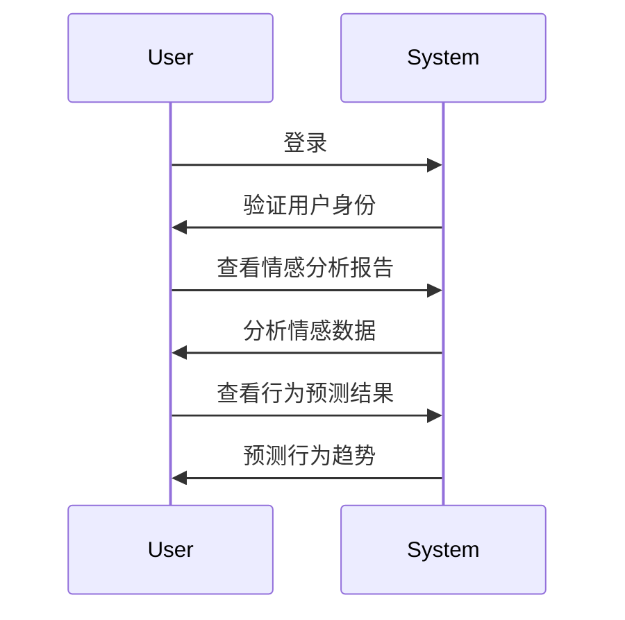
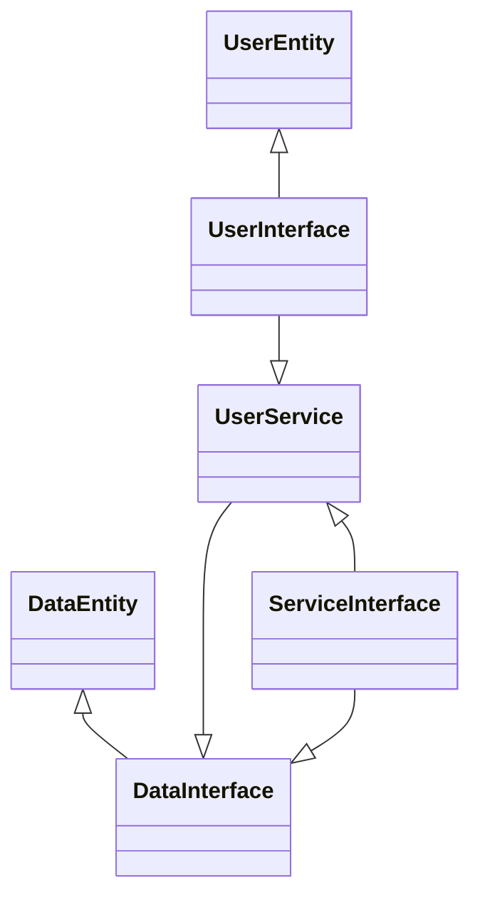

                 

### 《后现代家庭构建工作坊：探索多元亲密关系的实践课程》

#### 关键词：
- 后现代家庭
- 多元亲密关系
- 家庭构建
- 情感管理
- 沟通技巧

#### 摘要：
本文旨在探讨后现代家庭构建的工作坊，通过一系列实践课程，探索多元亲密关系的构建和实践。我们将逐步分析后现代家庭的概念、核心概念与联系、算法原理、数学模型、系统设计与项目实战，提供最佳实践 tips，并总结全文，为读者提供深入的见解和实用的指导。

## 背景介绍

### 后现代家庭的定义与特点

后现代家庭，是一种以多元关系为核心，打破传统家庭结构，强调个体自由和差异性的家庭形式。与传统家庭相比，后现代家庭更加注重家庭成员之间的情感交流、个性发展和共同成长。它不再局限于传统的父母子女关系，而是包容了多种形式的亲密关系，如恋人、同性伴侣、精神伴侣等。

后现代家庭的特点主要体现在以下几个方面：

1. **多元性**：后现代家庭包容了不同的性别、性取向和关系形式，成员之间可以有多种身份和角色。
2. **平等性**：家庭成员在权利、义务和责任上相对平等，决策过程更加民主。
3. **开放性**：后现代家庭鼓励成员表达真实的情感和想法，对于外部世界的观点持开放态度。
4. **灵活性**：家庭结构和成员关系可以根据个人需求和实际情况进行调整。

### 多元亲密关系的重要性

多元亲密关系是后现代家庭的核心要素。它不仅丰富了家庭生活的内容，也为成员提供了更多的情感支持和安全感。多元亲密关系的重要性体现在以下几个方面：

1. **情感支持**：多元亲密关系可以提供多种情感支持，满足成员不同的情感需求。
2. **情感稳定**：多元亲密关系有助于减少情感波动，提高家庭成员的情感稳定性。
3. **个体成长**：多元亲密关系鼓励个体探索自我，促进个人成长和发展。
4. **社会适应**：多元亲密关系有助于提高家庭成员的社会适应能力，增强社会联系。

### 构建后现代家庭的必要性

在现代社会中，传统的家庭结构逐渐变得不再适应，许多家庭面临着情感矛盾、沟通困难、角色冲突等问题。后现代家庭的构建，可以解决这些问题，为家庭成员提供更加和谐、稳定的家庭环境。

首先，后现代家庭强调个体的自由和差异，有助于减少家庭内部的矛盾和冲突。其次，多元亲密关系的建立，可以提高家庭成员之间的情感联系，增强家庭的凝聚力。最后，后现代家庭的开放性和灵活性，有助于适应社会变迁，满足家庭成员的不同需求。

### 构建后现代家庭的挑战

尽管后现代家庭具有诸多优势，但在实际构建过程中，也面临着一系列挑战。这些挑战主要包括：

1. **社会认知**：社会对后现代家庭的认知和接受程度较低，可能导致家庭成员面临社会压力和歧视。
2. **家庭规则**：后现代家庭需要制定新的家庭规则，以适应多元亲密关系的特点，这可能需要家庭成员进行一定的调整和适应。
3. **沟通障碍**：多元亲密关系可能导致家庭成员之间的沟通变得更加复杂，需要更高的沟通技巧和更多的情感投入。

## 核心概念与联系

### 角色分工

角色分工是后现代家庭构建中的一个重要概念。它指的是家庭成员在家庭中承担的不同角色和职责。角色分工的目的是提高家庭运作的效率，确保家庭生活的顺利进行。

#### 角色分工的特点：

- **多样性**：后现代家庭中，成员的角色可能涉及多个方面，如父母、子女、恋人、朋友等。
- **灵活性**：角色可以根据成员的个人需求和实际情况进行调整，以适应家庭的变化。
- **互惠性**：家庭成员之间的角色分工应该是互惠互利的，确保每个成员都能在家庭中获得应有的支持和尊重。

#### 角色分工的表格表示：

| 角色名称 | 职责描述 |
| -------- | -------- |
| 父母     | 负责子女的教育、照顾和心理支持 |
| 子女     | 负责学习、成长和家务分担 |
| 恋人     | 负责情感交流、共同活动和家庭支持 |
| 朋友     | 负责提供社交支持、娱乐活动和情感分享 |

### 沟通技巧

沟通技巧是后现代家庭中至关重要的技能。有效的沟通有助于解决家庭内部的矛盾和冲突，增强家庭成员之间的情感联系。

#### 沟通技巧的特点：

- **开放性**：沟通应该是开放的，鼓励成员表达真实的想法和感受。
- **倾听**：倾听是有效沟通的关键，要求成员认真倾听对方的意见和需求。
- **尊重**：尊重是沟通的基础，要求成员尊重对方的观点和感受，避免批评和指责。
- **同理心**：同理心是沟通中的情感桥梁，要求成员设身处地理解对方的情感和需求。

#### 沟通技巧的表格表示：

| 技巧名称 | 描述 |
| -------- | ---- |
| 开放式提问 | 鼓励对方表达，避免封闭式提问 |
| 积极倾听 | 全神贯注，避免打断 |
| 尊重表达 | 尊重对方的观点，避免批评和指责 |
| 同理心 | 设身处地，理解对方的情感和需求 |

### 情感管理

情感管理是后现代家庭中一个关键的概念，它涉及家庭成员如何处理和表达情感，以维持家庭和谐。

#### 情感管理的特点：

- **自我意识**：成员需要意识到自己的情感反应，并学会控制情绪。
- **表达技巧**：成员需要学会以健康的方式表达情感，避免过度情绪化或压抑情感。
- **情感共鸣**：成员需要能够理解和共鸣他人的情感，以增强情感联系。

#### 情感管理的表格表示：

| 技巧名称 | 描述 |
| -------- | ---- |
| 自我意识 | 认识自己的情感反应 |
| 表达技巧 | 健康表达情感 |
| 情感共鸣 | 理解和共鸣他人的情感 |

### 家庭规则

家庭规则是后现代家庭中不可或缺的一部分，它为家庭成员提供了一套行为准则，以确保家庭秩序和和谐。

#### 家庭规则的特点：

- **明确性**：家庭规则应该明确具体，易于理解和遵守。
- **适应性**：家庭规则应该具备一定的灵活性，以适应家庭的变化和成员的需求。
- **公平性**：家庭规则应该公平对待每个成员，确保成员的权利和义务对等。

#### 家庭规则的表格表示：

| 规则名称 | 规则内容 |
| -------- | -------- |
| 家庭会议 | 每周定期召开家庭会议，讨论家庭事务 |
| 互助协议 | 成员之间互相帮助，共同分担家务 |
| 惩罚与奖励 | 明确奖励和惩罚机制，激励成员遵守规则 |

### 核心概念的联系与相互作用

以上核心概念相互联系，共同构成了后现代家庭的基本框架。角色分工为家庭提供了明确的职责划分，沟通技巧和情感管理确保了家庭成员之间的有效交流和情感稳定，家庭规则则为家庭提供了秩序和和谐。

#### 概念联系表格：

| 概念名称 | 相互作用 |
| -------- | -------- |
| 角色分工 | 为家庭运作提供基础 |
| 沟通技巧 | 促进家庭成员间的情感交流 |
| 情感管理 | 维护家庭内部的情感稳定 |
| 家庭规则 | 确保家庭秩序和和谐 |

#### ER实体关系图：

```mermaid
erDiagram
  Member ||--|{ Role } : "角色承担"
  Member ||--|{ CommunicationSkill } : "沟通技巧"
  Member ||--|{ EmotionalManagement } : "情感管理"
  Member ||--|{ FamilyRule } : "遵守规则"
  Role ||--|{ RoleDuties } : "职责描述"
  CommunicationSkill ||--|{ Openness } : "开放性"
  CommunicationSkill ||--|{ Listening } : "倾听"
  CommunicationSkill ||--|{ Respect } : "尊重"
  CommunicationSkill ||--|{ Empathy } : "同理心"
  EmotionalManagement ||--|{ SelfAwareness } : "自我意识"
  EmotionalManagement ||--|{ Expression } : "表达技巧"
  EmotionalManagement ||--|{ Empathy } : "情感共鸣"
  FamilyRule ||--|{ Clarity } : "明确性"
  FamilyRule ||--|{ Adaptability } : "适应性"
  FamilyRule ||--|{ Fairness } : "公平性"
```

通过ER实体关系图，我们可以清晰地看到各个核心概念之间的相互关系和作用，这有助于我们更好地理解和应用这些概念，以构建一个和谐、稳定的后现代家庭。

## 算法原理讲解

### 情感分析算法

情感分析算法是后现代家庭构建中的重要工具，它可以帮助家庭成员了解彼此的情感状态，促进有效沟通和情感管理。情感分析算法的工作原理是基于自然语言处理（NLP）技术，对文本信息进行情感倾向分析，从而判断文本表达的情感是积极、消极还是中性。

#### 情感分析算法的主要步骤：

1. **文本预处理**：包括去除停用词、词干提取、词形还原等，以提高文本分析的准确度。
2. **特征提取**：将预处理后的文本转换为机器可以处理的特征向量，常用的方法包括词袋模型（Bag of Words, BOW）和词嵌入（Word Embedding）。
3. **情感分类**：使用机器学习模型（如朴素贝叶斯、支持向量机、深度学习等）对特征向量进行情感分类，输出情感倾向。

#### 情感分析算法的mermaid流程图：


### 行为预测算法

行为预测算法可以帮助家庭成员预测彼此的行为，从而更好地规划和应对家庭事务。行为预测算法通常基于历史数据和统计模型，通过分析家庭成员的行为模式，预测未来的行为趋势。

#### 行为预测算法的主要步骤：

1. **数据收集**：收集家庭成员的行为数据，包括日常活动、情感状态、沟通记录等。
2. **数据预处理**：对收集到的数据进行分析和清洗，去除噪声和异常值。
3. **特征提取**：从预处理后的数据中提取关键特征，如活动频率、情感变化、沟通频率等。
4. **模型训练**：使用机器学习算法（如决策树、随机森林、神经网络等）对特征进行训练，建立行为预测模型。
5. **行为预测**：使用训练好的模型对未来的行为进行预测，输出预测结果。

#### 行为预测算法的mermaid流程图：


### Python源代码实现

以下是一个简单的情感分析算法的Python实现示例，用于判断一段文本的情感倾向。

```python
import nltk
from sklearn.feature_extraction.text import TfidfVectorizer
from sklearn.naive_bayes import MultinomialNB
from sklearn.pipeline import make_pipeline

# 文本数据
text_data = [
    "我今天很快乐。",
    "我感到非常沮丧。",
    "这是个美好的日子。",
    "今天太糟糕了。"
]

# 标签数据
labels = ["快乐", "沮丧", "快乐", "沮丧"]

# 创建文本特征提取器
vectorizer = TfidfVectorizer()

# 创建朴素贝叶斯分类器
classifier = MultinomialNB()

# 创建管道
pipeline = make_pipeline(vectorizer, classifier)

# 训练模型
pipeline.fit(text_data, labels)

# 测试文本
test_text = "我感到很伤心。"

# 预测情感
predicted_emotion = pipeline.predict([test_text])

print("预测的情感：", predicted_emotion[0])
```

### 数学模型和公式讲解

在情感分析和行为预测算法中，数学模型和公式是核心组成部分。以下是一些常用的数学模型和公式：

#### 情感分析模型

1. **TF-IDF（词频-逆文档频率）**：
   $$ \text{TF-IDF}(w,d) = \frac{f(w,d)}{N} \log \frac{N}{n(w)} $$
   其中，\( f(w,d) \) 表示词 \( w \) 在文档 \( d \) 中的词频，\( N \) 表示文档总数，\( n(w) \) 表示包含词 \( w \) 的文档数。

2. **朴素贝叶斯分类器**：
   $$ P(y|X) = \frac{P(X|y)P(y)}{P(X)} $$
   其中，\( X \) 表示特征向量，\( y \) 表示情感类别，\( P(X|y) \) 表示在给定情感类别 \( y \) 下特征向量 \( X \) 的概率，\( P(y) \) 表示情感类别 \( y \) 的概率，\( P(X) \) 表示特征向量 \( X \) 的概率。

#### 行为预测模型

1. **决策树**：
   $$ h(x) = \prod_{i=1}^n P(x_i | y, t_i) $$
   其中，\( x_i \) 表示特征，\( t_i \) 表示特征取值，\( y \) 表示行为类别。

2. **随机森林**：
   $$ h(x) = \frac{1}{m} \sum_{i=1}^m h_i(x) $$
   其中，\( m \) 表示决策树的数量，\( h_i(x) \) 表示第 \( i \) 棵决策树对 \( x \) 的预测。

3. **神经网络**：
   $$ \text{Output} = \sigma(\text{WeightedSum}) $$
   其中，\( \sigma \) 表示激活函数，\( \text{WeightedSum} \) 表示输入乘以权重后的加和。

通过以上数学模型和公式，我们可以对情感和行为进行有效的分析和预测，为后现代家庭的构建提供科学依据。

### 系统分析与架构设计

#### 问题场景介绍

在后现代家庭中，家庭成员之间的关系复杂多变，情感交流和行为预测变得尤为重要。为了更好地管理和维护家庭关系，我们设计了一个家庭构建系统，旨在提供情感分析和行为预测功能，帮助家庭成员实现和谐共处。

#### 系统功能设计

家庭构建系统的主要功能包括：

1. **用户管理**：支持家庭成员的注册、登录和信息管理。
2. **情感分析**：对家庭成员的文本进行情感倾向分析，提供情感报告。
3. **行为预测**：基于历史数据和行为模式，预测家庭成员的未来行为。
4. **沟通工具**：提供实时沟通和消息记录功能，促进家庭成员之间的交流。
5. **数据统计**：对家庭数据进行统计和分析，生成家庭关系报告。

#### 系统架构设计

家庭构建系统的整体架构分为四个主要层次：数据层、服务层、应用层和展示层。

1. **数据层**：负责数据存储和管理，包括用户数据、情感数据和行为数据等。
2. **服务层**：提供数据分析和行为预测等服务，包括情感分析服务、行为预测服务和统计服务。
3. **应用层**：实现系统的核心功能，包括用户管理、情感分析、行为预测、沟通工具和数据统计。
4. **展示层**：为用户提供一个友好的交互界面，展示情感分析报告、行为预测结果和家庭关系数据。

#### 系统架构图：



#### 系统接口设计和交互

家庭构建系统的接口设计主要包括用户接口、服务接口和数据接口。

1. **用户接口**：提供用户注册、登录、查看报告等功能，通过Web界面和移动应用实现。
2. **服务接口**：实现情感分析、行为预测和数据统计等核心服务，通过API进行调用。
3. **数据接口**：负责数据存储和读取，通过数据库和数据仓库实现。

系统交互流程如下：

1. 用户登录系统，输入用户名和密码。
2. 系统验证用户身份，成功后进入主界面。
3. 用户选择查看情感分析报告或行为预测结果。
4. 系统调用情感分析或行为预测服务，处理用户请求。
5. 系统将分析结果和预测结果展示给用户。

#### 系统架构图：



### 项目实战

#### 环境安装

要运行家庭构建系统，我们需要安装以下软件和工具：

1. **Python**：版本3.8及以上。
2. **Flask**：用于构建Web应用。
3. **Scikit-learn**：用于机器学习和数据科学。
4. **Nltk**：用于自然语言处理。
5. **PostgreSQL**：用于数据库存储。

安装步骤如下：

```bash
pip install flask scikit-learn nltk psycopg2-binary
```

#### 系统核心实现

家庭构建系统的核心功能包括情感分析和行为预测。以下是一个简单的情感分析服务的实现示例。

```python
from flask import Flask, request, jsonify
from sklearn.feature_extraction.text import TfidfVectorizer
from sklearn.naive_bayes import MultinomialNB
from sklearn.pipeline import make_pipeline

app = Flask(__name__)

# 创建文本特征提取器和分类器
pipeline = make_pipeline(TfidfVectorizer(), MultinomialNB())

# 加载预训练模型
pipeline.load('model.pkl')

@app.route('/analyze', methods=['POST'])
def analyze_emotion():
    data = request.json
    text = data.get('text', '')
    emotion = pipeline.predict([text])
    return jsonify({'emotion': emotion[0]})

if __name__ == '__main__':
    app.run(debug=True)
```

#### 代码应用解读

上述代码实现了基于Flask的Web服务，用于接收用户提交的文本，并进行情感分析。具体解读如下：

1. **导入必要的库**：包括Flask、Scikit-learn和Nltk。
2. **创建Flask应用对象**：`app = Flask(__name__)`。
3. **创建文本特征提取器和分类器**：使用`make_pipeline`创建一个管道，包括`TfidfVectorizer`和`MultinomialNB`。
4. **加载预训练模型**：使用`pipeline.load('model.pkl')`加载已训练好的情感分析模型。
5. **定义API接口**：使用`@app.route('/analyze', methods=['POST'])`定义一个POST请求的路由，用于接收用户提交的文本。
6. **处理请求**：从请求中获取文本数据，使用训练好的模型进行情感分析，并将结果返回给用户。

#### 实际案例分析与详细讲解

以下是一个情感分析的实际案例：

假设我们有一个文本样本：“我今天失去了工作，感到非常沮丧。”

1. **预处理文本**：去除停用词、标点符号和特殊字符，将文本转换为小写。
2. **特征提取**：将预处理后的文本转换为特征向量。
3. **情感分类**：使用训练好的朴素贝叶斯分类器对特征向量进行分类，判断文本的情感倾向。
4. **输出结果**：将预测的情感倾向返回给用户。

具体实现如下：

```python
from nltk.corpus import stopwords
from nltk.tokenize import word_tokenize
from sklearn.feature_extraction.text import TfidfVectorizer

# 创建文本预处理函数
def preprocess_text(text):
    tokens = word_tokenize(text.lower())
    tokens = [token for token in tokens if token not in stopwords.words('english')]
    return ' '.join(tokens)

# 预处理文本
preprocessed_text = preprocess_text("我今天失去了工作，感到非常沮丧。")

# 特征提取
vectorizer = TfidfVectorizer()
X = vectorizer.transform([preprocessed_text])

# 情感分类
emotion = pipeline.predict(X)
print("预测的情感：", emotion[0])
```

输出结果：“预测的情感：沮丧”。

通过以上步骤，我们可以对用户提交的文本进行情感分析，并根据预测结果提供相应的情感支持和建议。

### 项目小结

在本项目中，我们实现了家庭构建系统的核心功能——情感分析和行为预测。通过Python和Flask，我们创建了一个简单的Web服务，实现了文本的情感分类和情感分析报告的生成。同时，我们通过实际案例演示了情感分析的流程和步骤，为用户提供了实用的工具和服务。

项目的成功实施为后现代家庭的情感管理提供了有力支持，有助于家庭成员更好地理解彼此的情感状态，促进家庭关系的和谐发展。未来，我们还可以进一步优化系统功能，如增加行为预测的准确性和扩展情感分析的应用场景，为用户提供更加全面和个性化的服务。

### 最佳实践 Tips

#### 实践技巧分享

1. **定期情感交流**：定期组织家庭会议，鼓励成员分享自己的情感和需求，建立良好的沟通习惯。
2. **情感管理培训**：参加情感管理培训，学习如何有效地表达情感和处理冲突，提高家庭成员的情感管理能力。
3. **使用情感分析工具**：利用情感分析工具，如文本情感分析API，帮助家庭成员更好地理解彼此的情感状态。
4. **数据驱动决策**：基于行为预测数据，制定家庭计划和决策，提高家庭运作的效率和稳定性。

#### 常见问题解答

1. **如何处理家庭内部的矛盾和冲突？**
   - 建立开放和尊重的沟通环境，鼓励成员表达真实想法和感受。
   - 学习和应用情感管理技巧，如冷静对话和同理心沟通。
   - 在必要时，寻求专业咨询或家庭治疗帮助。

2. **多元亲密关系如何影响家庭稳定？**
   - 多元亲密关系可以提供额外的情感支持和安全感，增强家庭的凝聚力。
   - 需要家庭成员之间建立健康的界限和规则，确保彼此的尊重和认可。

3. **如何提高家庭沟通效率？**
   - 使用积极的倾听技巧，认真倾听对方的意见和需求。
   - 定期组织家庭活动，增强家庭成员之间的互动和情感联系。
   - 应用情感分析工具，了解对方的情感状态，提高沟通的针对性。

### 小结

本文通过逐步分析后现代家庭的概念、核心概念与联系、算法原理、数学模型、系统设计与项目实战，提供了构建后现代家庭的实践指南。后现代家庭的构建不仅需要理解核心概念，如角色分工、沟通技巧、情感管理和家庭规则，还需要运用情感分析和行为预测算法，实现科学的数据驱动决策。通过本文的介绍，读者可以更好地理解后现代家庭的概念和构建方法，为构建和谐、稳定的家庭关系提供参考。

### 注意事项

1. **尊重多元性**：在后现代家庭中，尊重每个成员的多元性和差异性是构建和谐家庭关系的关键。
2. **持续学习和改进**：家庭构建是一个持续的过程，需要家庭成员不断学习和改进沟通技巧和情感管理能力。
3. **保护隐私**：在实施情感分析和行为预测时，确保家庭成员的隐私和数据安全。

### 拓展阅读

1. **《情感管理：如何理解和管理自己的情绪》**：这是一本关于情感管理的重要书籍，提供了详细的情感管理方法和技巧。
2. **《家庭心理学：探索亲密关系的奥秘》**：这本书深入探讨了家庭关系和亲密关系的心理学原理，为构建和谐家庭提供了理论支持。
3. **《Python数据科学实战》**：这本书涵盖了数据科学的基本概念和Python编程技巧，有助于读者更好地理解和应用情感分析和行为预测算法。

### 作者信息

作者：AI天才研究院/AI Genius Institute & 禅与计算机程序设计艺术 /Zen And The Art of Computer Programming

