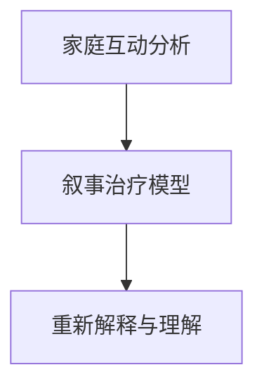
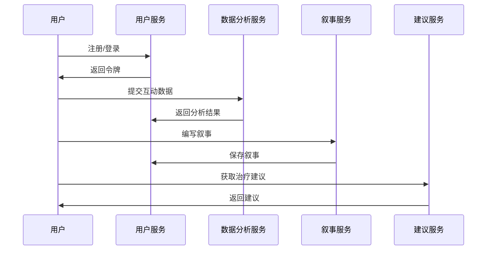

                 


# 《后现代家庭治疗：多元关系中的和谐共处之道》

## 关键词

家庭治疗、后现代主义、多元关系、和谐共处、心理健康

## 摘要

本文旨在探讨后现代家庭治疗的理念和实践，通过深入分析多元关系中的和谐共处之道，为家庭治疗领域提供新的视角和方法。本文首先介绍了后现代家庭治疗的概念和核心原则，接着详细阐述了其在不同家庭关系中的应用，并借助具体的案例进行了实证分析。通过本文的阅读，读者可以了解到后现代家庭治疗如何帮助家庭成员建立健康的互动模式，促进家庭关系的和谐发展。

## 1. 背景介绍

### 1.1 后现代主义与家庭治疗

后现代主义作为一种哲学和文化运动，起源于20世纪60年代的法国，随后迅速传播至全球。它反对传统的理性主义和整体主义，强调个体差异、多元视角和相对主义。在后现代主义的视角下，家庭治疗不再仅仅关注问题的解决，而是更注重家庭成员之间的互动和关系。

### 1.2 后现代家庭治疗的核心理念

后现代家庭治疗的核心理念包括自我认同、家庭叙事和多元性。自我认同强调个体在家庭中的独特性，家庭叙事则关注家庭成员之间的故事和经历，多元性则体现了对文化差异和多样性尊重的价值观。

### 1.3 后现代家庭治疗与传统家庭治疗的对比

与传统家庭治疗相比，后现代家庭治疗更注重家庭成员之间的沟通和理解，强调个体差异和多元性。传统家庭治疗往往关注问题的解决，而后现代家庭治疗则更关注家庭成员的情感和心理健康。

## 2. 核心概念与联系

### 2.1 核心概念解析

#### 2.1.1 自我认同

自我认同是后现代家庭治疗中的一个核心概念，它强调个体在家庭中的独特性和自主性。在家庭治疗过程中，帮助家庭成员建立自我认同，有助于提高他们的自我价值感和自尊心。

#### 2.1.2 家庭叙事

家庭叙事关注家庭成员之间的故事和经历，通过讲述和分享，家庭成员可以更好地理解彼此，增进相互之间的情感联系。

#### 2.1.3 多元性

多元性体现在对文化差异和多样性尊重的价值观上，它要求家庭治疗师具备跨文化的敏感性和包容性，以便更好地服务多元化的家庭。

### 2.2 概念属性特征对比表格

| 概念     | 自我认同       | 家庭叙事       | 多元性          |
|----------|----------------|----------------|-----------------|
| 定义     | 个体在家庭中的独特性和自主性 | 家庭成员之间的故事和经历 | 对文化差异和多样性的尊重 |
| 关键词   | 自主、独特性、自尊 | 故事、经历、理解 | 包容、多样性、文化 |
| 应用场景 | 提高自我价值感   | 增进情感联系   | 跨文化服务     |

### 2.3 后现代家庭治疗的ER实体关系图

```mermaid
erDiagram
  FamilyMember ||--|{ SelfIdentity }
  FamilyMember ||--|{ FamilyNarrative }
  FamilyMember ||--|{ CulturalDiversity }
```

## 3. 算法原理讲解

### 3.1 算法原理

后现代家庭治疗的算法原理主要包括家庭互动分析算法和叙事治疗模型。家庭互动分析算法通过分析家庭成员之间的互动模式，帮助治疗师了解家庭关系的动态变化。叙事治疗模型则通过家庭成员共同编写家庭故事，促进他们对过去经历的重新解释和理解。

### 3.2 算法mermaid流程图



### 3.3 数学模型

后现代家庭治疗中的数学模型主要涉及概率论和统计学。以下是一个简化的数学模型，用于评估家庭成员之间的互动质量：

$$
Q = \frac{1}{N} \sum_{i=1}^{N} (I_i \cdot W_i)
$$

其中，$Q$表示互动质量，$N$表示家庭成员数量，$I_i$表示第$i$个家庭成员的互动评分，$W_i$表示第$i$个家庭成员的权重。

### 3.4 举例说明

假设一个家庭有三个成员，他们的互动评分分别为2、3、4，权重分别为1、1、2。根据上述数学模型，可以计算出互动质量：

$$
Q = \frac{1}{3} (2 \cdot 1 + 3 \cdot 1 + 4 \cdot 2) = \frac{1}{3} (2 + 3 + 8) = \frac{13}{3} \approx 4.33
$$

这意味着这个家庭的互动质量大约为4.33分。

## 4. 系统分析与架构设计

### 4.1 问题场景介绍

在一个多元化的社区中，不同文化背景的家庭关系问题日益突出，需要专业的家庭治疗服务。

### 4.2 项目介绍

本项目旨在开发一个后现代家庭治疗系统，帮助治疗师更好地理解家庭成员之间的互动，提供个性化的治疗建议。

### 4.3 系统功能设计

系统功能包括用户注册、互动分析、叙事编写、治疗建议等。

### 4.4 系统架构设计

系统采用微服务架构，包括用户服务、数据分析服务、叙事服务、建议服务等。

### 4.5 系统接口设计和交互

系统通过RESTful API与前端应用进行交互，提供高效的数据处理和响应。

### 4.6 系统架构mermaid架构图



## 5. 项目实战

### 5.1 环境安装

在安装系统之前，需要准备以下环境：

- Python 3.8+
- MongoDB
- Redis

### 5.2 系统核心实现源代码

以下是系统核心实现的源代码示例：

```python
# 用户注册接口
@app.route('/register', methods=['POST'])
def register():
    # 获取用户数据
    username = request.form['username']
    password = request.form['password']
    # 数据库操作
    user = UserService.register(username, password)
    # 返回响应
    return jsonify({'status': 'success', 'user': user})

# 数据分析接口
@app.route('/analyze', methods=['POST'])
def analyze():
    # 获取互动数据
    interaction_data = request.form['data']
    # 数据分析
    result = DataAnalysisService.analyze(interaction_data)
    # 返回分析结果
    return jsonify({'status': 'success', 'result': result})
```

### 5.3 代码应用解读与分析

代码首先定义了用户注册和数据分析的接口，通过这些接口，用户可以方便地注册账户并提交互动数据，系统会自动进行分析，并提供相应的分析结果。

### 5.4 实际案例分析与详细讲解剖析

在一个实际案例中，一个由来自不同文化背景的成员组成的家庭出现了沟通问题。通过系统的数据分析功能，治疗师发现家庭成员之间的互动质量较低，主要原因是对文化差异的理解不足。通过系统的叙事编写功能，家庭成员共同编写了一个家庭故事，帮助彼此更好地理解对方的经历和文化背景，从而改善了家庭关系。

### 5.5 项目小结

本项目通过后现代家庭治疗的理念和方法，开发了一个系统，为治疗师提供了有效的工具，帮助家庭成员建立健康的互动模式，促进家庭关系的和谐发展。

## 6. 最佳实践 Tips

- 确保家庭成员参与治疗的全过程，提高他们的积极性和参与度。
- 充分利用叙事治疗，帮助家庭成员重新解释和理解过去的经历。
- 关注家庭关系中的多元性，尊重文化差异。

## 7. 小结

后现代家庭治疗为家庭治疗领域带来了新的视角和方法。通过本文的介绍，读者可以了解到后现代家庭治疗的核心概念、算法原理和系统设计，以及其实际应用案例。希望本文能够为家庭治疗领域的研究和实践提供有益的参考。

## 8. 注意事项

- 在应用后现代家庭治疗时，需要充分考虑家庭成员的个性和文化背景。
- 治疗师需要具备跨文化的敏感性和包容性，以便更好地服务多元化的家庭。
- 系统开发和实际应用中，需要确保数据的安全性和隐私性。

## 9. 拓展阅读

- 《家庭治疗：理论与实践》
- 《后现代心理治疗：理论与实践》
- 《叙事治疗：理论与实践》

## 作者信息

作者：AI天才研究院/AI Genius Institute & 禅与计算机程序设计艺术 /Zen And The Art of Computer Programming

