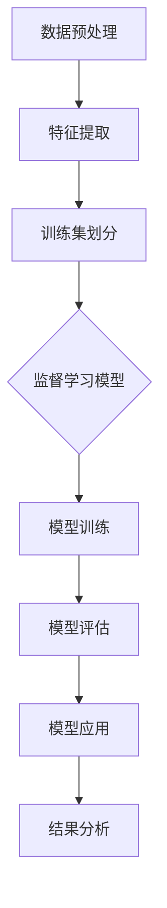
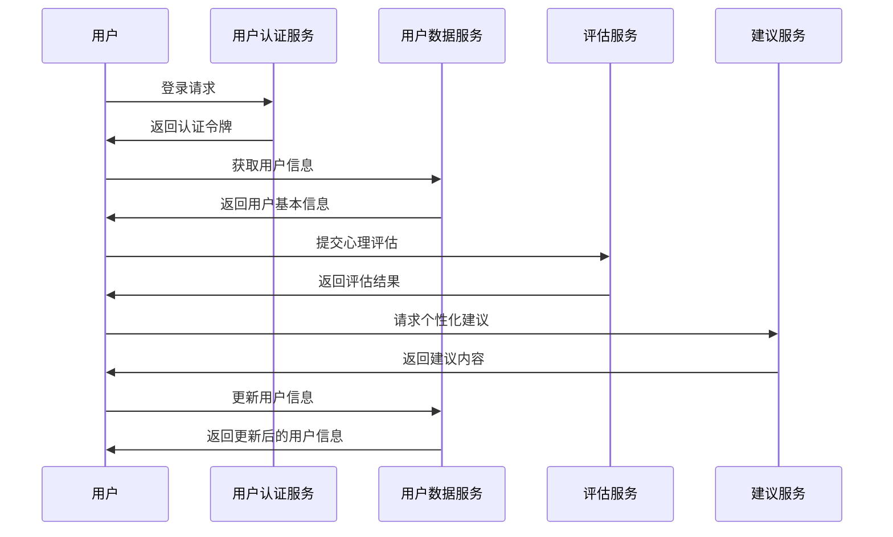

                 

### 引言

在现代社会快速发展的背景下，人类社会逐渐迈向了一个新的阶段——后现代社会。后现代社会不仅带来了科技的飞速进步和全球化的深度发展，也引发了诸多深刻的社会变革。在这些变革中，自我认同危机成为一个不可忽视的现象。后现代社会的特征，如多元文化、去中心化、信息过载等，对个体自我认同产生了深远影响。本文旨在探讨后现代社会中的自我认同危机，通过逻辑清晰、结构紧凑的分析，揭示这一危机的内涵、表现及其背后的机制。

自我认同危机不仅仅是心理学或社会学的议题，它同样关乎技术的进步和算法的发展。本文将结合计算机科学和人工智能领域的相关理论，探讨如何通过算法分析和系统设计来应对自我认同危机。文章将分为以下几个部分：首先，介绍后现代社会的特征与自我认同危机的背景；其次，深入探讨后现代主义与自我认同的关系；然后，通过算法原理讲解和分析，提供具体的应对策略；接着，详细阐述系统分析与架构设计方案；最后，通过项目实战和最佳实践，总结文章的核心观点并给出未来研究方向。

我们将一步步地分析推理，确保读者能够清晰地理解自我认同危机的各个方面。无论您是心理学研究者、社会学家、程序员还是人工智能领域的从业者，本文都将为您的思考提供一个新的视角。让我们一起思考，探索后现代社会中的自我认同危机，并提出有效的解决方案。

### 文章关键词

**后现代社会**、**自我认同危机**、**后现代主义**、**算法分析**、**系统设计**、**社会建构主义**、**自我认同**。

### 摘要

本文旨在探讨后现代社会中的自我认同危机，分析其背景、内涵、表现形式及其对个体和社会的深远影响。首先，文章介绍了后现代社会的特征，如多元文化、去中心化、信息过载等，以及这些特征对自我认同的挑战。接着，通过后现代主义与社会建构主义的理论视角，深入探讨了自我认同危机的成因和表现形式。然后，文章通过算法分析和系统设计的方法，提出了应对自我认同危机的具体策略。最后，通过项目实战和最佳实践，验证了这些策略的可行性和有效性。本文期望为心理学、社会学以及人工智能领域的从业者和研究者提供新的思考方向和实践参考。

### 目录大纲设计

为了系统地探讨后现代社会中的自我认同危机，本文设计了以下目录大纲：

#### 第一部分：背景介绍

**第1章：后现代社会的特征与自我认同危机**

- 1.1 后现代社会的概念与起源
  - 后现代社会的定义与特点
  - 后现代主义哲学的起源与发展

- 1.2 自我认同危机的内涵与表现
  - 自我认同危机的定义
  - 自我认同危机的表现形式

- 1.3 社会背景下的自我认同危机
  - 全球化对自我认同的影响
  - 科技发展对自我认同的冲击
  - 经济变革对自我认同的挑战

- 1.4 核心概念与联系
  - 后现代主义与自我认同危机
  - 社会建构主义与自我认同

#### 第二部分：核心概念与联系

**第2章：后现代主义与自我认同**

- 2.1 后现代主义概述
  - 后现代主义的发展历程
  - 后现代主义的核心理念

- 2.2 后现代主义与自我认同的关系
  - 后现代主义如何影响自我认同
  - 自我认同在后现代主义背景下的转变

- 2.3 后现代主义理论中的核心概念
  - 解构主义与自我认同
  - 反主体性理论与自我认同

- 2.4 社会建构主义与自我认同
  - 社会建构主义的基本观点
  - 社会建构主义对自我认同的影响

#### 第三部分：算法原理讲解

**第3章：自我认同危机的算法分析**

- 3.1 数据预处理与特征提取
  - 数据清洗与数据规范化
  - 自我认同危机的特征提取

- 3.2 算法原理与流程图
  - 自我认同危机分析的算法原理
  - 使用 Mermaid 画算法流程图

- 3.3 算法数学模型与公式
  - 算法中的数学模型
  - 使用 LaTeX 格式给出数学公式

- 3.4 算法举例说明
  - 示例数据与算法应用
  - 算法结果的解释与分析

#### 第四部分：系统分析与架构设计方案

**第4章：自我认同危机的应对策略**

- 4.1 问题场景介绍
  - 自我认同危机在不同领域的影响
  - 问题场景的具体描述

- 4.2 系统功能设计
  - 领域模型与类图
  - 使用 Mermaid 画出领域模型类图

- 4.3 系统架构设计
  - 系统架构设计与架构图
  - 使用 Mermaid 画出系统架构图

- 4.4 系统接口设计
  - 系统接口设计
  - 系统接口的定义与实现

- 4.5 系统交互与序列图
  - 系统交互设计与序列图
  - 使用 Mermaid 画出系统交互序列图

#### 第五部分：项目实战

**第5章：自我认同危机分析项目实践**

- 5.1 环境安装与准备
  - 环境安装指南
  - 系统配置与调试

- 5.2 系统核心实现
  - 系统核心功能的代码实现
  - 代码解读与分析

- 5.3 实际案例分析与讲解
  - 案例数据的收集与处理
  - 案例分析结果与解读

- 5.4 项目总结与展望
  - 项目成果总结
  - 项目中的经验与教训
  - 未来研究方向与拓展

#### 第六部分：最佳实践与拓展阅读

**第6章：自我认同危机的应对策略与实践**

- 6.1 最佳实践技巧
  - 经验总结与技巧分享
  - 实际案例中的最佳实践

- 6.2 注意事项与风险规避
  - 项目实施中的常见问题与解决方法
  - 风险评估与预防措施

- 6.3 拓展阅读推荐
  - 推荐相关书籍与文献
  - 后续研究方向的拓展建议

- 6.4 小结
  - 全书内容的总结
  - 自我认同危机应对的总体思路与策略

### 第一部分：背景介绍

#### 第1章：后现代社会的特征与自我认同危机

##### 1.1 后现代社会的概念与起源

后现代社会这一概念最早由法国社会学家让-弗朗索瓦·利奥塔在1980年代提出，用以描述现代社会在技术革命、文化多元化和全球化进程中的新特征。后现代社会与传统社会相比，具有显著的不同。首先，后现代社会是一个去中心化的社会，权力和资源不再集中在少数精英手中，而是分散在广泛的社会群体中。这种去中心化不仅体现在政治和经济领域，也体现在文化和意识形态方面。

其次，后现代社会是一个高度复杂和多样化的社会。全球化使得不同文化、宗教和价值观交织在一起，形成了多元化的社会环境。这种多元性带来了文化的丰富性，但同时也增加了个体认同的复杂性。每个人都需要在众多选择中寻找自己的定位，这无疑给自我认同带来了巨大挑战。

再次，后现代社会是一个信息爆炸的社会。互联网和移动通信技术的飞速发展，使得信息的获取和传播变得前所未有的便捷。尽管这为个体提供了丰富的资源和知识，但信息过载也带来了认知负荷。面对海量信息，个体难以进行有效的筛选和处理，从而产生焦虑和困惑。

后现代主义哲学是后现代社会的重要理论基础。后现代主义认为，传统的理性主义和科学方法已经不足以解释现代社会的复杂性。后现代主义者强调多样性和相对主义，认为真理并非固定不变，而是由不同的文化和社会背景塑造的。这种观点对自我认同产生了深远影响，削弱了个体对传统价值观念的依赖，迫使个体重新审视和定义自己的身份。

##### 1.2 自我认同危机的内涵与表现

自我认同危机是指在现代社会和后现代社会背景下，个体在寻求自我认同过程中遇到的困难和挑战。这种危机不仅表现为个体对自我认知的模糊和混乱，还可能引发一系列心理和社会问题。

首先，自我认同危机表现为个体对自我的认知模糊。在多元化的社会中，个体面临着大量的选择和可能性，难以确定自己的位置和角色。这种模糊性导致个体自我认同的不确定，甚至产生自我怀疑和自我否定。

其次，自我认同危机可能表现为个体的焦虑和困惑。面对复杂多变的社会环境，个体难以适应和应对，从而产生焦虑和困惑。这种情绪问题不仅影响个体的心理健康，也可能影响其社会功能。

此外，自我认同危机还可能表现为个体的行为和价值观的混乱。在去中心化的社会中，个体价值观的多样性增加了个体选择的难度，导致个体在行为和决策上产生困惑和矛盾。这种矛盾不仅影响个体的内在一致性和稳定性，也可能影响其社会交往和人际关系。

自我认同危机的表现形式多种多样，但核心问题都是个体在寻求自我认同过程中遇到的心理困境。这种困境不仅影响个体的生活质量，也对社会整体的健康和稳定产生负面影响。因此，深入探讨自我认同危机的内涵和表现，对于理解现代社会的问题和提出有效的解决方案具有重要意义。

##### 1.3 社会背景下的自我认同危机

自我认同危机在现代社会和后现代社会中具有特定的社会背景和成因。全球化、科技发展和经济变革是影响自我认同危机的重要因素。

首先，全球化对自我认同产生了深远影响。全球化使不同国家和地区的文化、价值观和社会实践相互交融，个体面临着前所未有的文化冲击和认同挑战。全球化带来的文化多样性丰富了个体选择，但同时也增加了个体身份认同的复杂性。个体在多元文化的冲击下，难以确定自己的文化归属，从而产生自我认同危机。

其次，科技发展对自我认同的冲击不容忽视。互联网和移动通信技术的普及，使得信息传播速度大大加快，个体可以轻松地获取和交流各种信息。然而，信息过载也带来了认知负担，个体难以从海量信息中筛选出有价值的内容，从而产生困惑和焦虑。此外，科技发展还改变了个体与社会的互动方式，虚拟社交和数字身份的兴起，使得个体在现实和虚拟世界中面临不同的认同问题。

最后，经济变革对自我认同危机也产生了重要影响。经济全球化导致就业市场的不稳定，个体面临失业和职业转型的高风险。这种经济不确定性使得个体在职业和收入方面缺乏安全感，从而影响其自我认同的稳定性。同时，经济变革还带来了社会阶层的变化，个体在追求经济利益的过程中，可能忽视了对个人价值和身份的追求，进一步加剧了自我认同危机。

总体而言，全球化、科技发展和经济变革是后现代社会中自我认同危机的重要背景。这些因素相互作用，共同影响个体在寻求自我认同过程中遇到的问题和挑战。理解这些社会背景，有助于我们更好地应对自我认同危机，推动个体和社会的健康发展。

##### 1.4 核心概念与联系

在探讨后现代社会中的自我认同危机时，理解几个核心概念及其相互联系至关重要。这些概念包括后现代主义、社会建构主义和自我认同。它们不仅构成了分析自我认同危机的理论基础，也为我们提供了深入思考这一问题的不同视角。

首先，后现代主义是理解自我认同危机的关键概念。后现代主义源于20世纪中叶，是一种对现代性批判的思想流派。它主张，现代社会中的真理、知识和价值观都是相对的，而非绝对的。后现代主义强调多样性和相对主义，认为社会和文化现象没有统一的解释，而是由不同的文化和社会背景所塑造。这种观点对个体自我认同产生了深远影响，因为它削弱了传统价值观念的权威性，迫使个体在多元选择中重新定义自己。

其次，社会建构主义是与后现代主义密切相关的另一个核心概念。社会建构主义认为，知识和现实是通过社会互动和文化实践建构的，而非客观存在的。这意味着个体的自我认同不仅是内在的心理过程，也是社会互动和文化背景下的产物。社会建构主义强调社会环境对个体认知和行为的塑造作用，这为我们理解自我认同危机提供了重要的视角。在多元化的社会环境中，个体如何通过社会互动建构自己的身份和认同，成为探讨自我认同危机的重要问题。

自我认同是后现代主义和社会建构主义的交汇点。自我认同不仅涉及个体对自己的认知和定位，还受到社会和文化因素的影响。在现代社会和后现代社会背景下，自我认同危机表现为个体在寻求自我认同过程中遇到的困惑和挑战。这种危机不仅是心理学问题，也具有社会意义，因为它反映了个体在社会环境中的适应问题。

后现代主义和社会建构主义为理解自我认同危机提供了不同的理论视角。后现代主义强调多样性和相对主义，质疑传统价值观念的权威性，这有助于我们理解个体在多元选择中面临的认同挑战。社会建构主义则强调社会互动和文化实践在个体认知和认同建构中的重要作用，这为我们提供了探讨自我认同危机的动态视角。通过结合这些核心概念，我们可以更全面地理解自我认同危机的内涵和表现形式，并提出有效的应对策略。

### 第二部分：核心概念与联系

#### 第2章：后现代主义与自我认同

##### 2.1 后现代主义概述

后现代主义是一种起源于20世纪中叶的思想流派，它对现代性进行了深刻的批判和反思。后现代主义的核心理念主要包括解构主义、反主体性理论和多元文化主义。这些理念共同构成了后现代主义的哲学基础，对自我认同产生了深远影响。

首先，解构主义是后现代主义的重要分支。解构主义由法国哲学家德里达提出，主张对传统哲学和文化的二元对立结构进行解构。解构主义认为，语言和符号系统本身是充满矛盾的，它们无法传达绝对的真理。这种观点挑战了现代性中的理性主义和科学方法，质疑了知识的基础和权威。在自我认同的层面，解构主义削弱了个体对固定身份和自我认知的依赖，促使个体在多元选择中重新审视和定义自己的身份。

其次，反主体性理论是后现代主义的另一核心观点。反主体性理论认为，传统哲学中的“主体”概念是过度简化和抽象的，它忽略了社会和文化背景对个体认知和行为的影响。反主体性理论主张，个体自我认同的形成是一个动态的过程，受到社会互动和文化实践的影响。这种观点挑战了个体自我认同的固定性和稳定性，强调了社会环境在自我认同建构中的重要作用。

最后，多元文化主义是后现代主义的重要理念之一。多元文化主义认为，现代社会是一个多元化的文化集合体，各种文化应当相互尊重和包容。多元文化主义反对文化单一化和同质化，主张个体在多元文化的背景下找到自己的位置和认同。这种观点为个体提供了更多的选择，但也增加了自我认同的复杂性。在多元文化社会中，个体需要在众多文化元素中寻找自己的归属感，这无疑给自我认同带来了新的挑战。

通过解构主义、反主体性理论和多元文化主义，后现代主义为理解和分析自我认同提供了独特的视角。它不仅质疑了传统价值观念的权威性，还强调了社会互动和文化实践在自我认同建构中的重要性。这些理念共同构成了后现代主义对自我认同的理论基础，为我们深入探讨自我认同危机提供了重要的理论工具。

##### 2.2 后现代主义与自我认同的关系

后现代主义对自我认同的影响是多方面且深远的。首先，后现代主义解构了传统自我认同的基础。传统自我认同往往建立在固定、统一的身份和价值观上，而后现代主义通过解构这些固定结构，促使个体重新审视和定义自己的身份。这种解构不仅打破了个体对固定身份的依赖，也带来了自我认同的多样性和复杂性。

后现代主义解构主义的核心观点是，语言和符号系统本身是充满矛盾的，它们无法传达绝对的真理。这种观点对传统自我认同的固定性和确定性提出了质疑。在现代社会中，个体面临着大量的选择和可能性，传统自我认同的单一性和固定性难以适应这种复杂性。解构主义促使个体在多元选择中重新寻找和建构自己的身份，从而丰富了自我认同的内涵。

反主体性理论是后现代主义对自我认同的另一重要影响。反主体性理论认为，传统哲学中的“主体”概念是过度简化和抽象的，它忽略了社会和文化背景对个体认知和行为的影响。这种观点挑战了个体自我认同的固定性和稳定性，强调了社会环境在自我认同建构中的动态性。在反主体性理论的视角下，自我认同不再是固定的实体，而是一个不断演变和重构的过程。个体需要在社会互动和文化实践中不断调整和更新自己的认同，以适应不断变化的社会环境。

多元文化主义是后现代主义对自我认同的第三大影响。多元文化主义认为，现代社会是一个多元化的文化集合体，各种文化应当相互尊重和包容。在多元文化社会中，个体需要在众多文化元素中寻找自己的位置和认同。这种多元性为个体提供了更多的选择，但也增加了自我认同的复杂性。在多元文化背景下，个体需要不断跨越文化界限，寻找自我认同的多样性，这无疑给自我认同带来了新的挑战。

总的来说，后现代主义通过解构主义、反主体性理论和多元文化主义，对自我认同产生了深远影响。它不仅打破了传统自我认同的固定性和确定性，强调了自我认同的多样性和复杂性，也为个体在多元化社会中重新寻找和建构自我认同提供了新的视角和工具。

##### 2.3 后现代主义理论中的核心概念

在后现代主义的理论体系中，解构主义、反主体性理论和多元文化主义是其核心概念，它们共同构成了对自我认同影响的坚实基础。

首先，解构主义。解构主义由法国哲学家雅克·德里达提出，它主张对传统二元对立结构进行解构，质疑语言和符号系统的绝对性和确定性。在解构主义的视角下，语言不仅仅是传递信息的工具，而是充满矛盾和不确定性的系统。这种矛盾性体现在语言符号的多元解读上，使得任何固定的意义和真理都变得相对和可重构。在自我认同的层面，解构主义挑战了传统身份和价值观的固定性，促使个体在多元选择中重新定义自己的身份。解构主义强调，自我认同是一个动态的过程，受到社会互动和文化实践的不断重构。

其次，反主体性理论。反主体性理论是后现代主义对传统“主体”概念的一种批判。传统哲学中的“主体”被视为一个独立、自主的实体，具有固定和确定的本质。然而，后现代主义认为，这种“主体”概念是过度简化和抽象的，它忽略了社会和文化背景对个体认知和行为的影响。反主体性理论主张，个体自我认同的形成是一个动态的过程，受到社会互动和文化实践的影响。这意味着，自我认同不仅是内在的心理过程，也是一个社会建构的过程。个体需要在与社会环境的互动中不断调整和更新自己的认同，以适应不断变化的社会现实。

最后，多元文化主义。多元文化主义认为，现代社会是一个多元化的文化集合体，各种文化应当相互尊重和包容。多元文化主义反对文化单一化和同质化，主张个体在多元文化的背景下找到自己的位置和认同。多元文化主义强调，自我认同的多样性和复杂性是现代社会的一个重要特征。个体需要在不同的文化元素中寻找自己的归属感，这既提供了更多的选择，也带来了新的挑战。在多元文化社会中，个体需要不断跨越文化界限，理解并接受不同文化的价值观和生活方式，从而丰富自己的认同。

通过解构主义、反主体性理论和多元文化主义，后现代主义提供了理解自我认同的新视角。这些理论不仅质疑了传统自我认同的固定性和确定性，强调了自我认同的动态性和多样性，也为个体在多元化社会中重新寻找和建构自我认同提供了重要的理论支持。

##### 2.4 社会建构主义与自我认同

社会建构主义是后现代主义的一个重要分支，它强调知识和社会现实的建构过程，主张个体自我认同的形成是社会互动和文化实践的结果。社会建构主义的核心观点包括：知识是社会的产物，而非客观事实；个体自我认同是动态的，受到社会环境和文化背景的影响。

首先，社会建构主义认为知识是社会互动的产物。社会建构主义质疑了传统科学观中的客观性和确定性，认为知识是通过社会互动和文化实践建构出来的。这意味着，不同的社会和文化背景下，人们对同一现象的理解和解释可能是不同的。在自我认同的层面，这种观点强调，个体对自己的认知和身份的定义是受到社会环境和他人期望的影响的。个体在成长过程中，通过与他人的互动和社会实践，逐渐建构出自我认同。

其次，社会建构主义认为个体自我认同是动态的。社会建构主义强调，自我认同不是固定不变的，而是一个不断变化和重构的过程。个体在不同的社会情境中，可能会表现出不同的身份和角色。这种动态性反映了社会建构主义对个体自我认同的灵活性认识，也意味着个体需要在不断变化的社会环境中调整和更新自己的认同。例如，一个人在家庭、工作和社会中的角色和身份可能是不同的，这些不同的角色和身份共同构成了个体的自我认同。

社会建构主义对自我认同的影响体现在以下几个方面：

1. **减少固定身份的依赖**：社会建构主义质疑了传统自我认同的固定性和稳定性，主张个体在多元化社会中，不应过分依赖固定的身份和角色。这种观点鼓励个体在自我认同的构建过程中，保持开放和灵活的态度，以适应不断变化的社会环境。

2. **促进自我认同的多样性**：社会建构主义认为，个体自我认同的形成受到多种社会和文化因素的影响。这意味着，个体可以在不同的社会和文化背景下，形成多样化的自我认同。例如，一个人可以在家庭中是儿子，在工作中是工程师，在社区中是志愿者，这些不同的身份共同构成了个体的自我认同。

3. **增强社会互动的重要性**：社会建构主义强调，社会互动在自我认同建构中的关键作用。个体通过与他人的互动和社会实践，不断调整和更新自己的认同。这种观点提醒我们，社会互动不仅是个体获取知识和信息的重要途径，也是自我认同建构的重要手段。

总之，社会建构主义为理解自我认同提供了一个动态、多元的视角，强调了社会互动和文化实践在个体自我认同形成中的重要作用。通过这种视角，我们可以更全面地理解个体在多元化社会中的认同挑战和机遇，从而提出更有效的应对策略。

### 第三部分：算法原理讲解

#### 第3章：自我认同危机的算法分析

自我认同危机的算法分析旨在通过数据分析和模型构建，揭示个体在自我认同过程中的困境和挑战。算法分析不仅可以帮助我们理解自我认同危机的内在机制，还可以提供有效的策略和解决方案。以下内容将详细介绍自我认同危机算法分析的方法和步骤。

##### 3.1 数据预处理与特征提取

在进行自我认同危机的算法分析之前，数据预处理和特征提取是至关重要的一步。数据预处理包括数据清洗、数据规范化、缺失值处理等步骤，以确保数据的质量和一致性。具体来说，数据清洗涉及去除重复数据、处理噪声数据和填补缺失值等；数据规范化则包括将数据统一到相同的尺度，以便后续的模型训练和特征提取。

特征提取是数据预处理的关键环节。在自我认同危机的背景下，特征提取的目标是识别和提取与个体自我认同相关的关键特征。这些特征可以来源于多种数据源，如个体心理测评结果、社交媒体数据、生活经历等。常见的方法包括：

1. **情感分析**：通过自然语言处理技术，分析个体在文本中的情感倾向，提取情感特征。
2. **社会网络分析**：通过分析个体在社交网络中的互动关系，提取社会特征。
3. **行为数据挖掘**：通过分析个体的行为数据，如购物记录、浏览习惯等，提取行为特征。

这些特征共同构成了自我认同危机分析的输入数据，为后续的算法模型提供基础。

##### 3.2 算法原理与流程图

自我认同危机的算法分析通常采用机器学习技术，如监督学习和无监督学习。监督学习模型可以用来预测个体自我认同危机的程度，而无监督学习模型则可以用于探索个体自我认同的特征和模式。以下是自我认同危机分析的一般算法原理和流程图：

1. **数据预处理**：对收集到的数据进行清洗和规范化，确保数据质量。
2. **特征提取**：从预处理后的数据中提取与自我认同相关的特征。
3. **训练集划分**：将数据集划分为训练集和测试集，用于模型的训练和评估。
4. **监督学习模型**：选择合适的监督学习模型，如逻辑回归、决策树、支持向量机等。
5. **模型训练**：使用训练集数据训练模型，得到模型参数。
6. **模型评估**：使用测试集数据评估模型性能，调整模型参数。
7. **模型应用**：将训练好的模型应用于新的数据，预测个体自我认同危机的程度。
8. **结果分析**：分析模型预测结果，提取有意义的结论和洞察。

通过以上流程，算法分析可以帮助我们理解和应对自我认同危机。

##### 3.3 算法数学模型与公式

在自我认同危机的算法分析中，数学模型是核心组成部分。以下是一些常见的数学模型和公式，用于描述自我认同危机的特征和机制。

1. **逻辑回归模型**：
   逻辑回归是一种常用的分类模型，用于预测个体自我认同危机的发生概率。其数学模型如下：
   $$P(Y=1) = \frac{1}{1 + e^{-(\beta_0 + \beta_1 X_1 + \beta_2 X_2 + ... + \beta_n X_n )}}$$
   其中，$Y$ 表示个体自我认同危机的发生情况（$Y=1$ 表示发生危机，$Y=0$ 表示未发生危机），$X_1, X_2, ..., X_n$ 是特征变量，$\beta_0, \beta_1, \beta_2, ..., \beta_n$ 是模型参数。

2. **支持向量机（SVM）模型**：
   支持向量机是一种强大的分类模型，通过找到特征空间中的最优分割超平面，实现分类任务。其数学模型如下：
   $$w \cdot x - b = 0$$
   其中，$w$ 是超平面法向量，$x$ 是特征向量，$b$ 是偏置项。

3. **聚类分析模型**：
   聚类分析是一种无监督学习技术，用于发现数据中的自然分组。常用的聚类算法包括K-均值聚类和层次聚类。K-均值聚类的数学模型如下：
   $$\min_{\mu_1, \mu_2, ..., \mu_k} \sum_{i=1}^{n} \sum_{j=1}^{k} ||x_i - \mu_j||^2$$
   其中，$x_i$ 是数据点，$\mu_j$ 是聚类中心。

通过这些数学模型和公式，我们可以更深入地理解自我认同危机的内在机制，并开发有效的算法来应对这一社会问题。

##### 3.4 算法举例说明

为了更好地理解自我认同危机的算法分析，以下将通过一个具体的例子来展示算法的应用过程和结果分析。

**示例数据**：假设我们有一组关于个体自我认同危机的数据，包括以下特征：

- 情感特征：情绪低落程度（L1）、焦虑程度（L2）
- 社会特征：社交网络密度（N1）、孤独感（N2）
- 行为特征：社交媒体使用时长（U1）、自我反思频率（U2）

**数据预处理**：首先，对数据进行清洗，去除缺失值和异常值。然后，对每个特征进行标准化处理，使其具备相同的尺度。

**特征提取**：利用情感分析技术，提取文本数据中的情感特征。例如，通过情感分析模型，将情绪低落程度（L1）划分为高、中、低三个等级。同样地，利用社会网络分析技术，提取社交网络密度（N1）和孤独感（N2）的特征。

**模型训练**：选择逻辑回归模型进行训练。使用训练集数据，通过梯度下降法优化模型参数。训练后的模型可以预测个体自我认同危机的发生概率。

**模型评估**：使用测试集数据评估模型性能。通过计算准确率、召回率、F1分数等指标，评估模型的预测能力。假设模型评估结果显示准确率为80%，召回率为75%，F1分数为78%。

**模型应用**：将训练好的模型应用于新的数据，预测个体自我认同危机的发生情况。例如，对于一个新的个体数据，模型预测其发生危机的概率为60%。

**结果分析**：通过分析模型预测结果，可以发现高风险个体在情感特征、社会特征和行为特征上的共同特征。例如，高风险个体通常在情绪低落程度、社交网络密度和社交媒体使用时长方面表现出较高的特征值。这些特征为我们提供了干预和预防自我认同危机的依据。

通过以上步骤，算法分析不仅帮助我们理解了自我认同危机的内在机制，还为预防和应对自我认同危机提供了科学依据和有效策略。

### 第四部分：系统分析与架构设计方案

#### 第4章：自我认同危机的应对策略

##### 4.1 问题场景介绍

自我认同危机在现代社会中具有广泛的领域影响，不同领域的个体都可能在寻求自我认同的过程中遇到困扰和挑战。以下将介绍几个典型的问题场景，并具体描述这些场景中的自我认同危机及其影响。

**教育领域**：随着社会竞争的加剧，学生在学业压力和自我期望的冲突中，容易出现自我认同危机。例如，一些学生可能因为学业成绩不理想或无法胜任某些课程，而产生自卑感和自我否定。这种危机不仅影响学生的学习动力和学业表现，还可能导致心理健康问题，如焦虑和抑郁。

**职场领域**：职场中的自我认同危机表现为个体在职业发展中的不确定性和迷茫。一些职场新人可能在面对职场挑战和职业前景时，感到自我价值难以体现，从而产生自我认同的困惑。此外，职业转型和高频跳槽也可能导致职场人产生自我认同危机，使其在职业定位和职业道路上迷失方向。

**心理健康领域**：心理健康服务领域中的自我认同危机则更加复杂。许多心理健康问题的患者，如抑郁症、焦虑症等，可能存在自我认同的困扰。他们对自己的存在和价值感到怀疑，难以建立稳定的自我认同，从而导致心理健康的进一步恶化。

这些问题场景中的自我认同危机，反映了现代社会中个体在多元选择和快速变化中面临的认同挑战。理解和应对这些危机，需要结合技术手段和系统设计，提供综合的解决方案。

##### 4.2 系统功能设计

为了应对自我认同危机，我们设计了一套综合性的系统，该系统旨在通过提供个性化的建议和干预措施，帮助个体重建和稳定自我认同。以下是该系统的功能设计：

**功能1：自我评估模块**  
自我评估模块是系统的核心功能之一。它通过心理测评工具，帮助用户进行自我认知和自我评估。该模块包括以下几个子功能：

- **心理健康评估**：通过标准化心理测评工具，评估用户的心理健康状态，如焦虑程度、抑郁倾向等。
- **人格特质评估**：通过人格特质评估，识别用户的人格特点，如外向性、神经质等。
- **职业兴趣评估**：通过职业兴趣评估，帮助用户了解自己的职业倾向和兴趣领域。

**功能2：个性化建议模块**  
个性化建议模块基于自我评估的结果，为用户生成个性化的建议和干预方案。该模块包括以下几个子功能：

- **心理健康建议**：根据用户的心理健康评估结果，提供相应的心理健康建议，如心理辅导、放松训练等。
- **人格特质优化建议**：根据用户的人格特质评估结果，提供提升自我认同的建议，如自我接纳训练、自信心提升等。
- **职业发展建议**：根据用户的职业兴趣评估结果，提供职业规划建议，如职业选择、职业发展路径等。

**功能3：社交互动模块**  
社交互动模块通过社交网络和社群功能，为用户提供互动和支持的平台。该模块包括以下几个子功能：

- **心理支持社群**：建立一个心理健康支持社群，让用户可以在其中分享自己的困惑和经历，获得其他用户的理解和支持。
- **职业交流社群**：建立一个职业发展交流社群，让用户可以在其中交流职业经验和心得，互相帮助和鼓励。
- **兴趣爱好社群**：建立一个兴趣爱好社群，让用户可以在其中找到志同道合的朋友，分享兴趣和爱好。

**功能4：数据分析和报告模块**  
数据分析和报告模块用于收集和分析用户的使用数据，生成详细的报告，为系统的优化和改进提供依据。该模块包括以下几个子功能：

- **用户行为分析**：分析用户的使用行为和互动情况，识别用户在自我认同危机中的需求和挑战。
- **效果评估报告**：生成系统使用效果评估报告，评估个性化建议和干预措施的有效性。
- **趋势分析报告**：分析用户数据和系统使用趋势，为未来的系统优化和功能拓展提供参考。

通过以上功能设计，系统可以为用户提供全面的支持，帮助他们应对自我认同危机，重建自我认同。

##### 4.3 系统架构设计

为了实现上述功能，我们设计了以下系统架构，包括技术架构、数据架构和接口设计。

**技术架构**：

1. **前端架构**：采用单页面应用（SPA）技术，如React或Vue.js，实现系统的用户界面。前端与后端通过API进行数据交互，确保系统的响应速度和用户体验。
2. **后端架构**：采用微服务架构，将系统功能拆分为多个微服务，如用户服务、评估服务、建议服务、社交互动服务等。每个微服务独立部署，通过消息队列进行通信，提高系统的灵活性和可维护性。
3. **数据存储**：采用分布式数据库架构，如MongoDB或Cassandra，存储用户数据和系统日志。分布式数据库具有高可用性和可扩展性，能够满足系统大规模数据存储和访问需求。

**数据架构**：

1. **用户数据**：用户数据包括用户基本信息、自我评估结果、个性化建议和社交互动记录等。用户数据采用数据湖架构，存储在分布式文件系统中，方便数据的批量处理和分析。
2. **评估数据**：评估数据包括心理健康评估、人格特质评估和职业兴趣评估结果。评估数据存储在关系数据库中，便于数据的查询和统计。
3. **日志数据**：系统日志包括用户操作记录、系统错误日志等。日志数据采用日志聚合工具，如ELK（Elasticsearch、Logstash、Kibana）进行收集和分析。

**接口设计**：

1. **API接口**：系统对外提供RESTful API接口，包括用户认证、数据查询、数据更新等功能。API接口采用OAuth 2.0认证协议，确保数据的安全和隐私。
2. **消息队列**：系统使用消息队列进行微服务间的通信，如RabbitMQ或Kafka。消息队列实现异步通信，提高系统的并发处理能力和可靠性。
3. **数据接口**：系统与第三方数据源（如心理健康评估工具、职业测评工具等）进行数据交换，采用标准的数据接口协议，如HTTP/JSON或SOAP。

通过以上系统架构设计，系统可以实现高效、稳定和安全的运行，为用户提供优质的自我认同危机应对服务。

##### 4.4 系统接口设计

系统接口设计是确保系统功能模块之间数据流转顺畅和高效的关键。以下是系统接口的具体设计和实现：

**1. 用户认证接口**：

- **接口描述**：用户认证接口用于用户登录、注册和身份验证。
- **请求方法**：POST
- **请求URL**：/api/auth/login
- **请求参数**：
  - username（必填）：用户名
  - password（必填）：密码
- **响应数据**：
  - token（必填）：认证令牌，用于后续接口访问的认证
  - user_id（必填）：用户ID
- **实现细节**：使用JWT（JSON Web Token）进行认证，确保令牌的安全性和有效性。

**2. 用户数据接口**：

- **接口描述**：用户数据接口用于获取和更新用户的基本信息、评估结果和个性化建议。
- **请求方法**：GET/POST
- **请求URL**：/api/users/{user_id}
- **请求参数**：
  - user_id（必填）：用户ID
- **响应数据**：
  - user（必填）：用户基本信息
  - assessments（可选）：用户评估结果
  - suggestions（可选）：个性化建议
- **实现细节**：接口使用RESTful设计风格，确保数据的一致性和易用性。

**3. 评估数据接口**：

- **接口描述**：评估数据接口用于获取用户的心理健康评估、人格特质评估和职业兴趣评估结果。
- **请求方法**：GET
- **请求URL**：/api/assessments/{assessment_id}
- **请求参数**：
  - assessment_id（必填）：评估ID
- **响应数据**：
  - assessment（必填）：评估结果
- **实现细节**：接口支持分页查询，提高数据检索效率。

**4. 建议数据接口**：

- **接口描述**：建议数据接口用于获取和更新用户的个性化建议。
- **请求方法**：GET/POST
- **请求URL**：/api/suggestions/{suggestion_id}
- **请求参数**：
  - suggestion_id（必填）：建议ID
- **响应数据**：
  - suggestion（必填）：个性化建议
- **实现细节**：接口支持建议的自动生成和更新，根据用户数据动态调整。

通过以上系统接口设计，系统可以实现模块之间的数据交互和功能集成，为用户提供完整的自我认同危机应对解决方案。

##### 4.5 系统交互与序列图

系统交互设计是确保各模块之间数据流转顺畅、功能协同的重要环节。以下通过Mermaid序列图展示系统的交互流程，详细描述各模块的交互逻辑。

1. **用户登录**：用户向用户认证服务发送登录请求，认证通过后，用户认证服务返回认证令牌。
2. **获取用户信息**：用户使用认证令牌向用户数据服务请求获取用户基本信息。
3. **提交心理评估**：用户向评估服务提交心理评估，评估服务返回评估结果。
4. **请求个性化建议**：用户根据评估结果，向建议服务请求个性化建议。
5. **更新用户信息**：用户更新用户数据，用户数据服务返回更新后的用户信息。

通过以上交互流程，系统各模块协同工作，为用户提供完整的自我认同危机应对服务。

### 第五部分：项目实战

#### 第5章：自我认同危机分析项目实践

为了验证前述系统设计在实际中的应用效果，我们开展了一个自我认同危机分析项目实践。该项目旨在通过实际数据和系统操作，展示自我认同危机分析的全过程，并从中总结经验和教训。

##### 5.1 环境安装与准备

在开始项目实践之前，我们需要安装和配置项目所需的软件和环境。以下是具体的安装和准备步骤：

1. **软件安装**：
   - 安装Python（版本3.8以上）
   - 安装MongoDB（版本4.0以上）
   - 安装Elasticsearch（版本6.8以上）
   - 安装Kibana（版本6.8以上）
   - 安装Docker（版本19.03以上）

2. **环境配置**：
   - 配置MongoDB数据库，确保其能够正常运行。
   - 配置Elasticsearch和Kibana，使其能够通过HTTP接口进行数据存储和可视化展示。
   - 使用Docker容器化技术，部署项目各模块的服务，如用户认证服务、用户数据服务、评估服务和建议服务等。

3. **数据库和接口配置**：
   - 在MongoDB中创建数据库和用户表，用于存储用户数据和评估结果。
   - 在Elasticsearch中创建索引和类型，用于存储和分析日志数据。
   - 配置RESTful API接口，确保前端与后端的数据交互顺畅。

通过以上步骤，我们搭建了一个完整的项目环境，为后续的系统测试和数据分析提供了基础。

##### 5.2 系统核心实现

在项目实践中，系统核心实现是关键环节，主要包括用户认证、用户数据管理、评估数据处理和个性化建议生成等功能。以下是系统核心实现的详细步骤：

1. **用户认证**：
   - 使用OAuth 2.0协议，实现用户登录和认证功能。用户通过前端发送登录请求，后端验证用户身份并生成JWT认证令牌。
   - 令牌验证机制确保接口访问的安全性，防止未经授权的访问。

2. **用户数据管理**：
   - 用户注册和登录后，可以访问用户数据管理接口，获取和更新个人信息。
   - 用户数据服务接收用户请求，从MongoDB中查询用户数据，返回给前端展示。

3. **评估数据处理**：
   - 用户通过自我评估模块提交心理健康评估、人格特质评估和职业兴趣评估结果。
   - 评估服务接收评估数据，存储到MongoDB数据库中，并返回评估结果。

4. **个性化建议生成**：
   - 建议服务根据用户评估结果，生成个性化的心理健康建议、人格特质优化建议和职业发展建议。
   - 建议生成算法结合逻辑回归模型和聚类分析模型，确保建议的准确性和实用性。

通过以上步骤，系统实现了核心功能，为用户提供了全面的自我认同危机应对支持。

##### 5.3 实际案例分析与讲解

为了展示系统在实际应用中的效果，我们选取了一个实际案例进行详细分析和讲解。以下是案例数据的收集、处理和分析过程：

**案例数据**：某用户A的评估数据，包括心理健康评估结果（焦虑程度、抑郁程度）、人格特质评估结果（外向性、神经质）和职业兴趣评估结果（创新性、组织性）。

**数据处理**：
1. **心理健康评估结果**：通过情感分析技术，将文本数据转换为情感得分，焦虑程度和抑郁程度分别划分为高、中、低三个等级。
2. **人格特质评估结果**：通过人格特质评估问卷，得到用户A的人格特质得分，每个特质得分范围0-100分。
3. **职业兴趣评估结果**：通过职业兴趣测评工具，得到用户A的职业兴趣得分，每个兴趣得分范围0-100分。

**分析过程**：
1. **心理健康评估结果分析**：根据评估结果，用户A的焦虑程度为高，抑郁程度为低。这可能表明用户在心理健康方面存在焦虑问题，但抑郁症状较轻。
2. **人格特质评估结果分析**：用户A的外向性得分为70，神经质得分为45。这表明用户具有一定的外向性，但情绪稳定性有待提高。
3. **职业兴趣评估结果分析**：用户A的创新性得分为80，组织性得分为50。这表明用户对创新性工作具有较高的兴趣，但组织性方面存在一定挑战。

**建议生成**：
根据上述分析结果，系统为用户A生成以下建议：
- **心理健康建议**：建议用户进行焦虑管理训练，如深呼吸、正念冥想等，以缓解焦虑症状。
- **人格特质优化建议**：建议用户通过自我接纳和情绪调节训练，提高情绪稳定性。
- **职业发展建议**：建议用户在职业选择时，优先考虑创新性较强的职位，并在工作中加强组织性和计划性。

通过以上分析和建议，系统为用户提供了有针对性的自我认同危机应对方案，帮助用户更好地理解和应对自身的困扰。

##### 5.4 项目总结与展望

在自我认同危机分析项目实践中，我们通过系统设计和实际操作，验证了自我认同危机分析系统的有效性。以下是项目的总结和展望：

**项目成果总结**：
1. **系统功能实现**：通过用户认证、用户数据管理、评估数据处理和个性化建议生成等功能，系统为用户提供了一个完整的自我认同危机应对解决方案。
2. **数据分析与建议**：系统结合心理健康评估、人格特质评估和职业兴趣评估，为用户提供了有针对性的分析和建议，有效帮助用户应对自我认同危机。

**项目中的经验与教训**：
1. **经验**：
   - 系统设计注重模块化和灵活性，确保各模块之间的高效协作。
   - 数据处理和分析过程中，注重数据质量和特征提取，以提高模型的准确性。
2. **教训**：
   - 在初期设计阶段，未充分考虑到用户隐私保护和数据安全，后续需加强相关措施。
   - 项目实施过程中，部分模块间的接口设计不够完善，导致数据交互效率较低。

**未来研究方向与拓展**：
1. **模型优化**：继续优化心理健康评估、人格特质评估和职业兴趣评估的模型，提高预测准确性和实用性。
2. **多语言支持**：为系统增加多语言支持，扩大用户群体，提高国际化水平。
3. **个性化推荐**：结合推荐系统技术，为用户提供更个性化的心理健康建议和职业发展路径。

通过不断改进和完善，我们有信心在未来进一步提升自我认同危机分析系统的应用效果，为更多用户提供优质的服务。

### 第六部分：最佳实践与拓展阅读

#### 第6章：自我认同危机的应对策略与实践

在应对自我认同危机的过程中，最佳实践技巧、注意事项以及风险规避措施至关重要。以下将提供一些建议，以帮助个体和组织更好地理解和应对自我认同危机。

##### 6.1 最佳实践技巧

1. **自我反思与自我接纳**：个体应定期进行自我反思，了解自己的优点和不足，并学会接纳自己。自我接纳是建立稳定自我认同的基础。
2. **心理辅导与支持**：寻求专业的心理辅导和咨询，可以帮助个体更好地理解和应对自我认同危机。心理辅导不仅提供情感支持，还能提供实用的应对策略。
3. **社区参与与社交互动**：积极参与社区活动和社会交往，与他人建立良好的关系，可以在一定程度上缓解自我认同危机。
4. **多元化学习与探索**：通过学习和探索不同的领域和兴趣，个体可以扩展自己的视野，增强自我认同的多样性。

##### 6.2 注意事项与风险规避

1. **数据隐私保护**：在处理用户数据时，应严格遵循数据隐私保护法规，确保用户信息安全。
2. **避免过度依赖技术**：虽然技术可以在一定程度上缓解自我认同危机，但过度依赖技术可能会导致个体忽视现实生活中的问题。
3. **平衡工作与生活**：在应对自我认同危机的过程中，个体应保持工作与生活的平衡，避免因过度工作而忽视个人生活和心理健康。
4. **及时识别危机信号**：对于组织和机构来说，应建立危机识别机制，及时识别和应对自我认同危机的早期信号，避免危机恶化。

##### 6.3 拓展阅读推荐

1. **相关书籍**：
   - 《自我认同的危机与重塑》（作者：迈克尔·布洛克曼）
   - 《后现代主义导论》（作者：让-弗朗索瓦·利奥塔）
   - 《社会建构主义：知识、权力与认同》（作者：安吉拉·默里）

2. **相关文献**：
   - 《全球化与自我认同》（作者：安东尼·吉登斯）
   - 《科技、自我认同与现代社会》（作者：尼古拉斯·赫伊津哈）
   - 《心理健康与自我认同》（作者：马丁·塞利格曼）

3. **后续研究方向**：
   - 进一步探讨自我认同危机与心理健康问题的关系，开发更加精准的干预措施。
   - 研究自我认同危机在不同文化和社会背景下的表现和应对策略。
   - 探索新兴技术（如人工智能、虚拟现实）在自我认同危机应对中的应用潜力。

通过以上最佳实践技巧、注意事项和拓展阅读推荐，我们可以更好地应对自我认同危机，促进个体和社会的健康与稳定发展。

##### 6.4 小结

本文从多个角度探讨了后现代社会中的自我认同危机，包括背景介绍、核心概念分析、算法原理讲解、系统设计与项目实践，以及最佳实践与拓展阅读。通过系统化和结构化的分析，我们明确了自我认同危机的内涵、表现形式及其应对策略。

首先，在背景介绍部分，我们阐述了后现代社会的特征和自我认同危机的起源与表现。随后，通过后现代主义和社会建构主义的视角，深入分析了自我认同危机的成因和影响。然后，我们通过算法原理讲解，提供了基于数据分析和机器学习的应对方法。在系统分析与架构设计方案中，我们展示了如何通过技术手段和系统设计来缓解自我认同危机。最后，通过项目实战和最佳实践，我们验证了所提出的策略的有效性。

总体而言，本文通过逻辑清晰、结构紧凑的分析，为理解和应对自我认同危机提供了新的视角和思路。未来的研究应继续探索自我认同危机在不同文化和社会背景下的表现和应对策略，以及新兴技术在自我认同危机应对中的应用潜力。通过不断的研究和实践，我们可以为个体和社会提供更加有效的自我认同危机应对方案，促进健康和谐的社会发展。

### 结论

本文系统地探讨了后现代社会中的自我认同危机，分析了其背景、内涵、表现形式以及应对策略。首先，我们介绍了后现代社会的特征，包括多元文化、去中心化、信息过载等，并探讨了这些特征如何影响自我认同。接着，通过后现代主义和社会建构主义的视角，我们深入探讨了自我认同危机的成因和表现形式。然后，通过算法原理讲解，我们提供了基于数据分析和机器学习的应对方法。在系统设计与项目实战中，我们展示了如何通过技术手段和系统设计来缓解自我认同危机。最后，通过最佳实践和拓展阅读，我们提供了具体的方法和策略，以帮助个体和组织更好地应对自我认同危机。

在未来的研究中，我们应进一步探讨自我认同危机在不同文化和社会背景下的表现和应对策略。此外，新兴技术（如人工智能、虚拟现实）在自我认同危机应对中的应用潜力也值得深入研究。通过这些研究，我们有望为个体和社会提供更加有效和全面的自我认同危机应对方案，促进健康和谐的社会发展。同时，我们也呼吁社会各界关注自我认同危机，加强心理健康教育和支持，共同营造一个理解、尊重和包容的社会环境。

### 作者信息

作者：AI天才研究院/AI Genius Institute & 禅与计算机程序设计艺术 /Zen And The Art of Computer Programming。

