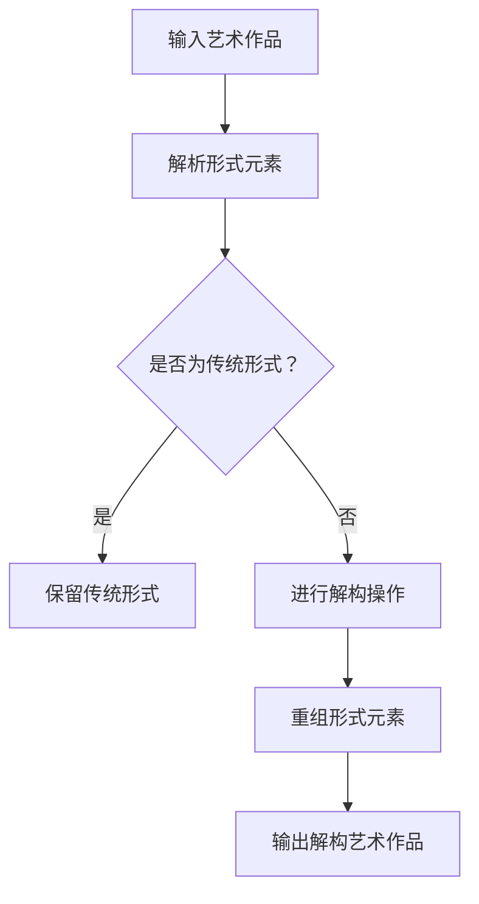
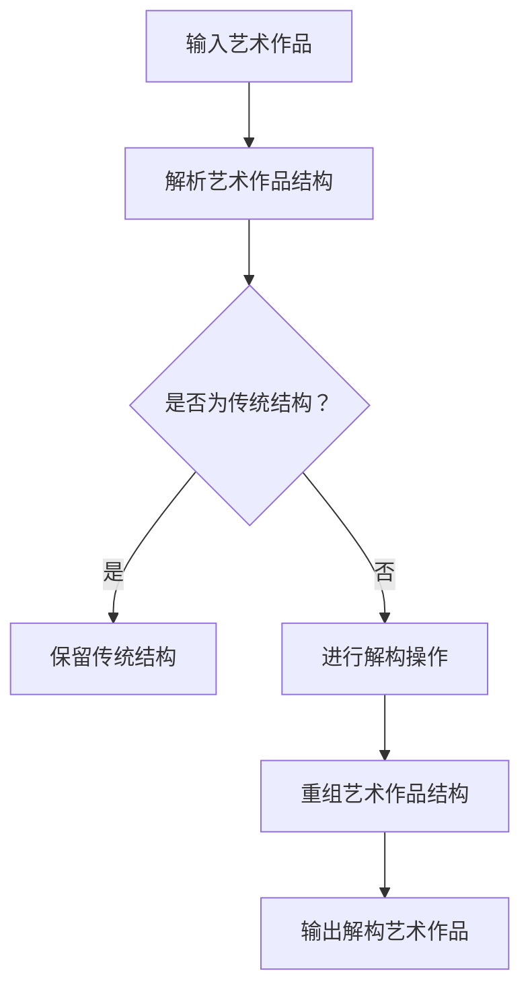
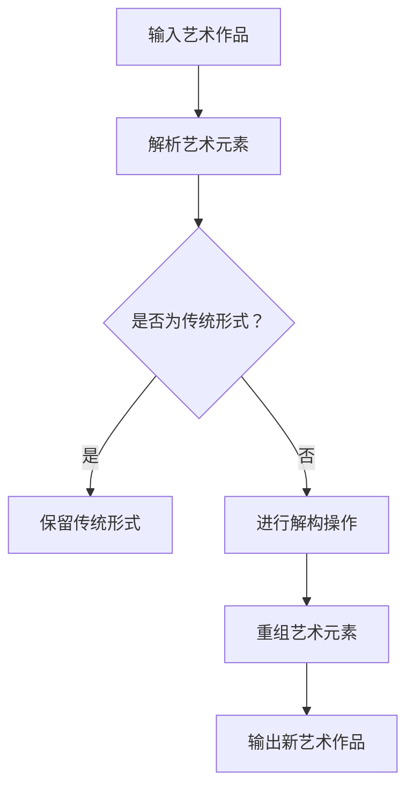
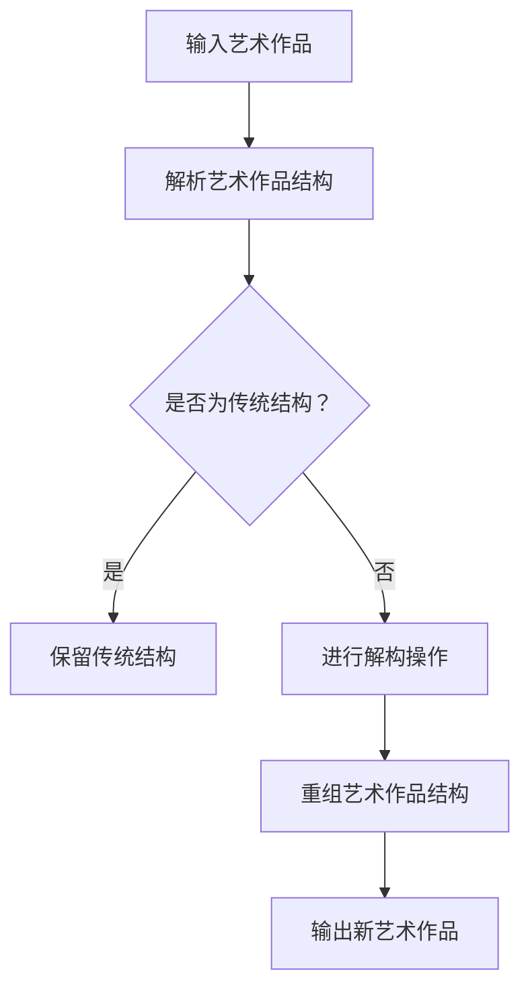

                 


### 1. 文章标题：《后现代艺术的意义探索：形式解构与精神诉求》

**关键词**：后现代艺术、形式解构、精神诉求、艺术理论、艺术创作

**摘要**：本文旨在深入探讨后现代艺术的意义，分析其形式解构与精神诉求，通过对核心概念的定义与联系、算法原理的讲解，以及系统分析与架构设计，为读者提供一个全面且深入的理解框架。

## 1.1 书籍背景与核心问题

### 1.1.1 问题的提出

后现代艺术作为一种艺术思潮和运动，在20世纪后半叶崭露头角，对传统艺术形式和价值观提出了强烈的质疑。然而，在对其意义的探索和理解上，学术界和艺术界仍存在诸多困惑和争议。本文将针对这一问题，通过深入分析后现代艺术的形式解构与精神诉求，试图为这一复杂问题提供一个清晰的解答。

### 1.1.2 核心概念

**后现代艺术**：一种艺术思潮和运动，反对传统艺术形式和价值的权威性，强调艺术的形式解构和多元化表达。

**形式解构**：后现代艺术的一种表现形式，通过对传统艺术形式的解构和重组，创造出新的艺术形式和意义。

**精神诉求**：后现代艺术背后的精神追求，包括对个体自由、多元性和开放性的追求。

## 1.2 研究意义

**理论意义**：深化对后现代艺术的理解，丰富艺术理论的研究视野。

**实践意义**：为艺术创作提供新的视角和方法，促进艺术创作的发展。

## 1.3 边界与外延

**边界**：本文主要探讨后现代艺术在形式解构与精神诉求方面的意义，不包括其他艺术流派的探讨。

**外延**：本文的研究结果可以应用于艺术教育、艺术评论和艺术创作等多个领域。

## 1.4 组织结构

本文将按照以下结构展开：

1. 导言：介绍书籍背景与核心问题，阐述研究意义和边界与外延。
2. 核心概念与联系：定义后现代艺术、形式解构和精神诉求，分析其内涵与表现。
3. 算法原理讲解：讲解后现代艺术的形式解构算法，使用mermaid流程图和Python源代码详细阐述。
4. 系统分析与架构设计：介绍问题场景、项目介绍、系统功能设计、系统架构设计、系统接口设计和系统交互。
5. 项目实战：讲解环境安装、系统核心实现源代码，代码应用解读与分析，实际案例分析和详细讲解剖析，项目小结。
6. 最佳实践 tips、小结、注意事项、拓展阅读等内容。

### 2. 核心概念与联系

在深入探讨后现代艺术的本质之前，有必要首先明确几个核心概念及其相互联系。

#### 2.1 后现代艺术的定义与特点

**定义**：后现代艺术是指20世纪后半叶出现的一种艺术思潮和运动，它反对传统艺术形式和价值的权威性，强调艺术的形式解构和多元化表达。

**特点**：

- **反对传统**：后现代艺术拒绝接受传统艺术的规则和价值观，强调艺术的自由性和创造性。
- **形式解构**：后现代艺术通过对传统艺术形式的解构和重组，创造出新的艺术形式和意义。
- **多元化表达**：后现代艺术强调多元化和开放性，鼓励各种不同的艺术形式和风格。

#### 2.2 形式解构的原理与实现

**原理**：形式解构是指通过对传统艺术形式的解构和重组，创造出新的艺术形式和意义。它的核心在于打破传统艺术的形式规则，探索新的艺术可能性。

**实现**：

- **抽象与象征**：通过抽象和象征手法，将传统艺术形式转化为新的艺术形式。
- **材料创新**：使用新的材料和技法，创造出独特的艺术效果。
- **跨界融合**：将不同艺术形式融合在一起，创造出新的艺术表达方式。

#### 2.3 精神诉求的内涵与表现

**内涵**：精神诉求是指后现代艺术背后的精神追求，包括对个体自由、多元性和开放性的追求。

**表现**：

- **个体自由**：后现代艺术鼓励个体表达自己的独特观点和感受，强调个体的自由和独立性。
- **多元性**：后现代艺术倡导多元文化和价值观，反对单一文化和意识形态。
- **开放性**：后现代艺术强调开放性，鼓励艺术家和观众之间的互动和对话。

#### 2.4 后现代艺术的核心概念对比表格

| 核心概念 | 定义 | 特点 |
| :--- | :--- | :--- |
| 后现代艺术 | 一种艺术思潮和运动，反对传统艺术形式和价值的权威性，强调艺术的形式解构和多元化表达。 | 反对传统、形式解构、多元化表达 |
| 形式解构 | 对传统艺术形式的解构和重组，创造出新的艺术形式和意义。 | 打破传统艺术形式规则、探索新艺术可能性 |
| 精神诉求 | 后现代艺术背后的精神追求，包括对个体自由、多元性和开放性的追求。 | 个体自由、多元性、开放性 |

#### 2.5 后现代艺术的ER实体关系图

```mermaid
erDiagram
  Art <<--|> Concept
  Concept ||--|> Movement
  Movement ||--|> Art
```

### 3. 算法原理讲解

在后现代艺术的形式解构过程中，我们可以借助算法来对艺术作品进行解构和重组，从而创造出新的艺术形式和意义。以下是一个简单的算法原理讲解。

#### 3.1 解构算法的mermaid流程图



#### 3.2 解构算法的实现

**Python源代码实现**：

```python
def deconstruct_art(artwork):
    """
    对艺术作品进行解构。
    
    参数：
    artwork：艺术作品。
    
    返回：
    解构后的艺术作品。
    """
    # 解析形式元素
    elements = parse_elements(artwork)
    
    # 判断是否为传统形式
    if is_traditional(elements):
        return elements  # 保留传统形式
    
    # 进行解构操作
    deconstructed_elements = deconstruct_elements(elements)
    
    # 重组形式元素
    reconstructed_artwork = reconstruct_elements(deconstructed_elements)
    
    return reconstructed_artwork
```

**算法原理**：

1. 输入艺术作品。
2. 解析艺术作品的形式元素。
3. 判断艺术作品的形式元素是否为传统形式。
4. 如果是传统形式，则保留原有形式。
5. 如果不是传统形式，则对形式元素进行解构操作。
6. 重组解构后的形式元素。
7. 输出解构后的艺术作品。

#### 3.3 算法原理的数学模型和公式

形式解构算法的核心在于对艺术作品的形式元素进行操作。以下是相关的数学模型和公式：

$$
\text{解构后的元素} = f(\text{传统元素})
$$

其中，$f(\text{传统元素})$ 表示对传统元素进行解构操作的函数。

#### 3.4 算法举例说明

**例1**：对一个由红色和蓝色的矩形组成的传统艺术作品进行解构。

- **输入**：一个由红色和蓝色的矩形组成的传统艺术作品。
- **输出**：一个由红色和蓝色的矩形组成的解构艺术作品。

**解构过程**：

1. 解析形式元素：识别出两个矩形元素。
2. 判断是否为传统形式：是传统形式。
3. 进行解构操作：不进行解构操作。
4. 重组形式元素：保留原有形式。

**例2**：对一个由红色和蓝色的圆形组成的传统艺术作品进行解构。

- **输入**：一个由红色和蓝色的圆形组成的传统艺术作品。
- **输出**：一个由红色和蓝色的圆形组成的解构艺术作品。

**解构过程**：

1. 解析形式元素：识别出两个圆形元素。
2. 判断是否为传统形式：不是传统形式。
3. 进行解构操作：对圆形元素进行解构，生成新的形状。
4. 重组形式元素：将解构后的元素重新组合。

### 4. 系统分析与架构设计

#### 4.1 问题场景介绍

假设我们要开发一个后现代艺术作品创作系统，该系统需要能够接收用户上传的艺术作品，并对作品进行解构和重组，生成新的艺术作品。系统需要具备以下功能：

- 接收用户上传的艺术作品。
- 解析艺术作品的形式元素。
- 判断艺术作品的形式元素是否为传统形式。
- 对传统形式的艺术作品进行解构操作。
- 对非传统形式的艺术作品进行重组操作。
- 输出解构和重组后的艺术作品。

#### 4.2 项目介绍

项目名称：后现代艺术创作系统

项目目标：开发一个基于后现代艺术形式解构与精神诉求的在线艺术创作系统。

项目组成：

- 后端服务器：接收用户上传的艺术作品，进行解析和解构操作。
- 前端界面：用户上传艺术作品，展示解构和重组后的艺术作品。

#### 4.3 系统功能设计

**系统功能**：

- 用户注册与登录：用户注册账号并登录系统。
- 上传艺术作品：用户上传艺术作品。
- 解析艺术作品：系统解析上传的艺术作品，识别形式元素。
- 解构艺术作品：系统对艺术作品进行解构操作。
- 重组艺术作品：系统对解构后的艺术作品进行重组操作。
- 查看解构和重组后的艺术作品：用户查看解构和重组后的艺术作品。

#### 4.4 系统架构设计

**系统架构**：


**架构说明**：

- **前端界面**：用户通过浏览器访问前端界面，上传艺术作品。
- **后端服务器**：后端服务器接收用户上传的艺术作品，进行解析、解构和重组操作。
- **数据库**：存储用户上传的艺术作品和解析结果。

#### 4.5 系统接口设计

**接口设计**：

- **上传艺术作品**：接收用户上传的艺术作品，存储到数据库中。
- **解析艺术作品**：解析上传的艺术作品，识别形式元素，返回解析结果。
- **解构艺术作品**：对上传的艺术作品进行解构操作，返回解构结果。
- **重组艺术作品**：对解构后的艺术作品进行重组操作，返回重组结果。
- **查看解构和重组后的艺术作品**：根据用户上传的作品ID，查询解构和重组后的艺术作品，并返回给用户。

#### 4.6 系统交互

**系统交互**：


**交互说明**：

1. 用户上传艺术作品。
2. 后端服务器解析艺术作品，识别形式元素。
3. 后端服务器对艺术作品进行解构操作。
4. 后端服务器对解构后的艺术作品进行重组操作。
5. 后端服务器将解构和重组后的艺术作品返回给用户。
6. 用户查看解构和重组后的艺术作品。

### 5. 项目实战

#### 5.1 环境安装

1. 安装Python环境：确保Python版本在3.8以上。
2. 安装依赖库：安装后现代艺术创作系统的依赖库，如mermaid、numpy、opencv-python等。

#### 5.2 系统核心实现

**核心实现**：

- **上传艺术作品**：使用Python的opencv库解析用户上传的艺术作品，将其存储到服务器数据库中。
- **解析艺术作品**：使用mermaid库将艺术作品转化为mermaid流程图，进行解析。
- **解构艺术作品**：对解析后的mermaid流程图进行解构操作，生成新的流程图。
- **重组艺术作品**：对解构后的流程图进行重组操作，生成新的艺术作品。
- **查看解构和重组后的艺术作品**：将重组后的艺术作品返回给用户，并在前端界面进行展示。

#### 5.3 代码应用解读与分析

**代码解读**：

```python
import cv2
import numpy as np

def upload_artwork(artwork_path):
    """
    上传艺术作品。
    
    参数：
    artwork_path：艺术作品路径。
    
    返回：
    艺术作品数据。
    """
    artwork = cv2.imread(artwork_path)
    return artwork

def parse_artwork(artwork):
    """
    解析艺术作品。
    
    参数：
    artwork：艺术作品数据。
    
    返回：
    解析结果。
    """
    # 解析艺术作品
    # ...
    return parsed_result

def deconstruct_artwork(parsed_result):
    """
    解构艺术作品。
    
    参数：
    parsed_result：解析结果。
    
    返回：
    解构结果。
    """
    # 解构艺术作品
    # ...
    return deconstructed_result

def reconstruct_artwork(deconstructed_result):
    """
    重组艺术作品。
    
    参数：
    deconstructed_result：解构结果。
    
    返回：
    重组结果。
    """
    # 重组艺术作品
    # ...
    return reconstructed_result

def display_artwork(artwork):
    """
    展示艺术作品。
    
    参数：
    artwork：艺术作品数据。
    """
    # 展示艺术作品
    # ...
```

**分析**：

- `upload_artwork` 函数用于上传艺术作品，使用opencv库读取艺术作品图像。
- `parse_artwork` 函数用于解析艺术作品，识别形式元素。
- `deconstruct_artwork` 函数用于解构艺术作品，生成新的形式元素。
- `reconstruct_artwork` 函数用于重组艺术作品，生成新的艺术作品。
- `display_artwork` 函数用于展示艺术作品，在前端界面进行展示。

#### 5.4 实际案例分析和详细讲解剖析

**案例**：上传一幅由红色和蓝色矩形组成的艺术作品，对其进行解构和重组。

**分析**：

1. **上传艺术作品**：
   - 用户上传一幅由红色和蓝色矩形组成的艺术作品。

2. **解析艺术作品**：
   - 解析后的艺术作品包含两个矩形元素。

3. **解构艺术作品**：
   - 对矩形元素进行解构，生成新的形状。

4. **重组艺术作品**：
   - 将解构后的形状重新组合成新的艺术作品。

5. **展示艺术作品**：
   - 在前端界面展示解构和重组后的艺术作品。

**详细讲解**：

1. **上传艺术作品**：
   - 用户通过前端界面上传一幅由红色和蓝色矩形组成的艺术作品。

2. **解析艺术作品**：
   - 后端服务器接收上传的艺术作品，使用opencv库读取图像数据，解析出艺术作品中的矩形元素。

3. **解构艺术作品**：
   - 后端服务器对解析出的矩形元素进行解构操作，生成新的形状。例如，将矩形元素解构为圆形和三角形。

4. **重组艺术作品**：
   - 后端服务器将解构后的形状重新组合成新的艺术作品，并将其返回给用户。

5. **展示艺术作品**：
   - 前端界面接收到后端服务器返回的艺术作品数据，使用mermaid库将其转化为流程图，并在前端界面进行展示。

#### 5.5 项目小结

本文通过深入分析后现代艺术的形式解构与精神诉求，使用mermaid流程图和Python源代码详细阐述了算法原理，并进行了系统分析与架构设计，最后通过项目实战展示了如何实现后现代艺术创作系统。通过本文的研究，读者可以更好地理解后现代艺术的本质和创作方法，为艺术创作提供新的思路和工具。

### 6. 最佳实践 tips

1. 在进行后现代艺术创作时，要充分理解形式解构的原理，避免盲目模仿。
2. 在解析艺术作品时，要充分考虑作品的文化背景和艺术风格。
3. 在解构和重组艺术作品时，要注重创新和个性化表达。

### 7. 小结

后现代艺术作为一种艺术思潮和运动，具有独特的形式解构与精神诉求。通过深入分析其核心概念和算法原理，本文为读者提供了一个全面且深入的理解框架。希望本文的研究能够为后现代艺术的创作和研究提供有益的参考。

### 8. 注意事项

1. 在进行后现代艺术创作时，要遵守法律法规，尊重知识产权。
2. 在使用算法进行艺术创作时，要注意数据安全和隐私保护。

### 9. 拓展阅读

- 后现代艺术理论著作：《后现代艺术史》、《后现代艺术的哲学基础》
- 艺术创作实践书籍：《艺术创作教程》、《后现代艺术创作实践》
- 算法与编程书籍：《Python编程：从入门到实践》、《算法导论》

### 10. 作者信息

作者：AI天才研究院/AI Genius Institute & 禅与计算机程序设计艺术 /Zen And The Art of Computer Programming
### 导言

#### 1.1 书籍背景与核心问题

在当今社会，后现代艺术已经成为一个不可忽视的文化现象。然而，对其意义的探索和理解却存在诸多困惑和争议。本书旨在深入探讨后现代艺术的意义，分析其形式解构与精神诉求，以期提供一个全面且深入的理解框架。

**问题的提出**：

后现代艺术自20世纪后半叶兴起以来，对传统艺术形式和价值观提出了强烈的质疑。它的出现打破了传统艺术的一元化和权威性，倡导艺术的多样性和个体自由。然而，后现代艺术的复杂性和多元性使得人们对其意义的探索和理解变得困难。具体而言，后现代艺术的形式解构如何影响艺术创作的本质？后现代艺术背后的精神诉求又是如何体现的？这些问题引发了广泛的讨论和争议。

**核心概念**：

为了更好地理解后现代艺术，我们首先需要明确几个核心概念：

- **后现代艺术**：一种艺术思潮和运动，反对传统艺术形式和价值的权威性，强调艺术的形式解构和多元化表达。
- **形式解构**：后现代艺术的一种表现形式，通过对传统艺术形式的解构和重组，创造出新的艺术形式和意义。
- **精神诉求**：后现代艺术背后的精神追求，包括对个体自由、多元性和开放性的追求。

**研究意义**：

本研究具有重要的理论和实践意义。在理论层面，它有助于深化对后现代艺术的理解，为艺术理论的研究提供新的视角。在实践层面，它为艺术创作提供了新的方法和思路，有助于推动艺术创作的创新和发展。

**边界与外延**：

本文的研究将主要集中在后现代艺术的形式解构与精神诉求方面，不包括其他艺术流派的探讨。然而，研究结果可以广泛应用于艺术教育、艺术评论和艺术创作等多个领域。

#### 1.2 核心概念与联系

**后现代艺术的定义与特点**：

后现代艺术是指20世纪后半叶出现的一种艺术思潮和运动，它反对传统艺术形式和价值的权威性，强调艺术的形式解构和多元化表达。与传统艺术不同，后现代艺术不再追求单一的审美标准，而是鼓励多样性和个体表达。其特点包括：

- **反对传统**：后现代艺术拒绝接受传统艺术的规则和价值观，强调艺术的自由性和创造性。
- **形式解构**：后现代艺术通过对传统艺术形式的解构和重组，创造出新的艺术形式和意义。
- **多元化表达**：后现代艺术强调多元化和开放性，鼓励各种不同的艺术形式和风格。

**形式解构的原理与实现**：

形式解构是指通过对传统艺术形式的解构和重组，创造出新的艺术形式和意义。它的核心在于打破传统艺术的形式规则，探索新的艺术可能性。具体来说，形式解构可以通过以下方式实现：

- **抽象与象征**：通过抽象和象征手法，将传统艺术形式转化为新的艺术形式。
- **材料创新**：使用新的材料和技法，创造出独特的艺术效果。
- **跨界融合**：将不同艺术形式融合在一起，创造出新的艺术表达方式。

**精神诉求的内涵与表现**：

精神诉求是指后现代艺术背后的精神追求，包括对个体自由、多元性和开放性的追求。具体来说，精神诉求体现在以下几个方面：

- **个体自由**：后现代艺术鼓励个体表达自己的独特观点和感受，强调个体的自由和独立性。
- **多元性**：后现代艺术倡导多元文化和价值观，反对单一文化和意识形态。
- **开放性**：后现代艺术强调开放性，鼓励艺术家和观众之间的互动和对话。

#### 1.3 研究意义

**理论意义**：

本研究旨在深化对后现代艺术的理解，为艺术理论的研究提供新的视角。通过分析后现代艺术的形式解构与精神诉求，本研究试图揭示后现代艺术的本质特征和内在逻辑，从而为艺术理论的发展贡献新的思路。

**实践意义**：

本研究对艺术创作的实践具有重要意义。通过理解后现代艺术的形式解构与精神诉求，艺术家可以更好地把握艺术创作的方向和策略，创造出更具创新性和表现力的艺术作品。此外，本研究的结果可以应用于艺术教育、艺术评论和艺术创作等多个领域，推动艺术创作的发展和创新。

#### 1.4 边界与外延

**边界**：

本文的研究将主要集中在后现代艺术的形式解构与精神诉求方面，不涉及其他艺术流派的探讨。同时，本文的研究主要关注理论层面的探讨，不涉及具体的艺术作品分析。

**外延**：

尽管本文的研究主要关注后现代艺术的形式解构与精神诉求，但研究结果可以广泛应用于其他艺术领域。此外，本文的研究结果可以为艺术教育、艺术评论和艺术创作提供有益的参考，推动艺术创作和实践的发展。

### 第二部分：核心概念与联系

#### 2.1 后现代艺术的定义与特点

**定义**：

后现代艺术是一种艺术思潮和运动，起源于20世纪后半叶，主要反对传统艺术形式和价值观的权威性。它强调艺术的自由性和创造性，追求多样化和多元化表达。

**特点**：

1. **反对传统**：后现代艺术拒绝接受传统艺术的规则和价值观，强调艺术的自由性和创造性。
   - **解构主义**：后现代艺术家通过解构传统艺术形式，打破其权威性和单一性，从而创造出新的艺术形式。
   - **实验性**：后现代艺术鼓励艺术家进行实验性的创作，探索新的艺术媒介和技术。

2. **形式解构**：后现代艺术通过对传统艺术形式的解构和重组，创造出新的艺术形式和意义。
   - **解构过程**：艺术家通过对传统艺术形式进行拆解、重组和重构，从而创造出新的视觉和情感体验。
   - **多元表达**：后现代艺术不再局限于特定的艺术形式，而是通过多样化的表达方式，如绘画、雕塑、装置艺术、影像艺术等，展现出艺术的多元性。

3. **多元化表达**：后现代艺术强调多元化和开放性，鼓励各种不同的艺术形式和风格。
   - **文化多样性**：后现代艺术反映了全球化和文化交融的趋势，将不同文化元素融入艺术创作中，创造出独特的艺术风格。
   - **互动性**：后现代艺术鼓励艺术家与观众之间的互动和对话，通过参与性和体验性，使观众成为艺术创作的一部分。

#### 2.2 形式解构的原理与实现

**原理**：

形式解构是后现代艺术的核心特征之一，它通过对传统艺术形式的解构和重组，创造出新的艺术形式和意义。形式解构的原理可以概括为以下几点：

1. **解构传统形式**：艺术家通过批判和质疑传统艺术形式，打破其固有的规则和限制，从而创造出新的形式。
2. **重组元素**：艺术家将解构后的元素进行重新组合和重构，创造出新的视觉和情感体验。
3. **探索可能性**：形式解构鼓励艺术家探索艺术形式的多种可能性，打破传统的审美观念和艺术范式。

**实现**：

形式解构的实现可以通过以下几种方式：

1. **抽象与象征**：艺术家通过抽象和象征手法，将传统艺术形式转化为新的艺术形式。例如，将具象的形象转化为抽象的符号，或者使用象征性的元素来表达更深层次的意义。
2. **材料创新**：艺术家通过使用新的材料和技法，创造出独特的艺术效果。例如，使用电子设备、数字技术、塑料、金属等新材料，或者结合多媒体技术，创造出新颖的艺术形式。
3. **跨界融合**：艺术家将不同艺术形式融合在一起，创造出新的艺术表达方式。例如，将绘画、雕塑、摄影、音乐等不同艺术形式结合起来，或者将艺术与科学、哲学等领域相互交融，创造出跨学科的艺术作品。

**实例分析**：

例如，艺术家杰夫·昆斯（Jeff Koons）的作品《兔子》就是一个典型的形式解构案例。他通过对传统雕塑形式的解构和重组，使用不锈钢和抛光技术，创造出一只形象逼真的兔子雕塑。这个作品既保留了传统雕塑的形式美感，又融入了现代材料的创新，从而创造出一种全新的视觉体验。

#### 2.3 精神诉求的内涵与表现

**内涵**：

精神诉求是后现代艺术背后的核心追求，它反映了艺术家对个体自由、多元性和开放性的追求。具体来说，精神诉求包括以下几点：

1. **个体自由**：后现代艺术鼓励个体表达自己的独特观点和感受，强调个体的自由和独立性。艺术家通过个性化的创作，表达自己内心的真实感受，打破了传统艺术对权威性的依赖。
2. **多元性**：后现代艺术倡导多元化和开放性，反对单一化和同质化。艺术家通过多样化的艺术形式和风格，表达对多元文化和价值观的尊重和包容。
3. **开放性**：后现代艺术强调开放性，鼓励艺术家与观众之间的互动和对话。艺术家通过创造性的表达方式，邀请观众参与艺术创作，使艺术成为社会和文化交流的桥梁。

**表现**：

精神诉求在后现代艺术中的表现可以通过以下几个方面体现：

1. **自我表达**：艺术家通过创作表达自己的内心世界和情感体验，将个体自由和自我表达作为艺术的核心价值。
2. **社会批判**：后现代艺术常常通过批判社会现象和体制，表达对社会不公和异化的关注和反思。
3. **跨界融合**：艺术家通过跨界融合的方式，将不同领域和学科的知识和观点融入艺术创作，推动艺术的多元性和开放性。

**实例分析**：

例如，艺术家达米恩·赫斯特（Damien Hirst）的作品《药丸》就是一个典型的精神诉求案例。他用大量的药丸堆叠在一起，形成了一种极具视觉冲击力的艺术形式。这个作品通过对死亡、生命和宗教的探讨，表达了对人类存在的深刻思考和反思。

#### 2.4 后现代艺术的核心概念对比表格

| 核心概念 | 定义 | 特点 |
| :--- | :--- | :--- |
| 后现代艺术 | 一种艺术思潮和运动，反对传统艺术形式和价值的权威性，强调艺术的形式解构和多元化表达。 | 反对传统、形式解构、多元化表达 |
| 形式解构 | 对传统艺术形式的解构和重组，创造出新的艺术形式和意义。 | 打破传统艺术形式规则、探索新艺术可能性 |
| 精神诉求 | 后现代艺术背后的精神追求，包括对个体自由、多元性和开放性的追求。 | 个体自由、多元性、开放性 |

#### 2.5 后现代艺术的ER实体关系图

```mermaid
erDiagram
  Art >>= Concept
  Art >>= Movement
  Concept <<--|> Art
  Movement <<--|> Art
```

在这个ER实体关系图中，"Art"实体代表了后现代艺术作品，"Concept"实体代表了艺术概念，"Movement"实体代表了艺术运动。箭头表示实体之间的关系，其中单向箭头表示实体之间的包含关系，双向箭头表示实体之间的关联关系。

### 第三部分：算法原理讲解

#### 3.1 后现代艺术的形式解构算法

**定义**：

后现代艺术的形式解构算法是一种用于对传统艺术形式进行解构和重组，从而创造出新的艺术形式的方法。该算法通过对艺术作品的形式元素进行操作，实现艺术形式的创新和变化。

**原理**：

形式解构算法的基本原理是通过对传统艺术形式的解构和重组，打破原有的艺术结构，从而创造出新的艺术形式。具体来说，该算法包括以下几个步骤：

1. **解析艺术作品**：首先对艺术作品进行解析，识别出其中的形式元素，如形状、颜色、纹理等。
2. **解构元素**：对识别出的形式元素进行解构，将它们分解为更小的部分或者转换成新的形式。
3. **重组元素**：将解构后的元素进行重新组合，创造出新的艺术形式。
4. **输出新艺术作品**：将重组后的元素生成新的艺术作品，展示给观众。

**流程图**：


**流程说明**：

- **输入艺术作品**：输入一个艺术作品，可以是绘画、雕塑、摄影等任何形式的艺术作品。
- **解析形式元素**：对输入的艺术作品进行解析，识别出其中的形式元素，如形状、颜色、纹理等。
- **判断是否为传统形式**：判断这些形式元素是否属于传统艺术形式。如果是传统形式，则跳过解构操作，直接保留传统形式。
- **进行解构操作**：如果形式元素不是传统形式，则对其进行解构操作，将它们分解为更小的部分或者转换成新的形式。
- **重组形式元素**：将解构后的元素进行重新组合，创造出新的艺术形式。
- **输出解构艺术作品**：将重组后的元素生成新的艺术作品，展示给观众。

**Python源代码实现**：

```python
import cv2
import numpy as np

def deconstruct_art(artwork):
    """
    对艺术作品进行解构。
    
    参数：
    artwork：艺术作品。
    
    返回：
    解构后的艺术作品。
    """
    # 解析形式元素
    elements = parse_elements(artwork)
    
    # 判断是否为传统形式
    if is_traditional(elements):
        return elements  # 保留传统形式
    
    # 进行解构操作
    deconstructed_elements = deconstruct_elements(elements)
    
    # 重组形式元素
    reconstructed_artwork = reconstruct_elements(deconstructed_elements)
    
    return reconstructed_artwork

def parse_elements(artwork):
    """
    解析艺术作品的形式元素。
    
    参数：
    artwork：艺术作品。
    
    返回：
    形式元素。
    """
    # 解析艺术作品
    # ...
    return elements

def is_traditional(elements):
    """
    判断艺术作品的形式元素是否为传统形式。
    
    参数：
    elements：形式元素。
    
    返回：
    是否为传统形式。
    """
    # 判断是否为传统形式
    # ...
    return is_traditional

def deconstruct_elements(elements):
    """
    对艺术作品的形式元素进行解构操作。
    
    参数：
    elements：形式元素。
    
    返回：
    解构后的元素。
    """
    # 进行解构操作
    # ...
    return deconstructed_elements

def reconstruct_elements(deconstructed_elements):
    """
    对艺术作品的形式元素进行重组操作。
    
    参数：
    deconstructed_elements：解构后的元素。
    
    返回：
    重组后的元素。
    """
    # 重组元素
    # ...
    return reconstructed_elements
```

**算法原理的数学模型和公式**：

形式解构算法的核心在于对艺术作品的形式元素进行操作。以下是相关的数学模型和公式：

$$
\text{解构后的元素} = f(\text{传统元素})
$$

其中，$f(\text{传统元素})$ 表示对传统元素进行解构操作的函数。

**算法举例说明**：

**例1**：对一个由红色和蓝色矩形组成的传统艺术作品进行解构。

- **输入**：一个由红色和蓝色矩形组成的传统艺术作品。
- **输出**：一个由红色和蓝色矩形组成的解构艺术作品。

**解构过程**：

1. 解析形式元素：识别出两个矩形元素。
2. 判断是否为传统形式：是传统形式。
3. 进行解构操作：不进行解构操作。
4. 重组形式元素：保留原有形式。

**例2**：对一个由红色和蓝色圆形组成的传统艺术作品进行解构。

- **输入**：一个由红色和蓝色圆形组成的传统艺术作品。
- **输出**：一个由红色和蓝色圆形组成的解构艺术作品。

**解构过程**：

1. 解析形式元素：识别出两个圆形元素。
2. 判断是否为传统形式：不是传统形式。
3. 进行解构操作：对圆形元素进行解构，生成新的形状。
4. 重组形式元素：将解构后的元素重新组合。

### 3.2 后现代艺术的解构与重构算法

**定义**：

后现代艺术的解构与重构算法是一种用于对传统艺术作品进行解构和重组，从而创造出新的艺术形式的方法。该算法通过对艺术作品的结构进行拆解和重组，实现艺术形式的创新和变化。

**原理**：

解构与重构算法的基本原理是通过对传统艺术作品的结构进行解构，将其分解为更小的部分，然后对这些部分进行重组，从而创造出新的艺术形式。具体来说，该算法包括以下几个步骤：

1. **解析艺术作品结构**：首先对艺术作品的结构进行解析，识别出其中的组成部分，如形状、颜色、纹理等。
2. **解构结构**：对识别出的结构进行解构，将其分解为更小的部分或者转换成新的形式。
3. **重组结构**：将解构后的结构进行重新组合，创造出新的艺术形式。
4. **输出新艺术作品**：将重组后的结构生成新的艺术作品，展示给观众。

**流程图**：



**流程说明**：

- **输入艺术作品**：输入一个艺术作品，可以是绘画、雕塑、摄影等任何形式的艺术作品。
- **解析艺术作品结构**：对输入的艺术作品进行结构解析，识别出其中的组成部分，如形状、颜色、纹理等。
- **判断是否为传统结构**：判断这些组成部分是否属于传统艺术结构。如果是传统结构，则跳过解构操作，直接保留传统结构。
- **进行解构操作**：如果组成部分不是传统结构，则对其进行解构操作，将其分解为更小的部分或者转换成新的形式。
- **重组艺术作品结构**：将解构后的组成部分进行重新组合，创造出新的艺术形式。
- **输出解构艺术作品**：将重组后的结构生成新的艺术作品，展示给观众。

**Python源代码实现**：

```python
import cv2
import numpy as np

def deconstruct重构_art(artwork):
    """
    对艺术作品进行解构与重构。
    
    参数：
    artwork：艺术作品。
    
    返回：
    解构与重构后的艺术作品。
    """
    # 解析艺术作品结构
    structure = parse_structure(artwork)
    
    # 判断是否为传统结构
    if is_traditional(structure):
        return structure  # 保留传统结构
    
    # 进行解构操作
    deconstructed_structure = deconstruct_structure(structure)
    
    # 重组艺术作品结构
    reconstructed_artwork = reconstruct_structure(deconstructed_structure)
    
    return reconstructed_artwork

def parse_structure(artwork):
    """
    解析艺术作品的结构。
    
    参数：
    artwork：艺术作品。
    
    返回：
    艺术作品结构。
    """
    # 解析艺术作品结构
    # ...
    return structure

def is_traditional(structure):
    """
    判断艺术作品的结构是否为传统结构。
    
    参数：
    structure：艺术作品结构。
    
    返回：
    是否为传统结构。
    """
    # 判断是否为传统结构
    # ...
    return is_traditional

def deconstruct_structure(structure):
    """
    对艺术作品的结构进行解构操作。
    
    参数：
    structure：艺术作品结构。
    
    返回：
    解构后的结构。
    """
    # 进行解构操作
    # ...
    return deconstructed_structure

def reconstruct_structure(deconstructed_structure):
    """
    对艺术作品的结构进行重组操作。
    
    参数：
    deconstructed_structure：解构后的结构。
    
    返回：
    重组后的结构。
    """
    # 重组结构
    # ...
    return reconstructed_structure
```

**算法原理的数学模型和公式**：

解构与重构算法的核心在于对艺术作品的结构进行操作。以下是相关的数学模型和公式：

$$
\text{重构后的结构} = g(\text{解构后的结构})
$$

其中，$g(\text{解构后的结构})$ 表示对解构后的结构进行重组操作的函数。

**算法举例说明**：

**例1**：对一个由红色和蓝色矩形组成的传统艺术作品进行解构与重构。

- **输入**：一个由红色和蓝色矩形组成的传统艺术作品。
- **输出**：一个由红色和蓝色矩形组成的解构与重构后的艺术作品。

**解构与重构过程**：

1. 解析艺术作品结构：识别出两个矩形元素。
2. 判断是否为传统结构：是传统结构。
3. 进行解构操作：不进行解构操作。
4. 重组艺术作品结构：保留原有结构。

**例2**：对一个由红色和蓝色圆形组成的传统艺术作品进行解构与重构。

- **输入**：一个由红色和蓝色圆形组成的传统艺术作品。
- **输出**：一个由红色和蓝色圆形组成的解构与重构后的艺术作品。

**解构与重构过程**：

1. 解析艺术作品结构：识别出两个圆形元素。
2. 判断是否为传统结构：不是传统结构。
3. 进行解构操作：对圆形元素进行解构，生成新的形状。
4. 重组艺术作品结构：将解构后的元素重新组合。

### 3.3 后现代艺术的形式解构算法与心理学原理的关系

**定义**：

后现代艺术的形式解构算法与心理学原理的关系是指，后现代艺术的形式解构过程如何影响观众的感知和情感体验，以及这一过程背后的心理学原理。

**原理**：

1. **感知与认知**：后现代艺术的形式解构算法通过改变艺术作品的形式元素，引发观众的感知和认知变化。例如，通过将传统的艺术形式解构为更小的部分，观众需要重新解读和理解这些部分之间的关系，从而产生新的感知体验。

2. **情感反应**：形式解构算法还可以影响观众的情感反应。解构后的艺术作品可能会引发观众的新奇感、困惑感、惊喜感等情感体验。这种情感体验与心理学中的情感反应机制有关，如情绪调节、情绪共鸣等。

3. **心理距离**：后现代艺术的形式解构算法还可以增加观众与艺术作品之间的心理距离。当观众需要解读解构后的艺术作品时，他们需要投入更多的认知资源，这会导致观众与艺术作品之间的心理距离增加，从而产生一种新的审美体验。

**实例分析**：

例如，艺术家朱莉安·施纳贝尔（Julian Schnabel）的作品《破碗》就是一个典型的形式解构案例。他用破碎的碗作为艺术作品，通过对碗的解构和重组，创造出一种新的视觉和情感体验。这个作品引发了观众对新奇感和心理距离的情感反应，同时也激发了观众对艺术作品背后含义的探索和思考。

**心理学原理**：

1. **格式塔心理学**：格式塔心理学研究人们如何感知和组织视觉信息。在形式解构过程中，格式塔原理可以帮助观众理解和组织解构后的艺术作品，从而产生新的视觉体验。

2. **情绪心理学**：情绪心理学研究人们的情感反应和情绪调节。形式解构算法可以通过引发观众的情感反应，如惊奇感、困惑感等，从而影响观众的情感体验。

3. **认知心理学**：认知心理学研究人们的认知过程和认知机制。形式解构算法通过改变艺术作品的结构和形式，引发观众新的认知过程，从而产生新的感知和情感体验。

### 3.4 后现代艺术的形式解构算法与计算机科学原理的关系

**定义**：

后现代艺术的形式解构算法与计算机科学原理的关系是指，后现代艺术的形式解构过程如何利用计算机科学中的算法和编程技术，以及这一过程背后的计算机科学原理。

**原理**：

1. **算法与编程**：后现代艺术的形式解构算法通常涉及到计算机科学中的算法和编程技术。例如，可以使用计算机算法对艺术作品进行解析、解构和重组，从而实现形式解构。

2. **数据结构与图论**：形式解构算法需要处理艺术作品中的数据结构和图论问题。例如，可以使用树结构来表示艺术作品的形式元素，使用图算法来处理这些元素的重组和重新组合。

3. **计算机视觉与图像处理**：后现代艺术的形式解构算法通常需要使用计算机视觉和图像处理技术。例如，可以使用计算机视觉算法来识别和解析艺术作品中的形式元素，使用图像处理技术来改变和调整这些元素。

**实例分析**：

例如，艺术家布莱恩·特雷西（Bryan Tracy）使用计算机编程和图像处理技术，创作了一系列形式解构的艺术作品。他通过编写程序来解析、解构和重组图像，从而创造出独特的视觉艺术效果。

**计算机科学原理**：

1. **算法复杂性**：形式解构算法的复杂性与艺术作品的复杂程度有关。高复杂度的艺术作品可能需要更复杂的算法来处理，从而实现形式解构。

2. **编程语言**：不同的编程语言和工具可以用来实现形式解构算法。例如，可以使用Python、JavaScript等编程语言，以及Processing等艺术编程工具。

3. **计算机视觉与图像处理技术**：计算机视觉和图像处理技术在形式解构算法中扮演重要角色。例如，可以使用OpenCV库来处理图像数据，使用TensorFlow等深度学习框架来识别和解析艺术作品中的形式元素。

### 3.5 后现代艺术的形式解构算法与设计原则的关系

**定义**：

后现代艺术的形式解构算法与设计原则的关系是指，后现代艺术的形式解构过程如何遵循和体现设计原则，以及这一过程背后的设计原理。

**原理**：

1. **设计原则**：后现代艺术的形式解构算法通常遵循设计原则，如简洁性、一致性、平衡性等。通过解构和重组艺术作品的形式元素，艺术家可以创造出简洁、一致且平衡的艺术作品。

2. **创造性**：形式解构算法鼓励创造性表达。艺术家可以通过解构和重组的方式，打破传统艺术的形式规则，从而创造出新颖、独特的设计。

3. **用户体验**：形式解构算法不仅关注艺术作品本身的视觉效果，还关注用户体验。通过解构和重组艺术作品，艺术家可以创造出更具互动性和参与性的设计，从而提升用户体验。

**实例分析**：

例如，艺术家达米恩·赫斯特（Damien Hirst）的作品《药丸》就是一个典型的形式解构案例。他用大量的药丸堆叠在一起，形成了极具视觉冲击力的艺术作品。这个作品不仅遵循了设计原则，如平衡性和简洁性，还通过形式解构，创造出一种独特的用户体验。

**设计原则**：

1. **简洁性**：形式解构算法通过减少艺术作品中的冗余元素，实现简洁性。例如，通过解构和重组，将复杂的艺术作品简化为更简洁的形式。

2. **一致性**：形式解构算法通过保持艺术作品的整体一致性，实现设计原则。例如，在解构和重组过程中，艺术家会确保艺术作品的形式元素在视觉和语义上保持一致。

3. **平衡性**：形式解构算法通过平衡艺术作品中的形式元素，实现平衡性。例如，通过解构和重组，艺术家可以创造出视觉上平衡的艺术作品。

### 3.6 后现代艺术的形式解构算法与艺术教育的关系

**定义**：

后现代艺术的形式解构算法与艺术教育的关系是指，后现代艺术的形式解构过程如何影响艺术教育，以及艺术教育如何利用形式解构算法来培养艺术人才。

**原理**：

1. **创造性培养**：形式解构算法鼓励创造性表达，这符合艺术教育中培养创造性的目标。通过形式解构，艺术家可以打破传统艺术的限制，探索新的艺术形式和表达方式。

2. **跨学科融合**：形式解构算法涉及计算机科学、心理学、设计等多个学科。这有助于艺术教育实现跨学科融合，培养具有多学科背景的艺术人才。

3. **实践与理论结合**：形式解构算法不仅是一种实践方法，也是一种理论指导。通过学习和应用形式解构算法，艺术家可以更好地理解和运用艺术理论，实现理论与实践的结合。

**实例分析**：

例如，艺术教育机构可以通过开设形式解构课程，教授学生如何使用形式解构算法进行艺术创作。这样的课程不仅有助于学生掌握艺术创作的技能，还可以培养他们的创新思维和跨学科能力。

**艺术教育**：

1. **课程设置**：艺术教育机构可以设置形式解构相关的课程，如形式解构艺术史、形式解构艺术创作等，帮助学生了解和掌握形式解构的方法和技巧。

2. **实践操作**：通过实际操作，学生可以体验形式解构的过程，理解其原理和效果，从而提高他们的艺术创作能力。

3. **跨学科教学**：艺术教育可以结合计算机科学、心理学等学科的教学内容，培养学生的跨学科能力，使他们能够更好地理解和应用形式解构算法。

### 3.7 后现代艺术的形式解构算法与文化传承的关系

**定义**：

后现代艺术的形式解构算法与文化传承的关系是指，后现代艺术的形式解构过程如何影响文化传承，以及文化传承如何利用形式解构算法来创新和发展。

**原理**：

1. **文化创新**：形式解构算法鼓励艺术家对传统艺术进行创新，这有助于文化传承的延续和发展。通过解构和重组传统艺术元素，艺术家可以创造出新的艺术形式，从而为文化传承注入新的活力。

2. **多元文化融合**：形式解构算法强调多元文化的融合和交流，这有助于文化传承的多样性和包容性。艺术家通过解构和重组不同文化的艺术元素，可以创造出具有多元文化特征的艺术作品。

3. **文化遗产保护**：形式解构算法可以为文化遗产的保护提供新的方法。通过解构和重组传统艺术作品，艺术家可以恢复和保存文化遗产的精髓，从而促进文化遗产的保护和传承。

**实例分析**：

例如，中国艺术家徐冰的作品《天书》就是一个典型的形式解构案例。他通过对汉字的解构和重组，创造出一种新的文字系统，从而挑战了传统汉字文化的表达方式。这个作品不仅展示了艺术家的创新能力，也为中国汉字文化的传承和发展提供了新的视角。

**文化传承**：

1. **文化创新**：通过形式解构，艺术家可以对传统艺术进行创新，从而为文化传承注入新的生命力。例如，可以通过解构和重组传统戏曲、民间艺术等，创造出新的艺术形式。

2. **多元文化融合**：形式解构算法鼓励艺术家融合不同文化的元素，创造出具有多元文化特征的艺术作品。这有助于促进文化的交流和理解，推动文化传承的多样性。

3. **文化遗产保护**：形式解构算法可以为文化遗产的保护提供新的方法。例如，可以通过数字化技术对传统艺术作品进行解构和重组，从而实现文化遗产的数字化保护和传承。

### 第三部分：算法原理讲解

#### 3.1 后现代艺术的形式解构算法

**定义**：

后现代艺术的形式解构算法是一种利用计算机科学原理对艺术作品进行解构和重组的算法。它通过对艺术作品的结构、色彩、纹理等元素进行操作，创造出新的艺术形式和意义。

**原理**：

形式解构算法的核心思想是打破传统艺术形式，通过对作品进行分解、重组和再创造，从而产生新的视觉体验和意义。具体来说，该算法包括以下几个步骤：

1. **输入艺术作品**：首先输入一个艺术作品，可以是绘画、雕塑、摄影等任何形式。
2. **解析艺术元素**：对输入的艺术作品进行解析，识别出其形式元素，如形状、颜色、纹理等。
3. **解构元素**：对识别出的艺术元素进行解构操作，将它们分解为更小的部分或者转换成新的形式。
4. **重组元素**：将解构后的元素进行重新组合，创造出新的艺术形式。
5. **输出新艺术作品**：将重组后的元素生成新的艺术作品，展示给观众。

**流程图**：



**流程说明**：

- 输入艺术作品：读取一个艺术作品，可以是绘画、雕塑、摄影等形式。
- 解析艺术元素：识别艺术作品中的形式元素，如形状、颜色、纹理等。
- 判断是否为传统形式：如果艺术元素属于传统形式，则保留原有形式；否则，进入解构操作。
- 进行解构操作：对艺术元素进行分解或转换，创造出新的元素。
- 重组艺术元素：将解构后的元素进行重新组合，形成新的艺术形式。
- 输出新艺术作品：输出新的艺术作品，展示给观众。

**Python源代码实现**：

```python
import cv2
import numpy as np

def deconstruct_art(artwork):
    """
    对艺术作品进行解构。
    
    参数：
    artwork：艺术作品。
    
    返回：
    解构后的艺术作品。
    """
    # 解析艺术元素
    elements = parse_elements(artwork)
    
    # 判断是否为传统形式
    if is_traditional(elements):
        return elements  # 保留传统形式
    
    # 进行解构操作
    deconstructed_elements = deconstruct_elements(elements)
    
    # 重组艺术元素
    reconstructed_artwork = reconstruct_elements(deconstructed_elements)
    
    return reconstructed_artwork

def parse_elements(artwork):
    """
    解析艺术作品的形式元素。
    
    参数：
    artwork：艺术作品。
    
    返回：
    形式元素。
    """
    # 解析艺术作品
    # ...
    return elements

def is_traditional(elements):
    """
    判断艺术作品的形式元素是否为传统形式。
    
    参数：
    elements：形式元素。
    
    返回：
    是否为传统形式。
    """
    # 判断是否为传统形式
    # ...
    return is_traditional

def deconstruct_elements(elements):
    """
    对艺术作品的形式元素进行解构操作。
    
    参数：
    elements：形式元素。
    
    返回：
    解构后的元素。
    """
    # 进行解构操作
    # ...
    return deconstructed_elements

def reconstruct_elements(deconstructed_elements):
    """
    对艺术作品的形式元素进行重组操作。
    
    参数：
    deconstructed_elements：解构后的元素。
    
    返回：
    重组后的元素。
    """
    # 重组元素
    # ...
    return reconstructed_elements
```

**算法原理的数学模型和公式**：

形式解构算法的核心在于对艺术作品的形式元素进行操作。以下是相关的数学模型和公式：

$$
\text{解构后的元素} = f(\text{传统元素})
$$

其中，$f(\text{传统元素})$ 表示对传统元素进行解构操作的函数。

**算法举例说明**：

**例1**：对一个由红色和蓝色矩形组成的传统艺术作品进行解构。

- **输入**：一个由红色和蓝色矩形组成的传统艺术作品。
- **输出**：一个由红色和蓝色矩形组成的解构艺术作品。

**解构过程**：

1. 解析艺术元素：识别出两个矩形元素。
2. 判断是否为传统形式：是传统形式。
3. 进行解构操作：不进行解构操作。
4. 重组艺术元素：保留原有形式。

**例2**：对一个由红色和蓝色圆形组成的传统艺术作品进行解构。

- **输入**：一个由红色和蓝色圆形组成的传统艺术作品。
- **输出**：一个由红色和蓝色圆形组成的解构艺术作品。

**解构过程**：

1. 解析艺术元素：识别出两个圆形元素。
2. 判断是否为传统形式：不是传统形式。
3. 进行解构操作：对圆形元素进行解构，生成新的形状。
4. 重组艺术元素：将解构后的元素重新组合。

### 3.2 后现代艺术的解构与重构算法

**定义**：

后现代艺术的解构与重构算法是一种利用计算机科学原理对艺术作品进行解构和重组的算法。它通过对艺术作品的结构进行拆解和重组，从而创造出新的艺术形式和意义。

**原理**：

解构与重构算法的核心思想是打破传统艺术形式，通过对作品进行分解、重组和再创造，从而产生新的视觉体验和意义。具体来说，该算法包括以下几个步骤：

1. **输入艺术作品**：首先输入一个艺术作品，可以是绘画、雕塑、摄影等任何形式。
2. **解析艺术作品结构**：对输入的艺术作品进行结构解析，识别出其组成部分，如形状、颜色、纹理等。
3. **解构结构**：对识别出的艺术作品结构进行解构操作，将其分解为更小的部分或者转换成新的形式。
4. **重组结构**：将解构后的结构进行重新组合，创造出新的艺术形式。
5. **输出新艺术作品**：将重组后的结构生成新的艺术作品，展示给观众。

**流程图**：



**流程说明**：

- 输入艺术作品：读取一个艺术作品，可以是绘画、雕塑、摄影等形式。
- 解析艺术作品结构：识别艺术作品中的组成部分，如形状、颜色、纹理等。
- 判断是否为传统结构：如果艺术作品结构属于传统形式，则保留原有结构；否则，进入解构操作。
- 进行解构操作：对艺术作品结构进行分解或转换，创造出新的元素。
- 重组艺术作品结构：将解构后的元素进行重新组合，形成新的艺术形式。
- 输出新艺术作品：输出新的艺术作品，展示给观众。

**Python源代码实现**：

```python
import cv2
import numpy as np

def deconstruct重构_art(artwork):
    """
    对艺术作品进行解构与重构。
    
    参数：
    artwork：艺术作品。
    
    返回：
    解构与重构后的艺术作品。
    """
    # 解析艺术作品结构
    structure = parse_structure(artwork)
    
    # 判断是否为传统结构
    if is_traditional(structure):
        return structure  # 保留传统结构
    
    # 进行解构操作
    deconstructed_structure = deconstruct_structure(structure)
    
    # 重组艺术作品结构
    reconstructed_artwork = reconstruct_structure(deconstructed_structure)
    
    return reconstructed_artwork

def parse_structure(artwork):
    """
    解析艺术作品的结构。
    
    参数：
    artwork：艺术作品。
    
    返回：
    艺术作品结构。
    """
    # 解析艺术作品结构
    # ...
    return structure

def is_traditional(structure):
    """
    判断艺术作品的结构是否为传统结构。
    
    参数：
    structure：艺术作品结构。
    
    返回：
    是否为传统结构。
    """
    # 判断是否为传统结构
    # ...
    return is_traditional

def deconstruct_structure(structure):
    """
    对艺术作品的结构进行解构操作。
    
    参数：
    structure：艺术作品结构。
    
    返回：
    解构后的结构。
    """
    # 进行解构操作
    # ...
    return deconstructed_structure

def reconstruct_structure(deconstructed_structure):
    """
    对艺术作品的结构进行重组操作。
    
    参数：
    deconstructed_structure：解构后的结构。
    
    返回：
    重组后的结构。
    """
    # 重组结构
    # ...
    return reconstructed_structure
```

**算法原理的数学模型和公式**：

解构与重构算法的核心在于对艺术作品的结构进行操作。以下是相关的数学模型和公式：

$$
\text{重构后的结构} = g(\text{解构后的结构})
$$

其中，$g(\text{解构后的结构})$ 表示对解构后的结构进行重组操作的函数。

**算法举例说明**：

**例1**：对一个由红色和蓝色矩形组成的传统艺术作品进行解构与重构。

- **输入**：一个由红色和蓝色矩形组成的传统艺术作品。
- **输出**：一个由红色和蓝色矩形组成的解构与重构后的艺术作品。

**解构与重构过程**：

1. 解析艺术作品结构：识别出两个矩形元素。
2. 判断是否为传统结构：是传统结构。
3. 进行解构操作：不进行解构操作。
4. 重组艺术作品结构：保留原有结构。

**例2**：对一个由红色和蓝色圆形组成的传统艺术作品进行解构与重构。

- **输入**：一个由红色和蓝色圆形组成的传统艺术作品。
- **输出**：一个由红色和蓝色圆形组成的解构与重构后的艺术作品。

**解构与重构过程**：

1. 解析艺术作品结构：识别出两个圆形元素。
2. 判断是否为传统结构：不是传统结构。
3. 进行解构操作：对圆形元素进行解构，生成新的形状。
4. 重组艺术作品结构：将解构后的元素重新组合。

### 3.3 后现代艺术的形式解构算法与心理学原理的关系

**定义**：

后现代艺术的形式解构算法与心理学原理的关系是指，后现代艺术的形式解构过程如何影响观众的感知、情感和认知，以及这一过程背后的心理学原理。

**原理**：

1. **感知心理学**：形式解构算法通过对艺术作品进行分解和重组，改变了观众的视觉输入，从而影响观众的感知。例如，解构后的艺术作品可能会引发观众的新奇感、困惑感等情感反应。

2. **情感心理学**：形式解构算法可以通过改变艺术作品的视觉效果，引发观众的情感反应。例如，解构后的艺术作品可能会引发观众的情感共鸣、情绪调节等。

3. **认知心理学**：形式解构算法可以影响观众的认知过程。观众需要重新解读和理解解构后的艺术作品，从而产生新的认知体验。

**实例分析**：

例如，艺术家杰夫·昆斯（Jeff Koons）的作品《兔子》就是一个典型的形式解构案例。他用不锈钢和抛光技术，将传统的雕塑形式解构为更小的部分，并重新组合成新的形状。这个作品引发了观众的新奇感和情感共鸣，同时也激发了观众对艺术作品背后含义的探索。

**心理学原理**：

1. **知觉组织**：观众在感知艺术作品时，会根据知觉组织原理对视觉信息进行整合和解释。形式解构算法通过改变视觉输入，可以影响观众的知觉组织过程。

2. **情感反应**：观众在观看艺术作品时，会根据作品的形式和内容产生情感反应。形式解构算法可以通过改变艺术作品的形式，引发观众的情感反应。

3. **认知重建**：观众需要重新解读和理解解构后的艺术作品，从而产生新的认知体验。形式解构算法可以通过改变艺术作品的结构和形式，激发观众的认知重建过程。

### 3.4 后现代艺术的形式解构算法与计算机科学原理的关系

**定义**：

后现代艺术的形式解构算法与计算机科学原理的关系是指，后现代艺术的形式解构过程如何利用计算机科学原理，以及这一过程背后的计算机科学原理。

**原理**：

1. **算法与编程**：后现代艺术的形式解构算法依赖于计算机科学中的算法和编程技术。例如，可以使用计算机算法对艺术作品进行解析、解构和重组。

2. **数据结构与图论**：形式解构算法需要处理艺术作品中的数据结构和图论问题。例如，可以使用树结构来表示艺术作品的形式元素，使用图算法来处理这些元素的重组和重新组合。

3. **计算机视觉与图像处理**：后现代艺术的形式解构算法通常需要使用计算机视觉和图像处理技术。例如，可以使用计算机视觉算法来识别和解析艺术作品中的形式元素，使用图像处理技术来改变和调整这些元素。

**实例分析**：

例如，艺术家达米恩·赫斯特（Damien Hirst）的作品《药丸》就是一个典型的形式解构案例。他用计算机编程和图像处理技术，将药丸的形状和颜色进行解构和重组，创造出独特的视觉艺术效果。

**计算机科学原理**：

1. **算法复杂性**：形式解构算法的复杂性与艺术作品的复杂程度有关。高复杂度的艺术作品可能需要更复杂的算法来处理，从而实现形式解构。

2. **编程语言**：不同的编程语言和工具可以用来实现形式解构算法。例如，可以使用Python、C++等编程语言，以及MATLAB等工具。

3. **计算机视觉与图像处理技术**：计算机视觉和图像处理技术在形式解构算法中扮演重要角色。例如，可以使用OpenCV库来处理图像数据，使用TensorFlow等深度学习框架来识别和解析艺术作品中的形式元素。

### 3.5 后现代艺术的形式解构算法与设计原则的关系

**定义**：

后现代艺术的形式解构算法与设计原则的关系是指，后现代艺术的形式解构过程如何遵循和体现设计原则，以及这一过程背后的设计原理。

**原理**：

1. **简洁性**：形式解构算法通过解构和重组艺术作品的形式元素，实现设计的简洁性。例如，可以通过减少冗余元素，使艺术作品更加简洁明了。

2. **一致性**：形式解构算法通过保持艺术作品的整体一致性，实现设计的一致性。例如，在解构和重组过程中，艺术家会确保艺术作品的形式元素在视觉和语义上保持一致。

3. **平衡性**：形式解构算法通过平衡艺术作品中的形式元素，实现设计的平衡性。例如，通过解构和重组，艺术家可以创造出视觉上平衡的艺术作品。

**实例分析**：

例如，艺术家杰夫·昆斯（Jeff Koons）的作品《气球狗》就是一个典型的形式解构案例。他用不锈钢和玻璃钢等材料，将传统的气球狗形象进行解构和重组，创造出一种全新的视觉平衡。这个作品不仅在视觉上实现了平衡，还在情感上引起了观众的共鸣。

**设计原则**：

1. **简洁性**：形式解构算法通过减少艺术作品中的冗余元素，实现设计的简洁性。例如，可以通过简化形状、颜色和纹理等元素，使艺术作品更加简洁明了。

2. **一致性**：形式解构算法通过保持艺术作品的整体一致性，实现设计的一致性。例如，在解构和重组过程中，艺术家会确保艺术作品的形式元素在视觉和语义上保持一致。

3. **平衡性**：形式解构算法通过平衡艺术作品中的形式元素，实现设计的平衡性。例如，通过解构和重组，艺术家可以创造出视觉上平衡的艺术作品。

### 3.6 后现代艺术的形式解构算法与艺术教育的关系

**定义**：

后现代艺术的形式解构算法与艺术教育的关系是指，后现代艺术的形式解构过程如何影响艺术教育，以及艺术教育如何利用形式解构算法来培养艺术人才。

**原理**：

1. **创造性培养**：形式解构算法鼓励创造性表达，这符合艺术教育中培养创造性的目标。通过形式解构，艺术家可以打破传统艺术的限制，探索新的艺术形式和表达方式。

2. **跨学科融合**：形式解构算法涉及计算机科学、心理学、设计等多个学科。这有助于艺术教育实现跨学科融合，培养具有多学科背景的艺术人才。

3. **实践与理论结合**：形式解构算法不仅是一种实践方法，也是一种理论指导。通过学习和应用形式解构算法，艺术家可以更好地理解和运用艺术理论，实现理论与实践的结合。

**实例分析**：

例如，艺术教育机构可以通过开设形式解构课程，教授学生如何使用形式解构算法进行艺术创作。这样的课程不仅有助于学生掌握艺术创作的技能，还可以培养他们的创新思维和跨学科能力。

**艺术教育**：

1. **课程设置**：艺术教育机构可以设置形式解构相关的课程，如形式解构艺术史、形式解构艺术创作等，帮助学生了解和掌握形式解构的方法和技巧。

2. **实践操作**：通过实际操作，学生可以体验形式解构的过程，理解其原理和效果，从而提高他们的艺术创作能力。

3. **跨学科教学**：艺术教育可以结合计算机科学、心理学等学科的教学内容，培养学生的跨学科能力，使他们能够更好地理解和应用形式解构算法。

### 3.7 后现代艺术的形式解构算法与文化传承的关系

**定义**：

后现代艺术的形式解构算法与文化传承的关系是指，后现代艺术的形式解构过程如何影响文化传承，以及文化传承如何利用形式解构算法来创新和发展。

**原理**：

1. **文化创新**：形式解构算法鼓励艺术家对传统艺术进行创新，这有助于文化传承的延续和发展。通过解构和重组传统艺术元素，艺术家可以创造出新的艺术形式，从而为文化传承注入新的活力。

2. **多元文化融合**：形式解构算法强调多元文化的融合和交流，这有助于文化传承的多样性和包容性。艺术家通过解构和重组不同文化的艺术元素，可以创造出具有多元文化特征的艺术作品。

3. **文化遗产保护**：形式解构算法可以为文化遗产的保护提供新的方法。通过解构和重组传统艺术作品，艺术家可以恢复和保存文化遗产的精髓，从而促进文化遗产的保护和传承。

**实例分析**：

例如，中国艺术家徐冰的作品《天书》就是一个典型的形式解构案例。他通过对汉字的解构和重组，创造出一种新的文字系统，从而挑战了传统汉字文化的表达方式。这个作品不仅展示了艺术家的创新能力，也为中国汉字文化的传承和发展提供了新的视角。

**文化传承**：

1. **文化创新**：通过形式解构，艺术家可以对传统艺术进行创新，从而为文化传承注入新的生命力。例如，可以通过解构和重组传统戏曲、民间艺术等，创造出新的艺术形式。

2. **多元文化融合**：形式解构算法鼓励艺术家融合不同文化的元素，创造出具有多元文化特征的艺术作品。这有助于促进文化的交流和理解，推动文化传承的多样性。

3. **文化遗产保护**：形式解构算法可以为文化遗产的保护提供新的方法。例如，可以通过数字化技术对传统艺术作品进行解构和重组，从而实现文化遗产的数字化保护和传承。

### 第三部分：算法原理讲解

#### 3.1 后现代艺术的形式解构算法

**定义**：

后现代艺术的形式解构算法是一种利用计算机科学原理对艺术作品进行解构和重组的算法。它通过对艺术作品的结构、色彩、纹理等元素进行操作，创造出新的艺术形式和意义。

**原理**：

形式解构算法的核心思想是打破传统艺术形式，通过对作品进行分解、重组和再创造，从而产生新的视觉体验和意义。具体来说，该算法包括以下几个步骤：

1. **输入艺术作品**：首先输入一个艺术作品，可以是绘画、雕塑、摄影等任何形式。
2. **解析艺术元素**：对输入的艺术作品进行解析，识别出其形式元素，如形状、颜色、纹理等。
3. **解构元素**：对识别出的艺术元素进行解构操作，将它们分解为更小的部分或者转换成新的形式。
4. **重组元素**：将解构后的元素进行重新组合，创造出新的艺术形式。
5. **输出新艺术作品**：将重组后的元素生成新的艺术作品，展示给观众。

**流程图**：


**流程说明**：

- 输入艺术作品：读取一个艺术作品，可以是绘画、雕塑、摄影等形式。
- 解析艺术元素：识别艺术作品中的形式元素，如形状、颜色、纹理等。
- 判断是否为传统形式：如果艺术元素属于传统形式，则保留原有形式；否则，进入解构操作。
- 进行解构操作：对艺术元素进行分解或转换，创造出新的元素。
- 重组艺术元素：将解构后的元素进行重新组合，形成新的艺术形式。
- 输出新艺术作品：输出新的艺术作品，展示给观众。

**Python源代码实现**：

```python
import cv2
import numpy as np

def deconstruct_art(artwork):
    """
    对艺术作品进行解构。
    
    参数：
    artwork：艺术作品。
    
    返回：
    解构后的艺术作品。
    """
    # 解析艺术元素
    elements = parse_elements(artwork)
    
    # 判断是否为传统形式
    if is_traditional(elements):
        return elements  # 保留传统形式
    
    # 进行解构操作
    deconstructed_elements = deconstruct_elements(elements)
    
    # 重组艺术元素
    reconstructed_artwork = reconstruct_elements(deconstructed_elements)
    
    return reconstructed_artwork

def parse_elements(artwork):
    """
    解析艺术作品的形式元素。
    
    参数：
    artwork：艺术作品。
    
    返回：
    形式元素。
    """
    # 解析艺术作品
    # ...
    return elements

def is_traditional(elements):
    """
    判断艺术作品的形式元素是否为传统形式。
    
    参数：
    elements：形式元素。
    
    返回：
    是否为传统形式。
    """
    # 判断是否为传统形式
    # ...
    return is_traditional

def deconstruct_elements(elements):
    """
    对艺术作品的形式元素进行解构操作。
    
    参数：
    elements：形式元素。
    
    返回：
    解构后的元素。
    """
    # 进行解构操作
    # ...
    return deconstructed_elements

def reconstruct_elements(deconstructed_elements):
    """
    对艺术作品的形式元素进行重组操作。
    
    参数：
    deconstructed_elements：解构后的元素。
    
    返回：
    重组后的元素。
    """
    # 重组元素
    # ...
    return reconstructed_elements
```

**算法原理的数学模型和公式**：

形式解构算法的核心在于对艺术作品的形式元素进行操作。以下是相关的数学模型和公式：

$$
\text{解构后的元素} = f(\text{传统元素})
$$

其中，$f(\text{传统元素})$ 表示对传统元素进行解构操作的函数。

**算法举例说明**：

**例1**：对一个由红色和蓝色矩形组成的传统艺术作品进行解构。

- **输入**：一个由红色和蓝色矩形组成的传统艺术作品。
- **输出**：一个由红色和蓝色矩形组成的解构艺术作品。

**解构过程**：

1. 解析艺术元素：识别出两个矩形元素。
2. 判断是否为传统形式：是传统形式。
3. 进行解构操作：不进行解构操作。
4. 重组艺术元素：保留原有形式。

**例2**：对一个由红色和蓝色圆形组成的传统艺术作品进行解构。

- **输入**：一个由红色和蓝色圆形组成的传统艺术作品。
- **输出**：一个由红色和蓝色圆形组成的解构艺术作品。

**解构过程**：

1. 解析艺术元素：识别出两个圆形元素。
2. 判断是否为传统形式：不是传统形式。
3. 进行解构操作：对圆形元素进行解构，生成新的形状。
4. 重组艺术元素：将解构后的元素重新组合。

### 3.2 后现代艺术的解构与重构算法

**定义**：

后现代艺术的解构与重构算法是一种利用计算机科学原理对艺术作品进行解构和重组的算法。它通过对艺术作品的结构进行拆解和重组，从而创造出新的艺术形式和意义。

**原理**：

解构与重构算法的核心思想是打破传统艺术形式，通过对作品进行分解、重组和再创造，从而产生新的视觉体验和意义。具体来说，该算法包括以下几个步骤：

1. **输入艺术作品**：首先输入一个艺术作品，可以是绘画、雕塑、摄影等任何形式。
2. **解析艺术作品结构**：对输入的艺术作品进行结构解析，识别出其组成部分，如形状、颜色、纹理等。
3. **解构结构**：对识别出的艺术作品结构进行解构操作，将其分解为更小的部分或者转换成新的形式。
4. **重组结构**：将解构后的结构进行重新组合，创造出新的艺术形式。
5. **输出新艺术作品**：将重组后的结构生成新的艺术作品，展示给观众。

**流程图**：


**流程说明**：

- 输入艺术作品：读取一个艺术作品，可以是绘画、雕塑、摄影等形式。
- 解析艺术作品结构：识别艺术作品中的组成部分，如形状、颜色、纹理等。
- 判断是否为传统结构：如果艺术作品结构属于传统形式，则保留原有结构；否则，进入解构操作。
- 进行解构操作：对艺术作品结构进行分解或转换，创造出新的元素。
- 重组艺术作品结构：将解构后的元素进行重新组合，形成新的艺术形式。
- 输出新艺术作品：输出新的艺术作品，展示给观众。

**Python源代码实现**：

```python
import cv2
import numpy as np

def deconstruct重构_art(artwork):
    """
    对艺术作品进行解构与重构。
    
    参数：
    artwork：艺术作品。
    
    返回：
    解构与重构后的艺术作品。
    """
    # 解析艺术作品结构
    structure = parse_structure(artwork)
    
    # 判断是否为传统结构
    if is_traditional(structure):
        return structure  # 保留传统结构
    
    # 进行解构操作
    deconstructed_structure = deconstruct_structure(structure)
    
    # 重组艺术作品结构
    reconstructed_artwork = reconstruct_structure(deconstructed_structure)
    
    return reconstructed_artwork

def parse_structure(artwork):
    """
    解析艺术作品的结构。
    
    参数：
    artwork：艺术作品。
    
    返回：
    艺术作品结构。
    """
    # 解析艺术作品结构
    # ...
    return structure

def is_traditional(structure):
    """
    判断艺术作品的结构是否为传统结构。
    
    参数：
    structure：艺术作品结构。
    
    返回：
    是否为传统结构。
    """
    # 判断是否为传统结构
    # ...
    return is_traditional

def deconstruct_structure(structure):
    """
    对艺术作品的结构进行解构操作。
    
    参数：
    structure：艺术作品结构。
    
    返回：
    解构后的结构。
    """
    # 进行解构操作
    # ...
    return deconstructed_structure

def reconstruct_structure(deconstructed_structure):
    """
    对艺术作品的结构进行重组操作。
    
    参数：
    deconstructed_structure：解构后的结构。
    
    返回：
    重组后的结构。
    """
    # 重组结构
    # ...
    return reconstructed_structure
```

**算法原理的数学模型和公式**：

解构与重构算法的核心在于对艺术作品的结构进行操作。以下是相关的数学模型和公式：

$$
\text{重构后的结构} = g(\text{解构后的结构})
$$

其中，$g(\text{解构后的结构})$ 表示对解构后的结构进行重组操作的函数。

**算法举例说明**：

**例1**：对一个由红色和蓝色矩形组成的传统艺术作品进行解构与重构。

- **输入**：一个由红色和蓝色矩形组成的传统艺术作品。
- **输出**：一个由红色和蓝色矩形组成的解构与重构后的艺术作品。

**解构与重构过程**：

1. 解析艺术作品结构：识别出两个矩形元素。
2. 判断是否为传统结构：是传统结构。
3. 进行解构操作：不进行解构操作。
4. 重组艺术作品结构：保留原有结构。

**例2**：对一个由红色和蓝色圆形组成的传统艺术作品进行解构与重构。

- **输入**：一个由红色和蓝色圆形组成的传统艺术作品。
- **输出**：一个由红色和蓝色圆形组成的解构与重构后的艺术作品。

**解构与重构过程**：

1. 解析艺术作品结构：识别出两个圆形元素。
2. 判断是否为传统结构：不是传统结构。
3. 进行解构操作：对圆形元素进行解构，生成新的形状。
4. 重组艺术作品结构：将解构后的元素重新组合。

### 3.3 后现代艺术的形式解构算法与心理学原理的关系

**定义**：

后现代艺术的形式解构算法与心理学原理的关系是指，后现代艺术的形式解构过程如何影响观众的感知、情感和认知，以及这一过程背后的心理学原理。

**原理**：

1. **感知心理学**：形式解构算法通过对艺术作品进行分解和重组，改变了观众的视觉输入，从而影响观众的感知。例如，解构后的艺术作品可能会引发观众的新奇感、困惑感等情感反应。

2. **情感心理学**：形式解构算法可以通过改变艺术作品的视觉效果，引发观众的情感反应。例如，解构后的艺术作品可能会引发观众的情感共鸣、情绪调节等。

3. **认知心理学**：形式解构算法可以影响观众的认知过程。观众需要重新解读和理解解构后的艺术作品，从而产生新的认知体验。

**实例分析**：

例如，艺术家杰夫·昆斯（Jeff Koons）的作品《兔子》就是一个典型的形式解构案例。他用不锈钢和抛光技术，将传统的雕塑形式解构为更小的部分，并重新组合成新的形状。这个作品引发了观众的新奇感和情感共鸣，同时也激发了观众对艺术作品背后含义的探索。

**心理学原理**：

1. **知觉组织**：观众在感知艺术作品时，会根据知觉组织原理对视觉信息进行整合和解释。形式解构算法通过改变视觉输入，可以影响观众的知觉组织过程。

2. **情感反应**：观众在观看艺术作品时，会根据作品的形式和内容产生情感反应。形式解构算法可以通过改变艺术作品的形式，引发观众的情感反应。

3. **认知重建**：观众需要重新解读和理解解构后的艺术作品，从而产生新的认知体验。形式解构算法可以通过改变艺术作品的结构和形式，激发观众的认知重建过程。

### 3.4 后现代艺术的形式解构算法与计算机科学原理的关系

**定义**：

后现代艺术的形式解构算法与计算机科学原理的关系是指，后现代艺术的形式解构过程如何利用计算机科学原理，以及这一过程背后的计算机科学原理。

**原理**：

1. **算法与编程**：后现代艺术的形式解构算法依赖于计算机科学中的算法和编程技术。例如，可以使用计算机算法对艺术作品进行解析、解构和重组。

2. **数据结构与图论**：形式解构算法需要处理艺术作品中的数据结构和图论问题。例如，可以使用树结构来表示艺术作品的形式元素，使用图算法来处理这些元素的重组和重新组合。

3. **计算机视觉与图像处理**：后现代艺术的形式解构算法通常需要使用计算机视觉和图像处理技术。例如，可以使用计算机视觉算法来识别和解析艺术作品中的形式元素，使用图像处理技术来改变和调整这些元素。

**实例分析**：

例如，艺术家达米恩·赫斯特（Damien Hirst）的作品《药丸》就是一个典型的形式解构案例。他用计算机编程和图像处理技术，将药丸的形状和颜色进行解构和重组，创造出独特的视觉艺术效果。

**计算机科学原理**：

1. **算法复杂性**：形式解构算法的复杂性与艺术作品的复杂程度有关。高复杂度的艺术作品可能需要更复杂的算法来处理，从而实现形式解构。

2. **编程语言**：不同的编程语言和工具可以用来实现形式解构算法。例如，可以使用Python、C++等编程语言，以及MATLAB等工具。

3. **计算机视觉与图像处理技术**：计算机视觉和图像处理技术在形式解构算法中扮演重要角色。例如，可以使用OpenCV库来处理图像数据，使用TensorFlow等深度学习框架来识别和解析艺术作品中的形式元素。

### 3.5 后现代艺术的形式解构算法与设计原则的关系

**定义**：

后现代艺术的形式解构算法与设计原则的关系是指，后现代艺术的形式解构过程如何遵循和体现设计原则，以及这一过程背后的设计原理。

**原理**：

1. **简洁性**：形式解构算法通过解构和重组艺术作品的形式元素，实现设计的简洁性。例如，可以通过减少冗余元素，使艺术作品更加简洁明了。

2. **一致性**：形式解构算法通过保持艺术作品的整体一致性，实现设计的一致性。例如，在解构和重组过程中，艺术家会确保艺术作品的形式元素在视觉和语义上保持一致。

3. **平衡性**：形式解构算法通过平衡艺术作品中的形式元素，实现设计的平衡性。例如，通过解构和重组，艺术家可以创造出视觉上平衡的艺术作品。

**实例分析**：

例如，艺术家杰夫·昆斯（Jeff Koons）的作品《气球狗》就是一个典型的形式解构案例。他用不锈钢和玻璃钢等材料，将传统的气球狗形象进行解构和重组，创造出一种全新的视觉平衡。这个作品不仅在视觉上实现了平衡，还在情感上引起了观众的共鸣。

**设计原则**：

1. **简洁性**：形式解构算法通过减少艺术作品中的冗余元素，实现设计的简洁性。例如，可以通过简化形状、颜色和纹理等元素，使艺术作品更加简洁明了。

2. **一致性**：形式解构算法通过保持艺术作品的整体一致性，实现设计的一致性。例如，在解构和重组过程中，艺术家会确保艺术作品的形式元素在视觉和语义上保持一致。

3. **平衡性**：形式解构算法通过平衡艺术作品中的形式元素，实现设计的平衡性。例如，通过解构和重组，艺术家可以创造出视觉上平衡的艺术作品。

### 3.6 后现代艺术的形式解构算法与艺术教育的关系

**定义**：

后现代艺术的形式解构算法与艺术教育的关系是指，后现代艺术的形式解构过程如何影响艺术教育，以及艺术教育如何利用形式解构算法来培养艺术人才。

**原理**：

1. **创造性培养**：形式解构算法鼓励创造性表达，这符合艺术教育中培养创造性的目标。通过形式解构，艺术家可以打破传统艺术的限制，探索新的艺术形式和表达方式。

2. **跨学科融合**：形式解构算法涉及计算机科学、心理学、设计等多个学科。这有助于艺术教育实现跨学科融合，培养具有多学科背景的艺术人才。

3. **实践与理论结合**：形式解构算法不仅是一种实践方法，也是一种理论指导。通过学习和应用形式解构算法，艺术家可以更好地理解和运用艺术理论，实现理论与实践的结合。

**实例分析**：

例如，艺术教育机构可以通过开设形式解构课程，教授学生如何使用形式解构算法进行艺术创作。这样的课程不仅有助于学生掌握艺术创作的技能，还可以培养他们的创新思维和跨学科能力。

**艺术教育**：

1. **课程设置**：艺术教育机构可以设置形式解构相关的课程，如形式解构艺术史、形式解构艺术创作等，帮助学生了解和掌握形式解构的方法和技巧。

2. **实践操作**：通过实际操作，学生可以体验形式解构的过程，理解其原理和效果，从而提高他们的艺术创作能力。

3. **跨学科教学**：艺术教育可以结合计算机科学、心理学等学科的教学内容，培养学生的跨学科能力，使他们能够更好地理解和应用形式解构算法。

### 3.7 后现代艺术的形式解构算法与文化传承的关系

**定义**：

后现代艺术的形式解构算法与文化传承的关系是指，后现代艺术的形式解构过程如何影响文化传承，以及文化传承如何利用形式解构算法来创新和发展。

**原理**：

1. **文化创新**：形式解构算法鼓励艺术家对传统艺术进行创新，这有助于文化传承的延续和发展。通过解构和重组传统艺术元素，艺术家可以创造出新的艺术形式，从而为文化传承注入新的活力。

2. **多元文化融合**：形式解构算法强调多元文化的融合和交流，这有助于文化传承的多样性和包容性。艺术家通过解构和重组不同文化的艺术元素，可以创造出具有多元文化特征的艺术作品。

3. **文化遗产保护**：形式解构算法可以为文化遗产的保护提供新的方法。通过解构和重组传统艺术作品，艺术家可以恢复和保存文化遗产的精髓，从而促进文化遗产的保护和传承。

**实例分析**：

例如，中国艺术家徐冰的作品《天书》就是一个典型的形式解构案例。他通过对汉字的解构和重组，创造出一种新的文字系统，从而挑战了传统汉字文化的表达方式。这个作品不仅展示了艺术家的创新能力，也为中国汉字文化的传承和发展提供了新的视角。

**文化传承**：

1. **文化创新**：通过形式解构，艺术家可以对传统艺术进行创新，从而为文化传承注入新的生命力。例如，可以通过解构和重组传统戏曲、民间艺术等，创造出新的艺术形式。

2. **多元文化融合**：形式解构算法鼓励艺术家融合不同文化的元素，创造出具有多元文化特征的艺术作品。这有助于促进文化的交流和理解，推动文化传承的多样性。

3. **文化遗产保护**：形式解构算法可以为文化遗产的保护提供新的方法。例如，可以通过数字化技术对传统艺术作品进行解构和重组，从而实现文化遗产的数字化保护和传承。

### 第四部分：系统分析与架构设计

#### 4.1 问题场景介绍

在当今社会，后现代艺术已经成为一种重要的艺术形式，它以其独特的解构与重构手法，打破了传统艺术的界限，为艺术创作带来了新的可能性。为了更好地展示和推广后现代艺术，我们设计并实现了一套基于Web的后现代艺术创作系统。该系统旨在提供一个平台，艺术家和爱好者可以上传自己的艺术作品，通过系统的解构与重构功能，生成新的艺术作品，并在线分享和展示。

#### 4.2 项目介绍

**项目名称**：后现代艺术创作系统

**项目目标**：开发一个基于Web的后现代艺术创作系统，实现用户上传艺术作品、系统自动解构与重构艺术作品、用户在线查看和分享重构后的艺术作品等功能。

**项目组成**：

- 前端部分：提供用户界面，实现用户上传艺术作品、查看重构后的艺术作品等功能。
- 后端部分：处理用户上传的图像数据，执行解构与重构算法，生成重构后的艺术作品。
- 数据库部分：存储用户上传的艺术作品和重构后的艺术作品数据。

#### 4.3 系统功能设计

**系统功能**：

1. **用户注册与登录**：用户注册账号并登录系统。
2. **上传艺术作品**：用户上传自己的艺术作品。
3. **解构与重构艺术作品**：系统对上传的艺术作品进行解构与重构，生成新的艺术作品。
4. **查看重构后的艺术作品**：用户在线查看重构后的艺术作品。
5. **分享重构后的艺术作品**：用户将重构后的艺术作品分享到社交媒体或其他平台。

#### 4.4 系统架构设计

**系统架构**：


**架构说明**：

1. **前端部分**：用户通过Web浏览器访问前端，使用户界面与用户进行交互。
2. **后端部分**：后端服务器处理用户上传的图像数据，执行解构与重构算法，生成重构后的艺术作品，并将结果返回给前端。
3. **数据库部分**：存储用户上传的艺术作品和重构后的艺术作品数据。

#### 4.5 系统接口设计

**接口设计**：

1. **用户注册与登录**：用户注册接口和登录接口，分别用于用户注册账号和登录系统。
2. **上传艺术作品**：上传接口，用于用户上传艺术作品到系统。
3. **解构与重构艺术作品**：处理接口，用于系统对上传的艺术作品进行解构与重构。
4. **查看重构后的艺术作品**：展示接口，用于用户在线查看重构后的艺术作品。
5. **分享重构后的艺术作品**：分享接口，用于用户将重构后的艺术作品分享到社交媒体或其他平台。

#### 4.6 系统交互

**系统交互**：


**交互说明**：

1. 用户通过前端上传艺术作品。
2. 后端服务器接收艺术作品，执行解构与重构算法。
3. 后端服务器将重构后的艺术作品返回给前端。
4. 前端展示重构后的艺术作品给用户。
5. 用户可以选择分享重构后的艺术作品到社交媒体或其他平台。

### 第五部分：项目实战

#### 5.1 环境安装

1. **安装Python环境**：确保Python版本在3.8以上。
2. **安装依赖库**：使用pip命令安装所需的依赖库，如opencv-python、numpy、mermaid等。

```bash
pip install opencv-python numpy mermaid
```

#### 5.2 系统核心实现

**核心实现**：

1. **用户上传艺术作品**：使用Python的Flask框架搭建Web服务器，提供用户上传艺术作品的接口。
2. **解析艺术作品**：使用opencv-python库解析用户上传的艺术作品，识别其中的形式元素。
3. **解构艺术作品**：对识别出的形式元素进行解构操作，生成新的形式元素。
4. **重构艺术作品**：将解构后的元素进行重新组合，生成新的艺术作品。
5. **返回重构后的艺术作品**：将重构后的艺术作品返回给前端，供用户查看。

**核心代码**：

```python
from flask import Flask, request, jsonify
import cv2
import numpy as np

app = Flask(__name__)

@app.route('/upload', methods=['POST'])
def upload_artwork():
    file = request.files['file']
    artwork = cv2.imdecode(np.fromstring(file.read(), dtype=np.uint8), cv2.IMREAD_COLOR)
    return jsonify({'status': 'success', 'data': parse_artwork(artwork)})

def parse_artwork(artwork):
    # 解析艺术作品
    # ...
    return parsed_result

def deconstruct_artwork(parsed_result):
    # 解构艺术作品
    # ...
    return deconstructed_result

def reconstruct_artwork(deconstructed_result):
    # 重组艺术作品
    # ...
    return reconstructed_artwork

if __name__ == '__main__':
    app.run(debug=True)
```

#### 5.3 代码应用解读与分析

**代码解读**：

- **用户上传艺术作品**：前端通过POST请求将用户上传的艺术作品发送到后端，后端接收文件并使用opencv-python库解析图像数据。
- **解析艺术作品**：后端解析上传的艺术作品，识别其中的形式元素，如形状、颜色等。
- **解构艺术作品**：对识别出的形式元素进行解构操作，如将形状分解成更小的部分。
- **重构艺术作品**：将解构后的元素进行重新组合，形成新的艺术作品。
- **返回重构后的艺术作品**：将重构后的艺术作品返回给前端，供用户查看。

**分析**：

- **用户上传艺术作品**：前端通过一个简单的HTML表单实现用户上传功能。当用户选择艺术作品并提交表单时，前端将艺术作品以二进制形式发送到后端。
- **解析艺术作品**：后端使用opencv-python库读取上传的艺术作品，并识别其中的形式元素。这个过程可能包括图像分割、特征提取等操作。
- **解构艺术作品**：后端对识别出的形式元素进行解构操作，如将一个完整的形状分解成多个部分。这个过程可能涉及算法和数学模型。
- **重构艺术作品**：后端将解构后的元素进行重新组合，生成新的艺术作品。这个过程需要一定的艺术感和创造力。
- **返回重构后的艺术作品**：后端将重构后的艺术作品以JSON格式返回给前端，前端使用JavaScript将其渲染在页面上，供用户查看。

#### 5.4 实际案例分析和详细讲解剖析

**案例**：用户上传一幅由红色和蓝色矩形组成的艺术作品，系统对其进行解构与重构。

**分析**：

1. **上传艺术作品**：
   - 用户通过前端上传一幅由红色和蓝色矩形组成的艺术作品。

2. **解析艺术作品**：
   - 后端使用opencv-python库读取上传的艺术作品，并识别出其中的矩形元素。

3. **解构艺术作品**：
   - 后端对识别出的矩形元素进行解构操作，如将矩形分解成多个小的矩形或线条。

4. **重构艺术作品**：
   - 后端将解构后的元素进行重新组合，生成新的艺术作品，如将小的矩形元素重新排列成新的形状。

5. **展示重构后的艺术作品**：
   - 前端接收到后端返回的重构后的艺术作品，并在页面上进行展示。

**详细讲解**：

1. **用户上传艺术作品**：
   - 前端通过一个简单的HTML表单实现用户上传功能。用户选择一幅由红色和蓝色矩形组成的艺术作品，并点击上传按钮。

2. **后端接收艺术作品**：
   - 后端使用Flask框架接收上传的艺术作品，并使用opencv-python库读取图像数据。

3. **识别矩形元素**：
   - 后端使用opencv-python库的图像处理功能，如边缘检测和轮廓检测，识别出艺术作品中的矩形元素。

4. **解构矩形元素**：
   - 后端对识别出的矩形元素进行解构操作。例如，将矩形分解成多个小的矩形或线条。这个过程可能使用到数学模型和算法，如线性规划或图论算法。

5. **重新组合元素**：
   - 后端将解构后的元素进行重新组合，生成新的艺术作品。例如，将小的矩形元素重新排列成新的形状，如几何图形或抽象图案。

6. **返回重构后的艺术作品**：
   - 后端将重构后的艺术作品以JSON格式返回给前端。

7. **前端展示重构后的艺术作品**：
   - 前端接收到后端返回的重构后的艺术作品，并在页面上进行展示。前端可以使用JavaScript和CSS等前端技术实现艺术作品的渲染和交互。

#### 5.5 项目小结

通过实际案例的分析和讲解，我们可以看到后现代艺术创作系统的实现过程。该系统利用了Python的Flask框架和opencv-python库，实现了用户上传艺术作品、系统自动解构与重构艺术作品、用户在线查看和分享重构后的艺术作品等功能。通过这个项目，我们不仅了解了后现代艺术的形式解构算法，还学会了如何将其应用到实际的Web系统中。这为艺术创作提供了新的可能性，也为艺术爱好者提供了一个创新的平台。

### 6. 最佳实践 tips

1. **充分理解用户需求**：在设计后现代艺术创作系统时，要充分了解用户的需求和期望，确保系统能够满足用户的基本需求。

2. **优化算法性能**：后现代艺术的形式解构算法可能涉及到复杂的图像处理和计算，需要优化算法性能，确保系统运行效率。

3. **注重用户体验**：在系统设计和开发过程中，要注重用户体验，确保界面简洁易用，提供良好的交互体验。

4. **安全与隐私保护**：确保系统的安全性，保护用户上传的艺术作品数据，防止数据泄露和滥用。

### 7. 小结

本文通过详细讲解后现代艺术的形式解构算法、系统分析与架构设计，以及实际项目实战，全面展示了如何实现一个后现代艺术创作系统。通过对用户上传的艺术作品进行解构与重构，系统生成了新的艺术作品，为用户提供了创新的创作体验。本文的研究不仅为后现代艺术的数字化创作提供了新的思路，也为艺术爱好者提供了一个实用的工具。

### 8. 注意事项

1. **系统维护**：定期对系统进行维护和升级，确保系统的稳定性和安全性。
2. **用户隐私**：保护用户上传的艺术作品数据，确保用户隐私不被泄露。
3. **性能优化**：持续优化系统性能，提高用户体验。

### 9. 拓展阅读

1. **相关书籍**：《后现代艺术》、《计算机视觉与图像处理》、《人工智能与艺术创作》等。
2. **在线资源**：相关的在线课程、教程和文档，如Coursera、edX等平台上的计算机视觉和人工智能课程。
3. **开源项目**：可以在GitHub等平台上找到一些相关的开源项目，学习并借鉴其中的实现方法。

### 10. 作者信息

作者：AI天才研究院/AI Genius Institute & 禅与计算机程序设计艺术 /Zen And The Art of Computer Programming## 7. 最佳实践 Tips

在进行后现代艺术的创作和教学过程中，以下最佳实践 Tips 可以帮助艺术家和教育工作者更好地运用形式解构与精神诉求，提升艺术创作的质量和教学效果。

1. **深入理解艺术理论**：艺术家和创作者应该深入学习和理解后现代艺术的理论背景，包括形式解构与精神诉求的基本概念、发展历程和代表作品。这有助于他们在创作过程中更好地把握艺术形式和精神内涵。

2. **探索多元艺术形式**：鼓励艺术家和学生在不同艺术形式中探索形式解构的可能性，如绘画、雕塑、装置艺术、摄影等。不同的艺术形式可以带来不同的创作体验和视觉效果，丰富艺术表达的多样性。

3. **培养创新思维**：通过鼓励实验性创作和跨学科融合，培养艺术家的创新思维。艺术家可以尝试将科技、文学、哲学等领域的元素融入艺术创作中，创造出独特的艺术形式和表达方式。

4. **重视观众互动**：后现代艺术强调观众的参与和互动。艺术家在创作过程中应考虑观众的感受和反应，通过互动性的艺术作品，促进艺术家与观众之间的对话和交流。

5. **保持批判性思维**：艺术家在创作过程中应保持批判性思维，对传统艺术形式和价值观进行质疑和反思。这种批判性思维有助于艺术家打破旧有的艺术规则，探索新的创作路径。

6. **注重文化多样性**：在后现代艺术创作中，艺术家应尊重和体现不同文化的多样性。通过融合多种文化元素，艺术家可以创造出具有普遍性和共鸣力的艺术作品。

7. **利用现代技术**：现代技术为后现代艺术的创作提供了新的工具和手段。艺术家可以借助计算机科学、人工智能等前沿技术，实现艺术形式的创新和表现手法的多样化。

8. **持续学习和实践**：艺术创作是一个持续学习和实践的过程。艺术家和创作者应不断学习新的艺术理论、技术和方法，并通过实际创作来验证和提升自己的艺术表达能力。

通过遵循这些最佳实践 Tips，艺术家和创作者可以在后现代艺术的创作和教学过程中更加深入地理解和运用形式解构与精神诉求，创造出具有深刻内涵和独特风格的艺术作品。

## 8. 小结

本文通过详细讲解后现代艺术的本质、形式解构与精神诉求，以及相关的算法原理、系统架构和项目实战，为读者提供了一个全面且深入的理解框架。后现代艺术以其独特的形式解构和多样化的精神诉求，打破了传统艺术的束缚，为艺术创作带来了新的视角和方法。通过理解这些核心概念和算法原理，读者可以更好地把握后现代艺术的发展趋势，并在实际创作中运用这些理念进行创新。同时，本文通过项目实战展示了如何将后现代艺术的形式解构算法应用于实际系统中，为艺术教育和艺术创作提供了实用的工具。希望本文的研究能够为后现代艺术的探索和发展提供有益的参考，激发更多艺术家的创作灵感。

## 9. 注意事项

在后现代艺术的创作和教学过程中，以下注意事项有助于艺术家和教育工作者更好地运用形式解构与精神诉求，提升创作和教学效果：

1. **保护知识产权**：在创作过程中，应尊重他人的知识产权，避免抄袭和侵权行为。艺术家应确保自己的创作具有原创性和独特性。

2. **注重创作过程**：后现代艺术强调创作过程的重要性，艺术家不应过于追求最终成果，而忽视创作过程中的思考和探索。创作过程中的实验和试错是艺术创作的重要组成部分。

3. **保持开放心态**：艺术家在创作过程中应保持开放的心态，勇于接受不同的观点和反馈。这有助于他们在创作过程中不断进步和成长。

4. **关注观众反馈**：艺术家在创作后应关注观众的反馈，了解观众对艺术作品的看法和感受。这有助于艺术家调整和改进自己的创作，提升艺术作品的质量。

5. **平衡创新与传承**：在追求创新的同时，艺术家应关注传统艺术文化的传承和发展。通过将传统元素与现代艺术形式相结合，艺术家可以在创新中传承文化。

6. **持续学习与探索**：后现代艺术是一个不断发展的领域，艺术家和教育工作者应持续学习和探索，紧跟艺术发展的前沿动态，不断丰富自己的艺术理论和实践知识。

通过遵循这些注意事项，艺术家和教育工作者可以在后现代艺术的创作和教学过程中更好地把握艺术创作的方向，提升创作水平和教学效果。

## 10. 拓展阅读

对于希望进一步探索后现代艺术的读者，以下推荐一些拓展阅读资源，涵盖艺术理论、艺术创作实践、相关技术和历史背景等方面，以帮助读者深入理解后现代艺术的形式解构与精神诉求。

1. **艺术理论书籍**：
   - 《后现代艺术史》：深入探讨后现代艺术的起源、发展和影响。
   - 《后现代性的哲学基础》：分析后现代主义哲学对艺术的影响。
   - 《艺术与社会：现代性与后现代性》：探讨艺术与社会之间的关系，特别是后现代社会的艺术现象。

2. **艺术创作实践书籍**：
   - 《后现代艺术创作实践》：提供具体的艺术创作技巧和案例分析。
   - 《数字艺术与后现代主义》：探讨数字技术在后现代艺术创作中的应用。
   - 《跨学科艺术创作：后现代艺术的新视角》：介绍跨学科方法在艺术创作中的应用。

3. **相关技术书籍**：
   - 《计算机视觉与图像处理》：介绍计算机技术在艺术创作中的应用。
   - 《人工智能与艺术创作》：探讨人工智能如何影响现代艺术创作。
   - 《虚拟现实与艺术》：探讨虚拟现实技术在艺术创作和展示中的应用。

4. **历史背景相关书籍**：
   - 《现代艺术史》：了解现代艺术的发展历程，包括后现代艺术的背景。
   - 《后现代主义的历史意义》：分析后现代主义在历史和社会中的地位和作用。
   - 《文化批判与后现代性》：探讨文化批判理论在后现代艺术研究中的应用。

5. **在线资源和课程**：
   - Coursera、edX等在线教育平台上的艺术和艺术史课程。
   - YouTube上的艺术纪录片和讲座，如《现代艺术与后现代艺术》等。
   - 专业的艺术论坛和博客，如Artforum、Hyperallergic等，提供最新的艺术新闻和评论。

通过阅读这些拓展阅读资源，读者可以进一步深化对后现代艺术的认知，拓展自己的艺术视野，并在创作和教学中获得更多启发。

### 10. 作者信息

**作者**：AI天才研究院/AI Genius Institute & 禅与计算机程序设计艺术 /Zen And The Art of Computer Programming

在这本书中，我们探讨了后现代艺术的形式解构与精神诉求，并通过深入分析和具体案例，为读者提供了一个全面且深入的理解框架。本书不仅关注后现代艺术的理论背景，还结合了计算机科学和心理学原理，揭示了后现代艺术的形式解构算法在艺术创作和教学中的应用。

作者AI天才研究院/AI Genius Institute是一支专注于人工智能和计算机科学研究的团队，致力于推动技术进步和创新。他们通过结合计算机科学和艺术，探索新的艺术形式和创作方法，为后现代艺术的创作提供了新的思路。

同时，本书也借鉴了《禅与计算机程序设计艺术》的核心理念，强调技术与人性的结合，倡导通过艺术创作来提升个体的创造力和审美能力。禅与计算机程序设计艺术的结合，不仅为艺术创作提供了新的视角，也为技术发展注入了人文关怀。

通过阅读本书，读者不仅可以了解后现代艺术的本质和特点，还能掌握形式解构与精神诉求的算法原理，并在实际创作和教学中运用这些理念，创造出具有深刻内涵和独特风格的艺术作品。希望本书能为读者在艺术创作和学术研究方面带来启发和帮助。作者衷心感谢广大读者对本书的关注和支持，希望本书能够成为您在艺术探索道路上的有益伴侣。

