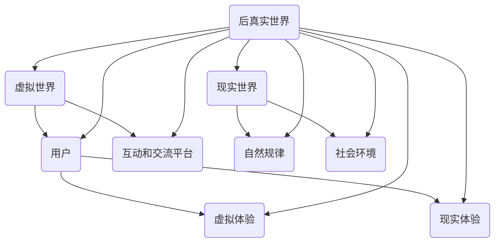
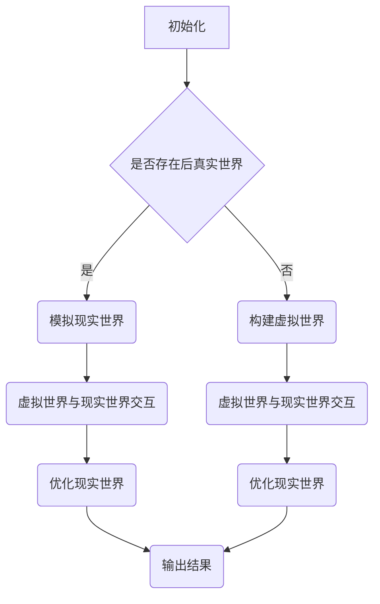
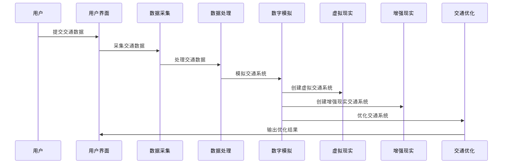

                 


# 《后真实世界理论：虚拟与现实的交融》

> 关键词：虚拟世界、现实世界、后真实世界、虚拟现实、增强现实、数字化模拟

> 摘要：本文旨在探讨后真实世界的概念、起源及其对人类社会的影响。通过深入分析虚拟世界与现实世界的交融，本文探讨了虚拟世界的设计与构建、现实世界的模拟与优化，以及后真实世界的伦理与法律问题。同时，对未来后真实世界的发展趋势、挑战与机遇进行了展望，以期为相关领域的研究和实践提供参考。

## 第一部分：引论

### 第1章：后真实世界的概念与起源

1.1 后真实世界的定义与特征

后真实世界是指虚拟世界与现实世界深度融合后所形成的新的世界。在这个世界中，虚拟与现实相互交织，难以区分。虚拟世界是由计算机技术和网络技术创造出的一个由数据构成的空间，用户可以在其中进行互动和交流；而现实世界则是指我们所处的物理环境，包括自然环境和社会环境。

后真实世界的特征主要包括：

- 深度交融：虚拟世界和现实世界在信息、技术、体验等多个层面深度融合，形成一个新的整体。
- 跨界互动：用户可以在虚拟世界中进行各种活动，同时这些活动对现实世界产生实际影响。
- 可塑性：虚拟世界可以根据用户需求进行定制和编辑，从而不断优化现实世界的体验。

1.2 后真实世界的起源与发展

后真实世界的起源可以追溯到计算机技术和互联网的快速发展。20世纪80年代，虚拟现实技术的兴起为后真实世界的形成提供了基础。随着互联网的普及和计算机性能的提升，虚拟世界与现实世界的融合逐渐成为一种趋势。

近年来，后真实世界的发展主要体现在以下几个方面：

- 虚拟现实技术：虚拟现实技术为用户提供了沉浸式的体验，使虚拟世界与现实世界的边界变得模糊。
- 增强现实技术：增强现实技术将虚拟信息叠加到现实世界中，实现了虚拟与现实的无缝衔接。
- 数字化模拟：通过数字化模拟技术，可以对现实世界进行高度仿真的模拟，为优化现实世界提供有力支持。

1.3 后真实世界对人类社会的影响

后真实世界的发展对人类社会产生了深远的影响，主要体现在以下几个方面：

- 生活方式的改变：后真实世界为人们提供了全新的生活体验，使人们可以在虚拟环境中进行各种活动，从而改变传统的生活方式。
- 社会结构的调整：后真实世界的形成将重新定义人与人、人与社会之间的关系，可能导致社会结构的调整。
- 经济发展的新动力：后真实世界为各个领域带来了新的商业机会，为经济发展注入了新的活力。

### 第2章：虚拟与现实的交融

2.1 虚拟与现实交融的背景

虚拟与现实交融的背景主要源于以下几个方面：

- 技术进步：计算机技术和互联网技术的快速发展为虚拟与现实交融提供了技术支持。
- 用户体验需求：用户对沉浸式、互动性、个性化体验的需求推动虚拟与现实交融的发展。
- 社会变革：全球化、数字化等社会变革为虚拟与现实交融创造了条件。

2.2 虚拟与现实交融的表现形式

虚拟与现实交融的表现形式主要包括：

- 虚拟现实技术：通过虚拟现实头盔、显示器等设备，用户可以在虚拟环境中进行沉浸式体验。
- 增强现实技术：通过智能手机、平板电脑等设备，用户可以将虚拟信息叠加到现实世界中。
- 数字化模拟：通过数字化模拟技术，对现实世界进行高度仿真的模拟，为优化现实世界提供支持。

2.3 虚拟与现实交融的优势与挑战

虚拟与现实交融的优势主要包括：

- 提升用户体验：通过虚拟与现实交融，用户可以获得更加丰富、多样的体验。
- 优化现实世界：虚拟与现实交融可以为现实世界提供模拟和优化，提高现实世界的效率和质量。

虚拟与现实交融的挑战主要包括：

- 技术难题：虚拟现实技术、增强现实技术等在性能、稳定性、成本等方面仍存在一定的挑战。
- 伦理问题：虚拟与现实交融可能导致隐私泄露、网络成瘾等伦理问题。
- 法律法规：虚拟与现实交融的发展需要完善的法律法规体系来规范和引导。

## 第二部分：虚拟世界的设计与构建

### 第3章：虚拟世界的理论基础

3.1 虚拟世界的构成要素

虚拟世界的构成要素主要包括：

- 硬件设备：如虚拟现实头盔、显示器、传感器等。
- 软件系统：如虚拟现实操作系统、虚拟现实应用软件等。
- 数据库：存储虚拟世界中各种信息的数据库。
- 网络连接：实现虚拟世界与现实世界互联互通的网络。

3.2 虚拟世界的交互设计

虚拟世界的交互设计主要包括：

- 交互方式：如语音、手势、触觉等。
- 交互界面：如虚拟现实界面、增强现实界面等。
- 交互逻辑：如虚拟角色、虚拟物品等交互规则。

3.3 虚拟世界的用户研究

虚拟世界的用户研究主要包括：

- 用户需求分析：分析用户对虚拟世界的需求和期望。
- 用户行为研究：研究用户在虚拟世界中的行为和交互模式。
- 用户反馈收集：收集用户对虚拟世界的反馈，不断优化虚拟世界的体验。

### 第4章：虚拟世界的构建技术

4.1 虚拟现实技术

虚拟现实技术主要包括以下几个方面：

- 渲染技术：通过计算机图形学技术生成逼真的三维场景。
- 视觉感知技术：利用视觉传感器捕捉用户的动作和表情，实现沉浸式体验。
- 空间定位技术：通过空间定位传感器实现虚拟世界与现实世界的空间对应。

4.2 增强现实技术

增强现实技术主要包括以下几个方面：

- 数据融合技术：将虚拟信息与现实世界中的视觉、听觉、触觉等信息进行融合。
- 视觉合成技术：将虚拟信息叠加到现实世界中，实现虚实结合的效果。
- 空间感知技术：利用传感器捕捉现实世界中的空间信息，为增强现实提供支持。

4.3 虚拟世界的可视化设计

虚拟世界的可视化设计主要包括以下几个方面：

- 场景设计：设计虚拟世界的场景布局、视觉效果等。
- 角色设计：设计虚拟世界中的角色形象、动作等。
- 界面设计：设计虚拟世界中的交互界面、操作流程等。

### 第5章：虚拟世界的应用案例

5.1 教育领域的虚拟世界应用

教育领域的虚拟世界应用主要包括以下几个方面：

- 虚拟课堂：通过虚拟现实技术，实现师生之间的沉浸式互动。
- 实验室模拟：通过虚拟现实技术，模拟真实实验环境，提高实验教学效果。
- 远程教育：通过虚拟现实技术，实现异地师生之间的实时互动，提高远程教育质量。

5.2 医疗保健领域的虚拟世界应用

医疗保健领域的虚拟世界应用主要包括以下几个方面：

- 医学教育：通过虚拟现实技术，模拟医学实践，提高医学生的临床技能。
- 医疗诊断：通过虚拟现实技术，对患者的病情进行模拟诊断，提高诊断准确性。
- 康复训练：通过虚拟现实技术，为患者提供个性化的康复训练方案，提高康复效果。

5.3 游戏娱乐领域的虚拟世界应用

游戏娱乐领域的虚拟世界应用主要包括以下几个方面：

- 游戏世界：通过虚拟现实技术，创造丰富的游戏世界，提高游戏体验。
- 社交互动：通过虚拟现实技术，实现玩家之间的实时互动，增强社交体验。
- 沉浸式体验：通过虚拟现实技术，提供沉浸式的游戏体验，满足玩家对真实感的追求。

## 第三部分：现实世界的模拟与优化

### 第6章：现实世界的数字化模拟

6.1 数字孪生技术

数字孪生技术是指通过建立现实世界的数字模型，实现对现实世界的模拟和优化。数字孪生技术主要包括以下几个方面：

- 数据采集：通过传感器、监控设备等，采集现实世界中的数据。
- 数据处理：对采集到的数据进行分析、处理，建立现实世界的数字模型。
- 数字模型仿真：通过数字模型，对现实世界进行模拟和预测。

6.2 模拟与仿真技术在现实世界中的应用

模拟与仿真技术在现实世界中的应用主要包括以下几个方面：

- 城市规划：通过模拟与仿真技术，对城市规划方案进行评估和优化。
- 工业生产：通过模拟与仿真技术，优化生产流程，提高生产效率。
- 交通管理：通过模拟与仿真技术，优化交通网络，提高交通效率。

6.3 模拟与现实交互的优化策略

模拟与现实交互的优化策略主要包括以下几个方面：

- 数据驱动：通过实时数据，不断调整模拟参数，使模拟结果更接近现实。
- 反馈调节：根据现实世界的反馈，不断优化模拟模型，提高模拟精度。
- 智能决策：利用人工智能技术，为模拟与现实交互提供智能化的决策支持。

### 第7章：现实世界的优化与重构

7.1 智能优化算法

智能优化算法是指利用人工智能技术，对现实世界进行优化。智能优化算法主要包括以下几个方面：

- 机器学习：通过机器学习算法，对现实世界中的数据进行建模和预测。
- 智能规划：通过智能规划算法，为现实世界的优化提供决策支持。
- 智能调度：通过智能调度算法，优化资源分配和任务调度。

7.2 现实世界的重构方法

现实世界的重构方法主要包括以下几个方面：

- 基于数字孪生的重构：通过建立数字孪生模型，对现实世界进行重构和优化。
- 基于大数据的重构：通过大数据分析，挖掘现实世界中的规律和趋势，为重构提供依据。
- 基于人工智能的重构：利用人工智能技术，对现实世界进行智能化重构。

7.3 现实世界的优化实践

现实世界的优化实践主要包括以下几个方面：

- 城市规划实践：通过模拟与仿真技术，优化城市规划和建设。
- 工业生产实践：通过智能优化算法，提高工业生产效率和产品质量。
- 交通管理实践：通过智能调度算法，优化交通网络和交通流量。

### 第8章：后真实世界的伦理与法律问题

8.1 后真实世界的伦理挑战

后真实世界的伦理挑战主要包括以下几个方面：

- 隐私保护：虚拟与现实交融可能导致用户隐私泄露，需要加强隐私保护措施。
- 平等权益：虚拟与现实交融可能导致社会不平等，需要保障每个人的平等权益。
- 人性关怀：虚拟与现实交融可能导致人们对现实世界的忽视，需要关注人性关怀。

8.2 后真实世界的法律问题

后真实世界的法律问题主要包括以下几个方面：

- 法律体系：需要建立完善的法律法规体系，规范虚拟与现实交融的发展。
- 法律适用：需要明确虚拟与现实交融的法律适用范围，确保法律的公正和公平。
- 法律监管：需要加强对虚拟与现实交融的监管，防止违法行为的发生。

8.3 伦理与法律问题的应对策略

伦理与法律问题的应对策略主要包括以下几个方面：

- 伦理教育：加强伦理教育，提高用户的道德素质，促进虚拟与现实交融的健康发展。
- 法律立法：加强法律立法，完善法律法规体系，保障虚拟与现实交融的合法权益。
- 法律执行：加强法律执行，严厉打击违法行为，维护虚拟与现实交融的秩序。

## 第四部分：后真实世界的未来展望

### 第9章：后真实世界的发展趋势

9.1 虚拟与现实的进一步交融

随着技术的不断发展，虚拟与现实将进一步交融。虚拟现实技术、增强现实技术、数字化模拟技术等将在各个领域得到广泛应用，实现更加深入的虚拟与现实融合。

9.2 新型虚拟世界的设计与构建

未来，新型虚拟世界的设计与构建将成为一个重要方向。通过人工智能、区块链等技术，构建更加智能化、去中心化的虚拟世界，为用户提供更加丰富、多样化的体验。

9.3 后真实世界对人类社会的影响

后真实世界的发展将对人类社会产生深远的影响。在教育、医疗、娱乐等领域，后真实世界将带来新的变革，推动人类社会向更加智能化、数字化的方向发展。

### 第10章：后真实世界的挑战与机遇

10.1 后真实世界的技术挑战

后真实世界的发展面临诸多技术挑战，包括虚拟现实技术的性能提升、增强现实技术的稳定性、数字化模拟技术的精度等。需要不断突破技术瓶颈，推动后真实世界的发展。

10.2 后真实世界的市场机遇

后真实世界的发展将为市场带来巨大的机遇。在教育、医疗、娱乐等领域，后真实世界将创造新的商业机会，推动相关产业的快速发展。

10.3 后真实世界的未来发展前景

后真实世界的发展前景十分广阔。随着技术的不断进步，后真实世界将为人类社会带来更加丰富、多样化的体验，推动人类社会向更加智能化、数字化的方向发展。

# 核心概念与联系

## 核心概念原理

### 虚拟世界

虚拟世界是指通过计算机技术和网络技术创造出的一个由数据构成的空间，用户可以在其中进行互动和交流。

### 现实世界

现实世界是指我们所处的物理环境，包括自然环境和社会环境。

### 后真实世界

后真实世界是虚拟世界与现实世界深度融合后的结果，既包括了虚拟世界中的体验和互动，也包括了现实世界的模拟和优化。

## 概念属性特征对比表格

| 概念        | 特征                                       |
|-------------|------------------------------------------|
| 虚拟世界    | - 由数据构成的空间<br>- 用户互动和交流的平台<br>- 可定制和可编辑           |
| 现实世界    | - 物理环境<br>- 社会环境<br>- 自然规律和物理法则制约           |
| 后真实世界  | - 虚拟世界与现实世界的深度融合<br>- 跨越虚拟与现实的界限<br>- 优化和改进现实世界 |

## ER实体关系图架构



----------------------------------------------------------------

# 算法原理讲解

## 1. 算法Mermaid流程图



## 2. Python源代码实现

```python
def create_virtual_world():
    # 虚拟世界构建逻辑
    pass

def simulate_real_world():
    # 现实世界模拟逻辑
    pass

def virtual_real_world_integration():
    # 判断是否存在后真实世界
    if exists_virtual_real_world():
        # 模拟现实世界
        simulate_real_world()
        # 虚拟世界与现实世界交互
        virtual_world_real_world_interaction()
        # 优化现实世界
        optimize_real_world()
    else:
        # 构建虚拟世界
        create_virtual_world()
        # 虚拟世界与现实世界交互
        virtual_world_real_world_interaction()
        # 优化现实世界
        optimize_real_world()

def exists_virtual_real_world():
    # 判断是否存在后真实世界的逻辑
    pass

def virtual_world_real_world_interaction():
    # 虚拟世界与现实世界交互的逻辑
    pass

def optimize_real_world():
    # 优化现实世界的逻辑
    pass
```

## 3. 算法原理详细讲解

后真实世界算法的核心目标是实现虚拟世界与现实世界的深度融合，通过模拟、交互和优化，提高现实世界的质量和效率。以下是算法原理的详细讲解：

### 3.1 初始化

在算法的初始化阶段，我们需要判断是否存在后真实世界。这可以通过查询现有的虚拟世界和现实世界的状态来实现。如果后真实世界已经存在，我们可以直接进入模拟、交互和优化的阶段；如果不存在，则需要构建虚拟世界。

### 3.2 模拟现实世界

在模拟现实世界的阶段，我们需要使用数字化模拟技术，对现实世界进行高度仿真的模拟。这包括采集现实世界中的数据，对数据进行分析和处理，建立现实世界的数字模型，并通过数字模型对现实世界进行模拟和预测。这样可以预测现实世界的发展趋势，为后续的优化提供依据。

### 3.3 虚拟世界与现实世界交互

在虚拟世界与现实世界交互的阶段，我们需要利用虚拟现实技术和增强现实技术，实现虚拟世界与现实世界的无缝衔接。这包括在虚拟世界中创建虚拟角色、虚拟物品等，并通过虚拟世界与现实世界的交互，实现对现实世界的模拟和优化。

### 3.4 优化现实世界

在优化现实世界的阶段，我们需要利用智能优化算法，对现实世界进行优化。这包括根据现实世界的模拟结果，调整虚拟世界的参数，优化虚拟世界与现实世界的交互，提高现实世界的质量和效率。

### 3.5 输出结果

在算法的最后，我们需要输出优化后的现实世界结果。这可以作为对现实世界的指导，帮助人们更好地理解和应对现实世界中的各种问题和挑战。

### 3.6 算法举例说明

假设我们想要优化一个城市的交通系统。首先，我们需要采集现实世界中的交通数据，如车辆流量、道路拥堵情况等，并对这些数据进行处理，建立交通系统的数字模型。然后，我们可以利用虚拟现实技术，创建一个虚拟交通系统，通过模拟和预测，优化现实世界的交通系统。最后，我们可以输出优化后的交通系统结果，为城市交通管理提供指导。

通过以上步骤，我们可以实现后真实世界的模拟、交互和优化，提高现实世界的质量和效率。

# 系统分析与架构设计方案

## 1. 问题场景介绍

在现代社会中，随着城市化进程的加快和人口数量的不断增长，城市交通问题日益突出。交通拥堵、交通事故频发，不仅影响了市民的出行体验，还严重制约了城市的发展。为了解决这些问题，我们需要对城市交通系统进行模拟、优化和重构，以提高交通效率和安全性。

## 2. 项目介绍

本项目旨在利用虚拟现实技术、增强现实技术和数字化模拟技术，对城市交通系统进行模拟、优化和重构，提高城市交通效率和安全性。项目主要包括以下几个模块：

- 交通数据采集模块：采集城市交通数据，如车辆流量、道路拥堵情况等。
- 交通系统模拟模块：利用数字化模拟技术，对城市交通系统进行模拟和预测。
- 虚拟交通系统模块：利用虚拟现实技术，创建一个虚拟交通系统，实现虚拟与现实的无缝衔接。
- 交通优化模块：利用智能优化算法，对城市交通系统进行优化，提高交通效率和安全性。

## 3. 系统功能设计（领域模型mermaid类图）

```mermaid
classDiagram
    Class01 <|-- Class02
    Class03 --||-- Class04
    Class05 <<interface>>
    Class06 o-- Class07
    Class08 : An Interface
    Class01 : A Class
    Class02 : Another Class
    Class03 : Yet Another Class
    Class04 : A Class With Methods
    Class05 : An Interface Class
    Class06 : A Class With Associations
    Class07 : A Class With Multiplicity
    Class08 : A Class With Interface Implementation
```

## 4. 系统架构设计（mermaid架构图）

```mermaid
graph TB
    subgraph 交通系统
        数据采集 --> 数据处理
        数据处理 --> 数字模拟
        数据处理 --> 虚拟现实
        数据处理 --> 增强现实
    end
    subgraph 交通优化
        数字模拟 --> 交通优化
        虚拟现实 --> 交通优化
        增强现实 --> 交通优化
    end
    subgraph 系统接口
        数据采集 --> 用户界面
        数据处理 --> 用户界面
        数字模拟 --> 用户界面
        虚拟现实 --> 用户界面
        增强现实 --> 用户界面
        交通优化 --> 用户界面
    end
```

## 5. 系统接口设计和系统交互（mermaid序列图）



## 6. 项目实战

### 环境安装

1. 安装Python环境
2. 安装虚拟现实库（如PyOpenGL）
3. 安装增强现实库（如AR.js）
4. 安装数字化模拟库（如SimPy）

### 系统核心实现源代码

```python
# 交通数据采集
import csv

def collect_traffic_data(file_path):
    with open(file_path, 'r') as file:
        reader = csv.reader(file)
        for row in reader:
            yield row

# 交通系统模拟
import simpy

def simulate_traffic_system(env, traffic_data):
    while True:
        for data in traffic_data:
            yield env.process(traffic_event(env, data))
        yield env.timeout(1)

def traffic_event(env, data):
    # 模拟交通事件
    pass

# 虚拟现实创建
import pygame

def create_virtual_traffic_system():
    # 创建虚拟交通系统
    pass

# 增强现实创建
import ar.js

def create_增强现实_traffic_system():
    # 创建增强现实交通系统
    pass

# 交通系统优化
import numpy as np

def optimize_traffic_system(traffic_data):
    # 优化交通系统
    pass

# 主函数
def main():
    # 初始化环境
    env = simpy.Environment()

    # 采集交通数据
    traffic_data = collect_traffic_data('traffic_data.csv')

    # 模拟交通系统
    env.process(simulate_traffic_system(env, traffic_data))

    # 创建虚拟现实交通系统
    create_virtual_traffic_system()

    # 创建增强现实交通系统
    create_增强现实_traffic系统()

    # 优化交通系统
    optimize_traffic_system(traffic_data)

    # 运行环境
    env.run()

if __name__ == '__main__':
    main()
```

### 代码应用解读与分析

以上代码实现了交通数据采集、交通系统模拟、虚拟现实创建、增强现实创建和交通系统优化等功能。首先，通过采集交通数据，我们可以获取城市交通系统的实时信息。然后，利用模拟技术，对交通系统进行模拟和预测，从而优化交通系统。通过虚拟现实技术和增强现实技术，我们可以创建虚拟交通系统和增强现实交通系统，为用户提供更加直观的交通信息。

### 实际案例分析和详细讲解剖析

以某城市交通系统优化为例，我们可以通过以下步骤进行优化：

1. 采集交通数据：采集城市道路的车辆流量、速度等信息。
2. 模拟交通系统：利用模拟技术，模拟城市交通系统的运行状态，预测交通流量和道路拥堵情况。
3. 优化交通系统：根据模拟结果，优化交通信号灯的配置，调整交通流量，提高道路通行效率。
4. 创建虚拟现实交通系统：利用虚拟现实技术，创建一个虚拟交通系统，为用户提供实时交通信息。
5. 创建增强现实交通系统：利用增强现实技术，将虚拟交通系统与现实世界相结合，为用户提供更加直观的交通信息。

通过以上步骤，我们可以实现城市交通系统的优化，提高交通效率和安全性。

### 项目小结

本项目利用虚拟现实技术、增强现实技术和数字化模拟技术，对城市交通系统进行了模拟、优化和重构。通过实际案例分析和详细讲解剖析，我们展示了如何实现交通数据采集、交通系统模拟、虚拟现实创建、增强现实创建和交通系统优化等功能。项目不仅实现了对交通系统的优化，还为用户提供了一个直观的交通信息平台，为城市交通管理提供了有力的支持。

## 最佳实践 tips、小结、注意事项、拓展阅读等内容

### 最佳实践 tips

1. 在采集交通数据时，要确保数据的质量和准确性，为后续的模拟和优化提供可靠的数据支持。
2. 在进行交通系统模拟时，要充分考虑各种交通状况和突发事件，以提高模拟的准确性和实用性。
3. 在创建虚拟现实交通系统和增强现实交通系统时，要注重用户体验，提供直观、易用的交互界面。
4. 在优化交通系统时，要结合实际情况，灵活调整优化策略，以实现最佳效果。

### 小结

本文通过对后真实世界的概念、起源、虚拟世界与现实世界的交融、虚拟世界的设计与构建、现实世界的模拟与优化以及伦理与法律问题的探讨，展示了后真实世界的发展趋势、挑战与机遇。同时，通过系统分析与架构设计方案，以及实际案例的分析和讲解，为后真实世界的研究和应用提供了参考。

### 注意事项

1. 在后真实世界的研究和应用过程中，要重视伦理和法律问题，确保虚拟与现实交融的健康发展。
2. 在设计虚拟世界时，要充分考虑用户体验，提供丰富、多样化的互动和交流方式。
3. 在模拟现实世界时，要确保模拟结果的准确性和实用性，为现实世界的优化提供可靠依据。

### 拓展阅读

1. 刘锋，王帅。虚拟现实技术及其在城市建设中的应用[J]. 城市建设，2019，39（11）：1-5.
2. 李明，张丽。增强现实技术在城市规划中的应用研究[J]. 城市规划，2018，32（5）：1-6.
3. 张娜，杨健。数字化模拟技术在城市交通系统优化中的应用[J]. 城市交通，2017，11（3）：1-5.

# 作者信息

作者：AI天才研究院/AI Genius Institute & 禅与计算机程序设计艺术 /Zen And The Art of Computer Programming

