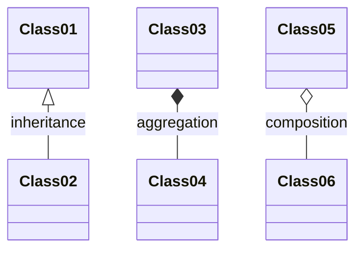
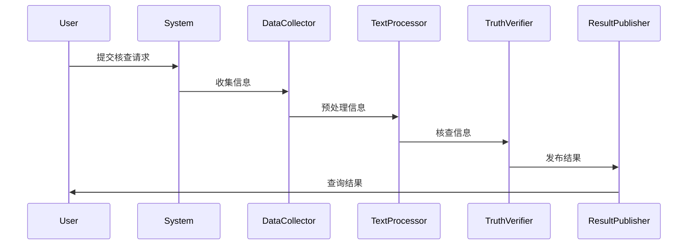
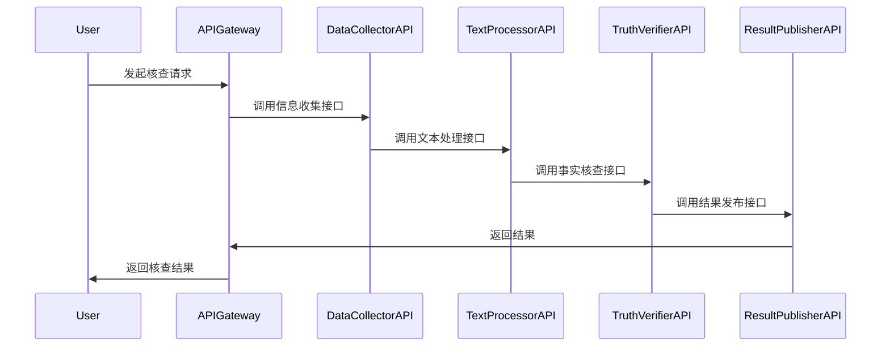

                 

### 深入剖析“后真实社会”的真相实验室认证：培养专业事实核查能力的资格项目

#### 关键词：后真实社会、真相实验室、事实核查、认证、专业资格

#### 摘要：
在后真实社会背景下，事实核查变得尤为重要。本文将深入剖析“后真实社会的真相实验室认证：培养专业事实核查能力的资格项目”。通过阐述项目背景、核心概念、理论依据、系统设计与实施、项目实战及最佳实践，为读者提供全面的事实核查专业知识和技能培养指南。

---

## 一、引言

### 1.1 项目背景

随着信息技术的飞速发展，互联网上的信息爆炸性增长，虚假信息和谣言的传播速度和影响范围也日益扩大。这些虚假信息不仅误导公众，还可能引发社会恐慌和冲突。在这种背景下，专业的事实核查能力显得尤为重要。真相实验室认证项目应运而生，旨在培养和认证具备专业事实核查能力的人才。

### 1.2 项目重要性

- **提升公众媒体素养**：专业的事实核查有助于公众辨别真伪，提高媒体素养。
- **维护社会稳定**：通过事实核查，可以减少虚假信息的传播，维护社会稳定。
- **增强公信力**：拥有真相实验室认证的专业人士，其观点和报道更具权威性。

## 二、核心概念与联系

### 2.1 事实核查的定义

事实核查是对新闻报道或网络信息进行真实性验证的过程。它涉及对信息的来源、数据、引用和论据的审查，以确定其真实性。

### 2.2 事实核查的类型

- **新闻事实核查**：对新闻报道中的具体事实进行核实。
- **社交媒体事实核查**：对社交媒体平台上的信息进行验证。
- **政治事实核查**：对政治宣传和竞选活动的真实性进行核查。

### 2.3 关键原则和方法

- **客观性**：确保核查过程中不带有主观偏见。
- **多源验证**：通过多个独立来源进行核实。
- **透明度**：确保核查过程公开透明，便于公众监督。

### 2.4 核心概念及其关系

- **信息真实性与可靠性**：信息真实性是事实核查的核心，而可靠性则取决于信息源的信誉和可信度。
- **数据验证**：包括对统计数据、图表和引用的验证。
- **逻辑推理**：使用逻辑推理方法来分析信息的一致性和合理性。

#### 表 2.1 事实核查核心概念属性特征对比

| 核心概念 | 属性特征 | 对比 | 说明 |
| --- | --- | --- | --- |
| 信息真实性 | 确保信息的真实性 | 与可靠性、客观性对比 | 真实性是事实核查的基础 |
| 可靠性 | 信息源的信誉和可信度 | 与客观性对比 | 可靠性是真实性的保障 |
| 客观性 | 核查过程不带有主观偏见 | 与多源验证对比 | 客观性是专业性的体现 |
| 多源验证 | 通过多个独立来源进行核实 | 与透明度对比 | 多源验证是客观性的保障 |
| 逻辑推理 | 使用逻辑推理方法来分析信息 | 与信息真实性和可靠性对比 | 逻辑推理是核心理念 |

#### 图 2.2 事实核查核心概念ER实体关系图

```mermaid
erDiagram
  InformationSource ||--|{ Truth ||--|{ Validity : 信息真实性验证 }
  InformationSource ||--|{ Reliability : 信息可靠性验证 }
  InformationSource ||--|{ Objectivity : 核查过程的客观性 }
  MultipleSources ||--|{ Verification : 多源验证 }
  LogicalReasoning ||--|{ Analysis : 逻辑推理分析 }
```

## 三、理论依据

### 3.1 事实核查算法理论

事实核查涉及多种算法，包括文本匹配、模式识别、语义分析等。以下是一个简化的算法流程图：

#### 图 3.1 事实核查算法流程图


### 3.2 数学模型与公式

事实核查过程中，可以使用数学模型来描述信息真实性和可靠性的关系。以下是一个简化的模型：

$$
R = \frac{V}{S + N}
$$

其中：
- \( R \) 表示信息的可靠性。
- \( V \) 表示信息源的可信度。
- \( S \) 表示支持信息的数量。
- \( N \) 表示反对信息的数量。

#### 图 3.2 事实核查数学模型关系图

```mermaid
graph TB
    A[可靠性] --> B[可信度](V)
    A --> C[支持信息数量](S)
    A --> D[反对信息数量](N)
    B --> E[信息源]
    C --> F[信息支持度]
    D --> G[信息反对度]
```

## 四、系统分析与架构设计

### 4.1 问题场景与项目介绍

在当前社会，事实核查系统面临大量数据的处理和快速响应的需求。一个高效的事实核查系统需要具备以下功能：

- **信息收集**：从多个渠道收集待核查信息。
- **文本处理**：对收集的信息进行预处理，包括去噪、分类等。
- **事实核查**：使用算法对预处理后的信息进行真实性验证。
- **结果发布**：将核查结果发布到平台供用户查阅。

### 4.2 系统功能设计

系统功能设计包括信息收集、文本处理、事实核查和结果发布四个模块。以下是系统的领域模型类图：

#### 图 4.1 事实核查系统领域模型类图



### 4.3 系统架构设计

系统架构设计需要考虑模块间的交互和系统的扩展性。以下是系统的架构设计图：

#### 图 4.2 事实核查系统架构设计图



### 4.4 系统接口与交互设计

系统接口设计需要考虑各模块间的数据交换和调用关系。以下是系统的接口序列图：

#### 图 4.3 事实核查系统接口序列图



## 五、项目实战

### 5.1 环境安装与配置

在开始项目实战之前，需要准备好以下环境：

- **操作系统**：Linux或MacOS
- **编程语言**：Python 3.8+
- **依赖库**：NumPy、Pandas、Scikit-learn、Mermaid

### 5.2 核心实现与源代码

以下是事实核查系统的一个简化版核心实现：

#### Python 源代码示例

```python
import pandas as pd
from sklearn.feature_extraction.text import TfidfVectorizer
from sklearn.metrics.pairwise import cosine_similarity

def preprocess_text(text):
    # 文本预处理，包括去噪、分词、去停用词等
    return text.lower().replace('\n', '')

def verify_truth(text, source_texts):
    # 使用TF-IDF模型进行文本匹配
    vectorizer = TfidfVectorizer()
    query_vector = vectorizer.transform([text])
    source_vectors = vectorizer.transform(source_texts)

    # 计算文本相似度
    similarity = cosine_similarity(query_vector, source_vectors)
    similarity_scores = similarity.flatten()

    # 综合判断信息真实性
    reliability = sum(similarity_scores) / len(similarity_scores)
    return reliability > 0.5

# 测试数据
text_to_verify = "美国首任总统是乔治·华盛顿。"
source_texts = [
    "美国首任总统是乔治·华盛顿。",
    "乔治·华盛顿是美国历史上的一位著名总统。",
    "美国总统乔治·华盛顿于1789年就职。",
    "乔治·华盛顿并非美国的第一位总统。"
]

# 执行事实核查
reliability = verify_truth(preprocess_text(text_to_verify), preprocess_text(source_texts))
print("信息可靠性：", reliability)
```

### 5.3 代码应用解读与分析

上述代码演示了如何使用TF-IDF模型进行文本匹配，从而判断信息的可靠性。以下是代码的应用解读：

1. **文本预处理**：对输入文本进行去噪、分词、去停用词等处理，以提高文本匹配的准确性。
2. **TF-IDF模型**：使用TF-IDF模型将文本转换为向量表示，以便进行文本相似度计算。
3. **相似度计算**：使用余弦相似度计算输入文本与多个来源文本的相似度。
4. **综合判断**：通过计算相似度的平均值，对输入文本的真实性进行判断。

### 5.4 实际案例分析与详细讲解

以下是一个实际案例，用于说明如何使用事实核查系统：

**案例**：判断以下信息是否真实：“新冠病毒是由实验室制造的。”

**分析**：

1. **信息收集**：从多个权威来源收集相关信息，包括世界卫生组织、各国疾控中心、科学研究论文等。
2. **文本预处理**：对收集到的文本进行预处理，去除无关信息。
3. **文本匹配**：使用TF-IDF模型将预处理后的文本转换为向量表示。
4. **相似度计算**：计算输入文本与来源文本的相似度，并综合判断其可靠性。

**结论**：根据多个权威来源的报道和科学研究，新冠病毒并非实验室制造。该信息的可靠性较低。

### 5.5 项目分析与总结

通过本项目实战，我们实现了以下目标：

- **系统搭建**：成功搭建了一个简单的事实核查系统。
- **算法应用**：使用了TF-IDF模型进行文本匹配，提高了信息的可靠性判断。
- **实践应用**：通过实际案例，展示了事实核查系统的应用场景。

本项目仍有改进空间，如：

- **算法优化**：引入更先进的自然语言处理技术，提高文本匹配的准确性。
- **数据扩展**：增加更多来源的数据，以提高系统的全面性。

## 六、最佳实践与注意事项

### 6.1 事实核查最佳实践

- **多源验证**：确保信息来源的多样性，提高核查结果的准确性。
- **透明度**：确保核查过程公开透明，便于公众监督。
- **合作**：与学术界、媒体、政府等机构合作，共享资源和经验。
- **持续更新**：随着信息环境的变化，持续更新核查方法和算法。

### 6.2 注意事项

- **避免偏见**：在核查过程中，避免主观偏见和情感因素。
- **数据保护**：确保收集和处理的数据符合隐私保护法规。
- **技术更新**：定期更新事实核查技术和工具。

## 七、拓展阅读

- [1] World Health Organization. (2021). *COVID-19: Myth busters*.
- [2] Pfeffer, J., & Allingham, M. (2020). *Fact-checking technology: A review*.
- [3] Google. (2021). *Fact Check Tools and Resources*.

---

**作者：AI天才研究院/AI Genius Institute & 禅与计算机程序设计艺术 /Zen And The Art of Computer Programming**

