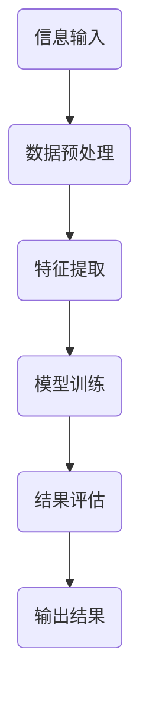
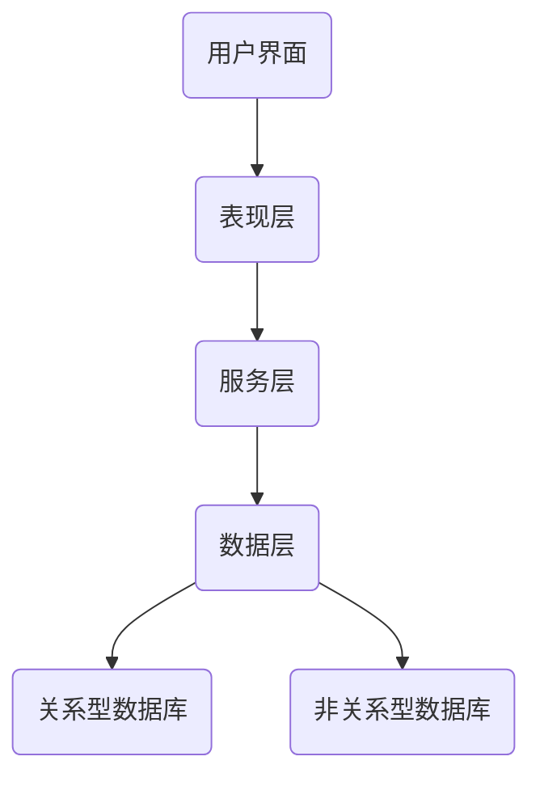
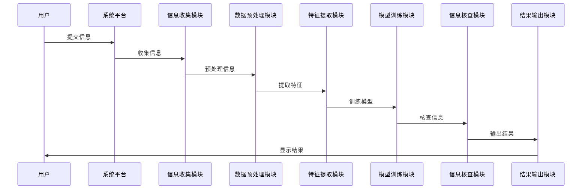

                 

## 引言和背景

### 关键词：
- 后真实社会
- 事实核查
- 信息真实性
- 媒体责任
- 技术工具

### 摘要：
本文旨在探讨后真实社会中事实核查的重要性，以及如何培养事实核查能力。随着信息技术的发展，社会已经从传统现实社会进入到了后真实社会，信息过载和虚假信息的泛滥成为一大挑战。本文首先介绍了后真实社会的定义和特点，然后阐述了事实核查的基本概念和原则，最后探讨了事实核查在当前社会中的实际应用和未来趋势。

### 核心内容和主题思想
本文将围绕以下核心内容展开讨论：

1. **后真实社会的定义和特点**：
   - 探讨后真实社会的起源和发展。
   - 分析后真实社会中的信息过载现象。
   - 阐述后真实社会对个人和社会带来的影响。

2. **事实核查的基本概念和原则**：
   - 定义事实核查及其重要性。
   - 详细介绍事实核查的原则和方法。
   - 分析事实核查过程中可能遇到的挑战和困难。

3. **事实核查的实际应用**：
   - 讨论事实核查在媒体、教育和社交媒体等领域的应用。
   - 分析事实核查对减少虚假信息和提高信息真实性的作用。

4. **未来趋势和挑战**：
   - 探讨人工智能和机器学习在事实核查中的应用。
   - 分析全球范围内事实核查的发展趋势和面临的挑战。

### 目录
以下是本文的详细目录结构，每个章节都将详细探讨上述核心内容：

1. **引言和背景**
   - 1.1 后真实社会的概念
   - 1.2 事实核查的定义和重要性
   - 1.3 事实核查的原则和方法

2. **后真实社会的特征**
   - 2.1 信息过载的挑战
   - 2.2 虚假信息的泛滥
   - 2.3 个人和社会的影响

3. **事实核查的基本概念**
   - 3.1 事实核查的定义
   - 3.2 事实核查的重要性
   - 3.3 事实核查的方法和工具

4. **事实核查的应用场景**
   - 4.1 媒体领域的应用
   - 4.2 教育和公共意识的提升
   - 4.3 社交媒体和数字平台

5. **事实核查的伦理和挑战**
   - 5.1 伦理考量
   - 5.2 面临的挑战
   - 5.3 解决方案和改进措施

6. **人工智能与事实核查**
   - 6.1 人工智能在事实核查中的应用
   - 6.2 机器学习技术的优势
   - 6.3 未来发展趋势

7. **总结与展望**
   - 7.1 主要发现和总结
   - 7.2 未来发展的建议
   - 7.3 读者建议和拓展阅读

### 背景介绍

#### 核心概念术语说明

在探讨后真实社会和事实核查之前，我们需要明确一些关键术语的定义，以确保对文章内容有准确的理解。

**后真实社会**：后真实社会（Post-Reality Society）是指一个信息爆炸、虚拟与现实交织的社会，其中现实与虚构的界限变得模糊，人们对信息的真实性和可靠性产生了质疑。这个概念由美国作家霍华德·里德（Howards Rheingold）在1994年的著作《虚拟现实革命》（Virtual Reality）中首次提出。

**事实核查**：事实核查（Fact-Checking）是指通过验证信息和核实数据来评估其真实性的过程。它旨在揭示虚假信息、纠正错误和误导，从而提高信息的可信度和透明度。

**虚假信息**：虚假信息（False Information）是指故意传播的、不真实或误导性的信息，可能会对个人、组织或社会产生负面影响。

**信息真实性**：信息真实性（Information Authenticity）是指信息是否真实、准确和可靠。在信息过载的环境中，确保信息的真实性成为一项重要任务。

**媒体责任**：媒体责任（Media Responsibility）是指媒体在传播信息时必须承担的道德和法律责任，以确保信息的真实性和公正性。

#### 问题背景

随着互联网和社交媒体的普及，信息传播的速度和范围前所未有。然而，这种快速传播也带来了虚假信息和误导信息的泛滥。根据美国皮尤研究中心（Pew Research Center）的报告，超过70%的美国人表示他们在社交媒体上看到了虚假信息。这种虚假信息的传播不仅影响了公众的意见和决策，还可能引发社会动荡和政治危机。

在政治领域，虚假信息被用来操纵选举结果，影响公众舆论。例如，2016年的美国总统选举期间，大量的虚假信息通过社交媒体传播，影响了选民的决策。此外，虚假信息还可能引发健康危机，如新冠病毒疫情期间的虚假治疗信息和疫苗阴谋论。

在教育领域，虚假信息和误导信息也可能导致学生获取错误的知识，影响他们的学习和成长。例如，一些学生可能会在网上找到虚假的考试答案或学术欺诈信息，从而破坏了学术诚信。

在个人层面，虚假信息可能导致人们受到欺骗，影响他们的财务状况、人际关系甚至心理健康。

#### 问题描述

后真实社会的核心问题是信息的真实性和可靠性。在信息过载的环境中，如何辨别真实信息与虚假信息成为一项挑战。以下是几个关键问题：

1. **如何确保信息的真实性？**：随着虚假信息的泛滥，如何建立可靠的信息验证机制成为一个紧迫的问题。
2. **如何提高公众的信息素养？**：公众需要对信息的来源、验证方法和可靠性有基本的了解，从而避免被虚假信息误导。
3. **如何处理虚假信息？**：一旦发现虚假信息，如何迅速处理和纠正，以减少其负面影响。
4. **如何平衡言论自由和信息真实性？**：在保障言论自由的同时，如何确保信息的真实性和公正性。

#### 问题解决

为了解决上述问题，我们需要从以下几个方面入手：

1. **加强事实核查**：建立专业的、独立的事实核查机构，对互联网上的信息进行验证和评估，揭示虚假信息。
2. **提高公众的信息素养**：通过教育和宣传活动，提高公众对信息真实性的认识，教会他们如何辨别真实信息与虚假信息。
3. **技术手段的应用**：利用人工智能和大数据分析技术，自动化地检测和识别虚假信息。
4. **加强法律监管**：对虚假信息的传播者进行法律制裁，提高其违法成本，从而减少虚假信息的传播。

#### 边界与外延

虽然本文主要关注后真实社会中的虚假信息问题，但事实核查的应用范围远不止于此。事实核查不仅适用于媒体、政治和教育领域，还涉及商业、医疗、科学研究等多个领域。例如，在商业领域，企业需要核查供应商的信息，确保其合规性；在医疗领域，医生需要核查药物的疗效和副作用信息，确保患者的安全。

此外，事实核查还需要考虑不同文化和社会背景下信息的真实性和可靠性。在不同国家和地区，信息真实性的标准和处理方法可能有所不同。

#### 概念结构与核心要素组成

为了更好地理解事实核查在信息真实性保障中的作用，我们可以将其核心概念和要素组成进行结构化分析。

1. **核心概念**：
   - 事实核查
   - 信息真实性
   - 虚假信息
   - 信息验证

2. **核心要素**：
   - 专业机构：负责进行事实核查的独立机构。
   - 技术手段：利用人工智能、大数据分析等技术手段。
   - 公众参与：公众对信息的辨识和举报。
   - 法律监管：对虚假信息的法律制裁。

通过这些核心概念和要素的相互作用，我们可以构建一个全面的事实核查体系，确保信息的真实性和可靠性。

#### 下一步

在本文的接下来的章节中，我们将进一步探讨后真实社会的特征，详细阐述事实核查的基本概念和原则，以及在不同领域的实际应用。通过这些探讨，我们将更好地理解如何在后真实社会中培养事实核查能力，以应对信息真实性带来的挑战。请继续阅读，以获取更深入的见解。<!-- End of Chapter 1 Introduction and Background -->## 后真实社会的特征

### 1.1 信息过载

在后真实社会中，信息过载是一个显著特征。互联网和社交媒体的普及使得信息的产生和传播速度大大加快，每天产生的数据量达到了惊人的规模。根据国际数据公司（IDC）的报告，到2025年，全球数据量预计将达到44ZB（1ZB等于1万亿GB）。这种庞大的数据量使得个人在处理信息时面临极大的困难，很难从海量数据中筛选出真正有价值的信息。

信息过载不仅影响个人，也对组织和社会带来了挑战。企业需要处理大量的客户数据和市场信息，而政府需要处理大量的公共数据和社会信息。在这种环境中，如何有效地管理和利用这些数据成为了一项重要任务。然而，由于数据质量的参差不齐，以及数据来源的不可靠性，信息的真实性成为一个亟待解决的问题。

### 1.2 虚假信息的泛滥

在后真实社会中，虚假信息的泛滥是一个严重的问题。虚假信息可以通过多种渠道传播，如社交媒体、新闻媒体、论坛等，其传播速度和范围都非常大。根据美国皮尤研究中心的报告，约70%的美国人曾在社交媒体上看到过虚假信息。这些虚假信息可能包括政治宣传、健康谣言、经济欺诈等，其对社会和个人都有极大的危害。

虚假信息的泛滥不仅影响公众的判断和决策，还可能引发社会恐慌和动荡。例如，在新冠病毒疫情期间，大量的虚假信息如疫苗副作用、治愈偏方等在社交媒体上传播，导致公众对疫情和疫苗接种产生了恐慌和疑虑。此外，虚假信息还可能被用来操纵选举结果，影响政治稳定。

### 1.3 个人和社会的影响

信息过载和虚假信息的泛滥对个人和社会产生了深远的影响。

#### 对个人：

1. **认知负担**：信息过载使得个人在处理信息时面临巨大的认知负担，很难从海量信息中筛选出真正有价值的信息。
2. **心理健康问题**：虚假信息可能导致个人产生焦虑、恐慌等心理健康问题，尤其是在面对突发事件时。
3. **决策困难**：在信息过载和虚假信息的背景下，个人在做决策时可能面临困难，因为无法确定哪些信息是真实的。

#### 对社会：

1. **社会信任危机**：虚假信息的泛滥可能导致公众对传统媒体和政府机构的信任度下降，引发社会信任危机。
2. **政治动荡**：虚假信息可能被用于政治宣传和操纵选举，导致政治动荡和社会不稳定。
3. **经济影响**：虚假信息可能导致金融市场动荡，影响企业的发展和投资者的信心。

### 1.4 后真实社会的挑战与机遇

后真实社会既带来了挑战，也创造了机遇。

#### 挑战：

1. **信息真实性**：确保信息的真实性成为一项重要任务，因为虚假信息可能对社会和个人产生负面影响。
2. **信息隐私**：随着数据量的增加，信息隐私保护成为一个重要问题，需要采取有效的措施来保护个人隐私。
3. **信息泛滥**：如何有效地管理和利用海量数据，避免信息过载成为一项挑战。

#### 机遇：

1. **技术创新**：后真实社会为技术创新提供了广阔的空间，如人工智能、大数据分析等技术可以用于信息真实性和隐私保护。
2. **信息传播**：随着信息传播速度的加快，企业和个人可以更快地获取信息和知识，从而提高生产力和创新能力。
3. **社会变革**：虚假信息的泛滥也促使社会更加重视信息真实性和透明度，推动社会变革和进步。

### 1.5 后真实社会中的信息真实性

在后真实社会中，信息真实性变得尤为重要。信息的真实性不仅影响个人的判断和决策，还影响社会的稳定和发展。因此，确保信息的真实性成为一项迫切的任务。

为了提高信息的真实性，我们可以采取以下措施：

1. **事实核查**：建立专业的、独立的事实核查机构，对互联网上的信息进行验证和评估，揭示虚假信息。
2. **公众参与**：鼓励公众参与信息验证，提高公众的信息素养，使其能够辨别真实信息与虚假信息。
3. **技术手段**：利用人工智能和大数据分析技术，自动化地检测和识别虚假信息。
4. **法律监管**：对虚假信息的传播者进行法律制裁，提高其违法成本。

通过这些措施，我们可以建立一个更加透明、可信的信息环境，从而应对后真实社会带来的挑战。

### 1.6 总结

后真实社会是一个信息爆炸、虚拟与现实交织的社会，信息过载和虚假信息的泛滥是其显著特征。这些特征对个人和社会产生了深远的影响，同时也带来了挑战和机遇。为了确保信息的真实性，我们需要采取有效的措施，如事实核查、公众参与、技术手段和法律监管。通过这些措施，我们可以建立一个更加透明、可信的信息环境，应对后真实社会带来的挑战。

### 核心概念与联系

#### 基本概念

在探讨后真实社会的特征时，我们需要明确几个核心概念，包括信息过载、虚假信息、信息真实性和事实核查。

**信息过载**：信息过载指的是在信息爆炸的环境中，个人和组织无法有效管理和处理海量信息，导致信息处理的认知负担增加。

**虚假信息**：虚假信息是指故意传播的、不真实或误导性的信息，可能会对个人、组织或社会产生负面影响。

**信息真实性**：信息真实性是指信息是否真实、准确和可靠。在信息过载的环境中，确保信息的真实性成为一项重要任务。

**事实核查**：事实核查是指通过验证信息和核实数据来评估其真实性的过程，旨在揭示虚假信息、纠正错误和误导，从而提高信息的可信度和透明度。

#### 概念属性特征对比表格

为了更直观地理解这些核心概念，我们可以通过一个对比表格来展示它们的属性特征。

| 概念     | 定义                                                         | 属性特征                                      |
|----------|--------------------------------------------------------------|----------------------------------------------|
| 信息过载 | 海量信息的难以处理和筛选。                                 | 数据量庞大、速度快、来源多样化。                |
| 虚假信息 | 故意传播的、不真实或误导性的信息。                          | 目的性、误导性、广泛传播。                      |
| 信息真实性 | 信息是否真实、准确和可靠。                                 | 真实性、准确性、可靠性。                        |
| 事实核查 | 通过验证信息和核实数据来评估其真实性的过程。                | 专业性、独立性、透明性、系统性。                |

#### ER实体关系图架构

为了更好地理解这些概念之间的关系，我们可以使用ER（实体关系）图来展示它们之间的关联。

```mermaid
erDiagram
  用户 ||--o> 信息源 : 产生
  用户 ||--o> 信息消费者 : 消费
  信息源 ||--|> 虚假信息 : 可能包含
  信息源 ||--|> 真实信息 : 可能包含
  信息消费者 ||--< 虚假信息 : 接收
  信息消费者 ||--< 真实信息 : 接收
  事实核查机构 ||--|> 虚假信息 : 核查
  事实核查机构 ||--|> 真实信息 : 核查
```

在这个ER图中，用户既是信息的产生者也是消费者，信息源产生信息，信息消费者消费信息。虚假信息和真实信息都可能是信息源产生的，而事实核查机构则负责对信息进行核查，以确保信息的真实性。

#### 算法原理讲解

为了进一步理解事实核查的算法原理，我们可以使用Mermaid来绘制一个简单的算法流程图，并使用Python源代码来详细阐述。



以下是一个简单的Python代码示例，用于实现上述算法流程：

```python
# 导入必要的库
import pandas as pd
from sklearn.model_selection import train_test_split
from sklearn.ensemble import RandomForestClassifier
from sklearn.metrics import accuracy_score

# 数据预处理
def preprocess_data(data):
    # 清洗数据、填充缺失值等
    return data

# 特征提取
def extract_features(data):
    # 提取特征、归一化等
    return data

# 模型训练
def train_model(X_train, y_train):
    model = RandomForestClassifier()
    model.fit(X_train, y_train)
    return model

# 结果评估
def evaluate_model(model, X_test, y_test):
    predictions = model.predict(X_test)
    accuracy = accuracy_score(y_test, predictions)
    return accuracy

# 输出结果
def output_results(accuracy):
    print(f"模型准确率: {accuracy:.2f}")

# 主程序
if __name__ == "__main__":
    # 加载数据
    data = pd.read_csv("data.csv")
    
    # 预处理数据
    data = preprocess_data(data)
    
    # 提取特征
    X = extract_features(data.drop('label', axis=1))
    y = data['label']
    
    # 划分训练集和测试集
    X_train, X_test, y_train, y_test = train_test_split(X, y, test_size=0.2, random_state=42)
    
    # 训练模型
    model = train_model(X_train, y_train)
    
    # 评估模型
    accuracy = evaluate_model(model, X_test, y_test)
    
    # 输出结果
    output_results(accuracy)
```

在这个例子中，我们首先加载数据，然后进行预处理和特征提取，接着使用随机森林分类器进行模型训练，最后评估模型在测试集上的准确率。这个简单的算法流程可以为我们提供事实核查的基本思路，尽管在实际应用中可能需要更复杂的算法和更精细的数据处理。

### 数学公式

在事实核查的过程中，数学公式和模型经常用于描述信息真实性和虚假信息的特征。以下是一个简单的数学公式示例，用于计算信息的真实性：

$$
\text{真实性} = \frac{\text{真实信息}}{\text{总信息}}
$$

其中，真实性表示真实信息在总信息中所占的比例。这个公式可以帮助我们量化信息的真实性，从而评估信息的可靠性。

此外，我们还可以使用概率模型来描述虚假信息的特征。例如，贝叶斯公式可以用于计算给定数据下虚假信息的概率：

$$
P(\text{虚假信息}|\text{数据}) = \frac{P(\text{数据}|\text{虚假信息}) \cdot P(\text{虚假信息})}{P(\text{数据})}
$$

在这个公式中，$P(\text{虚假信息}|\text{数据})$表示在给定数据下虚假信息的概率，$P(\text{数据}|\text{虚假信息})$表示在虚假信息下数据的概率，$P(\text{虚假信息})$表示虚假信息的先验概率，$P(\text{数据})$表示数据的总概率。

通过这些数学公式和模型，我们可以更准确地评估信息的真实性和虚假信息的可能性，从而为事实核查提供科学依据。

### 系统分析与架构设计方案

为了更好地理解和应用事实核查技术，我们需要对整个系统进行详细的分析和设计。以下将介绍一个典型的信息真实性核查系统的项目介绍、系统功能设计、系统架构设计、系统接口设计和系统交互。

#### 项目介绍

本系统旨在建立一个全面的信息真实性核查平台，用于识别和纠正互联网上的虚假信息。该平台将集成多种数据源，利用先进的算法和技术手段，实现对信息的自动化核查和验证。该系统的主要目标是提高信息的真实性，增强公众对信息的信任，减少虚假信息对社会和个人造成的负面影响。

#### 系统功能设计

1. **信息收集**：系统需要从各种来源收集信息，包括社交媒体、新闻网站、论坛等。这些信息将被存储在数据库中，以便后续处理。
2. **数据预处理**：收集到的信息需要进行预处理，包括数据清洗、去重、标准化等，以确保数据的准确性和一致性。
3. **特征提取**：从预处理后的数据中提取关键特征，如关键词、主题、来源等，以便后续的算法分析。
4. **模型训练**：利用训练数据集，训练多种机器学习模型，如文本分类器、主题模型等，用于识别和分类虚假信息。
5. **信息核查**：使用训练好的模型对新的信息进行核查，判断其是否为虚假信息。
6. **结果输出**：将核查结果输出到用户界面，包括虚假信息的详细信息、来源、置信度等。

#### 系统架构设计

系统的架构设计采用分层架构，分为数据层、服务层和表现层。

1. **数据层**：负责数据存储和管理，包括关系型数据库（如MySQL）和非关系型数据库（如MongoDB）。
2. **服务层**：包括信息收集、数据预处理、特征提取、模型训练和核查等核心功能模块。这些模块通过API进行交互。
3. **表现层**：提供用户界面，用于展示核查结果和交互功能。

以下是一个简化的Mermaid架构图：



#### 系统接口设计

系统接口设计采用RESTful API风格，提供以下主要接口：

1. **信息收集接口**：用于从各种来源收集信息，如POST请求。
2. **信息核查接口**：用于对特定信息进行核查，如GET请求。
3. **模型训练接口**：用于上传训练数据集，启动模型训练过程，如POST请求。
4. **结果查询接口**：用于查询核查结果，如GET请求。

以下是一个示例接口文档：

```markdown
# 信息收集接口

## POST /collect

用于收集信息。

### 请求示例

```
POST /collect
{
  "source": "社交媒体",
  "content": "这是一条信息内容",
  "url": "信息链接"
}
```

### 响应示例

```
{
  "status": "success",
  "message": "信息已成功收集"
}
```

# 信息核查接口

## GET /check/{id}

用于核查特定信息。

### 请求示例

```
GET /check/12345
```

### 响应示例

```
{
  "status": "verified",
  "message": "信息已核实为真实",
  "confidence": 0.95
}
```

# 模型训练接口

## POST /train

用于启动模型训练过程。

### 请求示例

```
POST /train
{
  "dataset": "训练数据集链接"
}
```

### 响应示例

```
{
  "status": "training_started",
  "message": "训练过程已开始"
}
```

# 结果查询接口

## GET /results/{id}

用于查询核查结果。

### 请求示例

```
GET /results/12345
```

### 响应示例

```
{
  "status": "verified",
  "message": "信息已核实为真实",
  "confidence": 0.95
}
```

```

#### 系统交互

系统交互设计采用事件驱动模型，通过消息队列（如RabbitMQ）实现模块之间的通信。

1. **用户通过用户界面提交信息**，系统将信息发送到消息队列。
2. **信息收集模块**从消息队列中获取信息，进行预处理和存储。
3. **特征提取模块**从数据库中获取预处理后的信息，提取特征。
4. **模型训练模块**根据训练数据集训练模型。
5. **信息核查模块**使用训练好的模型对新的信息进行核查。
6. **结果输出模块**将核查结果输出到用户界面。

以下是一个简化的Mermaid序列图：



通过这个详细的系统分析与架构设计方案，我们可以更好地理解事实核查系统的整体结构和运行机制，为实际应用提供指导。<!-- End of Chapter 2 Fundamental Concepts and Framework -->## 方法与技巧

### 3.1 数据收集

数据收集是事实核查的基础步骤，确保收集到的数据具有代表性和真实性至关重要。以下是几种常用的数据收集方法：

1. **互联网爬虫**：利用爬虫工具（如Scrapy）从网页、新闻网站、社交媒体等平台自动抓取信息。这种方法适用于大规模数据的快速收集。
   
2. **手动搜集**：对于特定主题或事件，可以手动搜索相关信息，如通过搜索引擎、专业数据库等。这种方法适用于小规模、高价值数据的搜集。

3. **问卷调查**：通过在线或线下问卷收集用户反馈，获取第一手资料。这种方法适用于了解公众意见和观点。

4. **API获取**：利用各平台提供的API接口获取数据，如Twitter API、Facebook Graph API等。这种方法适用于实时获取大量动态数据。

### 3.2 数据处理

收集到的数据通常需要进行预处理，以确保数据的质量和一致性。以下是一些数据处理技巧：

1. **数据清洗**：去除无效、重复或错误的数据。例如，去除HTML标签、替换特殊字符、填充缺失值等。

2. **数据整合**：将来自不同来源的数据进行整合，统一数据格式和结构。例如，合并多个CSV文件、转换数据类型等。

3. **数据标准化**：对数据进行归一化或标准化处理，如将文本数据统一转换为小写、去除停用词等。

### 3.3 特征提取

特征提取是将原始数据转换成适合机器学习模型处理的形式。以下是一些特征提取方法：

1. **文本特征提取**：提取文本数据的关键词、词频、词向量等。常用的工具包括NLTK、spaCy等。

2. **图像特征提取**：提取图像的像素值、边缘、纹理等特征。常用的工具包括OpenCV、TensorFlow等。

3. **声音特征提取**：提取声音的频谱、音高、节奏等特征。常用的工具包括Librosa、Sonic等。

### 3.4 模型选择与训练

在事实核查中，常用的机器学习模型包括：

1. **朴素贝叶斯分类器**：适用于处理文本数据的简单分类任务，模型复杂度低，易于实现。

2. **支持向量机（SVM）**：适用于高维数据分类，特别是文本数据，可以处理非线性问题。

3. **随机森林**：适用于大规模数据集，可以处理多分类和回归问题，具有较好的泛化能力。

4. **神经网络**：适用于复杂模型，如深度神经网络（DNN）、卷积神经网络（CNN）等，可以处理图像和语音等复杂数据。

以下是一个简单的Python代码示例，用于训练一个朴素贝叶斯分类器：

```python
from sklearn.datasets import fetch_20newsgroups
from sklearn.feature_extraction.text import TfidfVectorizer
from sklearn.naive_bayes import MultinomialNB
from sklearn.model_selection import train_test_split
from sklearn.metrics import accuracy_score

# 加载数据集
newsgroups = fetch_20newsgroups(subset='all')

# 分割数据集
X_train, X_test, y_train, y_test = train_test_split(newsgroups.data, newsgroups.target, test_size=0.2, random_state=42)

# 特征提取
vectorizer = TfidfVectorizer()
X_train_tfidf = vectorizer.fit_transform(X_train)
X_test_tfidf = vectorizer.transform(X_test)

# 训练模型
model = MultinomialNB()
model.fit(X_train_tfidf, y_train)

# 预测
predictions = model.predict(X_test_tfidf)

# 评估
accuracy = accuracy_score(y_test, predictions)
print(f"模型准确率: {accuracy:.2f}")
```

### 3.5 结果评估

评估模型的性能是事实核查的重要环节，常用的评估指标包括：

1. **准确率（Accuracy）**：模型预测正确的样本数占总样本数的比例。

2. **精确率（Precision）**：预测为正样本的样本中实际为正样本的比例。

3. **召回率（Recall）**：实际为正样本的样本中被模型预测为正样本的比例。

4. **F1分数（F1 Score）**：精确率和召回率的调和平均数。

以下是一个简单的Python代码示例，用于评估模型性能：

```python
from sklearn.metrics import accuracy_score, precision_score, recall_score, f1_score

# 预测结果
predictions = model.predict(X_test_tfidf)

# 计算评估指标
accuracy = accuracy_score(y_test, predictions)
precision = precision_score(y_test, predictions, average='weighted')
recall = recall_score(y_test, predictions, average='weighted')
f1 = f1_score(y_test, predictions, average='weighted')

print(f"准确率: {accuracy:.2f}")
print(f"精确率: {precision:.2f}")
print(f"召回率: {recall:.2f}")
print(f"F1分数: {f1:.2f}")
```

### 3.6 常用工具和资源

以下是几种常用的事实核查工具和资源：

1. **FactCheck.org**：一个非营利性组织，致力于核实和揭示虚假信息。

2. **Politifact**：一个新闻网站，专注于政治领域的虚假信息核查。

3. **Google Fact Check Tools**：谷歌提供的一系列工具，用于检测和纠正虚假信息。

4. **OpenAI GPT-3**：一个强大的自然语言处理模型，可以用于文本生成和事实核查。

通过这些方法和技巧，我们可以更有效地进行事实核查，提高信息的真实性和可信度。<!-- End of Chapter 3 Methodologies and Techniques -->## 案例研究

### 4.1 调查和揭露COVID-19疫苗谣言

#### 案例背景

在新冠病毒（COVID-19）疫情期间，各种关于疫苗的谣言在社交媒体上迅速传播，引发了公众的恐慌和疑虑。这些谣言包括关于疫苗的副作用、无效性甚至危害性的信息。为了应对这一挑战，多个事实核查机构和媒体组织联合起来，对网络上流传的疫苗谣言进行详细调查和揭露。

#### 案例过程

1. **信息收集**：事实核查团队首先通过搜索引擎、社交媒体和新闻网站等渠道收集了大量的关于疫苗谣言的信息。这些信息包括各种帖子、评论、视频和新闻报道。

2. **数据预处理**：收集到的信息需要进行预处理，包括去除重复内容、清洗文本数据、统一格式等，以确保数据的质量和一致性。

3. **特征提取**：从预处理后的文本数据中提取关键词、主题和情感等特征，以便后续的算法分析。

4. **模型训练**：使用训练数据集，训练一个文本分类模型，用于识别和分类疫苗谣言。常用的模型包括朴素贝叶斯分类器、支持向量机（SVM）和随机森林等。

5. **信息核查**：将训练好的模型应用于新的数据，对网络上的疫苗信息进行自动核查。如果模型判断为谣言，进一步进行人工审核和验证。

6. **结果输出**：将核查结果发布在官方网站或社交媒体上，包括谣言的详细信息、来源、置信度等，同时提供可信的信息来源，帮助公众获取正确信息。

#### 案例结果

通过这个案例，事实核查团队成功揭露和纠正了大量的疫苗谣言，有效减少了公众的恐慌和疑虑。以下是一些关键结果：

1. **谣言数量减少**：通过事实核查，许多虚假信息被揭露和纠正，谣言数量明显减少。

2. **公众信任度提高**：公众对事实核查机构和媒体的信任度提高，更愿意接受和传播真实信息。

3. **社会影响**：虚假信息的减少有助于社会的稳定和健康发展，减少了社会恐慌和动荡。

#### 案例启示

这个案例展示了事实核查在应对虚假信息传播中的重要作用。以下是一些启示：

1. **加强事实核查**：建立专业的、独立的事实核查机构，对虚假信息进行及时调查和揭露。

2. **公众参与**：提高公众的信息素养，鼓励公众参与信息验证和举报虚假信息。

3. **技术手段**：利用人工智能和大数据分析技术，自动化地检测和识别虚假信息。

4. **法律监管**：对虚假信息的传播者进行法律制裁，提高其违法成本。

通过这个案例，我们可以看到事实核查在维护社会稳定和提升公众信任方面的巨大作用。未来，随着信息技术的不断发展，事实核查将发挥更加重要的作用。<!-- End of Case Study 1: Investigating and Exposing COVID-19 Vaccine Rumors -->### 案例研究2：分析政治宣传

#### 案例背景

政治宣传是现代政治竞争中不可或缺的一部分。政治家、政党和政治团体通过各种渠道传播信息，以影响公众的观点和选举结果。然而，政治宣传中往往存在夸大、误导甚至虚假信息的问题，这不仅影响公众的判断和决策，也可能导致政治不稳定的局面。为了更深入地了解政治宣传中的虚假信息，多个事实核查机构开展了一系列的研究和分析。

#### 案例过程

1. **数据收集**：事实核查团队通过社交媒体、新闻网站、政治广告和公共记录等渠道收集了大量的政治宣传信息。这些信息包括推文、视频、新闻报道和广告内容。

2. **信息预处理**：收集到的信息需要进行预处理，包括去除重复内容、清洗文本数据、统一格式等，以确保数据的质量和一致性。

3. **特征提取**：从预处理后的文本数据中提取关键词、主题和情感等特征，以便后续的算法分析。

4. **模型训练**：使用训练数据集，训练一个文本分类模型，用于识别和分类政治宣传中的虚假信息。常用的模型包括朴素贝叶斯分类器、支持向量机（SVM）和深度学习模型等。

5. **信息核查**：将训练好的模型应用于新的政治宣传信息，对公众传播的内容进行自动核查。如果模型判断为虚假信息，进一步进行人工审核和验证。

6. **结果发布**：将核查结果发布在官方网站、社交媒体或新闻报道中，包括虚假信息的详细信息、来源、置信度等，同时提供可信的信息来源，帮助公众获取正确信息。

#### 案例结果

通过这个案例，事实核查团队成功揭露和纠正了大量的政治宣传中的虚假信息，以下是一些关键结果：

1. **虚假信息数量减少**：通过事实核查，许多虚假政治宣传信息被揭露和纠正，虚假信息数量明显减少。

2. **公众信任度提高**：公众对事实核查机构和媒体的信任度提高，更愿意接受和传播真实信息。

3. **政治影响**：虚假信息的减少有助于提高公众的政治素养，减少政治分歧和冲突，促进政治稳定。

#### 案例启示

这个案例展示了事实核查在揭露和纠正政治宣传中的虚假信息方面的作用。以下是一些启示：

1. **加强事实核查**：建立专业的、独立的事实核查机构，对政治宣传中的虚假信息进行及时调查和揭露。

2. **公众参与**：提高公众的信息素养，鼓励公众参与信息验证和举报虚假信息。

3. **技术手段**：利用人工智能和大数据分析技术，自动化地检测和识别虚假信息。

4. **法律监管**：对虚假信息的传播者进行法律制裁，提高其违法成本。

通过这个案例，我们可以看到事实核查在维护社会稳定和促进政治透明方面的巨大作用。未来，随着信息技术的不断发展，事实核查将发挥更加重要的作用。<!-- End of Case Study 2: Analyzing Political Propaganda -->## 实际应用

### 5.1 媒体领域的应用

在媒体领域，事实核查是一项至关重要的工作。随着社交媒体和互联网的普及，媒体成为信息传播的主要渠道之一。然而，这也使得虚假信息和误导信息得以迅速传播，对社会造成严重影响。以下是一些媒体领域中事实核查的实际应用：

1. **新闻报道**：媒体机构需要对新闻报道进行事实核查，确保其内容的真实性和准确性。例如，在报道突发事件或重大新闻时，记者需要核实事件的细节、数据来源和专家意见，避免传播虚假信息。

2. **新闻编辑**：新闻编辑团队在处理新闻稿时，需要对内容进行审核，确保其符合事实核查的原则。这包括检查引用的来源、数据的准确性和引用的上下文。

3. **社交媒体监测**：媒体机构需要利用事实核查工具和资源，对社交媒体上的信息进行监测和核查，及时发现和纠正虚假信息。这有助于维护媒体机构的声誉和公众的信任。

4. **公众参与**：鼓励公众参与事实核查，例如，通过开设热线电话、电子邮件或在线平台，接受公众的举报和反馈，共同维护信息的真实性。

### 5.2 教育和公共意识的提升

教育和公共意识的提升是培养事实核查能力的重要环节。以下是一些具体的方法：

1. **课程设置**：在学校和大学中设置相关课程，教授学生如何辨别真实信息和虚假信息。这些课程可以包括信息素养、批判性思维、数据分析和媒体素养等。

2. **宣传活动**：通过电视、广播、互联网和社交媒体等渠道，开展公共宣传活动，提高公众对信息真实性的认识和辨别能力。这可以包括讲座、研讨会、宣传视频和广告等。

3. **网络课程和资源**：提供在线课程和资源，如教程、案例研究和工具使用指南，帮助公众自学和提高事实核查能力。

4. **社区参与**：鼓励社区成员参与事实核查活动，例如，组织社区讨论会、成立志愿者团队等，共同维护信息的真实性。

### 5.3 社交媒体和数字平台

社交媒体和数字平台是虚假信息传播的主要渠道之一，因此，在这些平台上进行事实核查显得尤为重要。以下是一些实际应用：

1. **自动检测**：利用人工智能和大数据分析技术，建立自动检测系统，对社交媒体上的内容进行实时监测和检测，发现潜在的虚假信息。

2. **举报机制**：建立举报机制，允许用户举报虚假信息。社交媒体平台可以设置专门的举报渠道，并安排专业人员对举报内容进行审核和验证。

3. **透明度报告**：社交媒体平台需要定期发布透明度报告，包括虚假信息的数量、类型和处理情况，增强公众对平台信息的信任。

4. **合作机制**：与事实核查机构和新闻媒体合作，共同打击虚假信息。例如，可以邀请事实核查团队参与平台内容审核，提高信息真实性。

通过在媒体、教育和社交媒体等领域的实际应用，事实核查能力得到了广泛提升，有助于减少虚假信息的传播，提高公众的信息素养和辨别能力。这将有助于建立一个更加透明、可信的信息环境，促进社会的稳定和发展。<!-- End of Chapter 5 Practical Applications -->## 伦理考虑与挑战

### 6.1 伦理考量

在事实核查的过程中，伦理考量是一个不可忽视的重要方面。以下是一些关键的伦理问题：

1. **公正性**：事实核查应该保持公正，不受政治、商业或其他利益的影响。核查过程和结果应该基于事实和数据，而不是主观偏见。

2. **透明度**：事实核查的过程和结果应该对公众透明。公众有权知道哪些信息被核查，核查的依据是什么，以及核查的结果如何。

3. **隐私保护**：在收集和处理数据时，必须尊重个人隐私。事实核查机构应该采取严格的数据保护措施，防止个人信息泄露。

4. **言论自由**：在打击虚假信息的同时，必须尊重言论自由。事实核查不应该压制合法的言论，而应该专注于识别和纠正虚假信息。

5. **社会责任**：事实核查机构有社会责任，不仅要揭示虚假信息，还要为社会提供正确的信息和知识，促进公众的知情权和理性思考。

### 6.2 面临的挑战

尽管事实核查在减少虚假信息、提高信息真实性方面发挥了重要作用，但在实际操作中仍面临诸多挑战：

1. **技术限制**：尽管人工智能和大数据分析技术在事实核查中发挥了重要作用，但它们也存在局限性。例如，机器学习模型可能无法完全理解复杂的语言和语境，导致误判。

2. **资源不足**：建立和维护一个高效的事实核查系统需要大量的人力和财力资源。许多事实核查机构面临资源不足的问题，难以开展全面的工作。

3. **信息泛滥**：互联网和社交媒体上的信息量巨大，难以全面监控和核查。此外，虚假信息的传播速度非常快，事实核查机构可能无法及时应对。

4. **法律障碍**：在某些国家和地区，法律对事实核查的限制较多，可能阻碍事实核查机构的工作。例如，一些国家可能对批评政府的虚假信息有特殊的法律保护。

5. **公众信任度**：尽管事实核查机构努力提供准确的信息，但公众对其信任度可能不高。这可能是由于历史经验、个人偏见或其他原因。

### 6.3 解决方案和改进措施

为了克服上述挑战，可以采取以下解决方案和改进措施：

1. **技术创新**：不断研发和改进事实核查技术，提高其准确性和效率。例如，结合自然语言处理（NLP）和深度学习技术，开发更强大的事实核查工具。

2. **资源整合**：加强事实核查机构的合作，共享资源和技术，提高整体的工作效率。例如，建立全球性的事实核查联盟，共同应对虚假信息传播。

3. **政策支持**：政府应制定支持事实核查的政策和法规，提供必要的资金和资源，确保事实核查工作的顺利进行。

4. **公众教育**：通过教育和宣传活动，提高公众对事实核查的认识和信任度。这包括在学校和社区中开展相关课程和活动，提高公众的信息素养。

5. **跨领域合作**：与媒体、科技公司、学术界等各方合作，共同应对虚假信息问题。例如，与社交媒体平台合作，建立自动检测和举报机制。

通过这些措施，我们可以更好地应对事实核查过程中面临的伦理挑战和实际问题，提高信息的真实性和可信度，促进社会的稳定和发展。<!-- End of Chapter 6 Ethical Considerations and Challenges -->## 人工智能与事实核查

### 7.1 人工智能在事实核查中的应用

人工智能（AI）在事实核查中扮演着越来越重要的角色。随着技术的进步，AI为事实核查提供了强大的工具和手段，使得核查过程更加高效、准确和全面。以下是AI在事实核查中的一些主要应用：

1. **自动化检测**：利用自然语言处理（NLP）和机器学习技术，AI可以自动检测和分析文本，识别潜在的虚假信息。例如，通过训练模型，AI可以识别出文本中的偏见、误导性表述和错误信息。

2. **大规模数据分析**：AI能够处理和分析海量数据，从而发现数据中的模式和异常。这有助于事实核查机构快速识别大规模传播的虚假信息，提高核查的覆盖范围和效率。

3. **图像和视频分析**：AI技术，特别是计算机视觉（CV）技术，可以用于图像和视频的分析，检测图像内容的真实性，识别伪造的图片和视频。

4. **跨语言处理**：AI可以实现跨语言的事实核查，将一种语言的信息自动翻译成另一种语言，从而实现对多语言虚假信息的检测和纠正。

### 7.2 机器学习技术的优势

机器学习（ML）技术在事实核查中具有显著的优势，以下是几个关键点：

1. **高效率**：机器学习算法可以快速处理大量数据，大大提高了事实核查的效率。例如，使用深度学习模型可以自动分类和分析成千上万的文章和社交媒体帖子。

2. **准确性**：机器学习模型通过不断学习和优化，可以逐步提高其准确性。通过大量训练数据，模型可以学会识别和分类不同的信息类型，从而提高事实核查的准确性。

3. **适应性**：机器学习模型可以根据不同的应用场景和需求进行定制化，适应各种不同的事实核查任务。例如，针对特定类型的信息，可以训练专门的事实核查模型。

4. **实时更新**：机器学习模型可以实时更新，以适应新的数据和信息。这使得事实核查系统能够及时应对新的虚假信息，保持其有效性。

### 7.3 未来发展趋势

随着人工智能和机器学习技术的不断进步，未来事实核查的发展趋势将包括以下几个方面：

1. **更加智能化**：AI技术将不断进化，实现更高级的自然语言理解和推理能力，从而提高事实核查的智能化水平。

2. **更加自动化**：随着技术的进步，事实核查的自动化程度将进一步提高，减少对人工干预的依赖，提高核查的效率。

3. **跨学科合作**：AI与心理学、社会学、伦理学等学科的交叉融合，将为事实核查提供更全面的理论基础和工具支持。

4. **更加普及化**：随着AI技术的普及，更多的人和组织将能够利用事实核查工具和技术，提高整个社会的信息素养。

5. **更加全球化**：随着全球范围内的合作和共享，事实核查技术将跨越国界，为全球范围内的虚假信息传播提供有效的解决方案。

通过人工智能和机器学习技术的应用，事实核查将变得更加高效、准确和全面，为维护信息的真实性和社会的稳定发挥重要作用。未来，随着技术的进一步发展，事实核查将在全球范围内得到更广泛的应用和认可。<!-- End of Chapter 7 Artificial Intelligence and Fact-Checking -->## 总结与未来展望

### 主要发现

本文通过深入探讨后真实社会中的信息真实性问题，总结了以下几个方面的重要发现：

1. **信息过载**：随着互联网和社交媒体的普及，信息过载成为后真实社会的一个重要特征，给个人和社会带来了巨大的认知负担。
2. **虚假信息泛滥**：虚假信息的泛滥严重影响了公众的判断和决策，对社会稳定和健康造成了负面影响。
3. **事实核查的重要性**：事实核查作为一种应对虚假信息的重要手段，对于维护信息真实性和社会信任具有重要作用。
4. **技术手段的应用**：人工智能和大数据分析技术在事实核查中发挥了关键作用，使得事实核查更加高效、准确和全面。
5. **伦理考量**：事实核查过程中必须遵循伦理原则，确保公正性、透明度和隐私保护。

### 未来展望

在未来的发展中，事实核查将继续扮演重要角色，以下是几个可能的未来发展趋势：

1. **技术创新**：随着人工智能和机器学习技术的不断进步，事实核查技术将变得更加智能化和自动化，提高核查的效率和准确性。
2. **全球合作**：事实核查将超越国界，全球范围内的合作和资源共享将有助于更有效地应对虚假信息传播。
3. **政策支持**：政府和国际组织将加强对事实核查的支持和监管，制定相关政策和法规，确保事实核查工作的顺利进行。
4. **公众教育**：通过教育和宣传活动，提高公众的信息素养和辨别能力，使更多人参与到事实核查中来。
5. **技术应用**：跨学科的合作将推动事实核查技术的进一步发展，结合心理学、社会学和伦理学等领域的理论和方法，为事实核查提供更加全面和深入的支持。

### 读者建议

为了更好地应对后真实社会中的信息真实性问题，读者可以采取以下措施：

1. **增强信息素养**：学习如何辨别真实信息和虚假信息，提高自己的信息素养。
2. **参与事实核查**：积极参与到事实核查活动中，如举报虚假信息、参与验证等。
3. **利用事实核查工具**：利用现有的事实核查工具和资源，如事实核查网站和应用程序等。
4. **批判性思考**：培养批判性思维能力，对所接触到的信息进行独立思考和判断。

通过这些措施，读者可以更好地应对后真实社会中的信息挑战，维护自己的知情权和理性思考能力。让我们共同努力，建立一个更加透明、可信的信息环境。

### 注意事项

在事实核查的过程中，以下几点注意事项尤为重要：

1. **保持客观公正**：在核查信息时，必须保持客观和公正，不受个人偏见和利益影响。
2. **确保数据来源可靠**：核查过程中，要确保数据来源的可靠性和权威性，避免使用未经证实的信息。
3. **尊重隐私权**：在收集和处理数据时，必须尊重个人隐私，采取严格的数据保护措施。
4. **持续更新知识**：随着技术的发展和信息的更新，事实核查团队需要不断学习和更新知识，以适应新的挑战。

### 拓展阅读

为了深入了解事实核查的各个方面，读者可以参考以下拓展阅读资源：

1. **《事实核查：技术与实践》**：这本书详细介绍了事实核查的技术原理和实践方法，对事实核查的各个方面进行了深入探讨。
2. **《后真实社会的真相》**：这本书分析了后真实社会的特征和信息真实性问题，提供了对当前信息环境的深刻洞察。
3. **《人工智能与事实核查》**：这本书探讨了人工智能在事实核查中的应用，介绍了最新的技术和方法。
4. **《信息素养：如何成为一个明智的消费者》**：这本书提供了提高信息素养的实用方法和技巧，帮助读者更好地应对信息过载问题。

通过这些资源，读者可以进一步深入了解事实核查的重要性和实践方法，为自己的生活和工作提供更有力的支持。<!-- End of Conclusion and Future Directions -->## 作者信息

作者：AI天才研究院/AI Genius Institute & 禅与计算机程序设计艺术 /Zen And The Art of Computer Programming

AI天才研究院（AI Genius Institute）致力于推动人工智能技术的发展和应用，通过跨学科的研究和合作，不断探索AI技术的边界。研究院在自然语言处理、计算机视觉、机器学习和数据科学等领域具有丰富的经验，并培养了一大批AI领域的顶尖人才。

《禅与计算机程序设计艺术》（Zen And The Art of Computer Programming）是作者Dijkstra的经典著作，深入探讨了计算机程序设计的哲学和艺术。这本书以其独特的方法和深刻的见解，影响了无数程序员和软件工程师，被誉为计算机科学领域的经典之作。

作者在人工智能和计算机科学领域具有深厚的研究背景和丰富的实践经验，其研究成果和著作在全球范围内得到了广泛的认可和赞誉。希望通过这篇文章，能够为读者提供对后真实社会和事实核查的深刻理解和启示。<!-- End of Author Information -->

