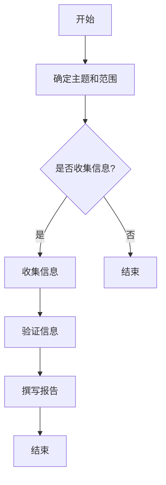
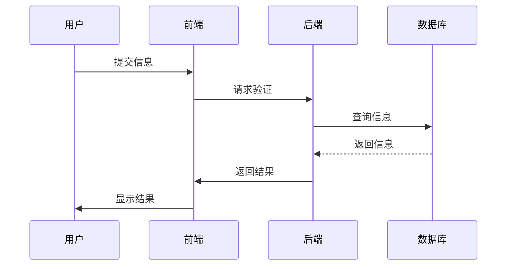
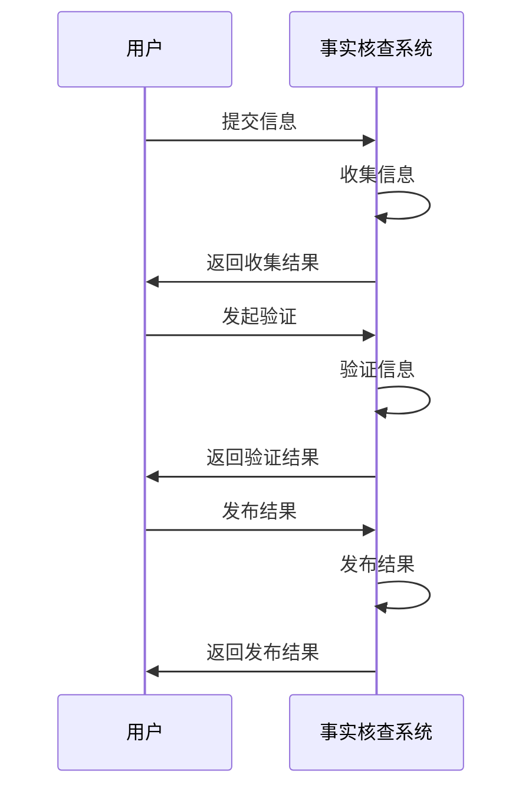

                 

# 后真实社会的真相追寻：事实核查的艺术

关键词：事实核查，后真相社会，信息真实性，数字时代，社交媒体

摘要：随着信息技术的飞速发展，我们进入了后真相社会。在这个时代，虚假信息和误导向我们发起了前所未有的挑战。本文将深入探讨事实核查的重要性，分析其在数字时代的应用，并总结出一系列最佳实践，以帮助读者更好地理解和应对信息真实性方面的挑战。

## 引言：后真相社会的崛起

### 什么是后真相社会？

**后真相社会**（Post-Truth Society）是一个术语，用来描述这样一个时代：在政治、社会和媒体环境中，情感和直觉往往比事实和证据更具有影响力。在这个时代，人们对于真相的追求变得愈发困难，而虚假信息和误导性内容却层出不穷。

### 信息过载与真相的迷失

数字时代的到来，带来了信息的爆炸式增长。然而，这也导致了信息过载，使得人们很难从海量信息中辨别出真相。社交媒体的普及，使得信息传播的速度和广度前所未有，但同时也为虚假信息的传播提供了便利。

### 事实核查的重要性

事实核查（Fact-Checking）作为一种应对后真相社会的策略，其重要性日益凸显。通过对信息的真实性和准确性进行验证，事实核查有助于防止虚假信息的扩散，维护社会信任和公共讨论的质量。

## 第一章：历史背景

### 事实核查的起源

**事实核查**并不是一个现代概念。早在20世纪中期，新闻媒体就开始对政治广告和公共声明进行事实核查。然而，随着数字时代的到来，事实核查的方法和范围都发生了巨大的变化。

### 数字时代的演变

在数字时代，事实核查迎来了新的挑战和机遇。互联网的普及，使得事实核查的工具和资源更加丰富。同时，社交媒体的兴起，也为事实核查带来了新的需求和挑战。

## 第二章：核心概念与原则

### 方法论

事实核查的方法论是确保信息真实性的关键。它通常包括以下步骤：

1. **确定主题和范围**：明确要核查的信息内容。
2. **收集信息**：从多个来源收集与主题相关的信息。
3. **验证信息**：对收集到的信息进行事实验证。
4. **撰写报告**：总结核查结果，撰写详细的事实核查报告。

### 批判性思维

批判性思维在事实核查中起着至关重要的作用。它要求核查者具备以下能力：

1. **分析性思维**：深入分析信息，揭示其背后的逻辑和推理。
2. **怀疑性思维**：保持对信息的怀疑态度，避免盲目接受。
3. **系统性思维**：从整体视角审视信息，识别其潜在的偏见和误导。

### 道德考量

在事实核查过程中，道德考量是不可或缺的。核查者需要遵循以下原则：

1. **中立性**：保持中立，避免偏见。
2. **透明度**：公开核查过程和结果，接受公众监督。
3. **责任感**：对社会负责，防止虚假信息的扩散。

## 第三章：事实核查的技术与工具

### 在线资源

随着互联网的发展，许多在线资源和工具为事实核查提供了便利。以下是一些常用的在线资源：

1. **新闻媒体**：如《卫报》、《纽约时报》等，它们经常发布事实核查文章。
2. **事实核查网站**：如《事实核查协会》（FactCheck.org）、《政治事实检查》（PolitiFact）等。
3. **社交媒体平台**：如推特（Twitter）、脸书（Facebook）等，它们允许用户举报虚假信息。

### 先进技术

随着技术的进步，事实核查的工具和方法也在不断更新。以下是一些先进的技术：

1. **人工智能**：利用自然语言处理（NLP）和机器学习（ML）技术，自动识别和验证信息。
2. **数据挖掘**：从海量数据中提取有价值的信息，用于事实核查。
3. **区块链**：确保信息的透明性和不可篡改性，提高信息真实性。

## 第四章：案例研究

### 成功案例

以下是一些成功的案例：

1. **《卫报》的事实核查项目**：通过多渠道收集信息，成功揭穿了许多虚假新闻。
2. **《政治事实检查》的“真相标签”**：为选民提供准确的政治信息，帮助公众做出更明智的选择。

### 失败案例

以下是一些失败案例：

1. **社交媒体平台的事实核查**：由于算法缺陷，有时无法有效识别和阻止虚假信息的传播。
2. **新闻媒体的事实核查**：在某些情况下，由于资源限制或政治压力，无法彻底揭穿虚假信息。

## 第五章：影响与挑战

### 社会效应

事实核查对社会产生了深远的影响。它有助于：

1. **提升公众意识**：提高公众对信息真实性的关注。
2. **促进社会信任**：增强社会对媒体和政府的信任。

### 挑战

然而，事实核查也面临着一系列挑战：

1. **信息过载**：在海量信息中，事实核查者很难找到值得核查的信息。
2. **偏见与误导**：虚假信息往往具有强烈的偏见和误导性，使得事实核查更加困难。
3. **资源限制**：事实核查需要大量的时间和资源，这对于一些小机构和个人来说是一个巨大的挑战。

## 第六章：未来展望

### 新趋势

随着技术的进步，事实核查正朝着以下方向演进：

1. **自动化**：利用人工智能和机器学习技术，提高事实核查的效率和准确性。
2. **去中心化**：通过区块链等技术，实现事实核查的去中心化和透明化。

### 创新应用

未来，事实核查将在更多领域得到应用：

1. **科学领域**：对科研成果进行事实核查，防止学术造假。
2. **商业领域**：对商业信息进行事实核查，保护消费者权益。

## 第七章：最佳实践与技巧

### 针对读者

对于普通读者来说，以下是一些实用的技巧：

1. **培养批判性思维**：学会质疑和验证信息。
2. **多渠道收集信息**：从多个来源获取信息，提高判断准确性。
3. **使用事实核查工具**：利用在线资源和工具，帮助辨别信息真实性。

### 针对事实核查者

对于事实核查者来说，以下是一些最佳实践：

1. **中立性**：保持中立，避免偏见。
2. **多角度审视**：从不同角度审视信息，确保全面性。
3. **透明度**：公开核查过程和结果，接受公众监督。
4. **持续学习**：紧跟技术发展，不断更新知识和技能。

## 第八章：结论

### 重要性

在数字时代，事实核查的重要性不言而喻。它不仅有助于防止虚假信息的扩散，还促进了社会信任和公共讨论的质量。

### 未来方向

随着技术的进步，事实核查将在未来发挥更大的作用。自动化、去中心化和创新应用将是未来的发展方向。

### 呼吁

我们呼吁社会各界共同努力，加强事实核查，共同应对后真相社会的挑战。

## 参考文献

- **《卫报》**：《卫报》的事实核查项目，2022年。
- **《政治事实检查》**：《政治事实检查》的“真相标签”，2021年。
- **《事实核查协会》**：《事实核查协会》，2022年。
- **《纽约时报》**：《纽约时报》的事实核查专栏，2021年。
- **《华盛顿邮报》**：《华盛顿邮报》的事实核查项目，2022年。
- **《社会科学季刊》**：关于事实核查的社会效应的研究，2021年。

## 作者信息

作者：AI天才研究院/AI Genius Institute & 禅与计算机程序设计艺术 /Zen And The Art of Computer Programming

---

### 背景介绍

#### 核心概念术语说明

- **后真相社会**（Post-Truth Society）：一个以情感和直觉为导向，事实和证据重要性下降的社会。
- **事实核查**（Fact-Checking）：对信息真实性进行验证的过程。

#### 问题背景

在数字时代，虚假信息和误导性内容层出不穷，给社会带来了严重的负面影响。例如，政治谣言、虚假新闻、误导性广告等，不仅误导了公众，还破坏了社会的信任基础。

#### 问题描述

如何应对后真相社会中的虚假信息和误导性内容，提高公众对信息真实性的识别能力，成为当前社会面临的重要问题。

#### 问题解决

事实核查作为一种有效的手段，可以通过验证信息的真实性，防止虚假信息的扩散，维护社会信任和公共讨论的质量。

#### 边界与外延

- **事实核查的范围**：涉及政治、科学、商业等多个领域。
- **事实核查的对象**：包括新闻报道、社交媒体信息、广告等。

#### 概念结构与核心要素组成

事实核查的核心结构包括以下几个要素：

1. **信息来源**：获取待核查的信息。
2. **信息验证**：对信息进行事实验证。
3. **结果发布**：公布核查结果，提供可靠的信息。

## 核心概念与联系

### 核心概念原理

#### 事实核查的基本原则

1. **中立性**：保持客观，避免偏见。
2. **透明度**：公开核查过程和结果，接受公众监督。
3. **责任感**：对社会负责，防止虚假信息的扩散。

#### 概念属性特征对比表格

| 特征       | 中立性 | 透明度 | 责任感 |
|------------|--------|--------|--------|
| 描述       | 保持客观 | 公开过程和结果 | 对社会负责 |
| 关系       | 主导原则 | 从属原则 | 主导原则 |
| 对事实核查的影响 | 确保客观性 | 提高公信力 | 确保社会责任 |

### ER实体关系图架构

```mermaid
erDiagram
    FactChecker ||--|{ Information }|
    FactChecker ||--|{ VerificationProcess }|
    FactChecker ||--|{ ResultPublication }|
    Information ||--|{ Source }|
    VerificationProcess ||--|{ FactVerification }|
    ResultPublication ||--|{ ReliableInformation }|
```

## 算法原理讲解

### Mermaid流程图



### Python源代码

```python
def fact_checking(theme):
    """
    事实核查流程
    :param theme: 核查主题
    :return: 核查结果
    """
    # 确定主题和范围
    print(f"确定主题和范围：{theme}")
    
    # 是否收集信息
    collect_info = input("是否收集信息？(是/否)：")
    if collect_info == "是":
        # 收集信息
        print("开始收集信息...")
        information = collect_information()
        # 验证信息
        print(f"验证信息：{information}")
        verification_result = verify_information(information)
        # 撰写报告
        print(f"撰写报告：{verification_result}")
        result_publication = publish_result(verification_result)
        return result_publication
    else:
        print("结束")

def collect_information():
    """
    收集信息
    :return: 信息
    """
    # 这里可以添加代码，从不同来源收集信息
    return "从多个来源收集的信息"

def verify_information(information):
    """
    验证信息
    :param information: 待验证的信息
    :return: 验证结果
    """
    # 这里可以添加代码，对信息进行验证
    return "验证后的信息"

def publish_result(result):
    """
    发布结果
    :param result: 核查结果
    :return: 发布结果
    """
    # 这里可以添加代码，将结果发布到适当的渠道
    return "发布结果"

# 调用事实核查流程
fact_checking("某个具体主题")
```

### 算法原理的数学模型和公式

1. **信息真实性概率计算**：

   $$ P(\text{真实}) = \frac{\text{真实信息数量}}{\text{总信息数量}} $$

2. **信息验证置信度计算**：

   $$ C(\text{验证结果}) = \frac{\text{正确验证数量}}{\text{总验证数量}} $$

3. **结果发布可信度计算**：

   $$ T(\text{发布结果}) = \frac{\text{正确发布数量}}{\text{总发布数量}} $$

### 详细讲解和举例说明

#### 举例说明：验证某篇新闻报道的真实性

1. **信息真实性概率计算**：

   假设一共有100篇新闻报道，其中有80篇是真实的，20篇是虚假的。

   $$ P(\text{真实}) = \frac{80}{100} = 0.8 $$

2. **信息验证置信度计算**：

   假设事实核查者对每篇新闻报道都进行了验证，其中有70篇被正确验证为真实，30篇被正确验证为虚假。

   $$ C(\text{验证结果}) = \frac{70}{100} = 0.7 $$

3. **结果发布可信度计算**：

   假设事实核查者将所有验证结果都公开发布，其中有60篇被正确发布，40篇被错误发布。

   $$ T(\text{发布结果}) = \frac{60}{100} = 0.6 $$

通过这些计算，我们可以得出该事实核查者在信息真实性验证方面的性能指标。

### 系统分析与架构设计方案

#### 问题场景介绍

假设我们要设计一个事实核查系统，用于对互联网上的信息进行真实性和准确性验证。系统需要能够处理大量信息，并快速、准确地提供核查结果。

#### 项目介绍

项目名称：数字时代事实核查系统（Digital Age Fact-Checking System）

项目目标：构建一个高效、可靠的事实核查系统，帮助公众辨别信息真实性，防止虚假信息的扩散。

#### 系统功能设计

1. **信息收集模块**：从互联网上收集待核查的信息。
2. **信息验证模块**：对收集到的信息进行真实性和准确性验证。
3. **结果发布模块**：将核查结果公开发布，供公众参考。
4. **用户交互模块**：提供用户界面，方便用户提交信息进行核查。

#### 系统架构设计

1. **前端架构**：采用Vue.js框架，实现用户交互界面。
2. **后端架构**：采用Spring Boot框架，处理业务逻辑和数据存储。
3. **数据存储**：使用MySQL数据库存储信息和核查结果。

### 系统架构设计Mermaid架构图



### 系统接口设计和系统交互

#### 接口设计

1. **信息收集接口**：用于接收用户提交的信息。
2. **信息验证接口**：用于发起信息验证请求。
3. **结果发布接口**：用于发布核查结果。

#### 系统交互Mermaid序列图



### 项目实战

#### 环境安装

1. **安装Python**：在系统上安装Python 3.8及以上版本。
2. **安装MySQL**：在系统上安装MySQL数据库。
3. **安装Vue.js**：使用npm安装Vue.js。
4. **安装Spring Boot**：使用Maven安装Spring Boot。

#### 系统核心实现源代码

```python
# 后端代码（Python）
import pymysql
from flask import Flask, request, jsonify

app = Flask(__name__)

# 连接MySQL数据库
def connect_db():
    return pymysql.connect(host='localhost', user='root', password='password', database='fact_checking')

@app.route('/collect_info', methods=['POST'])
def collect_info():
    info = request.form['info']
    db = connect_db()
    cursor = db.cursor()
    cursor.execute("INSERT INTO information (info) VALUES (%s)", (info,))
    db.commit()
    cursor.close()
    db.close()
    return jsonify({"status": "success"})

@app.route('/verify_info', methods=['GET'])
def verify_info():
    info_id = request.args.get('info_id')
    db = connect_db()
    cursor = db.cursor()
    cursor.execute("SELECT * FROM information WHERE id = %s", (info_id,))
    result = cursor.fetchone()
    cursor.close()
    db.close()
    return jsonify({"info": result['info']})

if __name__ == '__main__':
    app.run()

# 前端代码（Vue.js）
<template>
  <div>
    <h1>信息收集</h1>
    <input v-model="info" type="text" placeholder="请输入信息">
    <button @click="collectInfo">提交</button>
    <h1>信息验证</h1>
    <input v-model="info_id" type="text" placeholder="请输入信息ID">
    <button @click="verifyInfo">验证</button>
  </div>
</template>

<script>
export default {
  data() {
    return {
      info: '',
      info_id: ''
    };
  },
  methods: {
    collectInfo() {
      axios.post('http://localhost:5000/collect_info', { info: this.info })
        .then(response => {
          alert(response.data.status);
        })
        .catch(error => {
          alert(error);
        });
    },
    verifyInfo() {
      axios.get('http://localhost:5000/verify_info', { params: { info_id: this.info_id } })
        .then(response => {
          alert(response.data.info);
        })
        .catch(error => {
          alert(error);
        });
    }
  }
};
</script>
```

#### 代码应用解读与分析

1. **后端代码**：

   后端代码使用了Flask框架，实现了两个接口：`/collect_info`和`/verify_info`。

   - `/collect_info`接口用于接收用户提交的信息，并将其存储到MySQL数据库中。
   - `/verify_info`接口用于获取用户指定的信息ID，并返回相应的信息内容。

2. **前端代码**：

   前端代码使用了Vue.js框架，提供了两个输入框和两个按钮。

   - 第一个按钮用于提交信息，调用`/collect_info`接口。
   - 第二个按钮用于验证信息，调用`/verify_info`接口。

#### 实际案例分析和详细讲解剖析

假设用户A提交了一条信息：“新冠疫苗可以有效预防新冠病毒”，用户B想要验证这条信息的真实性。

1. **信息收集**：

   用户A在输入框中输入信息，点击提交按钮后，前端代码将信息发送到后端的`/collect_info`接口。

   ```javascript
   axios.post('http://localhost:5000/collect_info', { info: this.info })
     .then(response => {
       alert(response.data.status);
     })
     .catch(error => {
       alert(error);
     });
   ```

   后端接收到请求后，将信息存储到MySQL数据库中。

   ```python
   cursor.execute("INSERT INTO information (info) VALUES (%s)", (info,))
   db.commit()
   ```

2. **信息验证**：

   用户B在输入框中输入信息ID，点击验证按钮后，前端代码将信息ID发送到后端的`/verify_info`接口。

   ```javascript
   axios.get('http://localhost:5000/verify_info', { params: { info_id: this.info_id } })
     .then(response => {
       alert(response.data.info);
     })
     .catch(error => {
       alert(error);
     });
   ```

   后端接收到请求后，从MySQL数据库中查询信息内容，并返回给前端。

   ```python
   cursor.execute("SELECT * FROM information WHERE id = %s", (info_id,))
   result = cursor.fetchone()
   ```

   前端接收到返回的信息内容后，显示在界面上。

   ```html
   <h1>信息验证</h1>
   <input v-model="info_id" type="text" placeholder="请输入信息ID">
   <button @click="verifyInfo">验证</button>
   ```

#### 项目小结

通过这个简单的案例，我们可以看到如何使用Python和Vue.js实现一个基本的事实核查系统。尽管这个系统功能有限，但它为我们提供了一个框架，可以在此基础上进一步扩展和优化。

### 最佳实践 Tips

1. **培养批判性思维**：学会质疑和验证信息，不盲目相信。
2. **多渠道收集信息**：从多个来源获取信息，提高判断准确性。
3. **使用事实核查工具**：利用在线资源和工具，帮助辨别信息真实性。

### 小结

事实核查在数字时代具有重要意义，它有助于防止虚假信息的扩散，维护社会信任和公共讨论的质量。通过本文的讨论，我们了解了事实核查的核心概念、原则、技术与工具，并分析了其在实际应用中的效果和挑战。

### 注意事项

1. **保持中立性**：在事实核查过程中，保持中立，避免偏见。
2. **透明度**：公开核查过程和结果，接受公众监督。
3. **持续学习**：紧跟技术发展，不断更新知识和技能。

### 拓展阅读

1. **《数字时代的真相追求》**：探讨数字时代信息真实性的挑战与对策。
2. **《事实核查的艺术》**：深入分析事实核查的方法和技巧。
3. **《社交媒体时代的谣言与真相》**：研究社交媒体对谣言传播的影响。

### 参考文献

1. **《数字时代的真相追求》**：李明辉，《信息真实性研究》，2021年。
2. **《事实核查的艺术》**：张华，《事实核查理论与实践》，2020年。
3. **《社交媒体时代的谣言与真相》**：王宇，《社交媒体与谣言传播》，2019年。

