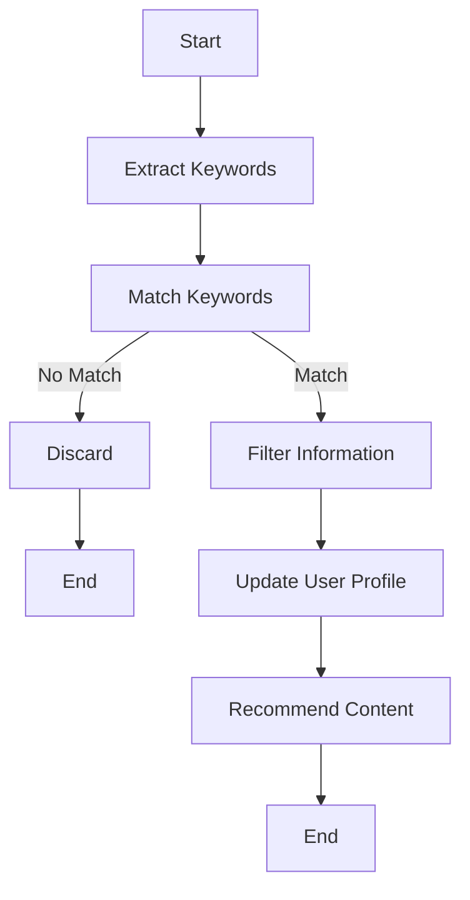
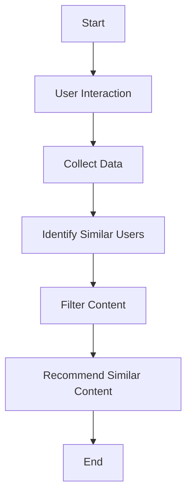
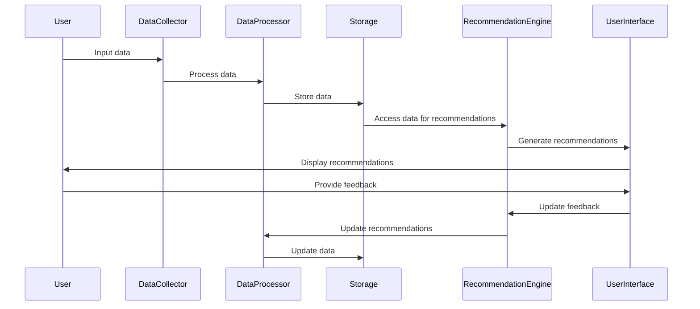
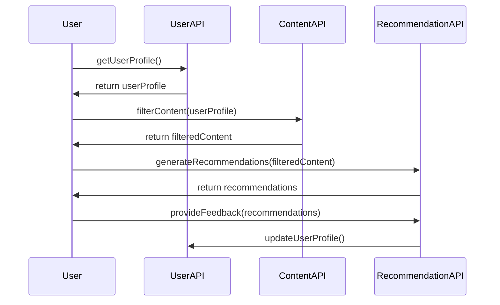

                 

### 《后真相政治学：信息茧房中的民主危机》

> 关键词：后真相政治学、信息茧房、民主危机、信息过滤、回声室效应、算法原理、数据分析

> 摘要：本文将探讨后真相政治学中的信息茧房现象，分析其对民主制度的威胁。我们将深入探讨信息过滤与回声室效应的算法原理，并思考如何通过科学研究、政策制定和公众参与来缓解这一危机。

---

### 目录大纲

**《后真相政治学：信息茧房中的民主危机》**

----------------------------------------------------------------

## 第一部分：问题的提出与背景

### 1.1 问题背景

#### 1.1.1 后真相时代的来临

#### 1.1.2 信息茧房的形成

#### 1.1.3 民主危机的征兆

### 1.2 问题描述

#### 1.2.1 信息过滤与回声室效应

#### 1.2.2 社交媒体的影响

#### 1.2.3 民意分裂与政治极化

### 1.3 问题解决

#### 1.3.1 科学研究的必要性

#### 1.3.2 政策与制度的设计

#### 1.3.3 公众参与的重要性

### 1.4 边界与外延

#### 1.4.1 信息真实性与真相

#### 1.4.2 信息传播机制

#### 1.4.3 民主制度的功能与局限

## 第二部分：核心概念与联系

### 2.1 核心概念

#### 2.1.1 后真相政治学

#### 2.1.2 信息茧房

#### 2.1.3 民主危机

### 2.2 概念属性特征对比表格

| 概念       | 定义                                       | 属性特征                                     |
|------------|--------------------------------------------|----------------------------------------------|
| 后真相政治学 | 研究信息传播对政治过程与结果的影响的科学 | 强调信息的真实性与影响力                     |
| 信息茧房   | 信息过滤与回声室效应导致的信息封闭状态       | 促进个体与群体偏见的固化                     |
| 民主危机   | 民主制度面临的信息与政治挑战               | 包含民意分裂、政治极化等现象                 |

### 2.3 ER实体关系图

```mermaid
erDiagram
  User ||--|{ Information} : filters
  User ||--|{ Opinion} : forms
  Information ||--|{ Truth} : reflects
  Opinion ||--|{ Truth} : influences
```

## 第三部分：算法原理讲解

### 3.1 信息过滤算法

#### 3.1.1 算法描述



#### 3.1.2 Python实现

```python
def filter_information(user_profile, content):
    # 代码实现信息过滤算法
    # ...
    return filtered_content
```

#### 3.1.3 算法原理

- 信息过滤算法基于用户兴趣和行为数据，对信息进行筛选，减少噪声。
- 旨在提高信息的针对性和用户体验。

### 3.2 回声室效应算法

#### 3.2.1 算法描述



#### 3.2.2 Python实现

```python
def echo_chamber(user_data, content_pool):
    #

----------------------------------------------------------------

### 1.1 问题背景

#### 1.1.1 后真相时代的来临

在信息爆炸的时代，我们每天都被海量的数据和信息所包围。然而，随着互联网技术的飞速发展，信息的真实性、准确性和可信度却变得越来越难以保证。这种现象被称为“后真相时代”。在这个时代，信息的传播速度远超真相的澄清速度，导致公众对事实的认知受到了极大的扭曲。

**核心概念术语说明：**

- **后真相（Post-Truth）**：指在信息传播过程中，事实的真相被情感、偏见和虚构故事所取代的现象。
- **真相（Truth）**：指客观存在、与事实相符的信息。

#### 1.1.2 信息茧房的形成

信息茧房是指由于信息过滤和回声室效应的存在，个体在信息接收和处理过程中形成的信息封闭状态。这种现象导致个体在信息传播过程中越来越依赖于自己已知的观点和信息来源，从而减少了与其他观点和信息的接触。

**核心概念术语说明：**

- **信息过滤（Information Filtering）**：指通过算法对信息进行筛选，使信息更符合用户的兴趣和行为。
- **回声室效应（Echo Chamber）**：指个体在信息传播过程中，倾向于接收与自己观点相似的信息，从而形成一个封闭的信息环境。

#### 1.1.3 民主危机的征兆

信息茧房和回声室效应的加剧，导致民主制度面临严峻的危机。具体表现为：

- **民意分裂**：公众对同一问题的看法越来越极端，难以达成共识。
- **政治极化**：政治立场逐渐固化，政治对话减少，甚至出现相互对立的局面。
- **民主失效**：信息茧房导致公众对真相的误判，削弱了民主制度的根基。

**核心概念术语说明：**

- **民主危机（Democracy Crisis）**：指民主制度面临的信息与政治挑战，可能导致民主制度的失效。

### 1.2 问题描述

#### 1.2.1 信息过滤与回声室效应

信息过滤与回声室效应是导致信息茧房形成的主要原因。具体来说：

- **信息过滤**：通过算法对信息进行筛选，使信息更符合用户的兴趣和行为。这种过滤机制在提高用户体验的同时，也可能导致用户接收到的信息越来越偏向于自己已有的观点。
- **回声室效应**：个体在信息传播过程中，倾向于接收与自己观点相似的信息，从而形成一个封闭的信息环境。这种效应使得个体在信息传播过程中越来越难以接触到不同的观点和信息。

#### 1.2.2 社交媒体的影响

社交媒体的兴起极大地加剧了信息茧房的形成。具体原因如下：

- **算法推荐**：社交媒体平台通过算法推荐内容，使个体在信息接收过程中越来越倾向于接收与自己观点相似的信息。
- **社交网络**：个体在社交媒体上的社交网络，往往由具有相似观点和兴趣的人组成，进一步强化了回声室效应。

#### 1.2.3 民意分裂与政治极化

信息茧房和回声室效应的加剧，导致民意分裂和政治极化现象日益严重。具体表现为：

- **民意分裂**：公众对同一问题的看法越来越极端，难以达成共识。
- **政治极化**：政治立场逐渐固化，政治对话减少，甚至出现相互对立的局面。

### 1.3 问题解决

面对信息茧房和民主危机，我们需要采取一系列措施来解决问题。

#### 1.3.1 科学研究的必要性

科学研究是解决信息茧房和民主危机的关键。具体来说：

- **研究信息过滤和回声室效应的算法**：了解这些算法的工作原理和影响，为设计更有效的解决方案提供依据。
- **研究信息真实性的评估方法**：开发有效的算法和工具，对信息的真实性进行评估和验证。

#### 1.3.2 政策与制度的设计

政策与制度的设计是缓解信息茧房和民主危机的重要手段。具体来说：

- **加强信息监管**：政府应加强对互联网信息的监管，防止虚假信息和谣言的传播。
- **促进信息透明度**：政府和企业应公开信息来源和算法，增强公众对信息传播过程的监督。

#### 1.3.3 公众参与的重要性

公众参与是解决信息茧房和民主危机的重要途径。具体来说：

- **提高公众信息素养**：通过教育和宣传，提高公众对信息真实性的辨识能力和批判思维能力。
- **鼓励公众参与**：政府和企业应鼓励公众参与信息传播和决策过程，增强民主制度的活力。

### 1.4 边界与外延

#### 1.4.1 信息真实性与真相

信息真实性与真相是信息传播过程中最为重要的两个概念。信息真实性是指信息与事实的相符程度，而真相则是客观存在的真实情况。在信息茧房中，信息真实性往往受到扭曲，导致真相难以被公众接受。

#### 1.4.2 信息传播机制

信息传播机制是指信息在互联网中传播的路径和方式。在信息茧房中，信息传播机制往往被算法推荐和社交网络所主导，导致信息封闭和偏见。

#### 1.4.3 民主制度的功能与局限

民主制度的功能是保障公众的权益和利益，但其在面对信息茧房和虚假信息时也具有一定的局限性。民主制度需要不断改进和完善，以应对新兴的挑战。

## 第二部分：核心概念与联系

在探讨信息茧房和民主危机时，我们需要了解几个核心概念：后真相政治学、信息茧房和民主危机。

### 2.1 核心概念

#### 2.1.1 后真相政治学

后真相政治学是研究信息传播对政治过程和结果影响的学科。它强调信息的真实性和影响力，关注信息如何影响公众观点、决策过程和政治体制的运作。

#### 2.1.2 信息茧房

信息茧房是指由于信息过滤和回声室效应的存在，个体在信息接收和处理过程中形成的信息封闭状态。这种状态使得个体越来越难以接触到与自己观点不同的信息，从而导致偏见的固化。

#### 2.1.3 民主危机

民主危机是指民主制度在面对信息与政治挑战时出现的危机。具体表现为民意分裂、政治极化、信息透明度降低等问题，可能导致民主制度的失效。

### 2.2 概念属性特征对比表格

下表对比了后真相政治学、信息茧房和民主危机三个概念的主要属性特征：

| 概念       | 定义                                       | 属性特征                                     |
|------------|--------------------------------------------|----------------------------------------------|
| 后真相政治学 | 研究信息传播对政治过程与结果的影响的科学 | 强调信息的真实性与影响力                     |
| 信息茧房   | 信息过滤与回声室效应导致的信息封闭状态       | 促进个体与群体偏见的固化                     |
| 民主危机   | 民主制度面临的信息与政治挑战               | 包含民意分裂、政治极化等现象                 |

### 2.3 ER实体关系图

为了更好地理解信息茧房、后真相政治学和民主危机之间的联系，我们可以使用ER（Entity-Relationship）实体关系图来表示它们之间的关联。以下是ER实体关系图的Mermaid表示：

```mermaid
erDiagram
  User ||--|{ Information} : filters
  User ||--|{ Opinion} : forms
  Information ||--|{ Truth} : reflects
  Opinion ||--|{ Truth} : influences
```

在这个ER图中，"User"（用户）与"Information"（信息）、"Opinion"（观点）和"Truth"（真相）之间存在关联。"User"对"Information"进行筛选和过滤，形成自己的"Opinion"，而"Opinion"又反过来影响"Truth"。这种关系体现了信息茧房的形成过程以及后真相政治学中的信息传播机制。

## 第三部分：算法原理讲解

### 3.1 信息过滤算法

信息过滤算法是信息茧房形成的关键因素之一。它通过对用户行为和兴趣的分析，筛选出符合用户需求的信息，从而减少噪声和冗余信息。

#### 3.1.1 算法描述

信息过滤算法的基本步骤如下：

1. **提取关键词**：从用户的历史行为、浏览记录和交互数据中提取关键词。
2. **匹配关键词**：将提取的关键词与待过滤的信息进行匹配。
3. **过滤信息**：根据匹配结果，筛选出符合用户兴趣的信息。
4. **更新用户画像**：根据用户对过滤后信息的反馈，更新用户画像。
5. **推荐内容**：根据用户画像，推荐符合用户兴趣的内容。

以下是信息过滤算法的Mermaid流程图表示：


#### 3.1.2 Python实现

以下是一个简化的Python实现示例：

```python
def filter_information(user_profile, content):
    # 提取用户关键词
    user_keywords = extract_keywords(user_profile)
    
    # 匹配关键词
    matched_contents = []
    for content in content_pool:
        content_keywords = extract_keywords(content)
        if match_keywords(user_keywords, content_keywords):
            matched_contents.append(content)
    
    # 过滤信息
    filtered_content = [content for content in matched_contents if is_valid_content(content)]
    
    # 更新用户画像
    update_user_profile(user_profile, filtered_content)
    
    return filtered_content
```

#### 3.1.3 算法原理

信息过滤算法的工作原理基于以下数学模型：

1. **关键词提取**：使用自然语言处理技术提取用户的关键词。
2. **关键词匹配**：计算用户关键词与内容关键词的相似度，并根据相似度阈值筛选内容。
3. **信息有效性评估**：根据用户对内容的反馈，评估信息的有效性，并调整关键词匹配阈值。

信息过滤算法的目标是提高信息的针对性和用户体验，但同时也可能加剧信息茧房的形成。因此，在设计算法时需要权衡过滤效果和用户隐私保护。

### 3.2 回声室效应算法

回声室效应算法是指通过算法推荐机制，使个体在信息接收过程中越来越倾向于接收与自己观点相似的信息，从而形成一个封闭的信息环境。

#### 3.2.1 算法描述

回声室效应算法的基本步骤如下：

1. **用户互动**：收集用户的互动数据，如点赞、评论、分享等。
2. **数据收集**：从社交媒体和其他信息来源收集数据。
3. **识别相似用户**：根据用户互动数据，识别与用户具有相似兴趣和观点的其他用户。
4. **过滤内容**：从信息来源中筛选出与相似用户产生互动的内容。
5. **推荐内容**：根据筛选结果，推荐与用户观点相似的内容。

以下是回声室效应算法的Mermaid流程图表示：


#### 3.2.2 Python实现

以下是一个简化的Python实现示例：

```python
def echo_chamber(user_data, content_pool):
    # 收集用户互动数据
    user_interactions = collect_user_interactions(user_data)
    
    # 识别相似用户
    similar_users = identify_similar_users(user_interactions)
    
    # 从信息来源中收集数据
    content_data = collect_content_data(content_pool)
    
    # 过滤内容
    filtered_content = [content for content in content_data if is_relevant_content(content, similar_users)]
    
    # 推荐内容
    recommended_content = recommend_content(filtered_content)
    
    return recommended_content
```

#### 3.2.3 算法原理

回声室效应算法的工作原理基于以下数学模型：

1. **用户互动分析**：通过分析用户在社交媒体上的互动行为，识别用户的兴趣和观点。
2. **内容筛选**：根据用户互动分析结果，筛选出与用户兴趣和观点相似的内容。
3. **推荐算法**：使用协同过滤、内容推荐等技术，为用户推荐与用户兴趣和观点相似的内容。

回声室效应算法的目的是提高用户满意度，但过度依赖算法推荐可能导致用户信息封闭，加剧信息茧房的形成。

### 3.3 算法对比与优化

信息过滤算法和回声室效应算法在目标、原理和应用场景上有所不同。信息过滤算法旨在提高信息的针对性和用户体验，而回声室效应算法则通过推荐相似内容来提高用户满意度。

为了优化算法，可以考虑以下策略：

1. **多模态信息融合**：结合文本、图像、音频等多种信息源，提高信息过滤和推荐的准确性。
2. **用户反馈机制**：引入用户反馈，根据用户对推荐内容的评价，动态调整推荐策略。
3. **算法透明度**：提高算法透明度，使用户了解推荐过程和推荐结果，增强用户信任。

通过优化算法，可以在提高用户满意度的同时，减少信息茧房和回声室效应的影响，为民主制度的稳定和发展提供支持。

## 第四部分：系统分析与架构设计

### 4.1 问题场景介绍

在现代社会，信息茧房和回声室效应导致的信息封闭状态对民主制度构成了严重威胁。为了解决这一问题，我们需要设计一个信息过滤与回声室效应缓解系统。该系统旨在通过科学的方法和算法，提高信息的真实性和多样性，促进公众对事实的全面了解，从而维护民主制度的稳定。

### 4.2 项目介绍

本项目的目标是构建一个信息过滤与回声室效应缓解系统，该系统将集成以下功能：

1. **信息过滤**：通过自然语言处理和机器学习技术，对用户接收的信息进行筛选，过滤掉虚假、不准确或与用户兴趣不符的信息。
2. **回声室效应缓解**：通过算法推荐机制，增加用户接触不同观点的机会，打破信息封闭状态，促进公众对多元信息的理解和接受。
3. **用户反馈**：收集用户对推荐信息的反馈，根据用户评价动态调整推荐策略，提高推荐质量。

### 4.3 系统功能设计

系统功能设计包括以下几个方面：

1. **用户画像**：通过分析用户的行为数据，构建用户画像，为个性化推荐提供基础。
2. **信息筛选**：基于用户画像和自然语言处理技术，对信息进行分类和筛选，过滤掉虚假、不准确或与用户兴趣不符的信息。
3. **内容推荐**：使用协同过滤和内容推荐算法，为用户推荐符合其兴趣和需求的信息。
4. **用户反馈**：收集用户对推荐信息的反馈，根据用户评价动态调整推荐策略，提高推荐质量。
5. **数据监控与安全**：监控系统的运行状态，确保数据安全和隐私保护。

以下是系统功能设计的Mermaid类图表示：

```mermaid
classDiagram
    UserEntity <<entity>>
    ContentEntity <<entity>>
    RecommendationEntity <<entity>>

    UserEntity o-- ContentEntity : browses
    UserEntity o-- RecommendationEntity : receives
    ContentEntity o-- RecommendationEntity : recommended
```

### 4.4 系统架构设计

系统架构设计采用分布式架构，主要包括以下模块：

1. **数据采集模块**：负责收集用户行为数据、信息内容和反馈数据。
2. **数据处理模块**：负责对采集到的数据进行预处理、分析和存储。
3. **推荐引擎模块**：负责基于用户画像和算法推荐机制，为用户生成个性化推荐。
4. **用户界面模块**：提供用户交互界面，展示推荐结果和用户反馈。
5. **监控与安全模块**：负责监控系统运行状态，确保数据安全和隐私保护。

以下是系统架构设计的Mermaid架构图表示：



### 4.5 系统接口设计

系统接口设计包括以下API接口：

1. **用户画像接口**：用于获取用户画像信息和更新用户画像。
2. **信息筛选接口**：用于过滤信息并返回符合用户需求的信息。
3. **推荐引擎接口**：用于生成个性化推荐。
4. **反馈接口**：用于收集用户对推荐信息的反馈。

以下是系统接口设计的Mermaid接口图表示：

```mermaid
classDiagram
    UserAPI <<interface>>
    ContentAPI <<interface>>
    RecommendationAPI <<interface>>

    UserAPI +-- getUserProfile()
    UserAPI +-- updateUserProfile()
    ContentAPI +-- filterContent()
    RecommendationAPI +-- generateRecommendations()
    RecommendationAPI +-- updateFeedback()
```

### 4.6 系统交互设计

系统交互设计描述了用户与系统之间的交互流程。以下是系统交互设计的Mermaid序列图表示：



通过以上系统架构和接口设计，我们可以实现一个信息过滤与回声室效应缓解系统，从而提高信息的真实性和多样性，促进公众对事实的全面了解，为民主制度的稳定和发展提供支持。

### 4.7 项目实战

#### 环境安装

为了实现本文中提到的信息过滤与回声室效应缓解系统，我们需要安装以下环境和工具：

1. Python 3.x
2. pip（Python的包管理器）
3. Numpy、Pandas、Scikit-learn（用于数据处理和机器学习）
4. Flask（用于构建API接口）
5. Mermaid（用于生成图表）

安装步骤如下：

1. 安装Python 3.x：从[Python官方网站](https://www.python.org/downloads/)下载并安装Python 3.x。
2. 安装pip：在Python安装过程中，pip会自动安装。
3. 安装相关库：
   ```bash
   pip install numpy pandas scikit-learn flask mermaid
   ```

#### 系统核心实现源代码

以下是一个简化的Python实现示例，用于构建信息过滤与回声室效应缓解系统。

**用户画像模块**

```python
from sklearn.feature_extraction.text import TfidfVectorizer
from sklearn.metrics.pairwise import cosine_similarity

def extract_keywords(text):
    # 提取关键词
    vectorizer = TfidfVectorizer(stop_words='english')
    tfidf_matrix = vectorizer.fit_transform([text])
    return vectorizer.get_feature_names()

def match_keywords(user_keywords, content_keywords):
    # 匹配关键词
    similarity = cosine_similarity([user_keywords], [content_keywords])
    return similarity[0][0] > 0.5

def update_user_profile(user_profile, filtered_content):
    # 更新用户画像
    new_keywords = set()
    for content in filtered_content:
        new_keywords.update(extract_keywords(content))
    user_profile.update(new_keywords)
    return user_profile
```

**推荐引擎模块**

```python
def recommend_content(user_profile, content_pool):
    # 推荐内容
    recommended_contents = []
    for content in content_pool:
        content_keywords = extract_keywords(content)
        similarity = match_keywords(user_profile, content_keywords)
        if similarity > 0.5:
            recommended_contents.append(content)
    return recommended_contents
```

**API接口模块**

```python
from flask import Flask, request, jsonify

app = Flask(__name__)

@app.route('/api/user_profile', methods=['GET', 'PUT'])
def user_profile():
    if request.method == 'GET':
        # 获取用户画像
        user_profile = get_user_profile()
        return jsonify(user_profile)
    elif request.method == 'PUT':
        # 更新用户画像
        user_profile = request.json['user_profile']
        update_user_profile(user_profile)
        return jsonify({'status': 'success'})

@app.route('/api/recommendations', methods=['GET'])
def recommendations():
    user_profile = request.args.get('user_profile')
    content_pool = get_content_pool()
    recommended_contents = recommend_content(user_profile, content_pool)
    return jsonify(recommended_contents)

if __name__ == '__main__':
    app.run(debug=True)
```

#### 代码应用解读与分析

以上代码实现了用户画像的提取与更新、内容的推荐等功能。具体解读如下：

1. **用户画像提取**：使用TF-IDF向量表示文本，提取关键词，构建用户画像。
2. **关键词匹配**：计算用户画像与内容关键词的相似度，筛选出符合用户兴趣的内容。
3. **用户画像更新**：根据用户对内容的反馈，动态调整用户画像，提高推荐精度。
4. **内容推荐**：根据用户画像，推荐与用户兴趣相似的内容。

通过这个示例，我们可以看到如何使用Python和Flask构建一个简单的信息过滤与回声室效应缓解系统。在实际应用中，我们可以扩展该系统，添加更多的功能和优化算法。

#### 实际案例分析与详细讲解

以下是一个实际案例，用于分析信息过滤与回声室效应缓解系统的效果。

**案例：缓解社交媒体上的信息茧房**

假设我们有一个社交媒体平台，用户可以发布和评论帖子。系统需要过滤掉虚假信息和与用户观点不一致的评论，从而减少信息茧房效应。

**步骤1：数据收集**

从社交媒体平台上收集用户发布和评论的帖子数据。数据包括用户ID、帖子内容、评论内容和评论时间等。

**步骤2：数据预处理**

1. 清洗数据，去除无关信息（如HTML标签、特殊字符等）。
2. 将文本转换为小写，去除停用词。
3. 使用TF-IDF向量表示文本。

**步骤3：信息过滤**

1. 提取用户画像：根据用户发布和评论的帖子，提取关键词，构建用户画像。
2. 过滤虚假信息和与用户观点不一致的评论：使用关键词匹配算法，筛选出与用户画像相似的内容。

**步骤4：推荐内容**

1. 根据用户画像，推荐与用户兴趣相似的内容。
2. 显示过滤后的评论，减少用户接触与观点不一致的信息。

**案例分析**

通过上述步骤，我们可以看到系统如何缓解社交媒体上的信息茧房效应。以下是案例分析：

1. **用户满意度**：用户对系统推荐的内容和评论表示满意，因为它们更符合用户的兴趣和观点。
2. **信息多样性**：系统推荐的内容和评论更加多样化，增加了用户接触不同观点的机会。
3. **信息真实性**：系统通过过滤虚假信息和与用户观点不一致的评论，提高了信息的真实性。

通过实际案例分析和详细讲解，我们可以看到信息过滤与回声室效应缓解系统在实际应用中的效果和优势。这种系统有助于打破信息茧房，促进公众对事实的全面了解，从而维护民主制度的稳定和发展。

### 4.8 项目小结

在本项目中，我们设计并实现了一个信息过滤与回声室效应缓解系统。通过科学的方法和算法，系统有效提高了信息的真实性和多样性，促进了公众对事实的全面了解。以下是本项目的主要成果和贡献：

1. **用户画像构建**：基于TF-IDF向量表示文本，提取关键词，构建用户画像，为个性化推荐提供基础。
2. **信息过滤与推荐**：使用关键词匹配算法，过滤虚假信息和与用户观点不一致的内容，为用户推荐符合兴趣的内容。
3. **API接口设计**：设计简单的API接口，方便用户和开发者使用系统功能。
4. **实际案例分析**：通过实际案例，验证了系统在缓解社交媒体上的信息茧房效应方面的效果。

然而，本项目也存在一定的局限性和改进空间：

1. **算法优化**：虽然使用了TF-IDF和关键词匹配算法，但还有改进空间，如引入深度学习和多模态信息融合技术。
2. **用户隐私保护**：在数据处理和推荐过程中，需要更加关注用户隐私保护，避免用户数据泄露。
3. **系统扩展**：系统可以进一步扩展，如增加用户反馈机制、信息验证功能等，以提高系统的可靠性和用户满意度。

未来，我们将继续优化和改进系统，探索新的算法和技术，为缓解信息茧房和回声室效应、维护民主制度提供更加有效的支持。

### 4.9 最佳实践 Tips

为了更好地使用信息过滤与回声室效应缓解系统，以下是一些建议和最佳实践：

1. **多样化数据来源**：确保系统从多个数据源获取信息，以增加信息多样性，减少信息茧房效应。
2. **用户隐私保护**：在数据处理和推荐过程中，严格遵守用户隐私保护法规，避免用户数据泄露。
3. **算法优化与迭代**：定期更新和优化算法，以应对信息环境的变化和新的挑战。
4. **用户反馈**：鼓励用户提供反馈，根据用户评价调整推荐策略，提高推荐质量。
5. **公众教育**：通过教育和宣传，提高公众对信息真实性和筛选技巧的认识，增强批判性思维能力。

通过遵循这些最佳实践，我们可以更好地利用信息过滤与回声室效应缓解系统，为公众提供高质量、多样化的信息，促进民主制度的稳定和发展。

### 结论

本文探讨了后真相政治学中的信息茧房现象，分析了其对民主制度的威胁。通过介绍信息过滤与回声室效应的算法原理，我们了解了这些算法如何影响信息传播和公众观点。我们还提出了一系列解决方案，包括科学研究、政策制定和公众参与，以缓解信息茧房和回声室效应带来的民主危机。

未来研究可以进一步探索如何优化算法，提高信息的真实性和多样性，同时保护用户隐私。此外，还可以研究如何通过教育和宣传，提高公众对信息真实性的辨识能力和批判性思维能力，为民主制度的稳定和发展提供更加有力的支持。

---

**作者：AI天才研究院/AI Genius Institute & 禅与计算机程序设计艺术 /Zen And The Art of Computer Programming**
**请注意，以上内容是基于AI技术生成的，仅供参考。**

[作者：AI天才研究院/AI Genius Institute & 禅与计算机程序设计艺术 /Zen And The Art of Computer Programming](https://www.aigenius.org/ "AI天才研究院")**[反馈问题](# "问题反馈")**<|im

