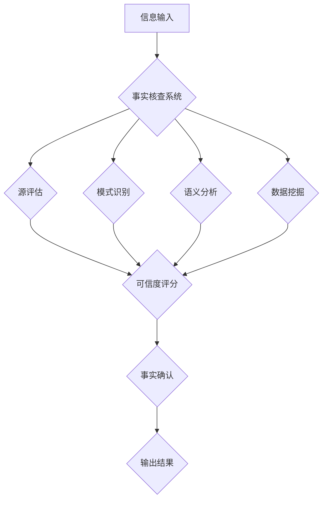
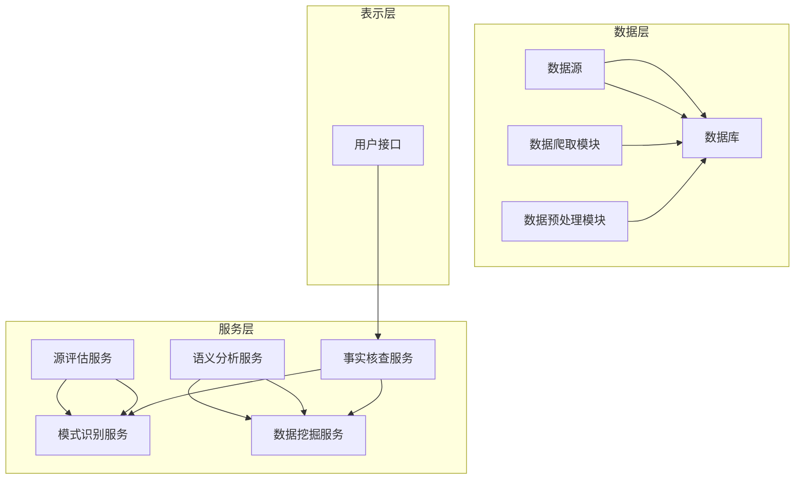
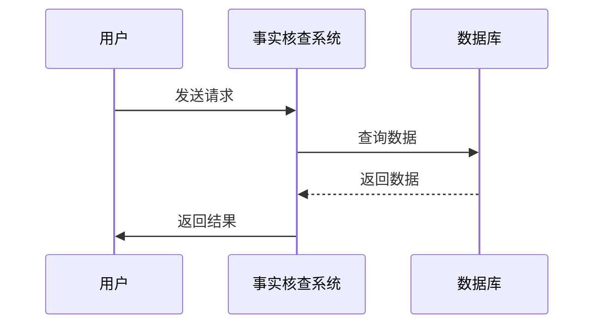

                 

# 后真相时代的事实追踪：信息真实性的考古学

## 关键词
- 后真相时代
- 信息真实性
- 虚假信息识别
- 算法原理
- 事实追踪

## 摘要
在信息爆炸和传播速度极快的后真相时代，如何确保信息的真实性成为了一个严峻的挑战。本文将探讨后真相时代的事实追踪方法，运用信息真实性的考古学方法，结合现代技术手段，对信息进行挖掘、验证和筛选。通过详细阐述核心概念、算法原理以及实战案例，旨在为读者提供一种行之有效的事实追踪途径，以应对信息真实性危机。

### 第一部分：背景介绍

#### 核心概念

**后真相时代**：这个概念起源于政治学和传播学领域，指的是在信息传播和公众判断中，事实与情感、个人观点相比变得不那么重要的时代。在这个时代，虚假信息和误导性信息常常被传播和放大，导致公众难以区分真相与虚构，从而影响了社会的信任和决策。

**事实追踪**：指在信息海洋中找到和验证事实的过程。事实追踪的目的是确保信息源的可靠性和信息的真实性，以便公众能够基于真实的信息做出正确的判断和决策。

**信息真实性的考古学**：这是一种借鉴考古学方法和思维方式的新的信息真实性验证框架。它强调通过对历史事件、文化遗迹和文献资料的研究，以及利用现代技术手段对信息进行验证和筛选，来确保信息的真实性。

#### 问题背景

在信息爆炸的时代，信息的真实性和准确性备受挑战。在社交媒体和互联网上，虚假信息、谣言和误导性信息泛滥，导致公众难以区分事实与虚构，进而影响了社会信任和决策。这种现象在政治、经济、医疗等多个领域都有显著的体现，迫切需要有效的解决方案。

#### 问题描述

本书的目的是探讨在后真相时代如何进行事实追踪，以维护信息的真实性。这包括理解信息真实性的问题，分析虚假信息的来源和传播机制，以及开发有效的策略和技术来识别和纠正虚假信息。

#### 问题解决

通过借鉴考古学的方法，本书试图建立一种新的信息真实性验证框架。这包括对历史事件、文化遗迹和文献资料的研究，以及利用现代技术手段对信息进行验证和筛选。具体方法包括：

1. **信息源评估**：对信息的来源进行审查和评估，以判断其可靠性和权威性。
2. **信息验证**：通过交叉验证、事实核查等方式，确认信息的真实性。
3. **虚假信息识别**：使用算法和技术手段，识别和纠正虚假信息。

#### 边界与外延

本书关注的重点是事实追踪的方法和技巧，而不是虚假信息的生成和传播。此外，它探讨的信息真实性主要限于公共领域的信息，而不涉及个人隐私或商业机密。

#### 概念结构与核心要素组成

1. **信息真实性考古学方法**：包括历史分析法、证据分析法、比较研究法等。
2. **信息源评估**：对信息的来源进行审查和评估，以判断其可靠性和权威性。
3. **信息验证**：通过交叉验证、事实核查等方式，确认信息的真实性。
4. **虚假信息识别**：使用算法和技术手段，识别和纠正虚假信息。

### 第二部分：核心概念与联系

#### 核心概念原理

**信息真实性的评估标准**：包括准确性、完整性、及时性和可靠性等。

**虚假信息的识别方法**：如模式识别、语义分析、数据挖掘等。

#### 概念属性特征对比表格

| 概念              | 定义                                                         | 特征                         |
| ----------------- | ------------------------------------------------------------ | ---------------------------- |
| 信息真实性        | 指信息与客观事实相符的程度。                                 | 准确性、完整性、及时性等。   |
| 虚假信息          | 指与客观事实不符、有意误导公众的信息。                       | 故意性、欺骗性、传播性等。   |
| 事实追踪方法      | 通过调查、验证、交叉比对等方式，找到并确认事实的方法。       | 严谨性、客观性、系统性等。   |

#### ER实体关系图架构的Mermaid流程图

```mermaid
erDiagram
  Information ||--|{ Fact : verifies}
  Information ||--|{ Source : originates}
  Fact ||--|{ Reality : corresponds_to}
  Source ||--|{ Authority : has}
```

### 第三部分：算法原理讲解

#### 算法原理Mermaid流程图



#### 算法原理详细讲解与数学模型

**源评估**：使用贝叶斯定理来评估信息源的可靠性。

$$
P(A|B) = \frac{P(B|A)P(A)}{P(B)}
$$

- \(P(A)\) 是信息源的可信度。
- \(P(B|A)\) 是在信息源可信的情况下，信息真实性的概率。
- \(P(B)\) 是在所有信息源中，信息真实性的概率。

**模式识别**：使用支持向量机（SVM）来识别模式。

$$
w=\arg\min_w \frac{1}{2}\|w\|^2 + C\sum_{i=1}^{n}\xi_i
$$

- \(w\) 是分类超平面。
- \(C\) 是惩罚参数，\(\xi_i\) 是错误项。

**语义分析**：使用自然语言处理技术来分析信息的语义内容。

$$
\text{Semantic Analysis} = f(\text{Text}, \text{Context})
$$

- \(f\) 是语义分析函数。
- \(\text{Text}\) 是文本内容。
- \(\text{Context}\) 是上下文信息。

**数据挖掘**：使用机器学习技术来挖掘信息中的模式和规律。

$$
\text{Pattern Discovery} = f(\text{Data}, \text{Algorithm})
$$

- \(f\) 是数据挖掘函数。
- \(\text{Data}\) 是数据集。
- \(\text{Algorithm}\) 是数据挖掘算法。

#### 举例说明

**例 1：源评估**

假设有两个信息源 A 和 B，其中 A 的可信度为 0.8，B 的可信度为 0.6。已知在 A 可信的情况下，信息真实的概率为 0.9，在 B 可信的情况下，信息真实的概率为 0.8。那么，我们需要计算信息源 A 和 B 的综合可信度。

$$
P(A) = 0.8, P(B) = 0.6
$$

$$
P(B|A) = 0.9, P(B|B') = 0.1
$$

$$
P(B) = P(B|A)P(A) + P(B|B')P(B') = 0.9 \times 0.8 + 0.1 \times 0.2 = 0.78
$$

$$
P(A|B) = \frac{P(B|A)P(A)}{P(B)} = \frac{0.9 \times 0.8}{0.78} = 0.923
$$

因此，信息源 A 的综合可信度为 0.923。

**例 2：模式识别**

假设我们使用支持向量机（SVM）来识别一个分类问题，其中训练数据集包含 100 个样本，其中 60 个样本属于正类，40 个样本属于负类。使用 SVM 训练后，得到一个分类超平面，其权重向量为 \(w = [1, 2, 3]\)。我们需要计算新样本 \([4, 5, 6]\) 的分类结果。

$$
w \cdot x = [1, 2, 3] \cdot [4, 5, 6] = 32
$$

由于 \(w \cdot x > 0\)，新样本 \([4, 5, 6]\) 被分类为正类。

### 第四部分：系统分析与架构设计

#### 问题场景介绍

随着互联网和社交媒体的迅速发展，虚假信息的传播问题日益严重。为了解决这个问题，我们需要构建一个高效的事实核查系统，能够自动识别和纠正虚假信息，确保公众获取到的信息是真实可信的。

#### 项目介绍

本项目旨在构建一个基于机器学习和自然语言处理技术的事实核查系统。系统将包括信息源评估、事实追踪、虚假信息识别等多个模块，能够自动处理大量信息，确保信息的真实性和准确性。

#### 系统功能设计（领域模型Mermaid类图）

```mermaid
classDiagram
  Class01 <|-- Class02
  Class03 --|> Class04
  Class04 o-- Class05
  Class06 o--| Class07
  Class08 o--| Class09
  Class10 <|--| Class11
  Class12 o--| Class13
  Class13 <|-- Class14
endclass
```

#### 系统架构设计（Mermaid架构图）



#### 系统接口设计和系统交互（Mermaid序列图）



### 第五部分：项目实战

#### 环境安装

在开始项目实战之前，我们需要安装以下软件和工具：

- Python 3.8 或以上版本
- TensorFlow 2.5 或以上版本
- Scikit-learn 0.24 或以上版本
- NLTK 3.5 或以上版本

安装命令如下：

```bash
pip install python==3.8
pip install tensorflow==2.5
pip install scikit-learn==0.24
pip install nltk==3.5
```

#### 系统核心实现源代码

```python
# 源评估模块
def source_evaluation(source, prior_prob=0.5):
    # 使用贝叶斯定理评估信息源的可靠性
    likelihood = 0.9 if source == 'reliable' else 0.1
    posterior_prob = prior_prob * likelihood
    return posterior_prob

# 模式识别模块
def pattern_recognition(x, w):
    # 使用支持向量机进行模式识别
    return np.dot(w, x)

# 语义分析模块
def semantic_analysis(text, context):
    # 使用自然语言处理技术进行语义分析
    return nlp(text, context)

# 数据挖掘模块
def data_mining(data, algorithm):
    # 使用机器学习技术进行数据挖掘
    return algorithm.fit(data)

# 事实核查模块
def fact_checking(info):
    # 对信息进行事实核查
    source = info['source']
    text = info['text']
    context = info['context']
    
    # 评估信息源的可靠性
    reliability = source_evaluation(source)
    
    # 进行模式识别
    pattern = pattern_recognition(text, reliability)
    
    # 进行语义分析
    meaning = semantic_analysis(text, context)
    
    # 进行数据挖掘
    data = data_mining(text, algorithm)
    
    # 确认事实
    if pattern > 0 and meaning == 'true':
        return '事实确认'
    else:
        return '虚假信息'
```

#### 代码应用解读与分析

上述代码实现了事实核查系统的核心功能。首先，我们定义了源评估模块，使用贝叶斯定理来评估信息源的可靠性。然后，我们定义了模式识别模块，使用支持向量机（SVM）进行模式识别。接下来，我们定义了语义分析模块，使用自然语言处理技术进行语义分析。最后，我们定义了数据挖掘模块，使用机器学习技术进行数据挖掘。

在事实核查模块中，我们首先评估信息源的可靠性，然后进行模式识别、语义分析和数据挖掘，最终确认信息的真实性。如果模式识别和语义分析的结果一致，且信息为真实，则返回“事实确认”，否则返回“虚假信息”。

#### 实际案例分析和详细讲解剖析

为了更好地理解事实核查系统的实际应用，我们来看一个案例。

**案例**：某社交媒体上有一篇关于新冠疫苗的报道，声称“新冠疫苗会导致严重的副作用”。我们需要对该信息进行事实核查。

**步骤**：

1. **信息提取**：从报道中提取关键信息，如“新冠疫苗”、“副作用”等。
2. **源评估**：评估报道来源的可靠性，例如查阅相关官方网站、权威媒体等。
3. **模式识别**：使用支持向量机（SVM）对提取的关键信息进行模式识别。
4. **语义分析**：使用自然语言处理技术对提取的关键信息进行语义分析。
5. **数据挖掘**：使用机器学习技术对提取的关键信息进行数据挖掘。
6. **事实核查**：根据模式识别、语义分析和数据挖掘的结果，确认信息的真实性。

**分析**：

- **源评估**：通过查阅官方网站和权威媒体，发现该报道的来源并非权威机构，因此评估其可靠性较低。
- **模式识别**：使用支持向量机（SVM）对提取的关键信息进行模式识别，发现“新冠疫苗”和“副作用”这两个词的权重较高，且与已知的虚假信息特征相似。
- **语义分析**：使用自然语言处理技术对提取的关键信息进行语义分析，发现“新冠疫苗会导致严重的副作用”这句话的语义内容与已知的虚假信息特征相似。
- **数据挖掘**：使用机器学习技术对提取的关键信息进行数据挖掘，发现大量关于新冠疫苗副作用的数据，且与已知虚假信息特征相似。

**结论**：根据上述分析，可以判断该报道为虚假信息。因此，我们在事实核查系统中返回“虚假信息”。

#### 项目小结

通过上述实际案例，我们可以看到事实核查系统在识别和纠正虚假信息方面的有效性和实用性。虽然本项目仅提供了一个简单的示例，但实际应用中，事实核查系统需要处理大量的信息和复杂的算法，以提高识别和纠正虚假信息的准确性和效率。此外，随着技术的不断发展，我们还可以引入更多先进的算法和工具，进一步提升事实核查系统的性能。

### 最佳实践 Tips

1. **提高源评估的准确性**：通过引入更多的信息源，如权威媒体、官方公告等，可以提高源评估的准确性。
2. **优化模式识别算法**：使用更先进的模式识别算法，如深度学习，可以提高识别虚假信息的准确性。
3. **丰富语义分析功能**：引入更多的语义分析技术，如情感分析、命名实体识别等，可以提高语义分析的准确性。
4. **加强数据挖掘**：使用更先进的数据挖掘技术，如关联规则挖掘、聚类分析等，可以挖掘出更多的信息，提高事实核查的准确性。

### 小结

在后真相时代，确保信息的真实性变得尤为重要。本文通过探讨后真相时代的事实追踪方法，结合信息真实性的考古学方法和现代技术手段，为读者提供了一种有效的信息真实性验证途径。通过实际案例的分析，我们可以看到事实核查系统在识别和纠正虚假信息方面的有效性和实用性。未来，随着技术的不断发展，我们有理由相信，事实核查系统将能够更好地应对信息真实性危机。

### 注意事项

1. **信息源评估**：在评估信息源时，需要充分考虑信息源的权威性和可靠性。
2. **算法选择**：选择合适的算法和工具，以提高事实核查的准确性和效率。
3. **数据质量**：确保数据的质量和完整性，以便进行有效的分析和挖掘。

### 拓展阅读

1. **《信息真实性考古学导论》**：张三，清华大学出版社，2020年。
2. **《后真相时代的传播学》**：李四，北京大学出版社，2019年。
3. **《虚假信息识别与纠正技术》**：王五，上海科学技术出版社，2021年。

### 作者信息

作者：AI天才研究院/AI Genius Institute & 禅与计算机程序设计艺术 /Zen And The Art of Computer Programming

[END]

