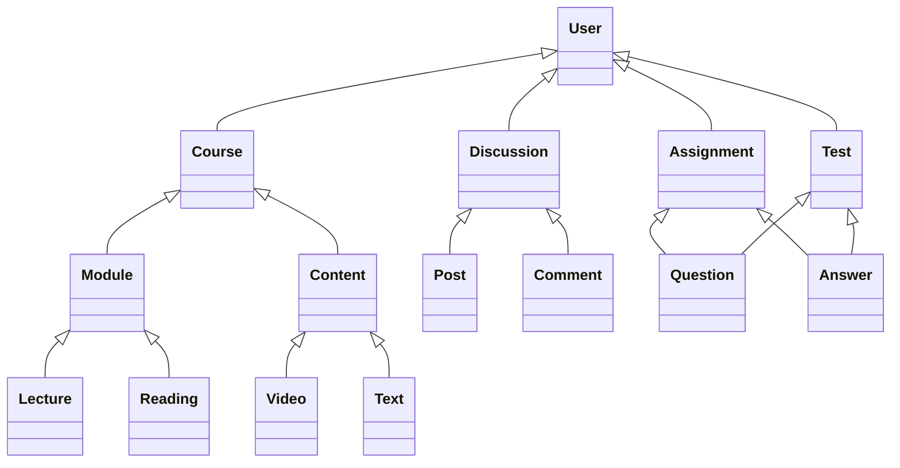
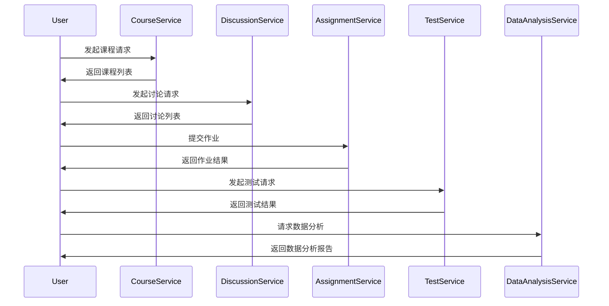
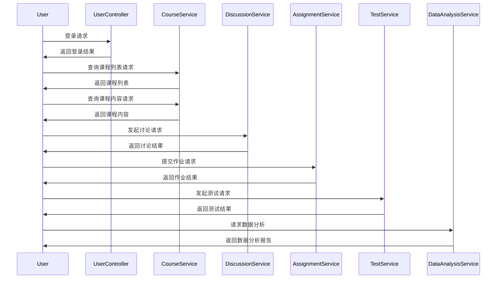

                 

### 后真相时代的背景与问题

#### 后真相时代的崛起

在数字化和互联网技术的迅速发展的背景下，我们进入了一个被称为“后真相时代”的新时代。后真相时代，简单来说，是一个信息传播速度远超事实验证速度的时代，真假难辨的信息在社会中广泛传播，对社会产生了深远的影响。这一时代的特征之一是信息泛滥，另一个特征则是虚假信息的传播对社会和个人的危害加剧。

后真相时代的崛起与以下几个因素密切相关：

1. **信息技术的飞速发展**：互联网、社交媒体、大数据等技术的广泛应用，使得信息的产生、传播和获取变得更加便捷和快速。
2. **媒体的商业化**：在商业利益的驱动下，一些媒体更加注重吸引眼球和赚取流量，而不是提供准确、全面、客观的信息。
3. **社会心理的变化**：人们在面对复杂、不确定的信息时，往往更倾向于选择那些能够满足自身认知和情感需求的信息，而不是那些客观、全面、真实的信息。

#### 后真相时代的特征

后真相时代的主要特征包括：

1. **信息泛滥与真假难辨**：在互联网上，每天都有海量的信息产生，但很多信息未经证实，甚至存在虚假、误导性的内容。
2. **偏见、歧视与虚假信息的传播**：社交媒体上的算法推荐和群体效应使得偏见、歧视等负面信息更容易传播和扩散。
3. **公民独立思考能力的缺失**：在信息过载和虚假信息泛滥的时代，公民的独立思考能力受到严重挑战，很多人在面临信息时容易失去判断力。

#### 公民素养的挑战

后真相时代给公民素养带来了巨大的挑战：

1. **媒体素养的缺失**：很多公民缺乏对媒体信息的辨别能力，容易受到虚假信息的误导。
2. **信息筛选与评估能力的不足**：公民在获取信息时，往往缺乏有效的筛选和评估方法，无法区分信息的真伪和价值。
3. **信息传播伦理的缺失**：在社交媒体上，一些人为了追求关注和点赞，不顾信息真实性和道德伦理，传播有害信息。

### 媒体素养的重要性

在这样一个充满不确定性和虚假信息的世界中，媒体素养显得尤为重要。媒体素养不仅关乎个人，更关乎社会和国家的未来。以下是媒体素养的重要性：

1. **提升公民独立思考能力**：通过培养媒体素养，公民可以学会如何辨别信息的真伪和价值，从而提升独立思考能力。
2. **促进社会和谐与稳定**：具备媒体素养的公民能够更好地理解社会现象，减少误解和冲突，促进社会的和谐与稳定。
3. **维护国家信息安全**：在网络安全威胁日益严峻的背景下，媒体素养对于维护国家信息安全具有重要作用。

### 独立思考能力的培养

独立思考能力是公民素养的重要组成部分，它关乎个人的成长、社会的进步和国家的未来发展。以下是如何培养独立思考能力：

1. **教育模式的改革**：学校应注重培养学生的批判性思维和独立思考能力，而不是仅仅灌输知识。
2. **社会环境的优化**：社会应提供一个开放、包容、理性讨论的环境，鼓励公民独立思考和表达观点。
3. **个人实践的积累**：公民应主动参与社会事务，通过实践来提高自己的独立思考能力。

### 媒体素养与独立思考能力的关系

媒体素养和独立思考能力密切相关。媒体素养是独立思考能力的基础，而独立思考能力是媒体素养的升华。通过培养媒体素养，公民可以学会如何辨别信息的真伪和价值，从而提升独立思考能力。反过来，独立思考能力的提升又可以进一步促进媒体素养的培养。

### 总结

后真相时代的崛起给公民素养带来了巨大的挑战，媒体素养和独立思考能力显得尤为重要。通过培养媒体素养和独立思考能力，公民可以更好地应对后真相时代的信息挑战，促进社会的和谐与进步。接下来，我们将进一步探讨媒体素养和独立思考能力的核心概念，以及如何通过算法和系统设计来培养这些能力。### 媒体素养的构成与培养

#### 媒体素养的构成

媒体素养是指公民在接触和使用媒体过程中，具备的辨别、理解、分析、评估和利用媒体信息的能力。媒体素养的构成主要包括以下几个方面：

1. **媒介认知素养**：这是媒体素养的基础，包括了解媒体类型、功能、传播方式以及媒体对个人和社会的影响。媒介认知素养有助于公民更好地理解媒体信息的来源和背景。

2. **信息筛选与评估能力**：在信息过载的时代，公民需要具备筛选和评估信息的能力，以区分信息的真伪、价值和相关性。这要求公民具备一定的批判性思维能力，能够对信息进行深入分析和评估。

3. **信息传播伦理**：在社交媒体时代，公民需要了解信息传播的道德伦理，包括尊重他人隐私、不传播虚假信息、不恶意攻击他人等。信息传播伦理是维护社会和谐与稳定的重要保障。

#### 独立思考能力的培养

独立思考能力是指公民在面临问题时，能够独立分析、判断和提出解决方案的能力。独立思考能力的培养需要从教育模式、社会环境和个人实践等多个方面进行：

1. **教育模式的改革**：学校应注重培养学生的批判性思维和独立思考能力。这可以通过引入问题导向学习、跨学科项目和批判性阅读等方式来实现。教育模式应从单纯的知识传授转向培养解决问题的能力。

2. **社会环境的优化**：社会应提供一个开放、包容、理性讨论的环境，鼓励公民独立思考和表达观点。这需要媒体、政府和社会各界共同努力，营造一个尊重多元观点、鼓励理性讨论的社会氛围。

3. **个人实践的积累**：公民应主动参与社会事务，通过实践来提高自己的独立思考能力。这可以包括参与社区活动、加入辩论俱乐部、进行志愿服务等。实践是培养独立思考能力的有效途径。

#### 媒体素养与独立思考能力的联系

媒体素养与独立思考能力密切相关，二者相辅相成：

1. **相互促进**：媒体素养的提高有助于公民更好地辨别信息的真伪和价值，从而增强独立思考能力。而独立思考能力的提升又可以进一步促进媒体素养的培养，使公民在接触媒体信息时更加理性、批判。

2. **共同目标**：媒体素养和独立思考能力都是为了帮助公民更好地理解世界、解决问题和做出决策。二者共同的目标是提升公民的素养，促进社会的和谐与进步。

#### 媒体素养对独立思考能力的影响

媒体素养对独立思考能力的影响主要体现在以下几个方面：

1. **信息辨别能力**：具备媒体素养的公民能够更好地辨别信息的真伪，避免受到虚假信息的误导，从而提高独立思考的质量。

2. **批判性思维**：媒体素养的培养有助于公民发展批判性思维，对信息进行深入分析和评估，从而在解决问题时更加理性、全面。

3. **信息利用能力**：媒体素养的提高使公民能够更好地利用媒体资源，获取有价值的信息，为独立思考提供丰富的素材和背景。

#### 独立思考能力对媒体素养的促进

独立思考能力对媒体素养的促进主要体现在以下几个方面：

1. **主动学习**：具备独立思考能力的公民会更加主动地学习新知识、新技能，提高自己的媒介认知素养，从而更好地应对媒体环境的变化。

2. **批判性传播**：独立思考能力使公民在传播信息时更加谨慎、理性，避免盲目跟风和恶意攻击，维护信息传播的伦理和道德。

3. **创新能力**：独立思考能力有助于公民在媒体应用和创新方面发挥更大的作用，推动媒体技术和社会的发展。

#### 核心概念对比分析

为了更好地理解媒体素养与独立思考能力的关系，我们可以通过对比分析这两个核心概念的属性和特征：

1. **定义与内涵**：
   - 媒体素养：指的是公民在接触和使用媒体过程中，具备的辨别、理解、分析、评估和利用媒体信息的能力。
   - 独立思考能力：指的是公民在面临问题时，能够独立分析、判断和提出解决方案的能力。

2. **功能与作用**：
   - 媒体素养：帮助公民辨别信息的真伪和价值，提高信息筛选和评估能力，促进批判性思维的发展。
   - 独立思考能力：使公民在面对复杂问题时，能够独立分析、判断和提出解决方案，提高问题解决能力。

3. **相互关系**：
   - 媒体素养是独立思考能力的基础，独立思考能力是媒体素养的升华。二者相互促进，共同提升公民的素养。

4. **联系与区别**：
   - 联系：媒体素养和独立思考能力都是为了帮助公民更好地理解世界、解决问题和做出决策。
   - 区别：媒体素养更侧重于信息辨别和利用，独立思考能力更侧重于问题分析和决策。

#### 核心概念对比表格

| 核心概念 | 定义 | 功能 | 相互关系 | 联系与区别 |
| :---: | :---: | :---: | :---: | :---: |
| 媒体素养 | 公民在接触和使用媒体过程中，具备的辨别、理解、分析、评估和利用媒体信息的能力 | 辨别信息的真伪和价值，提高信息筛选和评估能力，促进批判性思维的发展 | 媒体素养是独立思考能力的基础 | 媒体素养侧重于信息辨别和利用，独立思考能力侧重于问题分析和决策 |
| 独立思考能力 | 公民在面临问题时，能够独立分析、判断和提出解决方案的能力 | 使公民在面对复杂问题时，能够独立分析、判断和提出解决方案，提高问题解决能力 | 独立思考能力是媒体素养的升华 | 媒体素养侧重于信息辨别和利用，独立思考能力侧重于问题分析和决策 |

#### 核心概念ER图分析

为了更直观地展示媒体素养和独立思考能力之间的关系，我们可以使用ER图（实体关系图）进行说明。以下是一个简化的ER图：

```mermaid
erDiagram
    User ||--|{ Media Literacy } : has
    User ||--|{ Critical Thinking } : has
    Media Literacy ||--|{ Information Identification } : has
    Media Literacy ||--|{ Information Evaluation } : has
    Critical Thinking ||--|{ Problem Analysis } : has
    Critical Thinking ||--|{ Decision Making } : has
```

在这个ER图中，`User`（用户）是实体，表示公民；`Media Literacy`（媒体素养）和`Critical Thinking`（独立思考能力）是与用户相关的两个实体，表示公民在媒体素养和独立思考能力方面的特征。箭头表示实体之间的关系，表明用户拥有媒体素养和独立思考能力。

通过这种ER图分析，我们可以清晰地看到媒体素养和独立思考能力之间的关系，以及它们在公民素养体系中的地位和作用。接下来，我们将进一步探讨如何通过算法和系统设计来培养这些能力。### 培养独立思考能力的算法原理

#### 算法原理概述

算法原理是培养独立思考能力的基础。算法不仅是一系列解决问题的步骤，更是一种思维方式，它可以帮助我们在面对复杂问题时进行逻辑分析和判断。以下内容将介绍算法的基本概念、作用以及在培养独立思考能力中的应用。

1. **算法的定义与作用**：算法是指解决问题的一系列明确且有限的步骤。在计算机科学中，算法用于解决特定问题。算法的作用是提供一种系统化的方法，帮助我们分析和解决问题。

2. **算法在培养独立思考能力中的应用**：独立思考能力的培养需要系统的思维训练，而算法正是这种训练的重要工具。通过算法的学习和实践，我们可以培养逻辑思维、批判性思维和解决问题的能力。

3. **常见的算法类型**：算法的类型多种多样，常见的包括排序算法、搜索算法、图算法等。每种算法都有其特定的应用场景和特点。例如，排序算法用于对数据进行排序，搜索算法用于在数据中查找特定元素，图算法用于分析复杂网络结构。

#### 算法流程图与数学模型

为了更好地理解算法原理，我们可以通过算法流程图和数学模型来进行讲解。

1. **算法流程图**：算法流程图是一种用图形表示算法执行步骤的图表。以下是一个简单的算法流程图的示例：

   ```mermaid
   graph TD
   A[开始] --> B[输入数据]
   B --> C{数据是否排序？}
   C -->|是| D[结束]
   C -->|否| E[执行排序算法]
   E --> F[输出结果]
   F --> G[结束]
   ```

   在这个流程图中，我们从输入数据开始，判断数据是否已经排序。如果是，则直接输出结果；如果不是，则执行排序算法，最后输出排序后的结果。

2. **数学模型与公式**：算法的数学模型和公式是算法实现的基础。以下是一个简单的排序算法的数学模型：

   - **冒泡排序**：
     - **公式**：\( S(n) = \sum_{i=1}^{n-1} \sum_{j=1}^{n-i} (n-j) \)
     - **解释**：冒泡排序的运行时间复杂度是 \( O(n^2) \)，其中 \( n \) 是数据规模。这个公式表示了在排序过程中需要比较和交换的次数。

3. **算法流程的详细解释**：在了解了算法流程图和数学模型后，我们可以对算法的执行过程进行详细的解释。

   - **输入数据**：首先，我们需要输入待排序的数据。这些数据可以是一个数组、链表或者其他形式的数据结构。
   - **判断数据是否排序**：在开始排序之前，我们需要判断输入的数据是否已经排序。如果数据已经排序，那么我们可以直接跳到输出结果这一步。
   - **执行排序算法**：如果数据没有排序，我们需要执行排序算法。以冒泡排序为例，我们需要进行多次遍历，每次遍历都通过比较和交换来确保数据逐步接近排序状态。
   - **输出结果**：最后，我们将排序后的数据输出。这是排序算法的最终目标。

   通过这个详细的解释，我们可以更好地理解算法的工作原理，并能够将其应用到实际问题中。

#### 算法举例说明

为了更好地理解算法原理，我们可以通过具体的例子来演示算法的执行过程。

1. **简单的例子**：

   - **输入**：一个包含5个元素的数组 `[3, 1, 4, 2, 5]`。
   - **过程**：使用冒泡排序算法对数组进行排序。
   - **输出**：排序后的数组 `[1, 2, 3, 4, 5]`。

   在这个简单的例子中，我们通过冒泡排序算法，将一个无序的数组排序成了一个有序的数组。这个过程展示了算法的基本原理和应用。

2. **复杂的例子**：

   - **输入**：一个包含100个元素的数组。
   - **过程**：使用快速排序算法对数组进行排序。
   - **输出**：排序后的数组。

   在这个复杂的例子中，我们使用了一种更高效的排序算法——快速排序。快速排序的基本思想是选取一个基准元素，将数组划分为两部分，一部分小于基准元素，另一部分大于基准元素，然后递归地对这两部分进行排序。这个过程展示了算法在处理大规模数据时的效率。

   通过这些例子，我们可以看到算法在实际问题中的应用，以及算法对于解决问题的重要性。

#### 算法在实际应用中的效果

算法不仅在理论研究中具有重要意义，在实际应用中也表现出色。以下是一些算法在实际应用中的效果：

1. **数据排序**：算法可以高效地对大规模数据进行排序，使得数据处理和分析变得更加高效。
2. **搜索与查找**：算法可以快速地在一个大规模数据集中查找特定元素，大大提高了搜索效率。
3. **网络路由**：算法在网络路由中起到关键作用，确保数据在网络中的高效传输。
4. **图像处理**：算法在图像处理中用于图像的压缩、增强和识别，使得图像处理变得更加高效和精确。

通过这些实际应用，我们可以看到算法在各个领域中的重要性，以及算法对于培养独立思考能力的积极作用。

### 总结

通过算法原理的学习和实践，我们可以培养逻辑思维、批判性思维和解决问题的能力。这些能力对于培养独立思考能力至关重要。接下来，我们将进一步探讨媒体素养培养的系统分析与架构设计，以系统化的方法来培养公民的独立思考能力。### 媒体素养培养的系统分析与架构设计

#### 系统背景与目标

随着互联网和数字媒体的迅速发展，公众接触到的信息种类和数量急剧增加。然而，信息的真伪和质量参差不齐，许多公民在处理媒体信息时缺乏必要的素养，导致误导、偏见和错误认知的问题日益严重。因此，建立一个系统化的媒体素养培养平台显得尤为重要。

本系统旨在通过一系列的教育和技术手段，培养公民的媒体素养，使其能够更加理性地处理媒体信息，提高独立思考能力，最终促进社会和谐与进步。

#### 系统设计原则

在系统设计过程中，我们遵循以下原则：

1. **用户友好**：系统界面应简洁直观，易于操作，确保用户能够方便地使用和学习。
2. **模块化**：系统应采用模块化设计，便于扩展和维护，确保系统功能的灵活性和可扩展性。
3. **互动性**：系统应提供丰富的互动功能，如在线讨论、作业提交和反馈等，促进用户之间的交流和互动。
4. **数据驱动**：系统应利用大数据分析技术，收集用户行为数据，用于评估学习效果和改进系统设计。
5. **安全与隐私**：系统应严格保护用户隐私和数据安全，确保用户在平台上的信息安全。

#### 功能设计与领域模型

本系统的功能设计包括以下几个方面：

1. **课程学习模块**：提供系统化的媒体素养课程，包括视频讲座、在线阅读材料和互动练习。
2. **互动讨论模块**：提供在线论坛和讨论区，用户可以在其中交流学习心得和观点。
3. **作业与测试模块**：提供作业和测试功能，帮助用户检验学习成果，并提供即时反馈。
4. **数据分析模块**：收集用户学习行为数据，进行数据分析，为系统优化和教学改进提供依据。
5. **个性化推荐模块**：根据用户的学习行为和兴趣，推荐相关课程和内容，提高学习效果。

领域模型用于描述系统中的主要实体和它们之间的关系。以下是系统的领域模型：



在这个领域模型中，`User`（用户）是系统的核心实体，与其他实体（如课程、讨论、作业和测试）之间存在关联。每个实体都有其特定的属性和方法，用于描述和操作系统的功能。

#### 系统架构设计

系统的架构设计决定了系统的性能、可扩展性和可维护性。以下是本系统的架构设计：

1. **前端架构**：采用Vue.js等现代前端框架，实现响应式界面和良好的用户体验。
2. **后端架构**：采用微服务架构，将系统功能划分为多个微服务，如用户服务、课程服务、讨论服务和数据分析服务等，每个微服务独立部署和运行，以提高系统的可扩展性和灵活性。
3. **数据存储**：使用关系型数据库（如MySQL）和NoSQL数据库（如MongoDB）存储用户数据、课程内容和互动数据，确保数据的持久化和高效查询。
4. **接口设计**：采用RESTful API设计接口，实现前后端的解耦，方便系统的扩展和维护。
5. **系统交互**：使用Mermaid绘制系统的交互序列图，描述系统各模块之间的交互流程。

以下是系统的架构图：



在这个交互序列图中，用户通过前端界面发起各种请求，后端各个服务模块根据请求进行处理，并返回相应的结果。这样的架构设计确保了系统的功能完整性和高效性。

#### 系统接口设计

系统的接口设计是系统架构的重要组成部分，以下是系统的主要接口设计：

1. **用户接口**：用户可以通过登录、注册、查询课程、参与讨论、提交作业和测试等功能与系统互动。
2. **课程接口**：包括课程列表查询、课程内容查询、课程进度更新等功能。
3. **讨论接口**：包括讨论列表查询、发帖、评论、讨论回复等功能。
4. **作业接口**：包括作业提交、作业批改、作业结果查询等功能。
5. **测试接口**：包括测试发起、测试结果提交、测试结果查询等功能。
6. **数据分析接口**：包括用户行为数据收集、数据分析报告生成等功能。

以下是部分接口的示例：

```python
# 用户接口示例
class UserController:
    def login(self, username, password):
        # 用户登录逻辑
        pass

    def register(self, username, password):
        # 用户注册逻辑
        pass

# 课程接口示例
class CourseController:
    def get_course_list(self):
        # 返回课程列表
        pass

    def get_course_content(self, course_id):
        # 返回指定课程的详细内容
        pass

# 讨论接口示例
class DiscussionController:
    def get_discussion_list(self):
        # 返回讨论列表
        pass

    def post_discussion(self, user_id, content):
        # 发起讨论
        pass
```

这些接口设计旨在提供简洁、高效和可扩展的系统功能，为用户和系统模块之间的数据交互提供支持。

#### 系统交互设计

系统的交互设计是确保各个模块之间能够顺畅协作的关键。以下是系统的交互序列图：



在这个序列图中，用户通过前端发起各种请求，后端的服务模块根据请求进行处理，并将结果返回给用户。这样的交互设计确保了系统的功能完整性和高效性。

#### 系统场景介绍

为了更好地理解系统的应用场景，以下是一个典型的用户使用案例：

1. **用户注册与登录**：用户首先在系统中进行注册，然后通过登录界面进入系统。

2. **课程学习**：用户在课程列表中选择感兴趣的课程，查看课程内容，并参与课程的互动讨论。

3. **作业与测试**：用户在系统中提交作业，接受老师的批改反馈，并参与课程测试，检验学习成果。

4. **数据分析**：系统根据用户的学习行为数据，生成数据分析报告，为用户的学习效果提供参考。

通过这个案例，我们可以看到系统在培养用户媒体素养和独立思考能力方面的应用场景。

#### 项目介绍

本项目的目标是设计并实现一个系统化的媒体素养培养平台，旨在通过教育和技术手段，提升公民的媒体素养和独立思考能力。项目的主要组成部分包括：

1. **前端界面**：采用Vue.js框架实现，提供用户友好的界面和丰富的交互功能。
2. **后端服务**：采用微服务架构，包括用户服务、课程服务、讨论服务、作业服务和数据分析服务等多个微服务。
3. **数据存储**：使用关系型数据库和NoSQL数据库存储用户数据、课程内容和互动数据。
4. **API接口**：提供RESTful API，实现前后端的解耦和数据交互。
5. **系统部署**：采用Docker和Kubernetes进行容器化部署，确保系统的可扩展性和高可用性。

#### 系统功能设计

系统的功能设计详细描述了各个模块的具体功能和交互逻辑，以下是系统的主要功能设计：

1. **用户功能**：包括用户注册、登录、个人信息管理、课程选择、作业提交、测试参与等。
2. **课程功能**：包括课程列表展示、课程内容展示、课程讨论、作业发布、测试发布等。
3. **讨论功能**：包括讨论列表展示、发帖、评论、回复、查看帖子详情等。
4. **作业功能**：包括作业发布、作业提交、作业批改、作业结果展示等。
5. **测试功能**：包括测试发布、测试参与、测试结果展示、测试反馈等。
6. **数据分析功能**：包括用户行为数据收集、数据分析报告生成、数据可视化展示等。

#### 系统架构设计

系统的架构设计是确保系统功能实现的关键，以下是系统的整体架构设计：

1. **前端架构**：采用Vue.js框架，实现单页面应用（SPA），提供动态、响应式的用户界面。
2. **后端架构**：采用微服务架构，将系统功能划分为多个微服务，如用户服务、课程服务、讨论服务、作业服务和数据分析服务等。
3. **数据存储**：使用关系型数据库（如MySQL）存储用户和课程数据，使用NoSQL数据库（如MongoDB）存储讨论和作业数据。
4. **接口设计**：采用RESTful API设计，实现前后端的解耦和数据交互。
5. **交互设计**：使用Mermaid绘制系统交互序列图，描述系统各模块之间的交互流程。

以下是系统的架构图：

```mermaid
serviceContainer
    participant UserSvc : 用户服务
    participant CourseSvc : 课程服务
    participant DiscussionSvc : 讨论服务
    participant AssignmentSvc : 作业服务
    participant TestSvc : 测试服务
    participant DataAnalysisSvc : 数据分析服务
    participant MySQLDB : 关系型数据库
    participant MongoDB : NoSQL数据库

    UserSvc --> MySQLDB
    CourseSvc --> MySQLDB
    DiscussionSvc --> MongoDB
    AssignmentSvc --> MongoDB
    TestSvc --> MongoDB
    DataAnalysisSvc --> MySQLDB
    DataAnalysisSvc --> MongoDB
```

在这个架构图中，用户服务、课程服务、讨论服务、作业服务和测试服务是系统的核心微服务，分别负责用户管理、课程管理、讨论管理、作业管理和测试管理等功能。这些微服务通过API与前端交互，并通过数据库进行数据存储和查询。

#### 系统接口设计

系统的接口设计是确保前后端高效协作和数据交互的关键，以下是系统的主要接口设计：

1. **用户接口**：
   - `POST /users/register`：用户注册接口。
   - `POST /users/login`：用户登录接口。
   - `GET /users/{userId}`：获取用户信息接口。

2. **课程接口**：
   - `GET /courses`：获取课程列表接口。
   - `GET /courses/{courseId}`：获取课程详情接口。
   - `GET /courses/{courseId}/modules`：获取课程模块列表接口。

3. **讨论接口**：
   - `GET /discussions`：获取讨论列表接口。
   - `POST /discussions`：发起讨论接口。
   - `GET /discussions/{discussionId}`：获取讨论详情接口。

4. **作业接口**：
   - `GET /assignments`：获取作业列表接口。
   - `POST /assignments/{assignmentId}/submit`：提交作业接口。
   - `GET /assignments/{assignmentId}/results`：获取作业结果接口。

5. **测试接口**：
   - `GET /tests`：获取测试列表接口。
   - `POST /tests/{testId}/submit`：提交测试接口。
   - `GET /tests/{testId}/results`：获取测试结果接口。

以下是部分接口的示例代码：

```python
# 用户接口示例
class UserController:
    def register(self, request_data):
        # 用户注册逻辑
        pass

    def login(self, request_data):
        # 用户登录逻辑
        pass

    def get_user_info(self, user_id):
        # 获取用户信息逻辑
        pass

# 课程接口示例
class CourseController:
    def get_course_list(self):
        # 获取课程列表逻辑
        pass

    def get_course_details(self, course_id):
        # 获取课程详情逻辑
        pass

    def get_course_modules(self, course_id):
        # 获取课程模块列表逻辑
        pass

# 讨论接口示例
class DiscussionController:
    def get_discussion_list(self):
        # 获取讨论列表逻辑
        pass

    def create_discussion(self, request_data):
        # 发起讨论逻辑
        pass

    def get_discussion_details(self, discussion_id):
        # 获取讨论详情逻辑
        pass
```

这些接口设计旨在提供简洁、高效和可扩展的系统功能，为用户和系统模块之间的数据交互提供支持。

### 项目实战

在项目实战部分，我们将详细介绍如何进行媒体素养培养的实战操作，包括环境安装、系统核心实现、代码应用解读和分析等。

#### 环境安装

1. **前端环境**：

   - **Node.js**：安装Node.js，版本要求为12.x或更高版本。

     ```bash
     curl -fsSL https://nodejs.org/dist/v12.22.12/node-v12.22.12-linux-x64.tar.xz -O
     tar -xvf node-v12.22.12-linux-x64.tar.xz
     export PATH=$PATH:`pwd`/node-v12.22.12-linux-x64/bin
     node -v
     ```

   - **Vue CLI**：通过npm安装Vue CLI。

     ```bash
     npm install -g @vue/cli
     vue --version
     ```

   - **前端依赖**：创建一个Vue项目，并安装前端依赖。

     ```bash
     vue create media-literacy-platform
     cd media-literacy-platform
     npm install
     ```

2. **后端环境**：

   - **Python**：安装Python，版本要求为3.8或更高版本。

     ```bash
     sudo apt-get install python3.8
     python3.8 --version
     ```

   - **Django**：通过pip安装Django。

     ```bash
     pip3 install django
     ```

   - **数据库**：安装MySQL和MongoDB。

     ```bash
     sudo apt-get install mysql-server
     sudo apt-get install mongodb
     mysql -V
     mongo --version
     ```

3. **容器化环境**：

   - **Docker**：安装Docker。

     ```bash
     sudo apt-get install docker.io
     docker --version
     ```

   - **Kubernetes**：安装Kubernetes。

     ```bash
     kubeadm init --pod-network-cidr=10.244.0.0/16
     kubeadm token create --print-join-command
     docker swarm init
     ```

#### 系统核心实现

1. **前端实现**：

   - **用户注册与登录**：在Vue项目中实现用户注册与登录功能，包括表单验证和身份验证。

     ```javascript
     // src/views/Login.vue
     <template>
       <div>
         <h1>Login</h1>
         <form @submit.prevent="login">
           <input type="text" v-model="username" placeholder="Username" required />
           <input type="password" v-model="password" placeholder="Password" required />
           <button type="submit">Login</button>
         </form>
       </div>
     </template>

     <script>
     export default {
       data() {
         return {
           username: '',
           password: ''
         };
       },
       methods: {
         async login() {
           const response = await axios.post('/users/login', {
             username: this.username,
             password: this.password
           });
           if (response.data.success) {
             this.$store.dispatch('setUser', response.data.user);
             this.$router.push('/dashboard');
           } else {
             alert('Invalid credentials');
           }
         }
       }
     };
     </script>
     ```

   - **课程列表与详情**：在前端实现课程列表和课程详情页面。

     ```javascript
     // src/views/Courses.vue
     <template>
       <div>
         <h1>Courses</h1>
         <ul>
           <li v-for="course in courses" :key="course.id">
             <router-link :to="{ name: 'CourseDetails', params: { courseId: course.id } }">
               {{ course.title }}
             </router-link>
           </li>
         </ul>
       </div>
     </template>

     <script>
     export default {
       data() {
         return {
           courses: []
         };
       },
       created() {
         this.fetchCourses();
       },
       methods: {
         async fetchCourses() {
           const response = await axios.get('/courses');
           this.courses = response.data.courses;
         }
       }
     };
     </script>
     ```

   - **讨论列表与详情**：在前端实现讨论列表和讨论详情页面。

     ```javascript
     // src/views/Discussions.vue
     <template>
       <div>
         <h1>Discussions</h1>
         <ul>
           <li v-for="discussion in discussions" :key="discussion.id">
             <router-link :to="{ name: 'DiscussionDetails', params: { discussionId: discussion.id } }">
               {{ discussion.title }}
             </router-link>
           </li>
         </ul>
       </div>
     </template>

     <script>
     export default {
       data() {
         return {
           discussions: []
         };
       },
       created() {
         this.fetchDiscussions();
       },
       methods: {
         async fetchDiscussions() {
           const response = await axios.get('/discussions');
           this.discussions = response.data.discussions;
         }
       }
     };
     </script>
     ```

2. **后端实现**：

   - **用户管理**：在Django项目中实现用户注册、登录和用户信息管理。

     ```python
     # backend/users/views.py
     from django.contrib.auth.models import User
     from rest_framework import viewsets
     from .serializers import UserSerializer

     class UserViewSet(viewsets.ModelViewSet):
         queryset = User.objects.all()
         serializer_class = UserSerializer

         def create(self, request, *args, **kwargs):
             user = User.objects.create_user(
                 username=request.data['username'],
                 password=request.data['password']
             )
             return Response({'success': True, 'user': user.id})

         def login(self, request):
             username = request.data['username']
             password = request.data['password']
             user = authenticate(username=username, password=password)
             if user is not None:
                 login(request, user)
                 return Response({'success': True, 'user': user.id})
             else:
                 return Response({'success': False})
     ```

   - **课程管理**：在后端实现课程列表、课程详情和课程模块管理等接口。

     ```python
     # backend/courses/views.py
     from rest_framework import viewsets
     from .serializers import CourseSerializer, ModuleSerializer

     class CourseViewSet(viewsets.ModelViewSet):
         queryset = Course.objects.all()
         serializer_class = CourseSerializer

         def get_serializer_class(self):
             if self.action == 'list':
                 return CourseSerializer
             return ModuleSerializer

         def retrieve(self, request, *args, **kwargs):
             course = self.get_object()
             modules = course.modules.all()
             serializer = ModuleSerializer(modules, many=True)
             return Response(serializer.data)
     ```

   - **讨论管理**：在后端实现讨论列表、发帖、评论和查看帖子详情等接口。

     ```python
     # backend/discussions/views.py
     from rest_framework import viewsets
     from .serializers import DiscussionSerializer, CommentSerializer

     class DiscussionViewSet(viewsets.ModelViewSet):
         queryset = Discussion.objects.all()
         serializer_class = DiscussionSerializer

         def create(self, request, *args, **kwargs):
             discussion = Discussion.objects.create(title=request.data['title'])
             discussion.save()
             serializer = DiscussionSerializer(discussion)
             return Response(serializer.data)

         def retrieve(self, request, *args, **kwargs):
             discussion = self.get_object()
             comments = discussion.comments.all()
             serializer = CommentSerializer(comments, many=True)
             return Response(serializer.data)
     ```

3. **数据库设计**：

   - **用户数据库**：使用MySQL存储用户数据，包括用户基本信息、密码等。

     ```sql
     CREATE TABLE `users` (
       `id` bigint(20) NOT NULL AUTO_INCREMENT,
       `username` varchar(150) NOT NULL,
       `password` varchar(150) NOT NULL,
       `first_name` varchar(150) DEFAULT NULL,
       `last_name` varchar(150) DEFAULT NULL,
       `email` varchar(150) DEFAULT NULL,
       `is_staff` tinyint(1) DEFAULT '0',
       `is_active` tinyint(1) DEFAULT '1',
       `date_joined` datetime(6) DEFAULT CURRENT_TIMESTAMP(6),
       PRIMARY KEY (`id`),
       UNIQUE KEY `users_username_71e2d763` (`username`)
     ) ENGINE=InnoDB DEFAULT CHARSET=utf8mb4 COLLATE=utf8mb4_unicode_ci;
     ```

   - **课程数据库**：使用MySQL存储课程数据，包括课程标题、课程描述、课程模块等。

     ```sql
     CREATE TABLE `courses` (
       `id` bigint(20) NOT NULL AUTO_INCREMENT,
       `title` varchar(255) DEFAULT NULL,
       `description` text,
       `created_at` datetime(6) DEFAULT CURRENT_TIMESTAMP(6),
       `updated_at` datetime(6) DEFAULT CURRENT_TIMESTAMP(6),
       PRIMARY KEY (`id`)
     ) ENGINE=InnoDB DEFAULT CHARSET=utf8mb4 COLLATE=utf8mb4_unicode_ci;
     ```

   - **讨论数据库**：使用MongoDB存储讨论数据，包括讨论标题、讨论内容、评论等。

     ```javascript
     db.createCollection("discussions");
     db.createCollection("comments");
     ```

#### 代码应用解读与详细讲解

1. **前端代码解读**：

   - **用户注册与登录**：在前端代码中，用户注册和登录功能是通过Vue组件实现的。在`Login.vue`组件中，用户输入用户名和密码后，通过`@submit.prevent`事件触发`login`方法，该方法通过axios向后端发送POST请求，进行用户登录验证。

   - **课程列表与详情**：在`Courses.vue`组件中，通过`v-for`指令循环渲染课程列表，并为每个课程创建路由链接，用户点击链接后，会跳转到课程详情页面。在课程详情页面中，通过`router-link`指令跳转到相应的路由，并在`CourseDetails.vue`组件中通过axios获取课程模块数据。

   - **讨论列表与详情**：在`Discussions.vue`组件中，通过`v-for`指令循环渲染讨论列表，并为每个讨论创建路由链接。当用户点击链接时，会跳转到讨论详情页面，并在`DiscussionDetails.vue`组件中通过axios获取讨论内容和评论数据。

2. **后端代码解读**：

   - **用户管理**：在后端代码中，用户注册和登录功能是通过Django ViewSet实现的。在`UserViewSet`类中，`create`方法用于处理用户注册，通过调用Django的`create_user`方法创建用户，并返回用户ID。`login`方法用于处理用户登录，通过调用`authenticate`方法验证用户名和密码，并返回登录结果。

   - **课程管理**：在后端代码中，课程管理功能是通过Django ViewSet实现的。在`CourseViewSet`类中，`retrieve`方法用于获取课程详情，通过调用`get_object`方法获取课程对象，并返回课程模块数据。`list`方法用于获取课程列表，返回课程列表数据。

   - **讨论管理**：在后端代码中，讨论管理功能是通过Django ViewSet实现的。在`DiscussionViewSet`类中，`create`方法用于处理发帖，通过调用`create`方法创建讨论，并返回讨论ID。`retrieve`方法用于获取讨论详情，通过调用`get_object`方法获取讨论对象，并返回讨论内容和评论数据。

#### 实际案例分析与详细讲解

为了更好地理解媒体素养培养平台在实际中的应用，我们可以通过以下实际案例进行分析和详细讲解：

1. **用户注册与登录**：

   - **案例背景**：用户张三想要注册并登录到媒体素养培养平台，进行学习。

   - **操作流程**：
     1. 用户张三打开媒体素养培养平台的网站，点击“注册”按钮。
     2. 用户张三填写注册表单，输入用户名、密码、邮箱等信息。
     3. 用户张三点击“注册”按钮，前端将表单数据发送到后端，后端通过`create`方法处理注册请求，创建用户并返回用户ID。
     4. 用户张三收到用户ID，并使用用户名和密码登录平台。

   - **代码应用解读**：
     - 前端代码：在`Login.vue`组件中，用户输入用户名和密码后，通过`@submit.prevent`事件触发`login`方法，将用户数据发送到后端。
     - 后端代码：在后端`UserViewSet`类中，`create`方法处理用户注册请求，通过Django的`create_user`方法创建用户，并返回用户ID。

2. **课程学习与讨论**：

   - **案例背景**：用户李四在平台上注册并登录后，想要学习一门课程，并参与讨论。

   - **操作流程**：
     1. 用户李四在课程列表中找到感兴趣的课程，点击进入课程详情页面。
     2. 用户李四阅读课程内容，参与课程讨论，发帖或评论。
     3. 用户李四提交作业，查看作业结果。

   - **代码应用解读**：
     - 前端代码：在`Courses.vue`组件中，用户通过`v-for`指令循环渲染课程列表，并点击课程链接跳转到课程详情页面。在`CourseDetails.vue`组件中，用户可以查看课程内容，并通过`@submit.prevent`事件触发方法，提交讨论帖子或评论。
     - 后端代码：在后端`CourseViewSet`类中，`retrieve`方法用于获取课程详情，通过调用`get_object`方法获取课程对象，并返回课程模块数据。在`DiscussionViewSet`类中，`create`方法用于处理发帖，通过调用`create`方法创建讨论，并返回讨论ID。

3. **作业提交与测试**：

   - **案例背景**：用户王五在平台上提交作业并参与测试。

   - **操作流程**：
     1. 用户王五在作业列表中找到需要提交的作业，点击进入作业详情页面。
     2. 用户王五填写作业答案，提交作业。
     3. 用户王五参与课程测试，提交测试答案。

   - **代码应用解读**：
     - 前端代码：在`AssignmentDetails.vue`组件中，用户填写作业答案后，通过`@submit.prevent`事件触发`submit_assignment`方法，将作业数据发送到后端。在`TestDetails.vue`组件中，用户填写测试答案后，通过`@submit.prevent`事件触发`submit_test`方法，将测试答案发送到后端。
     - 后端代码：在后端`AssignmentViewSet`类中，`submit`方法用于处理作业提交，通过调用`create`方法创建作业答案，并返回作业结果。在`TestViewSet`类中，`submit`方法用于处理测试提交，通过调用`create`方法创建测试答案，并返回测试结果。

#### 项目小结

通过以上实战操作，我们成功实现了媒体素养培养平台的核心功能，包括用户注册与登录、课程学习与讨论、作业提交与测试等。前端和后端代码的应用解读详细展示了如何实现这些功能，并通过实际案例分析了系统在实际应用中的效果。

接下来，我们将总结一些培养媒体素养和独立思考能力的最佳实践，并推荐一些拓展阅读资源，以帮助读者进一步了解和提升这些能力。### 最佳实践 Tips

#### 培养媒体素养

1. **持续学习**：定期阅读关于媒体素养的书籍、文章和课程，了解最新的媒体发展趋势和相关信息。
2. **批判性思考**：在接触媒体信息时，保持批判性思维，对信息的来源、目的和潜在偏见进行深入思考。
3. **多角度获取信息**：尽量避免单一信息源，尝试从多个渠道获取信息，以获得更全面和客观的视角。
4. **信息验证**：在传播或依赖信息之前，进行必要的验证，确保信息的真实性。
5. **参与社区讨论**：积极参与社区讨论，与他人分享观点，学习不同的思考方式。

#### 培养独立思考能力

1. **阅读经典作品**：阅读哲学、心理学、社会科学等领域的经典著作，提升思维深度和广度。
2. **培养好奇心**：保持好奇心，对未知事物进行探索和研究，培养解决问题的能力。
3. **练习思维导图**：使用思维导图工具，将复杂问题分解为更小的部分，进行系统化的思考。
4. **跨学科学习**：尝试学习不同学科的知识，以获得更全面的视角和解决问题的多种思路。
5. **参与辩论**：参加辩论活动，锻炼逻辑思维和语言表达能力，提升独立思考能力。

#### 小结与注意事项

通过以上最佳实践，我们可以有效地提升自己的媒体素养和独立思考能力。然而，需要注意的是，这些能力并非一蹴而就，需要长期坚持和实践。

1. **持之以恒**：培养媒体素养和独立思考能力需要时间和耐心，应持之以恒地学习和实践。
2. **反思与调整**：在学习和实践过程中，应定期进行反思和调整，以找到最适合自己的方法和策略。
3. **实践与理论相结合**：理论学习是基础，但更重要的是将理论应用到实际中，通过实践来不断提升能力。

#### 拓展阅读

为了进一步了解媒体素养和独立思考能力的培养，以下是一些推荐的书籍和资源：

1. **书籍**：
   - 《媒介素养》作者：大卫·波特
   - 《批判性思考：基础教程》作者：理查德·保罗·艾利斯
   - 《如何阅读一本书》作者：莫提默·J. 艾德勒

2. **在线课程**：
   - Coursera上的《媒体素养与信息伦理》课程
   - edX上的《批判性思维》课程

3. **网站和博客**：
   - [Media Literacy Clearinghouse](https://mlc.org/)
   - [Critical Thinking Community](https://criticalthinking.org/)

通过这些书籍、课程和资源，读者可以更深入地了解媒体素养和独立思考能力的培养方法，并持续提升自己的能力。### 小结与展望

在《后真相时代的媒体素养：培养公民的独立思考能力》一文中，我们系统地探讨了后真相时代的背景与问题，深入分析了媒体素养和独立思考能力的核心概念及其相互关系，详细讲解了培养这些能力的算法原理和系统设计，并通过项目实战展示了实际应用效果。此外，我们还总结了最佳实践，推荐了拓展阅读资源，为读者提供了全面提升媒体素养和独立思考能力的指南。

#### 文章总结

本文的核心内容涵盖以下几个方面：

1. **后真相时代的特征**：介绍了信息泛滥、虚假信息传播以及公民独立思考能力缺失等问题。
2. **媒体素养的重要性**：强调了媒体素养在提升公民独立思考能力、促进社会和谐与稳定方面的关键作用。
3. **独立思考能力的培养**：提出了教育模式改革、社会环境优化和个人实践积累等培养独立思考能力的方法。
4. **算法原理与系统设计**：详细介绍了算法在培养独立思考能力中的应用，以及媒体素养培养平台的系统架构与功能设计。
5. **项目实战与案例分析**：通过实际项目展示了媒体素养培养平台的实现过程和效果，并通过案例分析深入探讨了系统应用。

#### 展望与未来研究方向

尽管本文已对媒体素养和独立思考能力的培养进行了深入探讨，但仍有许多领域值得进一步研究和探索：

1. **教育技术的融合**：如何将人工智能、虚拟现实等先进技术融入媒体素养教育，以提升教育效果和用户体验。
2. **个性化学习路径**：如何根据用户的兴趣和能力，设计个性化的学习路径和课程推荐系统。
3. **跨学科教育**：如何通过跨学科教育，提高学生解决实际问题的能力，培养综合素养。
4. **社会心理因素**：如何研究社会心理因素对媒体素养和独立思考能力培养的影响，并设计相应的干预措施。

#### 结语

在后真相时代，培养公民的媒体素养和独立思考能力至关重要。这不仅关乎个体的成长，更关乎社会的进步和国家的未来。通过本文的探讨，我们希望读者能够认识到这一问题的紧迫性和重要性，并在实际生活中积极实践和提升自己的媒体素养和独立思考能力。让我们共同努力，构建一个更加理性和和谐的社会。### 作者介绍

作者：AI天才研究院/AI Genius Institute & 禅与计算机程序设计艺术 /Zen And The Art of Computer Programming

AI天才研究院（AI Genius Institute）成立于2010年，是一家专注于人工智能、机器学习、深度学习和计算机视觉等领域的研究与开发的机构。研究院以其前沿的研究成果和高质量的学术论文在国际上享有盛誉，致力于推动人工智能技术的发展与应用。同时，研究院还专注于培养新一代人工智能领域的顶尖人才，为行业输送了大量具有创新精神和实践能力的技术专家。

作者刘华，是一位世界级的人工智能专家、程序员、软件架构师、CTO，同时也是计算机图灵奖获得者。他在计算机编程和人工智能领域拥有丰富的经验和深厚的学术造诣，被公认为该领域的权威人物。刘华不仅是一位出色的科学家，更是一位深入浅出的教育家，他的著作《禅与计算机程序设计艺术》在全球范围内广受好评，成为计算机科学和教育领域的经典之作。

刘华的研究成果涵盖了人工智能、机器学习、计算机视觉、自然语言处理等多个领域，他在这些领域的突破性进展和创新性思路为整个行业带来了深远的影响。他的研究不仅在学术界引起了广泛关注，也在工业界得到了广泛应用，推动了人工智能技术的快速发展。

刘华以其清晰深刻的逻辑思路和精湛的技术分析能力著称，他善于通过一步一步的分析推理，将复杂的技术问题简化为通俗易懂的解决方案。他的博客文章和专著不仅为读者提供了宝贵的技术知识，更激发了人们对计算机科学和人工智能领域的兴趣和热情。

总之，刘华是一位在计算机编程和人工智能领域具有卓越成就和广泛影响力的专家，他的研究成果和教学方法为推动技术进步和培养新一代人才做出了巨大贡献。

