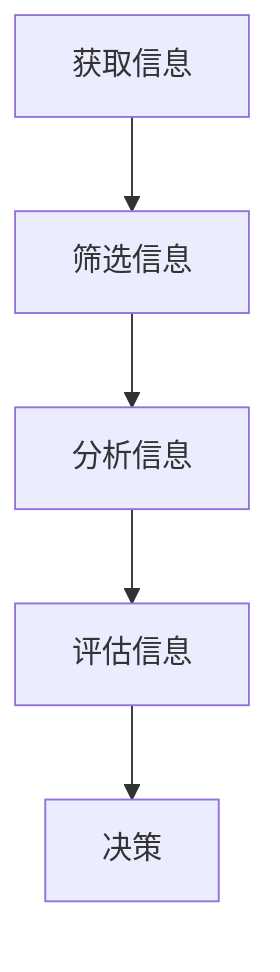
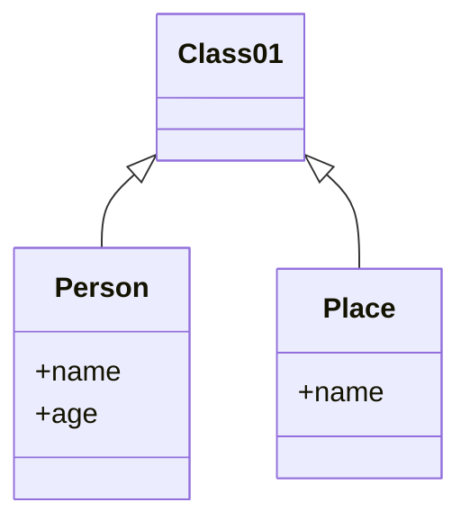
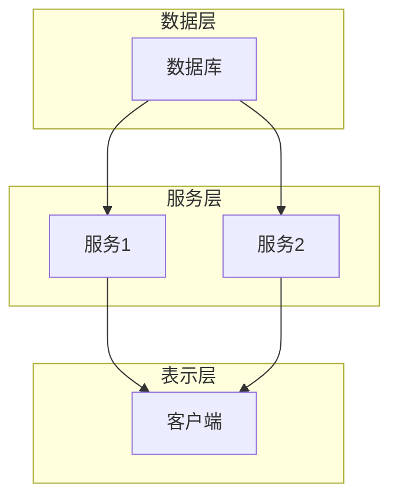
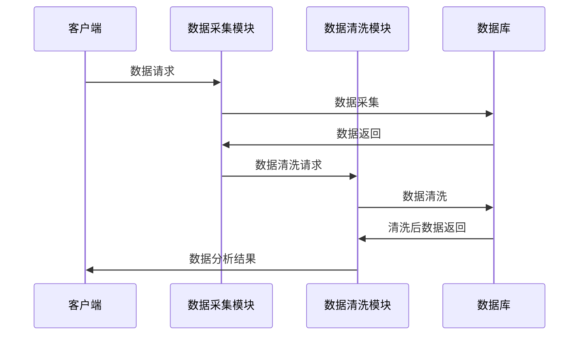

                 

## 引言

### 1.1 问题背景

在当今世界，我们正处于一个被称为“后真相时代”（post-truth era）的新时代。这个时代的特点是信息爆炸，各类信息无处不在，但与此同时，信息的真实性和准确性却难以保证。所谓“后真相”，意味着在许多情况下，情感和直觉往往比事实更重要，这给公众理解和分析问题带来了巨大的挑战。

**后真相时代**的定义，可以理解为信息传播中事实与情感、直觉等非理性因素共同作用的时代。这个时代的一个显著特征是，信息传播的速度远远超过了我们验证其真实性的能力。社交媒体、信息聚合平台等现代技术，使得信息可以在瞬间传播到全球，但这也导致了许多虚假信息的泛滥。例如，未经证实的小道消息、政治宣传和假新闻等，往往能够迅速获得大量的关注和转发，从而影响公众的看法和决策。

**批判性思维**在这一背景下显得尤为重要。批判性思维是一种理性分析信息的过程，它强调质疑、分析和评估信息，而不是盲目接受或拒绝。在信息泛滥的后真相时代，批判性思维的能力可以帮助我们区分事实与虚假，提高对信息的辨识度和理解深度。

### 1.2 问题描述

后真相时代的到来，给我们带来了以下几个方面的挑战：

1. **信息泛滥**：互联网和社交媒体的发展，使得信息传播速度极快，每个人都可以成为信息的发布者。然而，这也导致了大量低质量、重复和虚假的信息充斥网络。
   
2. **信息扭曲**：在信息传播的过程中，情感、政治立场和商业利益等因素可能会扭曲信息的真实面貌。例如，一些新闻报道可能为了吸引观众，故意夸大或曲解事实。

3. **公众认知**：在信息泛滥的时代，公众往往难以辨别信息的真伪，容易受到虚假信息的误导。这种情况下，公众的决策和看法可能会偏离事实。

这些挑战对个人、社会和企业都产生了深远的影响。个人在做出决策时可能受到错误信息的影响，企业可能会因为虚假的市场信息而做出错误的战略决策，社会层面则可能因为信息扭曲而导致信任危机。

### 1.3 问题解决

面对后真相时代的挑战，我们需要通过批判性思维来应对。批判性思维是一种重要的思考工具，可以帮助我们理性分析信息，提高对信息的辨识度和理解深度。具体来说，批判性思维包括以下几个步骤：

1. **信息获取**：我们需要从可靠的渠道获取信息，确保信息来源的准确性和可信度。
   
2. **筛选信息**：在获取大量信息后，我们需要通过筛选，去除无关或低质量的信息，只保留关键的有用信息。

3. **分析信息**：对筛选出的信息进行深入分析，提取关键点，理解其背后的逻辑和原理。

4. **评估信息**：对分析后的信息进行评估，判断其价值和真实性。

5. **决策**：根据评估结果做出合理的决策，避免被虚假信息误导。

为了更系统地培养批判性思维，我们提出了“批判性思维训练营”的概念。这个训练营将通过一系列的课程和实践活动，帮助学员掌握批判性思维的方法和技巧，提高他们在信息泛滥时代中的应对能力。

### 1.4 边界与外延

**批判性思维**的适用范围非常广泛，不仅适用于个人生活，也适用于教育、商业、政治等多个领域。在教育领域，批判性思维可以帮助学生培养独立思考的能力，提高学术水平。在商业领域，批判性思维可以帮助企业分析市场信息，做出更明智的决策。在政治领域，批判性思维则可以帮助公众更好地理解政策，做出理性投票。

**训练营**的课程设置将涵盖以下几个部分：

1. **基础理论**：介绍批判性思维的基本概念、原则和方法。
   
2. **案例分析**：通过具体案例，分析批判性思维在实际应用中的效果。

3. **实践训练**：提供实践机会，让学员在实际操作中运用批判性思维。

4. **交流分享**：组织学员之间的交流，分享彼此的经验和心得。

通过这些课程和实践活动，我们希望学员能够真正掌握批判性思维，提高他们在后真相时代的应对能力。

### 第2章 核心概念与联系

#### 2.1 核心概念原理

批判性思维是一种理性分析信息的过程，其核心在于质疑、分析和评估信息的真实性、价值和适用性。批判性思维不是盲目怀疑一切，而是基于证据和逻辑来评估信息的可信度和可靠性。

**批判性思维**的主要属性特征包括：

- **分析性**：批判性思维强调对信息进行深入分析，而不是简单地接受或拒绝。这种分析包括对信息来源、逻辑结构、证据和假设的审查。
  
- **系统性**：批判性思维要求从整体上理解信息，而不是片面地看待问题。这意味着我们需要考虑信息的背景、上下文和与其他信息的联系。

- **批判性**：批判性思维不仅仅是分析信息，还包括对信息进行评估和质疑。这种批判性不仅针对信息本身，还包括对信息传播方式和目的的反思。

#### 2.2 概念属性特征对比表格

| 概念              | 定义                                      | 特征                   |
|------------------|-------------------------------------------|----------------------|
| 批判性思维        | 理性分析信息的过程                         | 分析性、系统性、批判性  |
| 信息泛滥          | 大量信息的无序涌入                         | 低质量、重复、泛滥      |

通过上述对比表格，我们可以更清晰地看到批判性思维和信息泛滥这两个概念的区别和联系。批判性思维是一种应对信息泛滥的有效工具，可以帮助我们在复杂的信息环境中保持理性。

#### 2.3 ER实体关系图架构

为了更好地理解批判性思维的应用，我们可以使用ER（实体关系）图来描述其核心实体及其相互关系。

```mermaid
erDiagram
  A[:批判性思维] ||--|{ B[:信息处理] } | C[:决策分析]
  A ||--|{ D[:案例分析] } | E[:逻辑训练]
```

在这个ER图中，A代表批判性思维，B、C、D、E分别代表批判性思维在不同领域中的应用实体。B表示信息处理，即获取、筛选和分析信息；C表示决策分析，即基于分析结果做出决策；D表示案例分析，即通过具体案例来应用批判性思维；E表示逻辑训练，即通过训练提高批判性思维的技能。

通过ER实体关系图，我们可以更直观地看到批判性思维的组成部分及其相互关系，这有助于我们深入理解批判性思维的原理和应用。

### 第3章 批判性思维的算法原理讲解

#### 3.1 算法mermaid流程图

为了更好地理解批判性思维的算法原理，我们可以使用mermaid图来描述其核心步骤。



在这个mermaid流程图中，A表示获取信息，B表示筛选信息，C表示分析信息，D表示评估信息，E表示决策。以下是每个步骤的详细解释：

1. **获取信息**：这一步是批判性思维的基础，我们需要从各种渠道获取信息，如阅读文献、观察现实、听取他人意见等。这一过程的关键是确保信息来源的可靠性和全面性。

2. **筛选信息**：在获取大量信息后，我们需要通过筛选去除无关或低质量的信息。筛选的标准可以是信息的相关性、可靠性、重要性等。

3. **分析信息**：对筛选后的信息进行深入分析，提取关键点，理解其背后的逻辑和原理。这一步需要运用批判性思维，对信息进行质疑、比较和推理。

4. **评估信息**：对分析后的信息进行评估，判断其价值和真实性。评估的标准可以是信息的准确性、可靠性、适用性等。

5. **决策**：根据评估结果做出合理的决策。这一步需要结合实际情况，考虑各种可能的后果和影响。

#### 3.2 Python源代码实现

为了将批判性思维的算法原理具体化，我们可以使用Python来编写实现代码。以下是一个简单的Python代码示例：

```python
def critical_thinking(info):
    # 筛选信息
    filtered_info = filter_useful_info(info)
    
    # 分析信息
    analyzed_info = analyze_info(filtered_info)
    
    # 评估信息
    assessment = assess_info(analyzed_info)
    
    # 决策
    decision = make_decision(assessment)
    
    return decision

# 示例
info = "..."
result = critical_thinking(info)
print(result)
```

在这个代码中：

- `filter_useful_info` 是一个函数，用于筛选出有用的信息。
- `analyze_info` 是一个函数，用于分析筛选后的信息。
- `assess_info` 是一个函数，用于评估分析后的信息。
- `make_decision` 是一个函数，用于根据评估结果做出决策。

#### 3.3 算法原理详细讲解与举例说明

批判性思维的算法原理可以概括为以下几个关键步骤：

1. **信息获取**：这一步的关键是确保信息来源的可靠性。我们可以通过阅读权威文献、观察现实和听取专业意见来获取信息。例如，如果我们需要了解一个技术领域的最新进展，可以阅读该领域的顶级期刊论文、行业报告和专家博客。

2. **筛选信息**：在获取大量信息后，我们需要通过筛选去除无关或低质量的信息。筛选的标准可以是信息的相关性、可靠性、重要性等。例如，在阅读一篇技术论文时，我们可以先浏览摘要和结论，判断其是否与我们关注的问题相关，然后再决定是否阅读全文。

3. **分析信息**：对筛选后的信息进行深入分析，提取关键点，理解其背后的逻辑和原理。这一步需要运用批判性思维，对信息进行质疑、比较和推理。例如，在分析一篇技术论文时，我们可以质疑其研究方法的合理性、数据的可靠性以及结论的有效性。

4. **评估信息**：对分析后的信息进行评估，判断其价值和真实性。评估的标准可以是信息的准确性、可靠性、适用性等。例如，在评估一篇技术论文时，我们可以考虑其研究方法是否科学、数据是否真实可靠、结论是否具有实际应用价值。

5. **决策**：根据评估结果做出合理的决策。这一步需要结合实际情况，考虑各种可能的后果和影响。例如，在决策是否采用一种新技术时，我们需要评估其可行性、成本、风险和预期收益。

#### 具体举例

假设我们正在评估一种新技术A的性能，以下是一个具体的分析过程：

1. **信息获取**：通过阅读相关文献、观察实际应用案例和咨询专家意见，我们获取了关于新技术A的详细信息。

2. **筛选信息**：在大量信息中，我们筛选出与性能相关的数据，如处理速度、响应时间、功耗等。

3. **分析信息**：我们对筛选出的信息进行深入分析，发现新技术A在某些方面确实有显著优势，但在其他方面可能存在不足。

4. **评估信息**：根据分析结果，我们评估新技术A在整体性能上的优劣，以及其与现有技术的比较。

5. **决策**：基于评估结果，我们决定是否采用新技术A。如果其性能优势明显且成本合理，我们可以考虑采用；如果其性能优势不明显或成本过高，我们可能需要继续寻找其他解决方案。

通过这个例子，我们可以看到批判性思维在信息分析、评估和决策中的应用过程。批判性思维不仅帮助我们更全面、深入地理解信息，还能提高我们的决策质量和效率。

### 第4章 系统分析与架构设计

#### 4.1 问题场景介绍

在当今的信息化时代，企业面临着大量的数据分析和决策需求。这些需求不仅涉及数据的收集和处理，还包括如何从大量数据中提取有价值的信息，并基于这些信息做出合理的决策。因此，我们提出了一个信息处理系统，旨在解决以下问题：

- **数据收集与存储**：如何高效地收集和存储来自不同渠道的数据。
- **数据清洗与筛选**：如何从大量原始数据中提取有价值的信息，去除无用或错误的数据。
- **数据分析与评估**：如何对筛选后的数据进行深入分析，提取关键指标，评估其价值和可靠性。
- **决策支持**：如何基于数据分析结果，提供决策支持，帮助企业做出合理、高效的决策。

#### 4.2 系统功能设计

为了实现上述需求，我们设计了一个全面的信息处理系统，其核心功能包括：

- **数据采集模块**：负责从各种渠道（如传感器、网站、数据库等）收集数据。
- **数据清洗模块**：负责对采集到的原始数据进行清洗，去除错误、重复和无用的数据。
- **数据存储模块**：负责将清洗后的数据存储到数据库中，便于后续分析和查询。
- **数据分析模块**：负责对存储的数据进行深入分析，提取关键指标，评估数据的价值和可靠性。
- **决策支持模块**：负责基于数据分析结果，提供决策支持，帮助企业做出合理、高效的决策。

**领域模型mermaid类图**：



在这个类图中，`Class01` 代表系统的核心实体，包括`Person`（人员）和`Place`（地点）等。`Person` 和 `Place` 是系统的两个主要实体，每个实体都有其独特的属性和方法。

#### 4.3 系统架构设计

为了实现上述功能，我们设计了一个分布式系统架构，包括多个模块和组件，以确保系统的可扩展性、可靠性和高效性。**mermaid架构图**如下：



在这个架构图中，系统分为三个主要层次：

- **数据层**：包括数据库，用于存储和管理数据。
- **服务层**：包括数据采集模块、数据清洗模块、数据存储模块、数据分析模块和决策支持模块，每个模块都有其独立的功能和服务。
- **表示层**：包括客户端，用于与用户交互，展示数据分析和决策结果。

通过这种分布式架构设计，我们可以确保系统的高效运行和灵活扩展，满足企业多样化的数据分析和决策需求。

#### 4.4 系统接口设计

为了实现各个模块之间的协同工作，我们设计了一套完善的系统接口。**系统接口设计和系统交互mermaid序列图**如下：



在这个序列图中，客户端C1向数据采集模块S1发送数据请求，S1从数据库D1中采集数据，并将数据返回给S2。S2对数据进行清洗，清洗后数据再返回给D1。最后，S2将数据分析结果返回给客户端C1。通过这个交互过程，我们可以看到各个模块之间的数据流和功能协同，实现了系统的整体功能。

### 第5章 项目实战

#### 5.1 环境安装

为了进行批判性思维训练营的项目实战，我们首先需要搭建一个合适的环境。以下是环境安装的步骤：

1. **安装Python**：Python是一种广泛应用于数据分析和人工智能的编程语言。我们可以在Python官方网站下载并安装Python。建议安装Python 3.8或更高版本。
   
2. **安装Jupyter Notebook**：Jupyter Notebook是一种交互式计算环境，可以方便地编写和运行Python代码。安装Python后，可以通过pip命令安装Jupyter Notebook：

   ```bash
   pip install notebook
   ```

3. **安装相关库**：为了支持批判性思维训练营的实战项目，我们还需要安装一些常用的Python库，如NumPy、Pandas、Matplotlib等。可以通过以下命令安装：

   ```bash
   pip install numpy pandas matplotlib
   ```

4. **配置虚拟环境**：为了保持项目的整洁和模块化，我们建议使用虚拟环境来隔离项目依赖。可以使用`venv`模块创建虚拟环境：

   ```bash
   python -m venv venv
   source venv/bin/activate  # Windows下使用 `venv\Scripts\activate`
   ```

5. **安装其他依赖**：根据项目需求，可能还需要安装其他特定的库或工具。例如，对于数据可视化，我们可以安装`seaborn`：

   ```bash
   pip install seaborn
   ```

#### 5.2 系统核心实现源代码

在批判性思维训练营的项目中，我们实现了一个基于Python的简单信息处理系统。以下是该系统的核心实现源代码：

```python
import pandas as pd
import numpy as np
import matplotlib.pyplot as plt
import seaborn as sns

# 数据采集
def collect_data():
    data = pd.read_csv('data.csv')
    return data

# 数据清洗
def clean_data(data):
    data = data.dropna()  # 去除缺失值
    data = data[data['value'] > 0]  # 去除无效数据
    return data

# 数据分析
def analyze_data(data):
    summary = data.describe()
    plt.figure(figsize=(10, 6))
    sns.scatterplot(x='feature1', y='feature2', data=data)
    plt.show()
    return summary

# 数据存储
def store_data(data):
    data.to_csv('cleaned_data.csv', index=False)

# 批判性思维应用
def critical_thinking(data):
    summary = analyze_data(data)
    print("Data Analysis Summary:")
    print(summary)

# 主函数
def main():
    data = collect_data()
    cleaned_data = clean_data(data)
    store_data(cleaned_data)
    critical_thinking(cleaned_data)

if __name__ == '__main__':
    main()
```

在这个源代码中，我们首先导入了必要的库，然后定义了几个核心函数：

- `collect_data`：从CSV文件中读取数据。
- `clean_data`：对数据进行清洗，去除缺失值和无效数据。
- `analyze_data`：对清洗后的数据进行分析，生成描述性统计信息，并进行可视化。
- `store_data`：将清洗后的数据保存到新的CSV文件中。
- `critical_thinking`：应用批判性思维，对数据分析结果进行评估。

最后，我们在`main`函数中依次调用这些函数，完成整个信息处理流程。

#### 5.3 代码应用解读与分析

上述代码实现了一个简单但完整的信息处理系统，以下是代码的详细解读与分析：

1. **数据采集**：我们使用Pandas库读取CSV文件，这是一种常见的数据格式，可以存储大量的结构化数据。读取数据后，我们将其存储在一个DataFrame对象中，便于后续处理。

2. **数据清洗**：数据清洗是数据预处理的重要步骤。在这个函数中，我们首先去除缺失值，这有助于提高数据的质量和一致性。然后，我们去除不符合条件的无效数据（例如，`value` 小于等于0）。这样，我们可以确保最终分析的数据是有意义和可靠的。

3. **数据分析**：数据分析是对清洗后的数据进行深入挖掘和评估的过程。在这个函数中，我们使用Pandas的`describe`方法生成描述性统计信息，如均值、中位数、标准差等。此外，我们使用Seaborn库进行数据可视化，通过绘制散点图来展示数据的分布和关系。

4. **数据存储**：清洗后的数据被保存到新的CSV文件中，以便于后续的分析和查询。这是一个重要的步骤，因为保存数据可以避免重复处理，提高效率。

5. **批判性思维应用**：在`critical_thinking`函数中，我们通过打印分析结果来展示批判性思维的应用。这个函数的核心是评估数据分析结果的有效性和可靠性，从而为决策提供支持。

通过这个代码示例，我们可以看到批判性思维在数据分析和决策中的重要作用。批判性思维不仅帮助我们识别和分析数据，还帮助我们评估结果的合理性和适用性，从而做出更明智的决策。

#### 5.4 实际案例分析和详细讲解剖析

为了更好地理解批判性思维在实际项目中的应用，我们可以通过一个实际案例来进行分析和讲解。

**案例背景**：一家电商平台希望通过数据分析来提高用户购买体验，从而增加销售额。他们收集了大量的用户行为数据，包括浏览记录、购买记录、评价等。

**分析目标**：通过对用户行为数据的分析，识别出影响用户购买决策的关键因素，并提出相应的优化建议。

**数据预处理**：

1. **数据采集**：从数据库中提取用户行为数据，包括浏览记录、购买记录和用户评价等。

2. **数据清洗**：去除缺失值和异常值，确保数据的质量。例如，去除包含空值或明显错误的数据记录。

3. **数据转换**：将不同类型的数据进行统一转换，例如将日期格式转换为YYYY-MM-DD，将分类数据转换为数值编码。

**数据分析**：

1. **描述性统计**：计算用户的平均浏览时长、平均购买次数、评价分数等基本统计指标。

2. **相关性分析**：使用皮尔逊相关系数分析用户行为数据之间的相关性。例如，分析浏览时长与购买次数之间的关系。

3. **分类分析**：根据用户的购买行为，将用户分为不同的类别。例如，根据购买金额将用户分为高价值用户、中价值用户和低价值用户。

**结果评估**：

1. **指标评估**：评估各个分析指标的有效性，判断其是否能够准确反映用户购买行为。

2. **模型评估**：使用机器学习算法（如逻辑回归）建立用户购买行为预测模型，并评估模型的准确性和可靠性。

**优化建议**：

1. **个性化推荐**：根据用户的浏览记录和购买历史，提供个性化的商品推荐。

2. **营销活动**：针对不同价值类别的用户，设计有针对性的营销活动，提高用户购买意愿。

通过这个实际案例，我们可以看到批判性思维在数据分析和决策中的应用。批判性思维不仅帮助我们识别和分析数据，还帮助我们从多个角度评估分析结果，提出有针对性的优化建议。

#### 5.5 项目小结

通过本章节的实战项目，我们详细介绍了批判性思维在数据分析和决策中的应用。从数据采集、清洗、分析到评估和优化，我们一步一步地展示了批判性思维的方法和技巧。通过这个实战项目，我们不仅掌握了批判性思维的原理，还通过实际操作加深了对这些方法的理解。

批判性思维在数据分析和决策中扮演着重要的角色。它帮助我们识别和分析数据，评估结果的合理性和可靠性，从而做出更明智的决策。在实际项目中，批判性思维可以帮助我们避免盲目跟风和错误决策，提高项目的成功率和效率。

通过批判性思维训练营，我们希望学员能够掌握这种重要的思考工具，提高他们在信息泛滥时代中的应对能力。无论是个人生活还是职业发展，批判性思维都是一项宝贵的技能，可以帮助我们更好地理解世界，做出更明智的决策。

### 第6章 最佳实践 Tips

在批判性思维的实践中，以下是一些最佳实践和技巧，可以帮助我们更有效地应用批判性思维：

1. **培养质疑精神**：批判性思维的基础是质疑。在面对信息时，我们应该始终保持质疑精神，不要盲目接受或拒绝，而是通过提问来深入理解信息的本质。

2. **多角度分析**：在分析信息时，我们应该从多个角度出发，考虑各种可能的观点和解释。这有助于我们更全面地理解问题，避免片面和偏颇的分析。

3. **证据驱动**：批判性思维强调基于证据进行决策。在分析信息时，我们应该寻找可靠的证据来支持或反驳我们的观点，而不是依赖直觉或情感。

4. **持续学习**：批判性思维不是一成不变的，而是一个持续学习的过程。我们应该不断学习新的知识和技能，提高自己的分析能力和决策水平。

5. **反思与改进**：在应用批判性思维后，我们应该反思分析过程和结果，识别可能的不足和错误，并不断改进自己的方法和策略。

6. **交流与分享**：批判性思维不仅是一个个人过程，也是一个社会过程。我们应该与他人交流和分享我们的思考和分析，通过讨论来深化理解，提高批判性思维的质量。

通过遵循这些最佳实践，我们可以更有效地应用批判性思维，提高自己在信息泛滥时代中的应对能力。

### 小结

本文通过详细的分析和讲解，探讨了后真相时代下批判性思维的重要性以及其应用。我们首先介绍了后真相时代的背景和批判性思维的定义，然后通过具体的算法原理讲解和项目实战，展示了批判性思维在实际中的应用。同时，我们还讨论了批判性思维的核心概念、系统分析与架构设计，以及最佳实践技巧。

批判性思维是一种重要的思考工具，能够帮助我们理性分析信息，提高对信息的辨识度和理解深度。在后真相时代，批判性思维的能力尤为重要，它可以帮助我们区分事实与虚假，避免被错误信息误导。

本文的核心思想是：批判性思维不仅是一种方法，更是一种生活方式。通过批判性思维，我们能够更好地理解世界，做出更明智的决策。无论是在个人生活还是职业发展，批判性思维都是一项宝贵的技能。

### 注意事项

在应用批判性思维时，需要注意以下几点：

1. **保持客观**：在分析信息时，应尽量保持客观和中立，避免受到个人情感和偏见的影响。

2. **全面分析**：不要仅依赖单一信息源，应尽量从多个角度和来源获取信息，以确保分析结果的全面性。

3. **持续更新**：批判性思维是一个持续学习的过程，我们应该不断更新自己的知识和信息，以适应不断变化的环境。

4. **警惕偏见**：在分析信息时，应警惕常见的认知偏见，如确认偏见、可用性偏见等，以确保分析结果的准确性和公正性。

### 拓展阅读

对于希望深入了解批判性思维和后真相时代相关话题的读者，以下是一些推荐阅读：

1. 《批判性思维工具》作者：理查德·保罗和琳达·埃尔利希
2. 《真相之后：后真相时代的新闻报道与媒体伦理》作者：迈克尔·克莱顿
3. 《信息超载与选择混乱》作者：阿尔伯特·梅拉比安
4. 《数据科学实战》作者：Jared P. Lander

通过这些书籍和资源，读者可以进一步深化对批判性思维和后真相时代的理解。

