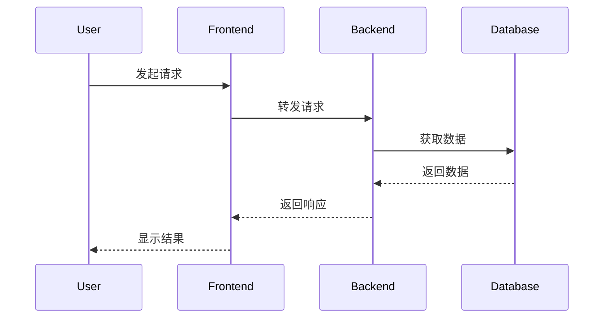

                 

## 《后真相时代的批判性思维训练营》

> 关键词：后真相时代、批判性思维、信息真实性、数字素养、技术教育

> 摘要：本文探讨了后真相时代的来临对信息真实性带来的挑战，以及批判性思维在这一背景下的重要性。文章通过介绍批判性思维的基础概念、技能训练方法，结合实际项目实战，构建了一个系统化的批判性思维训练营，旨在提升公众的数字素养，培养更加理性和客观的思考习惯。

---

### 第1章 引言与背景

#### 1.1 后真相时代的概念与特征

后真相时代（Post-Truth Era）是指信息传播不再以事实为基础，而是以情感、偏见和影响为导向的时代。在这一时代，虚假信息、谣言和误导性内容泛滥，使得公众难以区分真相与虚假。社交媒体、网络新闻和即时通讯工具的普及，加速了信息的传播，同时也为制造和传播虚假信息提供了便利。

#### 1.2 批判性思维的重要性

在这样一个充满不确定性和信息过载的时代，批判性思维显得尤为重要。批判性思维是一种理性分析、评估和解决问题的方式，它不仅有助于我们识别和质疑虚假信息，还能培养我们独立思考、辨别是非的能力。在数字时代，培养批判性思维是提升数字素养、应对信息挑战的关键。

#### 1.3 训练营的目的与结构

本文将介绍一个后真相时代的批判性思维训练营，旨在通过系统的训练，提高参与者的批判性思维能力。训练营包括基础概念介绍、技能训练、实际项目实战等多个环节，旨在培养参与者成为信息时代的理性思考者。

### 1.4 边界与外延

批判性思维虽然重要，但也有其局限性。它不能代替情感、直觉和创造力。在实际应用中，我们需要根据具体情况，结合多种思维方式，以达到最佳效果。

#### 1.5 概念结构与核心要素组成

批判性思维包含以下几个核心要素：分析、评估、推理、论证、证据和事实。这些要素相互作用，共同构成了批判性思维的概念结构。

## 第2章 批判性思维的基础概念

### 2.1 批判性思维的核心要素

批判性思维的核心要素包括分析、评估、推理、论证、证据和事实。以下是对这些要素的详细解释：

#### 2.1.1 分析

分析是指将复杂的信息或问题分解成更小的部分，以便更好地理解和处理。在批判性思维中，分析是第一步，它有助于我们识别问题的各个方面，并理解其中的逻辑关系。

#### 2.1.2 评估

评估是指对信息或观点的准确性、可靠性和有效性进行判断。在批判性思维中，评估是一个持续的过程，它要求我们不断地质疑和验证所获得的信息。

#### 2.1.3 推理

推理是指从已知的信息或事实中推断出新的结论。在批判性思维中，推理是一种重要的工具，它有助于我们构建逻辑严密、符合现实的论证。

#### 2.1.4 论证

论证是指用逻辑和证据支持一个观点或结论。在批判性思维中，论证是一个重要的环节，它要求我们能够清晰地表达自己的观点，并合理地使用证据来支持这些观点。

#### 2.1.5 证据

证据是指用于支持论证的事实或信息。在批判性思维中，证据是至关重要的，它有助于我们区分真相与虚假，避免盲目接受信息。

#### 2.1.6 事实

事实是指真实存在的事物或情况。在批判性思维中，事实是判断信息真实性的基础，它要求我们基于客观事实进行思考和决策。

### 2.2 批判性思维与创造性思维的关系

批判性思维和创造性思维是两种不同的思维方式，但它们之间存在密切的联系。批判性思维强调理性分析、评估和推理，而创造性思维则侧重于创新、想象和发现。在实际应用中，我们需要结合这两种思维，以达到最佳效果。

### 2.3 批判性思维的发展与培养

批判性思维不是天生的，而是可以通过教育和实践逐步培养的。儿童和青少年时期是培养批判性思维的关键时期，而成人也可以通过不断的学习和实践来提升批判性思维能力。

### 第3章 批判性思维的技能训练

#### 3.1 阅读与分析

阅读是批判性思维的基础，通过阅读，我们可以获取大量的信息和知识。然而，仅仅阅读是不够的，我们还需要学会如何分析和评估所阅读的内容。

#### 3.1.1 提高阅读效率

提高阅读效率是批判性思维训练的第一步。以下是一些实用的技巧：

- **预读**：在阅读之前，快速浏览文章的标题、摘要和目录，了解文章的主旨和结构。
- **速读**：通过快速阅读，捕捉文章的关键信息和观点。
- **精读**：在理解了文章的大致内容后，再进行深入阅读，理解和消化文章的细节。

#### 3.1.2 分析文本的论证结构

分析文本的论证结构是批判性思维的重要技能。以下是一些实用的技巧：

- **识别论点与论据**：明确文章的论点和论据，理解作者的观点和理由。
- **分析逻辑关系**：识别论点与论据之间的逻辑关系，判断论证的有效性。
- **质疑和反驳**：对文章的论证提出质疑，寻找可能的反驳点。

#### 3.1.3 批判性阅读的实践技巧

批判性阅读不仅是一种技能，更是一种习惯。以下是一些实践技巧：

- **多角度思考**：从不同的角度理解文章的内容，避免盲目接受作者的观点。
- **跨学科阅读**：结合不同学科的知识，对文章的内容进行综合分析。
- **记录和反思**：阅读后记录自己的理解和思考，定期进行反思和总结。

## 第4章 听力与辨别

在信息爆炸的时代，我们的耳朵也成为信息收集的重要渠道。然而，如何辨别信息的真伪，是我们在批判性思维中需要面对的挑战。

#### 3.2.1 提高听力理解能力

提高听力理解能力是批判性思维的重要环节。以下是一些实用的技巧：

- **专注聆听**：在听讲或听报告时，保持专注，避免分心。
- **主动提问**：在听讲过程中，主动提问，以加深对内容的理解。
- **复述与总结**：听后复述或总结所听内容，以验证自己的理解。

#### 3.2.2 辨别信息真伪

辨别信息真伪是批判性思维的核心技能。以下是一些实用的技巧：

- **查证来源**：对信息来源进行核实，确保其可靠性。
- **交叉验证**：通过多个来源验证信息的真实性。
- **理性分析**：对信息进行理性分析，避免盲目接受。

#### 3.2.3 批判性听力训练方法

批判性听力训练方法包括：

- **模拟对话**：通过模拟对话，提高对信息的理解和分析能力。
- **听力测试**：通过听力测试，评估自己的批判性听力水平。
- **案例分析**：分析真实案例，学习如何辨别信息的真伪。

## 第5章 表达与沟通

批判性思维不仅要求我们能够理解和分析信息，还需要我们能够有效地表达和沟通。

#### 3.3.1 明确表达

明确表达是批判性思维的重要体现。以下是一些实用的技巧：

- **清晰表达**：用简洁明了的语言表达自己的观点和想法。
- **逻辑清晰**：确保自己的表达具有逻辑性，避免逻辑混乱。
- **举例说明**：用具体的事例来支持自己的观点。

#### 3.3.2 有效沟通

有效沟通是批判性思维的关键。以下是一些实用的技巧：

- **倾听**：倾听他人的观点，避免打断和争辩。
- **尊重**：尊重他人的观点，即使不同意也要给予尊重。
- **提问**：通过提问，加深对他人观点的理解。

#### 3.3.3 批判性沟通

批判性沟通是在尊重和理解的基础上，对他人观点进行理性分析和评估。以下是一些实用的技巧：

- **理性分析**：对他人观点进行理性分析，避免情绪化的评价。
- **建设性批评**：提出建设性的批评和建议，避免攻击性语言。
- **反馈**：给予他人反馈，以促进双方的理解和沟通。

## 第6章 系统分析与架构设计方案

### 6.1 问题场景介绍

在当前的后真相时代，公众对于信息真实性的需求日益增长。为了应对这一挑战，我们需要一个系统化的批判性思维训练营，以提升公众的数字素养和批判性思维能力。

### 6.2 项目介绍

训练营项目旨在通过一系列课程和实践活动，帮助参与者掌握批判性思维的核心技能，提高他们对信息真实性的辨别能力。

### 6.3 系统功能设计

训练营的系统功能设计包括以下几个主要部分：

- **用户管理**：包括用户注册、登录、个人信息管理等功能。
- **课程管理**：包括课程发布、课程学习、课程评估等功能。
- **实践训练**：包括实践项目发布、实践任务分配、实践成果评估等功能。
- **数据分析**：包括用户学习数据统计、实践数据统计等功能。

### 6.4 系统架构设计

训练营的系统架构设计采用前后端分离的方式，前端负责用户交互和界面展示，后端负责数据处理和功能实现。以下是一个简化的系统架构图：



### 6.5 系统接口设计和系统交互

系统接口设计主要包括用户接口（UI）和后端接口（API）。以下是一个简化的系统接口图：

```mermaid
classDiagram
    User <<Interface>>
    Course <<Interface>>
    Practice <<Interface>>
    UserManagement <<Interface>>
    CourseManagement <<Interface>>
    PracticeManagement <<Interface>>

    UserManagement --|> User
    CourseManagement --|> Course
    PracticeManagement --|> Practice

    UserManagement -|> Backend
    CourseManagement -|> Backend
    PracticeManagement -|> Backend
```

系统交互流程如下：

1. 用户通过前端界面发起请求。
2. 前端将请求转发给后端。
3. 后端根据请求调用相应的接口，从数据库获取数据。
4. 后端将数据返回给前端。
5. 前端将结果呈现给用户。

## 第7章 项目实战

### 7.1 环境安装

搭建批判性思维训练营环境需要以下步骤：

1. 安装Python 3.x版本。
2. 安装Django框架。
3. 安装数据库（如MySQL或PostgreSQL）。
4. 配置虚拟环境，确保环境干净。

### 7.2 系统核心实现源代码

以下是一个简单的用户注册功能的源代码示例：

```python
# users/models.py
from django.db import models

class User(models.Model):
    username = models.CharField(max_length=150)
    email = models.EmailField()
    password = models.CharField(max_length=128)

    def __str__(self):
        return self.username
```

### 7.3 代码应用解读与分析

在上述源代码中，我们定义了一个`User`模型，用于存储用户的基本信息。这个模型包括`username`、`email`和`password`三个字段，分别用于存储用户的用户名、邮箱地址和密码。

在Django项目中，我们需要在`models.py`文件中定义模型，并在`admin.py`中注册模型，以便在后台管理界面中使用。此外，我们还需要在`views.py`中编写视图函数，处理用户注册的逻辑。

### 7.4 实际案例分析和详细讲解剖析

以下是一个实际的用户注册案例：

1. 用户访问注册页面，填写用户名、邮箱地址和密码。
2. 用户提交注册表单，前端将数据发送到后端。
3. 后端接收数据，验证用户输入的信息是否合法（如用户名是否已存在、邮箱格式是否正确等）。
4. 如果验证通过，将用户信息保存到数据库，并返回注册成功的消息。
5. 如果验证不通过，返回相应的错误消息。

在这个案例中，批判性思维的应用体现在对用户输入数据的验证和处理。我们需要确保用户输入的信息是合法的，以避免恶意注册和安全风险。

### 7.5 项目小结

通过本次项目实战，我们搭建了一个简单的批判性思维训练营环境，并实现了用户注册功能。这个项目虽然简单，但为我们提供了一个基础框架，可以在后续开发中逐步完善和扩展。

## 第8章 最佳实践 Tips、小结、注意事项、拓展阅读等内容

### 8.1 最佳实践 Tips

1. **持续学习**：批判性思维是一种能力，需要通过不断的实践和反思来提升。
2. **多角度思考**：在面对问题或信息时，尝试从不同的角度进行分析和评估。
3. **质疑权威**：不要盲目接受权威的观点，要敢于质疑和验证。
4. **记录思考过程**：在分析和评估信息时，记录自己的思考和过程，以便日后回顾和改进。

### 8.2 小结

本文介绍了后真相时代的概念和影响，阐述了批判性思维的重要性，并通过一个批判性思维训练营的项目实战，展示了如何在实际中应用批判性思维。通过本文的学习，我们希望读者能够掌握批判性思维的核心技能，提高信息真实性的辨别能力。

### 8.3 注意事项

1. **避免情绪化**：在批判性思维过程中，避免情绪化的判断，保持理性分析。
2. **避免偏见**：批判性思维要求我们客观、公正地分析信息，避免偏见的影响。
3. **持续学习**：批判性思维是一个持续的过程，需要我们不断地学习和实践。

### 8.4 拓展阅读

1. **《批判性思维技巧：教你如何思考》（《Think Critically: A Beginner's Guide to Critical Thinking》）**
2. **《数字素养：如何在信息时代生存》（《Digital Literacy: How to Survive in the Information Age》）**
3. **《真相的尺度：信息过载时代如何判断》（《The Truth Machine: The Data Growth That Will Change Everything》**

### 总结

在本文中，我们通过逐步分析推理的方式，详细介绍了后真相时代的批判性思维训练营。从背景介绍、核心概念、技能训练、实际项目到最佳实践，我们系统地讲解了批判性思维的重要性和应用方法。希望读者能够通过本文的学习，提升自己的批判性思维能力，更好地应对信息时代的挑战。作者：AI天才研究院/AI Genius Institute & 禅与计算机程序设计艺术 /Zen And The Art of Computer Programming。

