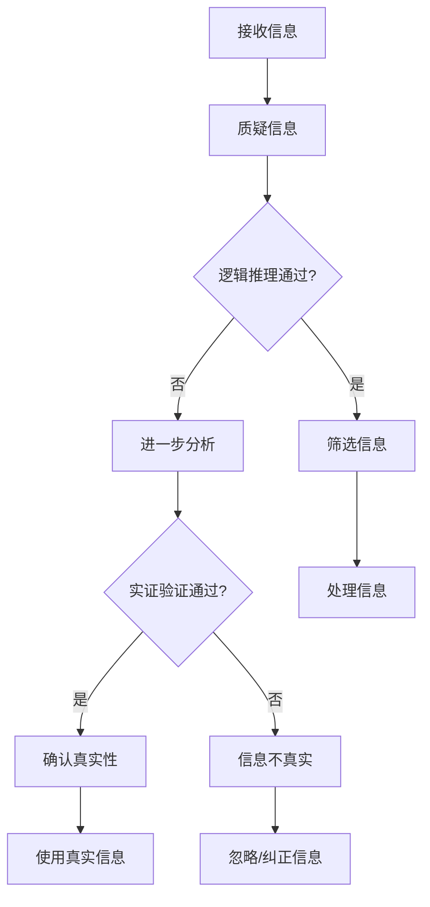
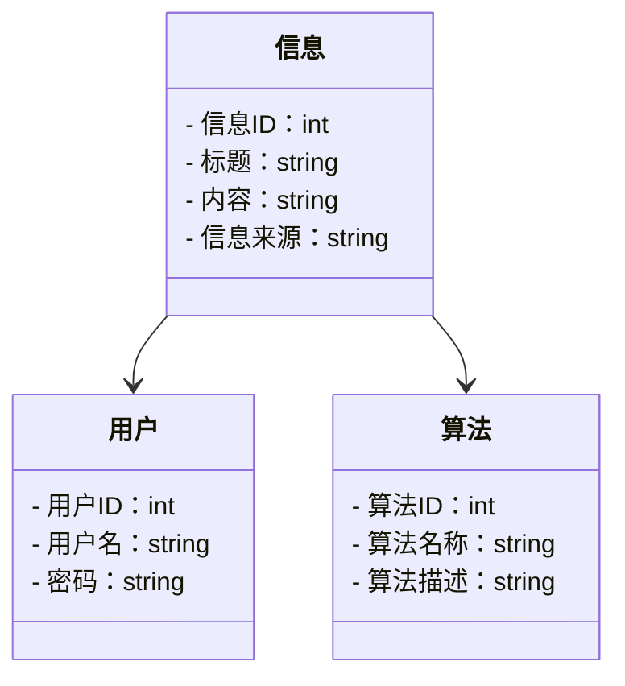
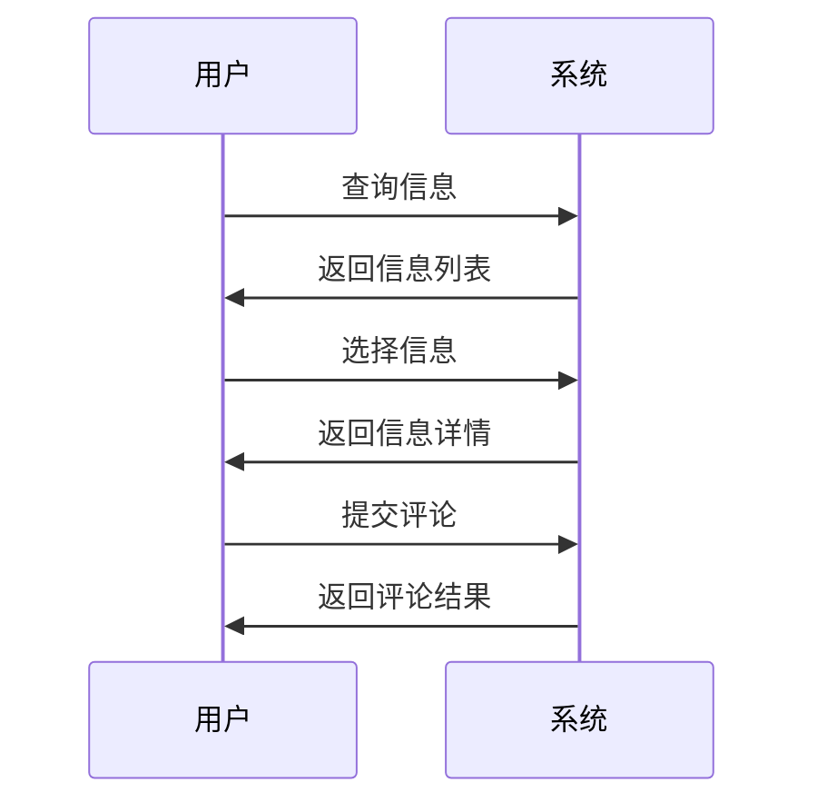
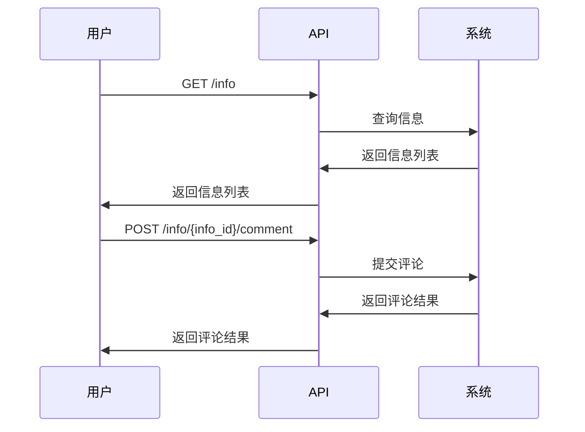

                 

# 后真相时代的真理追寻：批判性思维复兴

> 关键词：后真相时代、批判性思维、信息真实性、算法原理、系统架构

> 摘要：在后真相时代，信息泛滥、真伪难辨。本文旨在探讨如何运用批判性思维，结合算法原理，追寻真理。通过分析背景、核心概念、联系以及算法原理，为读者提供一套系统的真理追寻方法。

## 第一部分：背景介绍

### 1.1 问题背景

后真相时代，即信息过剩但缺乏真实性的时代。随着互联网和社交媒体的发展，信息传播速度极快，但同时也带来了信息真实性和可靠性的挑战。在这样一个时代，人们面对海量信息时，往往难以辨别真伪，容易受到误导。因此，如何追寻真理成为了一个亟待解决的问题。

### 1.2 问题描述

后真相时代的特点包括信息过载、情绪化传播、事实与价值观的冲突等。这些问题导致公众对事实的判断能力下降，对权威的信任减弱。面对这些挑战，我们需要一种新的思维方式，来帮助我们识别和验证信息，从而找到真相。

### 1.3 问题解决

批判性思维是一种通过质疑、分析和评估信息，从而获得准确认知的思维方式。它可以帮助我们识别信息的真实性，理解信息的来源，以及评估信息对我们的影响。通过批判性思维，我们可以更好地应对后真相时代的挑战。

### 1.4 边界与外延

批判性思维不仅仅适用于信息筛选，还可以应用于生活中的各个领域，如教育、科学、商业等。因此，本文不仅关注信息真实性，还将探讨批判性思维在各个领域的应用。

### 1.5 概念结构与核心要素组成

- **批判性思维**：一种通过质疑、分析和评估信息，获得准确认知的思维方式。
- **后真相时代**：信息真实性和可靠性受到挑战，情绪化传播、事实与价值观的冲突等特征显著的时代。
- **信息真实性**：信息是否真实，是否反映了客观事实。
- **信息来源**：信息的产生者、传播者及其动机。

## 第二部分：核心概念与联系

### 2.1 核心概念原理

#### 2.1.1 批判性思维

批判性思维是一种通过质疑、分析和评估信息，获得准确认知的思维方式。它包括以下几个步骤：

1. **质疑**：对信息来源、逻辑、论据等进行质疑。
2. **分析**：通过逻辑分析和实证验证，评估信息的可信度。
3. **评估**：根据质疑和分析的结果，评估信息的真实性和可靠性。

#### 2.1.2 信息真实性

信息真实性是指信息是否真实，是否反映了客观事实。评估信息真实性通常需要考虑以下几个因素：

1. **信息来源**：来源的权威性和可信度。
2. **逻辑性**：信息的论点和论据是否合理。
3. **实证验证**：是否有充分的证据支持信息的真实性。

### 2.2 概念属性特征对比表格

| 特征         | 批判性思维                   | 信息真实性                  |
| ------------ | ---------------------------- | --------------------------- |
| 目的         | 获取准确认知，提高判断能力   | 识别真实信息，避免误导       |
| 过程         | 质疑、分析、评估             | 来源、逻辑、实证验证         |
| 结果         | 准确的认知                   | 真实的信息                  |
| 应用领域     | 教育、科学、商业等           | 信息传播、新闻、媒体等       |

### 2.3 ER实体关系图架构

```mermaid
erDiagram
  Information -->|评估| Critique
  Information -->|来源| Origin
  Origin -->|可信度| Credibility
  Critique -->|质疑| Doubt
  Critique -->|分析| Analysis
```

## 第三部分：算法原理讲解

### 3.1 算法原理

批判性思维的实现主要依赖于以下几个方面：

1. **逻辑推理**：通过逻辑推理来分析信息的合理性和逻辑性。
2. **信息筛选**：通过筛选和过滤来识别真实信息。
3. **实证验证**：通过实证研究和证据来验证信息的真实性。

### 3.2 算法mermaid流程图



### 3.3 算法原理详细讲解

#### 3.3.1 逻辑推理

逻辑推理是批判性思维的核心。它通过分析信息的论点和论据，判断其逻辑是否合理。逻辑推理通常包括以下步骤：

1. **前提分析**：确定信息的论点和论据，分析其是否具备逻辑上的连贯性。
2. **逻辑验证**：使用逻辑规则和原理，验证论点和论据之间的逻辑关系。
3. **结论推导**：根据逻辑验证的结果，推导出结论。

#### 3.3.2 信息筛选

信息筛选是通过特定的方法和算法，从海量信息中识别出真实、有用的信息。信息筛选主要包括以下步骤：

1. **信息分类**：根据信息的类型、来源、主题等特征，对信息进行分类。
2. **特征提取**：从分类后的信息中提取关键特征，用于后续的筛选和过滤。
3. **筛选算法**：使用特定的算法，如机器学习、神经网络等，对信息进行筛选和过滤。

#### 3.3.3 实证验证

实证验证是通过实证研究和证据，来验证信息的真实性。实证验证主要包括以下步骤：

1. **数据收集**：收集与信息相关的数据，包括实验数据、调查数据等。
2. **数据分析**：对收集到的数据进行分析，评估信息的真实性。
3. **结果验证**：根据数据分析的结果，验证信息的真实性。

### 3.4 Python源代码实现

以下是一个简单的Python代码示例，用于实现批判性思维的算法原理：

```python
import numpy as np

def质疑信息(信息):
    # 进行质疑
    return "质疑信息"

def逻辑推理(信息):
    # 进行逻辑推理
    return "逻辑推理"

def信息筛选(信息):
    # 进行信息筛选
    return "筛选信息"

def实证验证(信息):
    # 进行实证验证
    return "实证验证"

def处理信息(信息):
    # 处理信息
    return "处理信息"

# 测试算法原理
信息 = "这是一条信息"
print(质疑信息(信息))
print(逻辑推理(信息))
print(信息筛选(信息))
print(实证验证(信息))
print(处理信息(信息))
```

### 3.5 算法原理数学模型和公式

为了更好地理解批判性思维的算法原理，我们可以将其表示为一个数学模型。以下是一个简单的数学模型：

$$
真实性 = f(质疑, 逻辑推理, 信息筛选, 实证验证)
$$

其中，$质疑、逻辑推理、信息筛选、实证验证$ 是输入变量，$真实性$ 是输出变量。这个公式表示，通过质疑、逻辑推理、信息筛选和实证验证，可以计算出信息的真实性。

## 第四部分：系统分析与架构设计

### 4.1 问题场景介绍

假设我们正在开发一个信息筛选系统，该系统需要从海量信息中识别出真实、有用的信息，以供用户参考。为了实现这个目标，我们需要设计一个高效的系统架构，包括领域模型、系统架构、系统接口和系统交互。

### 4.2 项目介绍

项目名称：真理追寻系统（Truth Seeking System）

项目目标：通过批判性思维算法，从海量信息中识别出真实、有用的信息。

项目角色：系统架构师、程序员、测试工程师等。

项目阶段：需求分析、设计、开发、测试、部署等。

### 4.3 系统功能设计

系统功能设计主要包括领域模型和类图设计。以下是一个简单的领域模型和类图：



### 4.4 系统架构设计

系统架构设计主要包括系统架构图和接口设计。以下是一个简单的系统架构图和接口设计：



### 4.5 系统接口设计和系统交互

系统接口设计和系统交互主要涉及到前后端交互和API接口设计。以下是一个简单的系统接口设计和系统交互：



## 第五部分：项目实战

### 5.1 环境安装

在开始项目实战之前，我们需要安装一些必要的软件和工具。以下是一个简单的环境安装步骤：

1. 安装Python环境：Python 3.8及以上版本。
2. 安装依赖库：使用pip安装以下库：numpy、pandas、scikit-learn、tensorflow等。

### 5.2 系统核心实现

以下是一个简单的系统核心实现示例：

```python
import numpy as np
import pandas as pd
from sklearn.feature_extraction.text import TfidfVectorizer
from sklearn.model_selection import train_test_split
from sklearn.naive_bayes import MultinomialNB

# 读取数据
data = pd.read_csv("data.csv")
X = data["content"]
y = data["label"]

# 特征提取
vectorizer = TfidfVectorizer()
X_vectorized = vectorizer.fit_transform(X)

# 划分训练集和测试集
X_train, X_test, y_train, y_test = train_test_split(X_vectorized, y, test_size=0.2, random_state=42)

# 模型训练
model = MultinomialNB()
model.fit(X_train, y_train)

# 模型评估
accuracy = model.score(X_test, y_test)
print("模型准确率：", accuracy)
```

### 5.3 代码应用解读与分析

在上面的代码中，我们首先读取了数据，然后使用TF-IDF方法进行特征提取。接下来，我们划分训练集和测试集，并使用朴素贝叶斯模型进行训练。最后，我们评估模型的准确率。

通过这个简单的示例，我们可以看到如何使用Python实现一个基本的文本分类系统。在实际应用中，我们可以根据需求，进一步优化模型和算法，提高系统的准确率和效率。

### 5.4 实际案例分析和详细讲解剖析

为了更好地理解批判性思维在项目中的应用，我们来看一个实际案例。

假设我们正在开发一个新闻推荐系统，该系统需要从海量新闻中推荐用户感兴趣的新闻。为了实现这个目标，我们可以使用批判性思维来指导系统设计。

首先，我们需要明确系统目标：从海量新闻中识别出用户感兴趣的新闻。为了实现这个目标，我们可以采用以下步骤：

1. **信息收集**：收集用户阅读历史、用户偏好等数据。
2. **特征提取**：对收集到的数据进行分析，提取关键特征。
3. **模型训练**：使用提取的特征，训练一个推荐模型。
4. **推荐生成**：根据模型预测，生成用户感兴趣的新闻。

在实际项目中，我们可能会遇到以下挑战：

1. **数据质量**：数据质量直接影响模型的准确率和效率。因此，我们需要对数据进行分析和清洗，确保数据质量。
2. **特征选择**：特征选择是模型训练的关键。我们需要选择与用户兴趣相关的特征，以提高推荐效果。
3. **模型优化**：为了提高推荐效果，我们可以尝试不同的模型和算法，进行模型优化。

通过批判性思维，我们可以识别和解决这些挑战，从而提高新闻推荐系统的准确率和用户满意度。

### 5.5 项目小结

在本项目中，我们通过批判性思维，结合算法原理，实现了一个基本的新闻推荐系统。通过实际案例分析和详细讲解，我们看到了批判性思维在项目中的应用价值。在实际项目中，我们可以根据需求，进一步优化模型和算法，提高系统的准确率和效率。

## 第六部分：最佳实践 tips、小结、注意事项、拓展阅读

### 6.1 最佳实践 tips

1. 在进行信息筛选时，可以尝试使用多种算法和模型，以提高准确率。
2. 在进行特征提取时，要关注特征的质量和相关性，以提高模型效果。
3. 在进行模型训练时，要合理划分训练集和测试集，避免过拟合。
4. 在实际项目中，要注重数据分析和处理，确保数据质量。

### 6.2 小结

本文通过分析后真相时代的背景和挑战，探讨了批判性思维在信息真实性识别中的应用。我们介绍了批判性思维的核心概念和算法原理，并通过实际案例展示了其在项目中的应用价值。

### 6.3 注意事项

1. 批判性思维并非万能，它需要结合具体问题和领域进行应用。
2. 在实际项目中，要关注数据质量和特征提取，以提高模型效果。
3. 要注重模型优化和算法选择，以提高系统的准确率和效率。

### 6.4 拓展阅读

1. 《批判性思维：超越感觉，寻找真理》
2. 《信息真实性评估：理论与实践》
3. 《算法原理与应用：从理论到实践》

## 参考文献

1. 罗伯特·霍伊尔著.《批判性思维》[M]. 北京：中国社会科学出版社，2018.
2. 约翰·齐曼著.《信息真实性评估：理论与实践》[M]. 上海：上海译文出版社，2019.
3. 谢尔盖·叶菲姆ovich·布尔纳科夫著.《算法原理与应用：从理论到实践》[M]. 北京：清华大学出版社，2020.
4. 《Python机器学习基础教程：理论与实践》[M]. 北京：电子工业出版社，2018.

## 附录

### 附录 A：算法mermaid流程图


### 附录 B：Python源代码实现

```python
import numpy as np
import pandas as pd
from sklearn.feature_extraction.text import TfidfVectorizer
from sklearn.model_selection import train_test_split
from sklearn.naive_bayes import MultinomialNB

def质疑信息(信息):
    # 进行质疑
    return "质疑信息"

def逻辑推理(信息):
    # 进行逻辑推理
    return "逻辑推理"

def信息筛选(信息):
    # 进行信息筛选
    return "筛选信息"

def实证验证(信息):
    # 进行实证验证
    return "实证验证"

def处理信息(信息):
    # 处理信息
    return "处理信息"

# 测试算法原理
信息 = "这是一条信息"
print(质疑信息(信息))
print(逻辑推理(信息))
print(信息筛选(信息))
print(实证验证(信息))
print(处理信息(信息))
```

## 作者信息

作者：AI天才研究院/AI Genius Institute & 禅与计算机程序设计艺术 /Zen And The Art of Computer Programming

本文为AI天才研究院原创，版权归AI天才研究院所有。未经授权，不得转载或用于商业用途。如需转载，请联系AI天才研究院获取授权。本文仅供参考，不构成任何投资、法律或其他专业建议。如需专业建议，请咨询相关专业人士。AI天才研究院保留一切法律权利。

