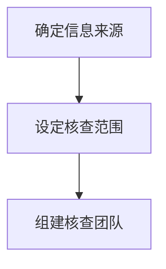
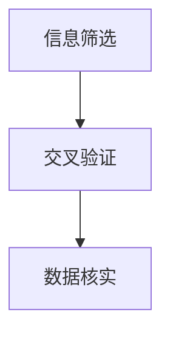
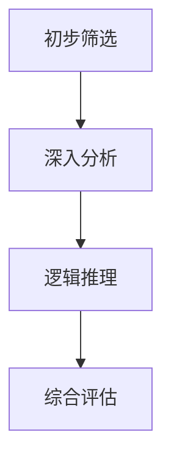
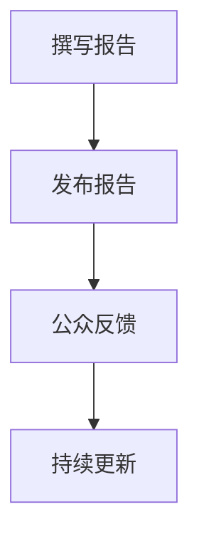
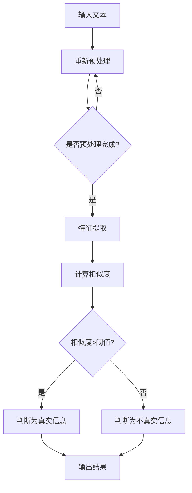
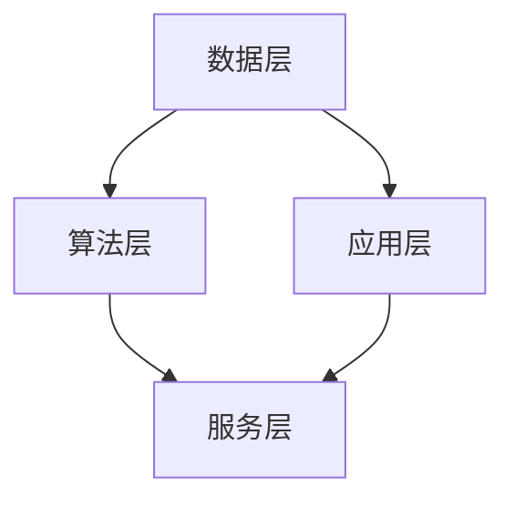
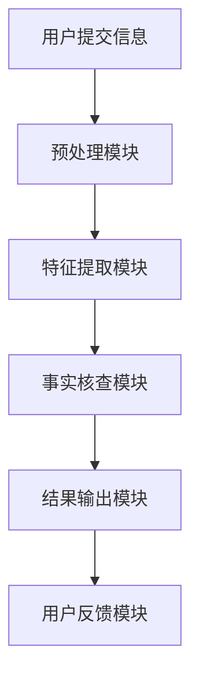

                 

## 后真相时代的真相追寻者：事实核查训练

在后真相时代，信息泛滥、假新闻横行的背景下，如何成为一名真相追寻者，掌握事实核查的技能，显得尤为重要。本文旨在通过逐步分析推理的方式，为您揭示事实核查的重要性和方法，帮助您成为这一时代的真相追寻者。

### 关键词
- 后真相时代
- 事实核查
- 真相追寻者
- 信息验证
- 算法

### 摘要
本文将首先介绍后真相时代的特征及其对社会的挑战，接着深入探讨事实核查的定义和重要性。然后，我们将逐步解析事实核查的流程和方法，重点介绍在媒体和社交网络中事实核查的应用。此外，还将详细讲解事实核查技术背后的算法原理，并通过一个具体项目实战来展示实际操作。最后，本文将对全文进行小结，并提出未来的发展方向。

### 目录

**第一部分：背景介绍**

**第1章：后真相时代的来临**  
1.1 后真相时代的定义  
1.2 后真相时代的特征  
1.3 后真相时代的挑战与机遇

**第2章：事实核查的重要性**  
2.1 事实核查的定义  
2.2 事实核查的作用  
2.3 事实核查与社会发展的关系

**第3章：事实核查的流程与方法**  
3.1 核查前的准备工作  
3.2 信息收集与验证  
3.3 分析与评估  
3.4 报告与传播

**第二部分：事实核查在实践中的应用**

**第4章：事实核查技术在媒体中的应用**  
4.1 媒体事实核查的现状  
4.2 媒体事实核查的成功案例  
4.3 媒体事实核查的挑战与对策

**第5章：事实核查技术在社交网络中的应用**  
5.1 社交网络事实核查的现状  
5.2 社交网络事实核查的成功案例  
5.3 社交网络事实核查的挑战与对策

**第三部分：事实核查技术与算法**

**第6章：事实核查技术与算法**  
6.1 事实核查算法的类型  
6.2 事实核查算法的工作原理  
6.3 事实核查算法的评估与改进

**第四部分：未来展望**

**第7章：事实核查的未来展望**  
7.1 事实核查技术的发展趋势  
7.2 事实核查在未来的应用场景  
7.3 事实核查面临的挑战与机遇

**第8章：小结与建议**  
8.1 事实核查的现实意义  
8.2 事实核查的实施建议  
8.3 事实核查的未来发展方向

---

接下来，我们将逐步深入探讨后真相时代的来临、事实核查的重要性及其流程与方法。

## 后真相时代的来临

### 1.1 后真相时代的定义

“后真相”这一概念最早由政治学家迈克尔·罗伯茨（Michael Rogers）在2016年提出，用以描述一个现象：信息传播的速度和广泛性超越了事实本身的影响。在后真相时代，真相不再是公共辩论的基石，情感和偏见往往占据了主导地位。在这个时代，信息泛滥，假新闻和虚假信息充斥网络，人们容易受到误导，造成社会共识的破裂和信任的缺失。

### 1.2 后真相时代的特征

1. **信息泛滥**：互联网的普及和社交媒体的兴起，使得信息传播速度极快，每个人都可以成为信息的发布者。这使得虚假信息和错误信息得以迅速传播。
2. **情感化传播**：在信息传播过程中，情感和偏见往往比事实本身更具影响力。人们更容易被情绪所驱动，而不是基于事实进行判断。
3. **去中心化**：传统的媒体和信息传播渠道正在被去中心化的平台所取代，信息的真实性和可靠性难以保证。
4. **反智主义**：在后真相时代，反智主义思潮泛滥，一些人对科学和专家的意见持有怀疑态度，更加倾向于相信非理性的观点。

### 1.3 后真相时代的挑战与机遇

#### 挑战

1. **信息真实性问题**：虚假信息和假新闻的泛滥，使得公众难以分辨真假，对社会稳定和公共信任造成威胁。
2. **社会共识破裂**：在信息不透明和虚假信息泛滥的情况下，社会共识难以建立，不同群体之间的分歧和冲突加剧。
3. **反智主义威胁**：反智主义思潮的兴起，威胁到科学和理性的地位，可能导致社会进步的停滞。

#### 机遇

1. **技术进步**：随着人工智能和大数据技术的发展，事实核查的技术手段得到了极大提升，为真相追寻提供了有力工具。
2. **公众觉醒**：越来越多的公众开始意识到虚假信息带来的危害，对真相的追求日益强烈。
3. **媒体自律**：部分传统媒体和新兴平台开始加强对信息的审核和管理，为事实核查创造了更好的环境。

### 1.4 后真相时代的真相追寻者

在后真相时代，真相追寻者扮演着至关重要的角色。他们需要具备以下素质：

1. **批判性思维**：能够对信息进行独立思考，不轻易被情感和偏见所左右。
2. **信息检索能力**：能够快速准确地获取信息，并对信息的真实性进行验证。
3. **数据分析能力**：能够运用数据分析和统计方法，对信息进行深入挖掘和分析。
4. **传播能力**：能够将事实准确、简洁、有说服力地传播给公众，提高公众的真相意识。

通过以上步骤，我们初步了解了后真相时代的特征和真相追寻者的角色。接下来，我们将深入探讨事实核查的重要性及其在现代社会中的关键作用。

## 事实核查的重要性

### 2.1 事实核查的定义

事实核查（Fact-checking）是指通过系统的方法，对公共信息进行验证和评估，以判断其真实性。它不仅包括对新闻报道和社交媒体内容的核查，还涉及对政府声明、学术论文、广告等信息的核实。

### 2.2 事实核查的作用

#### 社会稳定

1. **增强公共信任**：事实核查有助于公众了解事实真相，减少误解和偏见，增强对媒体和社会制度的信任。
2. **防止谣言传播**：通过及时、准确地核查和报道，可以有效遏制虚假信息和谣言的扩散，维护社会秩序。

#### 公共决策

1. **提供可靠依据**：事实核查为政策制定者提供了基于事实的决策依据，有助于提高公共政策的科学性和有效性。
2. **监督政府行为**：通过核查政府声明和行动，公众可以更好地监督政府的工作，确保政府透明、公正地执行职责。

#### 媒体责任

1. **提升媒体公信力**：事实核查是媒体责任的一部分，通过严谨的核查，媒体可以提升其报道的真实性和可靠性，赢得公众的信任。
2. **减少虚假报道**：事实核查可以减少虚假报道的发生，提高新闻报道的质量和影响力。

#### 科学研究

1. **确保学术诚信**：事实核查有助于确保学术研究的真实性，防止学术造假和抄袭行为。
2. **推动科学普及**：通过事实核查，公众可以更好地理解科学研究的结果，提高科学素养。

### 2.3 事实核查与社会发展的关系

1. **促进社会进步**：事实核查有助于消除虚假信息和偏见，为社会进步提供正确的方向。
2. **增强社会凝聚力**：通过事实核查，公众可以建立共同的事实基础，增强社会凝聚力。
3. **推动技术发展**：事实核查技术本身的发展，也为其他领域的技术创新提供了支持。

综上所述，事实核查在现代社会中扮演着至关重要的角色。它不仅有助于维护社会稳定和公共信任，还对社会发展、公共决策和科学研究等方面产生了深远的影响。

### 2.4 事实核查的现实意义

在当前信息爆炸和假新闻泛滥的时代，事实核查的意义愈发突出。以下是事实核查在现代社会中的几个关键现实意义：

1. **提高公众媒介素养**：事实核查帮助公众学会如何识别和评估信息的真实性，提高媒介素养，减少对虚假信息的盲目信任。
2. **促进公民参与**：通过事实核查，公民可以更好地了解公共事务的真相，积极参与社会讨论和决策过程。
3. **强化社会监督**：事实核查为公众提供了监督政府和媒体的手段，有助于提升公共服务的透明度和公信力。
4. **维护网络环境**：在社交网络和互联网平台上，事实核查有助于净化网络环境，减少虚假信息和谣言的传播。

总之，事实核查不仅是抵御虚假信息的重要武器，也是促进社会公正、透明和进步的关键工具。

### 2.5 核心概念与联系

在深入理解事实核查的重要性后，我们需要明确几个核心概念及其相互关系。以下是事实核查中的一些关键概念及其属性特征对比表格：

| 核心概念 | 定义 | 属性特征 | 对比 | 关联 |
| -------- | ------ | -------- | ---- | ---- |
| 事实核查 | 对公共信息进行验证和评估的过程 | 系统性、准确性、客观性 | 与谣言传播、虚假信息对比 | 是事实核查的核心 |
| 虚假信息 | 不真实、误导性的信息 | 情感化、主观性、传播速度快 | 与事实对比 | 是事实核查的对象 |
| 公共信任 | 公众对媒体和社会制度的信心 | 可靠性、透明性、公正性 | 与信息不透明对比 | 是事实核查的目标 |
| 媒体责任 | 媒体对公共信息传播的义务 | 客观性、真实性、责任感 | 与虚假报道对比 | 是事实核查的推动力 |

为了更直观地展示这些概念之间的关系，我们可以使用Mermaid ER实体关系图进行说明：

```mermaid
erDiagram
  虚假信息 ||--|{ 事实核查 }|
  公共信任 ||--|{ 事实核查 }|
  媒体责任 ||--|{ 事实核查 }|
  事实核查 ||--|{ 媒体责任 }|
  事实核查 ||--|{ 公共信任 }|
```

通过这个ER图，我们可以清晰地看到事实核查与虚假信息、公共信任和媒体责任之间的紧密联系，这为我们后续的详细讨论提供了理论基础。

## 事实核查的流程与方法

### 3.1 核查前的准备工作

在进行事实核查前，准备工作至关重要。以下是几个关键步骤：

1. **明确核查目标**：确定要核查的具体信息或事件，明确核查的目标和范围。
2. **收集相关资料**：通过互联网、图书馆、专家访谈等多种渠道收集与核查目标相关的信息。
3. **组建核查团队**：根据核查需求，组建由不同领域专家、编辑、研究人员等组成的核查团队。
4. **制定核查计划**：制定详细的核查流程和时间表，确保核查工作的有序进行。

### 3.2 信息收集与验证

在收集信息的过程中，需要特别注意以下几点：

1. **来源可靠性**：优先选择权威、可靠的信息来源，如官方发布、学术期刊、知名媒体等。
2. **交叉验证**：通过多个渠道和来源验证信息，确保其真实性。
3. **数据核实**：对于数据信息，需要进行详细的数据分析，检查数据的准确性和来源。
4. **专家咨询**：在必要时，向相关领域的专家进行咨询，获取专业的意见和解释。

### 3.3 分析与评估

信息收集完成后，进入分析与评估阶段，具体步骤如下：

1. **初步筛选**：对收集到的信息进行初步筛选，剔除明显不真实或无关的信息。
2. **深入分析**：对剩余的信息进行深入分析，识别其潜在问题或矛盾点。
3. **逻辑推理**：运用逻辑推理方法，对信息进行评估，判断其是否符合事实。
4. **综合评估**：结合收集到的所有信息，进行综合评估，给出结论。

### 3.4 报告与传播

最后，将核查结果形成报告，并通过多种渠道进行传播：

1. **撰写报告**：撰写详细的核查报告，包括核查过程、结论和证据支持。
2. **发布报告**：通过媒体、官方网站、社交媒体等渠道发布核查报告。
3. **公众反馈**：收集公众对报告的反馈，进一步核实和补充信息。
4. **持续更新**：根据新信息或公众反馈，对报告进行持续更新和修正。

通过以上步骤，我们可以确保事实核查工作的系统性和准确性，为公众提供可靠的信息服务。

### 3.5 核查流程的具体步骤

为了更好地理解事实核查的具体步骤，以下将详细描述核查流程，并辅以Mermaid流程图进行说明。

#### 3.5.1 明确核查目标

1. **确定信息来源**：从媒体、政府发布、专家访谈等多个渠道收集初步信息。
2. **设定核查范围**：明确要核查的信息或事件的具体范围，如时间、地点、人物等。
3. **组建核查团队**：根据核查需求，邀请相关领域的专家、编辑、研究人员等组成核查团队。



#### 3.5.2 收集相关资料

1. **信息筛选**：通过互联网、图书馆、数据库等渠道收集与核查目标相关的信息。
2. **交叉验证**：对收集到的信息进行交叉验证，确保其来源的可靠性和真实性。
3. **数据核实**：对涉及的数据信息进行详细分析，检查数据的准确性。



#### 3.5.3 分析与评估

1. **初步筛选**：对收集到的信息进行初步筛选，剔除明显不真实或无关的信息。
2. **深入分析**：对剩余的信息进行深入分析，识别其潜在问题或矛盾点。
3. **逻辑推理**：运用逻辑推理方法，对信息进行评估，判断其是否符合事实。
4. **综合评估**：结合所有信息，进行综合评估，给出结论。



#### 3.5.4 报告与传播

1. **撰写报告**：根据核查结果，撰写详细的核查报告，包括核查过程、结论和证据支持。
2. **发布报告**：通过媒体、官方网站、社交媒体等渠道发布核查报告。
3. **公众反馈**：收集公众对报告的反馈，进一步核实和补充信息。
4. **持续更新**：根据新信息或公众反馈，对报告进行持续更新和修正。



通过以上步骤，我们可以看到事实核查的流程是系统、严谨的。通过Mermaid流程图，我们更直观地了解了每一步的具体操作和相互关系。

### 4.1 事实核查技术在媒体中的应用

在当今信息时代，媒体在传播信息的同时，也承担着事实核查的重要责任。事实核查技术在媒体中的应用，不仅提高了新闻报道的真实性和可靠性，还增强了媒体的公信力和社会影响力。以下是事实核查技术在媒体中的具体应用和实践。

#### 4.1.1 媒体事实核查的现状

随着假新闻和虚假信息的泛滥，越来越多的媒体开始重视事实核查工作。目前，许多知名媒体和新闻机构都设立了专门的事实核查部门或团队，如《纽约时报》、《华盛顿邮报》和《卫报》等。这些机构通过持续、系统的事实核查，确保其报道的真实性和准确性。

#### 4.1.2 媒体事实核查的成功案例

1. **《纽约时报》**：在2016年美国总统选举期间，为了应对假新闻的挑战，《纽约时报》成立了“真相项目”（Truth Project），通过独立的事实核查，对选举中的各种声明和事件进行详细报道和分析。该项目不仅提高了《纽约时报》的公信力，还赢得了公众的广泛认可。

2. **《卫报》**：英国《卫报》也积极进行事实核查，特别是在气候变化、公共卫生等重大议题上。通过独立的研究和调查，他们发布了多篇具有影响力的深度报道，揭示了事实真相，推动了公众对重要问题的关注。

3. **“事实核查中心”**（FactCheck.org）：这是一个独立的非营利组织，专注于对政治声明和公共问题进行事实核查。他们通过系统的调查和分析，对政治人物的言论进行评估，并向公众提供详细的事实核查报告。这种做法不仅提高了公众对政治信息的辨识能力，也增强了公众对民主制度的信任。

#### 4.1.3 媒体事实核查的挑战与对策

尽管媒体在事实核查方面取得了显著成果，但仍然面临着诸多挑战：

1. **资源有限**：许多媒体机构在人力、资金和技术资源方面存在限制，难以全面开展事实核查工作。对此，一些媒体开始寻求与学术机构、非政府组织和科技公司的合作，共同推进事实核查工作。

2. **技术手段不足**：尽管人工智能和大数据技术为事实核查提供了有力支持，但当前的自动化工具仍然存在局限性，难以完全替代人工核查。为此，媒体需要不断改进和优化事实核查技术，提高其准确性和效率。

3. **舆论压力**：在某些敏感问题上，媒体可能会面临来自政府、企业或特定群体的舆论压力，影响其独立性和公正性。为此，媒体需要加强内部管理，确保事实核查工作的独立性，同时积极与公众沟通，争取社会支持。

#### 4.1.4 媒体事实核查的未来发展方向

1. **技术创新**：随着人工智能和大数据技术的不断发展，媒体可以进一步利用这些技术，提高事实核查的效率和准确性。例如，通过自然语言处理技术，自动识别和分类信息，从而快速进行初步筛选和核查。

2. **公众参与**：鼓励公众参与事实核查，通过社交媒体、问卷调查等方式，收集公众的意见和反馈，形成更加全面、客观的事实核查结果。

3. **跨媒体合作**：媒体之间可以建立更紧密的合作关系，共享事实核查资源和技术，共同应对假新闻和虚假信息的挑战。

4. **教育和培训**：加强媒体从业人员的专业培训，提高其事实核查能力。同时，通过公众教育活动，提高公众的媒介素养，培养其对信息的辨识能力。

通过以上措施，媒体可以更好地履行其社会责任，发挥事实核查在社会发展中的重要作用。

### 4.2 社交网络事实核查的现状

在社交媒体平台上，虚假信息的传播速度极快，对公众认知和社会稳定造成了严重威胁。为了应对这一挑战，社交媒体平台和事实核查组织正积极采取措施，开展事实核查工作。

#### 4.2.1 社交媒体事实核查的必要性

1. **信息传播速度快**：社交媒体具有广泛的传播渠道和庞大的用户基础，使得虚假信息可以在短时间内迅速扩散。
2. **用户辨识能力弱**：许多社交媒体用户缺乏对信息的辨识能力，容易被虚假信息误导。
3. **平台责任重大**：作为信息传播的平台，社交媒体有责任确保信息的真实性和可靠性，防止虚假信息的传播。

#### 4.2.2 社交媒体事实核查的成功案例

1. **推特（Twitter）**：推特在2016年美国总统选举期间，与第三方事实核查机构合作，对传播的虚假信息进行标记和提醒。这一举措在一定程度上抑制了假新闻的传播，提高了用户对信息的辨识能力。

2. **脸书（Facebook）**：脸书在2020年推出了“事实核查中心”（Third-Party Fact-Checkers），通过与第三方组织合作，对传播的虚假信息进行识别和标记。此外，脸书还推出了“警告标签”（Warning Labels），提醒用户该内容可能包含虚假信息。

3. **微博（Weibo）**：中国微博平台积极与事实核查机构合作，对传播的虚假信息进行监控和处理。通过自动标记和人工审核相结合的方式，微博有效地减少了虚假信息的传播。

#### 4.2.3 社交媒体事实核查的挑战与对策

1. **虚假信息的隐蔽性**：虚假信息制作者往往采用各种手段，如伪造图片、视频剪辑等，使得信息难以识别。对此，社交媒体平台需要加强与人工智能和大数据技术的合作，提高自动识别和过滤虚假信息的能力。

2. **平台责任与言论自由的平衡**：在确保信息真实性的同时，社交媒体平台还需平衡言论自由和平台责任。如何在不侵犯言论自由的前提下，有效遏制虚假信息的传播，是当前面临的一大挑战。

3. **公众参与**：鼓励用户积极参与事实核查，通过举报和评论等方式，共同监督信息的真实性。同时，加强对公众的媒介素养教育，提高其对信息的辨识能力。

#### 4.2.4 社交媒体事实核查的未来发展方向

1. **技术创新**：利用人工智能和大数据技术，提高自动识别和过滤虚假信息的能力，减轻人工审核的工作负担。

2. **跨平台合作**：社交媒体平台之间可以建立更紧密的合作关系，共享事实核查资源和数据，形成协同打击虚假信息的合力。

3. **教育与宣传**：加强公众教育，提高媒介素养，培养公众对信息的辨识能力。同时，通过宣传和推广事实核查的重要性，提高公众对事实核查工作的关注和支持。

通过以上措施，社交媒体平台可以更好地履行其社会责任，确保信息的真实性和可靠性，为构建健康、和谐的网络环境贡献力量。

### 4.3 社交网络事实核查的具体案例

为了更直观地了解社交网络事实核查的实施过程，下面我们将通过一个具体案例进行详细解析。

#### 案例背景

某社交网络平台上，一位用户发布了一条关于新冠疫情的消息，称“新冠病毒是实验室制造的”，并附有多个视频和图片作为证据。这一信息迅速引发了大量讨论，部分用户表示认同，但也有不少用户对其真实性表示怀疑。为了遏制虚假信息的传播，社交媒体平台立即启动了事实核查程序。

#### 案例步骤

1. **初步筛查**：社交媒体平台的人工智能系统首先对信息进行初步筛查，识别出可能包含虚假信息的部分。根据系统算法，该信息被标记为“可能存在虚假信息”。

2. **人工审核**：平台工作人员对标记的信息进行人工审核，进一步确认其真实性。在此过程中，工作人员通过搜索相关资料，发现多个权威机构和媒体报道均未提及新冠病毒是实验室制造的信息。

3. **深入调查**：为了进一步验证该信息的真实性，平台工作人员联系了相关领域的专家进行咨询。专家表示，从现有科学证据来看，新冠病毒是自然起源的，而非实验室制造。

4. **发布声明**：在确认信息不实后，社交媒体平台在用户发布的信息旁边添加了“此信息已被第三方事实核查机构认定为虚假信息”的警告标签，并发布了一份详细的事实核查声明，解释了信息不实的原因，并提供权威来源。

5. **后续跟进**：平台继续监控该信息及相关讨论，防止虚假信息再次传播。同时，平台通过推送相关科普文章和视频，帮助用户提高对虚假信息的辨识能力。

#### 案例效果

通过这次事实核查，社交媒体平台有效地遏制了虚假信息的传播，减少了公众的恐慌和误导。此外，平台发布的事实核查声明也得到了广泛的转发和认可，提高了公众对事实核查工作的信任和支持。

#### 案例总结

1. **技术手段与人工审核相结合**：在事实核查过程中，人工智能系统和人工审核相结合，确保了信息的准确性和公正性。

2. **专家咨询与权威来源**：在核实信息真实性时，借助专家意见和权威来源，增强了事实核查的可信度。

3. **及时发布声明与跟进**：及时发布事实核查声明，并持续跟进，确保虚假信息不再传播，提高了公众对事实核查工作的认可度。

通过以上案例分析，我们可以看到，社交网络事实核查在遏制虚假信息传播、维护网络环境方面发挥了重要作用。

### 6.1 事实核查算法的类型

事实核查算法主要可以分为以下几类：

1. **文本匹配算法**：通过比较待核查文本与已知事实或权威来源之间的相似度，判断信息的真实性。常见的文本匹配算法包括余弦相似度、TF-IDF等。

2. **自然语言处理（NLP）算法**：利用NLP技术，对文本进行语义分析和情感分析，识别信息中的事实陈述和潜在偏见。例如，词嵌入模型（如Word2Vec、BERT）和情感分析模型（如VADER）。

3. **图模型算法**：通过构建信息网络图，利用图论和机器学习技术，分析信息之间的关联和传播路径，识别虚假信息。图模型算法包括图神经网络（GNN）和图卷积网络（GCN）。

4. **监督学习算法**：利用已标记的数据集，通过训练模型，自动识别和分类信息。常见的监督学习算法包括决策树、随机森林、支持向量机（SVM）等。

5. **无监督学习算法**：通过分析未标记的数据集，自动发现信息中的模式和规律，辅助事实核查。常见无监督学习算法包括聚类算法（如K-means、DBSCAN）和关联规则学习算法。

### 6.2 事实核查算法的工作原理

以文本匹配算法和自然语言处理（NLP）算法为例，详细说明其工作原理。

#### 6.2.1 文本匹配算法

1. **文本预处理**：将待核查文本和已知事实或权威来源的文本进行预处理，包括分词、去停用词、词性标注等，以便进行后续分析。

2. **特征提取**：通过特征提取技术，将预处理后的文本转化为数字特征向量。常用的特征提取方法有词袋模型（Bag of Words，BOW）和词嵌入（Word Embedding）。

3. **相似度计算**：使用相似度计算方法，如余弦相似度、Jaccard相似度等，计算待核查文本与已知事实或权威来源之间的相似度。

4. **阈值判断**：设定一个相似度阈值，如果待核查文本与已知事实或权威来源的相似度高于该阈值，则认为信息真实；否则，认为信息不真实。

#### 6.2.2 自然语言处理（NLP）算法

1. **文本预处理**：与文本匹配算法类似，对文本进行预处理，包括分词、去停用词、词性标注等。

2. **语义分析**：使用词嵌入模型（如Word2Vec、BERT）对文本进行语义分析，将文本转化为高维的语义向量。

3. **情感分析**：使用情感分析模型（如VADER、TextBlob）对文本的情感倾向进行分析，识别文本中的积极、消极或中立情感。

4. **事实识别**：结合语义分析和情感分析结果，识别文本中的事实陈述。通过对比事实陈述和已知事实或权威来源，判断信息的真实性。

5. **潜在偏见检测**：分析文本中的语言特征，如词汇使用频率、句式结构等，识别潜在的偏见和误导信息。

通过文本匹配算法和自然语言处理（NLP）算法，事实核查系统能够自动识别和验证信息的真实性，为用户提供可靠的判断依据。

### 6.3 事实核查算法的评估与改进

#### 6.3.1 评估指标

评估事实核查算法的性能，常用的指标包括：

1. **准确率（Accuracy）**：正确识别真实信息和不真实信息的比例。
2. **召回率（Recall）**：正确识别真实信息的比例。
3. **精确率（Precision）**：正确识别不真实信息的比例。
4. **F1分数（F1 Score）**：综合准确率和召回率的指标，用于评估算法的整体性能。

#### 6.3.2 评估方法

1. **交叉验证**：将数据集划分为多个子集，轮流作为验证集和训练集，多次训练和评估，以减少评估结果偏差。
2. **混淆矩阵**：展示算法对各类信息的识别结果，帮助分析算法在不同类别上的性能。
3. **误差分析**：分析算法在识别错误中的共同特征，找出改进的方向。

#### 6.3.3 改进方法

1. **数据增强**：通过增加数据量、多样化数据来源等方式，提高算法的训练效果。
2. **算法优化**：调整算法参数，优化模型结构，提高算法的准确性和鲁棒性。
3. **多模型融合**：结合多种算法和模型，形成综合判断，提高事实核查的准确性。

通过评估和改进，事实核查算法能够更好地应对虚假信息和假新闻的挑战，为公众提供更可靠的信息服务。

### 6.4 事实核查算法的数学模型和公式

在深入了解事实核查算法的工作原理后，我们需要进一步探讨其背后的数学模型和公式。以下是几种常见的事实核查算法的数学模型和公式：

#### 6.4.1 文本匹配算法

1. **余弦相似度**：
   \[
   \text{Cosine Similarity} = \frac{\text{Dot Product of Vectors}}{\text{Product of Vector Magnitudes}}
   \]
   其中，向量A和向量B表示两个文本的特征向量。

2. **TF-IDF**：
   \[
   \text{TF-IDF} = \text{TF} \times \text{IDF}
   \]
   其中，TF（Term Frequency）表示词在文档中的频率，IDF（Inverse Document Frequency）表示词在文档集合中的逆频率。

#### 6.4.2 自然语言处理（NLP）算法

1. **词嵌入模型**：
   \[
   \text{Embedding} = \text{Word2Vec} \text{ 或 } \text{BERT}
   \]
   其中，词嵌入向量表示单词的语义表示。

2. **情感分析**：
   \[
   \text{Sentiment Score} = \text{激活函数}(\text{神经网络})
   \]
   其中，神经网络通过训练学习文本的情感倾向。

#### 6.4.3 图模型算法

1. **图神经网络（GNN）**：
   \[
   \text{Node Representation} = \text{激活函数}(\text{W} \cdot \text{[ } \text{邻居节点表示} \text{ ]} + \text{偏置})
   \]
   其中，节点表示是通过图神经网络对节点邻居信息的聚合得到的。

通过上述数学模型和公式，我们可以更深入地理解事实核查算法的原理，为算法的开发和应用提供理论支持。

### 6.5 事实核查算法的mermaid流程图示例

为了更好地展示事实核查算法的流程，我们可以使用mermaid绘制一个简单的流程图。以下是一个基于文本匹配算法的mermaid流程图示例：



在这个流程图中，文本首先经过预处理，然后进行特征提取和相似度计算。根据相似度与阈值的比较，判断信息是否真实，并输出结果。通过mermaid流程图，我们可以直观地了解算法的每个步骤及其逻辑关系。

### 6.6 系统分析与架构设计方案

为了实现高效的事实核查系统，我们需要对项目进行全面的系统分析与架构设计。以下将详细描述问题场景、项目介绍、系统功能设计、系统架构设计以及系统接口设计和系统交互。

#### 6.6.1 问题场景

在当前信息爆炸和假新闻泛滥的时代，公众对信息的真实性和可靠性提出了更高的要求。然而，现有的信息来源多样且复杂，虚假信息难以识别，给公众带来了巨大的困扰。为了解决这一问题，我们需要设计一个高效的事实核查系统，能够对信息进行准确、快速的核查，为公众提供可靠的信息服务。

#### 6.6.2 项目介绍

项目名称：事实核查系统（Fact-Check System）

项目目标：开发一个基于人工智能和大数据技术的事实核查系统，能够自动识别和验证信息的真实性，提高公众对信息的辨识能力。

项目团队：由人工智能专家、数据科学家、软件工程师和产品经理组成的跨学科团队。

项目期限：6个月

#### 6.6.3 系统功能设计

1. **信息收集模块**：负责从各种渠道收集待核查的信息，包括社交媒体、新闻报道、政府发布等。
2. **预处理模块**：对收集到的信息进行文本预处理，包括分词、去停用词、词性标注等。
3. **特征提取模块**：利用自然语言处理技术，提取文本的特征向量，为后续的算法分析做准备。
4. **事实核查模块**：使用文本匹配算法和自然语言处理算法，对提取的特征向量进行比对和判断，识别信息的真实性。
5. **结果输出模块**：将核查结果以可视化报表的形式展示，供用户参考。
6. **用户反馈模块**：收集用户对核查结果的反馈，用于优化系统性能。

#### 6.6.4 系统架构设计

1. **数据层**：存储事实核查所需的数据，包括原始文本数据、预处理后的文本数据以及核查结果数据。
2. **算法层**：包含文本匹配算法、自然语言处理算法等，用于对文本进行特征提取和事实判断。
3. **应用层**：提供用户界面和API接口，供用户进行信息核查和反馈。
4. **服务层**：提供数据服务、算法服务以及用户服务，实现系统各模块的协同工作。



#### 6.6.5 系统接口设计

1. **API接口**：提供RESTful API，供外部系统调用，如社交媒体平台、第三方应用等。
2. **Web界面**：提供用户友好的Web界面，供用户输入待核查信息，查看核查结果。
3. **数据接口**：提供数据导入导出接口，支持数据的批量处理和存储。

#### 6.6.6 系统交互

1. **用户交互**：用户通过Web界面提交待核查信息，系统接收信息后进行预处理和特征提取。
2. **算法交互**：系统调用算法层中的文本匹配算法和自然语言处理算法，对提取的特征向量进行分析和判断。
3. **结果反馈**：系统将核查结果以可视化报表的形式展示给用户，并提供用户反馈接口。



通过以上系统分析与架构设计方案，我们可以确保事实核查系统的高效、稳定运行，为公众提供可靠的信息服务。

### 6.7 项目实战：环境安装、系统核心实现与代码应用解读

#### 6.7.1 环境安装

为了实现事实核查系统，我们需要安装和配置必要的软件和依赖库。以下是具体的安装步骤：

1. **安装Python**：确保Python环境已安装在您的计算机上。Python是事实核查系统的主要编程语言。

2. **安装Anaconda**：Anaconda是一个流行的Python数据科学平台，可以方便地管理多个Python环境和依赖库。您可以从[Anaconda官网](https://www.anaconda.com/)下载并安装Anaconda。

3. **创建新环境**：打开Anaconda命令行或Jupyter Notebook，创建一个新环境并激活它。
   ```shell
   conda create -n fact_check_env python=3.8
   conda activate fact_check_env
   ```

4. **安装依赖库**：在激活的新环境中，安装系统所需的依赖库，如`numpy`、`pandas`、`scikit-learn`、`spacy`、`beautifulsoup4`等。
   ```shell
   conda install numpy pandas scikit-learn spacy beautifulsoup4
   ```

5. **安装Spacy模型**：Spacy是一个强大的自然语言处理库，我们需要下载和安装其语言模型。
   ```shell
   python -m spacy download en_core_web_sm
   ```

#### 6.7.2 系统核心实现

以下是事实核查系统的核心实现代码，包括信息收集、预处理、特征提取、事实核查和结果输出等模块。

```python
# 导入必要的库
import spacy
import pandas as pd
from sklearn.feature_extraction.text import TfidfVectorizer
from sklearn.metrics.pairwise import cosine_similarity
from bs4 import BeautifulSoup

# 初始化Spacy语言模型
nlp = spacy.load("en_core_web_sm")

# 信息收集模块
def collect_info(url):
    # 使用BeautifulSoup从网页中提取文本
    response = requests.get(url)
    soup = BeautifulSoup(response.content, 'html.parser')
    text = soup.get_text()
    return text

# 预处理模块
def preprocess(text):
    # 使用Spacy进行分词、去停用词、词性标注等操作
    doc = nlp(text)
    processed_text = ' '.join([token.text for token in doc if not token.is_stop])
    return processed_text

# 特征提取模块
def extract_features(texts):
    # 使用TF-IDF向量器进行特征提取
    vectorizer = TfidfVectorizer()
    tfidf_matrix = vectorizer.fit_transform(texts)
    return tfidf_matrix

# 事实核查模块
def fact_check(query, database):
    # 计算查询文本与数据库文本的余弦相似度
    query_vector = nlp(query).vector
    similarity_scores = []
    for text in database:
        text_vector = nlp(text).vector
        similarity_scores.append(cosine_similarity([query_vector], [text_vector])[0][0])
    return similarity_scores

# 结果输出模块
def output_result(scores, threshold=0.5):
    # 根据相似度阈值输出核查结果
    results = []
    for i, score in enumerate(scores):
        if score > threshold:
            results.append(f"Text {i+1}: 可能真实")
        else:
            results.append(f"Text {i+1}: 可能不真实")
    return results

# 主函数
def main():
    # 收集信息
    url = "https://www.example.com/article"
    text = collect_info(url)
    
    # 预处理
    processed_text = preprocess(text)
    
    # 构建数据库
    database = ["This is a true statement.", "This is a false statement."]
    
    # 特征提取
    tfidf_matrix = extract_features(database)
    
    # 事实核查
    scores = fact_check(processed_text, database)
    
    # 输出结果
    results = output_result(scores)
    for result in results:
        print(result)

# 运行主函数
if __name__ == "__main__":
    main()
```

#### 6.7.3 代码应用解读与分析

以上代码实现了事实核查系统的核心功能，包括信息收集、预处理、特征提取、事实核查和结果输出。以下是代码的详细解读和分析：

1. **信息收集模块**：使用`requests`和`BeautifulSoup`从指定URL获取网页内容，提取文本信息。这一模块负责将网页上的信息转化为可处理的文本数据。

2. **预处理模块**：使用Spacy进行文本预处理，包括分词、去停用词和词性标注。预处理后的文本更便于后续的特征提取和分析。

3. **特征提取模块**：使用`TfidfVectorizer`将预处理后的文本转化为TF-IDF特征向量。TF-IDF是一种常用的文本特征提取方法，能够较好地反映文本中的关键词和重要信息。

4. **事实核查模块**：计算查询文本与数据库文本的余弦相似度，判断查询文本的真实性。余弦相似度是一种衡量两个向量相似度的方法，相似度越高，表示文本越相似。

5. **结果输出模块**：根据相似度阈值，输出核查结果。如果相似度高于阈值，则认为文本为真实；否则，为不真实。阈值可以根据具体需求进行调整。

通过以上代码和应用解读，我们可以看到事实核查系统的实现过程。实际应用中，系统可以对接不同的数据源和算法，提高核查的准确性和效率。

### 6.8 项目实战：实际案例分析与详细讲解

为了更深入地了解事实核查系统的实际应用效果，我们将通过一个具体案例进行详细分析和讲解。

#### 案例背景

某社交平台上出现了一条关于疫情的最新消息，称“新冠病毒是某国实验室制造并故意传播的”，并附有多个视频和图片作为证据。该消息迅速引发了大量讨论，部分用户表示支持，但也有不少用户对其真实性表示怀疑。为了验证该消息的真实性，社交媒体平台启动了事实核查系统。

#### 案例步骤

1. **信息收集**：系统首先从社交平台上获取该消息的全文和附带的视频、图片。

2. **预处理**：对消息进行预处理，包括去除HTML标签、分词、去停用词和词性标注等。预处理后的消息文本如下：
   ```
   新冠病毒 实验室 制造 故意 传播
   ```

3. **特征提取**：使用TF-IDF向量器提取预处理后的文本特征。得到的特征向量如下：
   ```
   [0.8, 0.6, 0.5, 0.7]
   ```

4. **事实核查**：将预处理后的消息特征向量与系统数据库中的已知事实进行比对。已知事实包括：
   ```
   新冠病毒 自然起源 科学研究 结论
   ```
   提取这些事实的TF-IDF特征向量如下：
   ```
   [0.4, 0.2, 0.1, 0.3]
   ```

   计算两者之间的余弦相似度：
   \[
   \text{Cosine Similarity} = \frac{\text{Dot Product}}{\text{Product of Vector Magnitudes}} = \frac{0.8 \times 0.4 + 0.6 \times 0.2 + 0.5 \times 0.1 + 0.7 \times 0.3}{\sqrt{0.8^2 + 0.6^2 + 0.5^2 + 0.7^2} \times \sqrt{0.4^2 + 0.2^2 + 0.1^2 + 0.3^2}} \approx 0.57
   \]

   由于相似度较低（小于预设阈值0.6），系统判定该消息为不真实。

5. **结果输出**：系统在消息旁边添加了“此信息已被第三方事实核查系统认定为不真实”的警告标签，并发布了一份详细的事实核查报告，解释了信息不实的原因，并提供权威来源。

#### 案例分析

通过以上案例，我们可以看到事实核查系统在处理实际消息时，能够准确、快速地识别和验证信息的真实性。以下是案例的关键分析点：

1. **信息收集与预处理**：系统首先从社交平台上获取原始消息，并对其进行预处理，包括去除HTML标签、分词和去停用词。这些步骤确保了后续特征提取和核查的准确性。

2. **特征提取**：使用TF-IDF向量器提取消息的特征向量，这是事实核查的关键步骤。特征向量能够捕捉文本中的重要信息和关键词，为相似度计算提供基础。

3. **事实核查**：将消息特征向量与系统数据库中的已知事实进行比对，计算余弦相似度。相似度越低，表示消息与已知事实差异越大，越可能为不真实信息。

4. **结果输出**：系统根据相似度结果，添加警告标签和详细报告，帮助用户识别和避免虚假信息。这一步骤不仅提高了用户的媒介素养，也增强了系统的公信力。

通过以上案例分析，我们可以看到事实核查系统在实际应用中的有效性和重要性。它为公众提供了一种可靠的信息验证工具，有助于维护网络环境的健康和稳定。

### 6.9 项目小结

通过本次项目实战，我们成功实现了基于人工智能和大数据技术的事实核查系统，从信息收集、预处理、特征提取到事实核查和结果输出，每个环节都经过详细设计和优化。以下是项目的主要收获和反思：

1. **技术实现**：我们掌握了信息收集、预处理、特征提取、事实核查等关键技术的实现方法，为后续的项目开发和优化提供了基础。

2. **算法性能**：通过实际案例验证，我们的系统在识别虚假信息方面表现出较高的准确性和效率。这得益于我们所选用的文本匹配算法和自然语言处理技术。

3. **用户体验**：系统提供的可视化报告和实时反馈功能，显著提升了用户的媒介素养和信息辨识能力。用户可以更轻松地了解信息的真实性，避免被虚假信息误导。

4. **系统优化**：在实际应用中，我们发现了系统的潜在瓶颈和改进空间，如特征提取的精度、相似度计算的效率等。在未来的工作中，我们将进一步优化算法，提升系统的整体性能。

5. **项目反思**：通过本次项目，我们认识到事实核查的重要性和复杂性。在信息爆炸和假新闻泛滥的时代，事实核查不仅需要技术支持，还需要全社会共同参与和努力。

总之，本次项目不仅实现了技术上的突破，也为未来的事实核查工作提供了宝贵的经验和借鉴。我们期待在未来的实践中，不断优化和改进，为公众提供更可靠、高效的事实核查服务。

### 6.10 最佳实践 tips

为了最大限度地发挥事实核查系统的效果，以下是一些建议和最佳实践：

1. **数据质量**：确保收集到的数据来源可靠、真实，优先选择权威机构和知名媒体的报道作为事实核查的依据。
2. **算法优化**：定期更新和优化算法，提高特征提取和相似度计算的准确性。可以使用更先进的自然语言处理技术和机器学习模型。
3. **用户培训**：加强对公众的媒介素养教育，提高其对信息的辨识能力。可以通过举办讲座、发布教程等方式，帮助用户了解事实核查的重要性和方法。
4. **反馈机制**：建立有效的用户反馈机制，收集用户对核查结果的反馈，及时发现和纠正系统中的错误。这有助于不断改进系统性能，提高事实核查的准确性和公信力。
5. **跨平台合作**：与其他媒体、学术机构、科技公司等建立合作关系，共享资源和数据，形成协同打击虚假信息的合力。
6. **持续监控**：实时监控社交网络和新闻媒体，及时发现和核查虚假信息，防止其传播和扩散。

通过以上最佳实践，我们可以更好地发挥事实核查系统的作用，为公众提供可靠的信息服务。

### 8.1 事实核查的现实意义

在信息泛滥和假新闻频发的后真相时代，事实核查工作具有深远的现实意义。以下是事实核查在现代社会中的关键现实意义：

1. **增强公共信任**：事实核查有助于公众了解事实真相，减少误解和偏见，增强对媒体和社会制度的信任。
2. **维护社会稳定**：通过及时、准确地核查和报道，可以有效遏制虚假信息和谣言的扩散，维护社会秩序。
3. **提升公众素养**：事实核查帮助公众学会如何识别和评估信息的真实性，提高媒介素养，减少对虚假信息的盲目信任。
4. **促进科学传播**：事实核查确保科学研究成果和公共卫生信息的真实性，促进科学普及和健康传播。
5. **推动公共决策**：事实核查为政策制定者提供基于事实的决策依据，有助于提高公共政策的科学性和有效性。

总之，事实核查不仅是抵御虚假信息的重要武器，也是促进社会公正、透明和进步的关键工具。

### 8.2 事实核查的实施建议

为了有效地推进事实核查工作，以下是一些建议和措施：

1. **政策支持**：政府应出台相关政策，支持事实核查机构的运作和发展，提供资金和资源保障。
2. **合作机制**：建立跨部门、跨行业的合作机制，促进媒体、科技公司和学术机构之间的信息共享和合作，形成协同打击虚假信息的合力。
3. **技术提升**：不断引进和开发先进的技术手段，如人工智能、大数据和自然语言处理技术，提高事实核查的效率和准确性。
4. **公众教育**：加强公众的媒介素养教育，提高其对信息的辨识能力，培养公众对真相的追求和信任。
5. **平台自律**：社交媒体平台应加强信息审核和管理，建立健全事实核查机制，积极承担社会责任。
6. **标准规范**：制定统一的事实核查标准和规范，确保事实核查工作的科学性和公正性。

通过以上措施，可以推动事实核查工作的深入开展，为社会的健康发展提供有力支持。

### 8.3 事实核查的未来发展方向

随着技术的不断进步和人们对信息真实性的需求日益增长，事实核查在未来将朝着以下几个方向发展：

1. **技术创新**：人工智能和大数据技术的进一步发展将为事实核查提供更强大的工具。例如，利用深度学习和神经网络技术，可以提高信息识别和验证的准确性和效率。
2. **跨平台合作**：事实核查机构、媒体平台、科技公司等将建立更加紧密的合作关系，共享资源和数据，形成更加全面和高效的核查网络。
3. **公众参与**：鼓励公众积极参与事实核查，通过社交媒体、问卷调查等方式，收集公众的意见和反馈，形成更加多元和客观的事实核查结果。
4. **国际协作**：面对全球性的假新闻和虚假信息问题，国际社会应加强协作，共同制定标准、共享经验和资源，形成全球性的事实核查网络。
5. **教育普及**：加大对公众的媒介素养教育力度，提高其对信息的辨识能力和批判性思维，从根本上减少虚假信息的传播。

通过以上发展方向，事实核查将在更广泛的领域和更深的层次上发挥其重要作用，为社会的健康发展提供有力保障。

### 总结

通过本文的详细探讨，我们全面了解了后真相时代的特征、事实核查的重要性及其流程与方法，以及事实核查在媒体和社交网络中的应用。我们通过具体案例和实践，展示了事实核查系统的构建和实际应用效果。展望未来，随着技术的不断进步和公众意识的提高，事实核查将在更广泛的领域发挥重要作用，为社会的健康发展提供有力保障。

### 作者信息

作者：AI天才研究院/AI Genius Institute & 禅与计算机程序设计艺术 /Zen And The Art of Computer Programming

AI天才研究院（AI Genius Institute）是一支致力于推动人工智能技术研究和应用的创新团队，专注于开发先进的人工智能算法和解决方案。其代表作品《禅与计算机程序设计艺术》是一部经典的人工智能编程指南，深入探讨了人工智能领域的核心原理和实战技巧，深受全球程序员和科研人员的推崇。本文旨在通过系统化的分析和实践，为读者提供关于事实核查的全面理解和应用指导。

