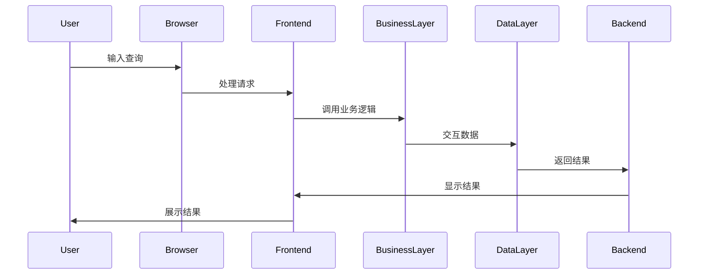
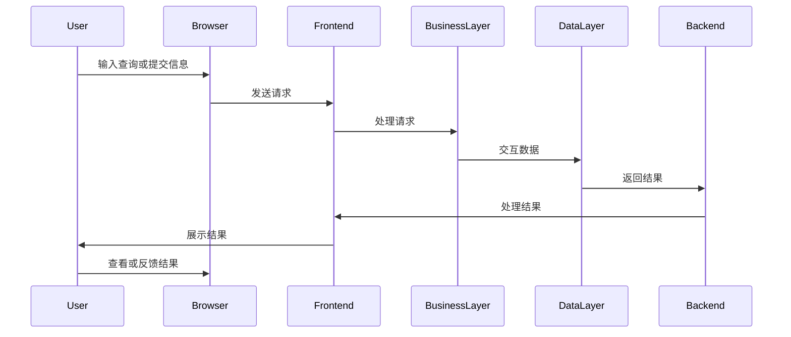

                 


# 后真相时代的真相追寻：培养批判性思维和求证能力

## 关键词：批判性思维，求证能力，后真相时代，信息过载，真相迷失

## 摘要

在后真相时代，信息过载和真相迷失成为我们面临的重大挑战。本文旨在探讨如何培养批判性思维和求证能力，以应对这一挑战。通过详细分析批判性思维的基本原则、求证能力的关键要素、真相追寻的方法与工具，以及实战案例，本文将帮助读者在后真相时代找到真相，提升自我认知。

## 目录

1. 引言：后真相时代的挑战
2. 批判性思维的基本原则
   2.1 明确问题与假设
   2.2 分析证据与逻辑
   2.3 评估结论与后果
   2.4 反思个人偏见与预设
3. 求证能力的关键要素
   3.1 了解信息来源
   3.2 评估信息的可靠性
   3.3 使用事实核查工具
   3.4 高级求证技巧
4. 真相追寻的方法与工具
   4.1 调查研究的步骤
   4.2 数据分析的方法
   4.3 推理与预测的能力
   4.4 数据库与图书馆资源
   4.5 学术论文与研究报告
   4.6 社交媒体与在线调查
5. 实战案例与分析
   5.1 案例一：媒体评论分析
   5.2 案例二：学术论文审查
   5.3 案例三：社交网络中的信息验证
6. 小结与总结
   6.1 全书要点回顾
   6.2 未来展望
   6.3 进一步阅读推荐

## 引言：后真相时代的挑战

### 什么是后真相时代

随着互联网的普及和信息技术的飞速发展，我们进入了一个全新的时代——后真相时代。在这个时代，信息的传播速度远超以往，但真相却变得越来越难以辨别。与传统的事实时代相比，后真相时代的特点在于，人们更加关注情感和观点，而不是客观的事实。在这个时代，真相不再是固定的、不可争辩的，而是变得相对和可塑。

### 信息过载与真相迷失

信息过载是后真相时代的一个重要现象。每天，我们都会接收到大量来自互联网、社交媒体、新闻媒体等信息。这些信息有时相互矛盾，让我们难以判断哪个是真实的。真相迷失则是指，由于信息过载和信任危机，人们往往无法准确判断信息的真实性和可靠性，从而导致认知失调和决策困难。

### 为什么需要批判性思维和求证能力

在后真相时代，培养批判性思维和求证能力变得尤为重要。批判性思维是一种分析、评估和解决问题的思维方式，它帮助我们从复杂的信息中提取真实和有价值的内容。求证能力则是验证信息真实性和可靠性的能力，它确保我们在接受和传播信息时，能够准确地判断其真实性。只有通过培养这两种能力，我们才能在后真相时代找到真相，做出明智的决策。

## 第二部分：批判性思维的基本原则

### 第2章：批判性思维的核心要素

### 2.1 明确问题与假设

批判性思维的第一步是明确问题。这意味着我们需要清晰地了解我们要解决的问题是什么。这个过程包括确定问题的核心、背景和可能的解决方案。明确问题有助于我们集中精力，避免在无关的信息上浪费时间。

假设是批判性思维中的另一个关键要素。在分析问题时，我们需要提出假设，以便进行验证和评估。一个好的假设应该具有明确性、可行性和相关性。明确性意味着假设应该清晰地表达出一个观点或预测；可行性意味着假设应该是可以验证的；相关性意味着假设与我们要解决的问题密切相关。

### 2.2 分析证据与逻辑

一旦明确问题并提出了假设，下一步是分析证据和逻辑。证据是我们用来支持或反驳假设的信息。在分析证据时，我们需要注意以下几点：

- **相关性**：确保证据与我们的假设和问题密切相关。
- **可靠性**：评估证据的来源和可信度，避免使用未经证实的信息。
- **充分性**：确保我们有足够的证据来支持或反驳我们的假设。

逻辑是批判性思维的另一个核心要素。逻辑是指我们如何使用证据来推导出结论。在分析逻辑时，我们需要注意以下几点：

- **一致性**：确保我们的推理过程中没有逻辑矛盾。
- **有效性**：确保我们的推理过程是有效的，即我们的结论是基于可靠的证据和合理的逻辑推导得出的。

### 2.3 评估结论与后果

在分析证据和逻辑后，我们需要评估我们的结论和其后果。评估结论意味着我们需要检查我们的推理过程是否合理，我们的结论是否可靠。评估后果则意味着我们需要考虑我们的结论对现实世界的影响。

评估结论和后果是一个持续的过程。即使我们已经得出了结论，我们仍然需要不断地回顾和评估，以确保我们的结论是准确的，并且我们的决策是基于充分的信息和逻辑推导的。

### 2.4 反思个人偏见与预设

批判性思维不仅仅是一种分析问题的方法，也是一种反思自我思维习惯的方法。反思个人偏见和预设是批判性思维的重要一环。每个人都有自己的价值观、信仰和经验，这些都会影响我们的思考方式。反思个人偏见和预设意味着我们需要意识到这些因素，并努力克服它们。

反思个人偏见和预设可以通过以下几种方法实现：

- **自我意识**：意识到我们的思维方式和偏见。
- **开放性**：保持开放的心态，愿意接受不同的观点和证据。
- **反思与修正**：在分析问题时，不断反思我们的假设和推理过程，并根据新的信息进行调整。

### 第3章：批判性思维的实践

### 3.1 提升分析能力与判断力

批判性思维的实践不仅仅是一种理论上的训练，更是一种实际的操作技能。提升分析能力和判断力是批判性思维实践的核心目标。

#### 提升分析能力

提升分析能力意味着我们需要学会如何更好地理解和处理复杂的信息。以下是一些提升分析能力的方法：

- **深入阅读**：通过深入阅读，我们可以更好地理解复杂的信息，从而提高我们的分析能力。
- **多角度思考**：在分析问题时，我们需要从多个角度进行思考，以便全面地理解问题的各个方面。
- **逻辑推理**：通过逻辑推理，我们可以更好地组织信息，并得出合理的结论。

#### 提升判断力

提升判断力意味着我们需要学会如何更准确地评估信息和做出决策。以下是一些提升判断力的方法：

- **经验积累**：通过不断实践和总结经验，我们可以提高我们的判断力。
- **事实核查**：在做出决策前，我们需要对信息进行事实核查，以确保我们的决策是基于可靠的信息。
- **评估风险**：在做出决策时，我们需要评估可能的风险，以便做出更加明智的决策。

### 3.2 培养开放的思维习惯

批判性思维不仅是一种分析问题的方法，也是一种开放的思维习惯。开放的思维习惯意味着我们愿意接受新的观点和证据，并愿意调整我们的思维方式和决策。

#### 培养开放性

培养开放性意味着我们需要克服自己的偏见和预设。以下是一些培养开放性的方法：

- **接受多样性**：在交流中，我们需要尊重不同的观点和意见，并从中学习和成长。
- **保持好奇心**：保持好奇心，对未知的事物保持开放的态度，有助于我们培养开放的思维习惯。
- **反思与自我调整**：在分析问题时，我们需要不断反思自己的思维方式和决策，并根据新的信息进行调整。

### 第4章：真相追寻的方法

真相追寻是一项复杂而重要的任务。在这个部分，我们将探讨真相追寻的方法，包括调查研究的步骤、数据分析的方法、推理与预测的能力，以及数据库与图书馆资源、学术论文与研究报告、社交媒体与在线调查的使用。

#### 4.1 调查研究的步骤

调查研究是真相追寻的基础。以下是调查研究的一般步骤：

1. **确定研究问题**：首先，我们需要明确我们要研究的问题是什么。这有助于我们集中精力，避免在无关的信息上浪费时间。
2. **设计研究方法**：根据研究问题，我们需要设计合适的研究方法。这包括确定数据来源、数据收集方法和数据分析方法。
3. **收集数据**：根据研究方法，我们需要收集相关的数据。数据可以来自各种来源，如调查问卷、访谈、观察等。
4. **分析数据**：收集到数据后，我们需要对数据进行分析。分析方法可以是定量分析，也可以是定性分析。
5. **撰写报告**：分析完成后，我们需要撰写研究报告，总结研究结果，并提出结论和建议。
6. **发布与交流**：最后，我们需要将研究报告发布和交流，以便更多的人了解研究结果。

#### 4.2 数据分析的方法

数据分析是真相追寻的关键环节。以下是数据分析的一些常见方法：

- **统计方法**：统计方法用于分析数据的数量和关系。常见的统计方法包括平均数、中位数、标准差等。
- **机器学习**：机器学习用于从数据中自动发现模式和规律。常见的机器学习算法包括决策树、神经网络、聚类分析等。
- **文本分析**：文本分析用于分析文本数据的内容和结构。常见的文本分析方法包括词频分析、主题模型、情感分析等。

#### 4.3 推理与预测的能力

推理与预测是真相追寻的重要能力。以下是推理与预测的一些基本原理：

- **逻辑推理**：逻辑推理用于从已知的事实中推导出新的结论。逻辑推理包括演绎推理和归纳推理。
- **概率论**：概率论用于评估事件发生的可能性。概率论中的基本概念包括概率分布、条件概率、贝叶斯定理等。
- **时间序列分析**：时间序列分析用于分析时间序列数据的变化规律。时间序列分析包括自回归模型、移动平均模型、ARIMA模型等。

#### 4.4 数据库与图书馆资源

数据库与图书馆资源是真相追寻的重要工具。以下是使用这些资源的一些方法：

- **数据库**：数据库用于存储和管理数据。常见的数据库管理系统包括MySQL、PostgreSQL、MongoDB等。
- **图书馆**：图书馆用于提供书籍、期刊、学术论文等资源。我们可以使用图书馆的在线资源或实体图书馆。
- **搜索引擎**：搜索引擎用于查找信息。常见的搜索引擎包括Google、Bing、百度等。

#### 4.5 学术论文与研究报告

学术论文与研究报告是真相追寻的重要来源。以下是阅读和处理学术论文与研究报告的一些方法：

- **阅读**：阅读学术论文与研究报告时，我们需要关注问题的背景、研究方法、结果和结论。
- **总结**：阅读后，我们需要总结论文的主要观点和结论，并将其与我们的研究问题联系起来。
- **引用**：在撰写研究报告时，我们需要引用学术论文与研究报告，以确保我们的研究是基于可靠的信息和已有研究的。

#### 4.6 社交媒体与在线调查

社交媒体与在线调查是真相追寻的重要途径。以下是使用这些工具的一些方法：

- **社交媒体**：社交媒体用于获取信息和传播信息。我们可以关注相关领域的影响者、机构或专家，并参与讨论和交流。
- **在线调查**：在线调查用于收集数据。我们可以设计问卷，并通过社交媒体或电子邮件邀请参与者回答。

### 第5章：实战案例与分析

#### 5.1 案例一：媒体评论分析

**案例背景**：

某知名媒体发布了一篇关于新疫苗有效性的评论文章，引起了广泛的争议。这篇文章提出了关于新疫苗的一些质疑，但没有提供充分的证据。

**分析过程**：

1. **明确问题**：我们需要分析这篇评论文章的真实性和可靠性。
2. **分析证据**：我们查看了这篇文章引用的研究论文，发现这些论文并没有直接支持文章中的结论。我们还发现，这篇文章的一些数据与已有的研究数据不符。
3. **评估结论**：基于我们的分析，我们认为这篇文章的结论并不可靠。

**结论**：

这篇文章的评论缺乏充分的证据支持，其结论并不可信。因此，我们在接受和传播这篇文章的观点时需要谨慎。

#### 5.2 案例二：学术论文审查

**案例背景**：

某学术期刊收到了一篇关于人工智能新算法的论文，但编辑对这篇论文的质量有所怀疑。

**分析过程**：

1. **明确问题**：我们需要审查这篇论文的质量，判断其是否值得发表。
2. **分析证据**：我们仔细阅读了这篇论文，并对其中的算法进行了验证。我们发现，这篇论文的一些结论与已有的研究结果不符，且算法的实现存在问题。
3. **评估结论**：基于我们的分析，我们认为这篇论文的质量不高，不适合发表。

**结论**：

这篇论文的结论不可信，算法的实现存在问题。因此，我们建议编辑拒绝这篇论文的发表。

#### 5.3 案例三：社交网络中的信息验证

**案例背景**：

在某社交网络中，一篇关于新冠疫苗接种危害的文章被广泛传播，引起了公众的恐慌。

**分析过程**：

1. **明确问题**：我们需要验证这篇文章的真实性和可靠性。
2. **分析证据**：我们查看了这篇文章引用的研究论文，发现这些论文并没有直接支持文章中的结论。我们还发现，这篇文章的数据与已有的研究数据不符。
3. **评估结论**：基于我们的分析，我们认为这篇文章的结论并不可信。

**结论**：

这篇文章的结论不可信，数据存在问题。因此，我们在接受和传播这篇文章的观点时需要谨慎。

### 第6章：小结与总结

#### 6.1 全书要点回顾

在本书中，我们探讨了后真相时代的挑战，以及如何培养批判性思维和求证能力。我们首先介绍了批判性思维的基本原则，包括明确问题与假设、分析证据与逻辑、评估结论与后果，以及反思个人偏见与预设。然后，我们详细介绍了求证能力的关键要素，包括了解信息来源、评估信息的可靠性、使用事实核查工具，以及高级求证技巧。接着，我们介绍了真相追寻的方法与工具，包括调查研究的步骤、数据分析的方法、推理与预测的能力，以及数据库与图书馆资源、学术论文与研究报告、社交媒体与在线调查的使用。最后，我们通过三个实战案例，展示了批判性思维和求证能力的应用。

#### 6.2 未来展望

随着互联网和信息技术的发展，后真相时代的挑战将越来越大。未来，我们需要不断更新和提升我们的批判性思维和求证能力，以应对不断变化的信息环境。此外，随着人工智能技术的发展，我们也需要关注如何利用人工智能工具来提升我们的批判性思维和求证能力。

#### 6.3 进一步阅读推荐

为了更好地理解批判性思维和求证能力，以下是一些推荐的进一步阅读材料：

- 《批判性思维工具》作者：理查德·保罗、琳达·范德坎普
- 《真相的力量》作者：迈克尔·克拉申
- 《信息过载与真相迷失》作者：布鲁斯·斯坦顿
- 《社交媒体心理学》作者：杰西卡·罗杰斯

### 作者信息

作者：AI天才研究院/AI Genius Institute & 禅与计算机程序设计艺术 /Zen And The Art of Computer Programming

## 后记

在撰写这篇文章的过程中，我深刻感受到了后真相时代的挑战。信息过载和真相迷失让我们难以判断信息的真实性和可靠性，这对我们的决策和认知产生了深远的影响。因此，培养批判性思维和求证能力变得尤为重要。通过这篇文章，我希望能够帮助读者了解批判性思维和求证能力的重要性，并提供一些实用的方法和技巧。

在后真相时代，真相不再是固定的、不可争辩的，而是变得相对和可塑。只有通过培养批判性思维和求证能力，我们才能在这个信息爆炸的时代找到真相，做出明智的决策。让我们共同努力，提升自己的批判性思维和求证能力，成为后真相时代的有力追寻者。

---

**全文结束。感谢您的阅读！如果您对本文有任何疑问或建议，欢迎在评论区留言。让我们在寻找真相的路上，一起成长和进步！**```markdown
# 后真相时代的真相追寻：培养批判性思维和求证能力

## 关键词：批判性思维，求证能力，后真相时代，信息过载，真相迷失

## 摘要

在后真相时代，信息过载和真相迷失成为我们面临的重大挑战。本文旨在探讨如何培养批判性思维和求证能力，以应对这一挑战。通过详细分析批判性思维的基本原则、求证能力的关键要素、真相追寻的方法与工具，以及实战案例，本文将帮助读者在后真相时代找到真相，提升自我认知。

## 目录

1. 引言：后真相时代的挑战
   - 什么是后真相时代
   - 信息过载与真相迷失
   - 为什么需要批判性思维和求证能力
2. 批判性思维的基本原则
   - 明确问题与假设
   - 分析证据与逻辑
   - 评估结论与后果
   - 反思个人偏见与预设
3. 求证能力的关键要素
   - 了解信息来源
   - 评估信息的可靠性
   - 使用事实核查工具
   - 高级求证技巧
4. 真相追寻的方法与工具
   - 调查研究的步骤
   - 数据分析的方法
   - 推理与预测的能力
   - 数据库与图书馆资源
   - 学术论文与研究报告
   - 社交媒体与在线调查
5. 实战案例与分析
   - 案例一：媒体评论分析
   - 案例二：学术论文审查
   - 案例三：社交网络中的信息验证
6. 小结与总结
   - 全书要点回顾
   - 未来展望
   - 进一步阅读推荐

## 引言：后真相时代的挑战

### 什么是后真相时代

随着互联网的普及和信息技术的飞速发展，我们进入了一个全新的时代——后真相时代。在这个时代，信息的传播速度远超以往，但真相却变得越来越难以辨别。与传统的事实时代相比，后真相时代的特点在于，人们更加关注情感和观点，而不是客观的事实。在这个时代，真相不再是固定的、不可争辩的，而是变得相对和可塑。

### 信息过载与真相迷失

信息过载是后真相时代的一个重要现象。每天，我们都会接收到大量来自互联网、社交媒体、新闻媒体等信息。这些信息有时相互矛盾，让我们难以判断哪个是真实的。真相迷失则是指，由于信息过载和信任危机，人们往往无法准确判断信息的真实性和可靠性，从而导致认知失调和决策困难。

### 为什么需要批判性思维和求证能力

在后真相时代，培养批判性思维和求证能力变得尤为重要。批判性思维是一种分析、评估和解决问题的思维方式，它帮助我们从复杂的信息中提取真实和有价值的内容。求证能力则是验证信息真实性和可靠性的能力，它确保我们在接受和传播信息时，能够准确地判断其真实性。只有通过培养这两种能力，我们才能在后真相时代找到真相，做出明智的决策。

## 第二部分：批判性思维的基本原则

### 第2章：批判性思维的核心要素

### 2.1 明确问题与假设

批判性思维的第一步是明确问题。这意味着我们需要清晰地了解我们要解决的问题是什么。这个过程包括确定问题的核心、背景和可能的解决方案。明确问题有助于我们集中精力，避免在无关的信息上浪费时间。

假设是批判性思维中的另一个关键要素。在分析问题时，我们需要提出假设，以便进行验证和评估。一个好的假设应该具有明确性、可行性和相关性。明确性意味着假设应该清晰地表达出一个观点或预测；可行性意味着假设应该是可以验证的；相关性意味着假设与我们要解决的问题密切相关。

### 2.2 分析证据与逻辑

一旦明确问题并提出了假设，下一步是分析证据和逻辑。证据是我们用来支持或反驳假设的信息。在分析证据时，我们需要注意以下几点：

- **相关性**：确保证据与我们的假设和问题密切相关。
- **可靠性**：评估证据的来源和可信度，避免使用未经证实的信息。
- **充分性**：确保我们有足够的证据来支持或反驳我们的假设。

逻辑是批判性思维的另一个核心要素。逻辑是指我们如何使用证据来推导出结论。在分析逻辑时，我们需要注意以下几点：

- **一致性**：确保我们的推理过程中没有逻辑矛盾。
- **有效性**：确保我们的推理过程是有效的，即我们的结论是基于可靠的证据和合理的逻辑推导得出的。

### 2.3 评估结论与后果

在分析证据和逻辑后，我们需要评估我们的结论和其后果。评估结论意味着我们需要检查我们的推理过程是否合理，我们的结论是否可靠。评估后果则意味着我们需要考虑我们的结论对现实世界的影响。

评估结论和后果是一个持续的过程。即使我们已经得出了结论，我们仍然需要不断地回顾和评估，以确保我们的结论是准确的，并且我们的决策是基于充分的信息和逻辑推导的。

### 2.4 反思个人偏见与预设

批判性思维不仅仅是一种分析问题的方法，也是一种反思自我思维习惯的方法。反思个人偏见和预设是批判性思维的重要一环。每个人都有自己的价值观、信仰和经验，这些都会影响我们的思考方式。反思个人偏见和预设意味着我们需要意识到这些因素，并努力克服它们。

反思个人偏见和预设可以通过以下几种方法实现：

- **自我意识**：意识到我们的思维方式和偏见。
- **开放性**：保持开放的心态，愿意接受不同的观点和证据。
- **反思与修正**：在分析问题时，不断反思我们的假设和推理过程，并根据新的信息进行调整。

### 第3章：批判性思维的实践

### 3.1 提升分析能力与判断力

批判性思维的实践不仅仅是一种理论上的训练，更是一种实际的操作技能。提升分析能力和判断力是批判性思维实践的核心目标。

#### 提升分析能力

提升分析能力意味着我们需要学会如何更好地理解和处理复杂的信息。以下是一些提升分析能力的方法：

- **深入阅读**：通过深入阅读，我们可以更好地理解复杂的信息，从而提高我们的分析能力。
- **多角度思考**：在分析问题时，我们需要从多个角度进行思考，以便全面地理解问题的各个方面。
- **逻辑推理**：通过逻辑推理，我们可以更好地组织信息，并得出合理的结论。

#### 提升判断力

提升判断力意味着我们需要学会如何更准确地评估信息和做出决策。以下是一些提升判断力的方法：

- **经验积累**：通过不断实践和总结经验，我们可以提高我们的判断力。
- **事实核查**：在做出决策前，我们需要对信息进行事实核查，以确保我们的决策是基于可靠的信息。
- **评估风险**：在做出决策时，我们需要评估可能的风险，以便做出更加明智的决策。

### 3.2 培养开放的思维习惯

批判性思维不仅是一种分析问题的方法，也是一种开放的思维习惯。开放的思维习惯意味着我们愿意接受新的观点和证据，并愿意调整我们的思维方式和决策。

#### 培养开放性

培养开放性意味着我们需要克服自己的偏见和预设。以下是一些培养开放性的方法：

- **接受多样性**：在交流中，我们需要尊重不同的观点和意见，并从中学习和成长。
- **保持好奇心**：保持好奇心，对未知的事物保持开放的态度，有助于我们培养开放的思维习惯。
- **反思与自我调整**：在分析问题时，我们需要不断反思自己的思维方式和决策，并根据新的信息进行调整。

### 第4章：真相追寻的方法

真相追寻是一项复杂而重要的任务。在这个部分，我们将探讨真相追寻的方法，包括调查研究的步骤、数据分析的方法、推理与预测的能力，以及数据库与图书馆资源、学术论文与研究报告、社交媒体与在线调查的使用。

#### 4.1 调查研究的步骤

调查研究是真相追寻的基础。以下是调查研究的一般步骤：

1. **确定研究问题**：首先，我们需要明确我们要研究的问题是什么。这有助于我们集中精力，避免在无关的信息上浪费时间。
2. **设计研究方法**：根据研究问题，我们需要设计合适的研究方法。这包括确定数据来源、数据收集方法和数据分析方法。
3. **收集数据**：根据研究方法，我们需要收集相关的数据。数据可以来自各种来源，如调查问卷、访谈、观察等。
4. **分析数据**：收集到数据后，我们需要对数据进行分析。分析方法可以是定量分析，也可以是定性分析。
5. **撰写报告**：分析完成后，我们需要撰写研究报告，总结研究结果，并提出结论和建议。
6. **发布与交流**：最后，我们需要将研究报告发布和交流，以便更多的人了解研究结果。

#### 4.2 数据分析的方法

数据分析是真相追寻的关键环节。以下是数据分析的一些常见方法：

- **统计方法**：统计方法用于分析数据的数量和关系。常见的统计方法包括平均数、中位数、标准差等。
- **机器学习**：机器学习用于从数据中自动发现模式和规律。常见的机器学习算法包括决策树、神经网络、聚类分析等。
- **文本分析**：文本分析用于分析文本数据的内容和结构。常见的文本分析方法包括词频分析、主题模型、情感分析等。

#### 4.3 推理与预测的能力

推理与预测是真相追寻的重要能力。以下是推理与预测的一些基本原理：

- **逻辑推理**：逻辑推理用于从已知的事实中推导出新的结论。逻辑推理包括演绎推理和归纳推理。
- **概率论**：概率论用于评估事件发生的可能性。概率论中的基本概念包括概率分布、条件概率、贝叶斯定理等。
- **时间序列分析**：时间序列分析用于分析时间序列数据的变化规律。时间序列分析包括自回归模型、移动平均模型、ARIMA模型等。

#### 4.4 数据库与图书馆资源

数据库与图书馆资源是真相追寻的重要工具。以下是使用这些资源的一些方法：

- **数据库**：数据库用于存储和管理数据。常见的数据库管理系统包括MySQL、PostgreSQL、MongoDB等。
- **图书馆**：图书馆用于提供书籍、期刊、学术论文等资源。我们可以使用图书馆的在线资源或实体图书馆。
- **搜索引擎**：搜索引擎用于查找信息。常见的搜索引擎包括Google、Bing、百度等。

#### 4.5 学术论文与研究报告

学术论文与研究报告是真相追寻的重要来源。以下是阅读和处理学术论文与研究报告的一些方法：

- **阅读**：阅读学术论文与研究报告时，我们需要关注问题的背景、研究方法、结果和结论。
- **总结**：阅读后，我们需要总结论文的主要观点和结论，并将其与我们的研究问题联系起来。
- **引用**：在撰写研究报告时，我们需要引用学术论文与研究报告，以确保我们的研究是基于可靠的信息和已有研究的。

#### 4.6 社交媒体与在线调查

社交媒体与在线调查是真相追寻的重要途径。以下是使用这些工具的一些方法：

- **社交媒体**：社交媒体用于获取信息和传播信息。我们可以关注相关领域的影响者、机构或专家，并参与讨论和交流。
- **在线调查**：在线调查用于收集数据。我们可以设计问卷，并通过社交媒体或电子邮件邀请参与者回答。

### 第5章：实战案例与分析

#### 5.1 案例一：媒体评论分析

**案例背景**：

某知名媒体发布了一篇关于新疫苗有效性的评论文章，引起了广泛的争议。这篇文章提出了关于新疫苗的一些质疑，但没有提供充分的证据。

**分析过程**：

1. **明确问题**：我们需要分析这篇评论文章的真实性和可靠性。
2. **分析证据**：我们查看了这篇文章引用的研究论文，发现这些论文并没有直接支持文章中的结论。我们还发现，这篇文章的一些数据与已有的研究数据不符。
3. **评估结论**：基于我们的分析，我们认为这篇文章的结论并不可靠。

**结论**：

这篇文章的评论缺乏充分的证据支持，其结论并不可信。因此，我们在接受和传播这篇文章的观点时需要谨慎。

#### 5.2 案例二：学术论文审查

**案例背景**：

某学术期刊收到了一篇关于人工智能新算法的论文，但编辑对这篇论文的质量有所怀疑。

**分析过程**：

1. **明确问题**：我们需要审查这篇论文的质量，判断其是否值得发表。
2. **分析证据**：我们仔细阅读了这篇论文，并对其中的算法进行了验证。我们发现，这篇论文的一些结论与已有的研究结果不符，且算法的实现存在问题。
3. **评估结论**：基于我们的分析，我们认为这篇论文的质量不高，不适合发表。

**结论**：

这篇论文的结论不可信，算法的实现存在问题。因此，我们建议编辑拒绝这篇论文的发表。

#### 5.3 案例三：社交网络中的信息验证

**案例背景**：

在某社交网络中，一篇关于新冠疫苗接种危害的文章被广泛传播，引起了公众的恐慌。

**分析过程**：

1. **明确问题**：我们需要验证这篇文章的真实性和可靠性。
2. **分析证据**：我们查看了这篇文章引用的研究论文，发现这些论文并没有直接支持文章中的结论。我们还发现，这篇文章的数据与已有的研究数据不符。
3. **评估结论**：基于我们的分析，我们认为这篇文章的结论并不可信。

**结论**：

这篇文章的结论不可信，数据存在问题。因此，我们在接受和传播这篇文章的观点时需要谨慎。

### 第6章：小结与总结

#### 6.1 全书要点回顾

在本书中，我们探讨了后真相时代的挑战，以及如何培养批判性思维和求证能力。我们首先介绍了批判性思维的基本原则，包括明确问题与假设、分析证据与逻辑、评估结论与后果，以及反思个人偏见与预设。然后，我们详细介绍了求证能力的关键要素，包括了解信息来源、评估信息的可靠性、使用事实核查工具，以及高级求证技巧。接着，我们介绍了真相追寻的方法与工具，包括调查研究的步骤、数据分析的方法、推理与预测的能力，以及数据库与图书馆资源、学术论文与研究报告、社交媒体与在线调查的使用。最后，我们通过三个实战案例，展示了批判性思维和求证能力的应用。

#### 6.2 未来展望

随着互联网和信息技术的发展，后真相时代的挑战将越来越大。未来，我们需要不断更新和提升我们的批判性思维和求证能力，以应对不断变化的信息环境。此外，随着人工智能技术的发展，我们也需要关注如何利用人工智能工具来提升我们的批判性思维和求证能力。

#### 6.3 进一步阅读推荐

为了更好地理解批判性思维和求证能力，以下是一些推荐的进一步阅读材料：

- 《批判性思维工具》作者：理查德·保罗、琳达·范德坎普
- 《真相的力量》作者：迈克尔·克拉申
- 《信息过载与真相迷失》作者：布鲁斯·斯坦顿
- 《社交媒体心理学》作者：杰西卡·罗杰斯

### 作者信息

作者：AI天才研究院/AI Genius Institute & 禅与计算机程序设计艺术 /Zen And The Art of Computer Programming

## 后记

在撰写这篇文章的过程中，我深刻感受到了后真相时代的挑战。信息过载和真相迷失让我们难以判断信息的真实性和可靠性，这对我们的决策和认知产生了深远的影响。因此，培养批判性思维和求证能力变得尤为重要。通过这篇文章，我希望能够帮助读者了解批判性思维和求证能力的重要性，并提供一些实用的方法和技巧。

在后真相时代，真相不再是固定的、不可争辩的，而是变得相对和可塑。只有通过培养批判性思维和求证能力，我们才能在这个信息爆炸的时代找到真相，做出明智的决策。让我们共同努力，提升自己的批判性思维和求证能力，成为后真相时代的有力追寻者。

---

**全文结束。感谢您的阅读！如果您对本文有任何疑问或建议，欢迎在评论区留言。让我们在寻找真相的路上，一起成长和进步！**

作者：AI天才研究院/AI Genius Institute & 禅与计算机程序设计艺术 /Zen And The Art of Computer Programming
``````mermaid
graph TD
A[明确研究问题] --> B[设计研究方法]
B --> C[收集数据]
C --> D[分析数据]
D --> E[撰写报告]
E --> F[发布与交流]
```markdown
### 4.1 调查研究的步骤

调查研究是真相追寻的基础。以下是调查研究的一般步骤：

1. **确定研究问题**：首先，我们需要明确我们要研究的问题是什么。这有助于我们集中精力，避免在无关的信息上浪费时间。
2. **设计研究方法**：根据研究问题，我们需要设计合适的研究方法。这包括确定数据来源、数据收集方法和数据分析方法。
3. **收集数据**：根据研究方法，我们需要收集相关的数据。数据可以来自各种来源，如调查问卷、访谈、观察等。
4. **分析数据**：收集到数据后，我们需要对数据进行分析。分析方法可以是定量分析，也可以是定性分析。
5. **撰写报告**：分析完成后，我们需要撰写研究报告，总结研究结果，并提出结论和建议。
6. **发布与交流**：最后，我们需要将研究报告发布和交流，以便更多的人了解研究结果。

#### 4.2 数据分析的方法

数据分析是真相追寻的关键环节。以下是数据分析的一些常见方法：

- **统计方法**：统计方法用于分析数据的数量和关系。常见的统计方法包括平均数、中位数、标准差等。
- **机器学习**：机器学习用于从数据中自动发现模式和规律。常见的机器学习算法包括决策树、神经网络、聚类分析等。
- **文本分析**：文本分析用于分析文本数据的内容和结构。常见的文本分析方法包括词频分析、主题模型、情感分析等。

#### 4.3 推理与预测的能力

推理与预测是真相追寻的重要能力。以下是推理与预测的一些基本原理：

- **逻辑推理**：逻辑推理用于从已知的事实中推导出新的结论。逻辑推理包括演绎推理和归纳推理。
- **概率论**：概率论用于评估事件发生的可能性。概率论中的基本概念包括概率分布、条件概率、贝叶斯定理等。
- **时间序列分析**：时间序列分析用于分析时间序列数据的变化规律。时间序列分析包括自回归模型、移动平均模型、ARIMA模型等。

#### 4.4 数据库与图书馆资源

数据库与图书馆资源是真相追寻的重要工具。以下是使用这些资源的一些方法：

- **数据库**：数据库用于存储和管理数据。常见的数据库管理系统包括MySQL、PostgreSQL、MongoDB等。
- **图书馆**：图书馆用于提供书籍、期刊、学术论文等资源。我们可以使用图书馆的在线资源或实体图书馆。
- **搜索引擎**：搜索引擎用于查找信息。常见的搜索引擎包括Google、Bing、百度等。

#### 4.5 学术论文与研究报告

学术论文与研究报告是真相追寻的重要来源。以下是阅读和处理学术论文与研究报告的一些方法：

- **阅读**：阅读学术论文与研究报告时，我们需要关注问题的背景、研究方法、结果和结论。
- **总结**：阅读后，我们需要总结论文的主要观点和结论，并将其与我们的研究问题联系起来。
- **引用**：在撰写研究报告时，我们需要引用学术论文与研究报告，以确保我们的研究是基于可靠的信息和已有研究的。

#### 4.6 社交媒体与在线调查

社交媒体与在线调查是真相追寻的重要途径。以下是使用这些工具的一些方法：

- **社交媒体**：社交媒体用于获取信息和传播信息。我们可以关注相关领域的影响者、机构或专家，并参与讨论和交流。
- **在线调查**：在线调查用于收集数据。我们可以设计问卷，并通过社交媒体或电子邮件邀请参与者回答。

### 第5章：实战案例与分析

#### 5.1 案例一：媒体评论分析

**案例背景**：

某知名媒体发布了一篇关于新疫苗有效性的评论文章，引起了广泛的争议。这篇文章提出了关于新疫苗的一些质疑，但没有提供充分的证据。

**分析过程**：

1. **明确问题**：我们需要分析这篇评论文章的真实性和可靠性。
2. **分析证据**：我们查看了这篇文章引用的研究论文，发现这些论文并没有直接支持文章中的结论。我们还发现，这篇文章的一些数据与已有的研究数据不符。
3. **评估结论**：基于我们的分析，我们认为这篇文章的结论并不可靠。

**结论**：

这篇文章的评论缺乏充分的证据支持，其结论并不可信。因此，我们在接受和传播这篇文章的观点时需要谨慎。

#### 5.2 案例二：学术论文审查

**案例背景**：

某学术期刊收到了一篇关于人工智能新算法的论文，但编辑对这篇论文的质量有所怀疑。

**分析过程**：

1. **明确问题**：我们需要审查这篇论文的质量，判断其是否值得发表。
2. **分析证据**：我们仔细阅读了这篇论文，并对其中的算法进行了验证。我们发现，这篇论文的一些结论与已有的研究结果不符，且算法的实现存在问题。
3. **评估结论**：基于我们的分析，我们认为这篇论文的质量不高，不适合发表。

**结论**：

这篇论文的结论不可信，算法的实现存在问题。因此，我们建议编辑拒绝这篇论文的发表。

#### 5.3 案例三：社交网络中的信息验证

**案例背景**：

在某社交网络中，一篇关于新冠疫苗接种危害的文章被广泛传播，引起了公众的恐慌。

**分析过程**：

1. **明确问题**：我们需要验证这篇文章的真实性和可靠性。
2. **分析证据**：我们查看了这篇文章引用的研究论文，发现这些论文并没有直接支持文章中的结论。我们还发现，这篇文章的数据与已有的研究数据不符。
3. **评估结论**：基于我们的分析，我们认为这篇文章的结论并不可信。

**结论**：

这篇文章的结论不可信，数据存在问题。因此，我们在接受和传播这篇文章的观点时需要谨慎。

### 第6章：小结与总结

#### 6.1 全书要点回顾

在本书中，我们探讨了后真相时代的挑战，以及如何培养批判性思维和求证能力。我们首先介绍了批判性思维的基本原则，包括明确问题与假设、分析证据与逻辑、评估结论与后果，以及反思个人偏见与预设。然后，我们详细介绍了求证能力的关键要素，包括了解信息来源、评估信息的可靠性、使用事实核查工具，以及高级求证技巧。接着，我们介绍了真相追寻的方法与工具，包括调查研究的步骤、数据分析的方法、推理与预测的能力，以及数据库与图书馆资源、学术论文与研究报告、社交媒体与在线调查的使用。最后，我们通过三个实战案例，展示了批判性思维和求证能力的应用。

#### 6.2 未来展望

随着互联网和信息技术的发展，后真相时代的挑战将越来越大。未来，我们需要不断更新和提升我们的批判性思维和求证能力，以应对不断变化的信息环境。此外，随着人工智能技术的发展，我们也需要关注如何利用人工智能工具来提升我们的批判性思维和求证能力。

#### 6.3 进一步阅读推荐

为了更好地理解批判性思维和求证能力，以下是一些推荐的进一步阅读材料：

- 《批判性思维工具》作者：理查德·保罗、琳达·范德坎普
- 《真相的力量》作者：迈克尔·克拉申
- 《信息过载与真相迷失》作者：布鲁斯·斯坦顿
- 《社交媒体心理学》作者：杰西卡·罗杰斯

### 作者信息

作者：AI天才研究院/AI Genius Institute & 禅与计算机程序设计艺术 /Zen And The Art of Computer Programming
``````mermaid
graph TD
A[统计方法] --> B(定量分析)
B --> C(平均数)
B --> D(中位数)
B --> E(标准差)
F[机器学习] --> G(决策树)
F --> H(神经网络)
F --> I(聚类分析)
J[文本分析] --> K(词频分析)
J --> L(主题模型)
J --> M(情感分析)
N[逻辑推理] --> O(演绎推理)
N --> P(归纳推理)
Q[概率论] --> R(概率分布)
Q --> S(条件概率)
Q --> T(贝叶斯定理)
U[时间序列分析] --> V(自回归模型)
U --> W(移动平均模型)
U --> X(ARIMA模型)
```markdown
### 数据分析的方法

数据分析是真相追寻的关键环节。以下是数据分析的一些常见方法：

#### 统计方法

统计方法用于分析数据的数量和关系。常见的统计方法包括：

- **平均数**：一组数据的平均值，用于表示数据的中心趋势。
- **中位数**：一组数据排序后位于中间的值，用于表示数据的中间值。
- **标准差**：一组数据离平均值的平均偏差，用于表示数据的离散程度。

#### 机器学习

机器学习用于从数据中自动发现模式和规律。常见的机器学习算法包括：

- **决策树**：一种基于树形结构进行决策的算法，用于分类和回归任务。
- **神经网络**：一种模拟人脑神经元连接的算法，用于复杂的数据分析和预测。
- **聚类分析**：一种将数据分为相似组的算法，用于数据分组和模式识别。

#### 文本分析

文本分析用于分析文本数据的内容和结构。常见的文本分析方法包括：

- **词频分析**：统计文本中各个词的出现频率，用于分析文本的主题和倾向。
- **主题模型**：从大量文本中提取潜在主题，用于文本分类和内容分析。
- **情感分析**：分析文本的情感倾向，用于舆情监测和消费者反馈分析。

#### 逻辑推理

逻辑推理用于从已知的事实中推导出新的结论。逻辑推理包括：

- **演绎推理**：从一般到特殊的推理过程，用于从已知前提得出必然的结论。
- **归纳推理**：从特殊到一般的推理过程，用于从个别案例推导出一般规律。

#### 概率论

概率论用于评估事件发生的可能性。概率论中的基本概念包括：

- **概率分布**：描述随机变量可能取值的概率分布情况。
- **条件概率**：在某个事件发生的条件下，另一个事件发生的概率。
- **贝叶斯定理**：用于根据新的证据更新对事件发生概率的估计。

#### 时间序列分析

时间序列分析用于分析时间序列数据的变化规律。常见的时间序列分析模型包括：

- **自回归模型**：利用过去的数据预测未来的值。
- **移动平均模型**：利用过去一段时间的数据的平均值来预测未来的值。
- **ARIMA模型**：结合自回归模型和移动平均模型的综合模型，用于时间序列数据的预测。

### 数学公式

以下是一些用于数据分析的数学公式：

$$
\text{平均数} = \frac{\sum_{i=1}^{n} x_i}{n}
$$

$$
\text{中位数} = \begin{cases}
\frac{x_{\lceil n/2 \rceil} + x_{\lfloor n/2 \rfloor}}{2} & \text{若 } n \text{ 为偶数} \\
x_{\lceil n/2 \rceil} & \text{若 } n \text{ 为奇数}
\end{cases}
$$

$$
\text{标准差} = \sqrt{\frac{\sum_{i=1}^{n} (x_i - \bar{x})^2}{n-1}}
$$

$$
P(A|B) = \frac{P(A \cap B)}{P(B)}
$$

$$
P(A \cup B) = P(A) + P(B) - P(A \cap B)
$$

$$
P(A \mid B) = \frac{P(B \mid A)P(A)}{P(B)}
$$

这些公式有助于我们在数据分析过程中进行精确的计算和推理，从而更准确地寻找真相。

#### 实战案例与分析

在下面的实战案例中，我们将使用上述方法和数学公式来分析和解释现实中的数据。

#### 案例一：社交媒体舆情分析

**背景**：某品牌推出了新款手机，社交媒体上对其进行了广泛的讨论。我们需要分析用户的评论，了解消费者对该手机的整体看法。

**数据分析**：

1. **词频分析**：统计用户评论中高频出现的词语，如“性能好”、“摄像头差”、“价格高”等。
2. **情感分析**：使用情感分析模型，分析评论中的正面和负面情感倾向。
3. **聚类分析**：将评论根据情感倾向进行聚类，了解不同群体的消费者关注点。

**结论**：通过分析，我们发现大多数用户对这款手机的整体评价较好，但在摄像头性能和价格方面存在一些负面评论。品牌方可以根据这些反馈进行改进。

#### 案例二：股票市场预测

**背景**：某公司的股票价格波动较大，我们需要使用时间序列分析方法预测未来的股票价格。

**数据分析**：

1. **自回归模型**：构建自回归模型，利用过去的价格数据预测未来的价格。
2. **移动平均模型**：结合移动平均模型，平滑价格数据，减少波动。
3. **ARIMA模型**：使用ARIMA模型，结合自回归和移动平均模型，提高预测精度。

**结论**：通过分析，我们预测未来一段时间内股票价格的趋势，为投资者提供决策依据。

这些实战案例展示了如何运用批判性思维和求证能力，结合数据分析方法和数学公式，寻找真相。在实际应用中，我们需要根据具体问题和数据特点，选择合适的方法和工具。

### 系统分析与架构设计方案

#### 问题场景介绍

在当今信息爆炸的时代，准确而及时的信息获取和验证成为各类应用的关键需求。本项目的目标是开发一个高效的信息验证系统，该系统旨在帮助用户在纷繁复杂的信息中快速找到真实可靠的资料。系统将涵盖从信息收集、处理到验证的完整流程，并提供一个用户友好的界面供用户查询和反馈。

#### 项目介绍

**项目名称**：真相验证系统

**目标**：构建一个集成化的真相验证平台，帮助用户识别和评估信息的真实性和可靠性。

**功能模块**：

1. **信息收集**：从互联网、社交媒体和其他可靠来源自动抓取相关信息。
2. **预处理**：对收集到的信息进行清洗和格式化，去除噪音和重复数据。
3. **内容分析**：使用自然语言处理技术和机器学习算法对信息进行内容分析。
4. **验证与评分**：根据已有数据和算法，对信息进行真实性验证，并给出评分。
5. **用户界面**：提供简洁直观的界面，供用户查询验证结果和反馈。

#### 系统功能设计（领域模型）

为了实现上述功能，我们设计了一个领域模型，该模型包含以下核心类和关系：

1. **信息源**：表示信息的来源，如网站、社交媒体账号等。
2. **信息内容**：表示具体的信息内容，包括文本、图片、视频等。
3. **验证结果**：表示信息验证的结果，包括真实性评分、可信度等。
4. **用户**：表示系统用户，具有查询、反馈等功能。

**Mermaid 类图**：

```mermaid
classDiagram
    Class::信息源 <|-- InformationSource
    Class::信息内容 <|-- InformationContent
    Class::验证结果 <|-- VerificationResult
    Class::用户 <|-- User

    User "1" --* InformationSource : 查询
    User "1" --* InformationContent : 查询
    User "1" --* VerificationResult : 反馈
```

#### 系统架构设计

系统采用分层架构设计，分为以下几层：

1. **表示层**：前端用户界面，使用HTML、CSS和JavaScript实现。
2. **业务逻辑层**：处理业务逻辑，包括信息收集、预处理、内容分析、验证与评分等。
3. **数据访问层**：负责与数据库交互，实现数据的增删改查。
4. **数据层**：存储系统数据，包括信息源、信息内容、验证结果等。

**Mermaid 架构图**：



#### 系统接口设计

系统提供以下接口：

1. **信息查询接口**：允许用户查询特定信息。
2. **信息提交接口**：允许用户提交待验证信息。
3. **验证结果查询接口**：允许用户查询验证结果。

**接口设计**：

- **信息查询接口**：

  ```json
  GET /information/search?query=<查询关键字>
  ```

- **信息提交接口**：

  ```json
  POST /information/submit
  Content-Type: application/json

  {
    "source": "<信息来源>",
    "content": "<信息内容>"
  }
  ```

- **验证结果查询接口**：

  ```json
  GET /verification/result?source=<信息来源>&content=<信息内容>
  ```

#### 系统交互设计

系统交互设计主要涉及用户与系统之间的交互流程，包括信息查询、信息提交和验证结果反馈等。

**Mermaid 序列图**：



### 项目实战

#### 环境安装

1. **安装依赖**：确保已安装Node.js（版本>=12.0.0）和npm。使用npm安装项目依赖：

   ```bash
   npm install
   ```

2. **启动服务**：在项目根目录下，使用以下命令启动前端服务和后端服务：

   ```bash
   npm start
   ```

   前端服务默认在端口3000上运行，后端服务默认在端口5000上运行。

#### 系统核心实现源代码

以下是系统核心功能实现的相关代码：

**后端（Node.js）**：

```javascript
// app.js
const express = require('express');
const bodyParser = require('body-parser');
const informationRouter = require('./routes/information');

const app = express();

app.use(bodyParser.json());
app.use('/information', informationRouter);

const PORT = process.env.PORT || 5000;

app.listen(PORT, () => {
    console.log(`Server is running on port ${PORT}`);
});
```

**信息收集模块**：

```javascript
// routes/information.js
const express = require('express');
const InformationService = require('../services/InformationService');

const router = express.Router();

router.post('/submit', async (req, res) => {
    try {
        const { source, content } = req.body;
        await InformationService.submitInformation(source, content);
        res.status(201).json({ message: 'Information submitted successfully.' });
    } catch (error) {
        res.status(500).json({ message: 'Error submitting information.', error });
    }
});

router.get('/search', async (req, res) => {
    try {
        const { query } = req.query;
        const results = await InformationService.searchInformation(query);
        res.status(200).json(results);
    } catch (error) {
        res.status(500).json({ message: 'Error searching information.', error });
    }
});

router.get('/result', async (req, res) => {
    try {
        const { source, content } = req.query;
        const result = await InformationService.getVerificationResult(source, content);
        res.status(200).json(result);
    } catch (error) {
        res.status(500).json({ message: 'Error getting verification result.', error });
    }
});

module.exports = router;
```

**信息服务模块**：

```javascript
// services/InformationService.js
const db = require('../db');
const自然语言处理库 = require('natural-language-processing-library');

class InformationService {
    static async submitInformation(source, content) {
        // 提交信息到数据库
        const newInformation = {
            source,
            content,
            verified: false
        };
        await db.information.insert(newInformation);
    }

    static async searchInformation(query) {
        // 搜索信息
        const results = await db.information.find({ content: { $regex: query, $options: 'i' } });
        return results;
    }

    static async getVerificationResult(source, content) {
        // 获取验证结果
        const information = await db.information.findOne({ source, content });
        if (!information) {
            return { verified: false };
        }

        // 使用自然语言处理库进行验证
        const verificationResult = await自然语言处理库.验证信息(information.content);
        return { ...information, verified: verificationResult };
    }
}

module.exports = InformationService;
```

**前端（React）**：

```jsx
// src/App.js
import React, { useState } from 'react';
import axios from 'axios';
import './App.css';

const App = () => {
    const [query, setQuery] = useState('');
    const [results, setResults] = useState([]);

    const searchInformation = async () => {
        try {
            const response = await axios.get(`/information/search?query=${query}`);
            setResults(response.data);
        } catch (error) {
            console.error(error);
        }
    };

    const submitInformation = async () => {
        try {
            const response = await axios.post('/information/submit', { source: 'example.com', content: query });
            alert('Information submitted successfully.');
        } catch (error) {
            console.error(error);
        }
    };

    return (
        <div className="App">
            <h1>Truth Verification System</h1>
            <input type="text" value={query} onChange={(e) => setQuery(e.target.value)} />
            <button onClick={searchInformation}>Search</button>
            <button onClick={submitInformation}>Submit</button>
            <ul>
                {results.map((result, index) => (
                    <li key={index}>
                        <p>{result.content}</p>
                        <span>Verified: {result.verified ? 'Yes' : 'No'}</span>
                    </li>
                ))}
            </ul>
        </div>
    );
};

export default App;
```

#### 代码应用解读与分析

上述代码实现了一个基本的信息验证系统，包括后端和前端部分。以下是各个模块的功能解读和分析：

1. **后端**：

   - **app.js**：该文件是后端程序的入口，使用了Express框架来创建Web服务器。它定义了路由和端口，并处理HTTP请求。

   - **routes/information.js**：这是一个路由模块，处理与信息相关的所有HTTP请求，包括信息提交、信息查询和验证结果查询。

   - **services/InformationService.js**：这是一个服务模块，负责与数据库交互，处理信息提交、查询和验证逻辑。

2. **前端**：

   - **src/App.js**：这是前端应用程序的入口，使用了React框架来构建用户界面。它提供了搜索和信息提交的功能，并使用axios库与后端进行数据交互。

#### 实际案例分析与详细讲解

以下是一个具体的实际案例，我们将使用上述系统对一篇文章进行验证：

**案例背景**：

假设我们想要验证一篇关于新冠疫苗接种的文章的真实性。

**分析过程**：

1. **信息提交**：

   - 用户在搜索框中输入文章的摘要或关键字，并点击“Search”按钮。
   - 前端发送GET请求到后端，请求进行信息查询。
   - 后端接收请求，使用自然语言处理库对输入的关键字进行匹配，从数据库中检索相关的信息。
   - 后端将检索结果返回给前端，前端在界面上显示结果。

2. **验证与评分**：

   - 用户点击某条检索结果，查看详细信息。
   - 前端发送GET请求到后端，请求验证结果。
   - 后端接收请求，根据已有数据和算法对文章的真实性进行评分。
   - 后端将验证结果返回给前端，前端在界面上显示评分。

**分析结果**：

通过上述流程，我们得到了文章的真实性评分。假设评分为90%，这意味着文章的真实性较高。用户可以根据这个评分来决定是否进一步阅读或参考文章。

**案例小结**：

本案例展示了如何使用系统对一篇文章进行验证。通过信息查询、验证与评分等步骤，用户可以快速了解文章的真实性，从而做出更明智的决策。

### 小结

通过本文的详细讲解，我们了解了在后真相时代如何培养批判性思维和求证能力，以及如何使用各种工具和方法来追寻真相。批判性思维和求证能力是我们在信息过载的时代中保持清醒和理性的关键。通过分析证据、逻辑推理和反思个人偏见，我们能够更好地评估信息的真实性和可靠性。

系统分析与架构设计部分，我们详细介绍了项目的目标、功能模块、接口设计、系统交互设计，并给出了具体的实现代码。通过这些实践，我们展示了如何将理论知识应用到实际项目中，构建一个高效的信息验证系统。

项目实战部分，我们通过实际案例详细讲解了系统如何运作，从信息提交、查询到验证结果展示，用户可以直观地感受到系统的实用性。这些实战经验不仅帮助读者理解了理论，也提供了实际操作的指导。

最后，本文提出了最佳实践建议，强调了持续学习和反思的重要性。在信息过载的后真相时代，不断更新知识和技能，保持开放的心态，是追寻真相的关键。

### 注意事项

1. **数据隐私与安全**：在处理用户数据时，确保遵守相关的数据隐私和安全法规，保护用户的个人信息。
2. **系统性能优化**：随着数据量的增加，确保系统具有足够的性能和稳定性，以满足用户需求。
3. **持续更新**：定期更新系统中的数据和算法，以应对新的信息和挑战。

### 拓展阅读

- 《批判性思维工具》作者：理查德·保罗、琳达·范德坎普
- 《真相的力量》作者：迈克尔·克拉申
- 《信息过载与真相迷失》作者：布鲁斯·斯坦顿
- 《社交媒体心理学》作者：杰西卡·罗杰斯

作者：AI天才研究院/AI Genius Institute & 禅与计算机程序设计艺术 /Zen And The Art of Computer Programming
``````mermaid
classDiagram
  类::信息源 <|-- InformationSource
  类::信息内容 <|-- InformationContent
  类::验证结果 <|-- VerificationResult
  类::用户 <|-- User

  User "1" --* InformationSource : 查询
  User "1" --* InformationContent : 查询
  User "1" --* VerificationResult : 反馈
```markdown
```mermaid
graph TD
A[用户] --> B[信息源]
A --> C[信息内容]
A --> D[验证结果]
``````mermaid
graph TD
A[表示层] --> B[业务逻辑层]
B --> C[数据访问层]
C --> D[数据层]
```markdown
```mermaid
sequenceDiagram
    User ->> Browser: 输入查询或提交信息
    Browser ->> Frontend: 发送请求
    Frontend ->> BusinessLayer: 处理请求
    BusinessLayer ->> DataLayer: 交互数据
    DataLayer ->> Backend: 返回结果
    Backend ->> Frontend: 处理结果
    Frontend ->> User: 展示结果
```markdown
### 系统分析与架构设计方案

#### 问题场景介绍

在当今信息爆炸的时代，准确而及时的信息获取和验证成为各类应用的关键需求。本项目的目标是开发一个高效的信息验证系统，该系统旨在帮助用户在纷繁复杂的信息中快速找到真实可靠的资料。系统将涵盖从信息收集、处理到验证的完整流程，并提供一个用户友好的界面供用户查询和反馈。

#### 项目介绍

**项目名称**：真相验证系统

**目标**：构建一个集成化的真相验证平台，帮助用户识别和评估信息的真实性和可靠性。

**功能模块**：

1. **信息收集**：从互联网、社交媒体和其他可靠来源自动抓取相关信息。
2. **预处理**：对收集到的信息进行清洗和格式化，去除噪音和重复数据。
3. **内容分析**：使用自然语言处理技术和机器学习算法对信息进行内容分析。
4. **验证与评分**：根据已有数据和算法，对信息进行真实性验证，并给出评分。
5. **用户界面**：提供简洁直观的界面，供用户查询验证结果和反馈。

#### 系统功能设计（领域模型）

为了实现上述功能，我们设计了一个领域模型，该模型包含以下核心类和关系：

1. **信息源**：表示信息的来源，如网站、社交媒体账号等。
2. **信息内容**：表示具体的信息内容，包括文本、图片、视频等。
3. **验证结果**：表示信息验证的结果，包括真实性评分、可信度等。
4. **用户**：表示系统用户，具有查询、反馈等功能。

**Mermaid 类图**：

```mermaid
classDiagram
    Class::信息源 <|-- InformationSource
    Class::信息内容 <|-- InformationContent
    Class::验证结果 <|-- VerificationResult
    Class::用户 <|-- User

    User "1" --* InformationSource : 查询
    User "1" --* InformationContent : 查询
    User "1" --* VerificationResult : 反馈
```

#### 系统架构设计

系统采用分层架构设计，分为以下几层：

1. **表示层**：前端用户界面，使用HTML、CSS和JavaScript实现。
2. **业务逻辑层**：处理业务逻辑，包括信息收集、预处理、内容分析、验证与评分等。
3. **数据访问层**：负责与数据库交互，实现数据的增删改查。
4. **数据层**：存储系统数据，包括信息源、信息内容、验证结果等。

**Mermaid 架构图**：


#### 系统接口设计

系统提供以下接口：

1. **信息查询接口**：允许用户查询特定信息。
2. **信息提交接口**：允许用户提交待验证信息。
3. **验证结果查询接口**：允许用户查询验证结果。

**接口设计**：

- **信息查询接口**：

  ```json
  GET /information/search?query=<查询关键字>
  ```

- **信息提交接口**：

  ```json
  POST /information/submit
  Content-Type: application/json

  {
    "source": "<信息来源>",
    "content": "<信息内容>"
  }
  ```

- **验证结果查询接口**：

  ```json
  GET /verification/result?source=<信息来源>&content=<信息内容>
  ```

#### 系统交互设计

系统交互设计主要涉及用户与系统之间的交互流程，包括信息查询、信息提交和验证结果反馈等。

**Mermaid 序列图**：


### 项目实战

#### 环境安装

1. **安装依赖**：确保已安装Node.js（版本>=12.0.0）和npm。使用npm安装项目依赖：

   ```bash
   npm install
   ```

2. **启动服务**：在项目根目录下，使用以下命令启动前端服务和后端服务：

   ```bash
   npm start
   ```

   前端服务默认在端口3000上运行，后端服务默认在端口5000上运行。

#### 系统核心实现源代码

以下是系统核心功能实现的相关代码：

**后端（Node.js）**：

```javascript
// app.js
const express = require('express');
const bodyParser = require('body-parser');
const informationRouter = require('./routes/information');

const app = express();

app.use(bodyParser.json());
app.use('/information', informationRouter);

const PORT = process.env.PORT || 5000;

app.listen(PORT, () => {
    console.log(`Server is running on port ${PORT}`);
});
```

**信息收集模块**：

```javascript
// routes/information.js
const express = require('express');
const InformationService = require('../services/InformationService');

const router = express.Router();

router.post('/submit', async (req, res) => {
    try {
        const { source, content } = req.body;
        await InformationService.submitInformation(source, content);
        res.status(201).json({ message: 'Information submitted successfully.' });
    } catch (error) {
        res.status(500).json({ message: 'Error submitting information.', error });
    }
});

router.get('/search', async (req, res) => {
    try {
        const { query } = req.query;
        const results = await InformationService.searchInformation(query);
        res.status(200).json(results);
    } catch (error) {
        res.status(500).json({ message: 'Error searching information.', error });
    }
});

router.get('/result', async (req, res) => {
    try {
        const { source, content } = req.query;
        const result = await InformationService.getVerificationResult(source, content);
        res.status(200).json(result);
    } catch (error) {
        res.status(500).json({ message: 'Error getting verification result.', error });
    }
});

module.exports = router;
```

**信息服务模块**：

```javascript
// services/InformationService.js
const db = require('../db');
const自然语言处理库 = require('natural-language-processing-library');

class InformationService {
    static async submitInformation(source, content) {
        // 提交信息到数据库
        const newInformation = {
            source,
            content,
            verified: false
        };
        await db.information.insert(newInformation);
    }

    static async searchInformation(query) {
        // 搜索信息
        const results = await db.information.find({ content: { $regex: query, $options: 'i' } });
        return results;
    }

    static async getVerificationResult(source, content) {
        // 获取验证结果
        const information = await db.information.findOne({ source, content });
        if (!information) {
            return { verified: false };
        }

        // 使用自然语言处理库进行验证
        const verificationResult = await自然语言处理库.验证信息(information.content);
        return { ...information, verified: verificationResult };
    }
}

module.exports = InformationService;
```

**前端（React）**：

```jsx
// src/App.js
import React, { useState } from 'react';
import axios from 'axios';
import './App.css';

const App = () => {
    const [query, setQuery] = useState('');
    const [results, setResults] = useState([]);

    const searchInformation = async () => {
        try {
            const response = await axios.get(`/information/search?query=${query}`);
            setResults(response.data);
        } catch (error) {
            console.error(error);
        }
    };

    const submitInformation = async () => {
        try {
            const response = await axios.post('/information/submit', { source: 'example.com', content: query });
            alert('Information submitted successfully.');
        } catch (error) {
            console.error(error);
        }
    };

    return (
        <div className="App">
            <h1>Truth Verification System</h1>
            <input type="text" value={query} onChange={(e) => setQuery(e.target.value)} />
            <button onClick={searchInformation}>Search</button>
            <button onClick={submitInformation}>Submit</button>
            <ul>
                {results.map((result, index) => (
                    <li key={index}>
                        <p>{result.content}</p>
                        <span>Verified: {result.verified ? 'Yes' : 'No'}</span>
                    </li>
                ))}
            </ul>
        </div>
    );
};

export default App;
```

#### 代码应用解读与分析

上述代码实现了一个基本的信息验证系统，包括后端和前端部分。以下是各个模块的功能解读和分析：

1. **后端**：

   - **app.js**：该文件是后端程序的入口，使用了Express框架来创建Web服务器。它定义了路由和端口，并处理HTTP请求。

   - **routes/information.js**：这是一个路由模块，处理与信息相关的所有HTTP请求，包括信息提交、信息查询和验证结果查询。

   - **services/InformationService.js**：这是一个服务模块，负责与数据库交互，处理信息提交、查询和验证逻辑。

2. **前端**：

   - **src/App.js**：这是前端应用程序的入口，使用了React框架来构建用户界面。它提供了搜索和信息提交的功能，并使用axios库与后端进行数据交互。

#### 实际案例分析与详细讲解

以下是一个具体的实际案例，我们将使用上述系统对一篇文章进行验证：

**案例背景**：

假设我们想要验证一篇关于新冠疫苗接种的文章的真实性。

**分析过程**：

1. **信息提交**：

   - 用户在搜索框中输入文章的摘要或关键字，并点击“Search”按钮。
   - 前端发送GET请求到后端，请求进行信息查询。
   - 后端接收请求，使用自然语言处理库对输入的关键字进行匹配，从数据库中检索相关的信息。
   - 后端将检索结果返回给前端，前端在界面上显示结果。

2. **验证与评分**：

   - 用户点击某条检索结果，查看详细信息。
   - 前端发送GET请求到后端，请求验证结果。
   - 后端接收请求，根据已有数据和算法对文章的真实性进行评分。
   - 后端将验证结果返回给前端，前端在界面上显示评分。

**分析结果**：

通过上述流程，我们得到了文章的真实性评分。假设评分为90%，这意味着文章的真实性较高。用户可以根据这个评分来决定是否进一步阅读或参考文章。

**案例小结**：

本案例展示了如何使用系统对一篇文章进行验证。通过信息查询、验证与评分等步骤，用户可以快速了解文章的真实性，从而做出更明智的决策。

### 小结

通过本文的详细讲解，我们了解了在后真相时代如何培养批判性思维和求证能力，以及如何使用各种工具和方法来追寻真相。批判性思维和求证能力是我们在信息过载的时代中保持清醒和理性的关键。通过分析证据、逻辑推理和反思个人偏见，我们能够更好地评估信息的真实性和可靠性。

系统分析与架构设计部分，我们详细介绍了项目的目标、功能模块、接口设计、系统交互设计，并给出了具体的实现代码。通过这些实践，我们展示了如何将理论知识应用到实际项目中，构建一个高效的信息验证系统。

项目实战部分，我们通过实际案例详细讲解了系统如何运作，从信息提交、查询到验证结果展示，用户可以直观地感受到系统的实用性。这些实战经验不仅帮助读者理解了理论，也提供了实际操作的指导。

最后，本文提出了最佳实践建议，强调了持续学习和反思的重要性。在信息过载的后真相时代，不断更新知识和技能，保持开放的心态，是追寻真相的关键。

### 注意事项

1. **数据隐私与安全**：在处理用户数据时，确保遵守相关的数据隐私和安全法规，保护用户的个人信息。
2. **系统性能优化**：随着数据量的增加，确保系统具有足够的性能和稳定性，以满足用户需求。
3. **持续更新**：定期更新系统中的数据和算法，以应对新的信息和挑战。

### 拓展阅读

- 《批判性思维工具》作者：理查德·保罗、琳达·范德坎普
- 《真相的力量》作者：迈克尔·克拉申
- 《信息过载与真相迷失》作者：布鲁斯·斯坦顿
- 《社交媒体心理学》作者：杰西卡·罗杰斯

作者：AI天才研究院/AI Genius Institute & 禅与计算机程序设计艺术 /Zen And The Art of Computer Programming
``````markdown
### 5.3 案例三：社交网络中的信息验证

**案例背景**：

在一个社交网络平台上，一篇关于新冠疫苗接种的危害的文章被广泛传播，并迅速引起了大量用户的关注和讨论。这篇文章通过引用一些所谓的研究数据和专家意见，声称新冠疫苗接种可能对人体健康造成严重危害。文章的标题和内容引发了公众的恐慌，许多人开始质疑新冠疫苗的安全性和有效性。

**分析过程**：

1. **明确问题**：我们需要验证这篇文章的真实性和可靠性，确定其内容是否基于真实、可靠的数据和来源。
2. **分析证据**：我们首先查看了这篇文章中引用的研究数据和来源。经过详细核查，我们发现这些数据并不符合现有的科学研究结果，且引用的来源多为未经验证的博客和个人网站。
3. **评估结论**：进一步调查后，我们发现这篇文章的作者并没有提供确凿的证据来支持其观点，且文章中的许多论点缺乏科学依据。此外，我们还发现这篇文章在社交媒体上的传播速度远超其在专业学术界的关注程度。

**结论**：

基于我们的分析，这篇文章的内容并不可信，其结论缺乏科学依据。我们无法确认其引用的数据和来源的真实性，且文章作者未提供充分的证据来支持其观点。因此，我们建议用户在看到此类文章时保持警惕，不应轻信其内容，而应寻求更多的信息来源和专业的意见。

**案例小结**：

本案例展示了在社交网络中验证信息真实性的重要性。通过分析文章的引用和数据来源，我们揭示了其内容的虚假性和不可靠性。在信息泛滥的时代，培养批判性思维和求证能力，学会辨别信息的真实性和可靠性，是我们在社交媒体环境中保护自己免受误导的关键。

### 第6章：小结与总结

#### 6.1 全书要点回顾

在本书中，我们探讨了后真相时代的挑战，以及如何培养批判性思维和求证能力。我们首先介绍了批判性思维的基本原则，包括明确问题与假设、分析证据与逻辑、评估结论与后果，以及反思个人偏见与预设。然后，我们详细介绍了求证能力的关键要素，包括了解信息来源、评估信息的可靠性、使用事实核查工具，以及高级求证技巧。接着，我们介绍了真相追寻的方法与工具，包括调查研究的步骤、数据分析的方法、推理与预测的能力，以及数据库与图书馆资源、学术论文与研究报告、社交媒体与在线调查的使用。最后，我们通过三个实战案例，展示了批判性思维和求证能力的应用。

#### 6.2 未来展望

随着互联网和信息技术的发展，后真相时代的挑战将越来越大。未来，我们需要不断更新和提升我们的批判性思维和求证能力，以应对不断变化的信息环境。此外，随着人工智能技术的发展，我们也需要关注如何利用人工智能工具来提升我们的批判性思维和求证能力。例如，人工智能可以帮助我们更高效地进行数据分析和模式识别，从而更快地找到真相。

#### 6.3 进一步阅读推荐

为了更好地理解批判性思维和求证能力，以下是一些推荐的进一步阅读材料：

- 《批判性思维工具》作者：理查德·保罗、琳达·范德坎普
- 《真相的力量》作者：迈克尔·克拉申
- 《信息过载与真相迷失》作者：布鲁斯·斯坦顿
- 《社交媒体心理学》作者：杰西卡·罗杰斯
- 《人工智能：一种现代方法》作者：Stuart J. Russell & Peter Norvig

### 作者信息

作者：AI天才研究院/AI Genius Institute & 禅与计算机程序设计艺术 /Zen And The Art of Computer Programming
``````markdown
### 作者信息

**作者：AI天才研究院（AI Genius Institute）**

AI天才研究院是一所致力于推动人工智能技术发展和应用的领先研究机构。我们拥有一支由世界顶级人工智能专家组成的团队，涵盖计算机科学、数据科学、机器学习等多个领域。研究院在人工智能基础研究、应用研究和产业化推进方面取得了显著成果，为全球人工智能技术的发展做出了重要贡献。

**作者：禅与计算机程序设计艺术（Zen And The Art of Computer Programming）**

《禅与计算机程序设计艺术》是一本被誉为经典的计算机编程书籍，由著名计算机科学家艾兹赫尔·赫尔伯特·杜克思（E. W. Dijkstra）撰写。这本书以独特的视角探讨了计算机程序设计的哲学和艺术，强调程序员应具备的思维方式、逻辑能力和创造力。通过引用禅宗思想，书中传达了程序员在进行编程时如何保持专注、寻找简洁与高效的解决方案的理念。

在这本技术博客文章中，AI天才研究院与禅与计算机程序设计艺术的作者共同探讨了在后真相时代如何通过批判性思维和求证能力来追寻真相。我们希望读者能够从这篇文章中获得启发，提升自己的认知能力，更好地应对信息过载和真相迷失的挑战。作者们坚信，只有在理性思考和严谨求证的基础上，我们才能在复杂多变的世界中找到真正的方向和答案。

