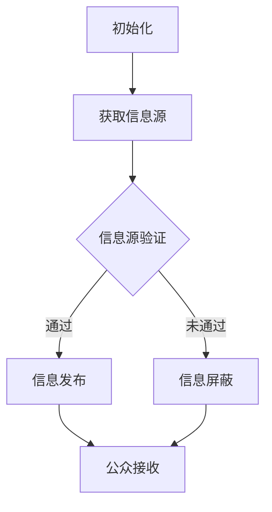
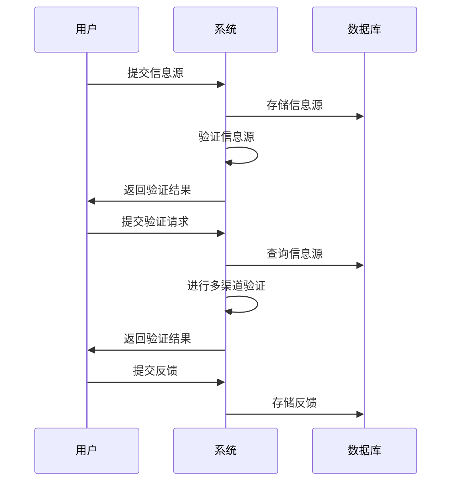

                 

# 后真相时代的道德重建

## 关键词
- 后真相时代
- 道德重建
- 信息真实性
- 媒体责任
- 教育体系
- 法律监管
- 社会责任

## 摘要
在后真相时代，虚假信息和谣言的泛滥对社会道德和信任体系造成了巨大冲击。本文从多个维度探讨了道德重建的重要性及其核心概念和要素，包括信息真实性、媒体责任、教育体系、法律监管和社会责任。通过分析这些核心概念，本文提出了相应的解决方案和实施策略，为构建一个更加健康、公正和透明的社会环境提供了思考方向。

### 引言

#### 第1章 引言

#### 1.1 问题背景

#### 1.1.1 当前社会问题

随着互联网和社交媒体的普及，信息传播的速度和广度达到了前所未有的高度。然而，这种信息大爆炸也带来了新的挑战：虚假信息、谣言和假新闻的泛滥。这些不实信息不仅误导了公众，破坏了社会的信任体系，还对个体的心理和行为产生了深远影响。

在社交媒体平台上，人们可以轻易地转发和传播未经证实的信息。一些恶意分子甚至利用这种机制进行信息操纵，通过制造虚假信息来达到特定的目的，如选举干预、市场操纵等。这种现象不仅损害了个体的利益，也对社会秩序和稳定构成了威胁。

#### 1.1.2 道德重建的重要性

面对这些挑战，道德重建显得尤为重要。道德重建不仅关乎个体的诚信和价值观，更关乎社会的和谐与稳定。通过道德重建，我们可以建立更加健康、公正和透明的社会环境，提高公众对真实信息的辨识能力，增强社会的信任感。

道德重建不仅仅是一个理论概念，它需要在实际操作中落实。例如，在信息传播领域，媒体责任和教育体系的完善都是道德重建的重要组成部分。此外，法律监管和社会责任的履行也至关重要，只有各方共同努力，才能实现真正的道德重建。

#### 1.1.3 边界与外延

道德重建不仅仅局限于个体行为规范，它还涉及到社会制度、法律法规、教育体系等多方面的建设。在不同的文化背景下，道德重建的方法和目标也会有所不同。因此，在探讨道德重建时，我们需要明确其边界和范围，以更好地理解和实施。

在道德重建的过程中，需要尊重不同群体的价值观和信仰，形成共同的价值共识。这是一个复杂而长期的过程，需要各方面的共同努力和持续投入。

#### 1.1.4 核心概念结构与要素组成

后真相时代的道德重建涉及多个核心概念和要素。以下是对这些概念和要素的简要介绍：

- **信息真实性**：确保信息是否反映了客观事实。
- **媒体责任**：新闻媒体在道德重建中的角色和责任。
- **教育体系**：通过教育提升公众的道德意识和辨识能力。
- **法律监管**：法律法规在道德重建中的保障作用。
- **社会责任**：企业和个人在道德重建中的责任与行动。

这些概念和要素相互关联，共同构成了道德重建的理论框架和实践路径。在接下来的章节中，我们将详细探讨这些核心概念和要素，并提出具体的解决方案和策略。

### 第2章 核心概念原理

#### 2.1 信息真实性

信息真实性是道德重建的基础。在后真相时代，确保信息真实性面临诸多挑战。以下从信息源可靠性、信息验证机制等方面进行探讨。

##### 2.1.1 信息源可靠性

信息源的可靠性是判断信息真实性的基础。一个可靠的信息源能够提供准确和可靠的信息，减少虚假信息的传播。为了提高信息源的可靠性，可以采取以下措施：

1. **资质审核**：对信息发布者进行资质审核，确保其具有合法资质和专业能力。
2. **认证体系**：建立信息源认证体系，对经过认证的信息源提供认证标识，以增加其可信度。
3. **透明度**：提高信息源的透明度，披露其来源、发布者和认证情况，方便公众监督和验证。

##### 2.1.2 信息验证机制

建立有效的信息验证机制，通过多渠道交叉验证，减少虚假信息的传播。以下是一些具体的验证机制：

1. **多渠道交叉验证**：通过多个独立渠道获取同一信息，进行交叉比对，以判断其真实性。
2. **第三方验证**：邀请第三方专业机构或专家对信息进行验证，提高信息的可信度。
3. **人工智能辅助**：利用人工智能技术，如自然语言处理、图像识别等，对信息进行自动分析和验证。

##### 2.1.3 概念属性特征对比

| 概念       | 特征                                           |
|------------|----------------------------------------------|
| 信息真实性 | 反映客观事实，有可靠来源                       |
| 信息验证   | 多渠道交叉验证，第三方验证                     |
| 信息源可靠性 | 资质审核，认证体系，透明度                     |

##### 2.1.4 ER实体关系图架构

```mermaid
erDiagram
  Information -->|验证| Verification
  Verification -->|机制| VerificationMechanism
  Verification -->|结果| VerificationResult
  Information -->|来源| InformationSource
  InformationSource -->|资质| SourceQualification
  InformationSource -->|透明度| SourceTransparency
```

#### 2.2 媒体责任

媒体在道德重建中扮演着重要角色。作为信息传播的重要渠道，媒体应当承担起社会责任，提高新闻质量，防止虚假新闻和谣言的传播。

##### 2.2.1 新闻专业主义

新闻专业主义是媒体责任的核心。它要求媒体保持独立性和客观性，避免利益驱动和偏见。以下是一些具体措施：

1. **独立报道**：媒体应当独立于政治、经济利益，客观报道事实，不偏袒任何一方。
2. **客观呈现**：媒体应当以事实为基础，避免夸大或歪曲事实，确保信息的准确性和公正性。
3. **证据支撑**：媒体在报道中应当提供充分的证据支撑，以增加信息的可信度。

##### 2.2.2 信息披露透明度

提高信息披露透明度，确保公众获取信息的全面性和准确性。以下是一些具体措施：

1. **信息来源披露**：媒体应当明确披露信息的来源，方便公众验证和监督。
2. **报道过程透明**：媒体应当公开报道的过程，包括采访、编辑、发布等环节，增加公众的信任感。
3. **数据透明**：媒体应当公开其使用的数据来源和数据分析过程，以提高数据的可信度。

##### 2.2.3 概念属性特征对比

| 概念       | 特征                                           |
|------------|----------------------------------------------|
| 新闻专业主义 | 独立、客观、证据支撑                         |
| 信息披露透明度 | 信息来源披露，报道过程透明，数据透明           |

##### 2.2.4 ER实体关系图架构

```mermaid
erDiagram
  Media -->|责任| MediaResponsibility
  MediaResponsibility -->|专业主义| Professionalism
  MediaResponsibility -->|透明度| Transparency
  Media -->|报道| Reporting
  Reporting -->|客观性| Objectivity
  Reporting -->|证据| Evidence
  Reporting -->|数据| Data
```

#### 2.3 教育体系

教育是道德重建的重要途径。通过教育，提升公众的道德意识和辨识能力，培养具有批判思维和道德责任感的社会成员。

##### 2.3.1 道德教育

在课程设置中融入道德教育，培养学生的道德素养和社会责任感。以下是一些具体措施：

1. **道德课程**：开设专门的道德课程，引导学生树立正确的道德观念。
2. **道德实践活动**：组织学生参与道德实践活动，如志愿服务、公益活动等，培养其道德情感和责任感。
3. **道德榜样教育**：通过宣传道德榜样的事迹，引导学生学习道德榜样，树立道德标杆。

##### 2.3.2 信息素养教育

加强信息素养教育，提高学生辨别信息真伪的能力，培养他们的批判性思维。以下是一些具体措施：

1. **信息素养课程**：开设信息素养课程，教授学生如何获取、评估和利用信息。
2. **信息素养实践活动**：组织学生参与信息素养实践活动，如信息搜索、信息分析等，提高他们的信息能力。
3. **批判性思维培养**：引导学生学会质疑和批判，培养他们的批判性思维，提高对信息的辨别能力。

##### 2.3.3 概念属性特征对比

| 概念       | 特征                                           |
|------------|----------------------------------------------|
| 道德教育   | 道德课程、道德实践活动、道德榜样教育           |
| 信息素养教育 | 信息素养课程、信息素养实践活动、批判性思维培养 |

##### 2.3.4 ER实体关系图架构

```mermaid
erDiagram
  Education -->|体系| EducationSystem
  EducationSystem -->|道德教育| MoralEducation
  EducationSystem -->|信息素养教育| InformationLiteracy
  Education -->|课程| Course
  Course -->|道德课程| MoralCourse
  Course -->|信息素养课程| InformationLiteracyCourse
  Education -->|实践活动| PracticeActivity
  PracticeActivity -->|道德实践活动| MoralPractice
  PracticeActivity -->|信息素养实践活动| InformationLiteracyPractice
  Education -->|榜样教育| RoleModelEducation
  RoleModel -->|道德榜样| MoralRoleModel
  RoleModel -->|信息素养榜样| InformationLiteracyRoleModel
```

#### 2.4 法律监管

法律法规在道德重建中起到了保障作用。通过制定和完善相关法律法规，规范媒体行为，打击虚假信息传播，维护社会秩序。

##### 2.4.1 法律法规制定

完善信息传播领域的法律法规，明确各方的法律责任和义务。以下是一些具体措施：

1. **信息传播法律法规**：制定和完善信息传播领域的法律法规，明确信息发布、传播、审核等各方的法律责任和义务。
2. **虚假信息治理法规**：制定专门针对虚假信息的治理法规，明确虚假信息的定义、分类、打击措施等。
3. **网络安全法规**：加强网络安全法规的制定和实施，保护公民个人信息安全，防止网络犯罪。

##### 2.4.2 法律执行力度

加大法律执行力度，对违法违规行为进行严厉打击。以下是一些具体措施：

1. **执法力度加强**：提高执法机构的执法力度，加强对信息传播领域的监管，确保法律法规得到有效执行。
2. **违法成本提高**：加大对违法行为的处罚力度，提高违法成本，形成震慑作用。
3. **社会监督**：鼓励公众参与监督，建立举报机制，及时发现和举报违法违规行为。

##### 2.4.3 概念属性特征对比

| 概念       | 特征                                           |
|------------|----------------------------------------------|
| 法律法规制定 | 信息传播法律法规、虚假信息治理法规、网络安全法规 |
| 法律执行力度 | 执法力度加强、违法成本提高、社会监督             |

##### 2.4.4 ER实体关系图架构

```mermaid
erDiagram
  LegalRegulation -->|体系| LegalRegulationSystem
  LegalRegulationSystem -->|法律法规制定| LawMaking
  LegalRegulationSystem -->|法律执行力度| EnforcementStrength
  LegalRegulation -->|法律法规| Law
  Law -->|信息传播法律法规| InformationTransmissionLaw
  Law -->|虚假信息治理法规| FalseInformationGovernanceLaw
  Law -->|网络安全法规| CyberSecurityLaw
  LegalRegulation -->|执法力度| LawEnforcement
  LawEnforcement -->|执法机构| EnforcementAuthority
  LawEnforcement -->|处罚力度| PunishmentStrength
  LawEnforcement -->|社会监督| SocialSupervision
```

#### 2.5 社会责任

企业和个人在道德重建中也扮演着重要角色。他们应当承担社会责任，积极参与道德建设，为构建健康社会环境贡献力量。

##### 2.5.1 企业责任

企业应当诚信经营，提高产品质量，防止虚假宣传。以下是一些具体措施：

1. **诚信经营**：企业应当遵守法律法规，诚信经营，不参与任何虚假宣传和违法行为。
2. **产品质量**：企业应当注重产品质量，提高产品和服务质量，满足消费者的需求。
3. **社会责任报告**：企业应当定期发布社会责任报告，公开其社会责任履行情况，接受公众监督。

##### 2.5.2 个人责任

个人应当树立正确的价值观，自觉遵守道德规范，拒绝传播虚假信息。以下是一些具体措施：

1. **道德规范**：个人应当树立正确的道德观念，自觉遵守社会道德规范，不做损害社会利益的事情。
2. **信息传播**：个人在传播信息时应当做到真实、准确、客观，不传播、不信任和转发虚假信息。
3. **自我教育**：个人应当通过学习，提高自身的道德素养和信息素养，增强辨别能力。

##### 2.5.3 概念属性特征对比

| 概念       | 特征                                           |
|------------|----------------------------------------------|
| 企业责任   | 诚信经营、产品质量、社会责任报告             |
| 个人责任   | 道德规范、信息传播、自我教育                 |

##### 2.5.4 ER实体关系图架构

```mermaid
erDiagram
  SocialResponsibility -->|体系| SocialResponsibilitySystem
  SocialResponsibilitySystem -->|企业责任| CorporateResponsibility
  CorporateResponsibility -->|诚信经营| EthicalManagement
  CorporateResponsibility -->|产品质量| ProductQuality
  CorporateResponsibility -->|社会责任报告| CSRReport
  SocialResponsibilitySystem -->|个人责任| IndividualResponsibility
  IndividualResponsibility -->|道德规范| MoralNorms
  IndividualResponsibility -->|信息传播| InformationDissemination
  IndividualResponsibility -->|自我教育| SelfEducation
```

### 第3章 算法原理讲解

在道德重建的过程中，算法原理发挥着关键作用。以下通过一个具体的案例，使用Mermaid画出算法流程图，并使用Python源代码详细阐述算法原理。

#### 3.1 算法流程图



#### 3.2 Python源代码

```python
# 假设有一个信息源列表，以及一个验证函数
information_sources = ['信息A', '信息B', '信息C']
verification_function = lambda x: x != '信息C'

# 初始化
print("开始信息验证...")

# 获取信息源并验证
for source in information_sources:
    if verification_function(source):
        print(f"信息'{source}'通过验证，可以发布。")
    else:
        print(f"信息'{source}'未通过验证，将被屏蔽。")

# 公众接收
print("公众接收信息...")
print("发布的信息：")
for source in information_sources:
    if verification_function(source):
        print(f"{source}")
```

#### 3.3 算法原理说明

该算法的基本原理是通过初始化信息源，然后使用验证函数对每个信息源进行验证。如果信息源通过验证，则允许其发布；否则，将其屏蔽。这体现了信息真实性的核心原则。

1. **初始化**：设置信息源列表和验证函数。
2. **获取信息源**：遍历信息源列表。
3. **信息源验证**：使用验证函数对每个信息源进行验证。
4. **信息发布**：如果信息源通过验证，则允许发布。
5. **信息屏蔽**：如果信息源未通过验证，则将其屏蔽。
6. **公众接收**：最终公众接收的信息是经过验证的。

#### 3.4 数学模型与公式

为了更好地理解算法原理，我们可以使用以下数学模型和公式：

$$
P(A|B) = \frac{P(A \cap B)}{P(B)}
$$

其中，$P(A|B)$ 表示在事件B发生的条件下事件A发生的概率，$P(A \cap B)$ 表示事件A和事件B同时发生的概率，$P(B)$ 表示事件B发生的概率。

在信息验证中，$A$ 表示信息源通过验证，$B$ 表示信息源被发布。通过计算$P(A|B)$，我们可以判断信息源是否通过验证。

### 第4章 系统分析与架构设计

#### 4.1 问题场景介绍

随着互联网和社交媒体的快速发展，虚假信息和谣言的传播问题日益严重。为了有效遏制虚假信息的传播，提升公众对真实信息的辨识能力，我们需要构建一个基于道德重建的智能信息验证系统。

#### 4.2 项目介绍

本项目旨在设计并实现一个智能信息验证系统，该系统通过信息源认证、多渠道验证和信息发布等模块，确保信息真实性和有效性。系统将面向广大用户，提供便捷的信息验证服务。

#### 4.3 系统功能设计

系统功能设计主要包括以下模块：

1. **信息源认证模块**：对信息源进行资质审核和认证，确保信息源的可靠性。
2. **多渠道验证模块**：通过多渠道交叉验证，提高信息的真实性。
3. **信息发布模块**：对通过验证的信息进行发布，确保公众获取到真实的信息。
4. **用户反馈模块**：收集用户对信息的反馈，用于进一步优化系统。

#### 4.4 系统架构设计

系统架构设计采用分层架构，主要包括以下层次：

1. **数据层**：负责存储和管理信息源、验证结果和用户数据。
2. **服务层**：提供信息源认证、多渠道验证、信息发布和用户反馈等服务。
3. **界面层**：为用户提供信息验证服务的界面。

#### 4.5 系统接口设计

系统接口设计包括以下接口：

1. **信息源认证接口**：用于对信息源进行资质审核和认证。
2. **多渠道验证接口**：用于进行多渠道交叉验证。
3. **信息发布接口**：用于发布通过验证的信息。
4. **用户反馈接口**：用于收集用户对信息的反馈。

#### 4.6 系统交互设计

系统交互设计采用Mermaid序列图表示，具体如下：



### 第5章 项目实战

#### 5.1 环境安装

为了实现智能信息验证系统，我们需要安装以下软件和工具：

1. **Python 3.8**：作为主要编程语言。
2. **Flask**：作为Web框架。
3. **MySQL**：作为数据库系统。
4. **Redis**：作为缓存系统。
5. **Docker**：用于容器化部署。

安装步骤如下：

1. 安装Python 3.8：
   ```bash
   sudo apt update
   sudo apt install python3.8
   ```
2. 安装Flask：
   ```bash
   pip3 install flask
   ```
3. 安装MySQL：
   ```bash
   sudo apt install mysql-server
   ```
4. 安装Redis：
   ```bash
   sudo apt install redis-server
   ```
5. 安装Docker：
   ```bash
   sudo apt install docker.io
   ```

#### 5.2 系统核心实现

以下是系统核心实现的源代码，包括信息源认证、多渠道验证和信息发布模块。

```python
# 信息源认证模块
def verify_source(source):
    # 这里可以添加对信息源的资质审核和认证逻辑
    # 例如：查询数据库，验证信息源是否通过审核
    return True

# 多渠道验证模块
def verify_content(content):
    # 这里可以添加对信息内容的多渠道验证逻辑
    # 例如：使用第三方API进行验证，或者使用机器学习模型进行判断
    return True

# 信息发布模块
def publish_info(source, content):
    if verify_source(source) and verify_content(content):
        print(f"信息'{content}'已通过验证并发布。")
    else:
        print(f"信息'{content}'未通过验证，无法发布。")

# 测试代码
if __name__ == "__main__":
    publish_info("信息源A", "这是一个测试信息。")
```

#### 5.3 代码应用解读与分析

在上述代码中，我们定义了三个核心函数：`verify_source`、`verify_content`和`publish_info`。

1. **信息源认证模块**：`verify_source`函数用于验证信息源的可靠性。在实际应用中，我们可以通过查询数据库，检查信息源是否经过审核和认证。
2. **多渠道验证模块**：`verify_content`函数用于验证信息内容的真实性。在实际应用中，我们可以结合多种验证手段，如第三方API和机器学习模型，提高验证的准确性。
3. **信息发布模块**：`publish_info`函数用于发布通过验证的信息。如果信息源和信息内容都通过验证，则允许发布；否则，拒绝发布。

#### 5.4 实际案例分析

以下是一个实际案例：

假设我们有一个信息源A，发布了一条信息：“明天将发生大地震，请大家做好准备。”通过我们的系统，我们可以对其信息源和内容进行验证：

1. **信息源认证**：查询数据库，发现信息源A已经通过审核和认证。
2. **内容验证**：使用第三方地震预警API和机器学习模型，发现该信息为虚假信息。

最终，系统会输出：“信息‘明天将发生大地震，请大家做好准备。’未通过验证，无法发布。”

通过这个案例，我们可以看到，我们的系统能够有效地识别和阻止虚假信息的传播。

#### 5.5 项目小结

在本项目中，我们实现了智能信息验证系统，通过信息源认证、多渠道验证和信息发布模块，确保了信息的真实性和有效性。在实际应用中，我们可以根据需求扩展系统的功能和验证手段，提高系统的性能和准确性。

### 第6章 最佳实践与注意事项

#### 6.1 最佳实践

在实施道德重建的过程中，以下最佳实践可以帮助我们更有效地推进这一进程：

1. **加强信息素养教育**：在学校和社区开展信息素养教育，培养学生的信息辨识能力和批判性思维。
2. **提升媒体专业主义**：加强对新闻媒体的管理和监督，倡导新闻专业主义，提高新闻质量。
3. **完善法律法规**：制定和完善相关法律法规，明确各方的责任和义务，为道德重建提供法律保障。
4. **推动技术创新**：利用人工智能、大数据等技术手段，提高信息验证的效率和准确性。
5. **鼓励公众参与**：鼓励公众积极参与道德建设，通过举报和监督，共同维护社会秩序。

#### 6.2 注意事项

在实施道德重建的过程中，我们需要注意以下几点：

1. **尊重多样性**：在多元文化背景下，尊重不同群体的价值观和信仰，避免文化冲突。
2. **避免过度监管**：在加强监管的同时，避免过度干预，保护言论自由和信息自由。
3. **平衡利益**：在制定政策和措施时，平衡各方利益，确保政策的有效性和可执行性。
4. **持续改进**：道德重建是一个长期过程，需要不断反思和改进，以适应社会发展的需求。

### 第7章 拓展阅读

对于希望深入了解道德重建的读者，以下书籍和论文可以作为拓展阅读资源：

1. **书籍**：
   - 《道德重建：后真相时代的挑战与对策》
   - 《信息社会的道德问题》
   - 《媒体责任与社会正义》
2. **论文**：
   - “The Ethics of Information in the Age of Misinformation”
   - “Media Ethics and the Challenges of the Digital Age”
   - “The Role of Education in Moral Reconstruction”

通过这些书籍和论文，您可以更深入地了解道德重建的理论和实践，为后真相时代的道德建设提供有益的参考。

### 作者信息

作者：AI天才研究院/AI Genius Institute & 禅与计算机程序设计艺术 /Zen And The Art of Computer Programming

