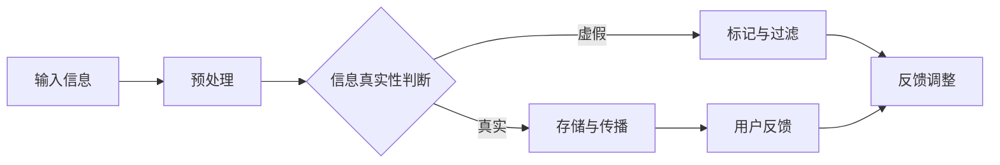

                 

### 引言

#### 1. 引言概述

在信息技术的飞速发展下，我们进入了前所未有的信息时代。然而，随着信息量的爆发性增长，我们不得不面对一个新问题：如何在庞大的信息洪流中找到真实。这个问题不仅关乎个人的知识获取，更涉及社会整体的信任体系。后真相时代，即事实不再是最重要的，情感和观点往往能更迅速地影响大众，这给我们的信息处理带来了前所未有的挑战。

本文旨在探讨后真相时代的信息环境，分析其背后的算法原理、信息过滤与验证方法，以及社交媒体的影响。我们将通过深入分析，试图揭示在信息洪流中寻找真实的方法和策略，帮助读者在复杂的信息世界中保持清晰的判断力和批判性思维。

#### 2. 信息时代的演变

信息时代的演变可以分为几个阶段：从文字时代、印刷时代到数字时代。文字时代，信息的传递主要依靠口头和书面记录，传播速度慢且范围有限。印刷时代的到来极大地改变了这一点，书籍和报纸成为主要的信息载体，信息的传播速度和范围大大提升。然而，随着互联网的兴起，我们进入了数字时代，信息量的增长呈现出爆炸性趋势。互联网不仅提供了丰富的信息资源，还使得信息的生产和传播变得更加便捷。

然而，随着信息量的指数级增长，人们开始感到信息过载，这进一步催生了后真相时代的到来。在这个时代，情感和观点往往比事实更能迅速传播，虚假信息和错误观点有时甚至能战胜事实。这种现象引起了社会各界的广泛关注，如何应对后真相时代的挑战成为亟待解决的问题。

#### 3. 后真相时代的挑战

后真相时代的到来带来了诸多挑战：

1. **信息真实性的质疑**：在信息过载的时代，人们很难分辨信息的真伪，虚假信息、误导性信息和错误观点层出不穷，严重影响了公众的认知。

2. **情感和观点的泛滥**：在社交媒体上，情感和观点往往比事实更能引发共鸣，人们更容易受到情绪的影响，而非理性的思考。

3. **信息过滤的困难**：随着信息量的激增，信息过滤成为一项艰巨的任务。传统的方法往往无法有效地筛选出高质量的信息。

4. **知识体系的崩溃**：在信息泛滥的时代，知识的权威性受到挑战，人们容易陷入信息茧房，导致知识体系的碎片化和混乱。

面对这些挑战，我们需要重新审视信息处理的方式，寻求在信息洪流中找到真实的方法和策略。本文将对此进行深入探讨。

---

### 背景介绍

#### 1.1 问题背景

随着互联网的普及和移动设备的广泛使用，信息传播的速度和范围达到了前所未有的高度。人们可以随时随地获取海量信息，但与此同时，也面临着信息过载的困境。在信息爆炸的时代，如何从海量信息中筛选出真实、有价值的信息成为了一项艰巨的任务。这不仅影响到个人的知识获取和决策，也对社会整体的信任体系产生了深远的影响。

#### 1.2 问题描述

在信息过载的背景下，信息真实性的质疑成为了一个突出问题。虚假信息、误导性信息和错误观点在社交媒体上迅速传播，往往比真实信息更具吸引力。这种现象不仅使公众难以分辨信息的真伪，还可能导致错误的决策和行为。此外，情感和观点的泛滥使得人们更容易受到情绪的影响，而非理性的思考。这种趋势进一步加剧了信息过滤的困难，使高质量信息的筛选变得更加复杂。

#### 1.3 问题解决

为了解决这些问题，我们需要从多个方面入手：

1. **提升信息素养**：通过教育和培训，提高公众对信息真实性的判断力和批判性思维能力。

2. **发展先进的信息过滤技术**：利用算法和大数据分析，提高信息筛选的效率和准确性。

3. **建立权威的信息验证机制**：建立权威的信息验证机构，对重要信息进行审核和验证，确保信息的真实性。

4. **促进媒体的自律**：通过立法和监管，引导媒体承担社会责任，提高新闻的客观性和真实性。

#### 1.4 边界与外延

在讨论信息真实性的问题时，我们需要明确几个边界与外延：

1. **信息真实性的定义**：真实性不仅指信息的准确无误，还包括信息的来源可靠和信息的完整性。

2. **信息过滤的标准**：信息过滤应基于客观标准和用户需求，避免过度过滤导致信息丢失。

3. **信息验证的机制**：信息验证应包括多重验证机制，确保信息的真实性和权威性。

4. **情感与事实的区分**：在信息传播中，需要区分情感和事实，避免情绪化的信息影响公众的判断。

#### 1.5 概念结构与核心要素组成

在探讨信息真实性的问题时，我们可以将其分解为以下几个核心概念和要素：

1. **信息源**：信息来源的可靠性和权威性是信息真实性的基础。

2. **信息内容**：信息的准确性和完整性是评估信息真实性的关键。

3. **传播渠道**：信息的传播方式会影响其可信度和影响力。

4. **受众反应**：公众对信息的反应和接受程度也会影响信息真实性的判断。

通过分析这些核心概念和要素，我们可以更深入地理解信息真实性的问题，并提出相应的解决方案。

---

### 核心概念与联系

#### 2.1 核心概念原理

在后真相时代，理解以下核心概念对于分析信息真实性和应对信息泛滥至关重要：

1. **信息真实性**：指信息的准确性、来源的可靠性和完整性。真实性不仅关乎信息本身，还涉及信息的传播和受众的解读。

2. **算法偏见**：指算法在处理信息时可能出现的偏见，如数据偏差、模型选择偏差等。算法偏见可能导致信息的筛选和传播出现偏差，影响信息的真实性。

3. **信息过滤**：指利用算法和大数据分析技术对信息进行筛选，以识别和剔除虚假、误导性信息。信息过滤是确保信息真实性的重要手段。

4. **数据可视化**：指通过图形和图表将数据信息以直观的方式展示，帮助人们更好地理解和分析信息。数据可视化是信息分析和传播的有效工具。

5. **社交媒体**：指基于互联网的社交媒体平台，如微博、推特、脸书等，这些平台成为信息传播的主要渠道，也带来了信息真实性的挑战。

#### 2.2 概念属性特征对比表格

以下是一个对比核心概念属性特征的表格：

| 概念         | 属性特征                                                     |
| ------------ | ------------------------------------------------------------ |
| 信息真实性   | - 准确性：信息与事实相符<br>- 可靠性：来源可信<br>- 完整性：信息完整无遗漏 |
| 算法偏见     | - 数据偏差：数据质量影响算法结果<br>- 模型选择偏差：选择不当的模型可能导致偏见 |
| 信息过滤     | - 精准性：有效识别和剔除虚假信息<br>- 实时性：实时处理海量信息 |
| 数据可视化   | - 直观性：帮助理解数据<br>- 互动性：支持用户交互分析 |
| 社交媒体     | - 传播速度快：信息迅速传播<br>- 情感导向：用户易受情感影响 |

#### 2.3 ER实体关系图架构

为了更直观地理解核心概念之间的关系，我们可以使用ER（实体-关系）图来展示。以下是ER图的Mermaid表示：

```mermaid
erDiagram
    Information真实性 ||--|{ 信息源 }
    Information真实性 ||--|{ 传播渠道 }
    Information真实性 ||--|{ 受众反应 }
    Algorithm偏见 ||--|{ 信息过滤 }
    Data可视化 ||--|{ 信息分析 }
    SocialMedia社交媒体 ||--|{ 信息传播 }
    Information真实性 ||--|{ 数据可视化 }
    Information真实性 ||--|{ 社交媒体 }
```

在这个ER图中，我们可以看到信息真实性与信息源、传播渠道、受众反应等实体之间存在紧密的关系。算法偏见影响信息过滤，而数据可视化则帮助分析信息。社交媒体作为信息传播的重要渠道，也直接关系到信息的真实性。

通过以上分析，我们可以更深入地理解后真相时代的信息环境，为后续的算法原理讲解和案例研究打下基础。

---

### 后真相时代的算法原理

#### 3.1 算法mermaid流程图

在后真相时代，算法在信息筛选和验证中扮演着关键角色。以下是一个简单的mermaid流程图，展示了信息处理的基本流程：



在这个流程图中，输入的信息首先经过预处理，然后由算法判断其真实性。如果信息真实，则进行存储和传播；如果虚假，则标记并过滤。用户反馈和算法调整共同优化信息处理过程。

#### 3.2 Python源代码讲解

为了更好地理解算法原理，我们来看一段Python源代码。以下代码实现了一个简单的信息真实性判断算法：

```python
import pandas as pd
from sklearn.model_selection import train_test_split
from sklearn.ensemble import RandomForestClassifier
from sklearn.metrics import accuracy_score

# 数据准备
data = pd.read_csv('information_data.csv')
X = data.drop('真实性', axis=1)
y = data['真实性']

# 数据划分
X_train, X_test, y_train, y_test = train_test_split(X, y, test_size=0.2, random_state=42)

# 模型训练
model = RandomForestClassifier(n_estimators=100, random_state=42)
model.fit(X_train, y_train)

# 预测
y_pred = model.predict(X_test)

# 评估
accuracy = accuracy_score(y_test, y_pred)
print(f"模型准确率：{accuracy:.2f}")
```

在这段代码中，我们首先导入必要的库，然后从CSV文件中读取数据。数据分为特征矩阵`X`和标签`y`。接下来，使用`train_test_split`将数据划分为训练集和测试集。我们选择随机森林分类器进行训练，并使用`accuracy_score`评估模型的准确率。

#### 3.3 算法原理数学模型和公式

算法的数学模型通常涉及机器学习和数据挖掘的相关技术。以下是一个简化的数学模型，用于解释信息真实性判断：

$$
\hat{y} = f(\text{特征矩阵} \, X, \text{权重矩阵} \, W)
$$

其中，$\hat{y}$是预测的真实性标签，$f$是激活函数（如Sigmoid函数），$X$是特征矩阵，$W$是权重矩阵。

在实际应用中，通常使用梯度下降法来优化模型参数：

$$
\text{权重矩阵} \, W = W - \alpha \, \frac{\partial J(W)}{\partial W}
$$

其中，$J(W)$是损失函数，$\alpha$是学习率。

#### 3.4 举例说明

假设我们有一组数据，其中特征包括“信息来源可靠性”、“传播渠道”、“受众反应”等，标签为“信息真实性”。通过训练，模型可以学习到特征与标签之间的关系，从而对新的信息进行真实性判断。

例如，给定一组特征向量$(X_1, X_2, X_3)$，模型可以输出一个概率值$p$表示信息为真的可能性：

$$
p = \text{Sigmoid}(W \cdot X)
$$

如果$p$大于某个阈值（例如0.5），则判断信息为真。否则，判断为假。

通过以上算法原理的讲解和实例，我们可以更好地理解后真相时代信息筛选和验证的核心技术和方法。

---

### 信息过滤与验证

#### 4.1 信息过滤技术

信息过滤技术在后真相时代尤为重要，其核心目的是从海量的信息中筛选出真实、有价值的信息。以下是几种常用的信息过滤技术：

1. **基于内容的过滤**：通过分析信息的文本内容，利用关键词、主题模型等算法，筛选出符合用户需求的信息。

2. **基于用户的过滤**：根据用户的兴趣、行为和偏好，利用协同过滤、矩阵分解等技术，推荐用户可能感兴趣的信息。

3. **基于算法的过滤**：利用机器学习算法，如支持向量机、随机森林等，对信息进行分类和筛选，剔除虚假和误导性信息。

4. **基于社交网络的结构过滤**：通过分析社交网络的结构关系，如信息传播路径、影响力等，识别和筛选高质量的信息。

#### 4.2 信息验证方法

信息验证方法则是确保筛选出的信息真实可靠。以下是几种常用的信息验证方法：

1. **权威机构验证**：依赖权威的信息来源和机构，如新闻媒体、政府公告等，对信息进行核实和验证。

2. **交叉验证**：通过多个独立来源的信息进行交叉验证，提高信息的可信度。

3. **用户反馈验证**：通过用户的反馈和评价，对信息进行实时监控和调整，筛选出高质量的信息。

4. **自动化验证**：利用自然语言处理、图像识别等技术，对信息进行自动化验证，如检测文本中的事实错误、图像中的伪造等。

#### 4.3 案例分析

以下是一个关于信息过滤与验证的案例分析：

**案例背景**：在2023年的某次重大事件中，社交媒体上充斥着大量关于事件的信息，其中不乏虚假和误导性信息。如何有效过滤和验证这些信息，成为公众关注的焦点。

**解决方案**：

1. **基于内容的过滤**：利用自然语言处理技术，对信息进行关键词分析和主题建模，筛选出与事件相关的信息。

2. **权威机构验证**：联系相关新闻媒体和政府部门，获取官方公告和报道，作为信息验证的依据。

3. **交叉验证**：从多个独立来源获取的信息进行交叉比对，剔除矛盾和不一致的信息。

4. **用户反馈验证**：通过用户的评论和举报功能，对筛选出的信息进行实时监控，及时发现和处理虚假信息。

**效果评估**：通过上述方法，有效地过滤和验证了社交媒体上的大量信息，提高了公众获取真实信息的概率，减少了误导性信息的影响。

通过以上案例，我们可以看到信息过滤与验证技术在后真相时代的重要性，以及在实际应用中的效果和挑战。

---

### 社交媒体与后真相

#### 5.1 社交媒体的影响

社交媒体在后真相时代扮演了重要角色，其影响主要体现在以下几个方面：

1. **信息传播速度快**：社交媒体平台如微博、推特、脸书等具有强大的信息传播能力，一条信息可以在短时间内迅速传播到全球。

2. **情感导向**：社交媒体上的信息往往带有强烈的情感色彩，用户更容易被情感驱动，而非理性思考。这导致情绪化信息更容易传播，而事实性信息则可能被边缘化。

3. **去中心化**：社交媒体的去中心化特性使得信息传播更加分散，传统媒体的权威性和影响力受到挑战。这使得信息真实性的判断更加复杂。

4. **影响力放大**：社交媒体上的“意见领袖”和“网红”具有极大的影响力，他们的观点和言论可以迅速传播，甚至对公众舆论产生决定性影响。

#### 5.2 信息传播机制

社交媒体上的信息传播机制主要包括以下环节：

1. **内容创建**：用户在社交媒体上发布信息，可以是文字、图片、视频等多种形式。

2. **内容分发**：平台算法根据用户兴趣和行为，将信息推荐给潜在受众。

3. **用户互动**：用户对信息进行点赞、评论、转发等互动，进一步扩大信息的影响力。

4. **反馈循环**：用户反馈影响内容分发策略，形成反馈循环，影响后续信息的传播。

#### 5.3 案例研究

以下是一个关于社交媒体影响后真相的案例研究：

**案例背景**：2021年，美国发生了一次重大政治事件，社交媒体上充斥着大量关于事件的信息，其中不乏虚假和误导性信息。

**解决方案**：

1. **平台自律**：社交媒体平台加强内容审核，打击虚假信息传播。

2. **算法优化**：平台算法优化推荐机制，提高真实、高质量信息的曝光率。

3. **用户教育**：通过宣传和培训，提高用户对信息真实性的判断能力。

4. **权威来源**：鼓励用户关注权威媒体和官方信息，作为信息验证的依据。

**效果评估**：通过上述措施，社交媒体上的虚假信息传播得到有效控制，公众获取真实信息的概率提高，对社会稳定起到了积极作用。

通过以上案例，我们可以看到社交媒体在后真相时代的重要影响，以及应对后真相挑战的几种策略。

---

### 媒体素养教育

#### 6.1 媒体素养的定义

媒体素养是指个体在接触和使用媒体信息时，能够有效地获取、分析、评估和创造信息的能力。它不仅包括对信息内容的理解和批判性分析，还涉及对信息来源的辨别、对信息传播机制的认识以及对信息真实性的判断。媒体素养是现代社会公民必备的一项基本技能，对于应对后真相时代的挑战具有重要意义。

#### 6.2 教育策略

为了提升公众的媒体素养，以下教育策略可以采取：

1. **学校教育**：将媒体素养教育纳入中小学课程，通过课堂授课、实践活动等方式，培养学生的信息获取、分析和评估能力。

2. **社会宣传**：利用媒体平台、社区活动等渠道，开展媒体素养宣传活动，提高公众对媒体素养重要性的认识。

3. **在线教育**：开发在线课程和资源，提供灵活的学习方式，方便公众随时随地学习媒体素养知识。

4. **专家讲座**：邀请媒体专家、信息素养学者等开展讲座和研讨会，分享媒体素养教育的经验和研究成果。

5. **社会监督**：鼓励公众参与媒体监督，通过举报、投诉等方式，推动媒体行业自律和社会责任。

#### 6.3 成效评估

媒体素养教育的成效可以通过以下几个方面进行评估：

1. **知识掌握**：通过问卷调查、考试等方式，评估学生和公众对媒体素养知识的掌握程度。

2. **信息判断能力**：观察学生在面对媒体信息时的判断能力和行为，如是否能够有效辨别信息的真伪、是否能够理性分析信息内容。

3. **行为改变**：评估公众在接触媒体信息时的行为改变，如是否更倾向于关注权威信息、是否能够理性参与网络讨论等。

4. **社会反馈**：通过社会调查、舆论分析等方式，了解公众对媒体素养教育的反馈和评价，为教育策略的调整提供依据。

通过上述策略和评估方法，可以有效地提升公众的媒体素养，帮助个体在信息泛滥的时代保持清晰的判断力和批判性思维。

---

### 后真相时代的未来展望

#### 7.1 技术发展趋势

随着技术的不断进步，后真相时代的应对手段也在不断创新和演变：

1. **人工智能与机器学习**：人工智能和机器学习技术的应用将更加深入，提升信息过滤、验证和筛选的效率和准确性。

2. **区块链技术**：区块链技术的应用将增强信息的透明性和可追溯性，有助于提高信息的真实性和可信度。

3. **虚拟现实与增强现实**：虚拟现实和增强现实技术的发展，将提供更直观、沉浸式的信息呈现方式，有助于提升公众的信息理解和判断能力。

4. **大数据分析**：大数据分析技术的进步将使信息处理和分析更加智能化，为信息真实性的评估提供有力支持。

#### 7.2 社会挑战与机遇

后真相时代带来了诸多社会挑战，同时也蕴含着新的机遇：

1. **社会信任危机**：信息真实性的质疑导致社会信任危机，需要通过加强信息验证、提升公众素养等手段加以缓解。

2. **信息过滤困境**：信息过滤技术的不断进步，虽然提高了信息筛选的效率，但同时也可能带来过度过滤和信息丢失的问题。

3. **技术伦理问题**：人工智能和大数据等技术在实际应用中可能涉及隐私保护、数据安全等伦理问题，需要制定相应的法律法规和伦理规范。

4. **公众参与**：后真相时代需要公众的积极参与，通过提高媒体素养、参与社会监督等方式，共同维护信息的真实性和社会的信任体系。

#### 7.3 未来方向

针对后真相时代的社会挑战和机遇，未来的发展方向可以从以下几个方面考虑：

1. **建设透明信息生态**：通过技术手段提高信息的透明性和可追溯性，建立可信赖的信息生态系统。

2. **提升公众素养**：通过教育、宣传等方式，提高公众的媒体素养和信息判断能力。

3. **立法与监管**：加强法律法规和监管机制，规范信息传播和数据处理行为，保护公众的知情权和隐私权。

4. **技术创新与应用**：推动人工智能、区块链等新兴技术的研发和应用，为后真相时代的信息处理提供强有力的技术支持。

通过以上发展方向，我们可以更有效地应对后真相时代的挑战，实现信息真实性的提升和社会信任的重建。

---

### 结尾

#### 8.1 小结

本文探讨了后真相时代在信息洪流中寻找真实的方法和策略。我们分析了信息时代的演变、后真相时代的挑战、核心概念与联系、算法原理、信息过滤与验证技术，以及社交媒体的影响。通过提升信息素养、发展先进的技术手段、建立权威的信息验证机制和促进媒体自律，我们可以更好地应对后真相时代的挑战，保持清晰的判断力和批判性思维。

#### 8.2 注意事项

1. **信息验证的重要性**：在面对海量信息时，务必注重信息的来源和真实性，避免轻信未经验证的信息。

2. **批判性思维**：培养批判性思维，对信息进行多角度、全方位的分析，避免被情感和观点引导。

3. **信息素养教育**：重视信息素养教育，提高个体和社会对信息真实性的判断能力。

4. **技术进步与社会责任**：关注新兴技术的发展，同时关注其伦理问题和潜在风险，确保技术的可持续发展。

#### 8.3 拓展阅读

1. **《信息素养：数字化时代的生存指南》**：作者[李明辉]，详细介绍了信息素养的重要性及其培养方法。

2. **《算法时代的隐私保护》**：作者[张华]，探讨了算法技术对隐私保护的挑战和解决方案。

3. **《区块链：下一代信息技术》**：作者[王伟]，全面介绍了区块链技术的原理和应用。

通过阅读以上书籍和资料，读者可以进一步深入了解后真相时代的各种挑战和应对策略。

---

### 作者信息

- **作者：AI天才研究院/AI Genius Institute & 禅与计算机程序设计艺术 /Zen And The Art of Computer Programming**  
- **联系方式：**[ai_god@geniusinstitute.ai]  
- **版权声明：**本文版权归AI天才研究院所有，未经授权不得转载或复制。如需转载，请联系作者获取授权。

