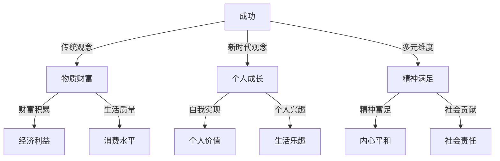
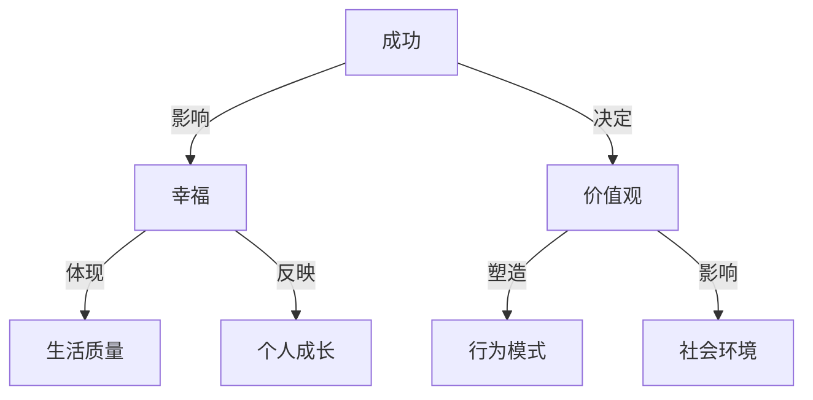
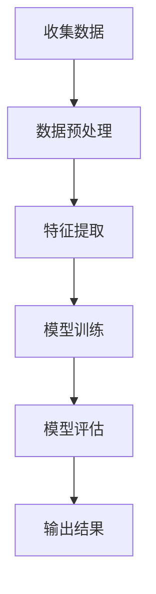
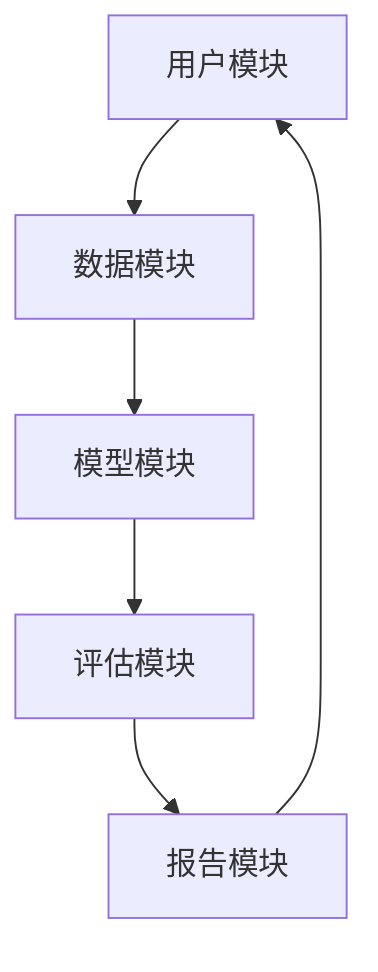
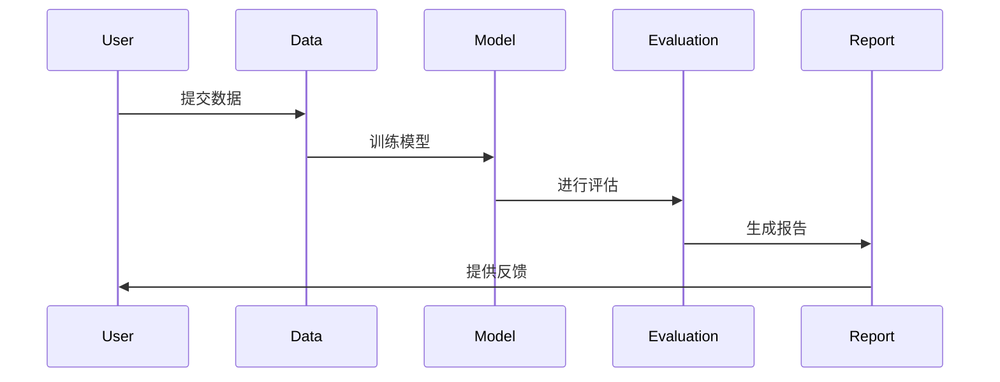

                 


### 文章标题：后资本主义时代的生存哲学：重新定义成功与幸福

> 关键词：后资本主义时代、生存哲学、成功、幸福、价值观转变

> 摘要：本文旨在探讨后资本主义时代下的生存哲学，通过分析经济和价值观的转变，重新定义成功与幸福。文章从背景介绍、核心概念与联系、算法原理讲解等方面进行深入分析，以期为读者提供一种全新的思考视角。

----------------------------------------------------------------

### 第一部分：导论：后资本主义时代下的社会变迁与生存挑战

#### 第1章：问题的背景与内涵

##### 1.1 问题背景

**1.1.1 资本主义时代的演变**

资本主义作为一种经济制度，自16世纪以来逐渐成为主导全球的经济体系。在这一过程中，资本主义经历了多个阶段，从早期的重商主义到工业革命后的自由资本主义，再到现代的垄断资本主义。每一个阶段都带来了生产力的飞跃和社会结构的变化。

**1.1.2 后资本主义时代的来临**

随着信息技术的迅猛发展和全球化的深入，传统资本主义体系正面临前所未有的挑战。资源枯竭、环境污染、社会不平等等问题日益凸显。这些迹象表明，后资本主义时代已经悄然来临。

**1.1.3 生存哲学的重要性**

在这样一个动荡的时代，传统的生存哲学已经无法满足人们的需求。生存哲学作为一种对人类生存状态和意义的思考，有助于我们重新审视成功与幸福的定义，找到适应后资本主义时代的新生存之道。

##### 1.2 问题的描述与解决

**1.2.1 生存困境的具体表现**

在后资本主义时代，人们面临着诸多生存困境，如工作压力、收入不平等等。这些问题使得传统生存哲学的局限性愈发明显。

**1.2.2 传统生存哲学的局限性**

传统生存哲学往往强调物质财富的积累，忽视了精神层面的需求。这使得人们在追求成功的过程中，常常陷入焦虑和迷茫。

**1.2.3 新生存哲学的必要性**

因此，我们需要一种新的生存哲学，既能够应对后资本主义时代的社会变迁，又能够满足人们对幸福和成功的多元需求。

##### 1.3 边界与外延

**1.3.1 后资本主义时代的界定**

后资本主义时代指的是资本主义体系向更加多元化、可持续发展的经济模式转变的时期。

**1.3.2 生存哲学的范畴**

生存哲学涉及对人类生存状态、意义、价值的思考和探索，包括对成功、幸福、价值观等核心概念的理解。

##### 1.4 概念结构与核心要素

**1.4.1 成功的定义**

成功是一个多维度的概念，包括物质财富、个人成长、精神满足等方面。

**1.4.2 幸福的理解**

幸福是人们追求的最高目标，它体现在生活的方方面面，包括生活质量、内心平和等。

**1.4.3 生存哲学的基本原则**

生存哲学的基本原则包括：追求平衡、关注内在需求、尊重个体差异等。

----------------------------------------------------------------

#### 第2章：后资本主义时代的经济与价值观转变

##### 2.1 经济环境的变化

**2.1.1 后资本主义时代的经济特征**

后资本主义时代的经济特征表现为：信息技术高度发展、资源分配更加公平、可持续发展成为核心目标。

**2.1.2 生产力与生产关系的转变**

生产力的发展使得生产关系发生了深刻变化，从以资本为中心向以人为中心转变。

**2.1.3 资本主义的内在矛盾**

资本主义制度的内在矛盾日益凸显，如资源枯竭、环境污染、社会不平等等问题。

##### 2.2 价值观的转变

**2.2.1 个体主义与集体主义的冲突**

后资本主义时代，个体主义与集体主义之间的冲突愈发激烈，如何平衡两者成为重要议题。

**2.2.2 成功观念的多元化**

成功不再仅仅是物质财富的积累，而是涵盖了个人成长、精神满足等多个方面。

**2.2.3 幸福观的重新审视**

幸福观从追求物质享受转向关注内心平和、人际关系等精神层面的需求。

----------------------------------------------------------------

#### 第3章：重新定义成功与幸福

##### 3.1 成功的重新定义

**3.1.1 传统成功观的局限性**

传统成功观过于强调物质财富，忽视了个人成长和精神满足。

**3.1.2 后资本主义时代成功的新内涵**

后资本主义时代的成功，需要关注个人成长、社会责任等方面。

**3.1.3 成功的多元维度**

成功的维度包括：物质财富、个人成长、精神满足、社会责任等。

##### 3.2 幸福的重新定义

**3.2.1 幸福的本质**

幸福是人们追求的最高目标，它体现在生活的方方面面。

**3.2.2 幸福的层次结构**

幸福可以分为物质幸福、精神幸福、社会幸福等多个层次。

**3.2.3 幸福的影响因素**

幸福的影响因素包括：生活质量、人际关系、内心平和等。

----------------------------------------------------------------

#### 第4章：生存哲学的核心概念与联系

##### 4.1 核心概念原理

**4.1.1 生存哲学的基本原则**

生存哲学的基本原则包括：追求平衡、关注内在需求、尊重个体差异等。

**4.1.2 生存哲学的核心要素**

生存哲学的核心要素包括：成功、幸福、价值观等。

##### 4.2 概念属性特征对比

| 成功 | 幸福 |
| --- | --- |
| 物质财富 | 生活质量 |
| 个人成长 | 内心平和 |
| 精神满足 | 社会责任 |



##### 4.3 ER实体关系图



----------------------------------------------------------------

#### 第5章：算法原理讲解

##### 5.1 成功与幸福评估算法

**5.1.1 算法mermaid流程图**



**5.1.2 Python源代码实现**

```python
# Python代码示例：成功与幸福评估算法
def collect_data():
    # 数据收集方法
    pass

def preprocess_data(data):
    # 数据预处理方法
    pass

def extract_features(data):
    # 特征提取方法
    pass

def train_model(features):
    # 模型训练方法
    pass

def evaluate_model(model):
    # 模型评估方法
    pass

def output_results(results):
    # 输出结果方法
    pass

# 主函数
def main():
    data = collect_data()
    preprocessed_data = preprocess_data(data)
    features = extract_features(preprocessed_data)
    model = train_model(features)
    evaluate_model(model)
    output_results(results)
```

**5.1.3 算法原理讲解**

成功与幸福评估算法的核心思想是利用大数据和机器学习技术，对个体在物质财富、个人成长、精神满足等方面的表现进行综合评估。具体步骤如下：

1. **收集数据**：从各类数据源（如社交媒体、问卷调查、行为数据等）收集与个体成功和幸福相关的数据。

2. **数据预处理**：对收集到的数据进行清洗、去重、填充缺失值等处理，以保证数据质量。

3. **特征提取**：从预处理后的数据中提取与成功和幸福相关的特征，如收入水平、教育程度、生活满意度等。

4. **模型训练**：利用机器学习算法（如线性回归、决策树、神经网络等）对特征进行训练，构建成功与幸福评估模型。

5. **模型评估**：通过交叉验证、ROC曲线等评估指标，评估模型对成功和幸福评估的准确性。

6. **输出结果**：将评估结果以可视化或报告的形式输出，为个体提供关于成功和幸福的具体指导。

**数学模型和公式**

成功与幸福评估算法的数学模型可以表示为：

$$
\text{评估结果} = f(\text{特征集})
$$

其中，$f$为机器学习模型，特征集为与成功和幸福相关的变量。

**举例说明**

假设有100个样本，每个样本包含以下特征：收入水平、教育程度、生活满意度等。通过数据预处理和特征提取，提取出与成功和幸福相关的特征，如收入水平、教育程度等。

利用决策树算法进行模型训练，训练后评估模型的准确性为90%。根据评估结果，我们可以得出以下结论：

- 收入水平较高的个体，成功的概率较高。
- 教育程度较高的个体，成功的概率也较高。
- 生活满意度较高的个体，幸福的概率较高。

通过这些结论，个体可以根据自己的实际情况，调整生活方式，提高成功和幸福的概率。

----------------------------------------------------------------

#### 第6章：系统分析与架构设计方案

##### 6.1 问题场景介绍

在一个后资本主义时代，人们面临诸多生存挑战，如工作压力、收入不平等等。为了帮助人们重新定义成功与幸福，我们设计了一款基于大数据和机器学习的成功与幸福评估系统。

##### 6.2 项目介绍

项目名称：后资本主义时代成功与幸福评估系统

项目目标：通过大数据和机器学习技术，对个体在物质财富、个人成长、精神满足等方面的表现进行综合评估，为个体提供关于成功和幸福的具体指导。

##### 6.3 系统功能设计（领域模型mermaid类图）

```mermaid
classDiagram
    User <<类>> 
    Data <<类>> 
    Model <<类>> 
    Evaluation <<类>>

    User --> Data
    User --> Model
    User --> Evaluation
    Data --> Model
    Model --> Evaluation
```

##### 6.4 系统架构设计（mermaid架构图）



##### 6.5 系统接口设计和系统交互（mermaid序列图）



----------------------------------------------------------------

#### 第7章：项目实战

##### 7.1 环境安装

1. 安装Python环境：`pip install python -m pip install --user`
2. 安装必要的库：`pip install pandas numpy scikit-learn matplotlib`
3. 安装数据库：`pip install pymysql`

##### 7.2 系统核心实现源代码

**数据收集模块**

```python
import pandas as pd

def collect_data():
    # 从数据库中获取数据
    data = pd.read_csv('data.csv')
    return data
```

**数据预处理模块**

```python
def preprocess_data(data):
    # 数据清洗、去重、填充缺失值等
    data = data.dropna()
    data = data.reset_index(drop=True)
    return data
```

**特征提取模块**

```python
from sklearn.preprocessing import StandardScaler

def extract_features(data):
    # 特征提取
    scaler = StandardScaler()
    data_scaled = scaler.fit_transform(data)
    return data_scaled
```

**模型训练模块**

```python
from sklearn.tree import DecisionTreeClassifier

def train_model(features):
    # 模型训练
    model = DecisionTreeClassifier()
    model.fit(features, labels)
    return model
```

**评估模块**

```python
from sklearn.metrics import accuracy_score

def evaluate_model(model, features, labels):
    # 模型评估
    predictions = model.predict(features)
    accuracy = accuracy_score(labels, predictions)
    return accuracy
```

**报告生成模块**

```python
import matplotlib.pyplot as plt

def generate_report(accuracy):
    # 生成报告
    plt.bar(['准确率'], [accuracy])
    plt.xlabel('指标')
    plt.ylabel('值')
    plt.show()
```

##### 7.3 代码应用解读与分析

1. **数据收集**：从数据库中获取与成功和幸福相关的数据。
2. **数据预处理**：对数据

