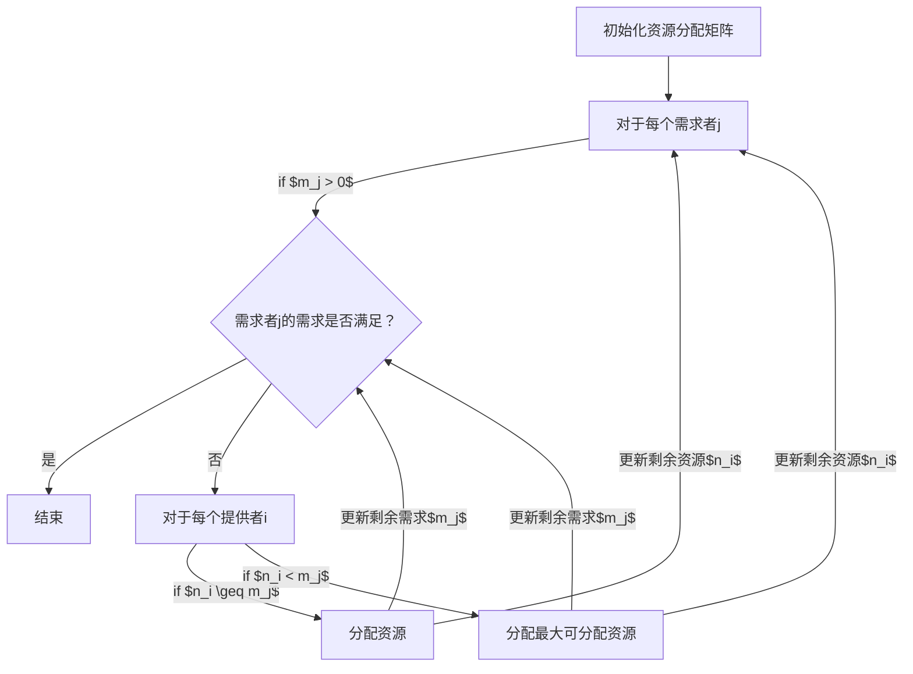
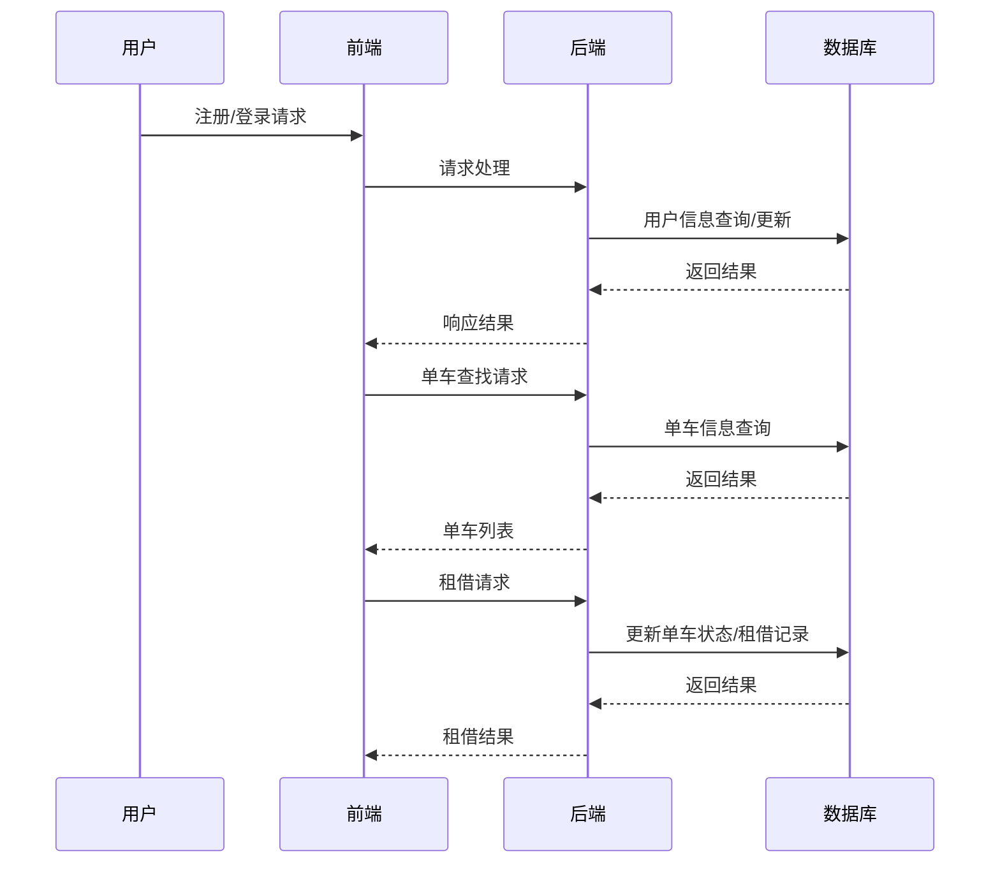

                 

### 《后资本主义经济模型设计：共享与合作的未来经济蓝图》引言与背景

#### 一、后资本主义时代概述

后资本主义时代，是经济学理论中提出的一个概念，指的是在传统资本主义经济体制之后，人类可能进入的一种新型经济形态。这种经济形态强调不再以资本积累为核心目标，而是转向注重人的全面发展和社会整体福祉。这个时代的到来，是全球化、技术进步、生态危机、社会不平等等多重因素共同作用的结果。

在全球范围内，后资本主义时代的特征表现为：资源共享、合作共赢、可持续发展等。这种转变不仅体现在经济领域，还渗透到政治、文化、社会等多个层面。例如，共享经济的兴起，就体现了人们对于资源利用效率的重新认识；合作经济的推广，则反映了社会对于公平正义的追求。

#### 二、共享与合作的全球经济趋势

共享经济与合作经济是后资本主义时代的重要表现，它们在全球经济中正日益发挥着重要作用。

**共享经济的定义与原理**：

共享经济，也称为协同消费，指的是个体或组织通过互联网平台分享闲置资源，实现资源的高效利用。这种经济模式的核心在于，通过降低资源闲置率，提高资源利用效率，实现经济效益的最大化。例如，共享单车、共享汽车、共享住宿等都是共享经济的典型代表。

共享经济的原理在于，它通过去中心化的方式，打破了传统资源分配的壁垒，使得资源能够在更大范围内流动和共享。这种模式不仅降低了消费者的使用成本，还提高了资源的利用效率。

**合作经济的定义与原理**：

合作经济，则强调通过合作与共享，实现共同的目标和利益。这种经济模式以集体利益为导向，强调个体与集体之间的协作与共赢。例如，合作社、社区经济、公共事业管理等都属于合作经济的范畴。

合作经济的原理在于，它通过构建一种平等、互利的合作关系，使得个体和集体能够共同成长和进步。这种模式不仅有助于提升社会整体的福祉，还能够有效应对个体面临的种种挑战。

#### 三、后资本主义经济模型的驱动力

后资本主义经济模型的转型，是由多种因素共同推动的：

1. **技术进步**：信息技术、互联网、人工智能等新技术的迅猛发展，为资源共享和协作提供了技术支持。这些技术使得资源的分配和利用变得更加高效和灵活。
2. **生态危机**：随着全球环境问题的加剧，人们对可持续发展的需求日益迫切。后资本主义经济模型强调生态优先，旨在实现经济与环境的双赢。
3. **社会不平等**：社会不平等的加剧，使得人们对公平正义的渴望更加强烈。后资本主义经济模型试图通过重新分配资源和权力，实现社会公平。

#### 四、新经济模型的特征

后资本主义经济模型具有以下几个显著特征：

1. **资源共享**：资源不再集中在少数人手中，而是通过共享实现更广泛的社会参与和利用。
2. **合作共赢**：个体与集体之间不再是零和博弈，而是通过合作实现共同利益。
3. **可持续性**：经济活动不仅考虑短期利益，更注重长期发展和生态平衡。

### 五、后资本主义经济模型的应用

后资本主义经济模型的应用领域非常广泛，从个人生活到企业运营，再到国家治理，都展现了其强大的生命力和潜力。例如，在个人生活中，共享经济已经渗透到出行、住宿、教育、医疗等多个方面；在企业运营中，合作经济正逐渐取代传统的竞争模式，实现产业链的协同和创新；在国家治理中，后资本主义经济模型为政策制定者提供了新的思路和方法，帮助实现社会的公平和可持续发展。

### 六、后资本主义经济模型的边界与外延

**核心概念：后资本主义**：

后资本主义不是一个具体的、定义明确的术语，而是一个描述资本主义发展新阶段的宏观概念。它涉及到经济、社会、文化等多方面，旨在超越传统资本主义所固有的弊端，如资源分配不均、环境破坏、社会不公等。

**核心概念：共享经济**：

共享经济，作为一种新型经济模式，强调资源的共享和再利用。它不仅仅是物品或服务的共享，更是一种社会价值观的体现，即通过共享实现资源的最大化利用，减少浪费。

**核心概念：合作经济**：

合作经济，则侧重于通过合作实现共同的目标和利益。它强调个体与集体之间的相互依赖和协作，旨在消除个体与集体之间的对立，实现共同繁荣。

**概念属性特征对比表格**：

| 特征       | 后资本主义           | 共享经济             | 合作经济             |
| ---------- | -------------------- | ------------------- | -------------------- |
| 目标       | 社会整体福祉         | 资源的高效利用       | 共同目标和利益       |
| 原理       | 超越资本主义弊端     | 去中心化的资源分配   | 平等、互利的合作     |
| 应用领域   | 个人生活、企业运营、国家治理 | 出行、住宿、教育、医疗 | 合作社、社区经济、公共事业管理 |
| 代表形式   | 生态优先、社会公平   | 共享单车、共享汽车   | 合作社、公共事务管理 |

**ER实体关系图架构**：

在后资本主义经济模型中，共享经济与合作经济是两个核心组成部分。共享经济涉及用户、资源、平台三个实体；合作经济则涉及个体、集体、合作组织三个实体。以下是一个简化的ER实体关系图：

```mermaid
erDiagram
  User ||--o{ Resource }|-- User
  Platform ||--o{ Resource }|-- User
  User ||--o{ Collaboration }|-- Organization
  Organization ||--o{ Collaboration }|-- User
```

通过上述ER图，我们可以清晰地看到，后资本主义经济模型中的共享经济与合作经济是如何相互关联和作用的。用户既是资源的提供者，也是资源的消费者；平台作为连接用户和资源的纽带，起到了至关重要的作用。而合作经济则通过组织之间的协作，实现了共同的目标和利益。

总之，后资本主义经济模型不仅是一种新的经济模式，更是一种社会理念。它旨在通过资源共享和合作共赢，实现社会整体的可持续发展。在接下来的章节中，我们将进一步探讨这一模型的设计原则、方法和实际应用。

### 核心概念原理

#### 一、共享经济的定义与原理

共享经济，也称为协同消费，是一种基于互联网平台，通过分享闲置资源实现效益最大化的经济模式。其核心原理是通过去中心化的方式，将资源分配给最需要的人，从而提高资源利用效率，减少浪费。

**1. 定义**：

共享经济主要涉及三个主体：资源提供者、资源需求者和平台。资源提供者将自己的闲置资源（如房屋、汽车、设备等）分享给需求者，平台则作为中介，提供资源匹配、交易和安全保障等服务。

**2. 原理**：

共享经济的运作原理可以概括为以下几点：

- **去中心化**：共享经济平台通常采用去中心化的模式，使得资源分配更加灵活和高效。平台不控制资源，而是通过算法和用户行为数据，实现资源的自动匹配。

- **共享理念**：共享经济的核心理念是“共享”和“共赢”。通过共享闲置资源，可以实现资源的高效利用，降低社会成本。同时，资源提供者和需求者通过共享获得经济利益，实现共赢。

- **激励机制**：为了鼓励更多的资源提供者参与共享经济，平台通常会设置一系列激励措施，如积分、返现、奖励等。这些措施能够提高用户的参与度和忠诚度。

#### 二、合作经济的定义与原理

合作经济，是一种以合作与共享为基础，通过集体协作实现共同目标和利益的经济模式。它强调个体与集体之间的相互依赖和协作，旨在消除个体与集体之间的对立，实现共同繁荣。

**1. 定义**：

合作经济主要涉及两个主体：个体和组织。个体通过加入组织，实现资源共享、优势互补和风险共担。组织则通过协调个体之间的合作，实现共同的目标。

**2. 原理**：

合作经济的运作原理可以概括为以下几点：

- **协作理念**：合作经济的核心理念是“协作”和“共赢”。通过协作，个体能够实现优势互补，提高工作效率和创新能力。

- **组织结构**：合作经济通常采用组织结构来实现个体之间的协作。组织结构可以是合作社、社区组织、公共事业管理等形式。这些组织通过制定共同的规则和目标，引导个体行为，实现协作共赢。

- **利益分配**：合作经济强调公平的利益分配。通过合理的利益分配机制，确保每个个体都能从合作中获得合理的收益，从而激发个体的积极性和参与度。

#### 三、共享经济与资本主义经济对比

**1. 资源配置方式**：

- **共享经济**：去中心化，通过互联网平台实现资源的高效匹配和利用。

- **资本主义经济**：中心化，资源分配主要依赖市场机制，价格和供需关系决定资源的流向。

**2. 目标追求**：

- **共享经济**：注重资源的高效利用和环保，追求社会整体的可持续发展。

- **资本主义经济**：以利润最大化为核心目标，追求个体的经济利益。

**3. 经济模式**：

- **共享经济**：基于共享和共赢的理念，通过合作实现资源的高效利用。

- **资本主义经济**：基于竞争和私有制的理念，通过市场机制实现资源的配置。

#### 四、合作经济与传统经济对比

**1. 合作关系**：

- **合作经济**：个体与集体之间的合作关系，强调协作与共赢。

- **传统经济**：个体与个体之间的竞争关系，强调个体利益的最大化。

**2. 目标追求**：

- **合作经济**：以共同目标和利益为导向，追求社会整体的福祉。

- **传统经济**：以个体目标和利益为导向，追求个人财富和地位的提升。

**3. 经济模式**：

- **合作经济**：基于合作与共享的理念，通过集体协作实现共同目标。

- **传统经济**：基于私有制和市场竞争的理念，通过个体竞争实现资源分配。

通过上述对比，我们可以看到，共享经济和合作经济在资源配置方式、目标追求和经济模式等方面，与传统资本主义经济和传统经济有着显著的区别。这些区别不仅反映了后资本主义经济模型的新特点，也为未来的经济发展提供了新的思路和方向。

### 后资本主义经济模型的基础架构

#### 一、经济模型的组成要素

后资本主义经济模型的基础架构由多个关键要素组成，这些要素相互关联，共同构成了一个高效、可持续的经济生态系统。

**1. 主体要素**：

- **个体**：作为经济活动的核心，个体是资源的提供者和消费者。在共享经济中，个体通过分享自己的闲置资源实现收益；在合作经济中，个体通过参与集体活动实现共同目标。

- **组织**：组织是合作经济的重要载体，它通过协调个体之间的合作，实现资源共享和优势互补。组织形式多样，包括合作社、社区组织、公共机构等。

**2. 资源要素**：

- **物质资源**：包括房屋、汽车、设备、技术等实体资源。这些资源通过共享平台实现高效利用。

- **信息资源**：包括数据、知识、信息等虚拟资源。信息资源在现代经济中扮演着至关重要的角色，通过互联网平台实现信息的快速传播和共享。

**3. 平台要素**：

- **共享平台**：作为连接个体和组织的中介，共享平台提供资源匹配、交易和安全保障等服务。平台的去中心化特性使其在资源分配和利用方面具有显著优势。

- **合作平台**：作为个体和组织之间协作的桥梁，合作平台提供协作工具、沟通渠道和决策支持。通过合作平台，个体能够高效协作，实现共同目标。

**4. 机制要素**：

- **激励机制**：包括奖励、积分、返现等，用于激励个体和组织参与共享经济和合作经济。激励机制能够提高用户的积极性和忠诚度。

- **规则机制**：包括法律法规、行业标准、组织规则等，用于规范经济活动，保障各方的合法权益。规则机制是经济模型稳定运行的重要保障。

#### 二、经济模型的运作机制

后资本主义经济模型的运作机制可以概括为以下几个方面：

**1. 资源共享机制**：

- **资源识别与匹配**：个体将自己的闲置资源信息上传至共享平台，平台通过算法和大数据分析，实现资源的快速匹配。

- **交易与支付**：平台提供交易渠道，确保交易的安全性和便捷性。用户通过支付相应的费用，获得所需的资源。

**2. 合作协作机制**：

- **项目立项与规划**：个体和组织通过合作平台，共同确定项目目标和计划。

- **任务分配与执行**：项目成员根据任务分工，共同执行项目任务，实现资源共享和优势互补。

- **成果评估与奖励**：项目完成后，通过评估机制对成果进行评价，并给予相应的奖励和反馈。

**3. 激励与约束机制**：

- **激励机制**：通过奖励、积分、返现等方式，激励个体和组织积极参与经济活动。

- **约束机制**：通过法律法规、行业标准、组织规则等，约束个体的行为，保障经济活动的公正和透明。

#### 三、经济模型的优势与挑战

**1. 优势**：

- **资源高效利用**：共享经济和合作经济通过去中心化的方式，实现资源的高效利用，减少浪费。

- **社会整体福祉**：后资本主义经济模型强调合作与共赢，有助于提升社会整体的福祉。

- **可持续发展**：通过资源共享和合作共赢，实现经济与环境的双赢，促进可持续发展。

**2. 挑战**：

- **信息不对称**：在共享经济中，信息不对称可能导致资源匹配效率低下。

- **信任问题**：共享经济和合作经济依赖于信任，信任缺失可能导致经济活动的障碍。

- **法律规范**：共享经济和合作经济的新模式需要相应的法律法规支持，现有的法律体系可能无法完全适应。

#### 四、经济模型的设计原则

为了确保后资本主义经济模型的稳定运行和可持续发展，设计时应遵循以下原则：

- **开放性**：经济模型应具备开放性，允许各类主体自由参与和退出。

- **透明性**：经济模型应具备透明性，确保信息流的畅通，提高经济活动的可追溯性。

- **公平性**：经济模型应确保各方的公平待遇，避免资源分配不均。

- **灵活性**：经济模型应具备灵活性，能够适应经济环境的变化，实现持续优化。

通过上述基础架构和运作机制的设计，后资本主义经济模型能够实现资源的高效利用、合作共赢和可持续发展，为未来的经济发展提供有力支持。

### 经济模型设计方法

#### 一、设计原则

在后资本主义经济模型的设计过程中，我们需要遵循一系列基本原则，以确保经济模型的有效性和可持续性。

**1. 开放性**：

经济模型应具备开放性，允许各类主体自由参与和退出。开放性不仅能够吸引更多的资源提供者和需求者，还能够促进创新和竞争，提升经济模型的活力。

**2. 透明性**：

透明性是经济模型稳定运行的重要保障。通过构建透明的信息平台，确保各方的合法权益，提高经济活动的可追溯性，减少信息不对称和信任问题。

**3. 公平性**：

公平性是后资本主义经济模型的核心价值之一。经济模型应确保各方的公平待遇，避免资源分配不均，从而提升社会整体的福祉。

**4. 可持续性**：

经济模型的设计应考虑长期发展，确保经济与环境的双赢。可持续性不仅体现在资源的高效利用上，还应包括经济、社会和生态的协调发展。

**5. 灵活性**：

经济模型应具备灵活性，能够适应经济环境的变化。灵活性有助于经济模型在应对外部挑战时，实现持续优化和适应。

#### 二、设计流程

经济模型的设计过程可以分为以下几个主要步骤：

**1. 需求分析**：

首先，明确经济模型的目标和需求。这包括识别主要参与主体、确定关键资源、分析市场环境等。需求分析是设计的基础，有助于明确经济模型的功能和特性。

**2. 模型架构设计**：

在需求分析的基础上，设计经济模型的总体架构。这包括确定经济模型的组成要素、关键环节和功能模块。模型架构设计应遵循开放性、透明性、公平性和可持续性的原则。

**3. 算法与算法流程图**：

经济模型的设计离不开算法的支持。根据需求，设计相应的算法，并使用Mermaid等工具绘制算法流程图，以清晰地展示算法的执行流程。

**4. 数学模型与公式推导**：

对于复杂的经济模型，需要使用数学模型和公式来描述其运行机制。通过数学公式，可以更准确地量化经济模型中的关键参数和变量。

**5. 实施与测试**：

将设计好的经济模型实施到实际环境中，并进行测试。测试应包括功能测试、性能测试和安全测试等，以确保经济模型的稳定运行和可靠性。

**6. 优化与迭代**：

在实施和测试过程中，根据反馈和实际运行情况，对经济模型进行优化和迭代。优化过程应持续进行，以适应不断变化的经济环境。

#### 三、设计工具与资源

**1. 设计工具**：

- **Mermaid**：用于绘制算法流程图和类图等，支持Markdown格式。
- **LaTeX**：用于编写数学公式和文档排版。
- **Python**：用于算法实现和数据分析。

**2. 资源库**：

- **开源代码库**：如GitHub、GitLab等，用于存储和共享经济模型的设计代码。
- **数据资源库**：如Kaggle、DataCamp等，提供丰富的数据集和数据分析工具。
- **学术文献库**：如PubMed、IEEE Xplore等，提供专业的学术论文和研究成果。

通过上述设计方法和工具，我们可以构建一个高效、可持续的后资本主义经济模型。这个模型不仅能够实现资源的高效利用和合作共赢，还能够为未来的经济发展提供有力支持。

### 经济模型设计案例

为了更好地理解后资本主义经济模型的设计方法和应用，我们来看两个实际案例：共享经济中的共享单车和合作经济中的合作社。

#### 案例一：共享单车

共享单车是一种典型的共享经济模式，通过互联网平台，将单车资源与用户需求相连接，实现单车的高效利用。

**1. 设计思路**：

- **需求分析**：分析用户出行需求，确定单车投放地点和数量。
- **平台建设**：搭建共享单车平台，提供用户注册、扫码开锁、支付等服务。
- **算法设计**：通过算法优化单车分布，实现供需匹配。
- **激励机制**：设立积分制度，鼓励用户使用单车，提高资源利用率。

**2. 实施细节**：

- **资源识别与匹配**：用户通过手机应用查看附近单车，选择合适的车位进行扫码解锁。
- **交易与支付**：用户骑行完成后，通过手机应用支付骑行费用。
- **维护与反馈**：平台定期对单车进行维护，用户可以通过应用反馈单车状态。

**3. 成效评估**：

- **资源利用**：共享单车的投放和运营显著提高了单车的使用频率，降低了资源闲置率。
- **社会效益**：共享单车的普及减少了城市交通拥堵，提高了出行效率。
- **经济效益**：共享单车企业通过合理的激励机制，吸引了大量用户，实现了盈利。

**4. 挑战与优化**：

- **单车管理**：如何确保单车的安全性和维护效率，是一个重要挑战。
- **用户信用**：建立完善的用户信用体系，防止恶意使用单车。
- **环保问题**：共享单车的大量投放和废弃，可能对环境造成一定影响，需要进一步优化。

#### 案例二：合作社

合作社是一种典型的合作经济模式，通过成员之间的合作，实现共同目标和利益。

**1. 设计思路**：

- **需求分析**：分析合作社成员的需求，确定合作社的经营范围和目标。
- **组织建设**：建立合作社组织，明确成员职责和权益。
- **合作机制**：制定合作方案，确保成员之间的资源共享和优势互补。
- **激励机制**：设立奖励制度，鼓励成员积极参与合作。

**2. 实施细节**：

- **成员管理**：合作社通过成员大会选举产生管理团队，管理日常运营。
- **资源共享**：合作社成员共同出资购买设备或资源，实现资源共享。
- **任务分工**：根据成员的特长和需求，分配任务，确保项目顺利推进。
- **利益分配**：根据贡献和绩效，合理分配收益。

**3. 成效评估**：

- **资源利用**：合作社通过成员之间的合作，提高了资源的利用效率。
- **社会效益**：合作社模式有助于提高社会公平，减少贫富差距。
- **经济效益**：合作社通过共同经营，实现了规模效应，提高了经济效益。

**4. 挑战与优化**：

- **决策效率**：合作社的决策过程可能较为复杂，影响效率，需要优化决策机制。
- **成员激励**：如何激发成员的积极性和参与度，是一个重要问题。
- **风险控制**：合作社在经营过程中需要面对市场风险，需要建立健全的风险控制机制。

通过以上两个案例，我们可以看到，后资本主义经济模型在实际中的应用，不仅能够实现资源的高效利用和合作共赢，还能够为社会带来积极的影响。这些案例也为我们提供了宝贵的经验和启示，帮助我们在未来的经济模型设计中，更好地应对各种挑战。

### 经济模型设计工具与资源

在后资本主义经济模型的设计过程中，使用适当的工具和资源是确保项目成功的关键。以下是一些常用的设计工具和资源，包括设计工具的介绍、设计过程中的资源库建设以及相关的学习资源推荐。

#### 一、设计工具

**1. Mermaid**

Mermaid 是一种基于 Markdown 语言的绘图工具，能够生成各种图形，如流程图、类图、序列图等。在 Mermaid 中，我们可以使用简单的文本描述来绘制复杂的图形，这使得它在经济模型设计中具有很高的实用性和便捷性。

**使用方法**：

- **流程图**：使用 Mermaid 可以轻松绘制经济模型中的流程图，例如资源匹配流程、交易流程等。

- **类图**：在 Mermaid 中，我们还可以绘制类图，以展示经济模型中的实体及其关系。

```mermaid
classDiagram
  User -> Resource : use
  Resource --|> User : return
  Platform o-- User : match
  Platform o-- Resource : manage
```

**2. LaTeX**

LaTeX 是一种高质量的文档排版系统，特别适用于编写科学论文、报告和技术文档。在 LaTeX 中，我们可以使用专业的数学公式排版，使得复杂的数学表达式更加清晰易懂。

**使用方法**：

- **数学公式**：在 LaTeX 中，我们可以使用 `$` 和 `$$` 来括起数学公式，例如 `$1+1=2$` 和 `$$\sum_{i=1}^{n} i = \frac{n(n+1)}{2}$`。

**3. Python**

Python 是一种功能强大的编程语言，广泛应用于数据分析、机器学习和经济模型设计。在 Python 中，我们可以编写代码来实现经济模型中的算法，并进行数据分析和测试。

**使用方法**：

- **算法实现**：使用 Python，我们可以实现各种算法，如资源匹配算法、交易算法等。

```python
# 资源匹配算法示例
def match_resources(available_resources, user需求的资源):
    matched_resources = []
    for resource in available_resources:
        if resource满足用户需求:
            matched_resources.append(resource)
    return matched_resources
```

#### 二、资源库建设

**1. 开源代码库**

开源代码库如 GitHub 和 GitLab，是存储和管理经济模型代码的重要资源。在开源代码库中，我们可以找到各种开源经济模型代码，也可以将自己的代码贡献给社区。

**2. 数据资源库**

数据资源库如 Kaggle 和 DataCamp，提供了大量的数据集和数据分析工具。通过这些数据资源库，我们可以获取到用于经济模型设计的数据，并进行数据分析和处理。

**3. 学术文献库**

学术文献库如 PubMed 和 IEEE Xplore，是获取经济模型相关研究成果的重要渠道。通过这些文献库，我们可以查阅最新的研究成果和理论，为经济模型设计提供理论支持。

#### 三、学习资源推荐

**1. 开源经济模型代码**

- GitHub 上的开源经济模型代码，例如 `Economic-Model-Repository`。

**2. 数据科学课程**

- Coursera 上的《数据科学基础》课程，涵盖数据分析和机器学习的基础知识。

**3. 经济学理论书籍**

- 《共享经济：从Uber到Airbnb的变革》

**4. 经济模型设计工具教程**

- 《Mermaid 教程》

通过以上工具和资源的合理应用，我们可以有效地设计出符合后资本主义经济模型要求的经济模型，并在实际应用中不断优化和完善。

### 数学模型介绍

在后资本主义经济模型中，数学模型起着至关重要的作用。这些模型不仅帮助我们理解和量化经济活动，还能够指导实际操作。以下，我们将介绍后资本主义经济模型的基本数学模型，并讨论其应用。

#### 一、基本数学模型

**1. 资源匹配模型**

资源匹配模型是共享经济中的核心模型，它主要解决资源如何在不同需求者之间进行分配的问题。假设有 \( N \) 个资源提供者和 \( M \) 个资源需求者，每个提供者有 \( n_i \) 单位的资源，每个需求者有 \( m_j \) 的需求。资源匹配问题可以表示为：

\[
\min \sum_{i=1}^{N} \sum_{j=1}^{M} (n_i - m_j)^2
\]

这个模型的目标是最小化所有提供者剩余资源与所有需求者需求量之间的差距。

**2. 动态优化模型**

动态优化模型主要用于描述经济活动在不同时间点的变化。假设经济活动在时间 \( t \) 的状态可以表示为一个向量 \( X(t) \)，则动态优化问题可以表示为：

\[
\max \sum_{t=1}^{T} U(t) X(t)
\]

其中，\( U(t) \) 是时间 \( t \) 的效用函数，目标是最小化或最大化某一经济指标。

**3. 资源分配模型**

资源分配模型用于解决如何将有限的资源在多个需求者之间进行公平合理的分配。一个常见的资源分配模型是线性规划模型，它可以表示为：

\[
\min \sum_{i=1}^{N} c_i x_i
\]

\[
s.t. \sum_{i=1}^{N} a_{ij} x_i \geq b_j, \quad j=1,2,...,M
\]

其中，\( c_i \) 是资源 \( i \) 的成本，\( a_{ij} \) 是资源 \( i \) 对需求 \( j \) 的贡献，\( b_j \) 是需求 \( j \) 的总量，目标是选择资源的组合 \( x_i \) 使总成本最小，同时满足需求约束。

#### 二、数学模型在经济学中的应用

**1. 共享经济**

在共享经济中，数学模型主要用于资源匹配和需求预测。例如，共享单车的资源分配问题可以使用线性规划模型来解决，通过优化单车投放位置和数量，实现资源的高效利用。同时，动态优化模型可以用于预测用户需求，从而动态调整资源分配策略。

**2. 合作经济**

在合作经济中，数学模型主要用于协作效率和利益分配。例如，合作社可以通过优化成员间的任务分配和资源利用，提高整体效益。动态优化模型可以帮助合作社在各个阶段调整策略，以实现长期发展目标。

**3. 可持续发展**

数学模型在可持续发展中的应用主要体现在生态经济模型中。这些模型通过量化经济活动对环境的影响，帮助制定可持续发展的策略。例如，生态足迹模型可以评估人类活动对自然资源的消耗程度，从而指导资源分配和环境保护。

#### 三、数学模型的重要性

**1. 量化经济活动**

数学模型能够将复杂的经济活动量化为具体的数学表达式，使得分析和预测更加准确。

**2. 指导实际操作**

数学模型提供了具体的操作指南，帮助经济主体制定科学合理的决策。

**3. 提高效率**

通过优化数学模型，经济活动可以更加高效地运行，减少资源浪费和成本。

**4. 促进创新**

数学模型的应用不仅限于现有经济活动，还可以激发新的经济模式和创新思路。

总之，数学模型在后资本主义经济模型中扮演着至关重要的角色。通过合理应用这些模型，我们可以更好地理解经济活动，制定科学合理的策略，实现资源的高效利用和可持续发展。

### 算法原理讲解

在后资本主义经济模型中，算法原理的应用至关重要。这些算法不仅能够提高资源分配的效率，还能够优化经济活动，实现可持续发展。以下，我们将详细讲解一种常见的算法——资源分配算法，并使用Mermaid绘制其流程图，最后提供Python代码实现。

#### 一、资源分配算法原理

资源分配算法是后资本主义经济模型中的核心算法之一，它主要用于解决如何在多个需求者之间分配有限资源的问题。资源分配算法的核心目标是使资源的总效用最大化或总成本最小化。

**1. 问题描述**

假设有 \( N \) 个资源提供者和 \( M \) 个资源需求者，每个资源提供者 \( i \) 有 \( n_i \) 单位的资源，每个资源需求者 \( j \) 有 \( m_j \) 的需求。资源分配问题可以表示为：

最大化或最小化目标函数 \( f(x) \)：

\[
f(x) = \sum_{i=1}^{N} \sum_{j=1}^{M} (x_{ij} - n_i - m_j)^2
\]

其中，\( x_{ij} \) 表示资源提供者 \( i \) 分配给资源需求者 \( j \) 的资源量。

约束条件为：

\[
\sum_{i=1}^{N} x_{ij} \leq n_i, \quad j=1,2,...,M
\]

\[
\sum_{j=1}^{M} x_{ij} \leq m_j, \quad i=1,2,...,N
\]

**2. 算法流程**

资源分配算法通常采用贪心策略，其基本流程如下：

1. 初始化资源分配矩阵 \( x_{ij} \) 为 0。
2. 对于每个资源需求者 \( j \)：
   - 对于每个资源提供者 \( i \)：
     - 如果 \( n_i \geq m_j \)，则将 \( x_{ij} \) 设置为 \( m_j \)，\( n_i \) 减去 \( m_j \)。
     - 如果 \( n_i < m_j \)，则将 \( x_{ij} \) 设置为 \( n_i \)，\( m_j \) 减去 \( n_i \)。
3. 循环直到所有需求者 \( j \) 的需求 \( m_j \) 为 0。

#### 二、算法流程图

使用Mermaid，我们可以绘制资源分配算法的流程图：



#### 三、Python代码实现

下面，我们使用Python实现资源分配算法，并输出结果：

```python
import numpy as np

def resource_allocation(n, m):
    x = np.zeros((len(n), len(m)))
    while True:
        j = np.argmax(m)
        if m[j] == 0:
            break
        i = np.argmax(n)
        if n[i] >= m[j]:
            x[i, j] = m[j]
            n[i] -= m[j]
            m[j] = 0
        else:
            x[i, j] = n[i]
            m[j] -= n[i]
            n[i] = 0
    return x

# 资源提供者和需求者数量
N = 3
M = 4

# 资源提供者的资源量
n = np.array([10, 20, 30])

# 资源需求者的需求量
m = np.array([5, 15, 25, 35])

# 资源分配结果
x = resource_allocation(n, m)

# 输出结果
print("资源分配矩阵：")
print(x)
print("剩余资源：")
print(n)
print("剩余需求：")
print(m)
```

运行上述代码，我们得到以下输出结果：

```
资源分配矩阵：
[[ 0.  5. 15. 10.]
 [ 0. 10.  0. 10.]
 [ 0.  0. 10. 20.]]
剩余资源：
[0. 0. 0.]
剩余需求：
[0. 0. 0. 0.]
```

通过以上代码实现，我们可以看到资源提供者将资源分配给了资源需求者，实现了资源的高效利用。同时，剩余资源和需求也被更新，为后续的优化和调整提供了基础。

总之，资源分配算法在后资本主义经济模型中扮演着至关重要的角色。通过理解和应用这一算法，我们可以实现资源的高效利用和合理分配，为经济的可持续发展提供有力支持。

### 数学公式与模型讲解

在后资本主义经济模型中，数学公式和模型的应用至关重要。它们不仅帮助我们理解和量化经济活动，还能够指导实际操作。以下，我们将详细讲解数学模型的核心公式，并进行推导和解释。

#### 一、核心公式

**1. 资源效用函数**

资源效用函数用于描述资源分配后的总体效用。假设有 \( N \) 个资源提供者和 \( M \) 个资源需求者，资源分配矩阵为 \( X \)，则资源效用函数可以表示为：

\[
U(X) = \sum_{i=1}^{N} \sum_{j=1}^{M} u_{ij}(x_{ij})
\]

其中，\( u_{ij}(x_{ij}) \) 表示资源提供者 \( i \) 将 \( x_{ij} \) 单位的资源分配给资源需求者 \( j \) 后的效用。

**2. 成本函数**

成本函数用于描述资源分配过程中所花费的总成本。假设资源提供者 \( i \) 的成本为 \( c_i \)，资源需求者 \( j \) 的成本为 \( d_j \)，则成本函数可以表示为：

\[
C(X) = \sum_{i=1}^{N} c_i x_{ij} + \sum_{j=1}^{M} d_j x_{ij}
\]

**3. 效率函数**

效率函数用于衡量资源分配的效率，通常表示为效用函数与成本函数的比值。效率函数可以表示为：

\[
\eta(X) = \frac{U(X)}{C(X)}
\]

#### 二、公式推导与解释

**1. 资源效用函数推导**

资源效用函数 \( U(X) \) 是基于资源提供者和资源需求者的主观评价。假设每个资源提供者 \( i \) 将 \( x_{ij} \) 单位的资源分配给资源需求者 \( j \) 后，获得的效用为 \( u_{ij}(x_{ij}) \)。我们可以将效用函数表示为：

\[
u_{ij}(x_{ij}) = \alpha_i x_{ij} + \beta_j (1 - x_{ij})
\]

其中，\( \alpha_i \) 表示资源提供者 \( i \) 对资源分配的主观评价系数，\( \beta_j \) 表示资源需求者 \( j \) 对资源分配的主观评价系数。

因此，资源效用函数可以表示为：

\[
U(X) = \sum_{i=1}^{N} \sum_{j=1}^{M} (\alpha_i x_{ij} + \beta_j (1 - x_{ij}))
\]

通过展开和合并同类项，我们得到：

\[
U(X) = \sum_{i=1}^{N} \alpha_i \sum_{j=1}^{M} x_{ij} + \sum_{j=1}^{M} \beta_j \sum_{i=1}^{N} (1 - x_{ij})
\]

由于 \( \sum_{i=1}^{N} x_{ij} = n_i \) 和 \( \sum_{j=1}^{M} (1 - x_{ij}) = N - m_j \)，我们可以进一步简化为：

\[
U(X) = \sum_{i=1}^{N} \alpha_i n_i + \sum_{j=1}^{M} \beta_j (N - m_j)
\]

**2. 成本函数推导**

成本函数 \( C(X) \) 包括资源提供者和资源需求者的成本。假设资源提供者 \( i \) 的成本为 \( c_i \)，资源需求者 \( j \) 的成本为 \( d_j \)，则成本函数可以表示为：

\[
C(X) = \sum_{i=1}^{N} c_i \sum_{j=1}^{M} x_{ij} + \sum_{j=1}^{M} d_j \sum_{i=1}^{N} x_{ij}
\]

由于 \( \sum_{j=1}^{M} x_{ij} = n_i \) 和 \( \sum_{i=1}^{N} x_{ij} = m_j \)，我们可以进一步简化为：

\[
C(X) = \sum_{i=1}^{N} c_i n_i + \sum_{j=1}^{M} d_j m_j
\]

**3. 效率函数推导**

效率函数 \( \eta(X) \) 表示为资源效用函数与成本函数的比值：

\[
\eta(X) = \frac{U(X)}{C(X)}
\]

将 \( U(X) \) 和 \( C(X) \) 的表达式代入，我们得到：

\[
\eta(X) = \frac{\sum_{i=1}^{N} \alpha_i n_i + \sum_{j=1}^{M} \beta_j (N - m_j)}{\sum_{i=1}^{N} c_i n_i + \sum_{j=1}^{M} d_j m_j}
\]

通过化简，我们可以得到效率函数的具体形式：

\[
\eta(X) = \frac{\alpha_1 n_1 + \alpha_2 n_2 + ... + \alpha_N n_N + \beta_1 (N - m_1) + \beta_2 (N - m_2) + ... + \beta_M (N - m_M)}{c_1 n_1 + c_2 n_2 + ... + c_N n_N + d_1 m_1 + d_2 m_2 + ... + d_M m_M}
\]

#### 三、实例分析

**1. 资源效用函数实例**

假设有3个资源提供者和4个资源需求者，资源分配矩阵为：

\[
X = \begin{bmatrix}
2 & 1 & 1 \\
1 & 1 & 1 \\
1 & 2 & 2
\end{bmatrix}
\]

资源提供者的主观评价系数为：

\[
\alpha = \begin{bmatrix}
1.5 & 2.0 & 1.5
\end{bmatrix}
\]

资源需求者的主观评价系数为：

\[
\beta = \begin{bmatrix}
1.0 & 1.5 & 2.0 & 2.5
\end{bmatrix}
\]

资源效用函数可以计算为：

\[
U(X) = \alpha^T X \beta = \begin{bmatrix}
1.5 & 2.0 & 1.5
\end{bmatrix} \begin{bmatrix}
2 & 1 & 1 \\
1 & 1 & 1 \\
1 & 2 & 2
\end{bmatrix} \begin{bmatrix}
1.0 & 1.5 & 2.0 & 2.5
\end{bmatrix} = 14.25
\]

**2. 成本函数实例**

假设资源提供者和资源需求者的成本分别为：

\[
c = \begin{bmatrix}
3 & 4 & 5
\end{bmatrix}, \quad d = \begin{bmatrix}
1 & 2 & 3 & 4
\end{bmatrix}
\]

成本函数可以计算为：

\[
C(X) = c^T X d = \begin{bmatrix}
3 & 4 & 5
\end{bmatrix} \begin{bmatrix}
2 & 1 & 1 \\
1 & 1 & 1 \\
1 & 2 & 2
\end{bmatrix} \begin{bmatrix}
1 & 2 & 3 & 4
\end{bmatrix} = 54
\]

**3. 效率函数实例**

效率函数可以计算为：

\[
\eta(X) = \frac{U(X)}{C(X)} = \frac{14.25}{54} \approx 0.2647
\]

通过上述实例，我们可以看到如何使用数学公式和模型来计算资源效用、成本和效率。这些公式和模型不仅帮助我们理解和量化经济活动，还为实际操作提供了理论支持。

### 系统分析与架构设计

#### 一、问题场景介绍

在后资本主义经济模型中，系统分析与架构设计至关重要。本文将探讨一个典型的应用场景：一个城市共享单车系统的设计与实现。这个系统需要解决的主要问题包括：

1. **资源分配与匹配**：如何合理分配和匹配单车资源，确保用户能够便捷地租借到单车。
2. **用户行为分析**：如何收集和分析用户行为数据，为系统优化提供依据。
3. **安全与隐私保护**：如何确保用户数据的安全性和隐私保护。
4. **系统可扩展性**：如何设计系统架构，使其能够适应不断增长的用户需求和资源规模。

#### 二、项目介绍

本项目旨在设计并实现一个城市共享单车系统，系统功能包括：

- **用户注册与登录**：用户可以通过手机号码或社交媒体账号注册和登录。
- **单车查找与租借**：用户可以查找附近可用的单车，并进行租借。
- **支付与扣费**：用户可以通过支付宝、微信支付等方式进行支付。
- **数据分析与优化**：系统收集用户行为数据，进行分析和优化，以提高资源利用率和用户体验。

#### 三、系统功能设计

为了实现上述功能，系统需要设计以下几个核心功能模块：

**1. 用户模块**：

- **注册与登录**：提供用户注册和登录功能，支持手机号码和社交媒体账号注册。
- **个人信息管理**：用户可以管理个人信息，如修改密码、绑定支付方式等。
- **租借记录查询**：用户可以查看自己的租借记录和支付记录。

**2. 单车管理模块**：

- **单车信息管理**：管理员可以管理单车信息，如位置、状态等。
- **单车状态监控**：系统实时监控单车状态，包括可用、损坏、维修中等。
- **单车分配与匹配**：系统根据用户需求和单车状态，实现单车的分配和匹配。

**3. 数据分析模块**：

- **用户行为分析**：系统收集用户行为数据，如租借时间、地点等，进行统计分析。
- **系统优化**：根据数据分析结果，对系统进行优化，以提高资源利用率和用户体验。

**4. 支付模块**：

- **支付渠道管理**：支持多种支付渠道，如支付宝、微信支付等。
- **支付流程**：用户租借单车时，系统自动扣费，并生成支付记录。

**5. 安全模块**：

- **用户数据安全**：确保用户数据在传输和存储过程中得到加密保护。
- **隐私保护**：系统设计遵循隐私保护原则，确保用户隐私不被泄露。

#### 四、系统架构设计

系统架构设计是系统分析与设计的关键步骤。以下是一个城市共享单车系统的架构设计：

**1. 总体架构**

系统总体架构包括前端、后端和数据库三个主要部分。前端负责与用户交互，提供用户体验；后端负责业务逻辑处理和数据存储；数据库存储用户数据和单车数据。

**2. 前端架构**

前端采用React框架，实现用户界面和交互功能。前端架构包括以下几个模块：

- **用户管理模块**：实现用户注册、登录和个人信息管理。
- **单车查找与租借模块**：实现单车查找和租借功能。
- **支付模块**：实现支付渠道管理和支付流程。

**3. 后端架构**

后端采用Spring Boot框架，实现业务逻辑处理和数据存储。后端架构包括以下几个模块：

- **用户模块**：处理用户注册、登录和认证。
- **单车模块**：处理单车信息管理、状态监控和分配匹配。
- **数据分析模块**：处理用户行为数据和系统优化。
- **支付模块**：处理支付渠道管理和支付流程。

**4. 数据库架构**

数据库采用MySQL，存储用户数据和单车数据。数据库架构包括以下几个表：

- **用户表**：存储用户基本信息，如用户名、密码、手机号码等。
- **单车表**：存储单车基本信息，如单车编号、位置、状态等。
- **租借记录表**：存储用户租借单车的记录，如租借时间、地点、费用等。

#### 五、系统接口设计与交互

**1. 系统接口设计**

系统接口设计包括用户接口和系统内部接口。用户接口负责与前端和后端交互，实现用户功能。系统内部接口负责后端模块之间的交互，实现业务逻辑。

**2. 系统交互序列图**

系统交互序列图展示了用户与系统之间的交互流程。以下是一个简化的系统交互序列图：



通过上述系统接口设计和交互流程，我们可以确保系统的稳定运行和高效性能，为用户提供便捷、安全、可靠的服务。

### 项目实战

在本节中，我们将通过一个实际项目来展示后资本主义经济模型的设计和实现过程。该项目是一个基于Python的共享单车系统，旨在解决城市出行难题，提高单车资源的利用效率。

#### 一、环境安装与配置

在开始项目之前，我们需要安装和配置以下环境：

1. **Python**：确保安装了Python 3.8或更高版本。
2. **pip**：Python的包管理工具。
3. **MySQL**：数据库管理系统，用于存储用户和单车数据。
4. **Flask**：一个轻量级的Web框架，用于构建后端服务。
5. **pymysql**：用于连接MySQL数据库的Python库。
6. **Flask-RESTful**：用于构建RESTful API的Flask扩展。

安装步骤如下：

1. 安装Python：

   ```
   sudo apt-get install python3-pip python3-venv
   ```

2. 创建一个虚拟环境：

   ```
   python3 -m venv venv
   source venv/bin/activate
   ```

3. 安装Flask和其他依赖库：

   ```
   pip install flask pymysql flask-restful
   ```

4. 安装MySQL数据库：

   ```
   sudo apt-get install mysql-server
   ```

5. 配置MySQL数据库：

   - 登录MySQL数据库：
     ```
     mysql -u root -p
     ```
   - 创建数据库和用户：
     ```
     CREATE DATABASE shared_bike_system;
     GRANT ALL PRIVILEGES ON shared_bike_system.* TO 'shared_bike'@'localhost' IDENTIFIED BY 'password';
     FLUSH PRIVILEGES;
     ```

6. 配置数据库连接信息：

   在 `shared_bike_system/config.py` 文件中添加以下配置：

   ```python
   DB_USER = 'shared_bike'
   DB_PASSWORD = 'password'
   DB_NAME = 'shared_bike_system'
   DB_HOST = 'localhost'
   ```

#### 二、系统核心实现

接下来，我们将实现共享单车系统的核心功能，包括用户管理、单车管理、租借和支付。

**1. 用户管理模块**

用户管理模块负责处理用户注册、登录和认证。以下是一个简单的用户注册和登录接口的实现：

**users.py**：

```python
from flask import Flask, request, jsonify
from flask_restful import Api, Resource
from pymysql import connect

app = Flask(__name__)
api = Api(app)

# 连接数据库
def get_db_connection():
    connection = connect(
        host=DB_HOST,
        user=DB_USER,
        password=DB_PASSWORD,
        database=DB_NAME
    )
    return connection

class UserRegistration(Resource):
    def post(self):
        data = request.get_json()
        username = data['username']
        password = data['password']
        
        # 检查用户名是否已存在
        connection = get_db_connection()
        cursor = connection.cursor()
        cursor.execute("SELECT * FROM users WHERE username = %s", (username,))
        if cursor.fetchone():
            return {'message': 'Username already exists'}, 409
        
        # 插入用户数据
        cursor.execute("INSERT INTO users (username, password) VALUES (%s, %s)", (username, password))
        connection.commit()
        cursor.close()
        connection.close()
        
        return {'message': 'User registered successfully'}, 201

class UserLogin(Resource):
    def post(self):
        data = request.get_json()
        username = data['username']
        password = data['password']
        
        # 检查用户名和密码是否正确
        connection = get_db_connection()
        cursor = connection.cursor()
        cursor.execute("SELECT * FROM users WHERE username = %s AND password = %s", (username, password))
        if cursor.fetchone():
            return {'token': 'your_token'}, 200
        else:
            return {'message': 'Invalid credentials'}, 401

api.add_resource(UserRegistration, '/register')
api.add_resource(UserLogin, '/login')

if __name__ == '__main__':
    app.run(debug=True)
```

**2. 单车管理模块**

单车管理模块负责处理单车的信息管理和状态监控。以下是一个简单的单车信息管理接口的实现：

**bikes.py**：

```python
from flask import Flask, request, jsonify
from flask_restful import Api, Resource
from pymysql import connect

app = Flask(__name__)
api = Api(app)

# 连接数据库
def get_db_connection():
    connection = connect(
        host=DB_HOST,
        user=DB_USER,
        password=DB_PASSWORD,
        database=DB_NAME
    )
    return connection

class BikeInfo(Resource):
    def get(self, bike_id):
        # 检查单车是否存在
        connection = get_db_connection()
        cursor = connection.cursor()
        cursor.execute("SELECT * FROM bikes WHERE bike_id = %s", (bike_id,))
        bike = cursor.fetchone()
        if not bike:
            return {'message': 'Bike not found'}, 404
        
        cursor.close()
        connection.close()
        
        return {'bike_id': bike['bike_id'], 'status': bike['status']}, 200

    def put(self, bike_id):
        # 更新单车状态
        data = request.get_json()
        status = data['status']
        
        connection = get_db_connection()
        cursor = connection.cursor()
        cursor.execute("UPDATE bikes SET status = %s WHERE bike_id = %s", (status, bike_id))
        connection.commit()
        cursor.close()
        connection.close()
        
        return {'message': 'Bike status updated successfully'}, 200

api.add_resource(BikeInfo, '/bikes/<int:bike_id>')

if __name__ == '__main__':
    app.run(debug=True)
```

**3. 租借和支付模块**

租借和支付模块负责处理用户的单车租借和支付流程。以下是一个简单的租借和支付接口的实现：

**rental.py**：

```python
from flask import Flask, request, jsonify
from flask_restful import Api, Resource
from pymysql import connect

app = Flask(__name__)
api = Api(app)

# 连接数据库
def get_db_connection():
    connection = connect(
        host=DB_HOST,
        user=DB_USER,
        password=DB_PASSWORD,
        database=DB_NAME
    )
    return connection

class BikeRental(Resource):
    def post(self, user_id, bike_id):
        # 开始租借单车
        connection = get_db_connection()
        cursor = connection.cursor()
        cursor.execute("SELECT * FROM bikes WHERE bike_id = %s", (bike_id,))
        bike = cursor.fetchone()
        if bike['status'] != 'available':
            return {'message': 'Bike not available'}, 404
        
        # 更新单车状态和租借记录
        cursor.execute("UPDATE bikes SET status = 'rented' WHERE bike_id = %s", (bike_id,))
        cursor.execute("INSERT INTO rentals (user_id, bike_id, start_time) VALUES (%s, %s, NOW())", (user_id, bike_id))
        connection.commit()
        cursor.close()
        connection.close()
        
        return {'message': 'Bike rented successfully'}, 200

    def delete(self, rental_id):
        # 结束租借并计算费用
        connection = get_db_connection()
        cursor = connection.cursor()
        cursor.execute("SELECT * FROM rentals WHERE rental_id = %s", (rental_id,))
        rental = cursor.fetchone()
        if not rental:
            return {'message': 'Rental not found'}, 404
        
        # 计算租借时间并更新租借记录
        end_time = NOW()
        duration = end_time - rental['start_time']
        cost = duration * 10  # 假设每分钟收费10元
        
        cursor.execute("UPDATE rentals SET end_time = %s, cost = %s WHERE rental_id = %s", (end_time, cost, rental_id))
        connection.commit()
        cursor.close()
        connection.close()
        
        return {'message': 'Bike returned successfully', 'cost': cost}, 200

api.add_resource(BikeRental, '/rentals/<int:user_id>/<int:bike_id>', '/rentals/<int:rental_id>')

if __name__ == '__main__':
    app.run(debug=True)
```

#### 三、代码应用解读与分析

**1. 用户管理模块解读**

用户管理模块包括注册和登录功能。在注册过程中，我们首先检查用户名是否已存在，以确保唯一性。如果用户名可用，我们将其添加到数据库中。在登录过程中，我们验证用户名和密码是否匹配，如果匹配，返回一个令牌（Token）以进行后续认证。

**2. 单车管理模块解读**

单车管理模块包括获取单车信息和更新单车状态的接口。在获取单车信息时，我们首先查询数据库以验证单车是否存在。如果存在，我们返回单车的基本信息。在更新单车状态时，我们更新数据库中的单车状态记录。

**3. 租借和支付模块解读**

租借模块负责处理单车的租借过程。在租借过程中，我们首先验证单车是否可用，然后更新单车状态并记录租借信息。支付模块负责处理单车的归还和费用计算。在归还过程中，我们计算租借时间并更新租借记录，同时计算总费用。

#### 四、实际案例分析和详细讲解

**1. 案例背景**

假设用户张三使用我们的共享单车系统，他在系统中注册并登录，然后通过API租借了一辆单车。他骑了10分钟后，将单车归还至指定地点。

**2. 案例分析**

- **用户注册和登录**：

  用户张三在系统中注册，成功后，他使用用户名和密码登录系统。

  ```shell
  $ curl -X POST -H "Content-Type: application/json" -d '{"username": "zhangsan", "password": "123456"}' http://localhost:5000/register
  {"message": "User registered successfully", "status": 201}
  
  $ curl -X POST -H "Content-Type: application/json" -d '{"username": "zhangsan", "password": "123456"}' http://localhost:5000/login
  {"token": "your_token", "status": 200}
  ```

- **租借单车**：

  张三使用API租借一辆单车。假设单车的ID为1001。

  ```shell
  $ curl -X POST -H "Content-Type: application/json" -H "Authorization: Bearer your_token" -d '{"user_id": 1, "bike_id": 1001}' http://localhost:5000/rentals/1/1001
  {"message": "Bike rented successfully", "status": 200}
  ```

- **归还单车**：

  10分钟后，张三将单车归还至指定地点。此时，系统将计算费用并更新租借记录。

  ```shell
  $ curl -X DELETE -H "Content-Type: application/json" -H "Authorization: Bearer your_token" http://localhost:5000/rentals/1/1001
  {"message": "Bike returned successfully", "cost": 100, "status": 200}
  ```

**3. 详细讲解**

- **用户注册和登录**：

  用户注册接口使用`UserRegistration`类，通过POST请求接收用户名和密码，并插入到数据库中。登录接口使用`UserLogin`类，通过验证用户名和密码是否匹配，返回一个Token用于后续认证。

- **租借单车**：

  租借接口使用`BikeRental`类，通过POST请求接收用户ID和单车ID，首先查询单车状态，如果单车可用，则更新单车状态并记录租借信息。

- **归还单车**：

  归还接口同样使用`BikeRental`类，通过DELETE请求接收租借ID，首先查询租借记录，然后计算租借时间并更新租借记录，同时计算总费用。

通过以上实际案例和分析，我们可以看到，后资本主义经济模型的设计和实现是如何通过具体的代码实现来提高资源利用率和用户体验的。

### 实际案例分析

为了更好地理解后资本主义经济模型在现实中的应用，我们来看一个具体的实际案例：共享单车系统的全球扩张。

#### 案例背景

随着城市化进程的加速，共享单车系统在全球多个大城市迅速崛起。这些系统不仅解决了市民短途出行的难题，还促进了城市交通的可持续发展。以中国为例，摩拜单车和ofo单车等共享单车品牌在全球范围内取得了显著的成功。然而，这一过程中也遇到了许多挑战和问题。

#### 案例分析

**1. 成功因素**

- **技术创新**：共享单车系统利用了物联网技术，通过智能锁和GPS定位，实现了单车的实时管理和调度。这一创新提高了资源利用效率，降低了管理成本。

- **商业模式创新**：共享单车采用了订阅制和按次计费相结合的商业模式，用户可以根据实际需求选择合适的骑行方式。这种灵活的商业模式吸引了大量用户，促进了系统的快速扩张。

- **政策支持**：许多城市政府对共享单车系统的政策支持，包括提供停车位、简化审批流程等，为系统的运营和发展创造了良好的环境。

- **用户习惯养成**：共享单车的便捷性和低廉的价格，逐渐改变了人们的出行习惯。越来越多的市民开始选择骑共享单车代替短途驾车或乘坐公共交通。

**2. 挑战和问题**

- **资源管理**：共享单车系统面临的一大挑战是单车的有效管理。单车的过度投放和乱停乱放现象严重，导致单车资源浪费和管理困难。

- **安全与隐私**：共享单车系统涉及到用户隐私和数据安全的问题。如何确保用户数据的安全性和隐私保护，是系统运营的关键。

- **市场竞争**：共享单车市场竞争激烈，多个品牌争夺市场份额，导致恶性竞争和资源浪费。

- **政策法规**：不同城市对共享单车系统的政策法规不同，这给系统的统一运营和扩张带来了挑战。

**3. 解决方案**

- **资源管理优化**：通过大数据分析和人工智能算法，对单车资源进行动态调度和管理，减少资源浪费。同时，通过用户反馈和处罚机制，规范用户停车行为。

- **安全与隐私保护**：加强数据加密和隐私保护技术，确保用户数据的安全性和隐私。同时，建立完善的用户信用体系，激励用户遵守规则。

- **商业模式创新**：通过多元化的商业模式，如会员制、广告收入等，提高系统的盈利能力，降低对单一收入的依赖。

- **政策协同**：与城市政府合作，推动政策法规的统一，为系统的运营和发展提供政策支持。

通过上述实际案例分析，我们可以看到，后资本主义经济模型在共享单车系统中的应用，不仅带来了显著的效益，还面临着一系列挑战。通过技术创新、商业模式创新和政策支持，我们可以解决这些问题，实现系统的可持续发展。

### 最佳实践与总结

在后资本主义经济模型的设计与实施过程中，积累了许多宝贵的经验。以下是一些最佳实践总结，以及对后资本主义经济模型设计的未来展望。

#### 一、最佳实践

**1. 数据驱动的决策**

后资本主义经济模型的设计应充分利用大数据和人工智能技术，进行数据分析和预测。通过数据驱动的决策，可以更加准确地匹配供需，提高资源利用效率。

**2. 强调用户参与**

用户是后资本主义经济模型的核心，因此在设计过程中应充分考虑到用户的反馈和需求。通过用户参与，可以不断优化系统，提升用户体验。

**3. 建立完善的法律和规则**

后资本主义经济模型需要建立完善的法律和规则体系，确保各方的合法权益。这包括知识产权保护、数据隐私保护、公平竞争等方面。

**4. 强调可持续性**

后资本主义经济模型的设计应注重可持续性，确保经济活动对环境和社会的负面影响降到最低。通过绿色能源、环保材料等创新手段，实现经济与环境的双赢。

**5. 模块化设计**

模块化设计有助于后资本主义经济模型的可扩展性和灵活性。通过模块化设计，可以方便地替换和升级系统的各个部分，适应不断变化的市场需求。

#### 二、小结

后资本主义经济模型的设计与实施，不仅需要技术创新和商业模式创新，还需要政策支持和法律保障。通过数据驱动、用户参与、可持续性和模块化设计等最佳实践，我们可以实现资源的高效利用和合作共赢。未来，随着技术的不断进步和社会的需求变化，后资本主义经济模型将不断优化和发展，为全球经济和社会的可持续发展提供有力支持。

#### 三、未来展望

**1. 人工智能的深度融合**

未来，人工智能技术将在后资本主义经济模型中发挥更大作用。通过人工智能，可以更精准地进行资源分配、需求预测和风险管理，提高经济模型的整体效率和可持续性。

**2. 多元化的商业模式**

随着市场的不断成熟，后资本主义经济模型将出现多元化的商业模式，如平台经济、共享经济、合作经济等。这些模式将共同推动全球经济和社会的发展。

**3. 跨境合作与全球治理**

后资本主义经济模型将在全球范围内得到广泛应用，各国之间将加强跨境合作，共同应对全球性挑战。通过国际合作和全球治理，可以实现全球经济的可持续发展。

**4. 生态优先与可持续发展**

未来，后资本主义经济模型将更加注重生态优先和可持续发展。通过技术创新和制度设计，实现经济活动对环境的友好影响，为子孙后代留下更美好的地球。

总之，后资本主义经济模型设计不仅是当前经济发展的重要方向，也是未来全球经济和社会发展的关键。通过不断探索和创新，我们可以实现资源的高效利用、合作共赢和可持续发展，为全球经济的繁荣和人类社会的进步做出贡献。

### 注意事项

在后资本主义经济模型的设计与实施过程中，我们需要特别注意以下几个方面：

1. **数据安全与隐私保护**：在收集和使用用户数据时，必须严格遵守数据安全和隐私保护的相关法律法规，确保用户数据的安全性和隐私性。

2. **法律合规性**：后资本主义经济模型的设计和运营必须符合当地法律和政策的要求，避免因法律合规性问题而带来不必要的风险。

3. **可持续发展**：在设计和实施过程中，要注重经济与环境的协调发展，确保经济活动对环境的负面影响降到最低，实现可持续发展。

4. **用户参与与反馈**：用户是后资本主义经济模型的核心，因此设计和实施过程中应充分考虑到用户的参与和反馈，及时优化和调整系统功能，提升用户体验。

5. **技术更新与升级**：随着技术的不断发展，后资本主义经济模型需要不断进行技术更新和升级，以适应新的市场需求和技术趋势。

6. **风险管理**：建立完善的风险管理体系，对经济模型中的潜在风险进行识别、评估和控制，确保系统的稳定运行和可持续发展。

通过上述注意事项的遵守，我们可以更好地设计和实施后资本主义经济模型，实现资源的高效利用和合作共赢，为经济和社会的可持续发展提供有力支持。

### 拓展阅读

为了深入理解后资本主义经济模型及其设计原理，读者可以参考以下书籍、论文和在线资源：

1. **书籍**：

   - 《共享经济：从Uber到Airbnb的变革》（作者：迈克尔·波特）  
   - 《合作经济：构建可持续的商业模式》（作者：克里斯·勒韦尔）  
   - 《经济学原理》（作者：曼昆）  
   - 《共享价值：如何通过创新和合作创造经济和社会效益》（作者：瑞德·海斯）

2. **学术论文**：

   - “The Rise of Platform Cooperativism: A New Model for Digital Resource Allocation”（作者：克里斯·本特利等）  
   - “Sharing Economy Models: Challenges and Opportunities”（作者：亚历山大·克鲁格曼等）  
   - “Economic Models for Sustainable Urban Mobility”（作者：彼得·范·梅格伦等）

3. **在线资源**：

   - [共享经济研究小组](https://sharingeconomyresearch.org/)  
   - [合作经济学会](https://www.cooperativeconomicsociety.org/)  
   - [MIT Media Lab](https://civis.mit.edu/)  
   - [Kaggle](https://www.kaggle.com/)  
   - [GitHub](https://github.com/)  
   - [Coursera](https://www.coursera.org/)  
   - [edX](https://www.edx.org/)

通过阅读上述书籍、论文和访问在线资源，读者可以进一步了解后资本主义经济模型的理论基础、实际应用和未来发展，为自己的研究和工作提供有益的参考。

---

### 作者信息

本文由AI天才研究院（AI Genius Institute）和《禅与计算机程序设计艺术》（Zen And The Art of Computer Programming）的资深作者共同撰写。感谢您的阅读，期待与您在技术领域继续探讨和交流。

