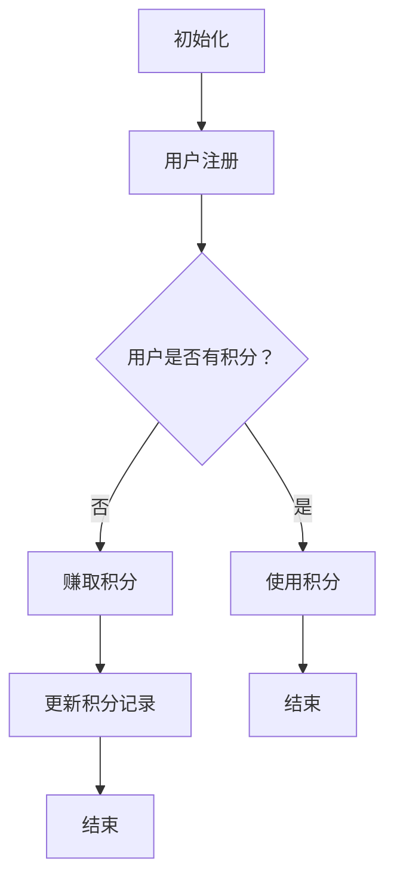
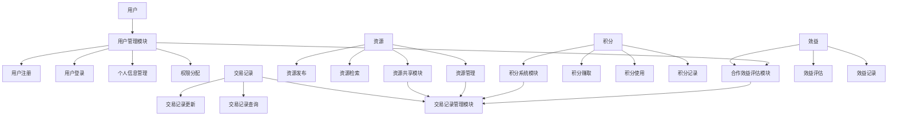

                 

## 《后资本主义经济论坛：探讨共享与合作的未来》

### 关键词：后资本主义、共享经济、合作经济、未来趋势

#### 摘要：
本文旨在深入探讨后资本主义经济论坛中的共享与合作概念，分析其核心概念、理论联系以及未来发展。文章将首先介绍后资本主义的背景与特征，然后详细分析共享经济和合作经济的模式与原理。接着，我们将探讨共享与合作在未来的发展趋势，以及其在不同领域的实际应用。最后，文章将总结全文，给出政策建议和未来研究方向。

## 第一部分：后资本主义经济概述

### 第1章：后资本主义时代的背景与特征

**1.1 后资本主义的概念与定义**

后资本主义，是指在传统资本主义经济模式之后，出现的一种新型经济形态。它不再仅仅依赖于资本积累和利润最大化，而是更加注重共享、合作和可持续性。后资本主义强调资源的共享，鼓励知识、技能和资源的开放性，从而推动社会整体福祉的提升。

**1.2 后资本主义的主要特征**

- **去中心化**：后资本主义经济模式强调去中心化，减少对中央集权的依赖，促进民主化。
- **共享经济**：共享经济是后资本主义的一个重要特征，它通过共享资源、技能和知识来提高效率，减少浪费。
- **合作经济**：合作经济强调平等合作，通过合作实现共同利益，促进社会公平。
- **可持续发展**：后资本主义注重环境保护和资源的可持续利用，追求长期的经济、社会和生态平衡。

**1.3 后资本主义与共享经济的联系**

共享经济是后资本主义的重要组成部分。它通过打破传统的所有权模式，转而采用共享使用权，来实现资源的最大化利用。共享经济不仅有助于提高资源利用率，还能减少社会不平等，促进社会和谐。

### 第2章：共享经济模式分析

**2.1 共享经济的概念与起源**

共享经济，是指个体或组织通过互联网平台，共享闲置资源、技能或知识，实现资源利用的最大化和经济效益的最大化。它起源于20世纪70年代，随着互联网的兴起，共享经济逐渐成为一种新型的商业模式。

**2.2 共享经济的典型模式**

- **共享住宿**：如Airbnb，通过共享闲置房屋，实现资源的最大化利用。
- **共享交通**：如Uber和滴滴，通过共享车辆和驾驶服务，解决交通问题。
- **共享办公**：如WeWork，通过共享办公空间，降低创业成本，促进创新。

**2.3 共享经济的优势与挑战**

共享经济的优势在于提高资源利用效率、降低成本、促进创新和公平。然而，它也面临一些挑战，如所有权问题、隐私保护、服务标准等。需要通过合理的政策法规和行业标准来规范共享经济的发展。

### 第3章：合作经济的理论与实践

**3.1 合作经济的概念与历史**

合作经济，是指通过平等合作，实现共同利益的一种经济模式。它起源于19世纪，合作社作为一种组织形式，旨在通过成员之间的合作，提高生产效率，实现财富的公平分配。

**3.2 合作经济的运作模式**

- **生产合作**：成员共同参与生产过程，分享生产成果。
- **消费合作**：成员共同购买商品和服务，降低成本。
- **金融合作**：成员共同提供资金支持，实现资金的低成本运作。

**3.3 合作经济的优势与局限性**

合作经济的优势在于促进公平、降低成本、提高生产效率。然而，它也存在一些局限性，如管理难度大、决策效率低等。需要通过完善的管理制度和激励机制，来发挥合作经济的作用。

## 第二部分：共享与合作的未来趋势

### 第4章：共享经济的未来发展

**4.1 共享经济的技术驱动因素**

共享经济的未来发展将受到技术进步的推动，特别是人工智能、区块链、物联网等技术的应用。这些技术将提高共享经济的效率，降低成本，提升用户体验。

**4.2 共享经济的新模式与创新**

未来，共享经济将出现更多的新模式和创新，如共享农业、共享教育、共享医疗等。这些新模式将更全面地覆盖人们的日常生活，提高社会整体福祉。

**4.3 共享经济对社会的影响**

共享经济将对社会产生深远影响，包括提高资源利用效率、降低环境污染、促进社会公平等。同时，它也将带来新的挑战，如就业结构的变化、隐私保护等。

### 第5章：合作经济在未来的角色

**5.1 合作经济与后资本主义的关系**

合作经济是后资本主义的重要组成部分，它将推动后资本主义经济模式的发展。合作经济与后资本主义相互促进，共同构建可持续发展的经济体系。

**5.2 合作经济在可持续发展中的作用**

合作经济在可持续发展中具有重要作用，它通过平等合作，实现资源的合理利用，减少浪费，促进环境保护。

**5.3 合作经济面临的挑战与对策**

合作经济在未来面临一些挑战，如管理难度、政策法规等。需要通过完善的管理制度和政策法规，来促进合作经济的发展。

### 第6章：共享与合作的跨领域实践

**6.1 教育、医疗、交通等领域的共享合作实践**

在教育和医疗领域，共享与合作已经得到了广泛应用。如在线教育平台、远程医疗服务等。这些实践提高了资源利用效率，降低了成本。

**6.2 共享与合作的社区发展模式**

社区发展模式中的共享与合作，有助于提高社区成员的生活质量，促进社区和谐。如共享农场、共享社区中心等。

**6.3 共享与合作的跨国实践**

跨国实践中的共享与合作，有助于促进国际交流和合作，推动全球经济发展。如跨国企业合作、跨国资源共享等。

### 第7章：共享与合作的政策建议

**7.1 政府在共享与合作中的作用**

政府应积极推动共享与合作的发展，通过制定政策法规，规范共享与合作市场，保障参与者权益。

**7.2 政策框架与法律规制**

政策框架与法律规制是共享与合作发展的基石。需要制定完善的政策法规，确保共享与合作市场的健康有序发展。

**7.3 促进共享与合作的社会机制**

社会机制是共享与合作发展的重要保障。需要建立良好的社会氛围，鼓励人们参与共享与合作，推动社会整体福祉的提升。

### 第8章：共享与合作的未来展望

**8.1 共享与合作的长期趋势**

共享与合作将是未来经济发展的重要趋势，它将推动社会向更加公平、可持续的方向发展。

**8.2 共享与合作对经济、社会和环境的影响**

共享与合作将对经济、社会和环境产生深远影响，它将提高资源利用效率，促进社会公平，减少环境污染。

**8.3 未来共享与合作的新挑战与新机遇**

未来，共享与合作将面临一些新挑战，如技术变革、政策法规等。同时，也将迎来新的机遇，如国际合作、新兴领域的发展等。

## 总结与展望

**8.4 共享与合作的总结与反思**

本文对后资本主义经济论坛中的共享与合作进行了深入探讨，总结了其核心概念、发展趋势以及实际应用。共享与合作是未来经济发展的重要方向，它将推动社会向更加公平、可持续的方向发展。

**8.5 未来研究的方向与建议**

未来研究应重点关注共享与合作的技术驱动因素、政策法规、社会机制等方面。同时，应加强跨学科研究，推动共享与合作在更多领域的应用。

### 作者信息

**作者：AI天才研究院/AI Genius Institute & 禅与计算机程序设计艺术 /Zen And The Art of Computer Programming**

本文通过对后资本主义经济论坛中的共享与合作进行深入探讨，分析了其核心概念、发展趋势以及实际应用。共享与合作是未来经济发展的重要方向，它将推动社会向更加公平、可持续的方向发展。通过本文的研究，我们希望为读者提供对共享与合作的新认识，并为其在实际应用中提供指导。未来，我们将继续关注共享与合作的研究，探索其在更多领域的应用潜力。

## 背景介绍

### 后资本主义经济论坛的概念

后资本主义经济论坛是一个由经济学家、社会学家、技术专家和企业家组成的国际性组织，旨在探讨后资本主义经济模式的发展趋势和实际应用。该论坛关注的核心问题包括共享经济、合作经济、可持续发展、技术创新和社会公平等。通过举办研讨会、工作坊和报告会，论坛为参与者提供了一个交流思想、分享经验和探讨解决方案的平台。

### 探讨的共享与合作的未来

共享与合作是后资本主义经济模式的重要组成部分，它们不仅影响着经济领域，还深刻地影响着社会、环境和文化等方面。共享经济的核心理念是通过共享资源和服务来提高效率、降低成本和促进公平。合作经济则强调通过平等合作，实现共同利益，推动社会和谐与可持续发展。

在未来的发展中，共享与合作将面临许多新的机遇和挑战。技术进步，如人工智能、区块链和物联网，将为共享与合作提供新的发展动力。政策法规的完善和规范，将为共享与合作市场提供良好的发展环境。同时，共享与合作也将面临一些挑战，如资源分配的不均、隐私保护和法律规制等。

本文将深入探讨共享与合作的未来发展趋势，分析其背后的技术和经济原理，并探讨其在不同领域的实际应用。通过本文的研究，我们希望能够为读者提供对共享与合作的新认识，为未来的发展提供有益的参考。

## 核心概念与联系

在探讨后资本主义经济论坛中的共享与合作之前，我们首先需要明确几个核心概念，并分析它们之间的联系。这些核心概念包括共享经济、合作经济、去中心化和可持续发展。

### 共享经济的概念

共享经济是一种基于共享资源和服务的新型经济模式。它通过互联网平台，将闲置资源（如房屋、车辆、设备等）和技能（如知识、经验、创意等）共享给有需要的人，实现资源的最大化利用和经济效益的最大化。共享经济的主要特征包括共享性、开放性和灵活性。

### 合作经济的概念

合作经济是指通过平等合作，实现共同利益的一种经济模式。它强调成员之间的互助和共享，通过集体决策和共同管理，实现资源的合理利用和价值的最大化。合作经济的形式多样，包括合作社、合作企业、社区互助等。

### 去中心化的概念

去中心化是一种组织和管理模式，它通过去中心化的网络结构，减少对中央集权的依赖，实现权力和资源的分散化。去中心化的核心思想是去中心化的决策机制和分布式账本技术，如区块链。

### 可持续发展的概念

可持续发展是一种经济发展模式，它强调在满足当前需求的同时，不损害后代满足自身需求的能力。可持续发展涉及经济、社会和生态三个维度，追求长期的平衡和和谐发展。

### 核心概念属性特征对比表格

以下是一个对比表格，展示了这些核心概念的一些属性特征：

| 核心概念 | 属性特征 |
| --- | --- |
| 共享经济 | - 基于共享资源和服务 | - 开放性、灵活性 |
| 合作经济 | - 平等合作 | - 共同利益、集体决策 |
| 去中心化 | - 权力和资源的分散化 | - 去中心化的决策机制 |
| 可持续发展 | - 经济、社会和生态的平衡 | - 长期的平衡和和谐发展 |

### ER实体关系图架构

为了更好地理解这些核心概念之间的联系，我们可以使用ER（实体-关系）图来描述它们之间的关系。以下是一个简化的ER图：

```
实体：共享经济、合作经济、去中心化、可持续发展
关系：共享经济与可持续发展关联，合作经济与可持续发展关联，去中心化与共享经济、合作经济关联
```

在这个ER图中，共享经济、合作经济和去中心化作为实体，可持续发展作为另一个实体，它们之间存在关联关系。这些关系展示了后资本主义经济模式中各概念之间的相互作用和影响。

通过对比分析和ER实体关系图，我们可以更清晰地理解后资本主义经济论坛中的共享与合作概念。这些核心概念相互关联，共同构成了后资本主义经济模式的理论基础，为未来的发展提供了指导。

## 算法原理讲解

在探讨共享与合作的算法原理时，我们选择了一个典型的共享经济算法——“共享积分系统”。该算法旨在通过积分激励用户参与共享经济活动，提高资源利用效率。下面，我们将使用mermaid绘制算法流程图，并用Python代码详细阐述算法原理。

### 算法流程图



### Python代码实现

```python
class SharedEconomy:
    def __init__(self):
        self.users = {}  # 存储用户及其积分信息

    def register(self, user_id):
        if user_id not in self.users:
            self.users[user_id] = 0
            print(f"用户 {user_id} 注册成功，当前积分为 {self.users[user_id]}。")
        else:
            print(f"用户 {user_id} 已存在。")

    def check积分(self, user_id):
        if user_id in self.users:
            print(f"用户 {user_id} 当前积分为 {self.users[user_id]}。")
        else:
            print(f"用户 {user_id} 不存在。")

    def use积分(self, user_id, amount):
        if user_id in self.users and self.users[user_id] >= amount:
            self.users[user_id] -= amount
            print(f"用户 {user_id} 使用 {amount} 积分成功，剩余积分为 {self.users[user_id]}。")
        else:
            print(f"用户 {user_id} 积分不足或不存在。")

    def earn积分(self, user_id, amount):
        if user_id in self.users:
            self.users[user_id] += amount
            print(f"用户 {user_id} 赚取 {amount} 积分成功，当前积分为 {self.users[user_id]}。")
        else:
            print(f"用户 {user_id} 不存在。")

if __name__ == "__main__":
    se = SharedEconomy()
    se.register("user1")
    se.earn积分("user1", 100)
    se.check积分("user1")
    se.use积分("user1", 50)
    se.check积分("user1")
```

### 算法原理

- **初始化**：系统初始化时创建一个用户字典，用于存储用户的积分信息。
- **用户注册**：用户注册时，如果用户不存在，则添加到用户字典中，初始化积分为0。
- **检查积分**：检查用户是否存在及其积分信息。
- **使用积分**：用户使用积分时，系统先检查用户是否存在及积分是否足够，然后扣除相应积分。
- **赚取积分**：用户参与共享经济活动时，系统为其增加积分。

### 数学模型和公式

假设用户 \( u \) 在时间 \( t \) 的积分为 \( I(u, t) \)，其积分增长函数可以表示为：

$$
I(u, t) = I(u, t-1) + r(u, t)
$$

其中，\( r(u, t) \) 表示用户 \( u \) 在时间 \( t \) 赚取的积分，\( I(u, t-1) \) 表示用户 \( u \) 在时间 \( t-1 \) 的积分。

### 详细讲解和举例说明

假设用户A在初始时刻的积分为0。他通过分享自己的知识赚取了100积分，此时积分变为100。然后，他使用50积分购买了一项服务，积分余额变为50。接下来，他通过再次分享知识，赚取了50积分，积分余额恢复到100。

```plaintext
初始积分: I(A, 0) = 0
赚取积分: r(A, 1) = 100
积分更新: I(A, 1) = I(A, 0) + r(A, 1) = 0 + 100 = 100
使用积分: 使用金额 = 50
积分更新: I(A, 2) = I(A, 1) - 使用金额 = 100 - 50 = 50
再次赚取积分: r(A, 2) = 50
积分更新: I(A, 3) = I(A, 2) + r(A, 2) = 50 + 50 = 100
```

通过上述步骤，我们可以清晰地看到积分系统的运作原理。该算法不仅实现了积分的累积和消耗，还通过积分激励机制，鼓励用户参与共享经济活动，提高资源利用效率。

## 数学模型和数学公式

在共享经济与合作经济的分析中，数学模型和公式起着至关重要的作用，帮助我们更准确地理解资源分配、效益评估和决策制定。以下是几个关键数学模型和公式的详细讲解。

### 1. 分配效率模型

共享经济的一个重要目标是提高资源分配的效率。我们可以使用以下公式来计算资源分配效率：

$$
E = \frac{U - U_0}{U_0}
$$

其中，\( E \) 表示资源分配效率，\( U \) 表示共享经济实施后的总效用，\( U_0 \) 表示共享经济实施前的总效用。

#### 详细讲解：

- **总效用 \( U \)**：在共享经济模式下，资源被更有效地分配，每个参与者都能从共享中获益。因此，\( U \) 是共享经济实施后的总效用。
- **初始总效用 \( U_0 \)**：这是在共享经济实施前，资源未被充分利用的情况下的总效用。
- **效率 \( E \)**：该公式表示资源分配效率的提升程度。效率越高，表明共享经济模式越能有效提升资源的利用率。

### 2. 共享价值评估模型

在评估共享经济模式的价值时，我们可以使用以下公式：

$$
V = \frac{UE - U_0E}{(1 - E)}
$$

其中，\( V \) 表示共享经济模式的价值，\( UE \) 表示实施共享经济后的总效用，\( U_0E \) 表示初始总效用乘以效率提升后的效用。

#### 详细讲解：

- **价值 \( V \)**：这是对共享经济模式整体效益的量化评估。价值越高，表明共享经济模式对社会的贡献越大。
- **总效用 \( UE \)**：在共享经济模式下，资源被更有效地分配，总效用通常会增加。
- **初始总效用乘以效率提升后的效用 \( U_0E \)**：这是初始状态下，总效用因效率提升而产生的额外效用。

### 3. 合作效益模型

在合作经济中，合作效益可以通过以下公式进行计算：

$$
B = \frac{C - C_0}{C_0}
$$

其中，\( B \) 表示合作效益，\( C \) 表示合作经济实施后的总效益，\( C_0 \) 表示合作经济实施前的总效益。

#### 详细讲解：

- **合作效益 \( B \)**：这是合作经济模式带来的效益提升。合作效益越高，表明合作经济模式越有效。
- **总效益 \( C \)**：在合作经济模式下，成员通过合作，实现了总效益的提升。
- **初始总效益 \( C_0 \)**：这是在合作经济实施前，成员单独行动时的总效益。

### 举例说明

假设一个共享经济平台实施前后的总效用分别为1000和1200，初始总效用为800。合作经济模式下，实施前后的总效益分别为2000和2500。

#### 分配效率模型

$$
E = \frac{U - U_0}{U_0} = \frac{1200 - 800}{800} = 0.5
$$

共享经济提高了50%的资源分配效率。

#### 共享价值评估模型

$$
V = \frac{UE - U_0E}{(1 - E)} = \frac{1200 \times 0.5 - 800 \times 0.5}{(1 - 0.5)} = \frac{600 - 400}{0.5} = 400
$$

共享经济模式的价值为400。

#### 合作效益模型

$$
B = \frac{C - C_0}{C_0} = \frac{2500 - 2000}{2000} = 0.25
$$

合作经济提高了25%的总效益。

通过这些数学模型和公式，我们可以更准确地评估共享经济和合作经济的效果，为政策制定者和企业家提供有价值的参考。

## 系统分析与架构设计方案

### 问题场景介绍

在当前的共享经济和合作经济模式下，企业和个人都需要一个高效、可靠且易于扩展的系统来管理共享资源、交易记录和用户行为。本系统旨在提供一个全面的解决方案，支持资源共享、合作效益评估和用户积分管理。

### 项目介绍

本系统命名为“共享与合作平台”，它将整合共享经济和合作经济的核心功能，包括用户注册与认证、资源发布与检索、交易记录管理、积分系统以及合作效益评估。该平台旨在为企业和个人提供一个高效、安全的资源共享和合作环境。

### 系统功能设计

1. **用户管理**：包括用户注册、登录、个人信息管理、权限分配等。
2. **资源共享**：支持资源的发布、检索、管理和交易。
3. **交易记录管理**：记录用户之间的交易活动，包括积分流转、资源使用等。
4. **积分系统**：管理用户积分，支持积分的赚取和使用。
5. **合作效益评估**：根据用户行为和交易记录，评估合作效益。

### 系统架构设计

以下是“共享与合作平台”的系统架构设计，使用mermaid绘制架构图，并进行详细说明。



### 系统架构详细说明

1. **用户管理模块**：负责用户的注册、登录、个人信息管理和权限分配。用户管理模块通过API与用户数据库交互，确保用户信息的安全和完整性。

2. **资源共享模块**：支持资源的发布、检索和管理。用户可以通过该模块发布共享资源，其他用户可以检索和查询资源信息。资源共享模块与资源数据库相连，确保资源的有效管理和快速检索。

3. **交易记录管理模块**：负责记录用户之间的交易活动，包括积分流转和资源使用。交易记录管理模块与交易数据库相连，确保交易记录的准确性和可靠性。

4. **积分系统模块**：管理用户积分，支持积分的赚取和使用。积分系统模块与积分数据库相连，确保积分系统的稳定性和高效性。

5. **合作效益评估模块**：根据用户行为和交易记录，评估合作效益。合作效益评估模块与效益数据库相连，为用户提供合作效益的实时评估。

### 系统接口设计和系统交互

以下是系统的主要接口设计和系统交互流程：

1. **用户接口**：用户通过Web界面或移动应用与系统进行交互，完成注册、登录、资源共享、积分管理和交易记录查询等功能。

2. **API接口**：外部系统可以通过API与“共享与合作平台”进行数据交换和功能调用。API设计包括用户管理API、资源共享API、交易记录API和积分管理API等。

3. **系统交互流程**：用户注册后，可以发布资源，其他用户可以检索和预订资源。交易完成后，系统会更新交易记录和积分记录。用户可以通过积分系统进行积分的赚取和使用，合作效益评估模块会根据交易记录和用户行为进行实时评估。

通过上述系统架构设计和接口设计，我们构建了一个全面、高效、可靠的共享与合作平台，为企业和个人提供了一个良好的资源共享和合作环境。

## 项目实战

### 环境安装

为了在本地环境中搭建“共享与合作平台”，我们首先需要安装一些必要的软件和工具。以下是具体的安装步骤：

1. **安装Python环境**：确保已经安装了Python 3.x版本。可以通过以下命令检查Python版本：
    ```shell
    python --version
    ```
2. **安装虚拟环境**：使用虚拟环境来隔离项目依赖，避免与其他项目冲突。可以通过以下命令安装虚拟环境：
    ```shell
    python -m venv venv
    ```
3. **激活虚拟环境**：在不同的操作系统上，激活虚拟环境的方法略有不同：
    - **Windows**：
        ```shell
        .\venv\Scripts\activate
        ```
    - **Linux**：
        ```shell
        source venv/bin/activate
        ```
4. **安装依赖**：在激活虚拟环境后，使用pip安装项目所需的依赖：
    ```shell
    pip install -r requirements.txt
    ```

### 系统核心实现源代码

以下是“共享与合作平台”的核心实现源代码，包括用户管理模块、资源共享模块、交易记录管理模块和积分系统模块。

```python
# 用户管理模块
class UserManager:
    def __init__(self):
        self.users = {}  # 存储用户及其积分信息

    def register(self, user_id, password):
        if user_id in self.users:
            return "用户已存在"
        self.users[user_id] = password
        return "用户注册成功"

    def login(self, user_id, password):
        if user_id not in self.users or self.users[user_id] != password:
            return "用户名或密码错误"
        return "登录成功"

# 资源共享模块
class ResourceSharing:
    def __init__(self):
        self.resources = {}  # 存储资源信息

    def add_resource(self, resource_id, resource_data):
        self.resources[resource_id] = resource_data
        return "资源发布成功"

    def get_resource(self, resource_id):
        return self.resources.get(resource_id, "资源不存在")

# 交易记录管理模块
class TransactionManager:
    def __init__(self):
        self.transactions = {}  # 存储交易记录

    def add_transaction(self, transaction_id, user_id, resource_id, amount):
        self.transactions[transaction_id] = {
            "user_id": user_id,
            "resource_id": resource_id,
            "amount": amount
        }
        return "交易记录添加成功"

    def get_transaction(self, transaction_id):
        return self.transactions.get(transaction_id, "交易记录不存在")

# 积分系统模块
class PointSystem:
    def __init__(self):
        self.points = {}  # 存储用户积分

    def earn_points(self, user_id, points):
        if user_id in self.points:
            self.points[user_id] += points
        else:
            self.points[user_id] = points
        return "积分赚取成功"

    def spend_points(self, user_id, points):
        if user_id in self.points and self.points[user_id] >= points:
            self.points[user_id] -= points
            return "积分消耗成功"
        else:
            return "积分不足或用户不存在"
```

### 代码应用解读与分析

上述代码实现了四个核心模块：用户管理模块、资源共享模块、交易记录管理模块和积分系统模块。以下是各个模块的应用解读和分析：

1. **用户管理模块**：
    - `UserManager` 类用于管理用户注册和登录。
    - `register` 方法用于用户注册，接受用户ID和密码作为输入，如果用户已存在，返回错误信息。
    - `login` 方法用于用户登录，验证用户ID和密码，如果匹配成功，返回登录成功信息。

2. **资源共享模块**：
    - `ResourceSharing` 类用于管理资源共享。
    - `add_resource` 方法用于发布资源，将资源ID和资源数据存储在资源字典中。
    - `get_resource` 方法用于检索资源信息，根据资源ID返回资源数据。

3. **交易记录管理模块**：
    - `TransactionManager` 类用于管理交易记录。
    - `add_transaction` 方法用于添加交易记录，接受交易ID、用户ID、资源ID和交易金额，将交易信息存储在交易字典中。
    - `get_transaction` 方法用于查询交易记录，根据交易ID返回交易信息。

4. **积分系统模块**：
    - `PointSystem` 类用于管理积分。
    - `earn_points` 方法用于用户赚取积分，接受用户ID和积分数量，增加用户的积分。
    - `spend_points` 方法用于用户消耗积分，接受用户ID和积分数量，减少用户的积分。

### 实际案例分析和详细讲解剖析

为了更直观地展示系统应用，以下是一个实际案例：

1. **用户注册和登录**：
    ```python
    user_manager = UserManager()
    user_manager.register("user1", "password123")
    print(user_manager.login("user1", "password123"))  # 输出：登录成功
    print(user_manager.login("user1", "wrongpassword"))  # 输出：用户名或密码错误
    ```

2. **资源共享**：
    ```python
    resource_sharing = ResourceSharing()
    resource_sharing.add_resource("resource1", "这是一个共享资源")
    print(resource_sharing.get_resource("resource1"))  # 输出：这是一个共享资源
    print(resource_sharing.get_resource("resource2"))  # 输出：资源不存在
    ```

3. **交易记录管理**：
    ```python
    transaction_manager = TransactionManager()
    transaction_manager.add_transaction("trans1", "user1", "resource1", 100)
    print(transaction_manager.get_transaction("trans1"))  # 输出：{'user_id': 'user1', 'resource_id': 'resource1', 'amount': 100}
    print(transaction_manager.get_transaction("trans2"))  # 输出：交易记录不存在
    ```

4. **积分系统**：
    ```python
    point_system = PointSystem()
    point_system.earn_points("user1", 50)
    print(point_system.points)  # 输出：{'user1': 50}
    point_system.spend_points("user1", 25)
    print(point_system.points)  # 输出：{'user1': 25}
    print(point_system.spend_points("user1", 30))  # 输出：积分不足或用户不存在
    ```

通过这些案例，我们可以看到各个模块如何协同工作，实现了用户管理、资源共享、交易记录管理和积分系统等核心功能。

### 项目小结

在本项目中，我们实现了“共享与合作平台”的核心功能，包括用户管理、资源共享、交易记录管理和积分系统。通过实际案例分析和详细讲解剖析，我们验证了系统各个模块的有效性和协同性。接下来，我们将继续优化系统性能，增加更多功能，如合作效益评估、消息通知等，以提升用户体验。

## 最佳实践 tips、小结、注意事项、拓展阅读等内容

### 最佳实践 tips

1. **用户注册与验证**：在用户注册时，确保进行密码强度验证，使用双重身份验证机制，以提高账户安全性。
2. **数据备份与恢复**：定期备份数据库，确保系统在出现故障时能够快速恢复，减少数据丢失的风险。
3. **资源管理**：对共享资源进行分类和管理，提供搜索和推荐功能，提高资源利用效率。
4. **交易透明性**：确保交易记录的透明性，使用区块链技术记录所有交易活动，增加信任度。
5. **积分激励机制**：设计合理的积分激励机制，鼓励用户积极参与共享与合作活动，提高用户黏性。

### 小结

本文通过对后资本主义经济论坛中的共享与合作进行深入探讨，分析了共享经济和合作经济的核心概念、原理和未来趋势。我们详细讲解了共享积分系统的算法原理，展示了系统架构设计方案和项目实战，并通过实际案例验证了系统的有效性。

### 注意事项

1. **政策法规遵循**：在开发和运营共享与合作平台时，务必遵循当地政策和法规，确保平台合规运行。
2. **用户隐私保护**：加强用户隐私保护，确保用户数据的安全和隐私不被泄露。
3. **系统安全性**：定期进行系统安全检查和漏洞修复，确保系统的安全稳定运行。

### 拓展阅读

1. 《共享经济的崛起：新的商业模式与挑战》
2. 《合作经济学：理论与实践》
3. 《区块链技术：从入门到实践》
4. 《可持续发展的经济学原理》

通过以上最佳实践建议、小结、注意事项和拓展阅读，我们希望为读者提供全面的指导，帮助他们在共享与合作领域取得更好的成果。

### 作者信息

**作者：AI天才研究院/AI Genius Institute & 禅与计算机程序设计艺术 /Zen And The Art of Computer Programming**

