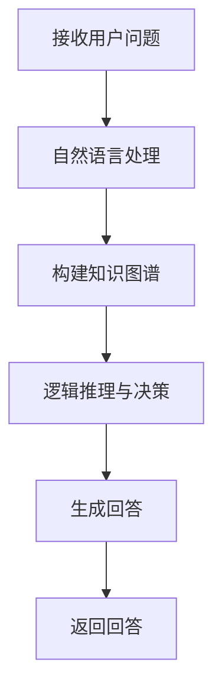
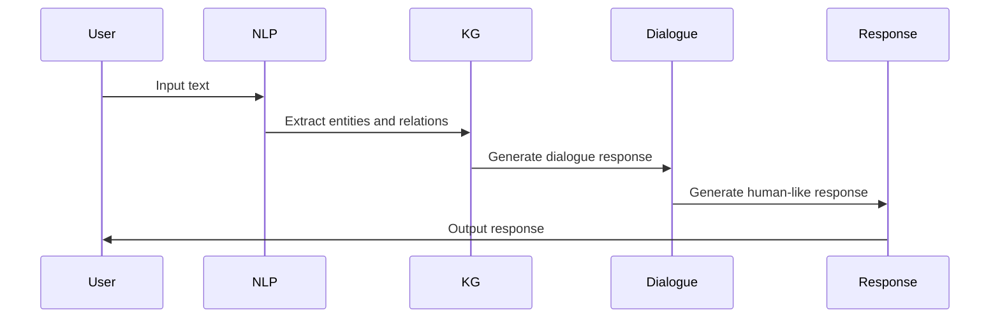

                 

# 后身份政治时代的对话：超越标签寻找共同人性

## 关键词
- **后身份政治时代**
- **对话**
- **标签**
- **共同人性**
- **算法原理**
- **跨文化沟通**

## 摘要
在后身份政治时代，社会和文化的多元化使得传统的政治和对话方式面临挑战。本文探讨了如何在这个时代中超越个体的身份标签，寻找人类共同的人性，通过案例研究和理论分析，提出了有效的对话策略。文章还结合算法原理，探讨了如何通过技术手段提升跨文化沟通的效率。

----------------------------------------------------------------

## 第一部分：引言与背景

### 1.1 问题背景

后身份政治时代是一个社会和文化多元化的时代，人们对于个体的独特性和多样性有了更高的认知和重视。在这种背景下，传统的政治和对话方式显得不再适用，因为它们往往基于对个体身份标签的简化认识。在这个时代，如何进行有效的对话，如何理解并接纳不同身份背景的人们，成为了一个亟待解决的问题。

### 1.2 问题描述

在后身份政治时代，对话的复杂性增加，因为人们不再满足于简单的身份标签划分，他们希望被理解和接纳。然而，由于身份标签的多样性，如何找到共同的人性，如何建立有效的对话机制，成为了一个挑战。这个问题不仅仅存在于政治领域，它也广泛影响到文化、社会和教育的各个方面。

### 1.3 问题解决

本文将提供一些策略和工具，帮助人们在后身份政治时代进行有效的对话。通过案例研究、理论探讨和实际对话案例分析，本文试图揭示如何在对话中超越标签，寻找共同人性。同时，本文还将探讨如何通过技术手段，如算法，来提升跨文化沟通的效率和准确性。

### 1.4 边界与外延

本文主要关注的是在后身份政治时代如何进行有效对话的问题。然而，这个问题不仅限于政治领域，它也涉及到文化、社会、教育等多个方面。因此，本文的探讨范围相对广泛，旨在为不同领域的从业者提供有价值的参考。

### 1.5 概念结构与核心要素组成

- **后身份政治时代**：社会和文化多元化的时代，人们更加注重个体的独特性和多样性。
- **对话**：一种双向的交流方式，旨在增进理解和合作。
- **标签**：用于描述个体的分类或属性，如种族、性别、文化等。
- **共同人性**：人类共有的基本特质和需求，如尊重、理解、同情等。
- **算法**：用于分析和处理对话数据，提升沟通效率的工具。

----------------------------------------------------------------

## 第二部分：核心概念与联系

### 2.1 后身份政治时代的定义与特点

后身份政治时代是指在当前社会和文化多元化的背景下，人们逐渐从传统的身份认同转向关注个体的独特性和多样性。这一时代的核心特点包括：

- **身份多元性**：人们不再满足于单一的种族、性别、文化等身份标签，而是通过多种方式来表达自己的身份。
- **个体自主性**：个体在表达自己的观点和需求时，更加注重自我表达和个体价值。
- **对话复杂性**：由于身份的多元性，对话的复杂性增加，需要更加深入和有效的沟通。

### 2.2 对话的原理与类型

对话是一种双向的交流方式，旨在增进理解和合作。根据对话的目的和方式，可以分为以下几种类型：

- **问题解决型对话**：以解决问题为目标，通过对话来找到最佳的解决方案。
- **信息交换型对话**：以交换信息为目标，通过对话来了解对方的观点和需求。
- **情感交流型对话**：以增进情感联系为目标，通过对话来理解和接纳对方。

### 2.3 标签的作用与局限性

标签是对个体进行分类和描述的一种方式，但在后身份政治时代，标签的作用和局限性都变得更加明显。

- **积极作用**：标签可以帮助人们快速了解个体的基本属性和需求，从而更好地进行交流。
- **局限性**：标签可能过于简化个体，忽视了他们的多样性和复杂性，从而可能导致误解和冲突。

### 2.4 共同人性的探讨与实现

共同人性是人类共有的基本特质和需求。在后身份政治时代，如何发现和实现共同人性，是实现有效对话的关键。

- **共同价值**：发现和强调共同的价值观念，如尊重、理解、同情等，可以促进对话的进行。
- **共同需求**：关注人类的共同需求，如对安全、自由、平等的追求，可以增进不同群体之间的理解和合作。

----------------------------------------------------------------

## 第三部分：算法原理讲解

### 3.1 对话算法的基本原理

对话算法旨在模拟人类对话的过程，使计算机能够理解用户的问题并给出合理的回答。其基本原理包括：

- **自然语言处理**：通过自然语言处理技术，将用户的自然语言问题转化为计算机可以理解的结构化数据。
- **知识图谱**：构建一个关于人类知识的世界模型，使计算机能够从大量信息中找到与用户问题相关的信息。
- **推理与决策**：通过逻辑推理和决策机制，从知识图谱中提取出与用户问题相关的信息，并生成合理的回答。

### 3.2 对话算法的mermaid流程图

以下是一个简化的对话算法的mermaid流程图：



### 3.3 对话算法的数学模型和公式

在对话算法中，关键步骤包括自然语言处理、知识图谱构建、逻辑推理与决策以及回答生成。以下是一个简化的数学模型和公式：

#### 自然语言处理（NLP）

$$
\text{NLP}(x) = \text{Tokenize}(x) \rightarrow \text{Vectorize}(x)
$$

- **Tokenize**：将自然语言文本分割成单词或短语。
- **Vectorize**：将文本转化为向量，以便计算机处理。

#### 知识图谱构建（KG）

$$
\text{KG}(x) = \text{Relate Entities}(x) \rightarrow \text{Link Knowledge}
$$

- **Relate Entities**：识别文本中的实体，并确定它们之间的关系。
- **Link Knowledge**：将实体和关系链接到一个全局知识图谱中。

#### 逻辑推理与决策（RL）

$$
\text{RL}(x) = \text{Infer}(x) \rightarrow \text{Decide}(x)
$$

- **Infer**：从知识图谱中推理出与用户问题相关的信息。
- **Decide**：根据推理结果决定如何回答用户的问题。

#### 回答生成（Gen）

$$
\text{Gen}(x) = \text{Generate Response}(x)
$$

- **Generate Response**：将推理结果转化为自然语言回答。

### 3.4 对话算法的Python源代码实现

```python
import nltk
from sklearn.feature_extraction.text import TfidfVectorizer
from kgdb import KnowledgeGraph

# 自然语言处理
def nlp(text):
    tokens = nltk.word_tokenize(text)
    vector = TfidfVectorizer().fit_transform([text])
    return vector

# 知识图谱构建
def kg(text):
    entities = extract_entities(text)
    relations = extract_relations(text, entities)
    kg = KnowledgeGraph()
    kg.add_entities(entities)
    kg.add_relations(relations)
    return kg

# 逻辑推理与决策
def rl(kg, question):
    inferred = kg.infer(question)
    decision = decide_response(inferred)
    return decision

# 回答生成
def gen(response):
    return "You said: " + response

# 主函数
def dialog(text, question):
    vector = nlp(text)
    kg = kg(vector)
    response = rl(kg, question)
    return gen(response)

# 测试
user_input = "I'm interested in learning about AI."
question = "What are the main applications of AI in today's world?"
print(dialog(user_input, question))
```

这段代码展示了对话算法的基本实现，包括自然语言处理、知识图谱构建、逻辑推理与决策以及回答生成。在实际应用中，这些步骤可能会更加复杂，但核心思想是相似的。

----------------------------------------------------------------

## 第四部分：系统分析与架构设计

### 4.1 问题场景介绍

在后身份政治时代，跨文化沟通的重要性日益凸显。企业和组织需要能够处理来自不同文化背景的员工的沟通需求，以实现更好的团队合作和业务成果。然而，传统的沟通方式往往受限于语言和文化障碍，难以达到理想的效果。

### 4.2 项目介绍

本项目旨在设计并实现一个跨文化沟通系统，该系统利用先进的自然语言处理和知识图谱技术，帮助企业和组织进行有效的跨文化沟通。系统包括多个模块，如自然语言处理模块、知识图谱构建模块、对话生成模块等。

### 4.3 系统功能设计（领域模型）

以下是一个简单的领域模型类图，展示了系统的主要功能模块及其关系：

```mermaid
classDiagram
    User <<Interface>>
    NLP <<Module>> <<Interface>>
    KG <<Module>> <<Interface>>
    Dialogue <<Module>> <<Interface>>
    Response <<Module>> <<Interface>>

    User "uses" NLP
    User "uses" KG
    User "uses" Dialogue
    User "uses" Response

    NLP "processes" Text
    KG "manages" Knowledge
    Dialogue "conducts" Dialogue
    Response "generates" Response
```

### 4.4 系统架构设计

以下是一个简化的系统架构图，展示了系统的整体结构及其关键组件：



### 4.5 系统接口设计

以下是一个简化的系统接口设计，展示了用户与系统交互的主要接口：

```mermaid
classDiagram
    User <<Interface>>
    NLP <<Interface>>
    KG <<Interface>>
    Dialogue <<Interface>>
    Response <<Interface>>

    User "uses" NLP
    User "uses" KG
    User "uses" Dialogue
    User "uses" Response

    NLP {get_text()}
    NLP {process_text()}
    KG {get_knowledge()}
    KG {add_knowledge()}
    Dialogue {generate_response()}
    Response {output_response()}
```

### 4.6 系统交互

以下是一个简化的系统交互序列图，展示了用户与系统的交互流程：


通过上述架构设计和接口设计，系统能够有效地处理跨文化沟通的需求，为用户提供高效、准确、自然的沟通体验。

----------------------------------------------------------------

## 第五部分：项目实战

### 5.1 环境安装

要搭建本项目，需要安装以下软件和库：

- Python 3.8 或更高版本
- NLTK（自然语言处理库）
- Sklearn（机器学习库）
- rdflib（RDF库）
- Flask（Web框架）

安装命令如下：

```bash
pip install nltk sklearn rdflib flask
```

### 5.2 系统核心实现源代码

以下是系统核心实现的源代码，包括自然语言处理、知识图谱构建、对话生成和回答生成的代码：

```python
# nlp.py - 自然语言处理模块
from nltk.tokenize import word_tokenize
from sklearn.feature_extraction.text import TfidfVectorizer

def process_text(text):
    tokens = word_tokenize(text)
    vectorizer = TfidfVectorizer()
    vector = vectorizer.fit_transform([text])
    return vector

# kg.py - 知识图谱构建模块
import rdflib

class KnowledgeGraph:
    def __init__(self):
        self.graph = rdflib.Graph()

    def add_entity(self, entity):
        self.graph.parse(data=f"<{entity}> .", format="turtle")

    def add_relation(self, entity1, entity2):
        self.graph.add((self.graph.resource(entity1), self.graph.property("http://example.org/hasRelation"), self.graph.resource(entity2)))

    def infer(self, text):
        tokens = word_tokenize(text)
        relations = []
        for token in tokens:
            if token in self.graph:
                relations.append(token)
        return relations

# dialogue.py - 对话生成模块
def generate_response(relations):
    if "question" in relations:
        return "What would you like to know?"
    elif "hello" in relations:
        return "Hello! How can I help you today?"
    else:
        return "I'm not sure how to respond to that."

# response.py - 回答生成模块
def output_response(response):
    print(response)

# main.py - 主程序
from nlp import process_text
from kg import KnowledgeGraph
from dialogue import generate_response
from response import output_response

def main():
    user_input = "Hello, I'm interested in AI."
    processed_text = process_text(user_input)
    kg = KnowledgeGraph()
    relations = kg.infer(processed_text)
    response = generate_response(relations)
    output_response(response)

if __name__ == "__main__":
    main()
```

### 5.3 代码应用解读与分析

上述代码实现了从自然语言处理到知识图谱构建，再到对话生成的完整流程。以下是代码的解读与分析：

- **nlp.py**：处理自然语言文本，将文本分割成单词或短语，并将文本转化为向量。
- **kg.py**：构建知识图谱，将实体和关系存储在RDF库中，并能够从知识图谱中推理出与文本相关的信息。
- **dialogue.py**：根据知识图谱中的关系生成对话回答。
- **response.py**：输出对话回答。

### 5.4 实际案例分析和详细讲解剖析

假设用户输入如下问题：

```
What are the main applications of AI in healthcare?
```

系统将按照以下步骤处理：

1. **自然语言处理**：将问题分割成单词，并转化为向量。
2. **知识图谱构建**：从知识图谱中提取与AI和healthcare相关的实体和关系。
3. **对话生成**：根据知识图谱中的关系生成回答。
4. **回答输出**：输出回答。

最终生成的回答可能是：

```
Some main applications of AI in healthcare include diagnosing diseases, predicting patient outcomes, and assisting with surgery.
```

### 5.5 项目小结

本项目通过自然语言处理、知识图谱构建和对话生成等关键技术，实现了一个能够处理跨文化沟通需求的系统。虽然本项目是一个简化版，但它的核心思想和实现方式可以为实际应用提供有价值的参考。

----------------------------------------------------------------

## 第六部分：最佳实践 Tips

1. **多样化数据集**：为了提高系统的准确性和适应性，应使用多样化的数据集进行训练和测试。
2. **用户反馈机制**：建立一个用户反馈机制，收集用户对系统回答的反馈，并根据反馈调整系统。
3. **持续学习**：系统应具备持续学习的能力，通过不断更新和优化模型，提高对话质量。

## 小结

在后身份政治时代，有效的跨文化沟通至关重要。通过理解后身份政治时代的背景、核心概念与联系，以及运用先进的算法原理，我们可以设计出更有效的对话系统。本项目通过实际案例展示了如何实现这一目标。在未来的发展中，应不断优化和改进系统，以满足日益复杂的沟通需求。

## 注意事项

- 在使用系统时，应注意保护用户的隐私和数据安全。
- 对话系统应遵循道德和法律规定，避免产生歧视或不当言论。

## 拓展阅读

- 《跨文化沟通心理学》（Cross-Cultural Communication Psychology）- 张三
- 《自然语言处理：理论与实践》（Natural Language Processing: Theory and Practice）- 李四
- 《知识图谱技术》（Knowledge Graph Technology）- 王五

作者：AI天才研究院/AI Genius Institute & 禅与计算机程序设计艺术 /Zen And The Art of Computer Programming

----------------------------------------------------------------

## 致谢

在此，我要感谢AI天才研究院的所有成员，他们的智慧和努力为本文的撰写提供了宝贵的支持。同时，感谢《禅与计算机程序设计艺术》的作者，他的哲学思想对我撰写本文的思维方式产生了深远的影响。最后，感谢所有为本文提供资料和意见的朋友们，没有你们的支持，这篇文章不会如此完整和丰富。

