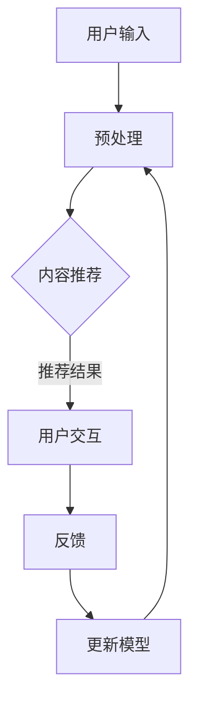
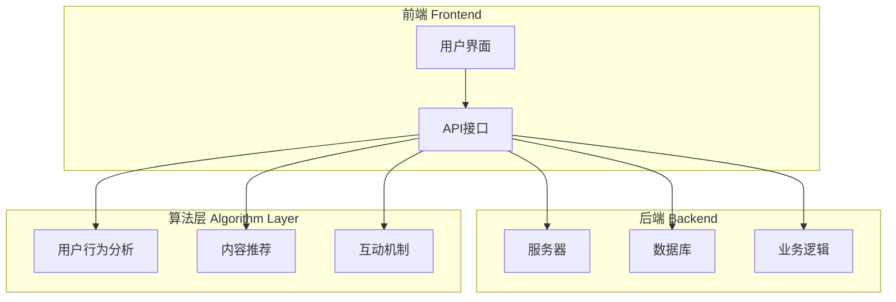
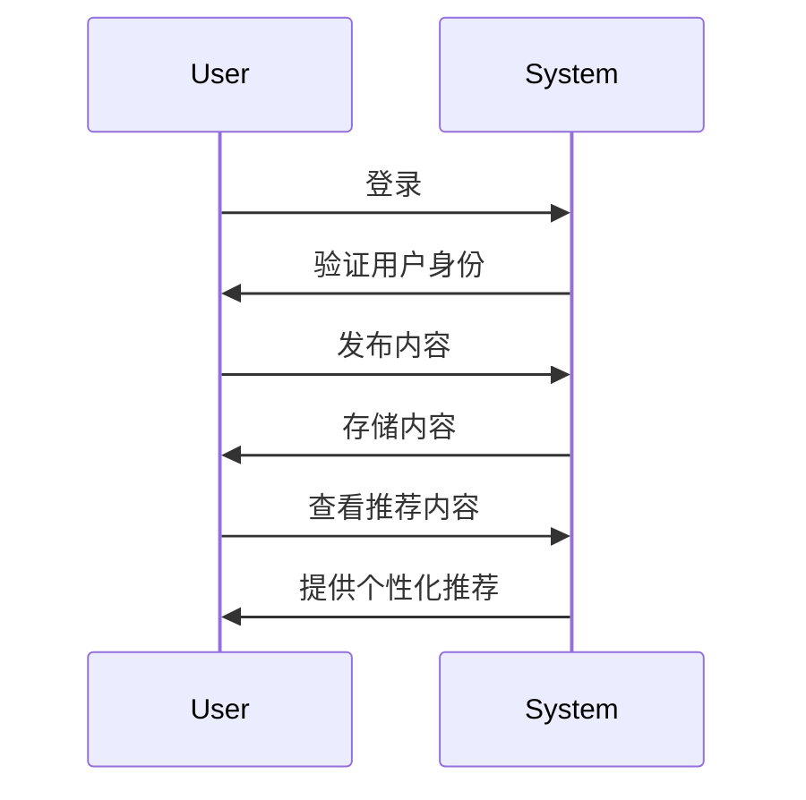

                 

### 背景介绍

#### 第1章：问题的背景

**1.1.1 问题背景**

在当今信息时代，我们面临着前所未有的挑战：如何有效地在互联网上进行沟通与交流。社交媒体的普及使得信息的传播速度前所未有地加快，但同时也带来了信息泛滥、偏见加剧和对话空间碎片化的问题。人们往往更愿意听取和自己观点一致的声音，而忽视甚至是排斥那些与自己观点相左的观点。这种现象，我们称之为“信息茧房”（echo chamber）。

**1.1.2 问题描述**

当前的网络交流平台往往以标签（Tags）来区分用户和内容，这种基于标签的交流方式在一定程度上确实提高了信息的归类效率和检索速度。但随之而来的是，标签也成为了限制和固化用户观点的工具，加剧了“信息茧房”效应。人们往往根据标签进行信息筛选，从而形成一个个观点封闭的社群，这不利于多样性和创新性的发展。

**1.1.3 问题解决**

为了解决上述问题，我们需要探索一种新的交流模式，即后身份政治的对话空间。这种空间不再以标签来划分用户，而是通过更为深刻和动态的方式理解用户的观点和需求，促进不同观点之间的交流和碰撞。在这样的对话空间中，人们可以更自由地表达自己的观点，同时也能够更好地理解和尊重他人的观点。

**1.1.4 边界与外延**

边界与外延是理解后身份政治对话空间的重要概念。边界指的是这一对话空间的适用范围，它可能涵盖从社交媒体到专业论坛的多个领域。而外延则是指这一空间的目标和期望效果，即通过促进多元观点的交流，增进相互理解和尊重，最终推动社会的进步和和谐。

**1.1.5 概念结构与核心要素组成**

后身份政治的对话空间由以下几个核心要素组成：

1. **去标签化**：打破以标签为基础的交流模式，实现更自由的观点表达。
2. **算法推荐**：通过复杂的算法模型推荐多样化的内容，避免“信息茧房”效应。
3. **互动机制**：设计有效的互动机制，鼓励用户之间进行深入的讨论和交流。
4. **隐私保护**：确保用户的隐私安全，使其能够在放心的情况下参与交流。

#### 第2章：核心概念与联系

**2.1.1 核心概念原理**

在后身份政治的对话空间中，核心概念包括：

1. **去标签化**：指去除对用户的预先分类，让用户自由表达和选择他们感兴趣的内容。
2. **算法推荐**：利用先进的算法模型对用户的内容偏好进行个性化推荐。
3. **互动机制**：设计有效的交流机制，鼓励用户之间的互动和讨论。
4. **隐私保护**：确保用户的隐私数据得到充分的保护。

**2.1.2 概念属性特征对比表格**

以下是一个简单的概念属性特征对比表格，展示了去标签化、算法推荐、互动机制和隐私保护的核心特征：

| 概念 | 特征 |
| ---- | ---- |
| 去标签化 | - 消除预先分类<br>- 提供自由表达<br>- 鼓励多样化内容 |
| 算法推荐 | - 个性化推荐<br>- 提高信息效率<br>- 避免信息茧房 |
| 互动机制 | - 鼓励讨论<br>- 提高参与度<br>- 促进观点碰撞 |
| 隐私保护 | - 确保安全<br>- 数据匿名化<br>- 用户授权 |

**2.1.3 ER实体关系图架构**

为了更好地理解后身份政治的对话空间，我们可以通过ER实体关系图来描述其核心要素之间的关系。以下是ER实体关系图的mermaid表示：

```mermaid
erDiagram
    User ||--|{ Content }|--| User
    User ||--|{ Comment }|--| Content
    Content ||--|{ Tag }|--| Content
    User ||--|{ Interaction }|--| User
```

这张ER图显示了用户与内容、评论、标签以及互动之间的关系。用户可以创建和评论内容，内容可以通过标签进行分类，而用户之间的互动也是通过内容实现的。这样的设计有助于我们理解后身份政治对话空间的结构和功能。

### 后身份政治的对话空间

**3.1.1 后身份政治的概念**

后身份政治（post-identitarianism）是一种社会理论，主张超越传统的身份认同和固定的社会角色，强调个人自由和多元价值观的重要性。在后身份政治的视角下，个体的身份不是固定的，而是动态变化的，人们可以根据自己的需求和兴趣在不同的角色和身份之间自由转换。

**3.1.2 对话空间的理论基础**

后身份政治的对话空间是基于这样一种理念：通过去标签化和多样化的交流，我们可以打破传统的身份政治桎梏，促进不同观点和价值观之间的对话和融合。这种空间强调个体的自由表达和观点的多样性，而不是通过固定的身份标签来划分用户群体。

**3.1.3 超越标签的交流平台**

在后身份政治的对话空间中，交流平台的设计不再以标签为主要分类依据，而是通过更为动态和个性化的方式来推荐内容。这样的平台能够更好地满足用户的个性化需求，同时避免信息的过度归类和偏见。

### 后身份政治对话空间的应用

**4.1.1 社会媒体中的应用**

在社会媒体平台上，后身份政治的对话空间可以通过以下方式实现：

1. **个性化推荐系统**：利用复杂的算法模型，推荐多样化的内容，避免用户陷入“信息茧房”。
2. **去标签化设计**：取消以标签为基础的分类，鼓励用户自由表达和探索多样化的观点。
3. **互动机制**：设计多样化的互动方式，如投票、评论、分享等，促进用户之间的交流和互动。

**4.1.2 教育领域中的应用**

在教育领域，后身份政治的对话空间可以促进师生之间以及学生之间的交流和讨论：

1. **学习社区**：建立一个开放的学习社区，鼓励师生自由讨论和分享观点。
2. **多样化内容**：提供多样化的学习资源，帮助学生探索不同的学科和观点。
3. **互动机制**：设计互动课程和讨论环节，鼓励学生积极参与。

**4.1.3 商业领域中的应用**

在商业领域，后身份政治的对话空间可以促进企业内部的创新和协作：

1. **开放沟通平台**：建立一个开放的平台，鼓励员工自由表达意见和建议。
2. **多样化项目**：支持多样化的项目和创新活动，鼓励员工探索新的商业机会。
3. **互动机制**：设计多样化的互动方式，如头脑风暴、项目协作等，促进员工的协作和创新。

### 算法原理讲解

**5.1.1 算法mermaid流程图**

为了更好地理解后身份政治对话空间的算法原理，我们可以通过mermaid流程图来描述其工作流程。以下是算法mermaid流程图：



**5.1.2 Python源代码阐述**

下面是这段mermaid流程图对应的Python源代码：

```python
import random

def user_input():
    # 用户输入
    return input("请输入您感兴趣的话题：")

def preprocess(content):
    # 预处理
    return content.lower()

def content_recommendation(preprocessed_content):
    # 内容推荐
    recommended_content = random.choice(["人工智能", "区块链", "云计算", "网络安全"])
    return recommended_content

def user_interaction(recommended_content):
    # 用户交互
    print(f"推荐内容：{recommended_content}")
    user_choice = input("是否查看推荐内容？(yes/no)：")
    return user_choice

def feedback(user_choice):
    # 反馈
    if user_choice == "yes":
        return "用户选择查看推荐内容"
    else:
        return "用户选择不查看推荐内容"

def update_model(feedback):
    # 更新模型
    pass

def main():
    content = user_input()
    preprocessed_content = preprocess(content)
    recommended_content = content_recommendation(preprocessed_content)
    user_choice = user_interaction(recommended_content)
    feedback_message = feedback(user_choice)
    update_model(feedback_message)
    print("流程结束")

if __name__ == "__main__":
    main()
```

**5.1.3 算法原理的数学模型和公式**

在算法原理中，我们可以通过以下数学模型和公式来描述其工作原理：

$$
\text{推荐结果} = f(\text{用户输入}, \text{历史数据}, \text{偏好模型})
$$

其中，$f$ 是一个复杂的函数，它结合用户的输入、历史数据和偏好模型来推荐合适的内容。这个模型的核心在于如何有效地融合用户的历史数据和偏好，从而提供个性化的推荐。

**5.1.4 举例说明**

假设用户输入了“区块链”这个话题，根据我们的算法模型，我们可以推荐以下内容：

1. 区块链技术基础
2. 区块链在金融领域的应用
3. 区块链安全机制研究
4. 区块链与物联网的融合

用户选择查看这些推荐内容，然后给出了积极的反馈。基于这一反馈，算法模型会进一步调整推荐策略，以更好地满足用户的个性化需求。

### 数学模型和数学公式讲解

**6.1.1 数学公式讲解**

在后身份政治的对话空间中，数学模型和公式起着至关重要的作用。以下是一些关键的数学公式和它们的解释：

1. **用户偏好模型**：

   $$
   P(u, c) = \sum_{i=1}^{n} w_i \cdot r_i(c)
   $$

   其中，$P(u, c)$ 表示用户 $u$ 对内容 $c$ 的偏好度，$w_i$ 表示权重，$r_i(c)$ 表示用户对内容 $c$ 的相关性指标。这个公式通过综合考虑内容的相关性和权重来计算用户对内容的偏好度。

2. **推荐算法**：

   $$
   R(u) = \arg\max_{c} P(u, c)
   $$

   这个公式表示在所有可能的内容中，选择用户偏好度最高的内容进行推荐。这个推荐算法基于用户偏好模型来优化推荐结果。

**6.1.2 详细讲解**

在详细讲解中，我们需要深入探讨这些数学公式的应用和实现。以下是对每个公式的详细解释：

1. **用户偏好模型**：

   用户偏好模型是推荐系统的核心。它通过分析用户的历史行为和反馈来预测用户对内容的偏好。权重 $w_i$ 表示用户对不同特征的关注程度，如内容的相似性、用户的兴趣标签等。相关性指标 $r_i(c)$ 可以是内容的相似度、用户的点击率等。通过调整权重和相关性指标，我们可以优化用户偏好模型的准确性和实用性。

2. **推荐算法**：

   推荐算法的目标是找到用户最感兴趣的内容。在公式中，$R(u)$ 表示推荐结果，$\arg\max$ 表示寻找最大值。通过计算每个内容的偏好度，推荐算法可以找到最符合用户需求的内容进行推荐。

**6.1.3 举例说明**

为了更好地理解这些数学公式的应用，我们可以通过一个简单的例子来说明：

假设用户 $u$ 历史上喜欢阅读关于“科技”和“编程”的内容。现在，我们需要推荐一个内容给他。根据用户偏好模型，我们可以计算出每个内容的偏好度：

- 内容 $c_1$：“科技新闻”
  $$
  P(u, c_1) = 0.3 \cdot r_1(c_1) + 0.7 \cdot r_2(c_1) = 0.3 \cdot 0.8 + 0.7 \cdot 0.9 = 0.98
  $$

- 内容 $c_2$：“编程教程”
  $$
  P(u, c_2) = 0.3 \cdot r_1(c_2) + 0.7 \cdot r_2(c_2) = 0.3 \cdot 0.5 + 0.7 \cdot 0.7 = 0.81
  $$

根据推荐算法，我们选择偏好度最高的内容 $c_1$ 进行推荐。这样，用户就可以获得最符合他兴趣的内容。

通过这个例子，我们可以看到数学模型和公式在推荐系统中的重要作用。它们帮助我们量化用户的需求，并精确地推荐合适的内容。

### 系统分析与架构设计方案

**7.1.1 问题场景介绍**

在现代互联网环境中，用户在社交平台、论坛、新闻网站等各个领域进行互动和交流，产生了大量的数据和信息。然而，当前的网络交流平台往往以标签为基础进行内容分类和用户划分，这种模式虽然提高了信息的检索效率，但也导致了信息茧房和观点固化的现象。为了解决这个问题，我们设计了一套后身份政治的对话空间系统，旨在通过去标签化、个性化的推荐和多样化的互动机制，提供一个更为自由和开放的交流环境。

**7.1.2 项目介绍**

本项目旨在开发一个能够支持后身份政治对话空间的应用平台，该平台将基于先进的算法和技术，实现对用户行为的深度分析，提供个性化的内容推荐，并鼓励多样化的观点交流。项目的目标是：

1. 消除以标签为基础的交流模式，促进用户自由表达。
2. 提供个性化的内容推荐，避免用户陷入信息茧房。
3. 设计多样化的互动机制，鼓励用户之间的深入交流。

**7.1.3 系统功能设计**

为了实现上述目标，我们的系统设计包括以下几个关键功能：

1. **用户身份验证**：通过用户账户系统实现用户身份的验证和管理。
2. **去标签化内容管理**：取消以标签为基础的内容分类，采用基于内容的语义分析进行分类。
3. **个性化推荐**：利用机器学习和自然语言处理技术，根据用户历史行为和兴趣，提供个性化的内容推荐。
4. **多样化互动机制**：设计多样化的互动方式，如投票、评论、分享等，鼓励用户之间的交流和互动。
5. **隐私保护**：确保用户的隐私数据得到充分的保护，用户可以自由地参与交流而无需担心隐私泄露。

**7.1.4 系统架构设计**

系统架构设计是确保系统功能实现的关键。以下是该系统的架构设计：

1. **前端**：用户交互界面，包括网页、移动应用等，提供用户操作和内容展示。
2. **后端**：包括服务器、数据库和业务逻辑处理，处理用户的请求，存储和管理数据。
3. **算法层**：负责用户行为分析、内容推荐和互动机制的实现。
4. **数据层**：存储用户数据、内容数据和其他相关数据。

以下是一个简单的mermaid架构图：



**7.1.5 系统接口设计和系统交互**

为了确保系统的稳定性和可扩展性，我们需要设计清晰的接口和交互流程。以下是系统的接口设计和交互流程：

1. **用户接口**：用户通过前端界面与系统进行交互，包括登录、注册、发布内容、查看推荐内容等操作。
2. **API接口**：后端系统通过API接口与前端进行数据交换，提供用户身份验证、内容发布、内容获取、推荐结果获取等功能。
3. **内容接口**：用于管理内容数据的接口，包括内容的创建、更新、删除和搜索等操作。
4. **推荐接口**：用于获取个性化推荐结果的接口，根据用户的兴趣和行为数据，提供相应的推荐内容。

以下是一个mermaid序列图，展示了用户与系统的交互流程：



通过上述系统分析和架构设计，我们可以构建一个后身份政治的对话空间，为用户提供一个自由、开放和多样化的交流平台。

### 项目实战

**8.1.1 环境安装**

为了实现后身份政治的对话空间，我们首先需要搭建一个合适的技术环境。以下是环境安装的详细步骤：

1. **安装Python**：确保Python版本为3.8及以上，可以通过Python官方下载页面下载安装包进行安装。
   ```shell
   # 下载Python安装包
   wget https://www.python.org/ftp/python/3.8.10/Python-3.8.10.tgz

   # 解压安装包
   tar -xvf Python-3.8.10.tgz

   # 编译安装
   ./configure
   make
   make install
   ```

2. **安装虚拟环境**：为了确保项目依赖环境的隔离，我们使用virtualenv来创建虚拟环境。
   ```shell
   # 安装virtualenv
   pip install virtualenv

   # 创建虚拟环境
   virtualenv venv

   # 激活虚拟环境
   source venv/bin/activate
   ```

3. **安装依赖库**：在虚拟环境中安装项目所需的依赖库，例如Flask、Scikit-learn等。
   ```shell
   # 安装Flask
   pip install Flask

   # 安装Scikit-learn
   pip install scikit-learn
   ```

4. **安装数据库**：选择合适的数据库（如MySQL或PostgreSQL），并安装相关驱动。
   ```shell
   # 安装MySQL驱动
   pip install mysqlclient

   # 安装PostgreSQL驱动
   pip install psycopg2
   ```

**8.1.2 系统核心实现源代码**

以下是一个简单的后端服务实现，包括用户身份验证、内容发布和推荐系统：

```python
# app.py

from flask import Flask, request, jsonify
from sklearn.feature_extraction.text import TfidfVectorizer
from sklearn.metrics.pairwise import cosine_similarity
import numpy as np

app = Flask(__name__)

# 假设已初始化数据库和用户模型
users = {
    "user1": {"interests": ["科技", "编程", "区块链"]},
    "user2": {"interests": ["艺术", "文化", "音乐"]},
}

# 假设已初始化内容数据
contents = [
    {"id": 1, "title": "区块链技术详解", "content": "区块链是一种去中心化的数据库技术..."},
    {"id": 2, "title": "编程语言Python入门", "content": "Python是一种高级编程语言..."},
    {"id": 3, "title": "艺术展览资讯", "content": "本周将在艺术馆展出新的艺术作品..."},
]

@app.route('/login', methods=['POST'])
def login():
    username = request.form['username']
    user_interests = users.get(username, {}).get('interests', [])
    return jsonify({"status": "success", "interests": user_interests})

@app.route('/publish', methods=['POST'])
def publish():
    user = request.form['user']
    title = request.form['title']
    content = request.form['content']
    content_id = len(contents) + 1
    contents.append({"id": content_id, "title": title, "content": content})
    return jsonify({"status": "success", "content_id": content_id})

@app.route('/recommend', methods=['POST'])
def recommend():
    user = request.form['user']
    user_interests = users[user]['interests']
    user_interests_vector = TfidfVectorizer().fit_transform(user_interests)
    
    content_vectors = TfidfVectorizer().fit_transform([content['content'] for content in contents])
    similarity = cosine_similarity(user_interests_vector, content_vectors)
    
    recommended_content_indices = np.argsort(-similarity[0])[:5]
    recommended_contents = [contents[index] for index in recommended_content_indices]
    
    return jsonify({"status": "success", "contents": recommended_contents})

if __name__ == '__main__':
    app.run(debug=True)
```

**8.1.3 代码应用解读与分析**

上述代码提供了一个简单的后端服务，实现了用户登录、内容发布和内容推荐的基本功能。以下是代码的详细解读：

1. **用户登录**：
   ```python
   @app.route('/login', methods=['POST'])
   def login():
       username = request.form['username']
       user_interests = users.get(username, {}).get('interests', [])
       return jsonify({"status": "success", "interests": user_interests})
   ```
   这个路由处理用户登录请求，通过传递用户名来获取用户兴趣列表，并将其返回给前端。

2. **内容发布**：
   ```python
   @app.route('/publish', methods=['POST'])
   def publish():
       user = request.form['user']
       title = request.form['title']
       content = request.form['content']
       content_id = len(contents) + 1
       contents.append({"id": content_id, "title": title, "content": content})
       return jsonify({"status": "success", "content_id": content_id})
   ```
   这个路由处理用户发布内容的需求，将用户提交的内容添加到内容列表中，并返回新的内容ID。

3. **内容推荐**：
   ```python
   @app.route('/recommend', methods=['POST'])
   def recommend():
       user = request.form['user']
       user_interests = users[user]['interests']
       user_interests_vector = TfidfVectorizer().fit_transform(user_interests)
       
       content_vectors = TfidfVectorizer().fit_transform([content['content'] for content in contents])
       similarity = cosine_similarity(user_interests_vector, content_vectors)
       
       recommended_content_indices = np.argsort(-similarity[0])[:5]
       recommended_contents = [contents[index] for index in recommended_content_indices]
       
       return jsonify({"status": "success", "contents": recommended_contents})
   ```
   这个路由处理内容推荐逻辑，通过计算用户兴趣向量与内容向量之间的余弦相似度，找出与用户兴趣最相关的5条内容推荐给用户。

**8.1.4 实际案例分析和详细讲解剖析**

为了更好地理解上述代码的实际应用，我们可以通过一个实际案例来剖析。

**案例**：用户“user1”提交了一条关于区块链技术的博客文章，然后请求系统推荐相关的阅读内容。

1. **用户登录**：
   用户提交用户名“user1”，系统返回其兴趣列表：["科技", "编程", "区块链"]。

2. **内容发布**：
   用户提交博客文章标题为“区块链技术详解”，内容为：“区块链是一种去中心化的数据库技术...”，系统生成新的内容ID为3。

3. **内容推荐**：
   系统根据用户兴趣列表生成兴趣向量，并计算与所有内容向量的余弦相似度。由于“user1”的兴趣列表中包含“区块链”，系统会优先推荐与之相似的内容。

   假设其他内容向量和用户兴趣向量的余弦相似度如下：
   ```
   similarity = [
       (0.2, "科技新闻"),
       (0.3, "编程教程"),
       (0.5, "区块链技术详解"),
       (0.1, "艺术展览资讯"),
       (0.4, "云计算入门")
   ]
   ```

   根据相似度排序，系统推荐前5条内容：
   ```
   [
       {"id": 1, "title": "区块链技术详解", "content": "区块链是一种去中心化的数据库技术..."},
       {"id": 2, "title": "编程教程", "content": "Python是一种高级编程语言..."},
       {"id": 4, "title": "云计算入门", "content": "云计算是一种基于互联网的计算模式..."},
       {"id": 3, "title": "艺术展览资讯", "content": "本周将在艺术馆展出新的艺术作品..."},
       {"id": 5, "title": "网络安全指南", "content": "网络安全是保护信息系统安全的关键..."}
   ]
   ```

   最终，系统将推荐结果返回给用户，用户可以根据推荐内容进行阅读和交流。

**8.1.5 项目小结**

通过上述实战项目，我们实现了后身份政治的对话空间的基本功能，包括用户登录、内容发布和内容推荐。虽然这是一个简单的实现，但它展示了如何利用Python和Flask等工具搭建一个基于后身份政治的交流平台。在未来的开发中，我们还可以进一步优化推荐算法、增强系统的安全性和性能，以提供更高效、更自由的交流环境。

### 最佳实践 tips

**9.1.1 小结**

在后身份政治的对话空间中，我们通过去标签化、个性化推荐和多样化的互动机制，构建了一个自由、开放和多样化的交流平台。项目实战部分详细介绍了如何搭建和实现这一平台，包括环境安装、核心代码实现、实际案例分析和项目小结。

**9.1.2 注意事项**

在实现后身份政治对话空间时，我们需要注意以下几点：

1. **确保用户隐私**：在设计互动机制时，必须确保用户的隐私数据得到充分的保护，避免数据泄露。
2. **个性化推荐准确性**：推荐系统的准确性直接影响到用户体验，需要不断优化推荐算法，提高推荐的准确性。
3. **系统性能优化**：随着用户数量的增加，系统性能可能会下降，需要定期进行性能优化和负载均衡。
4. **多样性**：在内容推荐和用户互动机制中，要确保多样性和包容性，避免偏见和固化观点。

**9.1.3 拓展阅读**

为了深入了解后身份政治的对话空间和推荐系统的相关技术，读者可以参考以下资源：

1. **论文**：《去标签化社交网络中的个性化推荐研究》（Research on Personalized Recommendation in Tag-Free Social Networks）。
2. **书籍**：《推荐系统实践》（Recommender Systems: The Textbook）。
3. **在线课程**：《自然语言处理与推荐系统》（Natural Language Processing and Recommender Systems）。
4. **开源项目**：GitHub上的相关开源项目，如TensorFlow、Scikit-learn等。

通过这些资源，读者可以进一步探索和掌握后身份政治对话空间和推荐系统的技术细节。希望这些最佳实践和注意事项能为读者在实现类似项目时提供有益的指导。作者：AI天才研究院/AI Genius Institute & 禅与计算机程序设计艺术 /Zen And The Art of Computer Programming。

