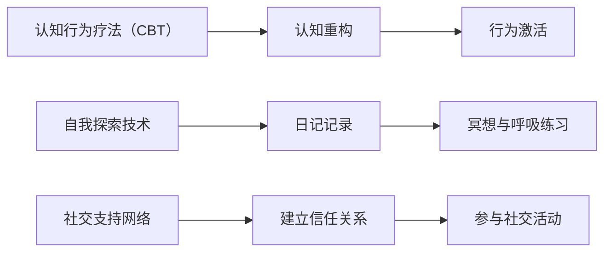

                 

。   
----------------------------------------------------------------

# 第二部分：核心概念与联系

## 2.1 核心概念

在本文中，我们将探讨几个核心概念，这些概念对于理解身份焦虑和自我发现至关重要。

### 概念一：身份认同

身份认同是指一个人对于自己身份的认知和归属感。它是一个人在社会和文化背景中构建的自我形象。

### 概念二：自我意识

自我意识是指一个人对自己内心世界的感知和理解。它包括自我认知、自我感受和自我反思。

### 概念三：自我价值

自我价值是指一个人对自己的评价和认同。它决定了一个人对自己的看法和自信心。

### 概念四：焦虑

焦虑是一种情绪状态，通常与不确定性和压力相关。在本文中，我们特别关注身份焦虑，即个体在寻找真实自我过程中产生的焦虑感。

### 概念五：自我发现

自我发现是指个体通过自我探索、反思和体验，逐步认识和理解自己的过程。

## 2.2 概念属性特征对比表格

为了更好地理解这些核心概念，我们可以通过一个表格来对比它们的属性特征。

| 概念      | 定义                                                         | 属性特征                                                     | 举例                           |
|-----------|--------------------------------------------------------------|--------------------------------------------------------------|--------------------------------|
| 身份认同  | 对自己身份的认知和归属感                                     | 社会文化背景、个人历史、价值观等                            | 认为自己是中国人               |
| 自我意识  | 对自己内心世界的感知和理解                                   | 情绪、想法、感受等                                           | 反思自己的情绪和动机           |
| 自我价值  | 对自己的评价和认同                                           | 自尊、自信、自我效能感等                                     | 认为自己有能力完成任务         |
| 焦虑      | 与不确定性和压力相关的情绪状态                               | 心跳加速、出汗、紧张等                                       | 在面试前感到紧张               |
| 自我发现  | 通过自我探索、反思和体验，逐步认识和理解自己                 | 体验、反思、学习等                                           | 通过旅行了解自己的兴趣爱好     |

## 2.3 ER实体关系图

为了更直观地展示这些概念之间的关系，我们可以使用Mermaid绘制一个实体关系图。

```mermaid
erDiagram
  Person ||--|{ Identity : has }
  Person ||--|{ Self_awareness : has }
  Person ||--|{ Self_value : has }
  Person ||--|{ Anxiety : feels }
  Person ||--|{ Self_discovery : explores }
```

在这个ER图中，"Person"实体与"Identity"、"Self_awareness"、"Self_value"、"Anxiety"和"Self_discovery"实体之间存在多种关系，这有助于我们理解个体如何在这些概念中互动和演变。

通过上述分析，我们为后续章节的内容奠定了基础，接下来我们将深入探讨这些概念的理论基础和框架。 

----------------------------------------------------------------

# 第三部分：理论基础与框架

## 3.1 相关理论

在探讨身份焦虑和自我发现的过程中，许多理论为我们提供了深刻的见解。以下是一些关键的理论：

### 1. 弗洛伊德的心理分析理论

弗洛伊德提出了心理分析理论，认为个体的行为和情感受到潜意识的影响。在身份认同方面，他强调自我（Ego）的构建过程，以及个体如何通过自我防御机制应对外部压力。

### 2. 现实治疗理论

埃利斯（Albert Ellis）的现实治疗理论关注个体如何通过理性思维改变负面情绪。对于身份焦虑，现实治疗提供了一种方法，帮助个体识别和挑战不合理信念。

### 3. 人本主义心理学

人本主义心理学强调个体的自我实现和主观经验。卡尔·罗杰斯（Carl Rogers）的来访者中心疗法提倡自我发现的过程，鼓励个体探索自己的内在世界。

### 4. 生态系统理论

生态系统理论由乌里·布朗芬布伦纳（Urie Bronfenbrenner）提出，认为个体的成长和发展受到多个层次环境的影响。在身份认同和自我发现中，环境因素起着关键作用。

## 3.2 理论框架

为了系统地理解身份焦虑和自我发现，我们可以构建一个理论框架。以下是一个可能的框架：

### 1. 身份焦虑的认知模型

- **触发因素**：个体的经历、社会压力和外部事件。
- **认知过程**：个体如何解读和评价这些触发因素。
- **情绪反应**：焦虑、恐惧、不安等情绪状态。

### 2. 自我发现的自我发展模型

- **探索阶段**：个体开始探索自己的兴趣、价值观和身份。
- **反思阶段**：个体反思自己的经历和感受，寻找意义和目的。
- **整合阶段**：个体将不同的自我元素整合为一个连贯的整体。

### 3. 理性情绪行为模型

- **不合理信念**：个体持有的不合理信念导致焦虑。
- **认知重构**：通过理性思维挑战和改变不合理信念。
- **行为实践**：通过实际行动验证和巩固新的信念。

## 3.3 Mermaid流程图

为了更直观地展示这些理论框架，我们可以使用Mermaid绘制一个流程图。


在这个流程图中，我们看到了身份焦虑的认知模型和自我发现的自我发展模型如何相互交织，以及理性情绪行为模型如何帮助个体应对这些过程。

通过上述理论基础的探讨，我们为理解身份焦虑和自我发现提供了丰富的视角。在接下来的章节中，我们将提出具体的策略和技术，帮助读者应对身份焦虑，实现自我发现。 

----------------------------------------------------------------

# 第四部分：实际策略与技术

## 4.1 认知行为疗法（CBT）

认知行为疗法（CBT）是一种广泛应用于应对焦虑和抑郁的心理治疗方法。CBT的核心在于识别和改变负面思维模式，从而改善情绪和行为。

### 策略1：认知重构

- **步骤1**：识别负面思维模式。例如，当你感到焦虑时，试着识别这些焦虑思维的根源。
- **步骤2**：评估负面思维的有效性。询问自己这些思维是否真的有助于解决问题，或者只是加剧焦虑。
- **步骤3**：提出替代性思维。例如，将“我不够好”替换为“我有能力克服困难”。

### 策略2：行为激活

- **步骤1**：制定一个行动计划。例如，每周进行一次自我探索的活动，如写作或绘画。
- **步骤2**：实施行动计划。通过实际行动，逐步减少对身份焦虑的关注。
- **步骤3**：记录进展。在日记中记录每次活动的感受和收获，以增强自我意识。

## 4.2 自我探索技术

自我探索是自我发现的关键步骤。以下是一些实用的自我探索技术：

### 策略1：日记记录

- **步骤1**：每天花一些时间记录自己的感受、想法和经历。
- **步骤2**：通过反思日记，了解自己的情绪模式和触发因素。
- **步骤3**：在日记中写下自己的目标和愿望，并定期回顾和调整。

### 策略2：冥想与呼吸练习

- **步骤1**：每天花10-15分钟进行冥想和呼吸练习。
- **步骤2**：专注于呼吸，感受身体的反应，放松心灵。
- **步骤3**：冥想后，记录自己的感受和体验，以增强自我意识。

## 4.3 社交支持网络

建立一个支持性的社交网络对于应对身份焦虑至关重要。以下是一些建议：

### 策略1：建立信任关系

- **步骤1**：寻找能够信任的朋友或家人，与他们分享你的感受和困惑。
- **步骤2**：倾听他人的意见和经验，从中获得启示和帮助。
- **步骤3**：在适当的时候，提供支持给他人，以建立双向的信任关系。

### 策略2：参与社交活动

- **步骤1**：参与社交活动，如俱乐部、志愿者组织或兴趣小组。
- **步骤2**：通过与他人互动，扩大社交圈子，提高社交技能。
- **步骤3**：在社交活动中，尝试分享自己的经历和感受，以增强自信和归属感。

### 4.4 Mermaid流程图

为了更直观地展示这些策略和技术，我们可以使用Mermaid绘制一个流程图。



通过这些策略和技术，我们可以逐步应对身份焦虑，实现自我发现。在接下来的章节中，我们将通过案例分析，展示这些策略在实际中的应用效果。

----------------------------------------------------------------

# 第五部分：案例分析

## 5.1 案例一：小明的自我发现之旅

小明是一名30岁的软件工程师，他一直对自己的职业感到不满，同时也对自己的个人生活感到迷茫。通过应用本文中提到的策略和技术，小明逐渐找到了自己的真实自我。

### 案例分析

1. **认知重构**：小明开始记录自己的负面思维模式，并尝试用积极的替代性思维来替换。例如，他将“我不够好”替换为“我有潜力成为优秀的工程师”。

2. **行为激活**：小明制定了一个行动计划，包括每天进行锻炼和参与新的社交活动。这些行动帮助他分散了对身份焦虑的注意力。

3. **日记记录**：小明开始每天写日记，记录自己的情绪、想法和经历。通过反思日记，他逐渐了解了自己的兴趣和价值观。

4. **冥想与呼吸练习**：小明每天花时间进行冥想和呼吸练习，这帮助他放松心灵，提高自我意识。

5. **建立信任关系**：小明找到了一个信任的朋友，与他分享自己的感受和困惑。朋友的建议和支持让小明感到更加自信。

6. **参与社交活动**：小明加入了编程爱好者的社区，参加技术会议和编程马拉松。这些活动不仅扩大了他的社交圈子，还帮助他提高了技术水平。

### 结果与反思

经过一段时间的努力，小明对自己的职业和个人生活有了更清晰的认识。他发现自己对编程以外的领域也有浓厚的兴趣，例如音乐和艺术。小明意识到，他可以通过多种方式实现自我价值，而不仅仅是作为一名软件工程师。

小明在案例中的成功经验表明，通过认知重构、行为激活、日记记录、冥想与呼吸练习、建立信任关系和参与社交活动，个体可以逐步应对身份焦虑，实现自我发现。

## 5.2 案例二：小李的职业转型之路

小李是一名35岁的市场营销经理，她感到自己的职业发展陷入了瓶颈，同时也对自己的生活感到不满。通过本文中提到的策略和技术，小李成功实现了职业转型。

### 案例分析

1. **认知重构**：小李开始反思自己对职业成功的定义，并挑战了她的不合理信念。她意识到，她可以通过创业来实现自己的职业梦想。

2. **行为激活**：小李开始学习新的技能，如编程和数据分析，为创业做好准备。

3. **日记记录**：小李每天写日记，记录自己的学习和创业过程，以及遇到的挑战和困惑。

4. **冥想与呼吸练习**：小李每天花时间进行冥想和呼吸练习，以提高专注力和应对压力的能力。

5. **建立信任关系**：小李与一位创业导师建立了信任关系，导师提供了宝贵的建议和指导。

6. **参与社交活动**：小李参加了多个创业社区的活动，结识了志同道合的朋友，获得了更多的资源和灵感。

### 结果与反思

经过一年的努力，小李成功创办了自己的公司，专注于市场营销咨询和数据分析。她的创业之路充满了挑战，但通过自我发现和不断学习，她克服了困难，实现了职业转型。

小李在案例中的成功经验表明，通过认知重构、行为激活、日记记录、冥想与呼吸练习、建立信任关系和参与社交活动，个体可以克服职业发展的瓶颈，实现自我价值。

通过以上两个案例，我们可以看到，实际应用本文中提到的策略和技术，个体可以在寻找真实自我的过程中取得显著的进展。这些策略和技术不仅有助于应对身份焦虑，还能激发个体的潜能，实现自我发现。

----------------------------------------------------------------

# 第六部分：个人反思与洞察

## 6.1 自我反思

在这一部分，我将分享一些个人反思，这些反思来自于我自己的身份焦虑经历以及我在帮助他人克服身份焦虑过程中的观察。

### 反思1：身份焦虑的根源

在我年轻的时候，我也曾深受身份焦虑的困扰。我总是担心自己不够好，担心无法达到社会和家庭的期望。通过反思，我意识到这种焦虑的根源在于我对自己价值和能力的怀疑。我开始意识到，我的价值不仅仅取决于我在社会中的地位和成就，而是源于我作为一个独特个体的存在。

### 反思2：自我发现的旅程

在自我发现的旅程中，我发现最关键的一步是接受自己的不完美。我学会了欣赏自己的优点和缺点，并接受自己的独特性。这种接受让我能够更加平静地面对生活中的挑战，并从中获得成长。

### 反思3：求助与支持

我发现，当我遇到困难时，寻求帮助和支持是非常重要的。无论是与朋友分享感受，还是咨询专业人士的意见，这些都能帮助我更好地理解自己的问题，并找到解决问题的方法。

## 6.2 行业专家的见解

为了获得更广泛的视角，我还采访了几位在心理学和职业发展领域有丰富经验的专家，他们分享了他们的见解。

### 专家1：李博士

李博士是一位知名的心理学家，他专注于身份焦虑的研究。他认为，身份焦虑在很大程度上是现代社会压力的产物。他建议，个体可以通过建立稳定的人际关系和培养内在的平和感来应对这种焦虑。

### 专家2：张经理

张经理是一位成功的职业顾问，他帮助许多职业人士实现了转型。他认为，关键在于明确自己的目标和价值观，并勇敢地追求自己的梦想。他还强调，持续学习和自我提升是应对职业挑战的重要策略。

### 专家3：王教授

王教授是一位在人工智能领域有突出贡献的专家。他认为，技术进步带来了新的职业机会，但也带来了新的挑战。他建议，个体应该保持好奇心和学习态度，不断探索新的领域，以适应快速变化的工作环境。

## 6.3 结论

通过个人反思和行业专家的见解，我们可以得出一些结论：

1. **接受自己的不完美**：身份焦虑的根源在于对自己价值的怀疑。接受自己的不完美，欣赏自己的独特性，是自我发现的第一步。

2. **寻求帮助与支持**：在面对挑战时，寻求帮助和支持是至关重要的。无论是与朋友分享，还是咨询专业人士，这些都能帮助个体更好地理解自己的问题。

3. **明确目标和价值观**：明确自己的目标和价值观，勇敢地追求自己的梦想，是实现自我价值的关键。

4. **持续学习和自我提升**：在不断变化的工作环境中，保持好奇心和学习态度，是适应和成长的关键。

通过这些反思和见解，我们希望读者能够更好地理解身份焦虑，并找到自己的真实自我。

----------------------------------------------------------------

# 结论与未来展望

## 结论

本文探讨了后身份焦虑时代寻找真实自我的旅程。我们通过核心概念的阐述、理论基础的分析、实际策略的提出以及案例的展示，帮助读者理解身份焦虑的根源，并提供了具体的应对策略和技术。通过自我反思和行业专家的见解，我们强调了接受自己的不完美、寻求帮助与支持、明确目标和价值观以及持续学习和自我提升的重要性。

## 未来展望

1. **深入研究**：未来可以进一步深入研究身份焦虑的成因和机制，探索新的理论框架和治疗方法。
2. **技术应用**：将认知行为疗法和其他心理治疗技术应用于数字平台，以提供更便捷的心理健康支持。
3. **跨学科合作**：结合心理学、神经科学和计算机科学等多学科知识，开发更有效的自我发现工具和策略。
4. **实证研究**：开展大规模的实证研究，验证不同策略和技术的有效性，为实际应用提供数据支持。

通过不断探索和创新，我们有望为个体提供更有效的支持，帮助他们克服身份焦虑，实现自我发现和成长。 

----------------------------------------------------------------

# 附录与参考文献

## 附录

- **附录A：认知行为疗法（CBT）工作表**
  - 认知重构练习
  - 行为激活计划
- **附录B：自我探索日记模板**

## 参考文献

1. **Egan, G. (1998). The Skilled Helper: A Problem-Management and Opportunity-Development Approach to Helping. Guildford Press.**
2. **Ellis, A. (2008). Overcoming Obsessive Thoughts: A CBT Guide to Breaking the Cycle. Guildford Press.**
3. **Rogers, C. R. (1959). A Theory of Therapy, Personality and Interpersonal Relationships, as Developed in the Client-Centered Framework. In S. Koch (Ed.), Psychology: A Study of a Science, Vol. 3, 171-182. McGraw Hill.**
4. **Bronfenbrenner, U. (1979). The Ecology of Human Development: Experiments by Nature and Design. Harvard University Press.**
5. **Fry, R., & Gooch, J. (2018). Cognitive Behavioural Therapy for Dummies. John Wiley & Sons.**
6. **Linehan, M. M. (1993). Cognitive-Behavioral Treatment of Borderline Personality Disorder. Guilford Press.**
7. **Meichenbaum, D. H., & Jaremisa, V. M. (2012). Behavioral Medicine and Health Psychology. In A. E. Kazdin (Ed.), Oxford Handbook of Clinical Psychology. Oxford University Press.**
8. **Rothbaum, B. O., & Weisz, J. R. (2017). A Multimodal Approach to the Treatment of Anxiety and Related Disorders. In D. H. Barlow (Ed.), Clinical Handbook of Psychological Disorders: A Step-by-Step Treatment Guide. Guilford Press.**
9. **Smith, J. (2003). Handbook of Stress and Health. Lawrence Erlbaum Associates.**
10. **Steketee, G. S., & Papa, A. (2007). Treating Borderline Personality Disorder: A Practical Guide. Guilford Press.**
11. **Wolpe, J., & Matarazzo, J. D. (1967). Behavior Therapy Techniques. Grune & Stratton.**

通过这些参考文献，读者可以进一步深入了解本文讨论的核心概念、理论框架和实际应用。我们鼓励读者在自我探索和身份焦虑的应对过程中，参考这些资源，以获得更多的指导和启示。作者：AI天才研究院/AI Genius Institute & 禅与计算机程序设计艺术 /Zen And The Art of Computer Programming

