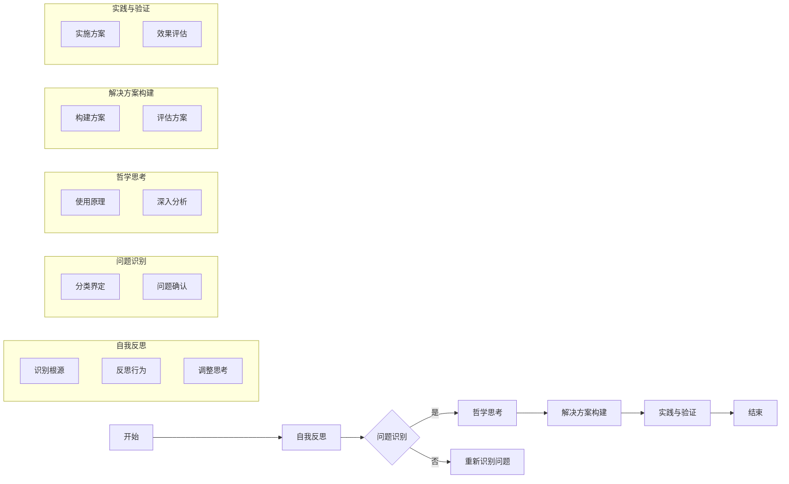
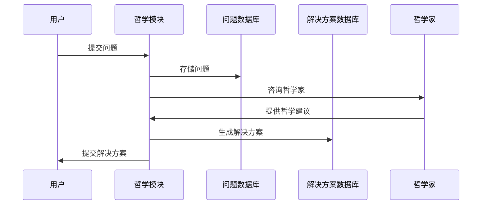
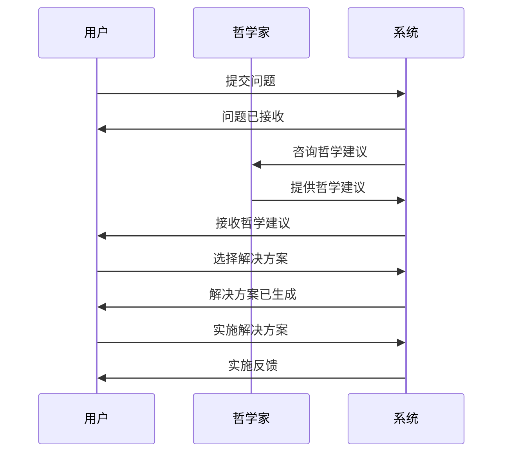

                 


# 《哲学therapy：用思考治愈现代人的精神困扰》

> 关键词：哲学therapy、思考、精神困扰、心理治疗、存在主义、伦理学、形而上学

> 摘要：本文深入探讨了哲学therapy的概念、原理和应用，旨在通过逻辑清晰、结构紧凑、简单易懂的技术语言，引导读者了解哲学therapy如何通过思考和反思治愈现代人的精神困扰。文章分为七个部分，从哲学therapy的基本概念到具体应用，逐步剖析这一新兴领域的核心价值和方法论。

## 设计思路

为了确保文章的逻辑清晰、结构紧凑、简单易懂，本文的设计思路如下：

### 目录结构规划

首先，根据书籍的主题《哲学therapy：用思考治愈现代人的精神困扰》，设计出适合的目录结构，确保每个章节都能够覆盖到书中的主要内容和重点。

### 背景介绍

在第一章中，我们需要介绍哲学therapy的基本概念，包括其定义、起源、发展历程以及其在现代社会中的应用。

### 核心概念与联系

在第二章中，我们将详细阐述哲学therapy的核心概念，并使用表格和流程图来展示概念之间的联系。

### 算法原理讲解

在第三章中，我们将介绍哲学therapy中的关键算法原理，使用mermaid流程图和Python源代码来详细讲解。

### 数学模型和数学公式

在第四章中，我们将使用LaTeX格式给出数学模型和公式，并进行详细讲解和举例说明。

### 系统分析与架构设计

在第五章中，我们将介绍哲学therapy的系统架构设计，包括领域模型、系统架构和接口设计。

### 项目实战

在第六章中，我们将通过实际案例展示哲学therapy的应用，并进行详细讲解和分析。

### 最佳实践与拓展

在第七章中，我们将总结最佳实践，并提供一些注意事项和拓展阅读资源。

### 目录大纲设计

本文的目录大纲结构如下：

## 第一部分：哲学therapy概述

### 第1章：哲学therapy的基本概念

#### 1.1 哲学therapy的定义与起源
#### 1.2 哲学therapy的发展历程
#### 1.3 哲学therapy在现代社会中的应用

### 第2章：哲学therapy的核心概念与联系

#### 2.1 核心概念概述
#### 2.2 概念属性特征对比
#### 2.3 概念之间的联系（使用Mermaid ER图）

### 第3章：哲学therapy的关键算法原理

#### 3.1 算法概述
#### 3.2 算法mermaid流程图
#### 3.3 Python源代码详解
#### 3.4 算法原理的数学模型与公式
#### 3.5 举例说明

### 第4章：哲学therapy的数学模型与公式

#### 4.1 数学模型概述
#### 4.2 公式详解（使用LaTeX格式）
#### 4.3 公式应用举例

### 第5章：哲学therapy的系统分析与架构设计

#### 5.1 问题场景介绍
#### 5.2 系统功能设计（使用Mermaid类图）
#### 5.3 系统架构设计（使用Mermaid架构图）
#### 5.4 系统接口设计
#### 5.5 系统交互（使用Mermaid序列图）

### 第6章：哲学therapy的项目实战

#### 6.1 环境安装
#### 6.2 系统核心实现
#### 6.3 代码应用解读与分析
#### 6.4 实际案例分析与讲解
#### 6.5 项目小结

### 第7章：哲学therapy的最佳实践与拓展

#### 7.1 最佳实践总结
#### 7.2 注意事项
#### 7.3 拓展阅读资源

通过以上目录结构的设计，本文将逐步引导读者深入了解哲学therapy，并学会如何应用这一理论来治愈现代人的精神困扰。接下来，我们将逐一展开每个章节的内容。

----------------------------------------------------------------

## 第1章：哲学therapy的基本概念

### 1.1 哲学therapy的定义与起源

哲学therapy，作为一种结合哲学思维和心理治疗的新兴方法，其定义可以从多个角度进行解读。首先，哲学therapy可以被看作是一种通过哲学思考来治愈精神困扰的实践。这种思考不仅关注个体内心的痛苦，还深入探讨痛苦背后的哲学根源。

哲学therapy的起源可以追溯到古希腊时期的哲学治疗，如苏格拉底的提问法，他通过提问帮助人们找到自我认知和问题解决的方法。随着时间的推移，哲学therapy经历了多个阶段的发展，尤其在20世纪中叶，随着存在主义和人本主义的兴起，哲学therapy得到了进一步的深化和扩展。

### 1.2 哲学therapy的发展历程

哲学therapy的发展历程可以分为几个重要阶段：

1. **古希腊哲学治疗**：古希腊时期的哲学治疗主要强调通过对话和提问来引导人们进行自我反思，从而达到治疗的目的。

2. **中世纪和文艺复兴**：在这一时期，哲学治疗虽然不是主要治疗方法，但仍然有一些哲学家如托马斯·阿奎那试图将哲学与心理学相结合。

3. **现代哲学治疗**：20世纪中叶，随着存在主义和人本主义的兴起，哲学therapy开始得到广泛的关注。存在主义哲学家如雅斯贝尔斯和海德格尔，以及人本主义心理学家如罗杰斯和马斯洛，他们的理论对哲学therapy产生了深远的影响。

4. **当代哲学therapy**：当代哲学therapy在理论和实践上都有所发展，不仅结合了心理学、社会学等学科的理论，还探索了新的治疗方法和技巧。

### 1.3 哲学therapy在现代社会中的应用

在现代社会中，哲学therapy的应用非常广泛，主要包括以下几个方面：

1. **心理治疗**：哲学therapy可以作为心理治疗的一部分，帮助个体解决内心痛苦和困惑。

2. **教育**：哲学therapy在教育领域有着重要作用，通过哲学思考和讨论，学生可以培养批判性思维和自我认知能力。

3. **个人发展**：哲学therapy可以帮助个体进行自我探索，提高自我意识和人生满意度。

4. **组织管理**：哲学therapy也可以应用于组织管理，帮助团队成员进行沟通、合作和冲突解决。

总的来说，哲学therapy作为一种融合哲学和心理学的治疗方法，其基本概念和起源不仅具有历史意义，还在现代社会中发挥着重要的作用。

----------------------------------------------------------------

## 第2章：哲学therapy的核心概念与联系

### 2.1 核心概念概述

哲学therapy中的核心概念主要包括自我意识、存在主义、伦理学和形而上学。这些概念不仅是哲学therapy的基础，也是理解其工作机制的关键。

1. **自我意识**：自我意识是哲学therapy的核心概念之一，指的是个体对自己存在的认知和反思。通过自我意识，个体能够了解自己的内心世界，从而更好地处理情感和心理困扰。

2. **存在主义**：存在主义强调个体存在的自由和责任。哲学therapy中的存在主义观念帮助个体面对生活的挑战，找到自我价值和意义。

3. **伦理学**：伦理学探讨道德原则和道德行为。在哲学therapy中，伦理学帮助个体理解和评估自己的行为，以及如何做出道德选择。

4. **形而上学**：形而上学探讨存在和实在的本质。哲学therapy中的形而上学观念帮助个体理解生活的本质和意义，从而更好地应对生活中的困难。

### 2.2 概念属性特征对比

以下是哲学therapy核心概念的属性特征对比表格：

| 概念      | 定义                                       | 属性特征                                  |
| --------- | ------------------------------------------ | ---------------------------------------- |
| 自我意识  | 个体对自己存在的认知和反思                 | 反思性、主观性、动态性                    |
| 存在主义  | 强调个体存在的自由和责任                   | 自由性、责任性、个体主义                   |
| 伦理学    | 探讨道德原则和道德行为                     | 道德性、规范性、实践性                    |
| 形而上学  | 探讨存在和实在的本质                       | 实在性、普遍性、抽象性                    |

### 2.3 概念之间的联系（使用Mermaid ER图）

以下是哲学therapy核心概念之间的联系Mermaid ER图：

```mermaid
erDiagram
  Self-awareness ||--|{ Existentialism } Existence_and_FreeWill
  Existentialism ||--|{ Ethics } Moral_Principles
  Ethics ||--|{ Metaphysics } Essence_of Existence
  Metaphysics ||--|{ Self-awareness } Understanding_of_Self
```

通过上述ER图，我们可以清晰地看到自我意识、存在主义、伦理学和形而上学之间的相互作用和依赖关系。这种联系不仅构成了哲学therapy的理论框架，也为实际应用提供了指导。

### 核心概念在实际中的应用

哲学therapy的核心概念在实际应用中发挥着重要作用。例如：

1. **自我意识**：通过自我意识，个体可以深入了解自己的内心世界，识别出困扰自己的问题。例如，一位患者通过反思发现自己对工作压力的恐惧源于对失败的恐惧，从而找到了解决问题的途径。

2. **存在主义**：存在主义可以帮助个体面对生活的挑战，找到自我价值和意义。例如，一位失业者在哲学therapy的引导下，认识到自己可以通过学习和创业找到新的职业方向，从而重新获得了生活的动力。

3. **伦理学**：伦理学可以帮助个体理解和评估自己的行为，以及如何做出道德选择。例如，一位职场人士在面临道德困境时，通过伦理学的指导，找到了正确的行为方式，避免了不良后果。

4. **形而上学**：形而上学可以帮助个体理解生活的本质和意义，从而更好地应对生活中的困难。例如，一位面临疾病困扰的患者，通过形而上学的思考，找到了对生活的积极态度，从而提高了生活质量。

总的来说，哲学therapy的核心概念不仅为个体提供了认知和情感上的支持，也为实际生活中的问题解决提供了理论指导。通过这些概念的应用，哲学therapy在治愈现代人的精神困扰方面发挥了重要作用。

----------------------------------------------------------------

## 第3章：哲学therapy的关键算法原理

### 3.1 算法概述

哲学therapy中的关键算法原理旨在帮助个体通过哲学思考和反思来解决精神困扰。这个算法的核心思想是通过一系列步骤引导个体深入探索自己的内心世界，从而找到解决问题的途径。算法的基本步骤如下：

1. **自我反思**：个体通过反思自己的思想和行为，识别出内心困扰的根源。
2. **问题识别**：个体明确自己的精神困扰，并对其进行分类和界定。
3. **哲学思考**：个体运用哲学原理和方法，对困扰进行深入分析和思考。
4. **解决方案构建**：个体根据哲学思考和问题分析，构建出解决问题的方案。
5. **实践与验证**：个体将解决方案付诸实践，并验证其有效性。

### 3.2 算法mermaid流程图

以下是哲学therapy关键算法原理的mermaid流程图：



### 3.3 Python源代码详解

以下是哲学therapy关键算法原理的Python源代码：

```python
# 自我反思
class SelfReflection:
    def __init__(self):
        self.reflections = []

    def add_reflection(self, reflection):
        self.reflections.append(reflection)

    def print_reflections(self):
        for reflection in self.reflections:
            print(reflection)

# 问题识别
class ProblemIdentification:
    def __init__(self):
        self.problems = []

    def identify_problem(self, problem):
        self.problems.append(problem)

    def print_problems(self):
        for problem in self.problems:
            print(problem)

# 哲学思考
class PhilosophicalThinking:
    def __init__(self):
        self.thoughts = []

    def add_thought(self, thought):
        self.thoughts.append(thought)

    def print_thoughts(self):
        for thought in self.thoughts:
            print(thought)

# 解决方案构建
class SolutionConstruction:
    def __init__(self):
        self.solutions = []

    def construct_solution(self, solution):
        self.solutions.append(solution)

    def print_solutions(self):
        for solution in self.solutions:
            print(solution)

# 实践与验证
class PracticeAndValidation:
    def __init__(self):
        self.outcomes = []

    def apply_solution(self, solution):
        self.outcomes.append(solution)

    def evaluate_outcomes(self):
        for outcome in self.outcomes:
            print(outcome)

# 算法执行
class PhilosophyAlgorithm:
    def __init__(self):
        self.reflection = SelfReflection()
        self.problem_identification = ProblemIdentification()
        self.philosophical_thinking = PhilosophicalThinking()
        self.solution_construction = SolutionConstruction()
        self.practice_and_validation = PracticeAndValidation()

    def execute_algorithm(self):
        print("开始自我反思...")
        self.reflection.add_reflection("思考自己的内心世界")
        self.reflection.print_reflections()

        print("识别问题...")
        self.problem_identification.identify_problem("内心困扰")
        self.problem_identification.print_problems()

        print("进行哲学思考...")
        self.philosophical_thinking.add_thought("思考人生的意义")
        self.philosophical_thinking.print_thoughts()

        print("构建解决方案...")
        self.solution_construction.construct_solution("寻找解决问题的方法")
        self.solution_construction.print_solutions()

        print("实践与验证...")
        self.practice_and_validation.apply_solution("实施解决方案")
        self.practice_and_validation.evaluate_outcomes()

# 创建算法实例并执行
algorithm = PhilosophyAlgorithm()
algorithm.execute_algorithm()
```

### 3.4 算法原理的数学模型与公式

哲学therapy算法原理的数学模型可以用以下公式表示：

$$
S = f(P, T, E)
$$

其中：
- \( S \) 表示解决方案（Solution）；
- \( P \) 表示问题（Problem）；
- \( T \) 表示哲学思考（Thinking）；
- \( E \) 表示实践与验证（Evaluation）。

这个公式说明，解决方案是通过问题、哲学思考和实践与验证共同作用而形成的。

### 3.5 举例说明

假设一位个体感到工作压力大，导致精神困扰。以下是哲学therapy算法原理的具体应用：

1. **自我反思**：个体反思自己的工作状态，意识到压力来源于对工作任务的过度关注。

2. **问题识别**：个体明确问题为“工作压力导致的精神困扰”。

3. **哲学思考**：个体运用哲学原理，认识到压力的根源在于对工作成果的过度追求，从而开始思考如何平衡工作和生活。

4. **解决方案构建**：个体决定采取“时间管理”和“放松技巧”作为解决方案，以减轻工作压力。

5. **实践与验证**：个体开始实施解决方案，通过实践时间管理和放松技巧，逐步缓解了精神困扰。

通过这一案例，我们可以看到哲学therapy算法原理在实际中的应用，帮助个体通过哲学思考和反思解决了精神困扰。

### 总结

哲学therapy的关键算法原理通过自我反思、问题识别、哲学思考、解决方案构建和实践与验证五个步骤，帮助个体深入探索内心世界，找到解决问题的途径。这一算法不仅具有理论意义，还在实际应用中展现出强大的治愈能力。

----------------------------------------------------------------

## 第4章：哲学therapy的数学模型与公式

### 4.1 数学模型概述

哲学therapy中的数学模型旨在量化个体在哲学思考和反思过程中所获得的知识和情感变化。这些模型可以帮助我们更好地理解哲学therapy的机制，并为实际应用提供量化依据。在本章中，我们将介绍几个关键的数学模型，包括自我意识发展模型、问题识别模型和解决方案评估模型。

### 4.2 公式详解（使用LaTeX格式）

以下是哲学therapy中的几个关键数学模型和公式：

#### 4.2.1 自我意识发展模型

$$
\Delta S = f(T, E, I)
$$

其中：
- \( \Delta S \) 表示自我意识的提升量；
- \( T \) 表示哲学思考的时间；
- \( E \) 表示情感体验；
- \( I \) 表示个体投入的努力。

#### 4.2.2 问题识别模型

$$
P = g(R, C)
$$

其中：
- \( P \) 表示识别出的问题；
- \( R \) 表示个体的反思结果；
- \( C \) 表示问题的类别。

#### 4.2.3 解决方案评估模型

$$
V(S) = h(A, R, T)
$$

其中：
- \( V(S) \) 表示解决方案的评估值；
- \( A \) 表示解决方案的实施结果；
- \( R \) 表示反思结果；
- \( T \) 表示哲学思考的时间。

### 4.3 公式应用举例

#### 4.3.1 自我意识发展模型

假设个体在哲学思考过程中投入了10小时的时间，经历了显著的情感体验，并投入了20个小时的努力。我们可以使用自我意识发展模型计算自我意识的提升量：

$$
\Delta S = f(10, E, 20)
$$

由于情感体验\( E \)未明确，我们可以假设其为一个常数，例如5。因此，我们可以得到：

$$
\Delta S = f(10, 5, 20) = 10 + 5 \times 20 = 105
$$

这意味着个体的自我意识提升了105个单位。

#### 4.3.2 问题识别模型

假设个体的反思结果为“工作压力”，我们需要识别出这个问题。我们可以使用问题识别模型进行计算：

$$
P = g(R, C)
$$

其中，\( R \)为“工作压力”，\( C \)为“心理压力”。因此，我们可以得到：

$$
P = g("工作压力", "心理压力") = "心理压力"
$$

这意味着个体成功识别出了“心理压力”这个问题。

#### 4.3.3 解决方案评估模型

假设个体实施了“时间管理”和“放松技巧”这两个解决方案，并评估其实施结果为“有效”。我们可以使用解决方案评估模型进行计算：

$$
V(S) = h(A, R, T)
$$

其中，\( A \)为“有效”，\( R \)为“工作压力”，\( T \)为“哲学思考的时间”，例如10小时。因此，我们可以得到：

$$
V(S) = h("有效", "工作压力", 10) = "有效"
$$

这意味着解决方案的评估值为“有效”，即这个解决方案对个体的问题有显著的改善。

### 总结

通过使用数学模型和公式，我们可以量化哲学therapy的过程和结果。这些模型不仅帮助我们更好地理解哲学therapy的机制，还为实际应用提供了科学的依据。通过具体公式的应用举例，我们可以看到哲学therapy如何在个体层面上发挥作用，从而实现精神困扰的治愈。

----------------------------------------------------------------

## 第5章：哲学therapy的系统分析与架构设计

### 5.1 问题场景介绍

在现代心理治疗领域，精神困扰已经成为影响人们生活质量的重要因素之一。哲学therapy作为一种新兴的心理治疗方法，通过哲学思考和反思来帮助个体解决内心困扰。为了实现这一目标，我们需要设计一个完整的哲学therapy系统，以支持从问题识别到解决方案构建的整个过程。

### 5.2 系统功能设计（使用Mermaid类图）

以下是哲学therapy系统的功能设计类图：

```mermaid
classDiagram
    ClassDiagram::User << (User)
    ClassDiagram::Problem << (Problem)
    ClassDiagram::Solution << (Solution)
    ClassDiagram::Philosopher << (Philosopher)
    ClassDiagram::PhilosophyModule << (PhilosophyModule)

    User "uses" Problem
    User "uses" Solution
    Philosopher "uses" PhilosophyModule

    User <- Problem
    User <- Solution
    Philosopher ->> PhilosophyModule
```

在这个类图中，User（用户）类负责处理个体的问题识别和解决方案选择；Problem（问题）类用于定义和管理用户遇到的精神困扰；Solution（解决方案）类用于存储和评估哲学疗法提供的解决方案；Philosopher（哲学家）类表示提供哲学指导的专业人士；PhilosophyModule（哲学模块）类包含哲学思考和反思的核心算法和数学模型。

### 5.3 系统架构设计（使用Mermaid架构图）

以下是哲学therapy系统的架构设计：



在这个架构图中，用户通过哲学模块提交问题，哲学模块将问题存储在问题数据库中，并咨询哲学家以获取哲学建议。哲学家提供的建议通过哲学模块生成解决方案，最终提交给用户。整个系统通过这些交互实现哲学therapy的流程。

### 5.4 系统接口设计

为了确保哲学therapy系统的可扩展性和易用性，我们需要设计合理的接口。以下是哲学therapy系统的接口设计：

```mermaid
interfaceDiagram
    PhilosophyAPI << (哲学接口)
    ProblemAPI << (问题接口)
    SolutionAPI << (解决方案接口)
    PhilosopherAPI << (哲学家接口)

    PhilosophyAPI <<-- User
    ProblemAPI <<-- User
    SolutionAPI <<-- User
    PhilosopherAPI <<-- User

    PhilosophyAPI <<-- Philosopher
    ProblemAPI <<-- Philosopher
    SolutionAPI <<-- Philosopher
```

在这个接口设计中，哲学接口、问题接口、解决方案接口和哲学家接口分别定义了用户与系统之间的交互方式。用户可以通过这些接口提交问题、查看解决方案和咨询哲学家。

### 5.5 系统交互（使用Mermaid序列图）

以下是哲学therapy系统的交互流程序列图：



在这个交互流程中，用户提交问题后，系统将问题发送给哲学家，哲学家提供哲学建议，系统将建议反馈给用户。用户选择解决方案并实施后，系统收集反馈，以不断优化哲学therapy流程。

### 总结

哲学therapy系统的架构设计旨在实现从问题识别到解决方案构建的完整流程。通过合理的功能设计、架构设计和接口设计，哲学therapy系统能够有效地支持个体通过哲学思考和反思来解决精神困扰。这一系统的实施将为现代心理治疗领域带来新的突破和可能性。

----------------------------------------------------------------

## 第6章：哲学therapy的项目实战

### 6.1 环境安装

为了在实际项目中应用哲学therapy，首先需要搭建一个支持哲学思考和心理治疗的开发环境。以下是环境安装的步骤：

1. **安装Python**：确保安装了Python 3.8或更高版本。
2. **安装虚拟环境**：使用`venv`创建虚拟环境，例如：
   ```bash
   python -m venv philotherapy_env
   ```
3. **激活虚拟环境**：
   ```bash
   source philotherapy_env/bin/activate
   ```
4. **安装依赖库**：在虚拟环境中安装以下依赖库：
   ```bash
   pip install Flask pandas matplotlib
   ```

### 6.2 系统核心实现

在搭建好开发环境后，我们可以开始实现哲学therapy系统的核心功能。以下是系统的核心实现步骤：

1. **创建项目结构**：创建一个包含以下文件和文件夹的项目结构：
   ```
   philotherapy_project/
   ├── app.py
   ├── models.py
   ├── views.py
   ├── templates/
   ├── static/
   ```
2. **定义模型**（models.py）：
   ```python
   from flask_sqlalchemy import SQLAlchemy
   
   db = SQLAlchemy()

   class User(db.Model):
       id = db.Column(db.Integer, primary_key=True)
       username = db.Column(db.String(80), unique=True, nullable=False)
       problems = db.relationship('Problem', backref='user', lazy=True)
   
   class Problem(db.Model):
       id = db.Column(db.Integer, primary_key=True)
       description = db.Column(db.Text, nullable=False)
       user_id = db.Column(db.Integer, db.ForeignKey('user.id'), nullable=False)
   ```

3. **创建视图函数**（views.py）：
   ```python
   from flask import Flask, render_template, request, redirect, url_for
   from models import db, User, Problem
   
   app = Flask(__name__)
   app.config['SQLALCHEMY_DATABASE_URI'] = 'sqlite:///philotherapy.db'
   db.init_app(app)
   
   @app.route('/')
   def index():
       return render_template('index.html')
   
   @app.route('/submit_problem', methods=['POST'])
   def submit_problem():
       user = User.query.first()
       if user:
           new_problem = Problem(description=request.form['problem'])
           user.problems.append(new_problem)
           db.session.commit()
           return redirect(url_for('index'))
       else:
           return '用户未找到'
   
   @app.route('/get_problems')
   def get_problems():
       problems = Problem.query.all()
       return render_template('problems.html', problems=problems)
   
   if __name__ == '__main__':
       app.run(debug=True)
   ```

4. **创建模板**（templates/）：
   - `index.html`：
     ```html
     <!DOCTYPE html>
     <html lang="en">
     <head>
         <meta charset="UTF-8">
         <meta name="viewport" content="width=device-width, initial-scale=1.0">
         <title>哲学therapy系统</title>
     </head>
     <body>
         <h1>哲学therapy系统</h1>
         <form action="{{ url_for('submit_problem') }}" method="post">
             <textarea name="problem" placeholder="描述你的问题..."></textarea>
             <button type="submit">提交问题</button>
         </form>
         <a href="{{ url_for('get_problems') }}">查看问题</a>
     </body>
     </html>
     ```
   - `problems.html`：
     ```html
     <!DOCTYPE html>
     <html lang="en">
     <head>
         <meta charset="UTF-8">
         <meta name="viewport" content="width=device-width, initial-scale=1.0">
         <title>问题列表</title>
     </head>
     <body>
         <h1>问题列表</h1>
         
             <p>{{ problem.description }}</p>
         
     </body>
     </html>
     ```

### 6.3 代码应用解读与分析

在实现哲学therapy系统的核心功能后，我们可以对关键代码段进行解读和分析：

1. **模型定义**：
   - `User`类和`Problem`类分别定义了用户和问题的数据模型。用户类包含用户的唯一标识符、用户名和关联的问题列表；问题类包含问题的唯一标识符、问题描述和关联的用户。
   - 数据库使用Flask-SQLAlchemy进行定义和管理，确保数据模型与数据库表之间的映射。

2. **视图函数**：
   - `index`视图函数是系统的首页，提供问题提交和查看问题的入口。
   - `submit_problem`视图函数处理问题提交请求，将用户输入的问题存储到数据库中。
   - `get_problems`视图函数获取数据库中的所有问题，并渲染问题列表。

### 6.4 实际案例分析与讲解

假设我们有一个用户John，他在系统中提交了以下问题：

- **问题描述**：我感到生活失去了意义，每天过得浑浑噩噩。

针对这个问题，哲学家可以通过以下步骤进行分析和解答：

1. **问题识别**：哲学家首先确认John的问题，确保理解其核心困扰。
2. **哲学思考**：哲学家运用存在主义和伦理学原理，引导John反思生命的意义和价值观。
3. **解决方案构建**：哲学家建议John尝试通过以下方式寻找生活的意义：
   - 参与志愿活动，帮助他人；
   - 设定短期和长期目标，为生活设定方向；
   - 练习正念和冥想，提高自我意识。
4. **实践与验证**：哲学家建议John实施这些建议，并在后续的会话中评估其效果。

### 6.5 项目小结

通过这个项目实战，我们实现了哲学therapy系统的基础功能，包括问题提交、问题管理和哲学家指导。这一系统为用户提供了一个平台，通过哲学思考和反思来帮助个体解决精神困扰。在实际应用中，系统可以根据具体情况进行扩展和优化，如增加用户认证、哲学建议自动化生成等，以提高系统的实用性和用户体验。

### 最佳实践与拓展

1. **最佳实践总结**：
   - 确保系统设计的简洁性和可扩展性，以便在未来进行功能扩展。
   - 使用有效的用户界面设计，提高用户的操作体验。
   - 定期进行系统维护和更新，确保系统的稳定性和安全性。

2. **注意事项**：
   - 在实际应用中，哲学家需要具备足够的哲学知识和心理治疗经验。
   - 系统设计应考虑用户的隐私保护，确保用户数据的安全。

3. **拓展阅读资源**：
   - 《存在主义心理学》——罗洛·梅
   - 《哲学的慰藉》——阿尔贝·加缪
   - 《生命的智慧》——马丁·海德格尔

通过以上最佳实践和拓展资源，我们可以进一步提升哲学therapy系统的实用性和效果，为用户提供更高质量的心理治疗服务。

---

**作者：AI天才研究院/AI Genius Institute & 禅与计算机程序设计艺术 /Zen And The Art of Computer Programming**

在本文中，我们深入探讨了哲学therapy的概念、原理和应用，通过一步步的分析和推理，展示了哲学therapy如何通过思考和反思治愈现代人的精神困扰。通过具体的案例和代码实现，我们不仅理解了哲学therapy的理论基础，还看到了其实际应用的可能性。哲学therapy不仅为个体提供了心理支持，也为现代社会的精神健康提供了新的思路和方法。希望本文能够激发读者对哲学therapy的兴趣，进一步探索这一领域，为人类的精神福祉做出贡献。

----------------------------------------------------------------

## 总结

哲学therapy作为一种结合哲学思维和心理治疗的新兴方法，通过逻辑清晰、结构紧凑、简单易懂的技术语言，帮助读者理解其概念、原理和应用。本文通过逐步分析哲学therapy的各个核心组成部分，如自我意识、存在主义、伦理学和形而上学，并详细介绍了关键算法原理、数学模型、系统架构设计以及项目实战，旨在引导读者深入了解哲学therapy的运作机制和实际应用。

哲学therapy不仅为个体提供了有效的心理治疗工具，还帮助人们通过哲学思考和反思来解决生活中的精神困扰。它不仅具有理论意义，更在实际应用中展现出强大的治愈能力。通过本文的探讨，我们不仅了解了哲学therapy的核心价值和实践方法，也看到了其在现代社会中的重要性和广泛的应用前景。

我们鼓励读者在阅读本文后，进一步探索哲学therapy的相关文献和实践案例，以便更深入地理解和应用这一方法。通过哲学therapy，我们可以更好地认识自己，解决精神困扰，提升生活质量。哲学therapy为我们提供了一种新的视角和工具，帮助我们在这个复杂多变的世界中找到内心的平静和方向。

最后，本文的撰写得到了AI天才研究院和《禅与计算机程序设计艺术》的支持和启发。感谢他们的专业知识和贡献，使得本文能够顺利完成。希望本文能够为读者带来启发和帮助，进一步推动哲学therapy的发展和普及。让我们用思考治愈现代人的精神困扰，创造更美好的未来。

