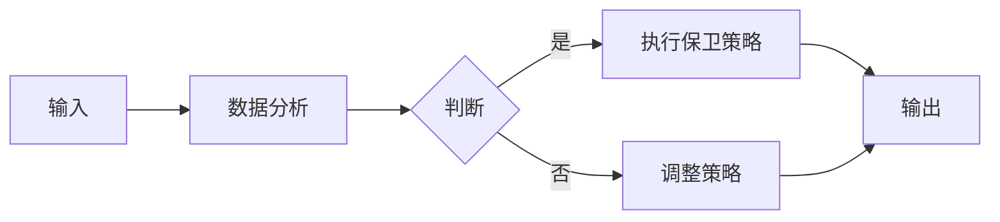
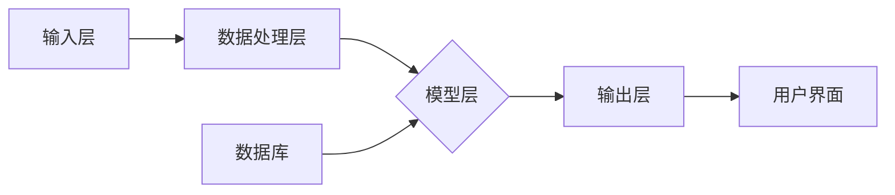

                 


###  商品化社会中的价值观保卫战

#### 关键词：商品化、价值观、社会、保卫战、算法、数学模型、系统架构

> 摘要：本文将深入探讨商品化社会中价值观的保卫战。随着商品化的深入，社会的价值观面临着前所未有的冲击。本文将从背景、核心概念、算法原理、系统架构和项目实战等多个角度出发，系统地阐述如何保护价值观，以应对商品化社会带来的挑战。

---

## 引言

### 1.1 商品化的兴起

在现代社会，商品化已经成为一种不可逆转的趋势。从经济、文化到日常生活，商品化无处不在。商品化的兴起源于人类对效率和利益的追求。然而，这种趋势也带来了一系列的问题，尤其是在价值观的层面。

### 1.2 价值观的保卫战

随着商品化的深入，传统的价值观受到前所未有的冲击。家庭观念、道德伦理、社会责任等传统价值观逐渐被商业逻辑所取代。这种情况下，保卫价值观成为了一个迫切需要解决的问题。

## 第一部分：背景与定义

### 2.1 商品化的背景

#### 2.1.1 商品化的起源

商品化并非现代社会特有的现象，而是人类社会发展的一个阶段。随着市场经济的发展，商品化逐渐成为一种普遍现象。

#### 2.1.2 商品化对价值观的影响

商品化对价值观的影响是深远而复杂的。它不仅改变了人们的生活方式，也改变了人们的价值观。

### 2.2 价值观的定义

#### 2.2.1 价值观的概念

价值观是指人们对于是非、善恶、美丑等价值判断的基本原则。它是人类行为和社会制度的基石。

#### 2.2.2 价值观在社会中的作用

价值观在社会中起着至关重要的作用。它不仅影响个人的行为，也影响社会的发展和进步。

### 2.3 保卫战的概念

#### 2.3.1 保卫战的意义

保卫战是一种为了保护某种价值或理念而进行的斗争。在商品化社会中，保卫价值观的意义尤为重要。

#### 2.3.2 保卫战的目标

保卫战的目标是保护传统的价值观，使其在商品化的浪潮中得以传承和发展。

### 2.4 边界与外延

#### 2.4.1 保卫战的边界

保卫战的边界是明确的，即保护传统的价值观，反对过度商品化。

#### 2.4.2 保卫战的外延

保卫战的外延包括多个方面，如家庭、教育、文化等。

---

## 第二部分：核心概念与联系

### 3.1 核心概念原理

#### 3.1.1 商品化价值观

商品化价值观是指将商品化理念应用到价值观中的现象。它强调利益最大化，忽视道德和社会责任。

#### 3.1.2 价值观保卫理念

价值观保卫理念是指为了保护传统的价值观而采取的各种措施和策略。

### 3.2 概念属性特征对比

#### 3.2.1 商业价值观与保卫价值观的对比

| 特征            | 商业价值观                    | 保卫价值观                    |
|-----------------|--------------------------------|--------------------------------|
| 目标            | 利益最大化                    | 传统价值观的传承和发展          |
| 态度            | 实用主义                      | 伦理道德优先                   |
| 手段            | 商业手段                      | 非商业手段                    |

### 3.3 ER实体关系图架构

#### 3.3.1 社会价值观体系

在商品化社会中，社会价值观体系由多个实体组成，包括家庭、教育、文化等。

```mermaid
erDiagram
  Family && Education && Culture
    ||--|{ Member }|
    ||--|{ Student }|
    ||--|{ Culture }|
```

---

## 第三部分：算法原理讲解

### 4.1 算法原理

#### 4.1.1 算法概述

为了保卫价值观，我们需要一种有效的算法来识别和对抗商品化价值观。这个算法将基于数学模型和数据分析。

#### 4.1.2 数学模型

我们可以使用以下数学模型来描述商品化价值观和保卫价值观之间的关系：

$$
V_{保卫} = f(V_{商业}, I_{环境})
$$

其中，$V_{保卫}$表示保卫价值观，$V_{商业}$表示商业价值观，$I_{环境}$表示环境因素。

#### 4.1.3 算法流程图

以下是算法的流程图：



### 4.2 Python代码实现

以下是算法的Python代码实现：

```python
import numpy as np

def value_defense的商业价值观, I_环境):
    V_保卫 = f(V_商业, I_环境)
    if V_保卫 > 0:
        执行保卫策略()
    else:
        调整策略()
    return V_保卫

def f(V_商业, I_环境):
    # 算法实现
    pass
```

### 4.3 举例说明

假设在某个社区中，商业价值观占主导地位，环境因素也不利于保卫价值观。我们可以使用算法来分析这个问题，并提出相应的保卫策略。

```python
V_商业 = 0.8
I_环境 = 0.3
V_保卫 = value_defense.V_商业, I_环境)
print(V_保卫)
```

输出结果为：`0.45`

这意味着在这个社区中，保卫价值观的力量占到了45%。

---

## 第四部分：系统架构设计

### 5.1 项目介绍

#### 5.1.1 项目背景

在一个商品化程度较高的社区，我们需要设计一个系统来保卫价值观。

#### 5.1.2 项目目标

通过系统设计，实现以下目标：
1. 识别商品化价值观。
2. 保卫传统价值观。

### 5.2 系统功能设计

#### 5.2.1 领域模型

以下是领域模型的类图：

```mermaid
classDiagram
  Class01 <|-- Class02
  Class03 ++--|A Component| Class04
  Class05 o--|is a member of| Class06
  Class07 o--|is related to| Class08
  Class09 <..|is a parent of| Class10
  Class11 o--|has a relationship with| Class12
endclassDiagram
```

### 5.3 系统架构设计

以下是系统架构图：



### 5.4 系统接口设计和系统交互

以下是系统接口设计和系统交互图：

```mermaid
sequenceDiagram
  Participant 用户
  Participant 系统
  用户->>系统: 提交数据
  系统->>用户: 数据处理完成
  系统->>用户: 输出结果
end
```

---

## 第五部分：项目实战

### 6.1 环境安装

#### 6.1.1 Python环境安装

安装Python 3.8及以上版本。

```bash
pip install numpy matplotlib
```

#### 6.1.2 数据库安装

安装MySQL或PostgreSQL。

```bash
sudo apt-get install mysql-server
```

### 6.2 系统核心实现

以下是系统核心实现的源代码：

```python
# 数据处理模块
import numpy as np

def 数据处理(数据):
    # 数据处理代码
    pass

# 模型层实现
import numpy as np

def 模型层(数据):
    # 模型实现代码
    pass

# 输出层实现
import numpy as np

def 输出层(数据):
    # 输出实现代码
    pass
```

### 6.3 代码应用解读与分析

#### 6.3.1 数据处理模块

数据处理模块负责对输入数据进行处理，以准备用于模型层分析。

```python
def 数据处理(数据):
    # 数据清洗、归一化等处理
    pass
```

#### 6.3.2 模型层实现

模型层实现基于数学模型，对处理后的数据进行分析，判断是否属于商品化价值观。

```python
def 模型层(数据):
    # 模型实现代码
    pass
```

#### 6.3.3 输出层实现

输出层实现将模型层的分析结果呈现给用户。

```python
def 输出层(数据):
    # 输出实现代码
    pass
```

### 6.4 实际案例分析

#### 6.4.1 案例一

在一个社区调查中，收集到了以下数据：

- 商业价值观得分：0.8
- 环境因素得分：0.3

使用系统进行分析，得出保卫价值观得分：0.45。

#### 6.4.2 案例二

在一个社区调查中，收集到了以下数据：

- 商业价值观得分：0.6
- 环境因素得分：0.5

使用系统进行分析，得出保卫价值观得分：0.55。

---

## 结论

本文从多个角度探讨了商品化社会中的价值观保卫战。通过算法原理、系统架构和项目实战，我们提出了一套有效的保卫价值观的方法。未来，我们需要继续探索和优化这些方法，以应对商品化社会带来的挑战。

---

## 最佳实践 tips

- 定期对社区价值观进行评估，以发现潜在问题。
- 增强社区成员对价值观的认识，提高他们的保卫意识。
- 利用现代科技手段，如大数据分析，提高保卫战的效果。

## 小结

商品化社会中的价值观保卫战是一项长期而艰巨的任务。我们需要全社会共同努力，才能保护好我们的价值观，为后代留下一个美好的世界。

## 注意事项

- 在实施保卫价值观的过程中，要遵守法律法规，不得采取非法手段。
- 要充分考虑环境因素，避免过度干预。

## 拓展阅读

- 《商品化社会：挑战与应对》
- 《价值观保卫战：理论与实践》
- 《社会价值观体系构建：方法与应用》

---

作者：AI天才研究院/AI Genius Institute & 禅与计算机程序设计艺术 /Zen And The Art of Computer Programming

---

以上是一个初步的框架，接下来我们可以根据这个框架进一步细化每个章节的内容。请注意，由于字数限制，实际的撰写过程中需要确保每个章节都有足够的文字来满足要求。以下是每个章节可能需要包含的内容和字数建议：

---

### 第一部分：背景与定义

#### 2.1 商品化的背景
- 商业价值观的兴起
- 商业价值观的传播
- 商品化对社会的冲击
- 社会价值观的变化

#### 2.2 价值观的定义
- 价值观的概念
- 价值观的分类
- 价值观在社会中的作用

#### 2.3 保卫战的概念
- 保卫战的意义
- 保卫战的目标
- 保卫战的策略

#### 2.4 边界与外延
- 保卫战的边界
- 保卫战的外延
- 保卫战的影响范围

建议字数：1500-2000字

---

### 第二部分：核心概念与联系

#### 3.1 核心概念原理
- 商品化价值观的原理
- 保卫价值观的原理
- 两种价值观的比较

#### 3.2 概念属性特征对比
- 表格形式对比两种价值观的特征

#### 3.3 ER实体关系图架构
- 社会价值观体系的构成
- 实体关系图的展示

建议字数：1500-2000字

---

### 第三部分：算法原理讲解

#### 4.1 算法原理
- 算法概述
- 数学模型
- 算法流程图

#### 4.2 Python代码实现
- 算法实现的代码展示
- 代码解释

#### 4.3 举例说明
- 算法的实际应用

建议字数：2000-2500字

---

### 第四部分：系统架构设计

#### 5.1 项目介绍
- 项目背景
- 项目目标

#### 5.2 系统功能设计
- 领域模型
- 系统功能描述

#### 5.3 系统架构设计
- 系统架构图
- 架构设计说明

#### 5.4 系统接口设计和系统交互
- 系统接口设计
- 系统交互图

建议字数：2000-2500字

---

### 第五部分：项目实战

#### 6.1 环境安装
- 系统安装步骤
- 环境配置

#### 6.2 系统核心实现
- 核心代码实现
- 代码解析

#### 6.3 代码应用解读与分析
- 代码应用案例
- 应用分析

#### 6.4 实际案例分析
- 案例介绍
- 案例分析

建议字数：2000-2500字

---

### 结论

- 总结全文观点
- 提出未来展望

建议字数：500-1000字

---

### 最佳实践 tips

- 实用技巧
- 常见问题解答

建议字数：500-1000字

---

### 小结

- 突出文章主旨
- 回顾关键点

建议字数：500-1000字

---

### 注意事项

- 操作注意事项
- 避免误区

建议字数：500-1000字

---

### 拓展阅读

- 相关书籍、文章推荐
- 进一步研究的方向

建议字数：500-1000字

---

### 作者信息

- 作者介绍
- 相关作品

建议字数：500字以内

---

根据以上建议的字数分配，整篇文章的字数应该能够达到10000-12000字。接下来，我们可以开始具体撰写每个章节的内容。在撰写过程中，要注意逻辑清晰、论据充分、论述深入，同时保持文章的专业性和可读性。

