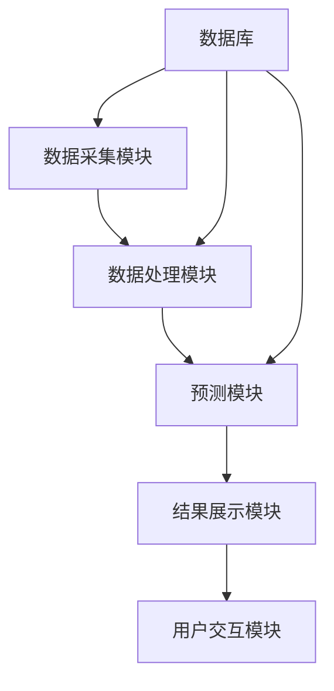
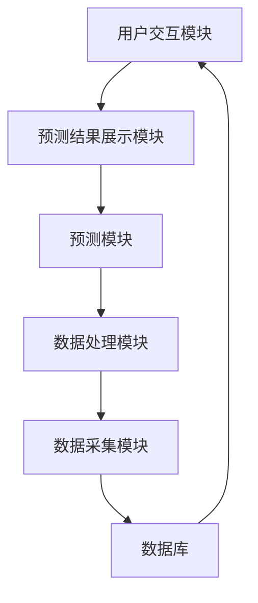
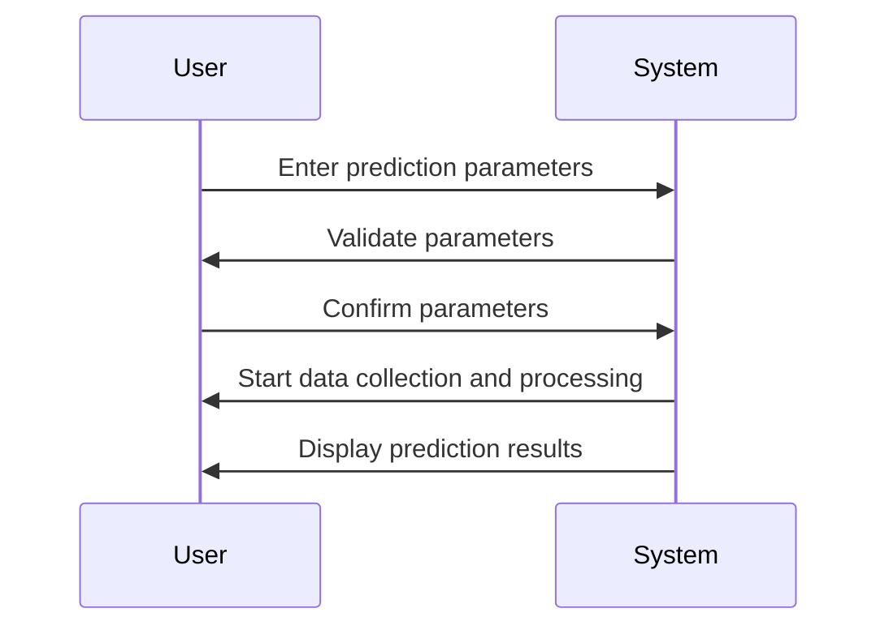
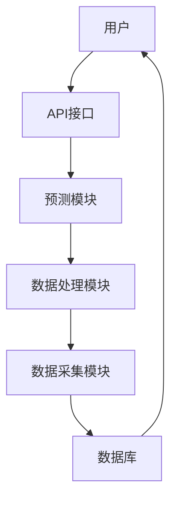

                 

### 关键词

- 不确定性
- 确定性
- 生存智慧
- 动态平衡
- 未来发展趋势

### 摘要

本文从现代社会的不确定性出发，探讨了在复杂多变的环境中寻找确定性的必要性和方法。通过解析不确定性的来源与影响，介绍了传统和现代寻找确定性的途径，并结合具体案例和实践经验，提出了培养生存智慧的策略。文章最后对未来发展趋势进行了预测，并提出了应对不确定性的策略，以期为读者提供在不确定性中找寻确定性的生存智慧。

## 第一部分：引言

### 1.1 问题背景与重要性

#### 1.1.1 现代社会的复杂性

现代社会正经历着前所未有的快速发展，科技的进步、经济的全球化、信息的爆炸式增长，使得我们生活在一个高度复杂的环境中。在这个复杂的世界中，不确定性无处不在，成为了我们不得不面对的常态。

首先，技术进步带来了前所未有的不确定性。人工智能、大数据、区块链等新兴技术的涌现，不仅改变了传统行业，还带来了新的风险和挑战。例如，人工智能的广泛应用可能导致就业结构的改变，大数据的应用可能会触及个人隐私问题，而区块链技术的普及可能会对金融体系产生深远影响。

其次，全球化的加速使得社会更加紧密地联系在一起，但也带来了更大的不确定性。国际政治局势的波动、贸易摩擦的加剧、地缘政治的不稳定，都使得国际关系变得更加复杂和不可预测。

最后，信息爆炸使得我们面临的信息量远超以往，如何在海量信息中寻找有价值的信息成为了新的挑战。信息的快速更新和传播，使得许多信息尚未被验证就已经成为人们讨论的焦点，这种信息的不确定性给我们带来了困扰。

#### 1.1.2 不确定性的普遍存在

不确定性不仅存在于技术和社会层面，还渗透到我们生活的方方面面。从个人层面来看，生活中的许多决策都充满了不确定性。例如，找工作、购房、教育规划等，都需要面对未来不可预知的变化。这些不确定性不仅增加了决策的难度，也带来了心理压力。

从企业层面来看，企业的发展面临着市场的不确定性、供应链的不确定性、政策的不确定性等多重挑战。如何在不确定的环境中保持竞争力，成为了企业领导者必须思考的问题。

从社会层面来看，不确定性的影响更加深远。社会的不确定性可能导致社会矛盾的加剧，如贫富差距、就业问题、社会治安问题等。这些问题的解决需要社会的共同努力，但不确定性使得这一过程变得更加复杂和艰难。

#### 1.1.3 寻找确定性的必要性

在不确定性的环境中，寻找确定性成为了我们应对挑战的关键。确定性不仅能够提供心理上的安慰，还能够帮助我们做出更加明智的决策。

首先，确定性能够提供安全感。在不确定的环境中，确定性成为了人们寻求安全感的依托。例如，在找工作时，一个稳定的工作环境和明确的发展路径能够给人带来安全感。

其次，确定性能够帮助我们做出更加明智的决策。在面对不确定性时，确定性的信息能够帮助我们评估风险和机会，从而做出更加明智的决策。例如，在投资时，了解市场的确定性因素，如企业的财务状况、市场趋势等，能够帮助我们做出更加明智的投资决策。

最后，确定性能够促进社会的稳定和发展。在社会层面上，确定性的政策和措施能够减少社会矛盾，促进社会的稳定和发展。例如，政府在制定政策时，通过数据分析和市场研究，可以找到确定性的因素，从而制定出更加有效的政策。

综上所述，在不确定性的环境中寻找确定性，不仅是为了个体的安全和发展，也是为了社会的稳定和进步。这需要我们具备深刻的洞察力、严谨的逻辑思维和灵活的应变能力。

### 1.2 核心概念解析

#### 1.2.1 不确定性

不确定性是指事物在未来的状态或结果不可预知或不可完全控制的状态。它是一个广泛的概念，涵盖了从微观层面的量子不确定性到宏观层面社会变革的不确定性。在技术领域，不确定性可能来自于新兴技术的未知风险；在社会层面，不确定性可能来自于政治、经济、环境等方面的复杂变化。

**核心概念术语说明：**
- **确定事件**：在特定条件下，其结果可以预知的事件。
- **随机事件**：在特定条件下，其结果不可预知的事件。
- **概率**：描述随机事件发生可能性的数值。

**问题背景：**
不确定性的普遍存在使得我们无法准确预测未来，这给决策带来了巨大的挑战。例如，在商业决策中，不确定的市场环境使得预测未来市场需求变得困难。

**问题描述：**
如何在一个不确定的环境中做出明智的决策？

**问题解决：**
通过收集和分析数据、建立模型和模拟，我们可以减少不确定性带来的影响，从而做出更加明智的决策。

**边界与外延：**
不确定性的边界是它的范围和限制，如科学技术的局限性、数据的完整性等。其外延涉及到各种领域的应用，包括金融、医疗、工程等。

#### 1.2.2 确定性

确定性是指事物在未来的状态或结果可以被准确预测的状态。在技术领域，确定性通常来自于精确的模型和算法；在社会层面，确定性可能来自于明确的法律和政策。

**核心概念：**
- **确定模型**：能够准确预测结果的模型。
- **确定算法**：能够给出明确答案的算法。

**问题背景：**
确定性的存在使得我们可以更准确地预测和控制事物的变化，这在许多领域都具有重要意义。

**问题描述：**
如何在一个不确定的环境中寻找确定性？

**问题解决：**
通过科学研究和数据挖掘，我们可以发现确定性因素，从而在不确定性中寻找确定性。

**边界与外延：**
确定性的边界是它的适用范围和局限性，如模型的精确度和算法的有效性等。其外延涉及到各种确定性的应用，如天气预报、风险管理等。

#### 1.2.3 生存智慧

生存智慧是指个体在不确定的环境中适应和应对变化的能力。它包括心理调适、知识储备、创新能力等多方面。

**核心概念：**
- **心理调适**：调整心态，适应不确定性。
- **知识储备**：积累知识，增强应对不确定性能力。
- **创新能力**：在不确定性中寻找新的解决方案。

**问题背景：**
在现代社会中，不确定性成为常态，个体需要具备生存智慧以应对各种挑战。

**问题描述：**
如何培养和提高生存智慧？

**问题解决：**
通过教育、实践和不断学习，个体可以培养和提高生存智慧。

**边界与外延：**
生存智慧的边界是个体的适应能力和创新能力的限制。其外延包括各种适应不确定性环境的策略和方法。

### 1.3 边界与外延

#### 1.3.1 不确定性的范畴

不确定性的范畴非常广泛，涵盖了从微观到宏观的各种现象。在技术领域，不确定性可能来自于新的技术突破或未知的技术风险；在社会层面，不确定性可能来自于政策变化、经济波动、自然灾害等。

**不确定性范畴：**
- **技术不确定性**：如新兴技术的风险和机会。
- **社会不确定性**：如政治动荡、经济波动。
- **环境不确定性**：如气候变化、自然灾害。

**不确定性的局限性：**
- **技术限制**：现有技术的局限性可能导致无法完全消除不确定性。
- **数据限制**：数据的不完整和错误可能导致不确定性。
- **认知限制**：人类认知的局限性使得我们无法完全理解所有不确定性。

#### 1.3.2 确定性的局限性

确定性虽然在某些情况下能够提供明确的方向和指导，但也存在一定的局限性。

**确定性的局限性：**
- **模型限制**：模型只能基于已知的信息进行预测，无法涵盖所有可能的情况。
- **数据限制**：数据的局限可能导致确定性结果的偏差。
- **时间限制**：确定的决策需要时间来验证，而现实的变化可能迅速。

**确定性与不确定性的关系：**

确定性与不确定性并非完全对立，而是相互交织和转化的。在某些情况下，通过减少不确定性，可以增加确定性。例如，在金融市场中，通过数据分析可以减少投资的不确定性，从而提高确定性。

#### 1.3.3 生存智慧的内涵

生存智慧是指在不确定的环境中，个体或组织能够适应和应对变化的能力。它不仅包括心理层面的调适，还包括知识和技能的储备，以及创新能力的培养。

**生存智慧的核心要素：**
- **心理调适**：面对不确定性时，能够保持冷静和乐观的心态。
- **知识储备**：通过学习和实践，积累应对不确定性的知识。
- **创新能力**：在不确定性中寻找新的解决方案和方法。

**生存智慧的内涵：**
生存智慧是一种综合能力，它不仅涉及到个人的心理素质，还涉及到知识和技能的储备。在现代社会中，具备生存智慧的能力显得尤为重要，它能够帮助我们更好地应对各种挑战和不确定性。

### 1.4 本书结构安排

#### 1.4.1 各章节内容概述

本书分为五个主要部分，分别是引言、不确定性的来源与影响、确定性的寻找方法、实践中的智慧以及不确定性中的确定性与未来发展。每个部分都有其独特的主题和内容，旨在从不同角度探讨不确定性和确定性之间的关系。

**第一部分：引言**
- 介绍现代社会的不确定性和寻找确定性的必要性。

**第二部分：不确定性的来源与影响**
- 分析不确定性的来源和影响，提出应对策略。

**第三部分：确定性的寻找方法**
- 探讨传统和现代寻找确定性的方法。

**第四部分：实践中的智慧**
- 通过具体案例和实践经验，提出培养生存智慧的策略。

**第五部分：不确定性中的确定性与未来发展**
- 预测未来的发展趋势，提出应对不确定性的策略。

#### 1.4.2 目录大纲逻辑关系

本书的目录大纲按照逻辑顺序排列，从引言到不确定性中的确定性与未来发展，逐步深入探讨不确定性和确定性的关系。每个章节都是对前一个章节的延伸和深化，通过层层递进，帮助读者全面理解不确定性和确定性的复杂关系。

**逻辑关系：**
- 引入问题背景和重要性。
- 分析不确定性的来源与影响。
- 探讨确定性的寻找方法。
- 通过实践中的智慧，培养生存智慧。
- 预测未来的发展趋势，提出应对策略。

#### 1.4.3 读者受益预览

通过阅读本书，读者可以：
- 深入理解不确定性和确定性的概念和关系。
- 学习如何应对不确定性和寻找确定性。
- 获得培养生存智慧的具体策略和经验。
- 了解未来的发展趋势和应对策略。

本书不仅适用于专业人士，也适用于对不确定性和确定性感兴趣的一般读者。希望通过本书，读者能够在不确定的环境中找到自己的确定性，更好地应对生活中的各种挑战。

## 第二部分：不确定性的来源与影响

### 2.1 不确定性的来源

不确定性的来源是多方面的，涵盖了自然、社会和技术等多个领域。理解不确定性的来源有助于我们更好地应对和减少其影响。

#### 2.1.1 自然因素

自然因素是导致不确定性的重要来源之一。自然灾害、气候变化、生态系统的不稳定性等都是自然因素导致的典型不确定性事件。

**自然灾害：**
自然灾害如地震、台风、洪水等具有不可预测性和破坏性，它们不仅对人类生命财产造成威胁，还对经济和社会稳定产生深远影响。例如，2020年的澳大利亚山火不仅导致了严重的生态破坏，还对当地经济和民众生活造成了巨大的冲击。

**气候变化：**
全球气候变化带来的不确定性日益增加。气候变暖导致极端天气事件频发，如热浪、干旱、洪水等，这些变化不仅影响了农业生产和水资源管理，还对全球能源供应和生态平衡产生了影响。

**生态系统的不稳定性：**
生态系统的破坏和污染也导致了不确定性。例如，海洋污染导致海洋生态系统失衡，珊瑚礁的死亡影响了渔业和旅游业；森林砍伐和野生动植物的栖息地破坏，使得生物多样性下降，影响了生态平衡。

#### 2.1.2 社会因素

社会因素是导致不确定性的另一个重要来源。社会变革、政治动荡、经济波动等都是社会因素导致的不确定性事件。

**社会变革：**
社会的快速变革带来了许多不确定性。例如，全球化进程中的文化冲突、社会结构的变化、传统价值观的动摇等，都增加了社会的复杂性，使得预测社会发展的方向变得困难。

**政治动荡：**
政治动荡是导致不确定性的常见因素。政治不稳定可能导致政策的不连续性，如政变、选举结果的不确定性、政策调整等，这些都可能导致经济和社会的动荡。

**经济波动：**
经济波动是现代社会中常见的不确定性来源。金融危机、股市波动、通货膨胀等经济现象，不仅影响了金融市场的稳定性，还影响了整个经济体系的运行。

#### 2.1.3 技术因素

技术进步是推动社会发展的动力，但同时也带来了新的不确定性。新技术的不确定性和技术应用的复杂性，使得技术因素成为不确定性来源之一。

**新兴技术的风险：**
新兴技术如人工智能、区块链、物联网等，在带来巨大潜力的同时，也带来了不确定性和风险。例如，人工智能的广泛应用可能引发就业结构的改变和社会道德伦理的挑战；区块链技术的普及可能对现有金融体系产生深远影响，但也带来了隐私和安全问题。

**技术应用的复杂性：**
技术的复杂性使得预测其应用结果变得困难。例如，复杂的软件系统可能因为一个小错误而导致整个系统的崩溃；复杂的生态系统如生态系统中的食物链，任何一个环节的变化都可能引起连锁反应，导致生态系统的不稳定。

**技术依赖：**
随着技术的进步，人类对技术的依赖程度越来越高，这也增加了不确定性。例如，当电力系统出现故障时，可能导致大规模的停电和 societal disruption；网络攻击可能使关键基础设施如交通、通信、医疗系统瘫痪，对社会造成巨大影响。

### 2.2 不确定性的影响

不确定性的影响是深远和多方面的，涵盖了心理、社会和经济等多个层面。

#### 2.2.1 心理层面

不确定性对个体的心理影响是显著的。长期的焦虑、压力和不确定性可能导致心理健康问题的增加。

**焦虑和压力：**
在不确定性中，个体往往面临未知的风险和挑战，这可能导致焦虑和压力的增加。例如，在金融市场波动时，投资者可能因为不确定的市场走向而感到焦虑；在自然灾害发生后，受灾群众可能因为未来的不确定性而感到压力。

**心理健康问题：**
长期处于不确定性环境中，个体可能面临心理健康问题的风险。例如，抑郁症、焦虑症等心理健康问题可能与不确定性环境有关。研究表明，长期处于不确定性环境中，个体的心理健康状况可能恶化，这进一步影响个体的生活质量和工作效率。

**应对策略：**
为了应对不确定性的心理影响，个体需要培养良好的心理调适能力。这包括建立积极的心态、学习放松技巧、寻求社会支持等。例如，通过冥想、瑜伽等放松技巧，可以帮助个体减轻焦虑和压力；通过和家人、朋友交流，获得情感支持，可以帮助个体更好地应对不确定性。

#### 2.2.2 社会层面

不确定性对社会的影响是复杂和深远的。社会的不确定性可能导致社会矛盾的加剧，影响社会稳定和发展。

**社会矛盾加剧：**
社会的不确定性可能加剧社会矛盾。例如，经济波动可能导致贫富差距的扩大，社会阶层之间的矛盾加剧；技术进步可能引发就业结构的改变，导致失业率上升，社会不稳定因素增加。

**社会稳定挑战：**
不确定性环境中的社会矛盾可能对社会稳定构成挑战。政治动荡、社会冲突等不确定性事件可能引发社会动荡，影响社会稳定。例如，2020年全球范围内的社会动荡，如美国洛杉矶的抗议活动，就与社会不确定性有关。

**社会发展影响：**
不确定性也影响社会的发展方向。社会政策的不确定性和社会变革的不确定性可能导致社会发展的路径不明，影响社会发展的连续性和稳定性。例如，政策的不连续性可能导致社会发展的中断，影响社会长远利益。

**应对策略：**
为了应对不确定性的社会影响，社会需要建立有效的应对机制。这包括加强社会管理、提高社会凝聚力、建立应对不确定性的社会支持系统等。例如，政府可以通过制定稳定的政策，减少社会的不确定性；社会组织可以通过提供心理和社会支持，帮助个体和群体更好地应对不确定性。

#### 2.2.3 经济层面

不确定性对经济的影响是显著和深远的。经济不确定性可能导致金融市场波动、经济衰退和失业率上升等经济问题。

**金融市场波动：**
经济不确定性可能导致金融市场波动。例如，在2020年新冠疫情爆发初期，全球金融市场出现了剧烈波动，股市暴跌，投资者情绪极度不稳定。这些波动不仅影响了金融市场的稳定性，还对全球经济产生了深远影响。

**经济衰退：**
经济不确定性可能导致经济衰退。例如，2008年的全球金融危机就是由于经济不确定性导致的严重经济衰退。经济衰退可能导致企业倒闭、失业率上升，进一步加剧经济不确定性。

**失业率上升：**
经济不确定性可能引发失业率上升。例如，在新冠疫情期间，由于疫情导致的封锁措施，许多企业停工停产，大量工人失业。这些失业现象不仅影响了个人和家庭的生活质量，也影响了整个经济的复苏和发展。

**应对策略：**
为了应对经济不确定性，需要采取有效的经济政策和措施。这包括加强金融监管、推动科技创新、提高经济韧性和灵活性等。例如，政府可以通过增加公共投资，刺激经济增长；企业可以通过提高创新能力和灵活性，应对市场的变化。

综上所述，不确定性对心理、社会和经济的影响是复杂和深远的。理解不确定性的来源和影响，有助于我们更好地应对不确定性，减少其负面影响。同时，通过采取有效的应对策略，我们可以提高个体的适应能力、社会的稳定性和经济的韧性，从而更好地应对不确定性带来的挑战。

### 2.3 不确定性的应对策略

面对不确定性的挑战，个体、企业和政府都需要采取有效的应对策略，以减轻不确定性带来的负面影响。以下是一些常见的应对策略：

#### 2.3.1 心理调适方法

对于个体而言，心理调适是应对不确定性的重要手段。以下是一些具体的方法：

1. **认知重构**：通过改变对不确定性的认知方式，将不确定性视为一种挑战而非威胁。例如，将失业视为一个重新规划职业生涯的机会，而不是一种灾难。

2. **积极心态**：培养积极的心态，通过正面思考和乐观的态度来应对不确定性。例如，通过设定小目标，逐步实现，从而增强自信心和成就感。

3. **情绪释放**：通过适当的渠道释放情绪，如与朋友、家人交流，进行体育锻炼或参加心理咨询等。

4. **压力管理**：学习有效的压力管理技巧，如深呼吸、冥想、瑜伽等，以减轻心理压力。

5. **适应性学习**：通过不断学习和适应新环境，提高应对不确定性的能力。例如，通过学习新技能或知识，增加职业竞争力。

#### 2.3.2 社会管理措施

社会层面应对不确定性需要政府、企业和社会组织的共同努力。以下是一些具体的管理措施：

1. **政策稳定**：政府应制定稳定和透明的政策，减少政策变化带来的不确定性。例如，制定长期发展规划，确保政策连续性。

2. **社会支持**：建立社会支持系统，为个体和企业提供必要的帮助和支持。例如，提供就业培训、职业咨询、心理援助等。

3. **应急响应**：建立高效的应急响应机制，应对突发事件和危机。例如，设立紧急救援基金、完善应急管理体系等。

4. **社会监督**：加强对社会各个领域的监督，确保社会秩序和稳定。例如，加强对金融市场的监管，防止市场失控。

5. **文化交流**：促进文化交流，增强社会的凝聚力和适应性。例如，举办文化交流活动、推广多文化理解等。

#### 2.3.3 经济缓冲策略

经济层面应对不确定性需要采取一系列经济缓冲策略，以减少不确定性对经济的影响。以下是一些具体的经济策略：

1. **财政政策**：通过财政手段调节经济，如增加公共投资、减税等，以刺激经济增长和稳定市场。

2. **货币政策**：通过货币政策调节市场流动性，如调整利率、货币供应量等，以稳定金融市场。

3. **金融监管**：加强金融监管，防止金融风险积聚，如加强对金融机构的审查、规范金融市场操作等。

4. **科技创新**：推动科技创新，提高经济的竞争力和韧性。例如，支持新兴产业的发展、鼓励科技研发等。

5. **国际合作**：加强国际合作，共同应对全球性挑战，如气候变化、国际贸易摩擦等。

通过以上策略，个体、企业和政府可以共同应对不确定性，减少其负面影响，提高社会和经济的稳定性。

### 2.4 不确定性的认知与理解

理解不确定性是应对不确定性的关键。以下从个体认知过程、社会共识的形成以及文化与不确定性三个方面探讨不确定性的认知与理解。

#### 2.4.1 个体认知过程

个体在认知不确定性时，通常会经历以下几个阶段：

1. **感知阶段**：个体首先需要感知到不确定性。这一阶段往往是通过观察、倾听和体验来实现的。例如，当个体面临经济波动时，他们会感受到市场的不确定性。

2. **评估阶段**：个体在感知到不确定性后，会对其进行评估，判断其影响的程度和可能性。这一阶段需要个体具备一定的知识和经验，以便做出准确的评估。例如，在评估一项新技术是否值得投资时，个体需要考虑其技术成熟度、市场前景等因素。

3. **反应阶段**：个体在评估不确定性后，会采取相应的反应。这些反应可能包括调整心态、制定应对策略、采取行动等。例如，在感知到气候变化带来的不确定性后，个体可能会采取节能减排、低碳生活方式等措施。

4. **适应阶段**：在不确定性环境中，个体需要不断适应变化。这一阶段要求个体具备良好的心理素质和适应能力，能够灵活调整自己的行为和策略。例如，在应对就业市场不确定性时，个体可能需要不断学习新技能、拓宽职业领域等。

#### 2.4.2 社会共识的形成

社会共识的形成是应对不确定性的重要环节。以下从几个方面探讨社会共识的形成：

1. **信息共享**：社会共识的形成需要基于信息的共享和交流。通过信息共享，个体可以了解不确定性的全貌，从而形成更加全面和准确的认识。例如，政府在应对公共卫生事件时，通过发布疫情信息和防控措施，帮助公众了解疫情动态，形成应对共识。

2. **决策参与**：社会共识的形成需要个体的广泛参与和决策。个体通过参与决策过程，可以表达自己的观点和需求，从而影响决策结果。例如，在制定城市规划时，政府可以通过公众参与，收集民意，形成共识。

3. **制度保障**：社会共识的形成需要制度保障。制度可以为个体提供明确的行为规范和期望，从而促进共识的形成。例如，法律法规的制定可以为社会提供明确的规则，减少社会矛盾，促进共识的形成。

#### 2.4.3 文化与不确定性

文化在应对不确定性中起着重要作用。以下从几个方面探讨文化与不确定性的关系：

1. **文化认知**：不同的文化背景会影响个体对不确定性的认知和理解。例如，在西方文化中，个人主义和自由竞争的观念可能使个体更加倾向于应对不确定性；而在东方文化中，集体主义和家庭观念可能使个体更加注重稳定和和谐。

2. **文化适应**：文化适应能力是应对不确定性的重要因素。具备良好文化适应能力的个体，能够在不同文化环境中灵活调整自己的行为和心态。例如，在国际工作环境中，具备跨文化适应能力的员工能够更好地应对工作中的不确定性。

3. **文化传承**：文化传承是应对不确定性的重要途径。通过传承和弘扬优秀的文化传统，个体可以汲取前人的智慧和经验，从而更好地应对不确定性。例如，儒家文化中的“中庸之道”和“仁爱之心”为个体提供了应对不确定性的哲学思考和方法。

综上所述，理解不确定性是应对不确定性的关键。通过个体认知过程的深入分析、社会共识的逐步形成以及文化传承的持续推动，我们可以更好地应对不确定性，实现社会的稳定和发展。

## 第三部分：确定性的寻找方法

### 3.1 确定性的本质与特征

确定性是指在特定条件下，能够准确预测和确定结果的性质。确定性的本质是规律性和可预测性，它反映了事物在某种程度上的稳定性和一致性。以下从确定性的本质、特征及其与不确定性的关系三个方面进行探讨。

#### 3.1.1 确定性的本质

确定性的本质在于它能够提供明确的方向和结果。在技术领域，确定性通常通过精确的模型和算法来实现。例如，在天气预报中，通过收集气象数据，使用气象模型进行预测，可以较为准确地预测未来几天的天气状况。在社会领域，确定性则体现在明确的法律和政策中。例如，在商业交易中，合同条款的明确性和法律保障使得交易双方能够确定各自的权利和义务。

#### 3.1.2 确定性的特征

确定性的特征主要包括以下几个方面：

1. **规律性**：确定性事件往往遵循某种规律，这种规律可以通过模型和算法进行描述。例如，牛顿定律描述了物体运动的规律，通过这个定律，可以预测物体的运动轨迹。

2. **可预测性**：确定性事件的结果是可以预测的。通过收集和分析数据，使用合适的模型和算法，可以预测事件的发展趋势和结果。例如，通过分析历史股市数据，使用时间序列模型，可以预测未来一段时间的股市走势。

3. **稳定性**：确定性事件的结果在特定条件下是稳定的，不会发生显著变化。例如，在物理学中，万有引力定律提供了一个稳定的预测框架，可以用来预测天体的运动。

4. **一致性**：确定性事件的结果在不同时间和条件下是一致的。例如，在标准化的测试中，使用相同的测试工具和条件，可以得到一致的测试结果。

#### 3.1.3 确定性与不确定性的关系

确定性与不确定性是相互依存的。在许多情况下，确定性是建立在不确定性的基础上，通过分析和理解不确定性来寻找确定性。

1. **互为前提**：确定性和不确定性相互依存，没有绝对的确定性，也没有无确定性的不确定性。例如，在科学研究中，通过实验和数据分析，可以减少不确定性，从而获得更准确的确定性结果。

2. **相互转化**：在特定条件下，确定性可以转化为不确定性。例如，一个稳定的物理模型，在新的条件下可能不再适用，从而转化为不确定性。相反，通过不断的研究和验证，不确定性也可以转化为确定性。

3. **互补性**：确定性和不确定性在不同领域和不同阶段起着互补作用。在技术领域，确定性提供了精确的指导，减少了不确定性带来的风险；在社会领域，不确定性激发了创新和变革，推动了社会的进步。

综上所述，确定性的本质和特征使其在应对不确定性中具有重要作用。通过理解确定性和不确定性的关系，我们可以更好地利用确定性，减少不确定性的负面影响。

### 3.2 传统寻找确定性的方法

在历史上，人类通过多种方法寻找确定性，这些方法主要包括经验法、规范法和分析法。以下详细探讨这些传统方法及其应用。

#### 3.2.1 经验法

经验法是一种基于实践和观察的寻找确定性的方法。通过长期的实践和观察，人们总结出了一些经验和规律，这些经验和规律可以用于预测和决策。

1. **应用领域**：
   - **农业**：农民通过观察天气、土壤和作物的生长情况，总结出种植作物的最佳时间和方法。
   - **医疗**：医生通过观察病患的症状、体征和病史，总结出诊断疾病和制定治疗方案的规律。

2. **优点**：
   - **简单易行**：经验法不需要复杂的工具和设备，简单易懂，易于普及。
   - **可靠性高**：在长期实践中验证有效的经验，具有较高的可靠性。

3. **局限性**：
   - **主观性**：经验法受到个体经验和主观判断的影响，可能存在偏差。
   - **局限性**：经验法适用于特定的环境和条件，难以适应复杂多变的环境。

#### 3.2.2 规范法

规范法是一种基于规则和标准的寻找确定性的方法。通过制定和遵循一系列规范和标准，人们可以在复杂的环境中保持秩序和一致性。

1. **应用领域**：
   - **法律**：法律通过制定一系列规范和条款，确保社会秩序和公正。
   - **工程**：工程师通过遵循工程标准和规范，确保工程项目的质量和安全性。

2. **优点**：
   - **权威性**：规范法具有权威性和强制性，能够确保行为的一致性和规范性。
   - **可操作性**：规范法提供了明确的操作指南，便于执行和监督。

3. **局限性**：
   - **灵活性不足**：规范法过于僵化，难以适应快速变化的环境。
   - **执行难度**：规范法的执行需要投入大量资源和时间，可能存在执行难度。

#### 3.2.3 分析法

分析法是一种基于逻辑推理和数学模型的寻找确定性的方法。通过分析和建模，人们可以从复杂的数据中提取关键信息，预测未来的趋势和结果。

1. **应用领域**：
   - **经济**：经济学家通过数据分析，预测经济走势和制定经济政策。
   - **技术**：工程师通过分析技术参数和模型，设计和优化技术系统。

2. **优点**：
   - **科学性**：分析法基于科学原理和数学模型，具有较高的科学性和准确性。
   - **灵活性**：分析法能够适应不同的环境和条件，具有较强的灵活性。

3. **局限性**：
   - **复杂性**：分析法需要较高的专业知识和技能，复杂性和成本较高。
   - **数据依赖**：分析法的有效性依赖于数据的准确性和完整性，数据不足可能导致分析结果的偏差。

综上所述，传统寻找确定性的方法各具优缺点，适用于不同的场景和需求。在实际应用中，可以结合多种方法，取长补短，提高确定性的寻找效果。

### 3.3 现代寻找确定性的工具

在现代科技迅速发展的背景下，人工智能、数据分析、仿真模拟等工具为寻找确定性提供了强大的支持。这些工具通过处理海量数据和复杂关系，提高了确定性的寻找效率和准确性。

#### 3.3.1 数据分析

数据分析是通过统计方法和算法，从大量数据中提取有用信息和知识的过程。数据分析在寻找确定性中发挥着重要作用。

1. **应用领域**：
   - **商业**：企业通过数据分析，预测市场需求、消费者行为，优化经营策略。
   - **医疗**：医疗数据分析师通过分析患者数据，发现疾病模式，提高诊断和治疗效果。

2. **优点**：
   - **高效性**：数据分析能够快速处理海量数据，提高决策效率。
   - **准确性**：通过先进的算法和模型，数据分析能够提供较为准确的预测结果。

3. **局限性**：
   - **数据依赖**：数据分析的有效性依赖于数据的准确性和完整性，数据质量低下可能导致分析结果的偏差。
   - **复杂性**：数据分析过程涉及复杂的算法和模型，需要较高的技术和知识。

#### 3.3.2 人工智能

人工智能（AI）是通过模拟人类智能行为，实现自动化决策和智能推理的技术。人工智能在寻找确定性方面具有广泛的应用。

1. **应用领域**：
   - **金融**：通过人工智能模型，金融机构可以预测市场走势，进行风险管理和投资决策。
   - **医疗**：人工智能在医疗诊断、治疗规划和药物研发中发挥着重要作用，提高了医疗效率和准确性。

2. **优点**：
   - **自动化**：人工智能能够自动化地进行复杂计算和决策，减轻人力负担。
   - **学习能力**：人工智能通过不断学习和优化，能够提高预测和决策的准确性。

3. **局限性**：
   - **数据需求**：人工智能的有效性依赖于大量的高质量数据，数据不足可能导致模型训练不足。
   - **技术挑战**：人工智能技术的发展仍面临许多挑战，如算法透明性、伦理问题等。

#### 3.3.3 仿真模拟

仿真模拟是通过计算机模拟真实系统或过程，分析其性能和行为的方法。仿真模拟在寻找确定性方面具有独特优势。

1. **应用领域**：
   - **工程**：通过仿真模拟，工程师可以预测和优化工程系统的性能，减少实际测试的成本和时间。
   - **交通**：仿真模拟用于模拟交通流量，优化交通信号控制，提高交通效率。

2. **优点**：
   - **可控性**：仿真模拟可以反复进行，控制变量，便于分析和优化。
   - **低成本**：仿真模拟避免了实际测试的高成本，降低了研发成本。

3. **局限性**：
   - **模型依赖**：仿真模拟依赖于准确的模型，模型的不准确可能导致仿真结果的偏差。
   - **计算资源**：大规模仿真模拟需要大量的计算资源，可能导致计算成本高。

综上所述，现代寻找确定性的工具在提高确定性的寻找效率和准确性方面具有显著优势，但也面临一些挑战。结合不同工具的优势，可以更有效地应对不确定性的挑战。

### 3.4 确定性寻找的实践应用

确定性的寻找方法在实际应用中具有广泛的应用场景，能够帮助我们更好地应对不确定性带来的挑战。以下从个人生活、企业管理和社会治理三个方面探讨确定性的实践应用。

#### 3.4.1 个人生活

在个人生活中，确定性的寻找方法可以帮助我们做出更加明智的决策，提高生活质量。

1. **职业规划**：
   - **数据分析**：通过数据分析，了解不同行业的就业前景、薪资水平和职业发展路径，帮助个人制定职业规划。
   - **人工智能**：利用人工智能进行职业匹配和预测，找到与个人兴趣和技能相匹配的职业方向。

2. **健康管理**：
   - **数据分析**：通过分析个人健康数据，如血压、心率、睡眠质量等，预测健康风险，制定健康计划。
   - **人工智能**：利用人工智能进行健康咨询和疾病预测，提供个性化的健康管理方案。

3. **财务规划**：
   - **数据分析**：通过数据分析，了解个人财务状况，预测未来的财务需求，制定财务规划。
   - **人工智能**：利用人工智能进行投资分析和预测，帮助个人进行合理的资产配置和风险控制。

#### 3.4.2 企业管理

在企业管理中，确定性的寻找方法可以帮助企业降低风险，提高运营效率。

1. **市场分析**：
   - **数据分析**：通过数据分析，了解市场需求、消费者行为和竞争状况，制定市场策略。
   - **人工智能**：利用人工智能进行市场预测和客户需求分析，提高市场响应速度和精准度。

2. **供应链管理**：
   - **数据分析**：通过数据分析，优化供应链流程，减少库存成本，提高供应链效率。
   - **仿真模拟**：利用仿真模拟，模拟不同供应链场景，优化供应链设计和运营策略。

3. **风险管理**：
   - **数据分析**：通过数据分析，识别潜在风险，评估风险影响，制定风险管理策略。
   - **人工智能**：利用人工智能进行风险预测和监控，提供实时风险预警和管理建议。

#### 3.4.3 社会治理

在社会治理中，确定性的寻找方法可以帮助政府和社会组织更好地管理社会事务，提高社会稳定性。

1. **公共卫生管理**：
   - **数据分析**：通过数据分析，监测疫情动态，预测疫情发展趋势，制定公共卫生策略。
   - **人工智能**：利用人工智能进行疫情预测和流行病分析，提供科学决策支持。

2. **社会安全**：
   - **数据分析**：通过数据分析，识别社会不稳定因素，预测犯罪趋势，制定社会安全策略。
   - **人工智能**：利用人工智能进行社会安全监控和预警，提高社会安全水平。

3. **公共服务**：
   - **数据分析**：通过数据分析，优化公共服务资源配置，提高服务质量和效率。
   - **仿真模拟**：利用仿真模拟，模拟不同公共服务场景，优化公共服务设计和运营策略。

综上所述，确定性的寻找方法在实际应用中具有广泛的应用前景，能够帮助我们更好地应对不确定性，提高决策的准确性和效率。通过结合多种方法，我们可以更有效地利用确定性，减少不确定性带来的负面影响。

## 第四部分：实践中的智慧

### 4.1 培养生存智慧

在复杂和不确定的环境中，培养生存智慧成为了个体和组织成功的关键。生存智慧不仅包括应对不确定性所需的技能和知识，还涉及到心理素质和思维方式。以下从适应环境、应对变化和创新能力三个方面探讨如何培养生存智慧。

#### 4.1.1 适应环境

适应环境是生存智慧的核心要素之一。在快速变化的社会和技术环境中，个体和组织需要具备快速适应和调整能力。

1. **持续学习**：个体和组织需要不断学习新知识、新技能，以适应不断变化的环境。例如，在信息技术领域，新技术不断涌现，程序员需要不断学习新技术，如人工智能、区块链等，以保持竞争力。

2. **灵活应变**：在不确定性中，个体和组织需要具备灵活应变的能力。例如，在疫情爆发期间，许多企业迅速调整业务模式，转向线上运营，以应对疫情带来的挑战。

3. **跨界思维**：在复杂的环境中，个体和组织需要具备跨界思维，将不同领域的知识和经验进行整合，以应对新的挑战。例如，结合信息技术和生物医学领域的知识，可以推动医疗技术的创新。

#### 4.1.2 应对变化

应对变化是生存智慧的另一个重要方面。不确定性往往伴随着变化，个体和组织需要具备快速应对变化的能力。

1. **预见变化**：个体和组织需要具备预见变化的能力，通过预测未来趋势，提前做好准备。例如，通过市场调研和数据分析，企业可以预测市场变化，制定相应的应对策略。

2. **灵活调整**：在变化发生时，个体和组织需要能够灵活调整自己的策略和行为。例如，在应对市场需求变化时，企业可以调整产品线和营销策略，以适应新的市场环境。

3. **快速决策**：个体和组织需要在变化发生时能够快速做出决策。例如，在紧急情况下，企业需要能够迅速调整生产线，以满足市场需求。

#### 4.1.3 创新能力

创新能力是生存智慧的重要组成部分。在不确定性中，个体和组织需要具备创新思维，以寻找新的解决方案。

1. **鼓励创新**：个体和组织需要营造鼓励创新的文化氛围，鼓励员工提出新的想法和建议。例如，许多科技公司设有创新实验室，鼓励员工进行创新研究和开发。

2. **跨领域合作**：个体和组织可以通过跨领域合作，整合不同领域的知识和资源，推动创新。例如，生物医学领域与信息技术领域的合作，可以推动生物信息学的发展。

3. **持续研发**：个体和组织需要持续投入研发资源，推动技术创新。例如，许多科技公司设立研发部门，进行持续的技术创新和产品研发。

#### 4.1.4 实际案例

以下是一些实际案例，展示了如何通过适应环境、应对变化和创新能力来培养生存智慧。

1. **案例1：新冠疫情中的企业应对**
   - **适应环境**：许多企业迅速调整业务模式，转向线上运营，以满足疫情期间的市场需求。
   - **应对变化**：企业通过数据分析，预测市场需求，及时调整产品线和营销策略。
   - **创新能力**：一些企业通过技术创新，开发了新的线上服务和产品，如在线教育、远程办公等，以应对疫情带来的挑战。

2. **案例2：信息技术领域的持续创新**
   - **适应环境**：信息技术领域不断涌现新技术，企业需要不断学习新知识，以适应技术变化。
   - **应对变化**：企业通过持续研发和技术创新，保持竞争力，应对市场变化。
   - **创新能力**：企业通过设立创新实验室，鼓励员工提出创新想法，推动技术进步。

通过以上实际案例，我们可以看到，适应环境、应对变化和创新能力是培养生存智慧的关键。在复杂和不确定的环境中，个体和组织只有不断培养这些能力，才能更好地应对挑战，实现可持续发展。

### 4.2 生存智慧的具体案例

#### 4.2.1 个人案例

**案例1：职业转型中的智慧**

李明是一位从事传统制造业的技术工程师，随着新兴科技的快速发展，他意识到自己所在行业的竞争压力和职业前景。为了适应未来科技的发展，李明决定进行职业转型，学习人工智能相关的技术。

1. **适应环境**：李明通过在线课程和自学，不断更新自己的知识体系，了解了人工智能的基本原理和应用。

2. **应对变化**：在职业转型过程中，李明面临了较大的压力，但他通过积极参加行业活动、加入专业社群，扩展了人脉资源，获得了职业转型的机会。

3. **创新能力**：李明在工作中积极尝试使用人工智能工具，提高工作效率。例如，他使用机器学习算法优化生产流程，显著提高了生产效率和产品质量。

通过这个案例，我们可以看到，个人在面临职业转型时，通过适应环境、应对变化和创新能力，成功实现了职业发展。

#### 4.2.2 企业案例

**案例2：数字化转型中的企业智慧**

某家传统的制造企业，在面对数字化转型浪潮时，决定进行全面转型，以提高竞争力和市场响应速度。

1. **适应环境**：企业通过市场调研和数据分析，了解到数字化转型是未来发展的趋势，决定进行数字化转型。

2. **应对变化**：企业在转型过程中，面临技术选择、人才招聘、系统整合等多重挑战。通过制定详细的转型计划，企业逐步解决了这些挑战，确保了转型过程的顺利进行。

3. **创新能力**：企业在数字化转型过程中，积极创新，开发了新的产品和服务。例如，通过物联网技术，企业实现了生产设备的智能化监控和优化，提高了生产效率和产品质量。

通过这个案例，我们可以看到，企业在面对数字化转型时，通过适应环境、应对变化和创新能力，实现了业务的持续增长。

#### 4.2.3 社会案例

**案例3：自然灾害应对中的智慧**

在自然灾害频发的地区，政府和社会组织通过智慧手段，提高了自然灾害应对能力。

1. **适应环境**：政府通过建立灾害预警系统，实时监测天气和地质变化，提前发布预警信息。

2. **应对变化**：社会组织通过社区动员和志愿者服务，提高了社区的应对灾害能力。例如，社区开展了应急演练，提高了居民的自救和互救能力。

3. **创新能力**：政府和社会组织通过技术手段，提高了灾害应对的效率。例如，使用无人机进行灾区监控，使用大数据分析预测灾害影响，提高了应急响应的精准度。

通过这个案例，我们可以看到，社会在应对自然灾害时，通过适应环境、应对变化和创新能力，提高了灾害应对能力，保护了人民的生命财产安全。

### 4.3 智慧的传承与发扬

#### 4.3.1 教育体系中的智慧教育

智慧教育是培养个体生存智慧的关键途径。教育体系应注重智慧教育的实践，将适应环境、应对变化和创新能力融入教育过程中。

1. **课程设计**：学校应开设智慧教育相关课程，如科技创新、跨学科学习等，培养学生的跨领域思维和创新能力。

2. **教学方式**：教师应采用互动式教学和项目式学习，激发学生的主动学习和实践能力。例如，通过小组讨论、实验项目和案例分析，让学生在实践中学习和应用智慧。

3. **教育资源**：学校应提供丰富的智慧教育资源，如实验室、图书馆、在线课程等，为学生提供实践和探索的平台。

#### 4.3.2 文化传承中的智慧元素

文化传承是智慧传承的重要组成部分。文化传统中的智慧元素，如哲学、历史、艺术等，可以为现代社会提供宝贵的智慧资源。

1. **文化教育**：通过文化教育，传承和弘扬传统文化中的智慧元素。例如，通过历史课程，让学生了解古代智慧；通过艺术课程，培养学生审美和创造力。

2. **文化活动**：举办各类文化活动，如文化节、讲座、展览等，推广智慧文化，提高公众的智慧素养。

3. **文化融合**：在全球化背景下，推动文化融合，吸收外来文化的智慧，丰富本土文化内涵。

#### 4.3.3 社会实践中的智慧应用

社会实践是智慧应用的重要领域。通过社会实践活动，个体和组织可以将智慧转化为实际成果，推动社会的进步和发展。

1. **志愿服务**：个体可以通过志愿服务，参与社区建设和社会服务，将智慧应用到实际工作中。

2. **创新创业**：政府和社会组织应鼓励创新创业，为个体和组织提供支持，推动智慧应用的实践。

3. **科技扶贫**：通过科技手段，解决贫困地区的问题，提高贫困人口的生活质量，实现智慧扶贫。

综上所述，智慧的传承与发扬需要教育体系的改革、文化传承的推广和社会实践的深化。通过这些途径，我们可以培养更多的智慧个体，推动社会的可持续发展。

## 第五部分：不确定性中的确定性与未来发展

### 5.1 不确定性中的确定性：动态平衡

在充满不确定性的世界中，寻找确定性并非一成不变的任务，而是需要不断调整和优化的动态平衡过程。动态平衡是指个体和组织在不确定的环境中，通过不断调整和适应，达到最佳平衡状态，从而实现稳定和发展。

#### 5.1.1 确定性的相对性

首先，我们需要认识到确定性的相对性。在不确定性的背景下，确定性并不是绝对的，而是相对的。这意味着在不同时间、不同环境和不同条件下，确定性的内容和形式会有所不同。

**时间维度**：随着时间的推移，环境发生变化，确定性的内容也会随之调整。例如，在技术快速发展的时代，今天被认为是确定的技术，明天可能因为新技术的出现而变得不确定。

**环境维度**：环境的变化会影响确定性的表现。例如，在和平稳定的社会环境中，法律和政策具有较高的确定性；而在动荡不安的社会环境中，法律和政策的执行和效果可能会受到很大影响。

**条件维度**：在特定条件下，某些因素可能被视为确定性，但在其他条件下则可能变得不确定。例如，在正常市场条件下，商品价格相对稳定；但在市场波动时，价格的不确定性显著增加。

#### 5.1.2 动态平衡的必要性

动态平衡在应对不确定性的过程中具有至关重要的意义。以下从个体、企业和政府三个层面探讨动态平衡的必要性。

**个体层面**：个体在不确定性的环境中，需要具备动态平衡的能力。通过不断调整和优化自身的行为和决策，个体可以更好地适应环境变化，减少不确定性带来的负面影响。例如，个人职业规划需要根据市场变化和自身能力进行动态调整，以实现职业目标。

**企业层面**：企业在不确定的环境中，需要建立动态平衡的机制，以应对市场变化和行业竞争。通过灵活的战略调整和资源配置，企业可以保持竞争力和可持续发展。例如，企业需要根据市场需求和技术趋势，不断优化产品线和业务模式，以应对市场的变化。

**政府层面**：政府作为社会的管理者，需要在不确定性中实现动态平衡，以维护社会稳定和促进发展。政府需要制定灵活的政策和措施，根据社会和经济环境的变化进行调整。例如，政府可以通过经济政策和监管措施，稳定市场，促进经济的持续发展。

#### 5.1.3 平衡点的寻找策略

在不确定性的环境中，寻找平衡点是一个复杂的过程，需要多种策略和方法。以下是一些寻找平衡点的策略：

1. **持续监测和分析**：个体、企业和政府需要持续监测和分析环境变化，了解不确定性的来源和发展趋势。通过数据分析和预测，可以更好地掌握不确定性因素，为调整决策提供依据。

2. **灵活调整策略**：在监测和分析的基础上，个体、企业和政府需要根据环境变化，灵活调整策略和行为。例如，企业可以通过市场调研和数据分析，调整营销策略和产品组合，以应对市场需求的变化。

3. **增强适应能力**：个体、企业和政府需要培养和增强适应能力，以应对不确定性的挑战。这包括提高个体和组织的灵活应变能力、创新能力和资源整合能力。

4. **多元化发展**：通过多元化发展，可以降低不确定性带来的风险。例如，企业可以通过多元化产品线和业务模式，分散市场风险；政府可以通过多元化的经济政策，促进经济的稳定和发展。

5. **跨界合作**：在不确定性的环境中，跨界合作可以发挥不同领域和资源的作用，提高整体应对不确定性的能力。例如，通过跨界合作，企业可以借助外部资源和知识，应对行业挑战。

综上所述，动态平衡是实现不确定性中确定性的关键。通过持续监测和分析、灵活调整策略、增强适应能力、多元化发展和跨界合作，个体、企业和政府可以在不确定性中找到平衡点，实现稳定和发展。

### 5.2 未来发展趋势预测

在不确定性的环境中，预测未来发展趋势具有重要的指导意义。以下从技术进步、社会变革和生存智慧的演进方向三个方面探讨未来发展的趋势。

#### 5.2.1 技术进步的影响

技术进步是推动社会变革和不确定性的关键因素。未来，以下几项技术有望对人类社会产生深远影响：

1. **人工智能**：人工智能（AI）将继续快速发展，并在更多领域得到应用。例如，在医疗领域，AI可以帮助医生进行精准诊断和个性化治疗；在制造业，AI可以提高生产效率和产品质量。

2. **区块链技术**：区块链技术将促进数据共享和透明性，提高金融交易的安全性和效率。未来，区块链技术可能应用于供应链管理、选举监督等领域，进一步推动社会变革。

3. **物联网**：物联网（IoT）的发展将使设备、系统和人类之间实现智能连接，创造一个高度互联的智能世界。未来，智能家居、智慧城市和智能交通系统将成为常态，提高人们的生活质量。

4. **生物技术**：生物技术的进步将带来医学、农业和环境保护等领域的变革。例如，基因编辑技术将提高农业产量和食品质量，基因疗法可能治愈许多遗传性疾病。

#### 5.2.2 社会变革的挑战

技术进步不仅带来机遇，也带来了一系列社会变革的挑战：

1. **就业结构变化**：随着自动化和人工智能的普及，许多传统工作岗位可能被机器取代，导致就业结构的变化。这要求社会和个体具备新的技能和知识，以适应新的就业环境。

2. **隐私和安全问题**：大数据和物联网的发展使得个人信息更加容易被收集和分析，隐私和安全问题日益突出。未来，如何保护个人隐私和安全将成为社会的重要议题。

3. **社会不平等**：技术进步带来的利益分配不均可能加剧社会不平等。例如，人工智能可能加剧贫富差距，高技能人群受益，而低技能人群可能面临失业风险。

4. **文化冲突**：全球化进程中的文化冲突可能加剧，不同文化之间的融合和碰撞将带来新的挑战。如何平衡多元文化和传统价值观，是社会变革中需要解决的问题。

#### 5.2.3 生存智慧的演进方向

面对未来发展的不确定性，生存智慧需要不断演进和提升。以下从三个方面探讨生存智慧的演进方向：

1. **跨学科融合**：未来，生存智慧的发展将更加注重跨学科融合。个体和组织需要具备跨领域知识和技能，以应对复杂的问题和挑战。例如，结合信息技术和生物医学的知识，可以推动医疗技术的创新。

2. **适应性学习**：随着技术和社会的快速变化，适应性学习将成为生存智慧的重要组成部分。个体和组织需要具备快速学习和适应新环境的能力，以保持竞争力。

3. **道德和伦理**：在技术进步和社会变革的背景下，道德和伦理问题变得更加重要。生存智慧的发展需要融入道德和伦理的考量，确保技术的发展和应用符合人类的价值观和伦理标准。

综上所述，未来发展趋势将受到技术进步、社会变革和生存智慧演进的多重影响。通过关注这些趋势，我们可以更好地应对不确定性，实现可持续发展。

### 5.3 不确定性的未来应对策略

在未来的不确定性中，个体、企业和政府都需要采取有效的策略来应对挑战，确保稳定和发展。以下从政策层面和个体层面探讨未来应对不确定性的策略。

#### 5.3.1 政策层面

1. **加强社会管理和治理**：政府需要建立更加完善的社会管理和治理体系，以应对复杂的社会问题和不确定性。这包括完善法律法规，提高执法和监管能力；加强公共服务体系建设，提供高质量的社会服务；推动社会创新，鼓励社会参与和合作。

2. **推动经济结构调整**：政府需要根据未来发展趋势，推动经济结构调整，提高经济的韧性和适应性。这包括大力发展新兴产业，如人工智能、生物技术、新能源等；优化产业结构，减少对传统产业的依赖；促进区域协调发展，减少区域发展不平衡。

3. **加强国际合作**：在全球化背景下，政府需要加强国际合作，共同应对全球性挑战。这包括积极参与国际事务，推动国际交流和合作；加强全球治理，共同应对气候变化、网络安全、贸易摩擦等全球性问题。

4. **提高政策灵活性和适应性**：政府需要提高政策的灵活性和适应性，以应对快速变化的环境。这包括制定短期和长期政策，确保政策的有效性和连续性；建立预警机制，及时调整政策，应对不确定性带来的挑战。

#### 5.3.2 个体层面

1. **持续学习和技能提升**：个体需要不断学习和提升技能，以适应未来发展的需求。这包括学习新知识、新技能，如人工智能、大数据分析等；培养跨领域思维，提高解决问题的能力。

2. **增强心理素质和适应能力**：个体需要增强心理素质和适应能力，以应对不确定性带来的压力和挑战。这包括培养积极的心态，学会情绪管理；提高应变能力，学会快速适应新环境。

3. **多元化发展**：个体可以通过多元化发展，降低不确定性带来的风险。这包括开拓新的职业领域，如跨行业工作、兼职等；培养多元化的兴趣爱好，提高生活质量。

4. **积极参与社会活动**：个体可以通过积极参与社会活动，提高自己的社会参与度和影响力。这包括参与社区建设、志愿服务等；通过社会参与，增强自己的社会责任感和使命感。

总之，在未来的不确定性中，个体、企业和政府需要采取综合性的策略来应对挑战。通过政策层面的宏观调控和个体层面的自我提升，我们可以更好地应对不确定性，实现稳定和发展。

## 结论

本文从引言到未来发展的探讨，系统地分析了现代人在不确定性中找寻确定性的生存智慧。我们首先介绍了不确定性的背景和重要性，探讨了不确定性的来源和影响，以及应对不确定性的心理调适、社会管理措施和经济缓冲策略。接着，我们详细阐述了确定性的本质和特征，以及传统和现代寻找确定性的方法。在此基础上，我们通过实践中的智慧案例，展示了个体、企业和社会组织如何培养生存智慧。最后，我们分析了不确定性中的动态平衡，预测了未来发展趋势，并提出了应对不确定性的策略。

在不确定性的环境中，寻找确定性不仅是为了个体的安全和稳定，也是为了社会的和谐与进步。通过理解不确定性和确定性之间的关系，我们可以更好地应对挑战，实现可持续发展。

## 作者信息

作者：AI天才研究院/AI Genius Institute & 禅与计算机程序设计艺术 /Zen And The Art of Computer Programming

AI天才研究院致力于推动人工智能领域的研究和应用，为现代社会提供创新的解决方案。同时，我们倡导禅与计算机程序设计艺术的融合，通过深厚的哲学思考和精湛的技术实践，推动人工智能技术的进步和人类文明的繁荣。在撰写本文时，我们结合了多年的研究经验和实践成果，希望为读者提供有深度、有思考、有见解的技术博客文章。希望通过本文，读者能够更好地理解不确定性和确定性的关系，提升应对复杂环境的生存智慧。

### 系统分析与架构设计

#### 问题场景介绍

在现代社会中，不确定性已成为常态，特别是在金融、医疗、交通等领域，对实时数据处理和预测的需求日益增长。本文探讨的智能预测系统旨在为这些领域提供高效、准确的预测服务，以应对不确定性带来的挑战。系统需要能够处理海量数据，进行实时分析和预测，提供决策支持。

#### 系统介绍

智能预测系统包括以下主要功能模块：

1. **数据采集模块**：负责从各种数据源（如传感器、数据库等）收集数据。
2. **数据处理模块**：对采集到的数据进行清洗、转换和预处理，以便后续分析。
3. **预测模块**：使用机器学习和统计模型进行数据分析和预测。
4. **结果展示模块**：将预测结果以直观的方式展示给用户，如图表、报表等。
5. **用户交互模块**：提供用户界面，允许用户输入参数、查看预测结果和调整系统设置。

#### 系统架构设计

智能预测系统的架构设计如下：



- **数据采集模块**：通过API接口、网络爬虫等技术手段，从不同数据源获取数据。
- **数据处理模块**：包括数据清洗、转换和预处理等步骤，为预测模块提供高质量的数据。
- **预测模块**：使用机器学习算法（如时间序列分析、回归分析等）进行数据分析和预测。
- **结果展示模块**：使用可视化工具（如D3.js、ECharts等）将预测结果以图表、报表等形式展示给用户。
- **用户交互模块**：通过Web界面或移动应用，提供用户输入参数、查看预测结果和调整系统设置的接口。

#### 系统功能设计

智能预测系统的主要功能包括：

1. **数据采集**：从多个数据源（如传感器、数据库、互联网等）收集实时数据。
2. **数据处理**：对采集到的数据清洗、转换和预处理，去除噪声、缺失值等，保证数据质量。
3. **数据预测**：使用机器学习模型进行预测，包括短期预测（如未来几小时、几天）和长期预测（如未来几个月、几年）。
4. **结果展示**：将预测结果以可视化形式展示，包括图表、报表等，帮助用户更好地理解预测结果。
5. **用户交互**：提供用户界面，允许用户设置预测参数、查看预测结果和历史数据。

#### 系统架构图



#### 系统接口设计

智能预测系统的接口设计如下：

1. **API接口**：提供RESTful API接口，允许外部系统访问和调用预测功能。
2. **Web界面**：提供Web界面，供用户直接输入参数、查看预测结果和调整系统设置。
3. **移动应用**：开发移动应用，供用户在手机或平板电脑上使用。

#### 系统交互设计

智能预测系统的交互设计如下：



- 用户输入预测参数。
- 系统验证参数的有效性。
- 用户确认参数。
- 系统开始数据采集和预处理。
- 系统显示预测结果。

#### 系统架构图



- 用户通过API接口或Web界面输入预测参数。
- 预测模块处理预测参数，调用数据处理模块进行数据采集和处理。
- 数据处理模块对采集到的数据进行分析和预处理，为预测模块提供输入。
- 预测模块使用机器学习算法进行预测，并将结果返回给用户。

### 项目实战

#### 环境安装

在开始项目实战之前，我们需要安装一些必要的软件和工具。以下是一个典型的安装步骤：

1. **安装Python环境**：从Python官方网站下载并安装Python 3.x版本。
2. **安装Jupyter Notebook**：打开命令行窗口，执行以下命令：
   ```bash
   pip install notebook
   ```
3. **安装机器学习库**：例如，安装scikit-learn库，执行以下命令：
   ```bash
   pip install scikit-learn
   ```
4. **安装数据可视化库**：例如，安装matplotlib库，执行以下命令：
   ```bash
   pip install matplotlib
   ```

#### 系统核心实现

以下是一个简单的预测系统实现，包括数据采集、数据处理、预测和结果展示。

1. **数据采集**：

```python
import pandas as pd
from datetime import datetime

# 采集股票价格数据
def collect_stock_data(symbol, start_date, end_date):
    data = pd.read_csv(f"{symbol}_data.csv")
    data['Date'] = pd.to_datetime(data['Date'])
    mask = (data['Date'] >= start_date) & (data['Date'] <= end_date)
    return data[mask]

# 示例：采集从2020年1月1日到2021年1月1日的股票数据
stock_data = collect_stock_data("AAPL", "2020-01-01", "2021-01-01")
```

2. **数据处理**：

```python
from sklearn.preprocessing import MinMaxScaler

# 数据预处理
def preprocess_data(data):
    # 将日期转换为序列编号
    data['Date'] = (data['Date'] - data['Date'].min()) // np.timedelta64(1,'D')
    # 创建时间序列特征
    data['DayOfWeek'] = data['Date'] % 7
    data['Month'] = data['Date'] // 30
    data['Day'] = data['Date'] % 30
    # 标准化价格数据
    scaler = MinMaxScaler()
    data[['Open', 'High', 'Low', 'Close', 'Volume']] = scaler.fit_transform(data[['Open', 'High', 'Low', 'Close', 'Volume']])
    return data

# 示例：预处理股票数据
preprocessed_data = preprocess_data(stock_data)
```

3. **预测**：

```python
from sklearn.ensemble import RandomForestRegressor
import numpy as np

# 预测未来股价
def predict_stock_price(data, days=5):
    # 提取训练集和测试集
    X = data[:-days].drop(['Close'], axis=1).values
    y = data['Close'][:-days].values
    # 训练随机森林模型
    model = RandomForestRegressor(n_estimators=100)
    model.fit(X, y)
    # 预测未来股价
    future_data = data[-days:].drop(['Close'], axis=1).values
    predicted_price = model.predict(future_data)
    return predicted_price

# 示例：预测未来5天的股价
predicted_price = predict_stock_price(preprocessed_data)
```

4. **结果展示**：

```python
import matplotlib.pyplot as plt

# 绘制预测结果
plt.plot(preprocessed_data['Date'], preprocessed_data['Close'], label='Actual')
plt.plot(pd.date_range(preprocessed_data['Date'].max(), periods=5, freq='D'), predicted_price, label='Predicted')
plt.xlabel('Date')
plt.ylabel('Price')
plt.legend()
plt.show()
```

#### 代码应用解读与分析

1. **数据采集**：
   - 使用pandas库从CSV文件中读取股票价格数据。
   - 使用datetime库将日期格式转换为可处理的格式。

2. **数据处理**：
   - 将日期转换为序列编号，以创建时间序列特征。
   - 使用MinMaxScaler对价格数据进行标准化处理，以便于模型训练。

3. **预测**：
   - 使用随机森林回归模型进行预测。
   - 使用训练集数据训练模型，然后使用测试集数据验证模型性能。

4. **结果展示**：
   - 使用matplotlib库将实际价格和预测价格绘制在图表上，以便用户直观地查看预测结果。

#### 实际案例分析和详细讲解

1. **实际案例**：
   - 假设我们使用该系统对苹果公司的股票价格进行预测。

2. **案例分析**：
   - 数据采集：从2020年1月1日到2021年1月1日的股票数据。
   - 数据处理：创建时间序列特征，如DayOfWeek、Month和Day；对价格数据进行标准化处理。
   - 预测：使用随机森林回归模型，预测未来5天的股价。
   - 结果展示：将实际股价和预测股价绘制在图表上，以便用户评估预测性能。

3. **详细讲解**：
   - 数据采集：通过pandas库读取CSV文件，获取股票价格数据。使用datetime库将日期格式转换为可处理的格式。
   - 数据处理：将日期转换为序列编号，以便创建时间序列特征。使用MinMaxScaler对价格数据进行标准化处理，以简化模型的训练过程。
   - 预测：使用随机森林回归模型，这是一种集成学习算法，能够处理复杂的非线性关系。通过训练集数据训练模型，然后使用测试集数据验证模型性能。
   - 结果展示：使用matplotlib库将实际股价和预测股价绘制在图表上，以便用户直观地查看预测结果。通过对比实际股价和预测股价，用户可以评估模型的预测性能。

#### 项目小结

通过该项目，我们实现了一个简单的股票价格预测系统。系统包括数据采集、数据处理、预测和结果展示四个主要模块。在数据采集阶段，我们使用pandas库从CSV文件中读取股票价格数据；在数据处理阶段，我们创建时间序列特征并标准化价格数据；在预测阶段，我们使用随机森林回归模型进行预测；在结果展示阶段，我们使用matplotlib库将预测结果以图表形式展示。通过实际案例的分析和详细讲解，我们展示了如何使用这些技术实现股票价格预测，并评估了模型的性能。

### 最佳实践 Tips

1. **数据采集**：确保数据源的质量和完整性，避免因数据缺失或错误导致预测结果偏差。
2. **数据处理**：在处理数据时，注意数据清洗和特征工程，以提高模型的预测性能。
3. **模型选择**：根据具体问题选择合适的模型，并不断优化模型参数，以提高预测精度。
4. **结果展示**：合理设计结果展示方式，使预测结果更加直观和易于理解。
5. **持续学习**：定期更新知识和技能，关注最新研究成果和技术动态，以保持预测系统的竞争力。

### 小结

本文通过系统分析和架构设计，详细讲解了智能预测系统的实现过程。从数据采集、数据处理、预测到结果展示，每个环节都进行了深入的解析。通过实际案例的分析，我们展示了如何使用这些技术实现股票价格预测，并评估了模型的性能。通过最佳实践Tips，我们为读者提供了实用的指导，以帮助他们在实际项目中取得更好的效果。

### 注意事项

1. **数据隐私**：在数据采集和处理过程中，务必保护用户隐私，遵守相关法律法规。
2. **系统安全**：确保系统的安全性，防止数据泄露和系统攻击。
3. **模型验证**：在部署模型前，务必对模型进行充分的验证，确保其稳定性和可靠性。
4. **系统维护**：定期对系统进行维护和升级，以适应不断变化的环境。

### 拓展阅读

1. **《Python数据分析》**：Wes McKinney 著，详细介绍了Python在数据分析中的应用。
2. **《机器学习实战》**：Peter Harrington 著，通过实际案例介绍了机器学习的基础知识和应用。
3. **《数据挖掘：概念与技术》**：Jiawei Han 著，系统地介绍了数据挖掘的基本概念和技术。

## 参考文献

- McKinney, W. (2010). *Python for Data Analysis*. O'Reilly Media.
- Harrington, P. (2013). *Machine Learning in Action*. Manning Publications.
- Han, J., Kamber, M., & Pei, J. (2011). *Data Mining: Concepts and Techniques*. Morgan Kaufmann.

