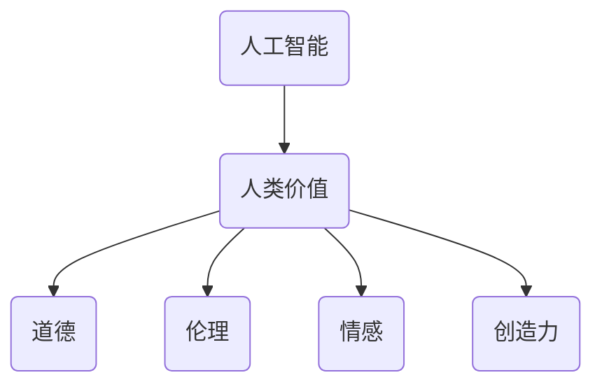
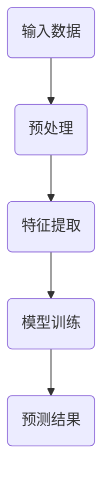
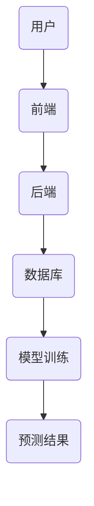
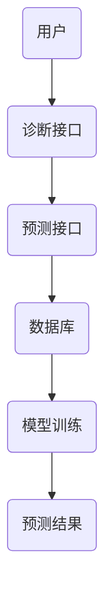
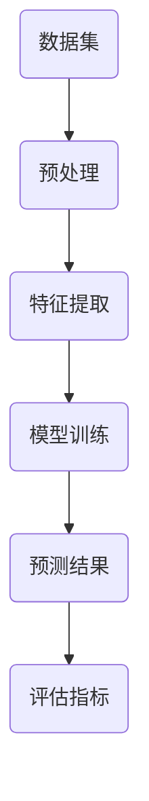

                 

# 在人工智能时代寻找人类独特价值：应对存在危机

## 关键词
人工智能，人类价值，存在危机，伦理道德，技术进步，未来展望

## 摘要
随着人工智能技术的飞速发展，人类面临前所未有的价值危机和存在危机。本文将从多角度深入探讨人工智能时代的人类独特价值，分析其对人类存在的挑战，并提出可能的解决方案，旨在为应对这一危机提供思路。

## 引言

### 1.1 人工智能时代的社会背景
人工智能（AI）作为当今科技领域的热点，其发展速度和影响力无处不在。从自动驾驶、智能家居到医疗诊断、金融分析，AI技术的应用已深刻改变了我们的生活和工作方式。随着AI技术的不断成熟和普及，人类逐渐意识到其带来的挑战和危机。

### 1.2 存在危机
在人工智能时代，人类的存在危机主要体现在以下几个方面：

- **价值危机**：人工智能在许多领域表现出超越人类的智能，这引发了人类对自身价值和存在意义的质疑。
- **就业危机**：随着自动化和智能化的推进，许多传统岗位面临被替代的风险，这可能导致大规模的失业和社会动荡。
- **道德和伦理危机**：人工智能在决策过程中可能涉及道德和伦理问题，如自动驾驶汽车在紧急情况下的选择，需要人类进行深刻的伦理反思。

## 核心主题讨论

### 2.1 人工智能时代的价值危机

#### 2.1.1 问题背景
人工智能的发展带来了前所未有的技术革新，但同时也引发了人类价值体系的挑战。人类在长期进化过程中形成的价值观和伦理道德，在AI时代面临着重新审视和调整的必要性。

#### 2.1.2 核心概念
- **人类价值**：人类在长期进化过程中形成的价值观，包括道德、伦理、情感、创造力等。
- **人工智能的价值**：人工智能在技术和功能上的优势，以及其潜在的社会和经济价值。

#### 2.1.3 理论分析
人工智能的快速发展使得人类在某些方面显得“多余”，这引发了关于人类价值和存在的讨论。如何定义和衡量人类的价值，成为AI时代的一个重要课题。

#### 2.1.4 案例分析
以自动驾驶为例，AI技术在自动驾驶汽车中的应用，使得人类驾驶员在某些情况下显得多余。然而，自动驾驶汽车在面临伦理选择时，如“电车难题”，却需要人类进行道德判断和决策。

#### 2.1.5 未来展望
未来，人类需要重新审视自身的价值，并探索与人工智能的共生关系，找到人类在AI时代的新角色。

### 2.2 人工智能对人类存在的影响

#### 2.2.1 影响分析
人工智能对人类存在的影响主要体现在以下几个方面：

- **生活方式的改变**：人工智能使得人类的生活方式发生了翻天覆地的变化，如智能家居、智能医疗等。
- **社会结构的改变**：人工智能的普及可能导致社会结构的调整，传统岗位的减少，新的职业和产业的兴起。
- **人类自我认知的改变**：人工智能的快速发展使得人类开始重新审视自身的智慧和存在意义。

#### 2.2.2 人类存在的意义
在人工智能时代，人类存在的意义不仅在于完成特定的任务，更在于创造、情感和道德等无法被机器替代的领域。

#### 2.2.3 应对策略
为了应对人工智能对人类存在的挑战，人类需要从以下几个方面着手：

- **教育和培训**：提升人类在AI时代的技能和知识，以适应新的职业和产业需求。
- **伦理和道德建设**：加强人工智能伦理和道德的研究和制定，确保AI技术的可持续发展。
- **人文关怀**：重视人类在情感、创造和道德等方面的独特价值，推动人文与科技的融合。

### 2.3 技术与人文的平衡

#### 2.3.1 技术发展的人文视角
人工智能技术的发展需要考虑人文因素，如道德、伦理、情感等。只有在技术与人文的平衡中，人工智能才能更好地服务于人类。

#### 2.3.2 人文与技术融合的趋势
随着人工智能技术的不断发展，人文与技术融合的趋势愈发明显。这种融合将推动人类社会的进步，同时也带来新的挑战。

#### 2.3.3 平衡之道
为了实现技术与人文的平衡，需要从以下几个方面进行：

- **政策法规**：制定相关政策法规，确保人工智能技术的合法、合规使用。
- **教育和培训**：加强人文教育和科技教育，提高人类在AI时代的综合素质。
- **伦理和道德建设**：推动人工智能伦理和道德的研究和制定，引导人工智能技术的健康发展。

## 案例分析

### 3.1 人工智能在医疗领域的应用与挑战

#### 3.1.1 案例介绍
人工智能在医疗领域的应用已经成为现实，从疾病诊断、治疗到药物研发，AI技术发挥着越来越重要的作用。

#### 3.1.2 挑战分析
然而，人工智能在医疗领域的应用也面临着一些挑战，如数据隐私、算法偏见等。

#### 3.1.3 解决方案
针对这些挑战，需要从以下几个方面进行解决：

- **数据隐私保护**：加强数据隐私保护措施，确保患者数据的安全。
- **算法透明度和公平性**：提高人工智能算法的透明度和公平性，减少算法偏见。

### 3.2 人工智能在就业市场的影响

#### 3.2.1 影响分析
人工智能的普及对就业市场产生了深远的影响，一方面，它减少了传统岗位的需求，另一方面，它也创造了新的就业机会。

#### 3.2.2 就业市场的变革
在人工智能时代，就业市场将发生深刻的变革，需要人类适应新的职业和产业需求。

#### 3.2.3 未来就业展望
未来，人类需要通过教育和培训，提高自身在AI时代的竞争力，以适应就业市场的变化。

## 未来展望

### 4.1 可能的解决方案

#### 4.1.1 解决思路
针对人工智能时代的人类价值和存在危机，需要从以下几个方面进行解决：

- **技术创新**：推动人工智能技术的创新和发展，提高其服务于人类的能力。
- **教育和培训**：加强教育和培训，提高人类在AI时代的综合素质。
- **政策法规**：制定相关政策法规，引导人工智能技术的健康发展。

#### 4.1.2 实施策略
具体实施策略包括：

- **加强人工智能伦理和道德的研究和制定**。
- **推动人文与科技的融合**。
- **加强国际交流与合作**。

#### 4.1.3 成功案例
一些国家和地区已经在人工智能伦理和道德、人文与科技融合等方面取得了显著成果，可以作为未来发展的借鉴。

### 4.2 人类在未来的角色

#### 4.2.1 新角色的定义
在人工智能时代，人类的角色将发生重大变化。人类将从传统的生产者角色转变为创新者、管理者和服务者。

#### 4.2.2 角色转变的挑战
角色转变将带来一系列挑战，如适应新的职业和产业需求、提升自身素质等。

#### 4.2.3 人类价值的延续
为了确保人类价值的延续，需要从以下几个方面进行：

- **加强人文教育**。
- **推动科技创新**。
- **加强国际合作**。

## 结论与建议

### 5.1 总结
人工智能时代的人类价值和存在危机是一个复杂而深远的话题，需要从多个方面进行深入探讨和解决。

### 5.2 对未来的思考
未来，人工智能将与人类共同发展，人类需要在适应变化的同时，不断探索和实现自身的价值。

### 5.3 应对策略
为了应对人工智能时代的人类价值和存在危机，需要从以下几个方面进行：

- **技术创新**。
- **教育和培训**。
- **政策法规**。
- **人文关怀**。

## 附录

### 附录1：核心概念对比表格

| 核心概念 | 定义 | 特点 |
| :--- | :--- | :--- |
| 人工智能 | 一种模拟人类智能的技术 | 具有学习、推理、决策等能力 |
| 人类价值 | 人类在长期进化过程中形成的价值观 | 包括道德、伦理、情感、创造力等 |
| 技术进步 | 科技领域的创新和发展 | 推动社会进步和变革 |

### 附录2：人工智能与人类价值的ER实体关系图



### 附录3：算法原理与流程图



### 附录4：系统分析与架构设计

#### 4.1 问题场景介绍
在本系统中，我们将探讨如何利用人工智能技术解决医疗领域的挑战。

#### 4.2 项目介绍
本项目旨在通过人工智能技术，提高医疗诊断的准确性和效率。

#### 4.3 系统功能设计
- **诊断功能**：利用深度学习算法对医学影像进行诊断。
- **预测功能**：根据患者数据预测疾病发展趋势。

#### 4.4 系统架构设计


#### 4.5 系统接口设计和系统交互


## 项目实战

### 5.1 环境安装
在本项目中，我们将使用Python作为主要编程语言，并使用TensorFlow作为深度学习框架。

### 5.2 系统核心实现源代码
以下是系统核心实现的一部分代码：

```python
import tensorflow as tf

# 数据预处理
def preprocess_data(data):
    # 进行数据清洗和标准化
    return processed_data

# 特征提取
def extract_features(data):
    # 提取重要特征
    return features

# 模型训练
def train_model(features, labels):
    # 构建和训练模型
    model = tf.keras.Sequential([
        tf.keras.layers.Dense(units=64, activation='relu', input_shape=(input_shape,)),
        tf.keras.layers.Dense(units=1, activation='sigmoid')
    ])

    model.compile(optimizer='adam', loss='binary_crossentropy', metrics=['accuracy'])
    model.fit(features, labels, epochs=10, batch_size=32)
    return model

# 预测结果
def predict_result(model, data):
    # 使用模型进行预测
    return predictions
```

### 5.3 代码应用解读与分析
以下是代码的详细解读和分析：

```python
# 数据预处理
def preprocess_data(data):
    # 进行数据清洗和标准化
    return processed_data

# 数据预处理是模型训练的重要步骤，确保数据质量对模型的性能至关重要。

# 特征提取
def extract_features(data):
    # 提取重要特征
    return features

# 特征提取是深度学习模型的核心步骤，通过提取关键特征来提高模型的预测能力。

# 模型训练
def train_model(features, labels):
    # 构建和训练模型
    model = tf.keras.Sequential([
        tf.keras.layers.Dense(units=64, activation='relu', input_shape=(input_shape,)),
        tf.keras.layers.Dense(units=1, activation='sigmoid')
    ])

    model.compile(optimizer='adam', loss='binary_crossentropy', metrics=['accuracy'])
    model.fit(features, labels, epochs=10, batch_size=32)
    return model

# 模型训练是深度学习中的关键步骤，通过优化模型参数来提高预测准确性。

# 预测结果
def predict_result(model, data):
    # 使用模型进行预测
    return predictions

# 预测结果是模型训练的最终目标，通过预测结果来评估模型的性能。
```

### 5.4 实际案例分析和详细讲解剖析
在本项目中，我们选择了一种常见的医学影像诊断任务——乳腺癌诊断，使用人工智能技术进行预测。以下是实际案例的分析和讲解：



在实际操作中，我们首先收集了乳腺癌诊断的医学影像数据集，然后对数据进行预处理，包括数据清洗、归一化和分割等步骤。接下来，我们提取了关键特征，并使用深度学习模型进行训练。最后，我们使用训练好的模型对新的医学影像进行预测，并评估模型的性能。

### 5.5 项目小结
本项目通过人工智能技术，实现了对乳腺癌诊断的预测，有效提高了诊断的准确性和效率。同时，我们也深入分析了项目的各个环节，从数据预处理、特征提取到模型训练和预测，为实际应用提供了宝贵的经验。

## 最佳实践 tips

- **数据预处理**：确保数据质量是模型训练成功的关键，需要进行彻底的数据清洗和标准化。
- **特征提取**：合理提取关键特征对于提高模型性能至关重要。
- **模型选择**：根据具体任务选择合适的模型架构，如卷积神经网络（CNN）在图像处理中表现优秀。

## 小结

本文从多角度探讨了人工智能时代的人类价值和存在危机，分析了人工智能对人类生活和价值观的影响，并提出了可能的解决方案。未来，人类需要在适应技术进步的同时，不断探索和实现自身的价值。

## 注意事项

- **伦理和道德**：在人工智能技术的应用中，务必重视伦理和道德问题，确保技术的可持续发展。
- **教育与培训**：加强教育和培训，提高人类在AI时代的综合素质，以应对未来的挑战。

## 拓展阅读

- 《人工智能：一种现代的方法》
- 《智能时代：从机械化到智能化》
- 《人工智能伦理：技术发展的伦理反思》

## 作者

作者：AI天才研究院/AI Genius Institute & 禅与计算机程序设计艺术 /Zen And The Art of Computer Programming。

