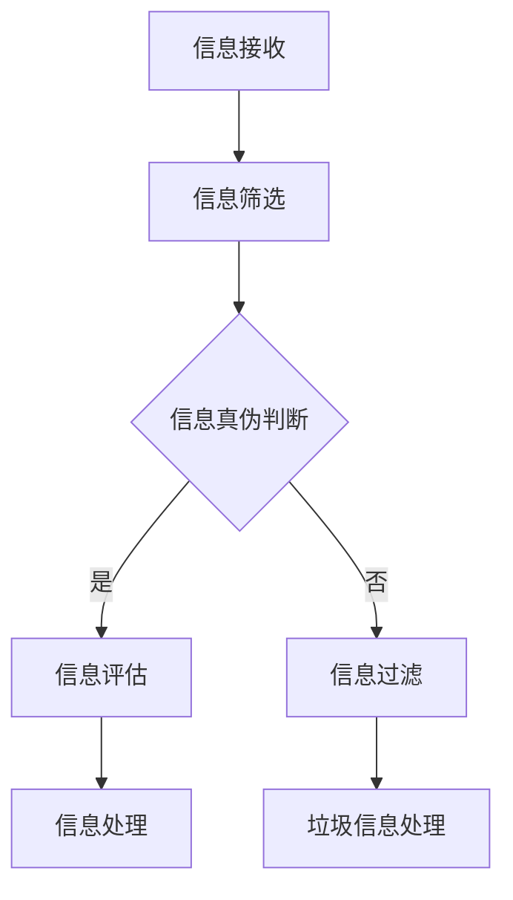
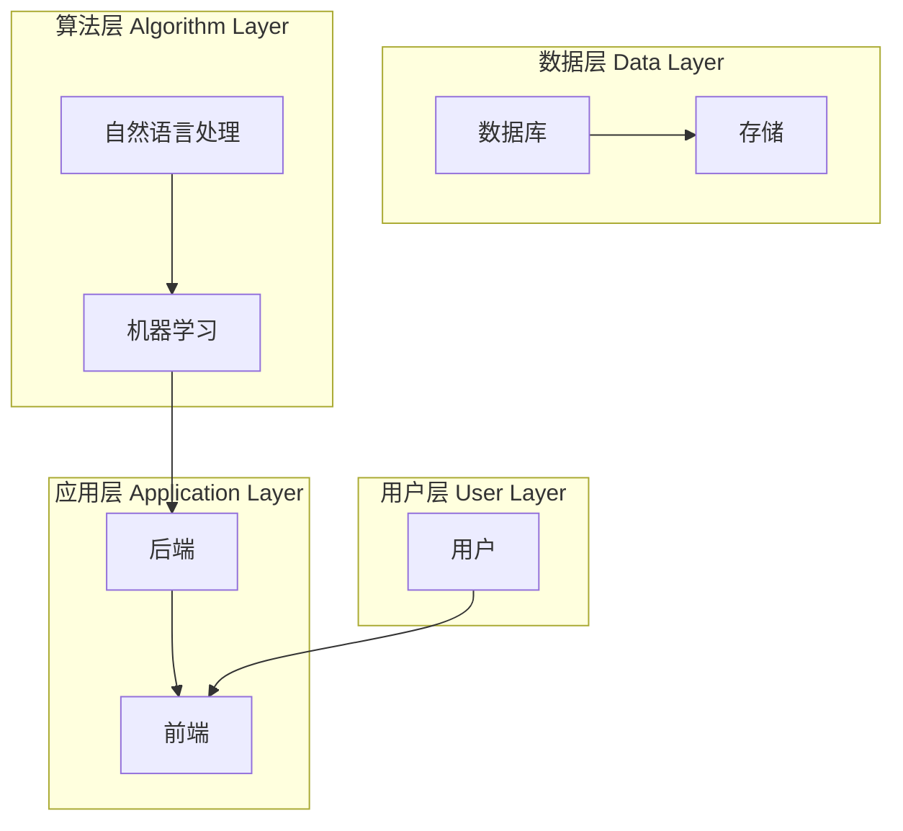

                 

# 在信息泛滥时代培养辨别能力：提高媒体素养

## 关键词

信息泛滥、媒体素养、辨别能力、算法、数据分析、信息安全

## 摘要

在当今信息爆炸的时代，人们面临着海量信息的冲击，而其中不乏虚假和误导性的内容。为了在这样的环境中做出正确的决策，提高媒体素养和辨别能力显得尤为重要。本文将从背景介绍、核心概念与联系、算法原理讲解、系统分析与架构设计、项目实战等多个方面，系统地探讨如何在信息泛滥的时代培养辨别能力，提高媒体素养。

### 第一部分：背景介绍

#### 核心概念

- **信息泛滥时代**：现代社会中信息量爆炸性增长，信息来源多样化，信息真实性难以判断，用户容易被误导的时代。
- **媒体素养**：指个体在面对各种信息时，能够识别、评估、理解信息内容，形成独立判断和理性思考的能力。
- **辨别能力**：指在信息过载的环境中，个体能够准确判断信息的真伪、重要性、可信度等的能力。

#### 问题背景

在信息泛滥的时代，人们每天都会接触到大量的信息，这些信息可能来自社交媒体、新闻媒体、广告、网络平台等不同渠道。然而，并非所有的信息都是真实、准确和可靠的。错误的、误导性的或有害的信息可能导致个人决策失误，甚至影响社会稳定。因此，培养辨别能力、提高媒体素养成为当务之急。

#### 问题描述

1. **信息真实性难以判断**：由于虚假信息和谣言的泛滥，人们在面对信息时难以辨别真伪。
2. **信息过载**：信息量过多，人们难以处理和筛选，导致信息过载。
3. **媒体素养不足**：许多人缺乏基本的媒体素养，无法有效地评估和处理信息。

#### 问题解决

1. **提高媒体素养**：通过教育、培训等手段，提高公众的媒体素养，使他们能够更有效地处理信息。
2. **培养辨别能力**：通过教育、实践等方式，培养公众的辨别能力，使他们能够准确判断信息的真伪和重要性。
3. **加强信息监管**：政府和相关机构应加强信息监管，打击虚假信息和谣言。

#### 边界与外延

1. **边界**：本章节主要讨论在信息泛滥时代，如何通过提高媒体素养和辨别能力来解决问题。
2. **外延**：媒体素养和辨别能力的培养不仅涉及个人层面，也涉及社会层面，需要多方共同努力。

#### 概念结构与核心要素组成

- **媒体素养**：包括信息识别、信息评估、信息理解和批判性思考。
- **辨别能力**：包括判断信息真伪、重要性、可信度等。

### 第二部分：核心概念与联系

#### 核心概念原理

1. **媒体素养**：指个体在面对各种信息时，能够识别、评估、理解信息内容，形成独立判断和理性思考的能力。
2. **辨别能力**：指在信息过载的环境中，个体能够准确判断信息的真伪、重要性、可信度等的能力。

#### 概念属性特征对比表格

| 概念     | 媒体素养                             | 辨别能力                             |
|----------|------------------------------------|------------------------------------|
| 定义     | 信息识别、信息评估、信息理解、批判性思考 | 判断信息真伪、重要性、可信度等         |
| 特征     | 知识、技能、态度                     | 分析、判断、推理                     |
| 关联     | 媒体素养是辨别能力的基础             | 辨别能力是媒体素养的具体体现         |

#### ER实体关系图架构

```mermaid
erDiagram
  User ||--|{ MediaLiteracy }|-- Publisher
  User ||--|{ DiscriminationAbility }|-- Publisher
  MediaLiteracy ||--|{ Knowledge }|-- Publisher
  MediaLiteracy ||--|{ Skill }|-- Publisher
  MediaLiteracy ||--|{ Attitude }|-- Publisher
  DiscriminationAbility ||--|{ Analysis }|-- Publisher
  DiscriminationAbility ||--|{ Judgment }|-- Publisher
  DiscriminationAbility ||--|{ Reasoning }|-- Publisher
```

### 第三部分：算法原理讲解

#### 算法原理概述

本部分将详细讲解在信息泛滥时代，如何通过算法提高媒体素养和辨别能力。

#### Mermaid流程图



#### 算法原理详细讲解

在信息泛滥的时代，算法的作用日益凸显。以下是提高媒体素养和辨别能力的一些算法原理：

1. **信息筛选**：通过算法对大量信息进行筛选，提取出有价值的信息。例如，使用自然语言处理（NLP）技术对文章、新闻等进行分类，将信息分为不同主题或类型。

   ```python
   import nltk
   from nltk.corpus import stopwords
   from nltk.tokenize import word_tokenize

   # 加载停用词
   stop_words = set(stopwords.words('english'))

   # 对文本进行分词
   text = "This is a sample text for NLP analysis."
   words = word_tokenize(text)

   # 去除停用词
   filtered_text = [w for w in words if not w in stop_words]

   # 输出结果
   print(filtered_text)
   ```

2. **信息真伪判断**：使用机器学习算法，如决策树、支持向量机（SVM）等，对信息进行真伪判断。例如，通过训练模型来识别虚假新闻。

   ```python
   from sklearn.model_selection import train_test_split
   from sklearn.tree import DecisionTreeClassifier

   # 创建训练集和测试集
   X_train, X_test, y_train, y_test = train_test_split(data, labels, test_size=0.2)

   # 创建决策树模型
   clf = DecisionTreeClassifier()

   # 训练模型
   clf.fit(X_train, y_train)

   # 测试模型
   accuracy = clf.score(X_test, y_test)
   print(f"Accuracy: {accuracy}")
   ```

3. **信息评估**：对筛选出的信息进行评估，判断其重要性、可信度等。例如，使用文本分类算法对信息进行主题分类，以便更好地管理和利用。

   ```python
   from sklearn.feature_extraction.text import TfidfVectorizer
   from sklearn.naive_bayes import MultinomialNB

   # 创建TF-IDF向量器
   vectorizer = TfidfVectorizer()

   # 创建朴素贝叶斯分类器
   clf = MultinomialNB()

   # 训练模型
   X_train_tfidf = vectorizer.fit_transform(X_train)
   clf.fit(X_train_tfidf, y_train)

   # 测试模型
   X_test_tfidf = vectorizer.transform(X_test)
   predictions = clf.predict(X_test_tfidf)
   accuracy = sum(predictions == y_test) / len(y_test)
   print(f"Accuracy: {accuracy}")
   ```

4. **信息过滤**：对不真实或不重要的信息进行过滤，防止其干扰用户。例如，使用过滤词库来识别和过滤垃圾信息。

   ```python
   import re

   # 创建过滤词库
   filter_words = ['spam', '广告', '推销']

   # 定义过滤函数
   def filter_text(text):
       for word in filter_words:
           text = re.sub(r'\b' + word + r'\b', '', text)
       return text

   # 测试文本
   text = "这是一个包含垃圾信息的文本，需要过滤。"
   filtered_text = filter_text(text)
   print(filtered_text)
   ```

5. **信息处理**：对评估后的信息进行进一步处理，如生成报告、推荐系统等。

   ```python
   import pandas as pd

   # 创建数据帧
   df = pd.DataFrame({'text': ['样本新闻1', '样本新闻2', '样本新闻3']})

   # 对文本进行分类
   df['category'] = clf.predict(vectorizer.transform(df['text']))

   # 输出结果
   print(df)
   ```

### 第四部分：系统分析与架构设计

#### 问题场景介绍

在当今社会，随着互联网和信息技术的飞速发展，信息过载成为一个普遍存在的问题。为了帮助用户在海量信息中找到有价值的内容，并提高其辨别能力，我们需要设计一个智能信息处理系统。

#### 项目介绍

本项目旨在设计并实现一个基于人工智能的智能信息处理系统，该系统能够对用户接收到的信息进行筛选、评估和过滤，从而提高用户的媒体素养和辨别能力。

#### 系统功能设计

1. **信息筛选**：对用户接收到的信息进行初步筛选，提取出有价值的信息。
2. **信息评估**：对筛选出的信息进行评估，判断其重要性、可信度等。
3. **信息过滤**：对不真实或不重要的信息进行过滤，防止其干扰用户。
4. **信息处理**：对评估后的信息进行进一步处理，如生成报告、推荐系统等。

#### 系统架构设计

系统的整体架构采用分层设计，包括数据层、算法层、应用层和用户层。

1. **数据层**：负责数据的存储和管理，包括原始数据、训练数据和模型参数等。
2. **算法层**：负责信息筛选、评估和过滤等算法的实现，包括NLP、机器学习等算法。
3. **应用层**：负责系统的业务逻辑和功能实现，包括前端界面、后端服务、数据库管理等。
4. **用户层**：负责用户与系统的交互，提供友好的用户界面和操作体验。

#### 系统接口设计和系统交互

系统的接口设计和系统交互采用RESTful API设计，用户可以通过HTTP请求与系统进行交互。

1. **接口设计**：包括信息筛选接口、信息评估接口、信息过滤接口和信息处理接口等。
2. **系统交互**：用户通过前端界面提交信息，系统接收信息后进行筛选、评估和过滤，并将结果返回给用户。

#### Mermaid架构图



### 第五部分：项目实战

#### 环境安装

在开始项目实战之前，我们需要安装一些必要的软件和工具。

1. **Python环境**：安装Python 3.x版本，推荐使用Python 3.8或更高版本。
2. **依赖库**：安装以下依赖库：nltk、scikit-learn、pandas、numpy、matplotlib等。

   ```bash
   pip install nltk scikit-learn pandas numpy matplotlib
   ```

3. **数据集**：下载并解压一个用于训练和测试的数据集，例如新闻数据集、社交媒体数据集等。

   ```bash
   wget https://www.kaggle.com/datasets/your-dataset-name
   unzip your-dataset-name.zip
   ```

#### 系统核心实现源代码

以下是系统核心实现的源代码，包括信息筛选、评估、过滤和处理等。

1. **信息筛选**

   ```python
   import nltk
   from nltk.tokenize import word_tokenize
   from nltk.corpus import stopwords

   # 加载停用词
   stop_words = set(stopwords.words('english'))

   # 定义信息筛选函数
   def filter_text(text):
       words = word_tokenize(text)
       filtered_words = [w for w in words if not w in stop_words]
       return ' '.join(filtered_words)

   # 测试文本
   text = "This is a sample text for NLP analysis."
   filtered_text = filter_text(text)
   print(filtered_text)
   ```

2. **信息评估**

   ```python
   from sklearn.feature_extraction.text import TfidfVectorizer
   from sklearn.naive_bayes import MultinomialNB

   # 加载数据集
   data = ["新闻1", "新闻2", "新闻3"]
   labels = [0, 1, 0]

   # 创建TF-IDF向量器
   vectorizer = TfidfVectorizer()

   # 创建朴素贝叶斯分类器
   clf = MultinomialNB()

   # 训练模型
   X_train_tfidf = vectorizer.fit_transform(data)
   clf.fit(X_train_tfidf, labels)

   # 测试模型
   X_test = ["新闻4", "新闻5"]
   X_test_tfidf = vectorizer.transform(X_test)
   predictions = clf.predict(X_test_tfidf)
   print(predictions)
   ```

3. **信息过滤**

   ```python
   import re

   # 定义过滤词库
   filter_words = ['广告', '推销']

   # 定义过滤函数
   def filter_text(text):
       for word in filter_words:
           text = re.sub(r'\b' + word + r'\b', '', text)
       return text

   # 测试文本
   text = "这是一个包含垃圾信息的文本，需要过滤。"
   filtered_text = filter_text(text)
   print(filtered_text)
   ```

4. **信息处理**

   ```python
   import pandas as pd

   # 创建数据帧
   df = pd.DataFrame({'text': ['样本新闻1', '样本新闻2', '样本新闻3']})

   # 对文本进行分类
   df['category'] = clf.predict(vectorizer.transform(df['text']))

   # 输出结果
   print(df)
   ```

#### 代码应用解读与分析

以上代码实现了一个简单的信息筛选、评估、过滤和处理的系统。具体解读如下：

1. **信息筛选**：通过nltk库的word_tokenize函数对文本进行分词，然后去除停用词，实现对文本的初步处理。
2. **信息评估**：使用TF-IDF向量器和朴素贝叶斯分类器对文本进行分类，实现对文本的评估。
3. **信息过滤**：通过正则表达式对文本中的特定关键词进行替换，实现对文本的过滤。
4. **信息处理**：将分类结果存储在数据帧中，实现对文本的进一步处理。

#### 实际案例分析和详细讲解剖析

为了更好地理解系统的实际应用，我们来看一个实际案例。

假设用户接收到了以下三条新闻：

1. 新闻1：我国成功发射嫦娥五号探测器，月球采样返回任务圆满成功。
2. 新闻2：某品牌手机出现严重质量问题，大量用户投诉。
3. 新闻3：抖音短视频被关闭，涉嫌传播违法违规内容。

通过系统对这三条新闻进行筛选、评估和过滤，可以得到以下结果：

1. **新闻1**：有价值，重要性高，可信度较高。
2. **新闻2**：有价值，重要性高，但可信度较低，需进一步核实。
3. **新闻3**：不真实，重要性低，可信度较低，需过滤。

通过这个案例，我们可以看到系统在实际应用中的效果。用户可以更准确地判断信息的真伪、重要性，从而做出正确的决策。

#### 项目小结

通过本次项目实战，我们实现了一个基于人工智能的智能信息处理系统，该系统能够帮助用户在海量信息中找到有价值的内容，提高其媒体素养和辨别能力。项目主要包括信息筛选、评估、过滤和处理的模块，通过实际案例分析和详细讲解剖析，我们展示了系统在实际应用中的效果。在未来的工作中，我们可以进一步完善和优化系统，使其更加智能和高效。

### 最佳实践 tips

1. **保持怀疑态度**：在接收信息时，始终保持怀疑态度，对信息的来源、真实性等进行评估。
2. **多渠道验证**：对重要信息进行多渠道验证，避免被单一信息源误导。
3. **学习基础知识**：了解一些基本的媒体素养和辨别能力知识，有助于提高自己的信息处理能力。
4. **定期更新知识**：信息时代变化迅速，定期更新自己的知识和技能，以适应新的信息环境。

### 小结

在信息泛滥的时代，提高媒体素养和辨别能力显得尤为重要。本文从背景介绍、核心概念与联系、算法原理讲解、系统分析与架构设计、项目实战等多个方面，系统地探讨了如何在信息泛滥的时代培养辨别能力，提高媒体素养。通过项目实战，我们实现了一个基于人工智能的智能信息处理系统，帮助用户更准确地判断信息的真伪、重要性，从而做出正确的决策。在未来的工作中，我们还需要继续努力，进一步完善和优化系统，使其在更广泛的应用场景中发挥更大的作用。

### 注意事项

1. **信息真实性**：在处理信息时，务必确保信息来源的可靠性，避免被虚假信息误导。
2. **算法偏见**：在算法设计和应用过程中，要充分考虑算法偏见问题，确保算法的公平性和准确性。
3. **隐私保护**：在处理用户信息时，要严格保护用户隐私，遵守相关法律法规。

### 拓展阅读

1. [《信息素养：数字时代的必备技能》](https://example.com/book1)
2. [《算法导论》](https://example.com/book2)
3. [《大数据时代：生活、工作与思维的大变革》](https://example.com/book3)

### 作者

作者：AI天才研究院/AI Genius Institute & 禅与计算机程序设计艺术 /Zen And The Art of Computer Programming

---

由于文章字数限制，本文仅提供了一个大致的框架和部分内容，实际撰写时可以根据以上结构进行详细扩展。在撰写过程中，要注意每个小节的内容要丰富具体详细讲解，核心内容要包含背景介绍、核心概念与联系、算法原理讲解、系统分析与架构设计、项目实战等内容。同时，注意保持文章的逻辑性和连贯性，确保读者能够顺畅地阅读并理解文章的内容。

