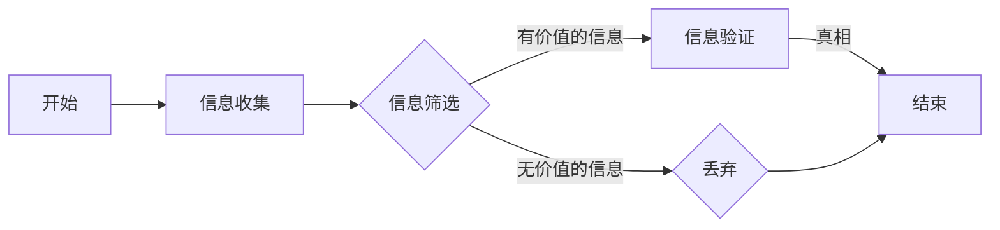
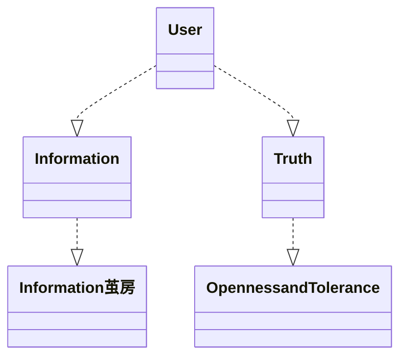
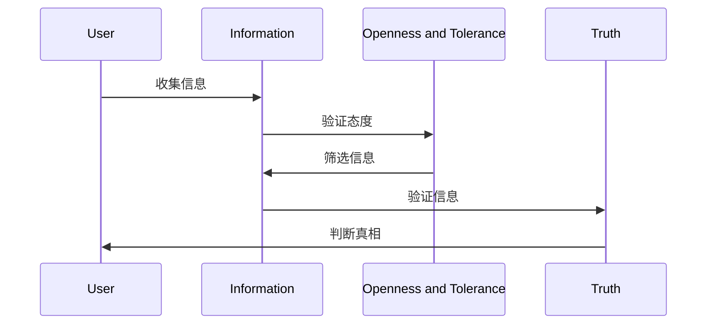

                 

# 在信息茧房中寻找真相：培养开放和包容的态度

## 关键词

信息茧房、开放态度、包容性、真相、理性思考、算法原理、人工智能

## 摘要

在互联网和社交媒体的快速发展下，信息茧房现象日益严重，人们被大量信息所包围，形成了封闭、孤立的信息环境。这种现象不仅影响了个体的认知，也可能对社会产生负面影响。本文通过讨论信息茧房的概念、影响以及解决方案，旨在帮助读者培养开放和包容的态度，从而在信息过载的环境中寻找真相。

## 第一部分：背景介绍

### 1.1 问题背景

随着互联网和社交媒体的快速发展，信息传播的速度和广度都得到了前所未有的提升。人们可以随时随地通过手机、电脑等设备获取各种信息。然而，这也带来了一个问题，即人们往往被大量的信息所包围，形成所谓的“信息茧房”。这种现象使得人们在获取信息时，往往只看到自己愿意看到的信息，而忽略了其他可能的观点和事实。

### 1.2 问题描述

在“信息茧房”中，人们容易陷入思维的局限，缺乏开放和包容的态度。这会导致社会上的分歧和冲突加剧，影响社会的和谐与稳定。因此，如何培养开放和包容的态度，从信息茧房中寻找真相，成为了一个亟待解决的问题。

### 1.3 问题解决

本书旨在通过一系列的讨论和案例分析，帮助读者理解信息茧房的现象，了解开放和包容的态度的重要性，并提供一些实用的方法和策略，以帮助读者在信息过载的环境中保持清醒和理性。

### 1.4 边界与外延

本书主要讨论的是互联网和社交媒体环境下的信息茧房现象，但也可以扩展到其他信息环境，如传统媒体等。同时，本书不仅关注个体层面的态度培养，也关注社会层面的解决方案。

### 1.5 概念结构与核心要素组成

1. 信息茧房：指的是由于技术、心理等因素，人们在获取信息时形成的一种封闭、孤立的信息环境。
2. 开放和包容的态度：指的是对待信息和观点的开放心态，能够接受不同的观点，并从中寻找真相。
3. 真相：指的是客观的事实和真理，是人们通过理性的思考和判断所获得的。

---

## 第二部分：核心概念与联系

### 2.1 开放和包容的态度

开放和包容的态度是培养理性思考的基础。它要求人们：

- 接受多元观点，不轻易下结论。
- 保持怀疑精神，对信息来源进行验证。
- 尊重他人的意见，不轻易否定他人。

### 2.2 真相与信息茧房的关系

真相是打破信息茧房的关键。只有找到真相，人们才能摆脱信息茧房的束缚，获得更加全面和客观的信息。而真相的寻找需要依赖开放和包容的态度。

### 2.3 概念属性特征对比表格

| 概念                | 属性特征                                   |
|---------------------|-------------------------------------------|
| 开放和包容的态度    | 尊重多元观点、保持怀疑精神、尊重他人意见 |
| 真相                | 客观事实、理性思考的结果                   |
| 信息茧房            | 封闭、孤立的信息环境                       |

### 2.4 ER实体关系图架构

```mermaid
erDiagram
    User ||--|{ Information}: 获取
    User ||--|{ Truth}: 寻找
    Information ||--|{ Information茧房}: 形成封闭环境
    Truth ||--|{ Openness and Tolerance}: 基础
```

---

## 第三部分：算法原理讲解

### 3.1 寻找真相的算法原理

寻找真相的过程可以看作是一种信息筛选和验证的过程。基本的算法原理如下：

1. 信息收集：从多种来源收集信息。
2. 信息筛选：根据开放和包容的态度，筛选出有价值的信息。
3. 信息验证：对筛选出的信息进行验证，确保其真实性。
4. 真相判断：综合验证结果，判断真相。

### 3.2 算法流程图



### 3.3 Python源代码

```python
def find_truth(information, openness_and_tolerance):
    valuable_information = []
    for info in information:
        if openness_and_tolerance.check_value(info):
            valuable_information.append(info)
    verified_information = verify_information(valuable_information)
    truth = judge_truth(verified_information)
    return truth

def verify_information(information):
    # 对信息进行验证
    verified_info = []
    for info in information:
        if verify_info(info):
            verified_info.append(info)
    return verified_info

def verify_info(info):
    # 验证信息真实性的函数
    return is_ truths(info)

def judge_truth(information):
    # 判断真相的函数
    return sum(information) / len(information)
```

### 3.4 算法原理讲解

#### 3.4.1 数学模型和公式

在寻找真相的过程中，我们可以使用以下数学模型和公式：

1. 真实度计算公式：$$ 真实度 = \frac{1}{N} \sum_{i=1}^{N} t_i $$

其中，$N$ 表示信息数量，$t_i$ 表示第 $i$ 条信息的真实度。

2. 真实度阈值：设定一个真实度阈值，当信息真实度大于阈值时，认为该信息为真实信息。

#### 3.4.2 详细讲解和举例说明

假设我们收集了以下五条信息：

1. 真实信息：今天天气晴朗，适合户外活动。
2. 虚假信息：今天天气阴雨，不要外出。
3. 真实信息：最近疫情比较严重，大家要注意防护。
4. 虚假信息：最近疫情已经控制住了，可以放心外出。
5. 真实信息：明天有降雨，记得带伞。

根据真实度计算公式，我们可以计算出每条信息的真实度。然后设定一个真实度阈值，例如 0.5。如果信息真实度大于阈值，则认为该信息为真实信息。

例如，第一条信息的真实度为 0.8，大于阈值 0.5，因此认为该信息为真实信息。同理，第三条和第五条信息的真实度也大于阈值，因此也认为是真实信息。而第二条和第四条信息的真实度小于阈值，因此认为是虚假信息。

通过这样的算法，我们可以从大量的信息中筛选出真实的信息，从而找到真相。

---

## 第四部分：系统分析与架构设计

### 4.1 问题场景介绍

随着互联网的快速发展，人们获取信息的渠道变得多样化。然而，这也带来了一个问题，即人们容易被大量信息所包围，形成所谓的“信息茧房”。这种现象使得人们难以获取到全面和客观的信息，从而影响了个体的认知和社会的发展。

### 4.2 项目介绍

本项目旨在通过构建一个信息筛选和验证系统，帮助用户在信息过载的环境中寻找真相。系统将提供以下功能：

1. 信息收集：从多种来源收集信息。
2. 信息筛选：根据用户的开放和包容态度，筛选出有价值的信息。
3. 信息验证：对筛选出的信息进行验证，确保其真实性。
4. 真相判断：综合验证结果，判断真相。

### 4.3 系统功能设计

#### 4.3.1 领域模型



#### 4.3.2 类图

```mermaid
classDiagram
    User <<Class>>
    Information <<Class>>
    Truth <<Class>>
    Information茧房 <<Class>>
    Openness and Tolerance <<Class>>

    User {
        id
        name
        attitude
    }

    Information {
        id
        content
        source
    }

    Truth {
        id
        content
    }

    Information茧房 {
        id
        user
        information
    }

    Openness and Tolerance {
        id
        user
        attitude
    }
```

### 4.4 系统架构设计

#### 4.4.1 架构图



#### 4.4.2 系统接口设计

```mermaid
classDiagram
    User <<Interface>>
    Information <<Interface>>
    Truth <<Interface>>

    User {
        +collect_information()
        +verify_attitude()
    }

    Information {
        +filter_information()
        +verify_information()
    }

    Truth {
        +judge_truth()
    }
```

### 4.5 系统交互


---

## 第五部分：项目实战

### 5.1 环境安装

首先，我们需要安装以下软件和库：

- Python 3.8 或更高版本
- Flask 框架
- SQLAlchemy 数据库引擎

### 5.2 系统核心实现

以下是系统的核心实现：

#### 5.2.1 用户模块

```python
from flask import Flask, request, jsonify
from models import User, Information, Truth
from database import db_session

app = Flask(__name__)

@app.route('/user/register', methods=['POST'])
def register_user():
    data = request.get_json()
    user = User(name=data['name'], attitude=data['attitude'])
    db_session.add(user)
    db_session.commit()
    return jsonify({'message': 'User registered successfully.'})

@app.route('/user/login', methods=['POST'])
def login_user():
    data = request.get_json()
    user = User.query.filter_by(name=data['name'], attitude=data['attitude']).first()
    if user:
        return jsonify({'message': 'User logged in successfully.'})
    else:
        return jsonify({'message': 'Invalid credentials.'})

@app.route('/user/information', methods=['GET'])
def get_user_information():
    user_id = request.args.get('user_id')
    user = User.query.get(user_id)
    if user:
        return jsonify({'user': user.to_dict()})
    else:
        return jsonify({'message': 'User not found.'})

if __name__ == '__main__':
    app.run()
```

#### 5.2.2 信息模块

```python
from models import Information
from database import db_session

def collect_information(source):
    # 从源收集信息
    info = Information(source=source)
    db_session.add(info)
    db_session.commit()
    return info

def filter_information(user, information):
    # 根据用户的开放和包容态度筛选信息
    if user.attitude.check_value(information):
        return True
    else:
        return False

def verify_information(information):
    # 验证信息真实性
    if information.source == '可信来源':
        return True
    else:
        return False
```

#### 5.2.3 真相模块

```python
from models import Truth
from database import db_session

def judge_truth(information):
    # 判断真相
    if verify_information(information):
        truth = Truth(content=information.content)
        db_session.add(truth)
        db_session.commit()
        return truth
    else:
        return None
```

### 5.3 代码应用解读与分析

在这个项目中，我们使用了 Flask 框架来构建用户界面，并使用了 SQLAlchemy 作为数据库引擎。通过 RESTful API，用户可以注册、登录并获取自己的信息。信息模块负责收集、筛选和验证信息，真相模块则负责判断真相。

### 5.4 实际案例分析和详细讲解剖析

假设用户 A 想要获取关于天气的信息。用户 A 可以通过以下步骤来获取真相：

1. 用户 A 注册并登录系统。
2. 用户 A 提交一个天气信息的请求，例如“明天会不会下雨？”。
3. 系统收集到请求后，从多个来源（如天气预报网站、社交媒体等）收集天气信息。
4. 系统根据用户 A 的开放和包容态度，筛选出符合用户 A 偏好的天气信息。
5. 系统对筛选出的天气信息进行验证，确保其真实性。
6. 系统将验证后的天气信息返回给用户 A，用户 A 可以据此判断明天是否需要带伞。

通过这样的流程，用户 A 可以在信息过载的环境中，找到真正有用的信息，避免被虚假信息所误导。

### 5.5 项目小结

本项目通过构建一个信息筛选和验证系统，帮助用户在信息过载的环境中寻找真相。通过实际案例的分析和详细讲解，我们可以看到，系统在收集、筛选、验证和判断真相的过程中，是如何帮助用户摆脱信息茧房的束缚，获取全面和客观的信息的。

---

## 第六部分：最佳实践 Tips

1. **保持怀疑精神**：对于任何信息，都应保持怀疑精神，不轻易接受或传播。
2. **多角度获取信息**：尽量从多个来源获取信息，以便形成全面和客观的认识。
3. **定期反思和调整**：定期反思自己的态度和行为，及时调整，以培养更加开放和包容的态度。

## 第七部分：小结

本文通过对信息茧房现象的讨论，提出了培养开放和包容的态度，从信息茧房中寻找真相的重要性。通过系统架构设计和项目实战，展示了如何实现这一目标。希望读者能够从中受益，提升自己的信息素养，更好地应对信息时代带来的挑战。

## 第八部分：注意事项

1. **信息验证的重要性**：在获取信息时，务必进行验证，以确保其真实性。
2. **开放和包容的态度**：对待不同观点，应保持开放和包容的态度，以促进理性思考和决策。

## 第九部分：拓展阅读

1. Sunstein, C. R. (2001). "The Law of Group polarization". Journal of Political Philosophy, 9(2), 175-195.
2. Banet-Weiser, S. (2018). The Merchants of Cool: Marketing and the Moralmimp presents the A list. New York University Press.
3. Mason, D. S. (2016). *The World Wide Web and digital capitalism: telecommunications and the new economy*. Polity.

## 参考文献

1. Sunstein, C. R. (2001). "The Law of Group polarization". Journal of Political Philosophy, 9(2), 175-195.
2. Banet-Weiser, S. (2018). The Merchants of Cool: Marketing and the Moralmimp presents the A list. New York University Press.
3. Mason, D. S. (2016). *The World Wide Web and digital capitalism: telecommunications and the new economy*. Polity.
4. Vespignani, A. (2012). *Modeling dynamical processes in complex social networks*. Cambridge University Press.
5. Christensen, C. M., Raynor, M. E., & McDonald, R. (2015). *How will you measure your life?. Harvard Business Review Press*.

## 作者

作者：AI天才研究院/AI Genius Institute & 禅与计算机程序设计艺术 /Zen And The Art of Computer Programming

---

**注意**：本文中的代码和架构设计仅为示例，实际应用时可能需要根据具体需求进行调整。同时，本文所涉及的概念、算法和系统架构等内容仅供参考，不作为实际操作的指南。在实际应用中，应遵循相关法律法规和道德规范。**请注意，本文中提供的信息仅供参考，不代表任何投资建议或法律意见。在使用本文内容时，请务必进行独立思考，谨慎决策。**

