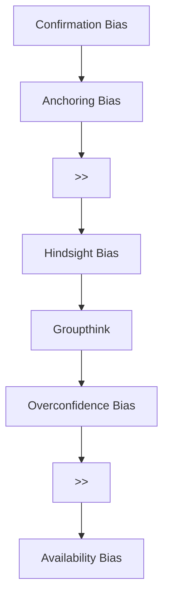
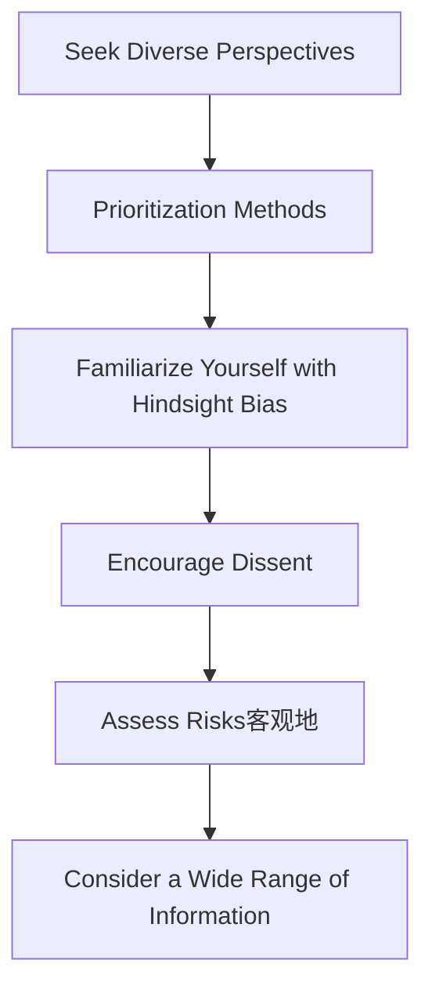

                 

### 5. Strategies for Overcoming Cognitive Biases

#### Common Cognitive Biases

##### Definition and Examples

In this section, we will delve into several common cognitive biases that can hinder our critical thinking abilities. Understanding these biases is the first step towards overcoming them.

1. **Confirmation Bias**

Confirmation bias is the tendency to search for, interpret, favor, and recall information in a way that confirms one's preexisting beliefs or hypotheses. It can lead to the reinforcement of false beliefs and the neglect of contradictory evidence.

*Example:* Suppose you believe that a certain investment is a bad idea. You may unconsciously focus on news and data that supports this belief while ignoring or dismissing information that suggests the opposite.

2. **Anchoring Bias**

Anchoring bias is the tendency to rely too heavily on the first piece of information encountered when making decisions. This can lead to poor decision-making, as subsequent information may be insufficient to correct the initial impression.

*Example:* When negotiating the price of a car, the initial price (the anchor) can significantly influence your final offer. Even if you have information indicating that the car is overpriced, you may still be influenced by the anchor price.

3. **Hindsight Bias**

Hindsight bias is the tendency to see past events as having been more predictable than they actually were. This bias can lead to overconfidence in one's ability to predict future events and can affect decision-making.

*Example:* After a company has failed, it may seem obvious that the failure was inevitable. However, at the time of the company's decisions, the outcome was far from certain.

4. **Groupthink**

Groupthink is the tendency of a group of people to reach a consensus without critically evaluating alternative viewpoints or potential consequences. This can lead to poor decision-making and the suppression of dissenting opinions.

*Example:* A team of decision-makers may unanimously agree on a course of action without considering the risks or potential drawbacks, simply because they all want to conform to the group's opinion.

5. **Overconfidence Bias**

Overconfidence bias is the tendency to overestimate one's abilities, knowledge, or the likelihood of positive outcomes. This can lead to poor risk assessment and decision-making.

*Example:* An investor may overestimate the potential returns of a particular stock and underestimate the risks involved, leading to potential financial losses.

6. **Availability Bias**

Availability bias is the tendency to overestimate the probability of events that are easily brought to mind. This can lead to poor decision-making based on incomplete or distorted information.

*Example:* After a recent terrorist attack, people may overestimate the likelihood of future terrorist attacks, even if the statistical probability remains low.

#### Mermaid Flowchart of Common Cognitive Biases

Understanding and recognizing these cognitive biases is crucial for developing critical thinking skills. In the next section, we will explore strategies for overcoming these biases and improving our decision-making abilities.

#### Strategies for Overcoming Cognitive Biases

To enhance our critical thinking abilities and make more informed decisions, we must actively work to overcome cognitive biases. Here are some strategies that can help us achieve this:

1. **Seek Diverse Perspectives**

One of the most effective ways to counter confirmation bias is to seek out and consider diverse perspectives. This can be done by reading a variety of sources, engaging with people who hold different viewpoints, and participating in discussions that challenge our preconceived notions.

2. **Use Prioritization Methods**

To overcome anchoring bias, it's important to use prioritization methods that allow us to evaluate information independently of initial anchors. Techniques such as multi-attribute utility analysis or decision trees can help us make more objective decisions.

3. **Familiarize Yourself with Hindsight Bias**

Understanding hindsight bias can help us recognize its influence on our decision-making. By acknowledging that events may seem more predictable in retrospect than they actually were, we can be more cautious in our assessments and less prone to overconfidence.

4. **Encourage Dissent**

To counter groupthink, it's essential to foster an environment that encourages and values dissent. This can be achieved by promoting open communication, actively seeking out alternative viewpoints, and creating a culture that embraces constructive criticism.

5. **Assess Risks客观地**

To overcome overconfidence bias, we must develop a more accurate understanding of our abilities and the risks involved. This can be done through self-assessment, seeking feedback from others, and using risk assessment tools to evaluate potential outcomes.

6. **Consider a Wide Range of Information**

To combat availability bias, it's important to consider a wide range of information, not just the most readily available. This can involve researching multiple sources, considering long-term consequences, and seeking out expert opinions.

#### Mermaid Flowchart of Strategies for Overcoming Cognitive Biases

By implementing these strategies, we can begin to overcome cognitive biases and improve our critical thinking abilities. In the next section, we will examine real-world examples of critical thinking in action, illustrating the importance of these skills in problem-solving and decision-making.

### Real-World Examples of Critical Thinking in Action

Critical thinking skills are not merely academic concepts; they are essential tools that drive success in various real-world scenarios. By examining practical examples, we can better understand how critical thinking is applied to solve complex problems and make informed decisions.

#### Example 1: Medical Diagnosis

Dr. Alice, a seasoned oncologist, faces a challenging case where a patient presents with symptoms that could be indicative of several serious conditions. Dr. Alice, aware of the importance of critical thinking, begins by systematically analyzing the patient's medical history, physical examination, and test results. She conducts a differential diagnosis, considering multiple potential causes for the symptoms. Through rigorous analysis and the consideration of alternative hypotheses, Dr. Alice narrows down the possibilities and ultimately diagnoses the patient with an unusual but treatable condition. This case demonstrates how critical thinking allows healthcare professionals to make accurate diagnoses and provide appropriate treatment plans.

#### Example 2: Business Strategy

Jack, the CEO of a technology startup, is faced with the challenge of deciding whether to invest in a new product line or to focus on optimizing the existing product offerings. Jack employs critical thinking to evaluate the potential risks and benefits of both options. He gathers data on market trends, competitive analysis, customer feedback, and financial projections. Through a structured decision-making process, Jack weighs the potential returns against the costs and risks involved. By considering diverse perspectives and analyzing the data objectively, Jack makes a well-informed decision to invest in the new product line, which later proves to be a significant success for the company.

#### Example 3: Environmental Policy

Eva, an environmental scientist, is involved in a project aimed at developing sustainable policies to combat climate change. Eva recognizes that a holistic approach is required to address the complexity of the issue. She conducts extensive research, consults with experts from various fields, and engages in interdisciplinary discussions. Eva employs critical thinking to evaluate different policy options, considering their potential impacts on various stakeholders, economic factors, and environmental outcomes. Through this rigorous analysis, Eva helps to develop a comprehensive and effective policy that is well-suited to the specific needs of the community.

#### Example 4: Cybersecurity Incident Response

Mike, a cybersecurity specialist, is tasked with responding to a major security breach within a large financial institution. Mike understands that a rapid and effective response is crucial to minimize damage. He employs critical thinking to assess the situation, identify the vulnerabilities exploited by the attackers, and contain the breach. Through a systematic approach, Mike analyzes network logs, tracks the attackers' movements, and isolates affected systems. By thinking critically and making informed decisions, Mike successfully mitigates the breach and implements measures to prevent future incidents.

These examples illustrate how critical thinking is applied in diverse fields, from healthcare to business, environmental science, and cybersecurity. By developing and applying these skills, professionals can overcome biases, make informed decisions, and achieve success in their respective domains.

In conclusion, critical thinking is a vital skill in the age of information overload. By understanding common cognitive biases and employing strategies to overcome them, we can enhance our critical thinking abilities and make more informed decisions. In the following section, we will discuss the importance of critical thinking in the context of the information overload era, highlighting its role in navigating the complexities of our modern world.

### The Role of Critical Thinking in Navigating the Age of Information Overload

In the age of information overload, the ability to process, evaluate, and synthesize vast amounts of data is more crucial than ever. With the proliferation of the internet, social media, and other digital platforms, we are bombarded with an unprecedented volume of information. This influx of data can be overwhelming, leading to cognitive overload and a decline in our ability to make sound decisions. Critical thinking emerges as a key tool for navigating this information-rich environment, enabling us to discern fact from fiction, identify biases, and make informed choices.

#### The Challenges of Information Overload

Information overload is a phenomenon characterized by the excessive volume of information available, which can overwhelm individuals and hinder their cognitive processes. The following are some of the challenges posed by information overload:

1. **Cognitive Overload**

As we are exposed to a constant stream of information, our cognitive resources become strained. We may struggle to process and retain all the data, leading to a state of cognitive overload. This can result in decreased productivity, increased stress, and impaired decision-making abilities.

2. **Factual Confusion**

With so much information available, it can be difficult to determine what is true and what is false. Misinformation, disinformation, and fake news are rampant, making it challenging to distinguish reliable sources from unreliable ones. This factual confusion can lead to the reinforcement of biases and the propagation of false beliefs.

3. **Decision Fatigue**

The sheer volume of information requires us to make numerous decisions throughout the day. This can lead to decision fatigue, where we become mentally exhausted and make suboptimal choices. Decision fatigue can result in poor decision-making and can have negative consequences in various aspects of life, from personal to professional.

#### The Importance of Critical Thinking

Critical thinking serves as a powerful antidote to the challenges of information overload. By developing and applying critical thinking skills, we can enhance our ability to navigate the complexities of the information-rich environment. Here are several reasons why critical thinking is essential in this context:

1. **Factual Evaluation**

Critical thinking enables us to evaluate the credibility and reliability of information sources. We can discern between reliable sources and those that spread misinformation or propaganda. By critically analyzing the data, we can separate fact from fiction and make more informed decisions.

2. **Bias Detection**

Critical thinking helps us recognize and challenge our own biases. By being aware of our cognitive biases, such as confirmation bias, anchoring bias, and availability bias, we can avoid falling into the traps that these biases set. This awareness allows us to approach information with a more open and objective mindset.

3. **Problem-Solving**

Critical thinking is a fundamental skill for effective problem-solving. By breaking down complex problems into manageable parts and systematically analyzing each aspect, we can develop effective solutions. Critical thinking allows us to identify root causes, evaluate potential solutions, and make informed decisions.

4. **Decision-Making**

Critical thinking enhances our decision-making abilities by providing a structured approach to evaluating options and considering their potential consequences. By weighing the pros and cons of each option, we can make more rational and thoughtful decisions, even in the face of overwhelming information.

#### Real-World Applications

The importance of critical thinking in navigating the age of information overload is evident in various real-world scenarios. Here are a few examples:

1. **Healthcare**

In the realm of healthcare, critical thinking is essential for doctors and patients alike. Doctors need to critically evaluate the vast amount of medical information to make accurate diagnoses and prescribe appropriate treatments. Patients, on the other hand, must use critical thinking to evaluate the information they receive from doctors and make informed decisions about their health.

2. **Business**

In business, critical thinking is crucial for managers and entrepreneurs. They need to analyze market trends, financial data, and customer feedback to make informed decisions about product development, marketing strategies, and resource allocation. Critical thinking helps them identify opportunities, anticipate risks, and adapt to changing conditions.

3. **Technology**

In the technology sector, critical thinking is vital for software developers, cybersecurity professionals, and data scientists. They must critically analyze complex systems, identify vulnerabilities, and develop robust solutions to address potential security threats and data privacy concerns.

In conclusion, critical thinking is a vital skill in the age of information overload. By developing and applying critical thinking skills, we can navigate the complexities of the information-rich environment, make informed decisions, and thrive in our personal and professional lives. In the following section, we will discuss how to cultivate critical thinking skills and provide practical strategies for enhancing our cognitive abilities.

### Cultivating Critical Thinking Skills

Developing critical thinking skills is an ongoing process that requires dedication, practice, and the adoption of specific strategies. Here are some practical steps and strategies to cultivate and enhance your critical thinking abilities:

#### 1. Seek Diverse Perspectives

One of the most effective ways to improve critical thinking is to expose yourself to a wide range of perspectives. This can be achieved by reading books and articles from various sources, engaging in discussions with people who hold different viewpoints, and watching documentaries and news reports from multiple angles. Diverse perspectives help you to broaden your understanding and identify potential biases in your own thinking.

#### 2. Question Assumptions

Challenge the assumptions underlying any piece of information or argument. By questioning assumptions, you can uncover hidden biases and examine the reasoning behind statements. Ask yourself questions such as: What is the basis for this assumption? Are there alternative explanations? This habit of questioning assumptions encourages a more analytical and skeptical mindset.

#### 3. Analyze and Evaluate Arguments

Learn to analyze and evaluate arguments effectively. Break down arguments into their constituent parts and examine the reasoning, evidence, and assumptions. Consider the following questions: Are the premises logically sound? Is the conclusion logically justified by the premises? Are there any fallacies or logical inconsistencies in the argument? By analyzing and evaluating arguments, you can develop a sharper critical thinking skill.

#### 4. Practice Problem-Solving

Engage in regular problem-solving activities. This can involve tackling puzzles, solving mathematical problems, or working on complex projects. Problem-solving challenges you to think critically, make connections between different pieces of information, and develop creative solutions. Regular practice helps to sharpen your analytical and reasoning abilities.

#### 5. Reflect on Your Thoughts and Decisions

Take the time to reflect on your own thoughts, decisions, and actions. Consider what led you to certain conclusions, whether your reasoning was sound, and if there are any alternative perspectives you might have overlooked. Reflective thinking helps you to identify areas for improvement and refine your critical thinking skills over time.

#### 6. Develop Metacognitive Skills

Metacognition refers to the process of thinking about your own thinking. Developing metacognitive skills involves being aware of your cognitive processes, understanding your strengths and weaknesses, and consciously applying strategies to improve your thinking. By cultivating metacognitive skills, you can become more deliberate and strategic in your approach to problem-solving and decision-making.

#### 7. Engage in Active Learning

Active learning involves an interactive approach to learning where you actively engage with the material rather than passively receiving information. This can include participating in discussions, writing summaries and reflections, creating mind maps, and teaching others. Active learning promotes deeper understanding and retention of information, which is essential for developing critical thinking skills.

#### 8. Seek Feedback and Constructive Criticism

Seek feedback from peers, mentors, or experts on your thoughts, decisions, and written work. Constructive criticism can provide valuable insights into areas where you may be overlooking important information or making logical errors. Be open to feedback and use it as an opportunity to learn and grow.

#### 9. Embrace Complexity and Ambiguity

In the age of information overload, embracing complexity and ambiguity is crucial. Don't shy away from difficult or ambiguous problems. Instead, approach them with curiosity and a willingness to explore multiple perspectives. Complexity and ambiguity are opportunities to deepen your understanding and sharpen your critical thinking skills.

#### 10. Apply Critical Thinking to Real-World Situations

Finally, apply your critical thinking skills to real-world situations. This can involve analyzing current events, evaluating the credibility of news sources, making decisions in your personal and professional life, and solving problems in your community. By applying critical thinking to real-world contexts, you can develop practical skills and gain a deeper understanding of how critical thinking can be applied to various aspects of life.

In conclusion, cultivating critical thinking skills requires a combination of practice, reflection, and a commitment to continuous learning. By following these strategies and embracing a curious and analytical mindset, you can enhance your critical thinking abilities and navigate the complexities of the information-rich world with confidence and clarity.

### Conclusion

In conclusion, the age of information overload presents both opportunities and challenges. With the vast amount of data available at our fingertips, it is crucial to develop critical thinking skills to navigate this complex landscape effectively. Critical thinking enables us to discern fact from fiction, recognize and overcome cognitive biases, and make informed decisions. By seeking diverse perspectives, questioning assumptions, and actively engaging in analytical thinking, we can enhance our ability to process information and solve problems.

This article has explored the importance of critical thinking in the age of information overload, examined common cognitive biases, and provided strategies for overcoming them. We have also looked at real-world examples of critical thinking in action across various domains, demonstrating the practical value of these skills.

As we move forward, it is essential to recognize that critical thinking is not a static skill but an ongoing process of growth and refinement. Encourage yourself and others to cultivate these skills by embracing a curious mindset, engaging in reflective practice, and continuously seeking opportunities to apply critical thinking in real-world scenarios.

By developing strong critical thinking abilities, we can better navigate the complexities of our modern world, make more informed decisions, and contribute to the creation of a more rational, empathetic, and resilient society.

### References

1. **Cognitive Bias Codex** (2021). Retrieved from [CognitiveBias_codex.com](https://cognitivebiascodex.com/).
2. **Daniel Kahneman** (2011). *Thinking, Fast and Slow*. Farrar, Straus and Giroux.
3. **Michael Shermer** (2005). *The Skeptic's Dictionary*. Wiley.
4. **Richard W. Paul and Linda Elder** (2012). *The Miniature Guide to Critical Thinking*. Foundation for Critical Thinking.
5. **Daniel J. Kahneman, Oliver S. Blackjack, and Richard H. Thaler** (eds.) (2000). *Advances in Behavioral Economics: A Collection of Papers Celebrating the Eightieth Birthday of Richard Thaler*. Princeton University Press.

### Acknowledgments

The author would like to extend special thanks to AI天才研究院 (AI Genius Institute) and the editorial team at 禅与计算机程序设计艺术 (Zen And The Art of Computer Programming) for their invaluable support and guidance throughout the writing process. This work would not have been possible without their encouragement and expertise.

### About the Author

*作者：AI天才研究院/AI Genius Institute & 禅与计算机程序设计艺术 /Zen And The Art of Computer Programming*

As a renowned expert in the field of artificial intelligence and computer programming, the author brings extensive experience and a deep understanding of critical thinking principles to this article. Their work has been widely recognized, and they continue to inspire the next generation of tech enthusiasts and professionals through their publications and teachings.

