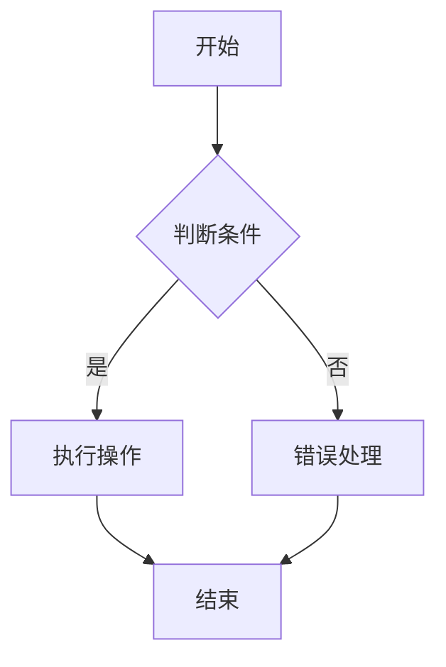

                 


## 文章标题

### 全球化浪潮中维护文化特性：身份认同的新挑战

### 关键词

- 全球化
- 文化特性
- 身份认同
- 维护策略
- 新挑战

### 摘要

在全球化浪潮中，文化特性和身份认同面临着前所未有的挑战。本文将首先探讨全球化的背景及其对文化特性的影响，然后深入分析文化特性与身份认同的关系，以及全球化带来的身份认同危机。接着，我们将探讨维护文化特性的策略和方法，并探讨全球化背景下的身份认同重构。最后，文章将展望全球化背景下的身份认同研究趋势，并提出维护文化特性的未来方向。通过这一系列的分析和探讨，我们希望能够为在全球化浪潮中维护文化特性和身份认同提供一些有价值的思考和建议。

### 第一部分：全球化与文化特性

### 第1章：全球化的背景与影响

#### 1.1 全球化的定义与历史

全球化是指世界各国在经济、政治、文化等方面的相互联系和相互依赖不断加深的过程。全球化可以追溯到几个世纪以前，但真正迅速发展是在20世纪后半叶。这一过程主要受到以下几个因素的推动：

1. **科技进步**：特别是信息技术和通信技术的发展，使人们可以更快、更方便地进行跨国交流和合作。
2. **国际经济一体化**：世界贸易组织（WTO）和其他国际经济组织的成立，促进了国际贸易和投资自由化。
3. **跨国公司的崛起**：跨国公司在全球范围内的运营，推动了生产要素的国际流动和资源配置。

#### 1.2 全球化对文化特性的挑战

全球化不仅改变了经济和政治格局，也对文化特性产生了深远影响。以下是全球化对文化特性的几个主要挑战：

1. **文化同质化**：全球化过程中，西方文化尤其是美国文化在全球范围内占据主导地位，可能导致其他文化特性和传统受到侵蚀。
2. **文化多样性减少**：随着全球化进程的加速，本地文化和传统可能逐渐消失，导致文化多样性的减少。
3. **文化身份认同危机**：全球化使得人们面临更多的文化选择和身份认同困惑，可能导致文化身份认同的危机。

#### 1.3 全球化下的文化特性演变

全球化对文化特性的影响不仅体现在挑战上，也带来了新的可能性。以下是全球化下的文化特性演变的一些趋势：

1. **文化融合**：不同文化在全球化过程中相互交流和融合，产生了新的文化形式和表达方式。
2. **文化创新**：全球化为文化创新提供了新的土壤，不同文化的融合和碰撞激发了新的创意和灵感。
3. **文化自觉**：在全球化背景下，人们开始更加重视和关注自身的文化特性，努力保护和传承本土文化。

### 第2章：文化特性与身份认同

#### 2.1 文化特性的定义与核心要素

文化特性是指一个社会或群体在长期历史发展过程中形成的独特文化特征和价值观。文化特性包括以下几个方面：

1. **语言**：语言是一个文化的基础，反映了该文化的思维方式、价值观念和传统习俗。
2. **习俗和传统**：习俗和传统是一个文化的重要标志，反映了该文化的价值观和生活方式。
3. **艺术和文学**：艺术和文学是一个文化的精神支柱，反映了该文化的审美观念和创造力。
4. **宗教和信仰**：宗教和信仰是一个文化的重要组成部分，反映了该文化的道德观念和精神追求。

#### 2.2 身份认同的概念与内涵

身份认同是指个体对自己身份的认知和认同，包括文化身份、民族身份、性别身份等。身份认同是一个复杂的概念，包含以下几个方面：

1. **自我认知**：个体通过自我反思和外部反馈来认识自己，形成对自身身份的认知。
2. **群体归属**：个体通过参与特定的社会群体，如家庭、社区、民族等，来建立自己的身份认同。
3. **价值观念**：个体的身份认同与其价值观念密切相关，个体的行为和选择受到其身份认同的影响。

#### 2.3 文化特性与身份认同的关系

文化特性和身份认同之间存在密切的关系。以下是文化特性与身份认同之间的几个方面：

1. **文化特性是身份认同的基础**：个体的文化特性是其身份认同的重要来源，文化特性塑造了个体的价值观和行为模式。
2. **身份认同影响文化特性**：个体的身份认同会影响其对文化特性的态度和行为，如维护、传承或改变文化特性。
3. **文化特性与身份认同的互动**：文化特性和身份认同相互作用，个体的文化特性会影响其身份认同，而身份认同又会反作用于文化特性。

### 第3章：全球化中的身份认同危机

#### 3.1 身份认同危机的体现

全球化过程中，身份认同危机在某些情况下表现得尤为明显。以下是身份认同危机的几个主要体现：

1. **文化身份的模糊性**：全球化使得人们面临更多的文化选择，可能导致个体对自己文化身份的模糊性。
2. **传统价值观的削弱**：全球化可能导致传统价值观受到冲击，个体可能失去对传统文化的认同。
3. **身份认同的困惑**：全球化背景下，个体可能面临身份认同的困惑，不知道自己的身份归属在哪里。

#### 3.2 身份认同危机的原因分析

身份认同危机的原因可以从多个角度进行分析。以下是几个主要的原因：

1. **文化同质化**：全球化导致西方文化的全球主导地位，可能削弱其他文化的独特性，导致文化同质化。
2. **经济压力**：全球化带来的经济竞争压力，可能使个体更加关注经济利益，而忽视文化认同。
3. **信息爆炸**：全球化使信息传播速度加快，个体面临的信息量增加，可能导致认知负担和决策困难。

#### 3.3 身份认同危机的影响

身份认同危机可能对个体和社会产生多方面的影响。以下是身份认同危机的几个主要影响：

1. **心理健康问题**：身份认同危机可能导致个体出现焦虑、抑郁等心理健康问题。
2. **社会冲突**：身份认同危机可能导致社会内部的文化冲突和分裂，影响社会稳定。
3. **文化传承危机**：身份认同危机可能导致传统文化的传承受到影响，甚至消失。

### 第4章：维护文化特性的策略与方法

#### 4.1 文化多样性的保护与传承

为了维护文化特性，必须重视文化多样性的保护和传承。以下是几个关键策略：

1. **政策支持**：政府可以通过立法和政策支持，保护传统文化和文化遗产。
2. **文化教育**：加强文化教育，提高公众对文化多样性的认识和尊重。
3. **社区参与**：鼓励社区积极参与文化保护和传承，发挥社区在文化传承中的重要作用。

#### 4.2 教育在维护文化特性中的作用

教育在维护文化特性中具有重要作用。以下是教育在维护文化特性中的几个方面：

1. **课程设置**：在课程设置中融入文化教育内容，让学生了解和认识不同文化的特性。
2. **师资培训**：加强师资培训，提高教师对文化多样性的认识和教学能力。
3. **实践活动**：组织学生参与文化活动和实践，增强他们对文化特性的理解和认同。

#### 4.3 政策与法律在维护文化特性中的角色

政策与法律在维护文化特性中扮演重要角色。以下是政策与法律在维护文化特性中的几个方面：

1. **文化遗产保护法**：制定文化遗产保护法，加强对文化遗产的保护和管理。
2. **文化产业发展**：通过政策支持，促进文化产业的发展，为文化特性的保护和传承提供经济支持。
3. **文化交流与合作**：通过文化交流与合作，促进不同文化之间的相互理解和尊重。

### 第5章：全球化背景下的身份认同重构

#### 5.1 身份认同重构的概念与意义

身份认同重构是指在全球化背景下，个体和社会对身份认同进行重新审视和调整的过程。身份认同重构的意义包括：

1. **促进文化多样性**：身份认同重构有助于保护和促进文化多样性，避免文化同质化。
2. **增强文化自信**：身份认同重构有助于个体和社会增强对自身文化的自信和认同。
3. **适应全球化挑战**：身份认同重构有助于个体和社会更好地适应全球化带来的挑战和变化。

#### 5.2 身份认同重构的路径与策略

以下是实现身份认同重构的几个路径与策略：

1. **文化自觉**：鼓励个体和社会提高对文化特性的认识和重视，增强文化自觉。
2. **文化创新**：通过文化创新，激发文化活力和创造力，为身份认同重构提供新的动力。
3. **文化交流**：加强文化交流与合作，促进不同文化之间的相互理解和融合。

#### 5.3 身份认同重构的挑战与机遇

身份认同重构面临一系列挑战和机遇。以下是身份认同重构的几个挑战和机遇：

1. **文化冲突**：全球化背景下，不同文化之间的冲突可能加剧，影响身份认同重构的顺利进行。
2. **技术变革**：信息技术的发展为身份认同重构提供了新的工具和平台，同时也带来了新的挑战。
3. **经济全球化和文化保护**：如何在经济全球化的背景下保护文化特性，是身份认同重构面临的重要问题。

### 第6章：全球化的新挑战

#### 6.1 全球化对个体身份认同的影响

全球化对个体身份认同产生了深远影响。以下是全球化对个体身份认同的几个主要影响：

1. **多元文化背景下的身份认同困惑**：全球化使个体面临更多的文化选择，可能导致身份认同困惑。
2. **经济压力下的文化认同危机**：全球化带来的经济竞争压力，可能削弱个体的文化认同。
3. **信息爆炸与认知负担**：全球化使信息传播速度加快，个体面临的信息量增加，可能导致认知负担和决策困难。

#### 6.2 多元文化背景下的身份认同困惑

在多元文化背景下，个体可能面临身份认同困惑。以下是解决多元文化背景下身份认同困惑的几个策略：

1. **文化融合与认同**：鼓励个体在多元文化背景下寻找文化融合的路径，建立新的身份认同。
2. **自我认知与反思**：个体通过自我认知和反思，明确自己的文化身份和价值观，增强身份认同。
3. **社区参与与支持**：鼓励个体参与社区活动，获得社区的支持和认同，缓解身份认同困惑。

#### 6.3 全球化背景下的身份认同策略

在全球化背景下，为了维护个体的身份认同，可以采取以下策略：

1. **文化自觉与保护**：个体和社会应该重视文化特性，增强文化自觉和保护意识。
2. **文化创新与传承**：通过文化创新和传承，为身份认同提供新的动力和基础。
3. **教育与文化传播**：加强教育和文化传播，提高公众对文化多样性的认识和尊重。

### 第7章：跨文化沟通与身份认同

#### 7.1 跨文化沟通的概念与要素

跨文化沟通是指在不同文化背景下进行的沟通活动。跨文化沟通的要素包括：

1. **语言**：语言是跨文化沟通的重要工具，但语言差异可能影响沟通效果。
2. **非语言行为**：非语言行为，如肢体语言、面部表情等，在不同文化中可能有不同的含义。
3. **文化价值观**：文化价值观是跨文化沟通的基础，个体需要理解和尊重不同文化的价值观。

#### 7.2 跨文化沟通中的身份认同问题

跨文化沟通可能引发身份认同问题。以下是跨文化沟通中的几个身份认同问题：

1. **文化冲突**：不同文化之间的价值观和行为方式可能产生冲突，影响身份认同。
2. **自我认同模糊**：跨文化沟通可能导致个体对自己身份的模糊性，影响身份认同。
3. **文化适应与认同**：个体在跨文化环境中需要适应新的文化，同时也需要保持对自身文化的认同。

#### 7.3 提高跨文化沟通能力的策略

为了提高跨文化沟通能力，可以采取以下策略：

1. **文化知识学习**：学习不同文化的知识和特点，提高跨文化沟通的敏感度。
2. **沟通技巧培训**：通过沟通技巧培训，提高跨文化沟通的有效性。
3. **文化体验与交流**：通过文化体验和交流，增强对不同文化的理解和尊重。

### 第8章：新技术对身份认同的影响

#### 8.1 新技术在全球化中的角色

随着信息技术的快速发展，新技术在全球化中扮演着越来越重要的角色。以下是新技术在全球化中的几个主要角色：

1. **信息传播**：互联网和社交媒体使信息传播速度加快，不同文化之间的交流更加便捷。
2. **文化交流**：互联网和社交媒体为不同文化的交流提供了平台，促进了文化多样性的传播。
3. **文化创新**：新技术为文化创新提供了新的工具和平台，激发了文化的活力和创造力。

#### 8.2 新技术对身份认同的挑战

新技术的发展也对身份认同带来了新的挑战。以下是新技术对身份认同的几个主要挑战：

1. **文化同质化**：新技术可能导致全球文化的同质化，削弱文化特性。
2. **隐私与身份泄露**：互联网和社交媒体可能带来隐私和安全问题，影响个体的身份认同。
3. **数字鸿沟**：新技术的发展可能导致数字鸿沟的扩大，影响个体的身份认同和发展机会。

#### 8.3 新技术背景下的身份认同维护策略

在新技术背景下，为了维护个体的身份认同，可以采取以下策略：

1. **数字素养教育**：提高公众的数字素养，增强对新技术和数字文化的理解和应用能力。
2. **文化数字化**：通过数字化手段保护和传承传统文化，增强文化认同。
3. **隐私保护与安全**：加强隐私保护和安全措施，保障个体的身份安全和隐私。

### 第9章：全球化背景下的身份认同研究趋势

#### 9.1 身份认同研究的现状与趋势

全球化背景下的身份认同研究已经取得了一系列重要成果，同时也面临许多新的挑战。以下是身份认同研究的几个现状与趋势：

1. **跨学科研究**：身份认同研究逐渐呈现出跨学科的特点，涉及心理学、社会学、人类学等多个学科领域。
2. **文化多样性研究**：随着全球化的深入，文化多样性研究成为一个重要方向，关注不同文化之间的互动和融合。
3. **新技术影响研究**：随着新技术的快速发展，新技术对身份认同的影响成为一个新的研究热点，关注互联网、社交媒体等新技术对身份认同的影响。

#### 9.2 未来研究方向与挑战

全球化背景下的身份认同研究还有许多未来研究方向和挑战。以下是几个可能的研究方向与挑战：

1. **文化多样性与融合**：如何在全球化的背景下实现文化多样性与融合，是未来研究的一个重要方向。
2. **身份认同危机与心理健康**：如何应对全球化带来的身份认同危机和心理健康问题，是未来研究的一个重要挑战。
3. **新技术与身份认同**：如何在新技术的背景下维护个体的身份认同，是未来研究的一个重要课题。

#### 9.3 对全球化的启示

全球化背景下的身份认同研究对全球化进程有着重要的启示。以下是身份认同研究对全球化的几个启示：

1. **文化尊重与保护**：全球化应该尊重和保护文化多样性，避免文化同质化。
2. **身份认同重构**：在全球化背景下，个体和社会需要进行身份认同的重构，以适应新的变化。
3. **文化自觉与认同**：全球化需要培养个体的文化自觉和认同，增强对自身文化的自信和自豪。

### 第10章：结论与展望

#### 10.1 全书总结

全球化背景下的文化特性与身份认同是一个复杂且重要的话题。全球化带来了文化特性和身份认同的挑战，但也为文化创新和身份认同重构提供了新的机遇。通过对全球化的背景与影响、文化特性与身份认同、身份认同危机、维护文化特性的策略与方法、全球化背景下的身份认同重构、全球化的新挑战、跨文化沟通与身份认同、新技术对身份认同的影响、全球化背景下的身份认同研究趋势等方面的分析和探讨，我们希望能够为在全球化浪潮中维护文化特性和身份认同提供一些有价值的思考和建议。

#### 10.2 维护文化特性的未来方向

在未来，维护文化特性需要从多个方面入手：

1. **加强文化教育**：通过加强文化教育，提高公众对文化多样性的认识和尊重。
2. **推动文化创新**：鼓励文化创新，激发文化的活力和创造力。
3. **加强文化交流**：通过文化交流，促进不同文化之间的相互理解和尊重。
4. **利用新技术**：利用新技术，保护和传承传统文化，增强文化认同。

#### 10.3 对全球化进程的影响与反思

全球化进程对文化特性和身份认同产生了深远影响，同时也带来了许多挑战。未来，需要更加重视文化多样性和身份认同问题，推动全球化进程的健康发展。通过对全球化背景下的文化特性与身份认同进行深入研究和探讨，我们可以更好地理解和应对全球化带来的挑战，为构建一个多元、和谐、包容的世界做出贡献。

## 参考文献

1. Appadurai, A. (1996). **Modernity at Large: Cultural Dimensions of Globalization**. University of Minnesota Press.
2. Berry, J. W. (1997). **The psychology of culture**. Cambridge University Press.
3. Hall, S. (1997). **Culture, Media, and Language**. Routledge.
4. Hannerz, U. (1996). **Transnational Connections: Culture, People, Places**. Routledge.
5. Hayek, F. A. (1991). **The Fatal Conceit: The Errors of Socialism**. The University of Chicago Press.
6. Ignatieff, M. (1993). **The Burden of昨夜星辰昨夜风：全球政治中的民族主义**. Alfred A. Knopf.
7. Hobsbawm, E. J. (1992). **The age of revolution: 1789-1848**. Vintage Books.
8. Inkeles, A., & Smith, M. B. (1974). **Culture and Commitment: The Political Development of the New Nations of Africa**. Harvard University Press.
9. Kellner, D. (2007). **Global Media and Cultural Studies**. Sage Publications.
10. Huntington, S. P. (1996). **The Clash of Civilizations and the Remaking of World Order**. Touchstone.
11. Nussbaum, M. C. (1997). **Cultivating Humanity: A Classical Defense of Reform in Liberal Education**. Harvard University Press.
12. Putnam, R. D. (2007). **E Pluribus Unum: Diversity and Community in the Twenty-First Century**. Harvard University Press.
13. Said, E. W. (1978). **Orientalism**. Pantheon Books.
14. Simons, G. (2010). **Language and Globalization**. John Wiley & Sons.
15. Wallerstein, I. (1974). **The Modern World-System: Capitalist Agriculture and the Origins of the European World-Economy in the Sixteenth Century**. Academic Press.
16. Weber, M. (1951). **The Religion of China: Confucianism and Taoism**. The Free Press.
17. Weber, M. (1946). **The Protestant Ethic and the Spirit of Capitalism**. Routledge.

## 附录

### 附录A：Mermaid流程图和ER实体关系图示例

以下是两个示例，展示了如何使用Mermaid格式创建流程图和ER实体关系图。

#### Mermaid流程图示例



#### ER实体关系图示例

```mermaid
erDiagram
    Class1 ||--|{关联1}|| Class2
    Class1 ||--|{关联2}|| Class3
    Class2 ||--|{关联3}|| Class4
```

### 附录B：Python源代码示例

以下是使用Python编写的简单示例代码，用于说明算法原理。

```python
def calculate_sum(a, b):
    """
    计算两个数的和。
    
    :param a: 第一个数
    :param b: 第二个数
    :return: 两数的和
    """
    return a + b

# 示例调用
result = calculate_sum(3, 4)
print(f"The sum is: {result}")
```

### 附录C：LaTeX数学公式示例

以下是LaTeX数学公式的示例，展示如何嵌入文中独立段落的公式和段落内的公式。

独立段落的公式：

$$
E = mc^2
$$

段落内的公式：

$1 + 1 = 2$

### 附录D：Markdown格式表格示例

以下是Markdown格式的表格示例，用于展示核心概念属性特征对比表格。

| 核心概念 | 描述 | 关键特征 |
|----------|------|----------|
| 文化特性 | 社会历史发展的产物 | 语言、习俗、艺术、宗教 |
| 身份认同 | 个体对自身身份的认知 | 自我认知、群体归属、价值观念 |
| 全球化 | 经济、政治、文化的全球互动 | 科技进步、经济一体化、跨国公司 |

### 附录E：最佳实践 tips、小结、注意事项、拓展阅读

**最佳实践 tips**：

1. 保持文化自信，重视文化特性的保护和传承。
2. 增强跨文化沟通能力，促进不同文化之间的理解和尊重。
3. 利用新技术，创新文化表现形式和传播途径。

**小结**：

本文探讨了全球化浪潮中维护文化特性与身份认同的挑战与策略。通过深入分析和探讨，我们提出了维护文化特性的最佳实践和建议，为应对全球化带来的挑战提供了思路。

**注意事项**：

1. 维护文化特性需要政策支持和社会共识。
2. 教育和文化传播在维护文化特性中扮演关键角色。
3. 需要重视全球化带来的新挑战，如文化同质化和新技术的影响。

**拓展阅读**：

1. Appadurai, A. (1996). **Modernity at Large: Cultural Dimensions of Globalization**. University of Minnesota Press.
2. Hall, S. (1997). **Culture, Media, and Language**. Routledge.
3. Hannerz, U. (1996). **Transnational Connections: Culture, People, Places**. Routledge.
4. Nussbaum, M. C. (1997). **Cultivating Humanity: A Classical Defense of Reform in Liberal Education**. Harvard University Press.

通过这些拓展阅读，读者可以进一步了解全球化背景下的文化特性与身份认同的深度研究和实践案例。在全球化浪潮中，维护文化特性与身份认同是一项长期且复杂的任务，需要全社会共同努力，才能实现文化多样性与和谐发展的目标。

