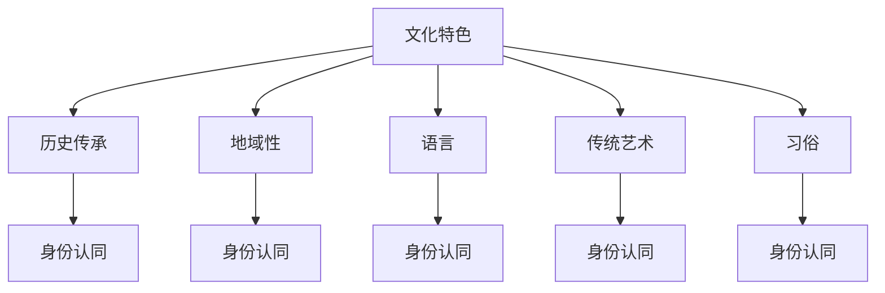

                 


### 1. 全球化背景与文化挑战

#### 引言

全球化是一个不可逆转的趋势，它对世界各国的政治、经济、社会和文化产生了深远的影响。在这一过程中，文化特色和身份认同成为了重要的议题。全球化加速了信息的传播和人员的流动，使得不同文化之间的交流和融合变得更加频繁。然而，这也带来了一系列挑战，尤其是如何在全球化的背景下保持各国的文化特色和身份认同。

#### 核心概念术语说明

- **全球化**：指世界各国在经济、政治、文化等方面的相互联系和依赖程度不断加深的过程。
- **文化特色**：指一个国家或地区在历史、传统、语言、价值观等方面的独特性和多样性。
- **身份认同**：指个人或群体对于自己所属文化、国家或民族的认同和归属感。

#### 问题背景

全球化带来的文化交流和融合虽然有助于增进各国人民之间的了解和友谊，但也可能导致文化同质化，削弱了各国的文化特色和身份认同。特别是在经济全球化的背景下，一些国家可能为了适应全球市场的需求，牺牲了自身的文化特色，这在一定程度上引发了文化认同的危机。

#### 问题描述

如何在全球化进程中保持文化特色和身份认同，成为了一个亟待解决的重要问题。这个问题不仅关系到国家的文化传承和发展，也影响到民族的精神面貌和认同感。因此，我们需要从理论和实践两个层面，探讨如何在全球化的背景下保持文化特色和身份认同。

#### 问题解决

为了在全球化的背景下保持文化特色和身份认同，我们可以采取以下几种策略：

1. **文化保护策略**：加强对本国文化遗产的保护，包括语言、传统艺术、习俗等。
2. **文化创新策略**：在传承传统文化的基础上，结合现代元素，推动文化的创新发展。
3. **文化交流策略**：积极参与国际文化交流活动，促进文化多样性的传播和认可。

#### 边界与外延

文化特色和身份认同是一个多维度的概念，它不仅包括物质文化，如建筑、艺术作品等，还包括非物质文化，如价值观、信仰、习俗等。同时，文化特色和身份认同也随着社会变迁而不断发展。

#### 概念结构与核心要素组成

- **核心概念**：全球化、文化特色、身份认同。
- **概念属性特征对比表格**：

  | 概念     | 定义                                                         | 属性特征对比                 |
  |----------|------------------------------------------------------------|------------------------------|
  | 全球化   | 世界各国在经济、政治、文化等方面的相互联系和依赖程度不断加深的过程 | 范围广泛、多元互动、趋势性   |
  | 文化特色 | 一个国家或地区在历史、传统、语言、价值观等方面的独特性和多样性   | 历史传承、地域性、独特性     |
  | 身份认同 | 个人或群体对于自己所属文化、国家或民族的认同和归属感           | 个人心理、社会认同、文化归属 |

- **ER实体关系图架构**：

  ```mermaid
  graph TB
    A[全球化] --> B[文化特色]
    A --> C[身份认同]
    B --> D[语言]
    B --> E[传统艺术]
    B --> F[习俗]
    C --> G[个人认同]
    C --> H[社会认同]
  ```

### 2. 文化特色的内涵与价值

#### 引言

文化特色是一个国家或地区的灵魂和根基，它不仅反映了历史和传统的积淀，也是身份认同的重要基础。在全球化的背景下，文化特色的内涵和价值显得尤为重要。本节将深入探讨文化特色的内涵、价值以及与身份认同的内在联系。

#### 核心概念与联系

- **文化特色**：指一个国家或地区在历史、传统、语言、价值观等方面的独特性和多样性。
- **价值**：文化特色对个人、社会和国家的重要性。
- **身份认同**：个人或群体对于自己所属文化、国家或民族的认同和归属感。

#### 文化特色的内涵

文化特色的内涵丰富多样，主要包括以下几个方面：

1. **历史传承**：文化特色是历史长河中积累和传承的宝贵财富，它记录了一个国家或地区的发展历程和演变。
2. **地域性**：不同地区的自然环境、地理条件和社会环境形成了独特的文化特色，这些特色反映了地域的特色和个性。
3. **语言**：语言是文化的重要载体，一个国家或地区的语言不仅仅是交流的工具，也是文化特色的体现。
4. **传统艺术**：传统艺术，如音乐、舞蹈、绘画等，是文化特色的生动展现，它们传承了历史和传统，反映了民族的精神面貌。
5. **习俗**：习俗和礼仪是文化特色的组成部分，它们体现了社会的价值观和道德规范。

#### 文化特色的价值

文化特色的价值体现在以下几个方面：

1. **个人价值**：文化特色为个人提供了身份认同的来源，帮助个人建立自我认知和自信心。
2. **社会价值**：文化特色是社会凝聚力和稳定性的基础，它有助于增强社会成员之间的认同感和归属感。
3. **国家价值**：文化特色是国家软实力的重要组成部分，它提升了国家的国际影响力和竞争力。

#### 文化特色与身份认同的内在联系

文化特色与身份认同有着密切的内在联系：

1. **文化特色是身份认同的基础**：文化特色为个人和群体提供了身份认同的依据，帮助人们识别和归属自己的文化群体。
2. **身份认同是文化特色的体现**：身份认同是文化特色的外在表现，它反映了人们对自身文化的认同和自豪感。
3. **文化特色与身份认同相互影响**：文化特色塑造了身份认同，而身份认同又反过来强化了文化特色。

#### 概念属性特征对比表格

| 概念     | 定义                                                         | 属性特征对比                 |
|----------|------------------------------------------------------------|------------------------------|
| 文化特色 | 一个国家或地区在历史、传统、语言、价值观等方面的独特性和多样性 | 历史积淀、地域性、语言和艺术 |
| 身份认同 | 个人或群体对于自己所属文化、国家或民族的认同和归属感           | 个人认同、社会认同、文化归属 |

#### ER实体关系图架构



### 3. 全球文化策略与实践

#### 引言

在全球化的背景下，保持文化特色和身份认同需要采取有效的文化策略。本节将介绍几种全球文化策略，包括文化保护策略、文化创新策略和文化交流策略，并结合实际案例进行分析。

#### 核心概念与联系

- **文化保护策略**：指通过立法、教育、宣传等方式，保护和传承本国文化遗产。
- **文化创新策略**：指在传承传统文化的基础上，结合现代元素，推动文化的创新发展。
- **文化交流策略**：指通过国际交流和合作，促进文化多样性的传播和认可。

#### 文化保护策略

文化保护策略是保持文化特色的基础，主要包括以下几个方面：

1. **立法保护**：通过立法手段，加强对文化遗产的保护，如制定文化保护法、非物质文化遗产保护条例等。
2. **教育传承**：在学校教育中加强传统文化教育，培养学生对传统文化的认识和尊重。
3. **宣传推广**：通过媒体和公共活动，提高公众对文化保护的意识，营造保护文化的良好氛围。

#### 文化创新策略

文化创新策略是在传承传统文化的基础上，结合现代元素，推动文化的创新发展。这包括：

1. **文化融合**：将传统文化与现代社会需求相结合，创造出新的文化形式，如现代舞蹈、现代音乐等。
2. **科技应用**：利用现代科技手段，如数字技术、虚拟现实等，保护和传承传统文化，如数字博物馆、虚拟演出等。
3. **商业推广**：通过商业手段，将传统文化产品化，提高文化的经济价值，如手工艺品、特色食品等。

#### 文化交流策略

文化交流策略是促进文化多样性的重要手段，主要包括：

1. **国际文化交流**：积极参与国际文化交流活动，如艺术节、文化展览等，推广本国文化。
2. **留学交流**：鼓励学生和学者进行国际留学和交流，增进不同文化之间的了解和认同。
3. **国际合作**：与文化机构、企业建立合作关系，共同推动文化的保护和传承。

#### 实际案例分析

以下是一些全球文化策略的实际案例：

1. **日本的文化保护策略**：日本通过立法和宣传教育，成功保护了茶道、和服等传统文化。同时，通过文化融合，如将茶道与现代生活方式结合，创造了“茶餐厅”等新的文化形式。
2. **中国的文化交流策略**：中国积极参与国际文化交流，如举办“中国文化节”、“一带一路”国际合作等，推广中国文化。同时，通过留学交流，如孔子学院，增进了中国文化在国际上的影响力。

### 4. 结论

在全球化的背景下，保持文化特色和身份认同是一个复杂而重要的任务。通过文化保护、文化创新和文化交流等多种策略，我们可以有效应对全球化带来的文化挑战，保持文化的独特性和多样性。同时，我们也需要不断探索和实践，找到适应时代发展的新路径，确保文化特色和身份认同在全球化背景下得以传承和发展。

### 5. 保持文化特色的方法与实践

#### 引言

在全球化的浪潮中，保持文化特色和身份认同是一项艰巨的任务，但也是必要的。为了实现这一目标，我们需要从教育体系、媒体和民间文化等方面采取具体措施，保护、传承和推广本国文化。本节将深入探讨这些方法与实践。

#### 核心概念与联系

- **教育体系**：指通过学校教育，培养学生的文化素养和认同感。
- **媒体**：指利用各种媒体平台，传播和推广本国文化。
- **民间文化**：指在民间传承和发展的传统文化，如习俗、手工艺等。

#### 教育体系中的文化传承

1. **课程设置**：在学校教育中，应增加文化课程的比例，让学生系统学习本国历史、文学、艺术等。
2. **教学资源**：利用多媒体教学资源，如视频、音频、电子书等，增强学生对传统文化的理解和兴趣。
3. **文化体验**：组织学生参与文化体验活动，如参观博物馆、艺术节等，让他们亲身体验和感受本国文化的魅力。

#### 媒体在文化保护中的作用

1. **文化传播**：利用电视、广播、互联网等媒体平台，推广本国文化，提高公众的文化认同感。
2. **文化创新**：鼓励媒体创作以本国文化为主题的内容，结合现代元素，创造出新的文化形式。
3. **国际传播**：通过国际频道、国际合作项目等，将本国文化推向全球，提升文化影响力。

#### 民间文化的保护与推广

1. **非物质文化遗产保护**：对具有历史价值和文化意义的民间文化进行登记和保护，防止失传。
2. **文化传承人培养**：培养一批热爱和擅长传统文化的传承人，确保民间文化后继有人。
3. **文化创新**：鼓励民间文化与现代科技相结合，创造出新的文化产品，提高民间文化的经济价值。

### 实际案例

1. **韩国的文化振兴**：韩国通过推行“文化韩国”计划，加强了学校教育中的传统文化教育，并通过媒体大力推广韩流文化，成功提升了国家文化影响力。
2. **中国的非物质文化遗产保护**：中国通过设立非物质文化遗产保护基金，加强对传统手工艺的保护和传承，如剪纸、刺绣等。

### 小结

保持文化特色和身份认同是一个长期而复杂的任务，需要从教育体系、媒体和民间文化等多个方面共同努力。通过系统化的教育、有效的媒体推广和民间的创新实践，我们可以有效地保护和传承本国文化，确保文化特色和身份认同在全球化背景下得以持续发展。

### 6. 全球化与本土化的平衡

#### 引言

全球化与本土化之间的关系是一个复杂且持续演变的话题。在全球化的进程中，各国文化、经济和社会结构都在发生深刻变化。为了在全球化背景下保持文化特色和身份认同，实现全球化与本土化的平衡显得尤为重要。本节将探讨全球化与本土化的矛盾、平衡策略及其重要性。

#### 核心概念与联系

- **全球化**：指世界各国在经济、政治、文化等方面的相互联系和依赖程度不断加深的过程。
- **本土化**：指在全球化背景下，各国根据自身特色和需求，调整和适应全球化的过程。

#### 全球化与本土化的矛盾

1. **文化冲突**：全球化过程中，文化同质化现象严重，可能导致本土文化的流失和弱化。
2. **经济利益**：在追求全球市场机会的过程中，一些本土企业和产业可能面临被外资企业侵蚀的风险。
3. **政治认同**：全球化可能削弱民族国家的政治认同感，引发民族主义情绪。

#### 平衡策略

1. **文化保护与融合**：在保持本土文化特色的同时，通过文化交流和融合，吸收全球文化的有益元素。
2. **经济自主发展**：通过政策引导和产业扶持，推动本土企业的发展，增强经济自主性。
3. **政治多元参与**：鼓励民众参与国家政治决策，强化民族国家的政治认同。

#### 全球化与本土化的平衡策略实施

1. **政策制定**：政府应制定相关政策，鼓励本土文化的发展，同时提供全球化发展的机会。
2. **教育体系**：加强本土文化的教育，培养学生的文化自信和认同感。
3. **商业合作**：鼓励本土企业与全球企业合作，通过技术交流和管理经验共享，实现互利共赢。
4. **文化展示**：通过国际文化交流活动，展示本土文化的独特魅力，增强文化影响力。

#### 实际案例分析

1. **德国的文化保护策略**：德国通过立法保护本国文化遗产，同时积极参与国际文化交流，成功实现了全球化与本土化的平衡。
2. **中国的文化复兴**：中国通过“一带一路”倡议，推广中国文化，同时注重本土文化的保护和传承，实现了文化与经济的双重发展。

### 小结

全球化与本土化的平衡是实现文化特色和身份认同的关键。通过制定合适的政策、加强教育体系和促进商业合作，我们可以有效地应对全球化带来的挑战，保持本土文化的特色和活力。同时，全球化与本土化的平衡也是推动经济和社会发展的必要条件，是实现可持续发展的基础。

### 7. 身份认同的未来展望

#### 引言

身份认同作为全球化背景下一个重要的议题，其未来发展受到多方面因素的影响。随着技术的进步、社会结构的变迁以及国际关系的演变，身份认同的概念和内涵也将不断更新和发展。本节将探讨身份认同的未来发展趋势、可能面临的挑战以及应对策略。

#### 核心概念与联系

- **身份认同**：个人或群体对于自己所属文化、国家或民族的认同和归属感。
- **未来趋势**：身份认同在全球化背景下的新特点和发展方向。
- **挑战**：全球化过程中身份认同可能面临的问题和困难。
- **应对策略**：如何在全球化的背景下保持和强化身份认同。

#### 未来趋势

1. **多元文化的融合**：随着全球化进程的加深，不同文化之间的交流和融合将更加频繁，身份认同也将呈现多元融合的特点。
2. **数字化身份**：随着互联网和数字技术的发展，身份认同将不再仅仅基于传统的社会和文化背景，数字化身份也将成为一个重要的组成部分。
3. **文化创新**：在全球化背景下，文化创新将成为身份认同的重要驱动力，通过创新的方式，保持和传承传统文化，同时融入现代元素。

#### 挑战

1. **文化同质化**：全球化可能导致文化同质化现象加剧，削弱本土文化的独特性和多样性。
2. **身份认同危机**：在多元文化的冲击下，一些群体可能面临身份认同危机，缺乏归属感和认同感。
3. **文化冲突**：不同文化之间的价值观和信仰差异可能导致文化冲突，影响社会的稳定和和谐。

#### 应对策略

1. **文化自信**：培养文化自信，加强对本国文化的认同和自豪感，提高文化软实力。
2. **文化交流**：通过国际文化交流，增进不同文化之间的理解和认同，减少文化冲突。
3. **教育引导**：在学校教育中加强文化教育，培养学生的文化素养和批判性思维，提高他们的文化认同。
4. **政策支持**：政府应制定相关政策，保护本土文化，促进文化交流，强化身份认同。

#### 实际案例分析

1. **芬兰的教育策略**：芬兰通过加强本国文化教育，培养学生的文化自信和认同感，成功维护了本土文化的特色。
2. **加拿大的多元文化政策**：加拿大通过多元文化政策，鼓励不同文化之间的交流与融合，增强了社会的多元性和包容性。

### 小结

身份认同的未来发展将受到全球化、技术进步和社会变迁等多方面因素的影响。在全球化的背景下，保持文化特色和身份认同是一个长期且复杂的任务，需要多方面的努力和策略。通过加强文化自信、推动文化交流和实施有效的教育引导，我们可以更好地应对全球化带来的挑战，确保身份认同在未来的发展和变革中得以保持和强化。

### 8. 结论

#### 引言

在全球化的背景下，保持文化特色和身份认同是一个复杂且重要的任务。本文通过对全球化背景下的文化挑战、文化特色的内涵与价值、全球文化策略与实践、全球化与本土化的平衡以及身份认同的未来展望的深入探讨，提出了保持文化特色和身份认同的策略和方法。以下是对全文的总结与展望。

#### 总结

1. **文化特色的重要性**：文化特色是国家和民族的精神标识，是身份认同的基础。在全球化的进程中，保持文化特色不仅有助于维护民族独特性，还能增强国家软实力。
2. **全球化与本土化的平衡**：实现全球化与本土化的平衡，是保持文化特色和身份认同的关键。通过文化自信、文化交流和政策支持，可以有效地应对全球化带来的文化同质化挑战。
3. **身份认同的未来**：随着全球化、技术进步和社会变迁，身份认同将呈现出多元融合的特点。培养文化自信、推动文化交流和加强教育引导，是保持和强化身份认同的重要策略。

#### 展望

1. **文化传承与创新**：未来，应继续加强传统文化教育，推动文化创新，将传统文化与现代元素相结合，创造出新的文化形式。
2. **国际文化交流**：积极参与国际文化交流，推广本国文化，增进不同文化之间的理解和认同，减少文化冲突。
3. **政策支持**：政府应制定更多有利于文化保护和传承的政策，支持文化创新和产业发展，为文化特色和身份认同的保持提供制度保障。

#### 作者信息

作者：AI天才研究院/AI Genius Institute & 禅与计算机程序设计艺术 /Zen And The Art of Computer Programming

### 最佳实践 tips

1. **文化自信**：保持文化自信，重视文化传承，提高文化认同感。
2. **文化交流**：积极参与国际文化交流，拓宽视野，增强文化理解。
3. **教育引导**：加强文化教育，培养学生的文化素养和批判性思维。

### 小结

在全球化的浪潮中，保持文化特色和身份认同是一项长期而复杂的任务。通过多方面的努力和策略，我们可以有效地应对全球化带来的挑战，确保文化特色和身份认同在未来的发展和变革中得以保持和强化。

### 注意事项

1. **文化保护**：加强对文化遗产的保护，防止文化流失。
2. **文化创新**：推动文化创新，创造出新的文化价值。
3. **文化推广**：通过多种渠道推广本国文化，增强国际影响力。

### 拓展阅读

1. **相关书籍**：《文化战略：如何在全球化中保持竞争优势》、《全球化与文化认同：挑战与回应》。
2. **学术期刊**：《文化研究》、《全球化与本土化研究》。
3. **在线资源**：联合国教科文组织网站、国际文化交流项目网站等。

本文通过对全球化背景下保持文化特色和身份认同的深入探讨，提出了具体的策略和方法，旨在为相关领域的研究和实践提供参考。希望读者能够从中获得启示，共同为维护和传承文化特色、强化身份认同而努力。

