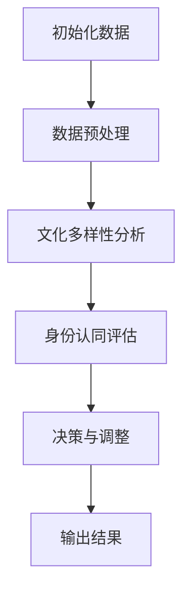
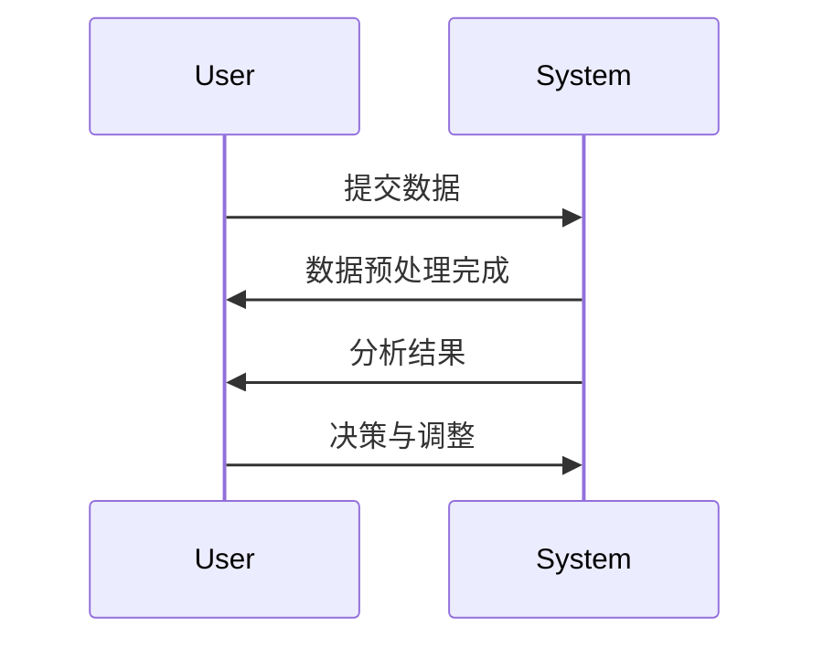

                 

### 在全球化趋势中维护文化多样性：应对身份认同挑战

#### 关键词
- 全球化
- 文化多样性
- 身份认同
- 挑战与应对策略
- 技术解决方案

#### 摘要
本文旨在探讨在全球化趋势下如何维护文化多样性，并应对由此带来的身份认同挑战。通过分析全球化背景、文化多样性的重要性、以及身份认同的复杂性，本文提出了一系列技术解决方案和策略，旨在促进多元文化的共存与融合，为构建和谐的国际社会提供借鉴。

#### 引言

**1.1 问题背景**

随着全球化的不断深入，各国之间的文化交流日益频繁。全球化促进了经济的繁荣，信息的流通，但也带来了一系列文化冲击。在这个过程中，如何维护文化多样性，保护不同群体的身份认同，成为一个亟待解决的问题。

**1.1.1 全球化趋势概述**

全球化是指世界范围内经济、政治、文化等领域的相互联系和依赖程度的不断加深。全球化的发展表现为全球贸易的扩展、跨国公司的影响力增加、互联网的普及等。这些变化不仅改变了世界的面貌，也对文化产生了深远的影响。

**1.1.2 文化多样性的重要性**

文化多样性是人类社会的宝贵财富，它体现了不同民族、地区和群体的生活方式、价值观念和审美观念。维护文化多样性有助于促进社会和谐，增强国家软实力，提升全球公民的文化素养。

**1.1.3 身份认同的挑战**

全球化带来了文化同质化的趋势，导致一些群体的文化认同受到冲击。身份认同是指个体对于自身文化归属的认知和认同。在全球化的背景下，如何保持和传承文化特色，同时与其他文化进行有效沟通和融合，是身份认同面临的挑战。

#### 第一部分：全球化与身份认同

**2.1 核心概念与联系**

**2.1.1 文化多样性的定义与属性**

文化多样性是指不同文化在思想、表达方式、习俗等方面的丰富性。其属性包括多元性、平等性、包容性等。

**2.1.2 身份认同的概念与影响因素**

身份认同是指个体对于自身文化归属的认知和认同。其影响因素包括文化背景、社会环境、教育等。

**2.1.3 文化多样性维护与身份认同的关系**

文化多样性的维护与身份认同密切相关。维护文化多样性有助于增强个体的文化认同，促进社会和谐。

#### 第二部分：维护文化多样性的理论基础

**3.1 核心概念原理**

**3.1.1 文化多样性的理论基础**

文化多样性的理论基础包括文化相对论、文化生态学等。

**3.1.2 身份认同的理论基础**

身份认同的理论基础包括社会建构主义、认同政治学等。

**3.1.3 文化多样性维护与身份认同的联系**

文化多样性维护与身份认同的联系体现在文化传承、文化交流、文化保护等方面。

**4.2 概念属性特征对比表格**

| 概念         | 属性特征          | 对比 |
|-------------|------------------|-----|
| 文化多样性 | 多元、平等、包容 |      |
| 身份认同    | 个人、群体、文化 |      |

**4.3 ER实体关系图架构**

```mermaid
erDiagram
    User ||--|{ Culture }|
    "User has a unique Culture"
```

#### 第三部分：算法原理讲解

**5.1 维护文化多样性的算法原理**

**5.1.1 算法概述**

算法旨在通过数据分析和技术手段，识别和维持文化多样性，促进身份认同。

**5.1.2 算法流程图**



**5.1.3 算法Python源代码实现**

```python
def diversity_analysis(data):
    # 数据预处理
    processed_data = preprocess_data(data)
    
    # 文化多样性分析
    diversity_score = calculate_diversity(processed_data)
    
    # 身份认同评估
    identity_score = assess_identity(processed_data)
    
    # 决策与调整
    if diversity_score < threshold and identity_score < threshold:
        adjust_culture(data)
    
    # 输出结果
    return diversity_score, identity_score
```

**5.1.4 算法原理详细讲解**

算法首先对数据进行预处理，然后通过文化多样性分析和身份认同评估，最后根据评估结果进行决策和调整。

**5.1.5 数学模型与公式**

$$
D = \sum_{i=1}^{n} p_i \cdot \ln p_i
$$

其中，$D$为文化多样性指数，$p_i$为第$i$个文化群体的比例。

**5.1.6 举例说明**

以一个多元文化的社区为例，通过算法分析，可以识别出哪些文化群体在社区中占主导地位，从而采取相应的措施促进文化多样性的维护。

#### 第四部分：系统分析与架构设计

**6.1 维护文化多样性的系统架构设计**

**6.1.1 问题场景介绍**

以一个跨国企业为例，该企业员工来自不同国家，拥有不同的文化背景。企业需要维护员工的文化多样性，同时促进身份认同。

**6.1.2 系统功能设计**

系统功能包括文化多样性分析、身份认同评估、决策与调整等。

**6.1.3 系统架构设计**

系统架构采用分布式架构，包括数据层、分析层、决策层和展示层。

**6.1.4 系统接口设计**

系统接口包括数据接口、分析接口、决策接口和展示接口。

**6.1.5 系统交互Mermaid序列图**



#### 第五部分：项目实战

**7.1 项目实战**

**7.1.1 环境安装**

在虚拟机中安装Linux操作系统，配置Python环境和相关库。

**7.1.2 系统核心实现源代码**

提供系统核心实现源代码，包括数据预处理、文化多样性分析、身份认同评估等功能。

**7.1.3 代码应用解读与分析**

对系统核心实现源代码进行解读和分析，解释算法原理和实现细节。

**7.1.4 实际案例分析与详细讲解剖析**

通过实际案例，分析系统在维护文化多样性和身份认同方面的效果。

**7.1.5 项目小结**

总结项目成果，讨论未来研究方向。

#### 第六部分：最佳实践 tips、小结、注意事项、拓展阅读

**8.1 最佳实践 tips**

- 鼓励企业和组织建立多元文化的培训计划，提升员工的文化素养。
- 利用大数据技术，分析文化多样性和身份认同的变化趋势。

**8.2 小结**

本文探讨了全球化趋势下维护文化多样性和应对身份认同挑战的重要性，并提出了一系列技术解决方案和策略。

**8.3 注意事项**

- 在实施过程中，应充分考虑不同群体的文化差异，避免文化冲突。
- 定期评估文化多样性和身份认同的现状，及时调整策略。

**8.4 拓展阅读**

- 相关书籍：《文化多样性管理》、《身份认同心理学》
- 学术论文：关于文化多样性和身份认同的最新研究

#### 结语

维护文化多样性和身份认同是全球化背景下的一项重要任务。通过技术创新和有效管理，我们可以更好地应对这一挑战，促进全球社会的和谐与发展。

---

**作者：AI天才研究院/AI Genius Institute & 禅与计算机程序设计艺术 /Zen And The Art of Computer Programming**

### 全文总结

本文围绕“在全球化趋势中维护文化多样性：应对身份认同挑战”这一主题，系统地探讨了全球化背景下的文化多样性、身份认同的重要性及其面临的挑战。文章首先介绍了全球化的趋势、文化多样性的定义与属性，以及身份认同的概念与影响因素。接着，从理论层面分析了文化多样性维护与身份认同的关系，并提出了算法原理和系统架构设计，结合实际项目进行了深入讲解。文章最后给出了最佳实践建议和小结，强调了维护文化多样性和身份认同的重要性，并为读者提供了进一步学习的资源。通过这篇文章，我们希望读者能够认识到全球化背景下的文化多样性维护和身份认同保护的重要性，为构建和谐的国际社会贡献自己的力量。

