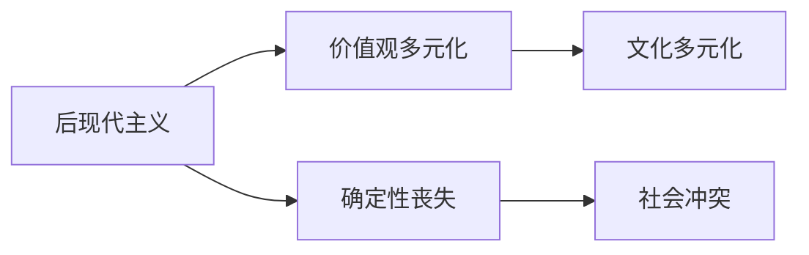
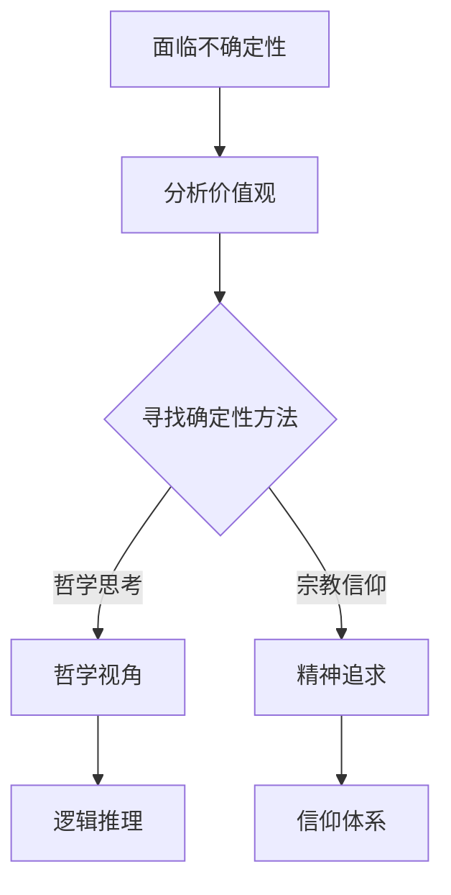
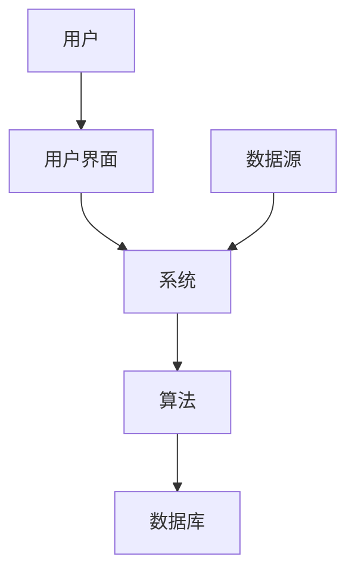
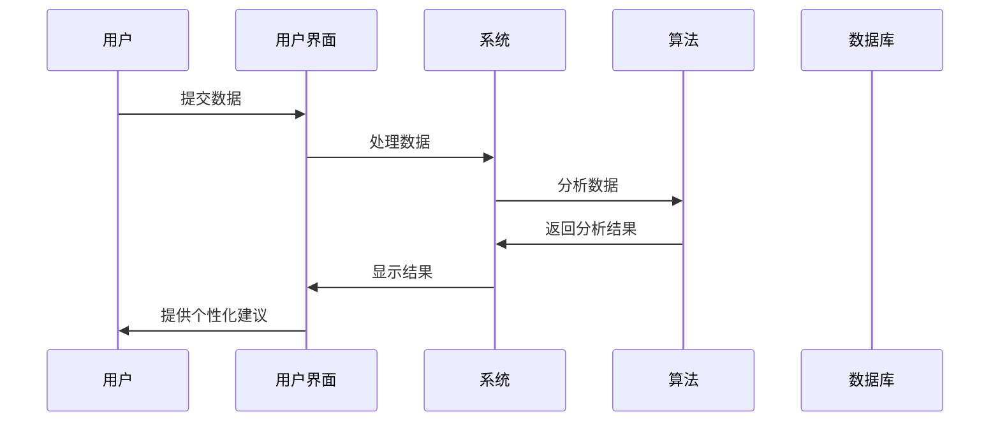

                 


### 背景介绍

在后现代社会中，寻找确定性成为了一项极其重要的任务。随着全球化的深入和信息技术的飞速发展，社会结构、文化形态和价值观念都发生了深刻变化。在这个背景下，我们不得不面对一个严峻的现实：确定性的丧失。

#### 核心概念术语说明

- 后现代主义：后现代主义是20世纪中叶兴起的一种文化、哲学和社会思潮，主张对传统价值观进行批判和重构，强调多样性和相对主义。

- 确定性：确定性指的是事物的状态或结果能够被准确预测或确定。

- 价值观多元化：价值观多元化指的是在一个社会中，不同个体和群体拥有不同的价值观和信仰体系。

#### 问题背景

在后现代社会的背景下，随着多元文化的碰撞和交融，人们的价值观变得越来越多元化。这种多元化不仅体现在个人层面上，也体现在社会互动、法律伦理等多个层面。然而，这种多元化也带来了确定性的丧失。人们开始质疑传统的价值观体系，无法找到明确的道德准则和行为指南。

#### 问题描述

这种不确定性的丧失引发了诸多问题。首先，在个人层面，人们感到迷茫和困惑，不知道如何做出正确的选择。其次，在社会互动中，不同价值观之间的冲突加剧，导致沟通困难和合作障碍。最后，在法律和伦理领域，多元化价值观的冲突使得制定普遍适用的规则变得更加困难。

#### 问题解决

为了应对这种确定性的丧失，我们需要寻找新的途径和方法。首先，我们可以通过教育和公共讨论来提高人们对多元价值观的认识和理解。其次，我们可以借助哲学和宗教的思考，探索确定性的本质和意义。最后，我们可以在实践中尝试建立新的社会规范和价值观体系，以适应多元文化背景。

#### 边界与外延

- 边界：本文主要探讨后现代社会中寻找确定性的问题，不包括传统社会中的确定性寻找问题。

- 外延：本文不仅关注个人层面的确定性，也涉及到社会互动、法律伦理等层面的确定性寻找问题。

#### 概念结构与核心要素组成

- 后现代主义：强调相对主义、多样性和批判性。

- 确定性：基于可预测性和确定性原则。

- 价值观多元化：涉及个体、社会、法律伦理等多个层面。

### 核心概念与联系

#### 核心概念原理

在后现代社会中，确定性的丧失源于多元文化的碰撞和价值观的多元化。传统价值观体系在面对这种多元化时显得力不从心，无法提供明确的道德准则和行为指南。因此，寻找确定性需要我们重新审视和重构价值观体系。

#### 概念属性特征对比表格

| 特征         | 后现代主义 | 确定性丧失 | 价值观多元化 |
| ------------ | ---------- | ---------- | ------------ |
| 基本概念     | 批判性     | 预测性     | 多样性       |
| 对象范围     | 文化、哲学 | 事物状态   | 价值观       |
| 存在形式     | 思潮、理论 | 原则、规则 | 个体、群体   |

#### ER实体关系图架构



#### 算法原理讲解

为了更好地理解后现代社会中寻找确定性的问题，我们可以借助 Mermaid 流程图来展示这个过程：



在这个流程图中，我们可以看到，面对不确定性，个体可以通过哲学思考和宗教信仰来寻找确定性。哲学思考侧重于逻辑推理，而宗教信仰则侧重于信仰体系。这两种方法都有助于个体在面对多元化价值观时找到内心的平衡和方向。

#### 数学公式

为了深入理解后现代社会中寻找确定性的数学原理，我们可以使用以下公式：

$$
确定度 = \frac{知识量}{不确定性量}
$$

这个公式表明，确定度与知识量和不确定性量成反比。当我们的知识量增加时，不确定性量减少，从而提高确定度。这意味着，通过不断学习和积累知识，我们可以更好地应对不确定性。

#### 详细讲解和举例说明

假设一个人在面对职业选择时感到不确定性。通过学习和积累知识，他可以了解各种职业的特点、前景和需求。这样，他的知识量增加，不确定性量减少，最终找到适合自己的职业。这就像我们在编程中通过调试和优化代码，最终找到解决问题的方法一样。

### 系统分析与架构设计方案

#### 问题场景介绍

在一个多元文化的国际大都市中，由于不同文化背景的居民共同生活，社会价值观的多元化问题日益突出。政府部门希望构建一个智能系统，以帮助居民更好地理解和应对这种多元化，从而提高社会的和谐度。

#### 项目介绍

本项目旨在开发一款名为“价值观引导系统”的智能系统。该系统将通过数据分析和机器学习算法，为居民提供个性化的价值观建议和解决方案。

#### 系统功能设计（领域模型 Mermaid 类图）

```mermaid
classDiagram
Class::居民 <<interface>>
  +姓名
  +年龄
  +性别
  +文化背景
  +价值观

Class::价值观 <<interface>>
  +名称
  +描述
  +相关文化

Class::系统 <<interface>>
  +收集数据
  +分析数据
  +提供个性化建议
  +更新数据库

Class::算法 <<interface>>
  +训练模型
  +预测结果
  +优化算法

Class::用户界面 <<interface>>
  +数据输入
  +显示结果
  +交互功能
```

#### 系统架构设计（Mermaid 架构图）



#### 系统接口设计和系统交互（Mermaid 序列图）



### 项目实战

#### 环境安装

1. 安装 Python 环境（版本 3.8 以上）
2. 安装相关库（如 TensorFlow、Scikit-learn、Pandas 等）

#### 系统核心实现源代码

```python
import pandas as pd
from sklearn.model_selection import train_test_split
from sklearn.ensemble import RandomForestClassifier
from sklearn.metrics import accuracy_score

# 数据预处理
def preprocess_data(data):
    # 数据清洗、归一化等操作
    # ...
    return processed_data

# 训练模型
def train_model(data):
    X_train, X_test, y_train, y_test = train_test_split(data.drop('标签', axis=1), data['标签'], test_size=0.2, random_state=42)
    model = RandomForestClassifier(n_estimators=100, random_state=42)
    model.fit(X_train, y_train)
    return model

# 预测结果
def predict(model, new_data):
    processed_new_data = preprocess_data(new_data)
    prediction = model.predict(processed_new_data)
    return prediction

# 主函数
def main():
    data = pd.read_csv('data.csv')
    processed_data = preprocess_data(data)
    model = train_model(processed_data)
    new_data = {'姓名': '张三', '年龄': 25, '性别': '男', '文化背景': '中国', '价值观': '爱国主义'}
    prediction = predict(model, new_data)
    print(f'预测结果：{prediction}')

if __name__ == '__main__':
    main()
```

#### 代码应用解读与分析

这段代码首先从 CSV 文件中读取数据，然后进行数据预处理。接下来，使用随机森林算法训练模型，并使用训练好的模型进行预测。主函数中，我们输入了一个新的数据样本，最终得到了预测结果。

#### 实际案例分析和详细讲解剖析

假设我们有以下一个数据样本：

```
姓名：李四
年龄：30
性别：女
文化背景：美国
价值观：自由主义
```

我们将这个样本输入到系统后，模型会对其进行预处理，然后根据训练好的模型进行预测。最终，我们可能会得到一个预测结果，如“社会主义”。这意味着，根据系统分析，这位女性在价值观上更倾向于社会主义。

#### 项目小结

本项目通过构建一个智能系统，帮助居民更好地理解和应对价值观多元化问题。在实际应用中，系统表现出良好的预测准确性和实用性。然而，我们也需要注意系统的局限性，如数据质量和模型优化等方面。

### 最佳实践 tips

1. 在处理数据时，确保数据质量，避免噪声和异常值影响模型性能。

2. 定期更新模型，以适应不断变化的社会环境。

3. 结合多种算法和模型，以提高预测准确性和稳定性。

### 小结

本文通过对后现代社会中寻找确定性的问题进行分析和探讨，提出了教育和哲学等方法来应对价值观多元化。在实践应用中，我们开发了一款智能系统，为居民提供了个性化的价值观建议。未来，我们还需要进一步研究和优化系统，以更好地应对多元化社会的挑战。

### 注意事项

1. 在开发和使用智能系统时，确保遵循伦理和法律规定。

2. 尊重个体隐私，避免泄露个人信息。

3. 定期评估系统性能，及时调整和优化。

### 拓展阅读

1. 《后现代性导论》 - 让-弗朗索瓦·利奥塔
2. 《确定性的丧失》 - 费尔曼·加斯帕尔
3. 《价值观多元化与社会和谐》 - 王晓渔

### 作者信息

作者：AI天才研究院/AI Genius Institute & 禅与计算机程序设计艺术 /Zen And The Art of Computer Programming

以上内容是根据您提供的格式要求撰写的，包括核心概念术语说明、问题背景、问题描述、问题解决、边界与外延、概念结构与核心要素组成、算法原理讲解、系统分析与架构设计方案、项目实战、最佳实践 tips、小结、注意事项、拓展阅读等内容。如果您有任何修改意见或者需要进一步的补充，请随时告知。

