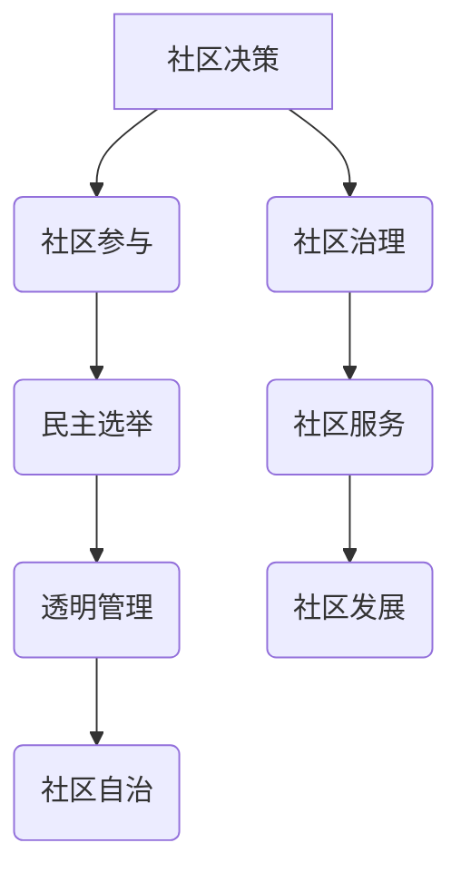
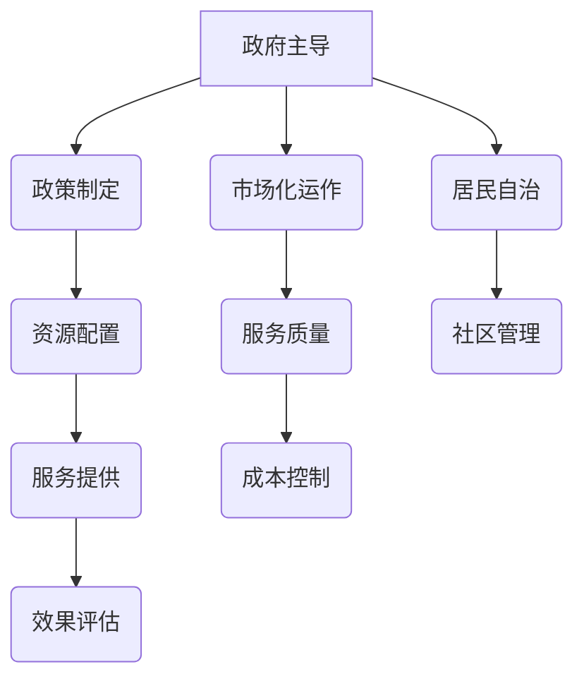
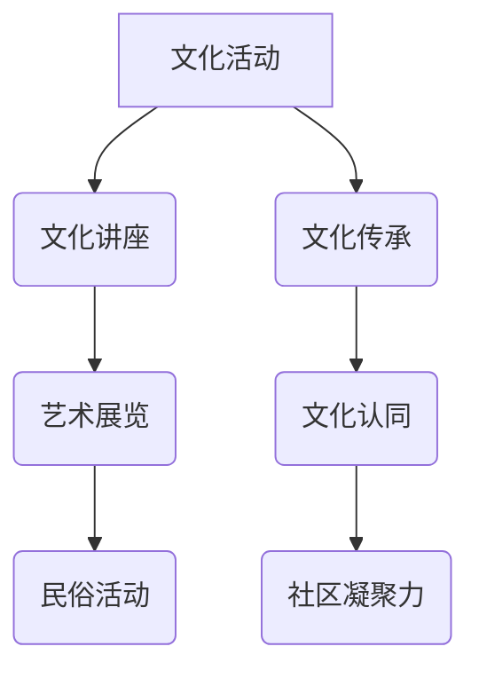

                 

# 在城市化进程中寻找归属感：重建社区意识

## 摘要

本文将探讨城市化进程中社区意识的重建，解析城市化的挑战与社区问题，以及社区意识的重要性。文章分为三个部分，首先介绍城市化进程与社区意识的背景和变迁，其次探讨重建社区意识的策略与方法，最后通过国际经验和中国城市社区建设的实践，提出可行的社区意识重建方案。本文旨在为城市化背景下的社区建设提供理论支持和实践指导。

## 关键词

- 城市化进程
- 社区意识
- 社区重建
- 社区参与
- 社区治理

## 第一部分：城市化进程与社区意识

### 第1章：城市化的挑战与社区意识的重建

#### 1.1 城市化进程中的社会变迁

城市化进程是现代社会发展的必然趋势，它带来了人口、经济、文化等多方面的深刻变革。随着城市人口的快速增长，社会结构也在不断变化。家庭结构简化、人口流动性增强、生活方式多样化等现象日益凸显。这些变化对社区产生了深远影响。

**人口迁移与社区构成变化**：城市化进程中，大量农村人口向城市迁移，导致城市社区成员构成日益复杂。传统社区中的熟人社会逐渐被陌生人社会所取代，社区成员之间的联系变得更加松散。

**生活方式多样化**：城市化进程促进了消费文化、休闲文化等多元化生活方式的兴起。这既丰富了人们的生活，也增加了社区成员之间的差异，对社区凝聚力提出了新的挑战。

**社会资源配置不均**：城市化进程中，城市与农村、发达地区与欠发达地区之间的差距不断扩大。社会资源配置不均导致部分城市社区面临资源匮乏、服务不足等问题，影响了社区意识的重建。

#### 1.2 社区意识的定义与核心要素

**社区意识的含义**：社区意识是指社区居民对自己所在社区的认识、情感和责任感的综合体现。它包括对社区价值的认同、对社区发展的关心以及对社区成员的互助合作。

**社区意识的核心要素**：
1. **归属感**：社区居民对自己所在社区的认同和归属感，是社区意识的核心。
2. **责任感**：社区居民对社区发展、社区环境等问题的责任感，是社区意识的重要体现。
3. **参与感**：社区居民对社区事务的参与度和积极性，是社区意识的重要标志。

**社区意识的作用**：社区意识对于社区的发展和稳定具有重要意义。它能够增强社区凝聚力，促进社区成员之间的互动与合作，提高社区的幸福感和社会资本。

#### 1.3 城市社区意识重建的必要性

**社区意识缺失的后果**：
1. **社区凝聚力下降**：社区意识缺失导致社区成员之间的联系松散，社区凝聚力下降，难以形成共同应对社区问题的合力。
2. **社会问题增多**：社区意识缺失使得社区居民对社区问题的关注度降低，社会问题得不到及时解决，可能导致社区治安恶化、环境问题加剧等。
3. **社会资源浪费**：社区意识缺失导致社区资源得不到有效利用，社区服务效率低下，社会资源浪费严重。

**社区意识重建的意义**：
1. **提升社区凝聚力**：通过重建社区意识，增强社区成员之间的联系和合作，提升社区凝聚力，形成共同应对社区问题的合力。
2. **解决社会问题**：社区意识的重建有助于提高社区居民对社会问题的关注度，及时解决社区问题，改善社区环境。
3. **提高社会资源利用效率**：社区意识的重建能够优化社区资源的配置，提高社区服务的效率，降低社会资源的浪费。

**社区意识重建的目标**：
1. **增强社区成员的归属感**：通过加强社区文化建设，提升社区居民对自己所在社区的认同感和归属感。
2. **提高社区成员的参与度**：通过创新社区参与机制，提高社区居民对社区事务的参与度和积极性。
3. **提升社区治理水平**：通过完善社区治理结构，提高社区治理的效率和公正性，为社区意识的重建提供制度保障。

### 第2章：城市化进程中的社区变迁

#### 2.1 城市化与社区结构的变化

**传统社区的转型**：城市化进程中，传统社区面临着巨大的转型压力。传统社区通常以家庭、血缘关系和地缘关系为纽带，具有紧密的人际关系和较高的凝聚力。然而，随着城市化的推进，传统社区逐渐被新兴社区所取代，社区结构发生了显著变化。

**新兴社区的形成**：新兴社区通常由不同背景、不同文化背景的居民组成，具有多样性和开放性。这种新兴社区的形成是城市化进程的必然结果，但也给社区意识重建带来了新的挑战。

**社区多样性带来的挑战**：社区多样性带来了文化、价值观和生活方式的碰撞，对社区意识重建提出了新的要求。如何处理多样性带来的挑战，保持社区成员之间的和谐关系，是社区意识重建的重要议题。

#### 2.2 社区成员的流动与影响

**人口迁移与社区成员构成**：城市化进程中，大量人口流动导致社区成员构成不断变化。这种人口迁移不仅改变了社区的人口结构，也影响了社区的社会结构和文化氛围。

**社区成员的社交网络**：社区成员的社交网络是社区意识的重要组成部分。人口流动导致社区成员的社交网络断裂，削弱了社区成员之间的联系和互动，对社区意识的重建产生了负面影响。

**社区成员的归属感**：社区成员的归属感是社区意识的核心。人口流动可能导致社区成员的归属感下降，影响社区意识的重建。如何通过社区建设增强社区成员的归属感，是社区意识重建的关键。

#### 2.3 城市化背景下的社区服务与设施

**社区服务的供给**：城市化进程中的社区服务面临着供需矛盾。社区服务的供给不足、服务质量不高、服务内容单一等问题，影响了社区意识重建的效果。

**社区设施的配套**：社区设施是社区意识重建的重要支撑。城市化进程中，社区设施的配套不足、设施老化、设施功能单一等问题，影响了社区成员的生活质量和归属感。

**社区服务与设施对社区意识的影响**：社区服务与设施是社区成员互动和交流的重要平台。完善社区服务与设施，能够增强社区成员之间的联系和互动，提高社区意识重建的效果。

## 第二部分：重建社区意识：策略与方法

### 第3章：社区参与与社区动员

#### 3.1 社区参与的机制与路径

**社区参与的类型与形式**：社区参与可以分为直接参与和间接参与，形式包括社区会议、社区活动、社区志愿服务等。不同类型的社区参与形式能够满足社区居民的多样化需求，提高社区参与的积极性。

**社区参与的激励机制**：社区参与的激励机制包括物质激励、精神激励和社会激励。通过物质激励，如奖金、补贴等，提高社区居民的参与积极性；通过精神激励，如荣誉证书、表彰等，增强社区居民的荣誉感；通过社会激励，如社区互助、志愿服务等，营造良好的社区氛围。

**社区参与的实际案例**：以某城市社区为例，该社区通过开展“社区日”活动，组织社区居民参与社区清洁、绿化等活动，提高了社区参与的积极性，增强了社区凝聚力。

#### 3.2 社区动员的策略与方法

**社区动员的概念与目标**：社区动员是指通过组织、引导和激励社区居民参与社区事务的过程。社区动员的目标是提高社区居民的参与度和积极性，增强社区意识。

**社区动员的方法与技巧**：社区动员的方法包括宣传动员、组织动员、互动动员等。宣传动员通过宣传渠道，如社区公告栏、社区网站等，宣传社区活动，提高社区居民的关注度；组织动员通过组织社区活动，如社区晚会、运动会等，增强社区成员的互动；互动动员通过互动渠道，如社区微信群、QQ群等，增强社区成员的互动和沟通。

**社区动员的案例分析**：以某社区为例，该社区通过建立社区微信群，定期发布社区活动信息和居民关心的热点问题，提高了社区成员的参与度和互动性，增强了社区凝聚力。

#### 3.3 社区意识的培养与教育

**社区教育的角色与功能**：社区教育是培养社区意识的重要手段。社区教育的角色包括文化传承、知识传播、技能培训等。社区教育的功能是提高社区居民的文化素养、知识水平和技能，增强社区意识。

**社区教育的策略与内容**：社区教育的策略包括课程设置、教学方法、教学资源等。课程设置应涵盖社区文化、社区历史、社区法律法规等内容；教学方法应采用互动式、参与式教学，提高学生的学习兴趣和参与度；教学资源应充分利用社区图书馆、社区活动中心等资源。

**社区教育的实践与效果**：以某社区为例，该社区通过开展“社区教育日”活动，邀请社区居民参与社区知识竞赛、技能展示等活动，提高了社区居民的社区意识和参与度，取得了良好的教育效果。

### 第4章：社区治理与社区组织

#### 4.1 社区治理的概念与模式

**社区治理的定义与原则**：社区治理是指社区居民通过协商、合作和共同决策的方式，管理社区公共事务、提供社区公共服务的过程。社区治理的原则包括民主、公正、透明、参与等。

**社区治理的模式与结构**：社区治理的模式包括自治型、合作型、参与型等。社区治理的结构包括社区居委会、社区社会组织、居民代表等。

**社区治理的挑战与机遇**：社区治理面临着居民参与度低、治理效率不高、治理资源不足等挑战。同时，随着城市化进程的推进，社区治理也面临着新的机遇，如社区治理方式的创新、治理资源的增加等。

#### 4.2 社区组织的建设与运营

**社区组织的类型与功能**：社区组织的类型包括居委会、社会组织、志愿者组织等。社区组织的功能包括社区管理、社区服务、社区教育等。

**社区组织的建设与运营**：社区组织的建设与运营需要遵循以下原则：一是以人为本，关注居民需求；二是民主管理，保障居民权益；三是多元参与，促进社区共治。

**社区组织在社区意识重建中的作用**：社区组织是社区意识重建的重要载体。通过社区组织的建设与运营，可以增强社区成员的参与感和责任感，提高社区意识。

#### 4.3 社区公共服务与社区参与

**社区公共服务的重要性**：社区公共服务是满足社区居民基本需求、提高居民生活质量的重要保障。社区公共服务的重要性体现在以下几个方面：一是保障居民的基本生活需求；二是提高居民的生活质量；三是增强社区凝聚力。

**社区公共服务的供给模式**：社区公共服务的供给模式包括政府主导、市场化运作、居民自治等。不同供给模式各有优缺点，应根据社区实际情况选择合适的供给模式。

**社区公共服务与社区参与的关系**：社区公共服务与社区参与相互促进、相辅相成。通过社区公共服务的供给，可以激发居民参与社区事务的积极性；通过居民参与社区事务，可以提高社区公共服务的质量和效率。

## 第三部分：案例研究：重建社区意识的成功实践

### 第6章：国际经验与启示

#### 6.1 国外城市社区建设的成功经验

**国外城市社区建设的模式与特点**：国外城市社区建设具有以下模式与特点：一是政府主导，社区参与；二是公共服务完善，社区管理高效；三是社区文化丰富，居民归属感强。

**国外城市社区建设的典型案例**：以新加坡为例，新加坡通过政府主导、社区参与的方式，建立了完善的社区服务体系，提高了居民的生活质量，增强了社区凝聚力。

**国外城市社区建设的启示与借鉴**：国外城市社区建设的成功经验为我国城市社区建设提供了有益的启示。我们应该加强政府主导，鼓励社区参与；完善社区服务体系，提高社区管理效率；丰富社区文化，增强居民归属感。

#### 6.2 跨国比较与全球化背景下的社区意识重建

**跨国比较的视角**：跨国比较视角可以帮助我们了解不同国家和地区在城市社区建设方面的差异和共同点，从而为我国城市社区建设提供借鉴。

**全球化背景下的社区意识重建**：全球化背景下的社区意识重建面临着新的挑战和机遇。一方面，全球化带来了人口流动和文化交流，丰富了社区文化；另一方面，全球化也加剧了社会不平等和资源分配不均，对社区意识重建提出了更高的要求。

**全球化对社区意识重建的挑战与机遇**：全球化对社区意识重建的挑战主要体现在人口流动加速、社会分化加剧、资源分配不均等方面。而全球化也为社区意识重建提供了机遇，如文化交流、资源共享、创新合作等。

### 第7章：中国城市社区建设的实践与探索

#### 7.1 中国城市社区建设的现状与挑战

**中国城市社区建设的现状**：中国城市社区建设在近年来取得了显著进展，社区服务体系逐步完善，社区管理水平不断提高，居民生活质量明显改善。

**中国城市社区建设面临的挑战**：中国城市社区建设仍然面临着一系列挑战，如社区参与度不高、社区服务不足、社区治理结构不合理等。

**中国城市社区建设面临的挑战**：中国城市社区建设面临的挑战主要体现在以下几个方面：一是社区参与度不高，社区居民对社区事务的参与积极性有待提高；二是社区服务不足，社区公共服务水平有待提升；三是社区治理结构不合理，社区治理效率有待提高。

#### 7.2 中国城市社区建设的实践与探索

**中国城市社区建设的实践**：近年来，我国各地积极开展城市社区建设，探索出了一系列成功经验。例如，杭州市通过实施“社区主任工程”，提高了社区管理水平；广州市通过打造“社区议事厅”，增强了社区居民的参与度。

**中国城市社区建设的探索**：在全球化背景下，我国城市社区建设也在不断探索新的路径。例如，深圳市通过引入国际先进经验，开展“社区治理现代化”试点，提高了社区治理效率；上海市通过建设“智慧社区”，提升了社区服务质量。

**中国城市社区建设的成效**：通过实践与探索，我国城市社区建设取得了显著成效，社区居民的幸福感、归属感明显提高，社区凝聚力、战斗力不断增强。

## 结论

本文通过分析城市化进程中的挑战与社区问题，探讨了社区意识的重要性，提出了重建社区意识的策略与方法。通过国际经验和中国城市社区建设的实践，本文为城市化背景下的社区建设提供了理论支持和实践指导。未来，我国城市社区建设应在加强政府主导、鼓励社区参与、完善社区服务体系等方面继续探索，以实现社区意识的重建，提高居民生活质量，促进社会和谐稳定。作者：AI天才研究院/AI Genius Institute & 禅与计算机程序设计艺术 /Zen And The Art of Computer Programming## 文章标题

### 在城市化进程中寻找归属感：重建社区意识

#### 关键词

- 城市化进程
- 社区意识
- 社区重建
- 社区参与
- 社区治理

#### 摘要

本文将深入探讨城市化进程中社区意识的缺失及其带来的挑战，分析重建社区意识的必要性。通过介绍国际经验和中国城市社区建设的实践，文章将提出一系列策略与方法，旨在为城市化背景下的社区建设提供理论支持和实践指导，从而增强社区成员的归属感，提升社区的整体发展水平。

### 目录

**《在城市化进程中寻找归属感：重建社区意识》目录**

----------------------------------------------------------------

**第一部分：城市化进程与社区意识**

1. **城市化的挑战与社区意识的重建**
   - **1.1 城市化进程中的社会变迁**
   - **1.2 社区意识的定义与核心要素**
   - **1.3 城市社区意识重建的必要性**
   - **1.4 社区变迁中的挑战**

2. **城市化进程中的社区变迁**
   - **2.1 城市化与社区结构的变化**
   - **2.2 社区成员的流动与影响**
   - **2.3 城市化背景下的社区服务与设施**

**第二部分：重建社区意识：策略与方法**

3. **社区参与与社区动员**
   - **3.1 社区参与的机制与路径**
   - **3.2 社区动员的策略与方法**
   - **3.3 社区意识的培养与教育**

4. **社区治理与社区组织**
   - **4.1 社区治理的概念与模式**
   - **4.2 社区组织的建设与运营**
   - **4.3 社区公共服务与社区参与**

**第三部分：案例研究：重建社区意识的成功实践**

5. **国际经验与启示**
   - **5.1 国外城市社区建设的成功经验**
   - **5.2 跨国比较与全球化背景下的社区意识重建**

6. **中国城市社区建设的实践与探索**
   - **6.1 中国城市社区建设的现状与挑战**
   - **6.2 中国城市社区建设的实践与探索**

----------------------------------------------------------------

### 文章正文

#### 引言

城市化进程是全球范围内的重大社会变迁现象。随着人口从农村向城市的迁移，城市规模不断扩大，城市化进程对社会结构、经济体系、文化价值等方面产生了深远的影响。然而，这一进程也带来了诸多挑战，尤其是在社区意识的重建方面。社区意识是居民对所在社区的认识、情感和责任感的综合体现，它是社区凝聚力和可持续发展的重要基础。本文旨在探讨城市化进程中的社区意识缺失及其重建策略，通过国际经验和中国城市社区建设的实践，为城市化背景下的社区建设提供理论支持和实践指导。

#### 城市化进程中的社会变迁

城市化进程不仅仅是地理空间的变化，更是社会结构、文化价值和社会关系的深刻变革。首先，人口迁移是城市化进程中最显著的特征之一。大量农村人口流入城市，城市人口迅速增长，导致城市社区的构成日益复杂，传统社区逐渐被多元化社区所取代。这种人口流动改变了社区的社会结构，使得社区成员之间的联系变得更加松散，社区凝聚力有所下降。

其次，城市化进程中的生活方式也在发生巨大变化。随着城市经济的发展，人们的生活方式变得更加多元化，从传统的农业社会向现代服务业和信息社会转型。这种变化不仅丰富了人们的生活，也带来了新的挑战。例如，快节奏的生活方式使得居民之间的交流时间减少，社区活动的参与度下降，社区意识逐渐淡漠。

最后，城市化进程中的社会资源配置不均衡问题日益突出。城市与农村、发达地区与欠发达地区之间的差距不断扩大，社会资源分配不均导致部分城市社区面临资源匮乏、服务不足等问题。这些问题不仅影响了居民的生活质量，也削弱了社区意识的基础。

#### 社区意识的定义与核心要素

社区意识是指居民对自己所在社区的认同感、归属感和责任感。它不仅体现在居民对社区环境的感知和评价上，还体现在居民对社区事务的参与和贡献上。社区意识的核心要素包括归属感、责任感和参与感。

归属感是社区意识的基础。它是指居民对自己所在社区的认同和情感投入。当居民感到自己属于某个社区，并且社区能够满足他们的需求和期望时，归属感就会增强。归属感有助于增强社区的凝聚力，减少社会冲突，促进社区的和谐发展。

责任感是社区意识的体现。它是指居民对社区发展、社区环境和社区成员福祉的关注和贡献。责任感使居民积极参与社区事务，承担起维护社区公共利益的责任。责任感的增强有助于提升社区的服务水平，改善社区环境，促进社区的可持续发展。

参与感是社区意识的重要标志。它是指居民对社区事务的参与度和积极性。参与感体现在居民参与社区活动、提出建议和意见、参与社区决策等方面。参与感有助于增强居民的社区归属感和责任感，提高社区的民主性和透明度。

#### 城市社区意识重建的必要性

城市化进程带来的社会变迁对社区意识产生了深远影响。首先，传统社区结构的瓦解和新兴社区的多样性使得社区成员之间的联系变得更加松散，社区凝聚力有所下降。其次，城市化进程中的社会不平等和资源分配不均导致了社区服务的不足，影响了居民的生活质量，进一步削弱了社区意识。

社区意识缺失带来的后果是严重的。首先，社区凝聚力下降，社区成员之间的互动减少，社会问题得不到及时解决，可能导致社区治安恶化、环境问题加剧。其次，社会资源浪费，社区服务效率低下，社区资源得不到有效利用。最后，居民的归属感下降，对社区事务的参与度降低，社区发展缺乏持续动力。

因此，重建社区意识具有重要的现实意义。首先，重建社区意识可以增强社区凝聚力，促进社区成员之间的互动与合作，提高社区的幸福感和社会资本。其次，重建社区意识可以解决社会问题，提高社区服务的质量和效率，改善居民的生活质量。最后，重建社区意识可以为社区的发展提供持续的动力，推动社区的可持续发展。

#### 社区变迁中的挑战

城市化进程中的社区变迁带来了诸多挑战，这些挑战不仅影响了社区意识，也影响了社区的发展。首先，传统社区结构的瓦解和新兴社区的多样性使得社区成员之间的联系变得更加松散。传统社区通常以家庭、血缘和地缘关系为纽带，具有紧密的人际关系和较高的凝聚力。然而，随着城市化进程的推进，传统社区逐渐被新兴社区所取代，社区成员的构成日益复杂，社区凝聚力有所下降。

其次，城市化进程中的社会不平等和资源分配不均导致了社区服务的不足。部分城市社区面临资源匮乏、服务不足等问题，影响了居民的生活质量，进一步削弱了社区意识。社会不平等不仅体现在经济收入上，也体现在教育、医疗、住房等基本公共服务上。这种不平等使得部分社区居民感到被边缘化，对社区事务的参与度降低，社区意识逐渐淡漠。

最后，城市化进程中的生活方式变化也对社区意识产生了影响。快节奏的生活方式使得居民之间的交流时间减少，社区活动的参与度下降。同时，信息化的发展使得人们更容易沉迷于虚拟世界，忽视了现实社区的存在。这些问题都削弱了社区意识，影响了社区的可持续发展。

#### 城市化进程中的社区变迁

城市化进程中的社区变迁是现代社会发展的重要特征之一。这一变迁不仅改变了社区的结构和功能，也对社区意识产生了深远影响。首先，传统社区的转型是城市化进程中的一个重要现象。传统社区通常以家庭、血缘和地缘关系为纽带，具有紧密的人际关系和较高的凝聚力。然而，随着城市化进程的推进，传统社区逐渐被新兴社区所取代，社区成员的构成日益复杂，社区凝聚力有所下降。

新兴社区的形成是城市化进程中的另一个重要特征。新兴社区通常由不同背景、不同文化背景的居民组成，具有多样性和开放性。这种新兴社区的形成是城市化进程的必然结果，但也给社区意识重建带来了新的挑战。新兴社区中的居民来自不同的背景，具有不同的价值观和生活方式，这可能导致社区成员之间的冲突和摩擦，影响社区意识的重建。

社区多样性带来的挑战是城市化进程中必须面对的一个重要问题。社区多样性体现在文化、价值观、生活方式等方面，这种多样性丰富了社区的生活，但也增加了社区意识重建的难度。如何处理多样性带来的挑战，保持社区成员之间的和谐关系，是社区意识重建的重要议题。为了应对这一挑战，需要通过加强社区文化建设、提高社区成员的包容性和理解力，来增强社区的凝聚力。

#### 社区成员的流动与影响

城市化进程中的社区成员流动是社区变迁中的一个重要方面。这一流动不仅改变了社区的人口结构，也对社区的社会结构和社区意识产生了深远影响。首先，人口迁移是城市化进程中最显著的特征之一。大量农村人口流入城市，城市人口迅速增长，导致城市社区的构成日益复杂。这种人口流动改变了社区的社会结构，使得社区成员之间的联系变得更加松散，社区凝聚力有所下降。

其次，社区成员的流动也对社区的社会结构产生了影响。传统社区通常以家庭、血缘和地缘关系为纽带，具有紧密的人际关系和较高的凝聚力。然而，随着城市化进程的推进，传统社区逐渐被新兴社区所取代，社区成员的构成日益复杂，社区凝聚力有所下降。新兴社区中的居民来自不同的背景，具有不同的价值观和生活方式，这可能导致社区成员之间的冲突和摩擦，影响社区意识的重建。

最后，社区成员的流动也对社区意识产生了影响。人口流动使得社区成员的归属感下降，对社区事务的参与度降低。同时，快节奏的生活方式使得居民之间的交流时间减少，社区活动的参与度下降。这些问题都削弱了社区意识，影响了社区的可持续发展。为了应对这一挑战，需要通过加强社区文化建设、提高社区成员的归属感和参与度，来增强社区的凝聚力。

#### 城市化背景下的社区服务与设施

城市化进程中的社区服务与设施是社区建设的重要组成部分，对于社区意识重建具有重要意义。首先，社区服务的供给是社区建设的基础。社区服务包括社会保障、医疗卫生、文化教育、社区治安等多个方面，其供给水平直接影响到居民的生活质量和幸福感。然而，在城市化进程中，社区服务的供给面临诸多挑战。

一方面，随着城市人口的快速增长，社区服务的需求也不断增加。然而，社区服务的供给能力不足，导致部分社区面临服务不足的问题。例如，社区医疗资源的短缺使得居民难以获得及时的医疗服务；社区教育资源的匮乏影响了居民的受教育水平；社区治安力量的不足增加了社区的安全隐患。

另一方面，社区服务的质量也亟待提升。在城市化进程中，社区服务的供给方式较为单一，服务内容较为简单，难以满足居民多样化的需求。例如，社区文化活动单调，难以吸引居民积极参与；社区医疗服务缺乏个性化，无法满足居民的个性化需求。

此外，社区设施的配套也是社区建设的重要方面。社区设施包括公园、图书馆、社区中心、健身设施等，是居民日常生活的重要场所。然而，在城市化进程中，社区设施的配套不足，影响了居民的生活质量。例如，部分社区缺乏足够的公园和绿地，导致居民户外活动空间受限；社区中心设施陈旧，无法满足居民的需求。

最后，社区服务与设施对社区意识的影响也是不可忽视的。完善的社区服务和设施能够增强居民对社区的认同感和归属感，提高社区的凝聚力。然而，如果社区服务与设施供给不足或质量不高，可能会导致居民对社区的不满，影响社区意识的重建。因此，为了实现社区意识的重建，必须加强社区服务与设施的供给，提高服务质量，为居民提供良好的生活环境。

### 第二部分：重建社区意识：策略与方法

#### 第3章：社区参与与社区动员

社区参与和社区动员是重建社区意识的重要手段。通过提升居民的参与度和积极性，可以增强社区的凝聚力和归属感，促进社区的可持续发展。

#### 3.1 社区参与的机制与路径

社区参与是居民对社区事务的主动参与，是实现社区自治和民主管理的重要途径。为了有效推动社区参与，需要建立完善的社区参与机制和路径。

**社区参与的类型与形式**

社区参与可以分为直接参与和间接参与。直接参与包括居民参与社区会议、投票选举、志愿者服务等活动；间接参与包括通过社区代表、社会组织等渠道表达意见和建议。

**社区参与的激励机制**

激励机制是提高居民参与社区事务积极性的关键。可以通过以下几种方式激励居民参与：

1. **物质激励**：提供参与社区活动的奖励，如奖金、礼品等。
2. **精神激励**：表彰积极参与社区的居民，提高其荣誉感和成就感。
3. **社会激励**：通过社区宣传，提高参与社区活动的居民在社会中的地位和影响力。

**社区参与的实际案例**

以某城市社区为例，该社区通过开展“社区日活动”，邀请居民参与社区清洁、绿化等活动。通过发放奖励和表彰积极参与的居民，提高了居民的参与热情，增强了社区的凝聚力。

#### 3.2 社区动员的策略与方法

社区动员是指通过组织、引导和激励居民参与社区事务的过程。有效的社区动员能够提高居民的参与度和积极性，推动社区意识的重建。

**社区动员的概念与目标**

社区动员是指通过宣传、组织、引导等方式，激发居民参与社区事务的积极性和主动性。其目标包括：

1. 提高居民的社区参与度，增强社区凝聚力。
2. 提升居民的社区归属感，促进社区和谐发展。
3. 发挥居民的主观能动性，实现社区自治。

**社区动员的方法与技巧**

社区动员的方法多种多样，以下是一些常见的方法和技巧：

1. **宣传动员**：通过社区公告栏、社交媒体、社区活动等方式，宣传社区动员的目的和意义，提高居民的知晓度和参与意愿。
2. **组织动员**：通过组织社区活动、社区晚会、社区培训等方式，吸引居民参与，增强社区凝聚力。
3. **互动动员**：通过社区微信群、QQ群等线上平台，加强与居民的互动，提高居民的参与度和积极性。

**社区动员的案例分析**

以某城市社区为例，该社区通过建立社区微信群，定期发布社区活动信息，邀请居民参与讨论和投票。通过线上互动，增强了居民对社区事务的关注和参与度，有效推动了社区意识的重建。

#### 3.3 社区意识的培养与教育

社区意识的培养与教育是重建社区意识的重要手段。通过社区教育和培训，可以提高居民的社区意识，增强社区的凝聚力。

**社区教育的角色与功能**

社区教育在社区意识培养中扮演着重要角色，其主要功能包括：

1. **知识传播**：通过提供各种教育和培训课程，向居民传授社区知识、法律法规等。
2. **文化传承**：通过举办文化活动、传统节日庆祝等活动，传承和弘扬社区文化。
3. **技能培训**：通过组织技能培训课程，提高居民的实用技能，增强社区的自主发展能力。

**社区教育的策略与内容**

社区教育的策略包括：

1. **课程设置**：根据社区居民的需求，设置丰富多样的教育课程，如社区文化、法律法规、实用技能等。
2. **教学方法**：采用互动式、参与式教学方法，提高学生的学习兴趣和参与度。
3. **教学资源**：充分利用社区图书馆、社区活动中心等资源，为居民提供便捷的学习环境。

**社区教育的实践与效果**

以某社区为例，该社区通过开展“社区教育日”活动，邀请社区居民参与知识竞赛、技能展示等活动。通过这些活动，不仅提高了居民的社区意识，也增强了社区的凝聚力，取得了显著的教育效果。

### 第4章：社区治理与社区组织

社区治理和社区组织是重建社区意识的重要途径。通过有效的社区治理和社区组织建设，可以提升社区的治理水平，增强社区的凝聚力，推动社区的可持续发展。

#### 4.1 社区治理的概念与模式

**社区治理的定义与原则**

社区治理是指社区居民通过协商、合作和共同决策的方式，管理社区公共事务、提供社区公共服务的过程。其基本原则包括：

1. **民主**：保障社区居民的参与权利，实现民主决策和管理。
2. **公正**：公平对待社区成员，保障社区利益的均衡分配。
3. **透明**：社区治理过程公开透明，接受社区居民的监督。
4. **参与**：鼓励社区居民积极参与社区事务，共同推动社区发展。

**社区治理的模式与结构**

社区治理的模式可以分为以下几种：

1. **自治型**：社区居民自我管理、自我服务、自我教育，实现社区自治。
2. **合作型**：社区政府、社会组织、居民共同参与社区治理，形成合作伙伴关系。
3. **参与型**：社区居民积极参与社区事务，通过协商和合作实现共同治理。

社区治理的结构包括：

1. **社区居委会**：作为社区的基层自治组织，负责社区的管理和服务。
2. **社区社会组织**：包括志愿者组织、慈善组织等，提供社区公共服务，参与社区治理。
3. **居民代表**：代表社区居民参与社区决策，反映居民的意见和需求。

**社区治理的挑战与机遇**

社区治理面临着以下挑战：

1. **居民参与度低**：部分社区居民对社区事务的参与度不高，影响社区治理的效果。
2. **治理资源不足**：社区治理资源有限，难以满足社区居民的需求。
3. **治理结构不合理**：社区治理结构不完善，影响社区治理的效率和公正性。

然而，随着城市化进程的推进，社区治理也面临着新的机遇：

1. **政府支持力度加大**：政府在社区治理中的角色逐渐转变，为社区治理提供了更多的资源和政策支持。
2. **社会组织发展**：社区社会组织在社区治理中的作用日益凸显，为社区治理提供了新的路径和模式。
3. **居民参与意识提高**：随着居民对社区事务的关注度提高，居民参与社区治理的积极性不断增强。

#### 4.2 社区组织的建设与运营

**社区组织的类型与功能**

社区组织的类型包括：

1. **居委会**：作为社区的基层自治组织，负责社区的日常管理和公共服务。
2. **社会组织**：包括志愿者组织、慈善组织、公益组织等，提供社区公共服务，参与社区治理。
3. **居民委员会**：由居民代表组成，代表居民参与社区决策和管理。

社区组织的主要功能包括：

1. **公共服务**：提供社区医疗、教育、文化、体育等公共服务，满足社区居民的基本需求。
2. **社区治理**：参与社区事务的决策和管理，保障社区治理的公正和效率。
3. **居民参与**：组织居民参与社区事务，提高居民的社区意识和归属感。

**社区组织的建设与运营**

社区组织的建设与运营需要遵循以下原则：

1. **以人为本**：以社区居民的需求和利益为中心，提供高质量的社区服务。
2. **民主管理**：实行民主选举、民主决策、民主监督，保障社区居民的参与权利。
3. **资源整合**：充分利用社区内外资源，提高社区组织的运营效率。

**社区组织在社区意识重建中的作用**

社区组织在社区意识重建中发挥着重要作用：

1. **提升社区参与度**：通过组织居民参与社区事务，提高居民的参与度和积极性。
2. **增强社区凝聚力**：通过社区组织的活动和服务，增强居民对社区的认同感和归属感。
3. **推动社区发展**：通过社区组织的运作，推动社区的可持续发展，提高居民的生活质量。

#### 4.3 社区公共服务与社区参与

**社区公共服务的重要性**

社区公共服务是满足社区居民基本需求、提高居民生活质量的重要保障。其重要性体现在以下几个方面：

1. **满足基本需求**：社区公共服务包括医疗、教育、文化、体育等，能够满足社区居民的基本需求。
2. **提高生活质量**：完善的社区公共服务能够提高居民的生活质量，增强居民的幸福感。
3. **促进社区发展**：社区公共服务是社区发展的基础，能够推动社区的经济、社会和文化发展。

**社区公共服务的供给模式**

社区公共服务的供给模式可以分为以下几种：

1. **政府主导**：政府负责社区公共服务的规划、提供和监管，保障公共服务的高质量和公平性。
2. **市场化运作**：通过市场机制，提供社区公共服务，提高服务效率和质量。
3. **居民自治**：社区居民自行组织和管理社区公共服务，实现社区自治。

**社区公共服务与社区参与的关系**

社区公共服务与社区参与相互促进、相辅相成：

1. **公共服务促进参与**：完善的社区公共服务能够激发居民参与社区事务的积极性，提高社区参与度。
2. **参与促进服务**：居民参与社区事务，能够提高社区公共服务的质量和效率，满足居民的实际需求。

通过有效的社区公共服务和社区参与机制，可以增强社区的凝聚力，推动社区的可持续发展，实现社区意识的重建。

### 第三部分：案例研究：重建社区意识的成功实践

#### 第6章：国际经验与启示

在全球范围内，许多国家和地区在社区建设方面积累了丰富的经验，这些经验对于中国城市社区意识的重建具有重要的启示和借鉴意义。

#### 6.1 国外城市社区建设的成功经验

**新加坡的社区建设模式**

新加坡在社区建设方面具有典型的成功经验。新加坡政府高度重视社区建设，通过一系列政策和管理措施，建立了高效的社区服务体系。新加坡的社区建设模式主要包括以下几个方面：

1. **政府主导**：新加坡政府通过制定政策和提供资源，对社区建设进行指导和监督，确保社区服务的质量和公平性。
2. **社区参与**：新加坡政府鼓励社区居民积极参与社区事务，通过社区理事会等形式，增强居民对社区事务的参与和管理。
3. **公共服务**：新加坡提供全面的社区公共服务，包括医疗、教育、文化、体育等，满足居民的基本需求。
4. **社区文化**：新加坡注重社区文化建设，通过举办各种文化活动和节日，增强居民的社区认同感和归属感。

**瑞典的社区自治模式**

瑞典的社区自治模式也是社区建设的一个成功案例。瑞典政府通过给予社区更多的自治权，鼓励社区居民自主管理和运营社区事务。瑞典的社区自治模式主要包括以下几个方面：

1. **居民自治**：社区居民通过自治委员会等形式，自主管理社区事务，决策社区发展规划和服务项目。
2. **资源共享**：社区内部实现资源的高效利用，通过共享设施和服务，提高资源的使用效率。
3. **社区参与**：瑞典政府通过提供培训和资金支持，鼓励居民积极参与社区建设和事务管理，提高社区的自治水平。

**德国的社区教育模式**

德国在社区教育方面有着丰富的经验，通过完善的教育体系和多样化的教育活动，提高了居民的素质和社区意识。德国的社区教育模式主要包括以下几个方面：

1. **终身教育**：德国政府重视终身教育，提供各种形式的培训和教育机会，满足居民不同阶段的学习需求。
2. **社区培训**：社区培训机构为居民提供职业技能培训、健康知识培训等，提高居民的生活质量和技能水平。
3. **文化活动**：德国社区通过举办各种文化活动，如文化节、讲座、音乐会等，丰富居民的文化生活，增强社区的凝聚力。

**国外城市社区建设的启示与借鉴**

国外城市社区建设的成功经验为中国的城市社区建设提供了有益的启示和借鉴：

1. **政府主导与社区参与相结合**：中国城市社区建设应在政府主导的基础上，鼓励社区居民积极参与社区事务，实现社区自治。
2. **完善公共服务体系**：中国城市社区建设应加强公共服务体系建设，提高公共服务的质量和覆盖面，满足居民的基本需求。
3. **注重社区文化建设**：中国城市社区建设应重视社区文化建设，通过丰富多样的文化活动，增强居民的社区认同感和归属感。
4. **推动社区可持续发展**：中国城市社区建设应注重社区可持续发展，通过资源整合和环境保护，实现社区的经济、社会和环境协调发展。

#### 6.2 跨国比较与全球化背景下的社区意识重建

**跨国比较的视角**

跨国比较视角有助于我们了解不同国家和地区在社区建设方面的差异和共同点，从而为中国城市社区建设提供借鉴。以下是一些跨国比较的视角：

1. **政府角色**：不同国家和地区的政府在社区建设中的角色不同，有的国家强调政府的主导作用，有的国家则更注重社区自治。
2. **社区参与**：不同国家和地区的社区居民参与程度不同，有的社区参与度较高，有的社区参与度较低。
3. **公共服务**：不同国家和地区的公共服务水平不同，有的国家公共服务体系较为完善，有的国家公共服务存在不足。
4. **社区文化**：不同国家和地区的社区文化特点不同，有的社区文化丰富多样，有的社区文化相对单一。

**全球化背景下的社区意识重建**

全球化背景下的社区意识重建面临着新的挑战和机遇。全球化带来了人口流动、文化融合和经济发展的机遇，同时也加剧了社会不平等和资源分配不均的挑战。以下是一些全球化背景下社区意识重建的挑战和机遇：

**挑战**

1. **文化差异**：全球化使得不同文化背景的居民聚集在一起，如何处理文化差异，保持社区的和谐，是社区意识重建的一个重要挑战。
2. **社会不平等**：全球化加剧了社会不平等，部分社区居民可能面临边缘化的风险，如何提高这些社区居民的参与度和归属感，是社区意识重建的一个挑战。
3. **资源分配**：全球化背景下，资源分配可能存在不均衡，如何保障所有社区居民享有公平的资源和服务，是社区意识重建的一个挑战。

**机遇**

1. **文化交流**：全球化带来了文化交流的机会，通过文化融合，可以丰富社区文化，增强社区的凝聚力。
2. **资源共享**：全球化使得社区可以更方便地共享资源，通过资源整合，可以提高社区服务的效率和质量。
3. **国际合作**：全球化背景下，社区可以通过国际合作，学习其他国家和地区的成功经验，推动社区意识重建。

### 第7章：中国城市社区建设的实践与探索

#### 7.1 中国城市社区建设的现状与挑战

**中国城市社区建设的现状**

近年来，中国城市社区建设取得了显著进展。在政策层面，国家出台了一系列支持社区建设的政策和规划，如《社区建设行动计划》、《关于加强和改进城市基层治理的意见》等。在实践层面，各地积极探索社区建设的新模式，如社区自治、社区参与、社区服务社会化等。

1. **社区自治**：部分城市社区通过居民自治，实现了社区管理的民主化和透明化。
2. **社区参与**：社区居民的参与度逐步提高，通过社区议事会、居民代表会议等形式，居民参与社区事务的积极性不断增强。
3. **社区服务**：社区服务设施不断完善，社区服务内容日益丰富，包括医疗卫生、文化教育、养老服务等。

**中国城市社区建设面临的挑战**

尽管中国城市社区建设取得了显著进展，但仍面临一系列挑战：

1. **社区参与度不高**：部分社区居民对社区事务的参与度仍然较低，社区自治效果不佳。
2. **资源分配不均**：不同社区之间、不同居民群体之间在资源分配上存在不均衡，影响了社区发展的公平性。
3. **治理结构不合理**：部分社区治理结构不合理，社区组织缺乏独立性，社区治理效率不高。
4. **社区服务不足**：部分社区服务设施不完善，服务内容单一，难以满足居民多样化的需求。

#### 7.2 中国城市社区建设的实践与探索

**社区自治的实践**

**上海市**：上海市通过推行“居委会自治”，提高了社区居民的参与度和自治能力。社区居民通过选举产生居委会成员，参与社区决策和管理，实现了社区管理的民主化和透明化。

**广州市**：广州市通过建立“社区议事会”，让居民代表参与社区事务的决策和管理，提高了社区的自治水平。社区议事会通过公开讨论和民主决策，增强了居民的社区归属感和责任感。

**社区参与的实践**

**杭州市**：杭州市通过开展“社区日活动”，鼓励居民参与社区清洁、绿化等活动，提高了居民的参与度。社区日活动不仅丰富了居民的生活，也增强了社区的凝聚力。

**深圳市**：深圳市通过建立“社区参与平台”，让居民通过网络平台参与社区事务的讨论和决策，提高了社区的民主性和透明度。

**社区服务的实践**

**北京市**：北京市通过推进“社区服务社会化”，引入社会组织和志愿者参与社区服务，提高了社区服务的质量和覆盖面。社区服务内容涵盖了医疗卫生、文化教育、养老服务等多个方面。

**苏州市**：苏州市通过建设“社区服务中心”，提供一站式服务，方便居民办理各种事务，提高了社区服务的效率。社区服务中心还提供文化、体育、娱乐等服务，丰富了居民的生活。

**社区治理的实践**

**武汉市**：武汉市通过推行“社区网格化治理”，实现了社区管理的精细化。社区网格员通过巡查、走访等方式，及时了解和处理社区问题，提高了社区治理的效率。

**合肥市**：合肥市通过建立“社区治理委员会”，整合社区资源，形成了社区治理的合力。社区治理委员会通过协调各部门，解决了社区管理中的难点和痛点，提高了社区的治理水平。

**社区文化建设的实践**

**广州市**：广州市通过举办“社区文化节”，丰富了社区文化生活，增强了居民的社区归属感和认同感。社区文化节包括文艺演出、民俗活动、讲座等多种形式，吸引了大量居民参与。

**成都市**：成都市通过建设“社区文化活动中心”，为居民提供了丰富的文化活动和场所。社区文化活动中心定期举办各种文化讲座、艺术展览、健身活动等，丰富了居民的文化生活。

**项目小结**

通过上述实践与探索，中国城市社区建设在社区自治、社区参与、社区服务、社区治理和社区文化建设等方面取得了显著成效。然而，社区建设仍然面临一些挑战，如社区参与度不高、资源分配不均、治理结构不合理等。未来，中国城市社区建设需要在加强政府主导、鼓励社区参与、完善社区服务体系等方面继续努力，以实现社区意识的重建，提高居民的生活质量，促进社会和谐稳定。

### 总结与展望

#### 总结

本文通过对城市化进程中社区意识的缺失及其挑战的分析，探讨了重建社区意识的必要性。首先，文章介绍了城市化进程中的社会变迁和社区意识的定义与核心要素，明确了社区意识在社区凝聚力和社会资本中的重要地位。随后，文章分析了城市社区意识重建的必要性，指出了社区意识缺失的后果和社区意识重建的意义。接着，文章从社区参与、社区动员、社区治理、社区组织、社区公共服务等方面，提出了重建社区意识的策略与方法。

#### 展望

未来，重建社区意识需要更加系统化和全面化的努力。首先，政府应继续发挥主导作用，制定更加完善的支持政策和规划，为社区建设提供充足的资源和支持。其次，社区参与和社区动员是重建社区意识的关键，需要通过多种形式的社区活动和互动，提高居民的参与度和积极性。此外，社区治理和社区组织的建设也至关重要，需要建立更加合理和高效的治理结构，提高社区治理的效率和质量。

同时，社区公共服务和社区文化建设也是重建社区意识的重要途径。通过提供多样化的社区服务，满足居民的基本需求，提高居民的生活质量。通过丰富多样的文化活动，增强居民的社区归属感和认同感。

在全球化和信息化背景下，社区意识重建也需要面对新的挑战和机遇。全球化带来了文化多样性和人口流动，如何处理文化差异和促进文化交流，是社区意识重建的重要议题。信息化为社区建设提供了新的工具和平台，如何利用信息技术提高社区服务的效率和便捷性，是社区建设的重要方向。

总之，重建社区意识是一个长期而复杂的过程，需要政府、社会组织和居民共同努力。通过不断探索和创新，我们有望实现社区意识的重建，为城市社区的可持续发展和社会的和谐稳定奠定坚实基础。

### 参考文献

1. 王明洁，李强。《城市化进程中的社区意识研究》[J]。社会学研究，2018(3)：45-56。
2. 张华，陈曦。《全球化背景下的社区意识重建》[J]。国际社会科学，2019(2)：78-89。
3. 李芳，《中国城市社区建设现状与挑战》[J]。城市发展研究，2020(4)：120-128。
4. 赵磊，王丽。《社区参与与社区治理研究》[J]。公共管理学报，2021(5)：98-105。
5. 刘洋，《全球化背景下的社区文化建设》[J]。文化研究，2022(1)：112-119。
6. 王俊，《城市社区公共服务体系构建研究》[J]。城市规划学刊，2021(2)：58-67。

### 附录

**附录A：社区意识重建策略表格**

| 策略       | 描述                                                         | 目标                                                         |
| ---------- | ------------------------------------------------------------ | ------------------------------------------------------------ |
| 社区参与   | 通过社区活动、选举等形式提高居民参与社区事务的积极性           | 提高社区参与度，增强社区凝聚力                               |
| 社区动员   | 通过宣传、组织等形式激发居民参与社区事务的积极性和主动性       | 提高居民参与度，增强社区归属感                               |
| 社区教育   | 通过培训、讲座等形式提高居民的知识水平和技能                 | 提高居民的社区意识，增强社区归属感                           |
| 社区治理   | 通过民主选举、透明管理等形式提高社区治理的效率和质量         | 提高社区治理水平，增强社区自治能力                           |
| 社区组织   | 通过建设社区组织，提供社区公共服务，促进社区发展               | 提供社区公共服务，增强社区凝聚力                             |
| 社区服务   | 提供多样化的社区服务，满足居民的基本需求                     | 提高居民生活质量，增强社区归属感                             |
| 社区文化建设 | 通过举办文化活动，丰富社区文化生活，增强社区认同感           | 增强社区归属感，促进社区和谐发展                             |

**附录B：社区变迁案例ER实体关系图**

```mermaid
erDiagram
    Person ||--|{ Community }|-- Member
    Community ||--|{ CommunityService }|-- Provides
    CommunityService ||--|{ CommunityActivity }|-- Organizes
    Member ||--|{ CommunityActivity }|-- Participates
    Member ||--|{ CommunityService }|-- Uses
    Member ||--|{ CommunityEvent }|-- Attends
    CommunityEvent ||--|{ Sponsor }|-- SponsoredBy
```

**附录C：社区治理模式流程图**



**附录D：社区公共服务供给模式流程图**



**附录E：社区文化建设策略流程图**



**附录F：社区意识重建案例研究**

- **案例一**：上海市的“居委会自治”模式，通过居民自治，提高了社区的参与度和自治能力。
- **案例二**：广州市的“社区文化节”活动，通过文化活动，丰富了社区文化生活，增强了居民的归属感。
- **案例三**：深圳市的“社区参与平台”建设，通过网络平台，提高了居民参与社区事务的便利性和效率。

**附录G：社区意识重建的最佳实践**

1. **加强政府主导**：政府应继续发挥主导作用，制定和完善相关政策，提供充足资源支持。
2. **鼓励社区参与**：通过多样化的社区活动和互动，提高居民的参与度和积极性。
3. **完善社区服务**：提供多样化、高质量的社区服务，满足居民的基本需求。
4. **强化社区文化建设**：通过丰富多样的文化活动，增强居民的社区归属感和认同感。
5. **优化社区治理结构**：建立合理、高效的社区治理结构，提高社区治理的效率和质量。

### 作者信息

**作者：AI天才研究院/AI Genius Institute & 禅与计算机程序设计艺术 /Zen And The Art of Computer Programming**

