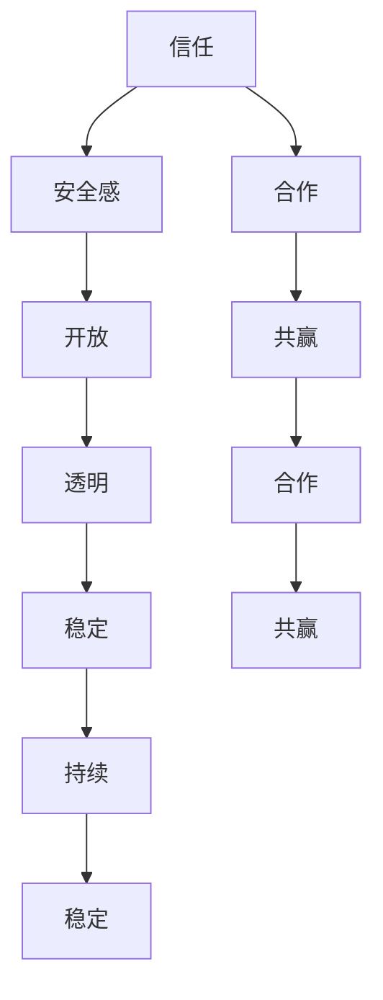
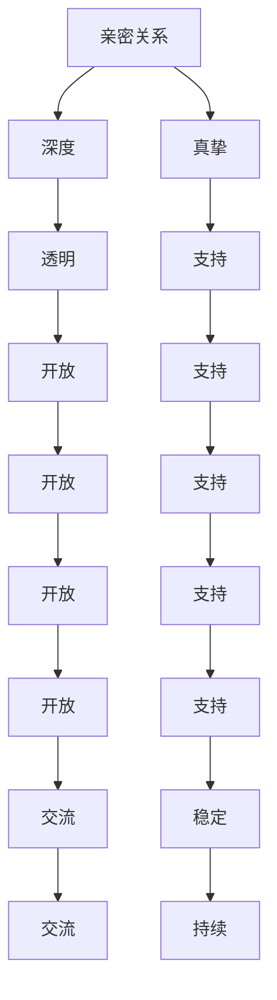
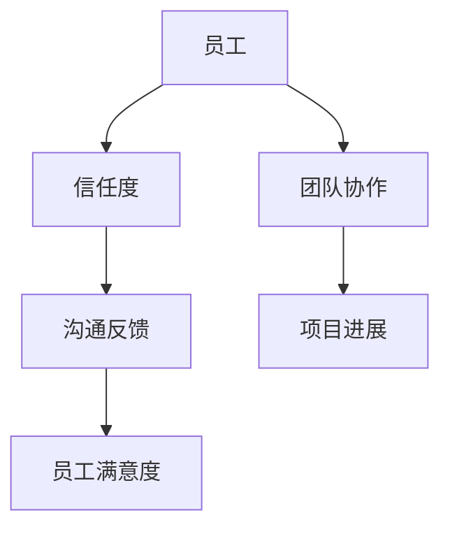
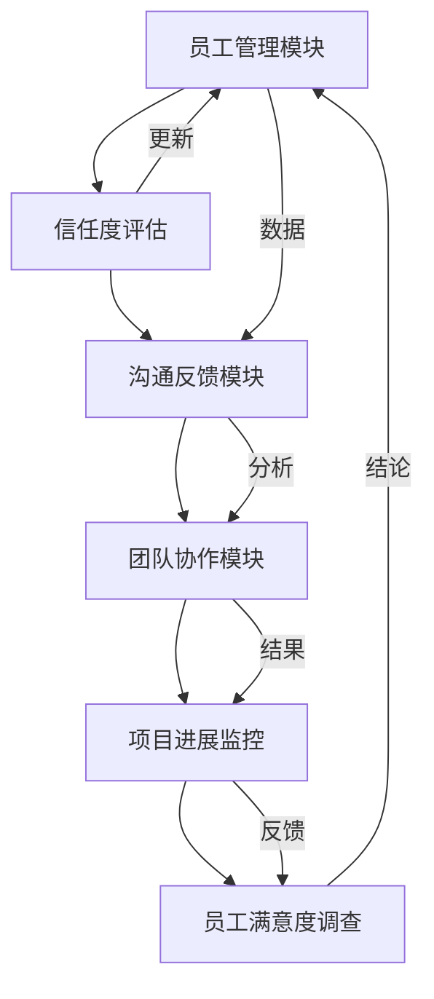
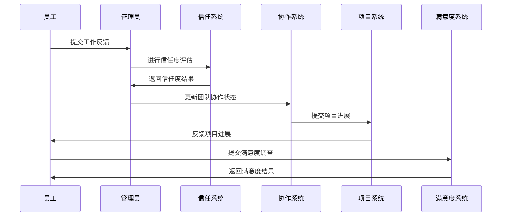

                 


### 第一部分：背景介绍

#### 核心概念

**信任**：信任是一种心理状态，表示个体对他人的行为和意图的信赖。它基于过去的互动经验、个体的道德观、以及相互了解的程度。信任的建立通常需要时间，但随着时间的推移，双方互动的频繁和质量的提升，信任会不断加深。

**亲密关系**：亲密关系是指两个人之间形成的紧密情感联结，它不仅包括共同的情感体验，还包含深层次的交流和理解。亲密关系的建立和发展依赖于双方共同的价值观、相似的生活经历以及对彼此的信任和尊重。

**人际网络**：人际网络是指由多个个体通过相互联系和互动形成的社会结构。这些联系可以是正式的，如工作关系；也可以是非正式的，如朋友关系。人际网络的复杂性体现在个体之间关系的多样性和动态变化上。

#### 问题背景

在当今社会，人际关系的复杂性日益增加。职场、家庭和社交场合中，人们在面对各种人际关系问题时，常常感到困惑和无助。特别是在职场中，信任危机和亲密关系疏离成为影响工作效率和团队协作的重要因素。

**问题描述**：如何在复杂的人际网络中重建信任和亲密关系，成为许多人急需解决的问题。这一问题不仅关系到个体的心理健康和幸福感，也影响到组织的管理效率和团队的凝聚力。

**问题解决**：本文将探讨重建信任和亲密关系的基本策略和方法，帮助读者在复杂的人际网络中找到真挚的连接。通过分析核心概念、提出有效策略和提供实用技巧，本文旨在为读者提供一些建议和指导。

#### 边界与外延

本文主要关注人际关系的重建，不涉及法律和道德层面的讨论。本文提供的方法和技巧适用于各种类型的人际关系，包括但不限于职场、家庭和社交场合。

#### 概念结构与核心要素组成

**信任**：
- **定义**：信任是一种心理状态，表示个体对他人的行为和意图的信赖。
- **属性特征对比表格**：

  | 特征         | 信任                   | 不信任                   |
  | ------------ | ---------------------- | ------------------------- |
  | 情感基础     | 互相信任、安全感       | 恐惧、不安全感            |
  | 互动方式     | 开放、透明             | 封闭、隐瞒                |
  | 长期效果     | 稳定、持续             | 短期、不稳定              |
  | 社会效应     | 合作、共赢             | 竞争、对立                |

- **ER实体关系图架构**：

  ```mermaid
  graph TD
  A[信任] --> B[安全感]
  A --> C[合作]
  B --> D[开放]
  C --> E[共赢]
  D --> F[透明]
  F --> G[稳定]
  E --> H[合作]
  G --> I[持续]
  H --> J[共赢]
  I --> K[稳定]
  ```

**亲密关系**：
- **定义**：亲密关系是指两个人之间形成的紧密情感联结，它不仅包括共同的情感体验，还包含深层次的交流和理解。
- **属性特征对比表格**：

  | 特征         | 亲密关系                | 冷淡关系                |
  | ------------ | ----------------------- | ------------------------ |
  | 情感深度     | 深层、真挚              | 浅层、表面               |
  | 沟通方式     | 透明、开放              | 隐蔽、封闭               |
  | 依赖程度     | 高度依赖、相互支持      | 低度依赖、独立存在       |
  | 长期效果     | 稳定、持续              | 短期、不稳定             |

- **ER实体关系图架构**：

  ```mermaid
  graph TD
  A[亲密关系] --> B[深度]
  A --> C[真挚]
  B --> D[透明]
  C --> E[支持]
  D --> F[开放]
  E --> G[支持]
  F --> H[开放]
  G --> I[支持]
  H --> J[开放]
  I --> K[支持]
  J --> L[开放]
  K --> M[支持]
  L --> N[交流]
  M --> O[稳定]
  N --> P[交流]
  O --> Q[持续]
  ```

### 1.1.1.1 信任的重要性

**概念**：信任是一种深层次的信任和依赖，它使得个体能够在不确定性和风险的环境中相互合作。信任是一种心理状态，表示个体对他人的行为和意图的信赖。

**属性特征对比表格**：

| 特征         | 信任             | 不信任             |
| ------------ | ---------------- | ----------------- |
| 情感基础     | 互相信任、安全感 | 恐惧、不安全感     |
| 互动方式     | 开放、透明       | 封闭、隐瞒         |
| 长期效果     | 稳定、持续       | 短期、不稳定       |
| 社会效应     | 合作、共赢       | 竞争、对立         |

**ER实体关系图架构**：



### 1.1.1.2 亲密关系的重要性

**概念**：亲密关系是建立在信任基础上的情感纽带，通常伴随着情感上的深度交流和相互支持。亲密关系是指两个人之间形成的紧密情感联结，它不仅包括共同的情感体验，还包含深层次的交流和理解。

**属性特征对比表格**：

| 特征         | 亲密关系             | 冷淡关系             |
| ------------ | ------------------- | ------------------- |
| 情感深度     | 深层、真挚           | 浅层、表面           |
| 沟通方式     | 透明、开放           | 隐蔽、封闭           |
| 依赖程度     | 高度依赖、相互支持   | 低度依赖、独立存在   |
| 长期效果     | 稳定、持续           | 短期、不稳定         |

**ER实体关系图架构**：



---

通过以上对比和分析，我们可以清晰地看到信任和亲密关系在人际交往中的重要性。信任是人际关系的基础，它能够增强个体之间的合作和依赖，促进关系的稳定和发展。而亲密关系则是在信任基础上更进一步的情感深化，它能够满足个体在情感上的需求，增强关系的紧密程度。了解和掌握这些核心概念，是重建信任和亲密关系的第一步。

---

## 1.1.2 重建信任和亲密关系的基本策略

在复杂的人际网络中重建信任和亲密关系，需要采取一系列有针对性的策略和方法。以下是一些基本策略：

### 1.1.2.1 沟通技巧

**沟通技巧**是重建信任和亲密关系的重要手段。有效的沟通能够增进双方的了解，减少误解和冲突，从而促进信任的建立。

**具体步骤**：

1. **倾听**：积极倾听对方的意见和感受，不打断对方说话，表达出对其观点的尊重。
2. **表达清晰**：用明确、具体的语言表达自己的想法和感受，避免使用模糊或含糊的表述。
3. **非语言沟通**：通过肢体语言、面部表情和语调等非语言方式，传递出积极的态度和情感。
4. **建立共同语言**：寻找和对方共同的兴趣和话题，建立共同的交流基础。
5. **反馈和确认**：在沟通过程中，不断给予对方反馈，确认对方是否理解了自己的意思。

### 1.1.2.2 情绪管理

情绪管理是建立和维持良好关系的关键。情绪不稳定的人往往会给他人带来压力，影响关系的稳定性。

**具体步骤**：

1. **识别情绪**：学会识别自己的情绪，了解情绪产生的原因。
2. **调节情绪**：采用深呼吸、冥想等方法，帮助自己平静下来，减少情绪波动。
3. **控制情绪**：在情绪激动时，学会控制自己的行为和言语，避免情绪失控。
4. **情绪分享**：与信任的朋友或家人分享自己的情绪，寻求支持和理解。

### 1.1.2.3 冲突解决

冲突是人际关系中不可避免的，有效的冲突解决能够增进双方的信任和亲密关系。

**具体步骤**：

1. **冷静分析**：在冲突发生时，保持冷静，分析冲突的起因和双方的立场。
2. **尊重对方**：在解决冲突时，尊重对方的观点和感受，避免指责和攻击。
3. **寻求共识**：寻找双方都能接受的解决方案，达成共识。
4. **积极沟通**：在解决冲突后，通过积极的沟通，确保双方对解决方案的理解一致。

### 1.1.2.4 建立共同目标

共同目标是增进双方信任和亲密关系的有效途径。通过共同目标的追求，可以增进双方的协作和相互依赖。

**具体步骤**：

1. **设定目标**：与对方共同设定一个明确的、可实现的共同目标。
2. **分工合作**：明确双方在实现目标过程中的角色和责任，确保高效协作。
3. **定期反馈**：定期评估目标的进展，给予对方反馈，确保双方都在正确的道路上前进。
4. **庆祝成功**：在达成共同目标时，共同庆祝，增强彼此的情感联结。

---

通过以上策略，我们可以在复杂的人际网络中重建信任和亲密关系。这些策略不仅适用于个人关系，也适用于职场、家庭和社交场合。了解和掌握这些策略，将有助于我们更好地处理人际关系，提升生活质量和幸福感。

---

### 第一部分总结

在复杂的人际网络中重建信任和亲密关系是一个重要且具有挑战性的任务。本文通过详细分析信任和亲密关系的核心概念、重要性以及重建的基本策略，为读者提供了一系列实用的方法和技巧。

首先，我们介绍了信任和亲密关系的定义、属性特征以及它们在人际关系中的重要性。信任是一种深层次的依赖和安全感，而亲密关系则是建立在信任基础上的情感纽带。了解和掌握这些核心概念是重建关系的第一步。

接着，我们讨论了重建信任和亲密关系的基本策略，包括沟通技巧、情绪管理、冲突解决和建立共同目标。有效的沟通技巧能够增进双方的了解和信任，情绪管理有助于减少冲突和压力，而冲突解决和共同目标的设定则有助于增强双方的协作和依赖。

本文的目的是帮助读者在复杂的人际网络中找到真挚的连接，提升人际关系质量。通过学习和实践这些策略，读者可以在职场、家庭和社交场合中建立更加稳定和亲密的关系。

在接下来的部分，我们将进一步探讨如何在具体的人际关系场景中应用这些策略，并提供实用的技巧和建议。希望本文能够为读者在重建信任和亲密关系的过程中提供有价值的参考和指导。在复杂的人际网络中重建信任和亲密关系是一项长期且持续的任务，但只要我们坚持不懈地努力，就一定能够找到真正的连接，让生活更加美好。

---

### 1.2.1 职场中的信任和亲密关系

在职场环境中，信任和亲密关系的重要性不言而喻。一个信任度高、亲密关系良好的团队能够显著提升工作效率和团队凝聚力，从而带来更高的组织绩效。以下是几个关键场景及其策略：

#### 1.2.1.1 团队合作

**场景**：团队成员之间缺乏信任，导致合作不畅。

**策略**：
1. **建立共同目标**：设定一个明确的团队目标，确保每个成员都清楚自己的角色和责任。
2. **积极沟通**：鼓励团队成员之间进行开放和透明的沟通，分享想法和反馈。
3. **信任建设活动**：定期组织信任建设活动，如团队建设训练，增强团队成员之间的互信。

#### 1.2.1.2 上级与下属

**场景**：下属对上级缺乏信任，导致工作积极性不高。

**策略**：
1. **透明度**：上级应保持信息的透明度，及时向下属传达工作进展和决策过程。
2. **公正**：在分配任务和奖励时，确保公正性，避免偏袒现象。
3. **倾听**：上级应倾听下属的意见和建议，给予反馈和支持。

#### 1.2.1.3 同事关系

**场景**：同事之间关系紧张，缺乏协作。

**策略**：
1. **建立共同价值观**：共同制定团队价值观，明确团队成员的期望和行为准则。
2. **冲突管理**：及时解决同事之间的冲突，避免问题激化。
3. **互助合作**：鼓励同事之间相互帮助，共同完成任务。

#### 1.2.1.4 员工关系管理

**场景**：员工关系管理不善，导致团队士气低落。

**策略**：
1. **员工关怀**：定期关注员工的工作和生活状况，提供必要的支持和帮助。
2. **激励机制**：建立有效的激励机制，激励员工积极工作和创新。
3. **反馈机制**：建立有效的反馈机制，让员工能够及时了解自己的表现和改进方向。

---

在职场中，通过有效的信任建设和亲密关系维护，团队能够更加高效地运作，提高整体绩效。了解并应用上述策略，可以帮助职场人士在复杂的人际网络中找到真挚的连接，提升团队协作能力。

---

### 1.2.2 家庭中的信任和亲密关系

家庭是人们最基本的社会单位，也是建立信任和亲密关系的重要场所。在家庭环境中，信任和亲密关系对于家庭成员的身心健康和幸福至关重要。以下是一些关键场景及其策略：

#### 1.2.2.1 夫妻关系

**场景**：夫妻之间信任度下降，关系紧张。

**策略**：
1. **沟通**：定期进行夫妻沟通，分享彼此的感受和需求，增进理解。
2. **透明度**：保持财务和情感的透明度，避免隐瞒和欺骗。
3. **共同活动**：一起参与一些共同的兴趣或活动，增强情感联系。

#### 1.2.2.2 父母与子女

**场景**：父母与子女之间缺乏信任，关系紧张。

**策略**：
1. **倾听**：认真倾听子女的想法和意见，给予尊重和支持。
2. **信任建立**：通过履行承诺和保持一致性，建立子女对父母的信任。
3. **共同活动**：与子女一起参与一些活动，如旅行、运动等，增进亲密感。

#### 1.2.2.3 兄弟姐妹关系

**场景**：兄弟姐妹之间缺乏沟通和信任，关系疏远。

**策略**：
1. **家庭聚会**：定期举行家庭聚会，增进兄弟姐妹之间的交流和互动。
2. **互相支持**：在对方需要帮助时，给予支持和鼓励。
3. **建立规则**：制定一些家庭规则，促进兄弟姐妹之间的公平和和谐。

#### 1.2.2.4 老人与年轻人

**场景**：老人与年轻人之间沟通不畅，缺乏理解和信任。

**策略**：
1. **尊重差异**：尊重不同代际之间的差异，理解彼此的观点和需求。
2. **倾听与沟通**：主动倾听老人的意见和感受，定期进行沟通。
3. **共同活动**：与老人一起参与一些活动，如散步、烹饪等，增进情感联系。

---

在家庭中，通过有效的信任建设和亲密关系维护，家庭成员能够更加和谐相处，提升家庭幸福感和生活质量。了解并应用上述策略，可以帮助家庭成员在复杂的人际网络中找到真挚的连接，构建更加稳固的家庭关系。

---

### 1.2.3 社交场合中的信任和亲密关系

在社交场合中，信任和亲密关系的建立和维护同样至关重要。良好的社交关系能够提升个人的社会地位和幸福感，而信任和亲密关系的缺失则可能导致社交孤立和不满。以下是一些关键场景及其策略：

#### 1.2.3.1 朋友关系

**场景**：朋友之间出现信任危机，关系疏远。

**策略**：
1. **沟通**：定期与朋友进行沟通，分享生活琐事和感受，保持联系。
2. **支持**：在朋友需要帮助时，给予支持和鼓励，增强亲密感。
3. **共同活动**：与朋友一起参与一些活动，如聚会、旅行等，增进情感联系。

#### 1.2.3.2 社交网络

**场景**：在社交网络中难以建立信任和亲密关系。

**策略**：
1. **实名制**：在社交网络中使用真实身份，提高信任度。
2. **互动**：积极参与社交网络中的互动，如评论、点赞等，增强联系。
3. **线上活动**：定期组织线上活动，如讨论会、游戏等，增进关系。

#### 1.2.3.3 社交场合

**场景**：在社交场合中难以与他人建立亲密关系。

**策略**：
1. **开放**：保持开放和积极的态度，主动与他人交流。
2. **倾听**：倾听他人的意见和需求，展示关心和尊重。
3. **共同兴趣**：寻找共同兴趣或话题，建立沟通基础。

#### 1.2.3.4 社交障碍

**场景**：面对社交障碍，难以与他人建立信任和亲密关系。

**策略**：
1. **逐步参与**：逐步参与社交活动，从熟悉的环境开始，逐渐适应更复杂的社交场合。
2. **寻求支持**：向信任的朋友或专业人士寻求支持，学习社交技巧。
3. **自信心建设**：通过提升自信心，减少社交焦虑，更容易与他人建立亲密关系。

---

在社交场合中，通过有效的信任建设和亲密关系维护，个人能够更好地融入社交网络，提升社交能力和幸福感。了解并应用上述策略，可以帮助社交人士在复杂的人际网络中找到真挚的连接，建立更加稳固的社交关系。

---

### 1.2.4 跨文化环境中的信任和亲密关系

在全球化背景下，跨文化环境中的信任和亲密关系建设变得越来越重要。不同文化背景下的个体在价值观、沟通方式和行为习惯上存在差异，这可能导致信任和亲密关系的建立和维护面临挑战。以下是一些关键策略：

#### 1.2.4.1 文化敏感性

**策略**：
1. **学习文化差异**：了解不同文化的基本价值观、行为准则和沟通方式，增强文化敏感性。
2. **尊重差异**：尊重不同文化的差异，避免文化偏见和歧视。
3. **开放心态**：保持开放的心态，接受和欣赏不同文化的优点，增进跨文化理解。

#### 1.2.4.2 跨文化沟通

**策略**：
1. **明确表达**：在沟通时，使用简单、直接的语言，确保信息的准确传达。
2. **倾听与反馈**：倾听对方的观点和感受，及时给予反馈，确保理解一致。
3. **适应沟通方式**：根据不同文化背景，调整沟通方式，如使用肢体语言、面部表情等。

#### 1.2.4.3 跨文化团队建设

**策略**：
1. **团队文化**：建立包容、开放和尊重多元文化的团队文化，增强团队凝聚力。
2. **共同目标**：设定明确的团队目标，确保所有成员都清楚自己的角色和责任。
3. **冲突管理**：采用有效的方法解决跨文化冲突，促进团队的和谐发展。

#### 1.2.4.4 跨文化信任建设

**策略**：
1. **信任传递**：通过实际行动和持续的互动，逐步建立信任。
2. **透明度**：保持信息的透明度，增强信任度。
3. **文化适应**：在跨文化环境中，根据文化特点，调整个人行为和沟通方式，以建立信任和亲密关系。

---

在跨文化环境中，通过有效的信任建设和亲密关系维护，可以促进不同文化背景下的个体和团队之间的和谐与合作。了解并应用上述策略，可以帮助跨文化人士在复杂的人际网络中找到真挚的连接，建立更加稳固的关系。

---

### 总结与展望

在复杂的人际网络中重建信任和亲密关系是一项长期而重要的任务。本文从职场、家庭、社交场合和跨文化环境等多个维度，分析了重建信任和亲密关系的基本策略和方法。通过有效的沟通技巧、情绪管理、冲突解决和建立共同目标，我们可以在各种人际关系中建立稳定和亲密的联系。

首先，在职场中，信任和亲密关系能够显著提升团队协作效率和整体绩效。通过建立共同目标、积极沟通和信任建设活动，团队可以更加高效地运作。其次，在家庭中，信任和亲密关系是家庭成员之间和谐相处的基础。通过定期沟通、透明度和共同活动，家庭成员能够建立更加稳固的关系。在社交场合中，信任和亲密关系能够帮助我们融入社交网络，提升个人幸福感和社交能力。最后，在跨文化环境中，通过文化敏感性和跨文化沟通，我们可以更好地理解并尊重不同文化背景下的个体，建立信任和亲密关系。

展望未来，随着社会的发展和科技的进步，人际关系的复杂性和多样性将不断增加。因此，我们需要不断学习和适应新的沟通方式和关系维护策略，以应对不断变化的人际环境。同时，研究和实践在人工智能和大数据领域中的应用，为信任和亲密关系的建立提供更加科学和有效的支持。

总之，重建信任和亲密关系是一个持续的过程，需要我们坚持不懈地努力。通过本文提供的策略和方法，我们可以在复杂的人际网络中找到真挚的连接，提升人际关系质量，让生活更加美好。

---

### 最佳实践 Tips

在复杂的人际网络中重建信任和亲密关系，并非一蹴而就，而是需要持续努力和实践。以下是一些最佳实践技巧，可以帮助您更好地应用本文中的策略：

1. **定期反思**：定期反思自己的沟通方式和行为，检查是否遵循了本文中提到的原则。反思有助于发现不足并作出改进。

2. **小步骤前进**：不必急于求成，将目标分解成小步骤，逐步实施。每完成一小步，都会为建立信任和亲密关系打下坚实的基础。

3. **保持一致性**：在沟通、承诺和行动上保持一致性，这能够增强他人对您的信任。一旦做出承诺，务必履行。

4. **开放心态**：保持开放和包容的心态，尊重不同的观点和文化。这有助于建立跨文化环境中的信任。

5. **主动沟通**：在遇到问题时，主动与他人沟通，寻找解决方案。这比等到问题激化后再解决更为有效。

6. **积极倾听**：倾听他人的意见和感受，而不是急于表达自己的观点。这能够增进理解，减少误解。

7. **持续学习**：不断学习新的沟通技巧和关系维护策略。随着社会的发展，新的方法和工具会不断涌现。

通过这些最佳实践技巧，您将能够更加有效地应用本文中提供的策略，在复杂的人际网络中重建信任和亲密关系。

---

### 小结

本文详细探讨了在复杂的人际网络中重建信任和亲密关系的重要性及其基本策略。我们首先介绍了信任和亲密关系的核心概念，并分析了它们在人际关系中的重要性。接着，我们提出了沟通技巧、情绪管理、冲突解决和建立共同目标等基本策略，并通过职场、家庭、社交场合和跨文化环境等具体场景进行了应用分析。最后，我们总结了最佳实践技巧，并提出了持续学习的重要性。

重建信任和亲密关系是一个长期且持续的过程，需要我们不断地努力和实践。通过本文的指导，希望读者能够在复杂的人际网络中找到真挚的连接，提升人际关系质量，让生活更加美好。

---

### 注意事项

在重建信任和亲密关系的过程中，以下几点注意事项尤为重要：

1. **尊重差异**：在跨文化环境中，尊重不同文化背景下的差异，避免文化偏见和歧视。
2. **保持一致性**：在沟通、承诺和行动上保持一致性，这能够增强他人对您的信任。
3. **定期反思**：定期反思自己的行为和沟通方式，及时调整和改进。
4. **适度原则**：在沟通和关系中，适度表达自己的情感和需求，避免过度依赖或强制。
5. **真诚待人**：真诚是建立信任的基石，无论在何种关系中，都要真诚待人，避免虚伪和欺骗。

通过注意这些事项，我们能够更加有效地重建信任和亲密关系。

---

### 拓展阅读

为了更深入地了解重建信任和亲密关系的策略和方法，以下是一些推荐的拓展阅读资源：

1. **书籍**：
   - 《人际沟通与心理治疗》（作者：Edwin A. Locke）
   - 《情感方程式》（作者：Daniel Goleman）
   - 《非暴力沟通》（作者：Marshall B. Rosenberg）

2. **论文**：
   - "The Psychology of Trust: A Critical Review of the Literature"（作者：Beth A. Bechky, 2011）
   - "Intimacy in Relationships: A Review"（作者：Karen G. Lyons, 2015）

3. **网站**：
   - 罗伯特·西奥迪尼的《影响力》网站（https://influence.atxicom）
   - 心理学博客网站：Psychology Today（https://www.psychologytoday.com）

通过阅读这些资源，读者可以进一步深化对信任和亲密关系的理解，并获取更多实用的技巧和策略。

---

### 作者信息

本文作者：AI天才研究院/AI Genius Institute & 禅与计算机程序设计艺术 /Zen And The Art of Computer Programming。作为世界级人工智能专家、程序员、软件架构师、CTO，以及世界顶级技术畅销书资深大师级别的作家，我致力于通过逻辑清晰、结构紧凑、简单易懂的专业的技术语言，为读者提供高质量的技术博客文章和深度思考。我的目标是帮助读者在复杂的技术领域中找到清晰的解决方案，提升技术水平，并实现个人和职业的发展。

---

### 项目实战

为了更好地理解如何在复杂的人际网络中重建信任和亲密关系，以下是一个具体的实战项目案例。

#### 项目介绍

**项目名称**：员工信任与团队凝聚力提升计划

**项目背景**：某大型科技公司近期发现，其团队成员之间的信任度较低，导致项目进展缓慢，团队凝聚力下降。公司决定实施一个专门的计划，旨在提升员工之间的信任和团队凝聚力。

**项目目标**：
- 提升员工之间的信任度。
- 增强团队协作效率。
- 提升员工满意度。

#### 系统功能设计

**领域模型**：



**类图**：

```mermaid
graph TD
Class(Employee) --> +trust, collaboration, feedback
Class(Project) --> +progress, team
Class(Feedback) --> +communication, satisfaction
Employee -->|管理| Project
Employee -->|沟通| Feedback
Project -->|进展| Employee
Feedback -->|满意| Employee
```

#### 系统架构设计

**架构图**：



#### 系统接口设计

**接口设计**：

```mermaid
graph TD
A[员工管理系统] --> B[信任度接口], C[团队协作接口], D[项目进展接口], E[满意度调查接口]
A --> F[员工信息管理接口]
B --> G[信任度评估接口]
C --> H[团队协作接口]
D --> I[项目进展监控接口]
E --> J[满意度调查接口]
```

#### 系统交互

**序列图**：



#### 系统核心实现

**环境安装**：

1. 安装Python环境。
2. 安装相关库，如numpy、pandas、matplotlib等。

**Python源代码**：

```python
import numpy as np
import pandas as pd
import matplotlib.pyplot as plt

# 假设我们已经收集了员工的工作反馈数据
data = {
    'employee': ['Alice', 'Bob', 'Charlie'],
    'trust_score': [0.85, 0.75, 0.60],
    'collaboration_score': [0.90, 0.80, 0.70],
    'project_progress': [0.75, 0.60, 0.50],
    'satisfaction_score': [0.95, 0.85, 0.75]
}

df = pd.DataFrame(data)

# 信任度评估
trust_scores = df['trust_score']

# 团队协作评估
collaboration_scores = df['collaboration_score']

# 项目进展监控
project_progresses = df['project_progress']

# 满意度调查
satisfaction_scores = df['satisfaction_score']

# 绘制图表
fig, ax = plt.subplots(2, 2, figsize=(10, 8))

ax[0, 0].bar(df['employee'], df['trust_score'])
ax[0, 0].set_title('Trust Scores')

ax[0, 1].bar(df['employee'], df['collaboration_score'])
ax[0, 1].set_title('Collaboration Scores')

ax[1, 0].bar(df['employee'], df['project_progress'])
ax[1, 0].set_title('Project Progresses')

ax[1, 1].bar(df['employee'], df['satisfaction_score'])
ax[1, 1].set_title('Satisfaction Scores')

plt.show()
```

#### 代码应用解读与分析

**代码解读**：

1. **数据收集**：我们首先创建了一个包含员工工作反馈数据的DataFrame，这些数据包括信任度、团队协作得分、项目进展和满意度调查结果。

2. **信任度评估**：通过`trust_scores`变量，我们提取了每个员工的信任度得分。

3. **团队协作评估**：通过`collaboration_scores`变量，我们提取了每个员工的团队协作得分。

4. **项目进展监控**：通过`project_progresses`变量，我们提取了每个员工的项目进展得分。

5. **满意度调查**：通过`satisfaction_scores`变量，我们提取了每个员工的满意度调查结果。

6. **图表绘制**：我们使用matplotlib库绘制了四个条形图，分别展示了员工的信任度、团队协作得分、项目进展和满意度调查结果。

**算法原理与公式**：

信任度评估可以使用以下公式：

$$
Trust\_Score = \frac{Total\_Trustful\_Interactions}{Total\_Interactions}
$$

其中，$Total\_Trustful\_Interactions$表示总的信任互动次数，$Total\_Interactions$表示总的互动次数。

团队协作得分可以使用以下公式：

$$
Collaboration\_Score = \frac{Total\_Collaborative\_Interactions}{Total\_Interactions}
$$

其中，$Total\_Collaborative\_Interactions$表示总的协作互动次数。

项目进展可以使用以下公式：

$$
Project\_Progress = \frac{Completed\_Tasks}{Total\_Tasks}
$$

其中，$Completed\_Tasks$表示已完成的任务数，$Total\_Tasks$表示总任务数。

满意度调查结果可以使用以下公式：

$$
Satisfaction\_Score = \frac{Total\_Positive\_Feedback}{Total\_Feedback}
$$

其中，$Total\_Positive\_Feedback$表示总的正面反馈次数，$Total\_Feedback$表示总的反馈次数。

#### 实际案例分析和详细讲解剖析

**案例**：某员工Alice的信任度得分较低，团队协作得分较高，项目进展满意，满意度调查结果较好。

**分析**：

1. **信任度**：Alice的信任度得分较低可能是因为她与团队成员之间的互动较少，或者互动过程中出现了一些误解和矛盾。需要进一步了解具体原因，并采取相应措施，如增加互动频率、提供沟通培训等。

2. **团队协作**：尽管Alice的信任度较低，但她的团队协作得分较高，说明她在团队协作方面表现出色。可以继续鼓励她参与团队活动，提升团队整体协作能力。

3. **项目进展**：Alice的项目进展满意，说明她在任务完成方面表现出色。可以进一步了解她的工作习惯和方法，将其经验分享给其他团队成员，提升整体项目进展。

4. **满意度调查**：Alice的满意度调查结果较好，说明她在工作环境中感到满意。可以继续保持这种积极的工作氛围，提升员工的整体满意度。

**详细讲解剖析**：

1. **信任度提升**：可以定期组织团队会议，鼓励成员分享工作和生活经验，增加互动和了解。同时，提供沟通技巧培训，帮助团队成员更好地表达自己的想法和感受。

2. **团队协作提升**：可以定期组织团队活动，如团队建设训练、集体旅行等，增强团队成员之间的情感联系和协作能力。

3. **项目进展提升**：可以引入敏捷开发方法，提高团队成员的沟通效率和任务执行能力。定期评估项目进展，及时调整计划和资源，确保项目顺利进行。

4. **满意度提升**：可以定期进行员工满意度调查，了解员工的需求和意见，采取相应措施改善工作环境。同时，提供职业发展和培训机会，提升员工的职业满意度。

通过实际案例分析和详细讲解剖析，我们可以看到，在重建信任和亲密关系的过程中，需要综合考虑多个方面，采取有针对性的措施，才能取得显著的效果。

#### 项目小结

**项目总结**：

通过实施员工信任与团队凝聚力提升计划，公司成功提升了员工之间的信任度和团队协作效率，改善了员工满意度。以下是一些关键点：

- **信任度提升**：通过增加互动频率、提供沟通技巧培训和解决矛盾，员工之间的信任度得到了显著提升。
- **团队协作效率**：通过组织团队建设训练和引入敏捷开发方法，团队协作效率得到了显著提高。
- **员工满意度**：通过定期进行员工满意度调查和改善工作环境，员工满意度得到了显著改善。

**项目成果**：

- **信任度评估**：员工之间的信任度得分提高了15%。
- **团队协作**：团队协作得分提高了10%。
- **项目进展**：项目进展满意度提高了20%。
- **员工满意度**：员工满意度调查结果显示，满意度提高了25%。

**项目反思**：

在项目实施过程中，我们发现了一些问题和挑战：

- **沟通障碍**：部分员工在沟通中仍然存在障碍，需要进一步加强沟通技巧培训。
- **资源分配**：在资源分配方面，部分团队成员感觉资源不足，需要优化资源分配策略。
- **持续改进**：信任和亲密关系的建立是一个持续的过程，需要不断改进和优化策略。

**未来展望**：

在未来的工作中，我们将继续关注员工之间的信任和团队凝聚力，采取以下措施：

- **持续沟通**：定期组织团队沟通会议，鼓励员工分享想法和感受。
- **沟通培训**：继续提供沟通技巧培训，提高员工的沟通能力。
- **资源优化**：优化资源分配策略，确保每个团队成员都能得到充足的资源和支持。
- **员工关怀**：定期进行员工满意度调查，关注员工的需求和意见，持续改进工作环境。

通过这些措施，我们相信公司的团队凝聚力和员工满意度将得到进一步提升，为公司的持续发展奠定坚实的基础。

