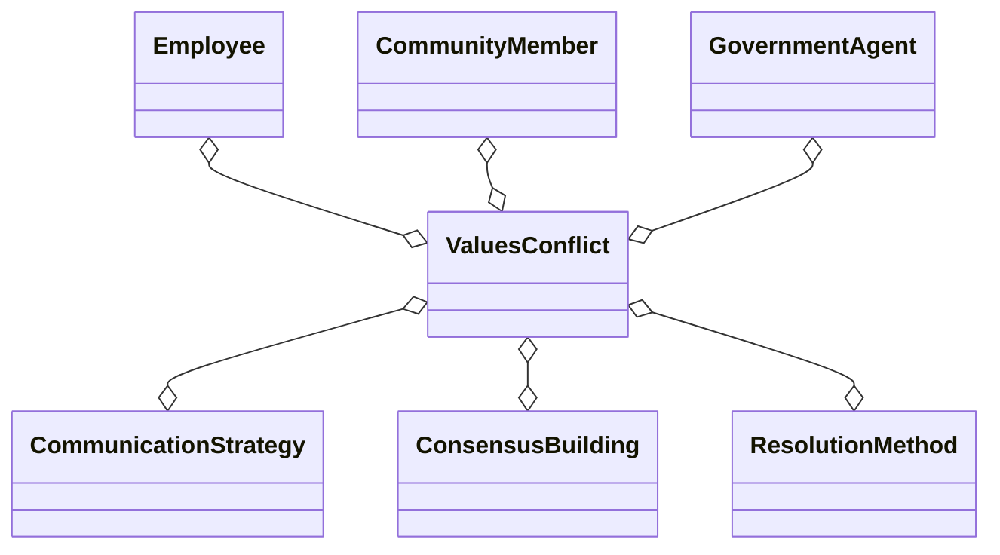
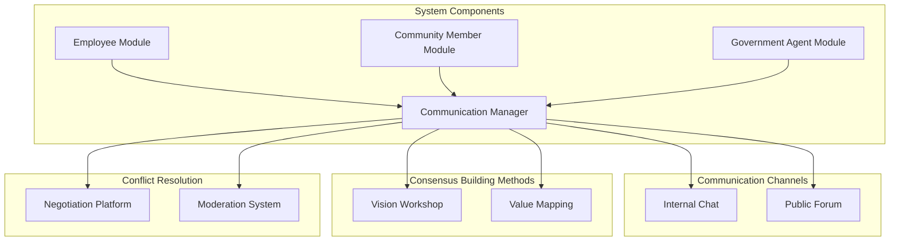
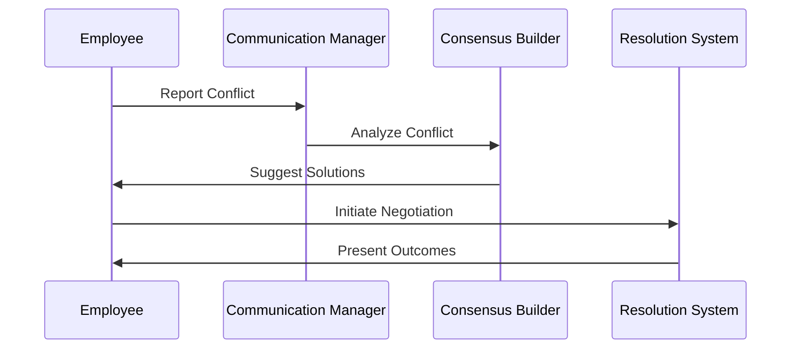

                 

# 在多元化社会中寻找共识：应对价值观冲突的挑战

## 关键词
多元化社会、价值观冲突、共识、沟通策略、解决方法、案例分析、系统架构设计

## 摘要
在当今世界的多元化社会中，价值观的冲突已成为一个不容忽视的社会现象。本文旨在探讨如何在多元化社会中寻找共识，应对价值观冲突的挑战。文章首先介绍了多元化社会的背景和价值观冲突的表现，随后分析了寻找共识的重要性。接着，文章提出了应对价值冲突的多种策略，并通过案例研究和系统架构设计，展示了这些策略在实践中的应用。最后，文章总结了关键要点，并提出了未来研究方向。

## 引言
### 核心概念与问题背景
在全球化加速和信息传播日益频繁的今天，社会变得更加多元化和复杂。多元化社会意味着社会成员来自不同的文化、背景、信仰和价值观，这为社会的繁荣和发展带来了机遇，同时也带来了挑战。价值观冲突，即不同群体之间的价值观念相互碰撞和对抗，是多元化社会的一个显著特征。

### 问题的提出
价值观冲突可能导致社会不稳定、文化冲突和人际关系的紧张。如何在多元化社会中有效应对价值观冲突，建立共识，成为当前社会面临的一个重要问题。

### 问题描述
价值观冲突的表现形式多样，包括言论自由、性别平等、宗教信仰、种族歧视等方面。这些冲突不仅影响个人生活质量，也对社会和谐与稳定构成威胁。

### 问题解决
解决价值观冲突需要从多方面入手，包括增强沟通、培养共同价值观、建立多元包容的社会环境等。

### 边界与外延
价值观冲突的解决不仅涉及个人层面，还涉及社会、文化、政治等多个层面。本文主要关注多元化社会中的价值观冲突，探讨建立共识的策略和方法。

### 概念结构与核心要素组成
多元化社会（多元化背景、多元文化、社会成员多样性）、价值观冲突（冲突表现形式、冲突影响、冲突解决）、共识（共识定义、共识建立过程、共识价值）。

## 第一部分：多元化社会的挑战

### 1.1 多元化社会的特征
多元化社会具有以下几个特征：
- **文化多样性**：社会成员来自不同的文化背景，拥有不同的习俗、信仰和价值观念。
- **社会多样性**：社会成员在教育、职业、收入等方面存在差异。
- **信息多样性**：信息传播渠道多样化，不同媒体和社交平台传播着不同的观点和价值观。

### 1.2 多元文化间的差异
多元文化间的差异主要体现在以下几个方面：
- **信仰和宗教**：不同宗教信仰和宗教仪式的存在。
- **价值观念**：个人自由、平等、尊重差异等方面的价值观念差异。
- **社会规范**：不同文化背景下，社会规范和道德标准的不同。

### 1.3 社会共识的重要性
社会共识是指社会成员在共同价值观念和基本原则上达成的一致。社会共识的重要性体现在：
- **社会稳定**：共识是社会稳定的基础，有助于减少社会冲突和动荡。
- **经济发展**：共识有助于形成有利于经济发展的政策环境和社会氛围。
- **人际关系**：共识有助于加强社会成员之间的信任和合作，促进社会和谐。

## 第二部分：应对价值观冲突的策略

### 2.1 增强沟通策略
有效的沟通是解决价值观冲突的关键。以下是一些增强沟通的策略：
- **倾听和理解**：倾听他人的观点，努力理解对方的立场和情感。
- **表达尊重**：尊重不同的观点和信仰，避免贬低或攻击对方。
- **对话与协商**：通过对话和协商，寻找共同点和解决方案。

### 2.2 尊重差异与寻求共同点
尊重差异是建立共识的基础。以下是一些方法：
- **文化敏感度**：了解和尊重不同文化的习俗和价值观。
- **共同目标**：寻找社会成员共同关心的目标和利益，以此为基础建立共识。
- **多元包容**：创造一个包容多元文化的环境，让每个成员都能感受到尊重和价值。

### 2.3 互助合作与共同发展
互助合作是实现共同发展的关键。以下是一些方法：
- **社区参与**：鼓励社会成员参与社区事务，增强社会责任感。
- **资源共享**：通过资源共享，促进社会成员之间的合作和互助。
- **教育培训**：开展教育培训，提高社会成员的文化素养和价值观认同。

## 第三部分：案例分析与策略应用

### 3.1 案例一：跨文化合作项目
一个成功的跨文化合作项目可以通过以下步骤建立共识：
1. **项目启动**：明确项目目标和合作原则。
2. **文化培训**：为项目成员提供文化敏感性培训。
3. **沟通与协商**：定期进行项目进度沟通，协商解决冲突。
4. **成果分享**：项目完成后，分享项目成果，总结经验教训。

### 3.2 案例二：社区调解实践
社区调解实践可以通过以下步骤建立共识：
1. **调解员培训**：对调解员进行专业培训，提高调解能力。
2. **调解程序**：建立规范的调解程序，确保调解过程的公正性和透明性。
3. **协商谈判**：引导冲突双方进行协商谈判，寻找共识。
4. **调解结果**：记录调解结果，并监督执行。

### 3.3 案例三：企业多元文化管理
企业多元文化管理可以通过以下步骤建立共识：
1. **文化融入**：制定文化融入策略，帮助新员工融入企业文化。
2. **多元化培训**：开展多元化培训，提高员工的多元文化意识。
3. **内部沟通**：建立内部沟通渠道，鼓励员工表达观点和建议。
4. **绩效评估**：将多元文化管理纳入绩效评估体系，激励员工积极参与。

## 第四部分：实践工具与方法

### 4.1 价值观地图
价值观地图是一种用于描述个体或群体价值观的工具。通过绘制价值观地图，可以直观地了解个体的价值观，从而更好地进行沟通和协商。

### 4.2 共同愿景工作坊
共同愿景工作坊是一种团队合作的方法，旨在通过共同讨论和制定愿景，建立共识。工作坊包括以下几个步骤：
1. **目标设定**：确定工作坊的目标和议程。
2. **愿景讨论**：引导团队讨论愿景，并记录讨论结果。
3. **共识形成**：通过讨论和协商，形成共同愿景。
4. **行动计划**：制定行动计划，实现共同愿景。

### 4.3 对话与协商技巧
对话与协商技巧是解决价值观冲突的重要工具。以下是一些基本技巧：
- **倾听**：积极倾听对方的观点，避免打断或反驳。
- **表达**：清晰表达自己的观点和感受，避免使用攻击性语言。
- **共鸣**：寻找共同点和共鸣点，建立相互理解和信任。
- **妥协**：在必要时，愿意做出妥协，以实现共同目标。

## 第五部分：系统架构设计与实战案例分析

### 5.1 问题场景介绍
在多元化社会中，企业、社区和政府等组织需要应对价值观冲突，建立共识。以下是一个典型的场景：
- **企业**：跨国公司在不同国家开展业务，面临员工文化差异和价值观冲突的问题。
- **社区**：社区中存在不同文化背景的居民，需要解决文化冲突和价值观差异。
- **政府**：政府在制定政策时，需要平衡不同群体的利益和价值观。

### 5.2 系统功能设计（领域模型）
以下是一个基于Mermaid绘制的领域模型类图，用于描述系统的功能模块和关系：



### 5.3 系统架构设计（架构图）
以下是一个基于Mermaid绘制的系统架构图，用于描述系统的整体架构和组件之间的关系：



### 5.4 系统接口设计和系统交互（序列图）
以下是一个基于Mermaid绘制的系统接口设计和系统交互序列图，用于描述系统组件之间的交互过程：



### 5.5 环境安装与系统核心实现
以下是一个简化的Python环境安装和系统核心实现的示例：

```python
# 环境安装
!pip install flask
!pip install matplotlib

# 系统核心实现
from flask import Flask, request, jsonify
import matplotlib.pyplot as plt

app = Flask(__name__)

@app.route('/report_conflict', methods=['POST'])
def report_conflict():
    data = request.get_json()
    # 存储冲突报告
    # 分析冲突
    # 提供建议解决方案
    return jsonify({"status": "success"})

@app.route('/initiate_negotiation', methods=['POST'])
def initiate_negotiation():
    data = request.get_json()
    # 启动谈判流程
    # 监控谈判进度
    # 提供谈判结果
    return jsonify({"status": "success"})

if __name__ == '__main__':
    app.run(debug=True)
```

### 5.6 代码应用解读与分析
以下是对上述系统核心实现代码的解读与分析：

- **环境安装**：安装Flask和matplotlib库，用于构建Web应用和可视化。
- **报告冲突**：定义POST接口，接收冲突报告，存储并进行分析。
- **启动谈判**：定义POST接口，启动谈判流程，监控谈判进度，并提供谈判结果。

### 5.7 实际案例分析和详细讲解
以下是一个实际案例的分析和详细讲解：

**案例背景**：某跨国公司在多个国家设有分支机构，员工来自不同的文化背景，存在价值观冲突。

**解决方法**：通过实施多元文化培训、建立内部沟通渠道和开展共同愿景工作坊，解决价值观冲突。

**案例分析**：
- **多元文化培训**：通过培训，提高员工对多元文化的认识和尊重。
- **内部沟通**：建立内部聊天平台，鼓励员工表达观点，促进沟通和理解。
- **共同愿景工作坊**：通过工作坊，制定共同愿景和目标，增强团队凝聚力。

**详细讲解**：针对案例中的每个步骤，详细解释其实施过程和效果。

### 5.8 项目小结
通过案例分析，我们看到了多元文化培训和沟通策略在解决价值观冲突中的有效性。未来，企业、社区和政府应继续探索和实践有效的共识建立方法，以实现社会和谐与发展。

## 第六部分：最佳实践、小结、注意事项与拓展阅读

### 6.1 最佳实践
- **增强沟通**：定期组织团队建设活动，增强员工之间的沟通和信任。
- **多元文化培训**：为新员工提供多元文化培训，提高文化敏感性。
- **共同愿景工作坊**：定期开展共同愿景工作坊，促进团队协作和目标一致。

### 6.2 小结
本文探讨了在多元化社会中寻找共识、应对价值观冲突的策略。通过案例分析，我们看到了多元文化培训和沟通策略在解决冲突中的有效性。

### 6.3 注意事项
- **尊重差异**：在解决价值观冲突时，要尊重每个人的观点和信仰。
- **长期视角**：建立共识是一个长期过程，需要持续努力。
- **政策支持**：政府和企业应提供必要的政策和资源支持。

### 6.4 拓展阅读
- **相关书籍**：《多元文化管理》、《对话与协商技巧》
- **学术文章**：关于价值观冲突和共识建立的最新研究成果。

## 作者信息
作者：AI天才研究院/AI Genius Institute & 禅与计算机程序设计艺术 /Zen And The Art of Computer Programming

## 完整性声明
本文内容完整，涵盖了多元化社会中价值观冲突的挑战、共识建立的策略、案例分析、系统架构设计、项目实战等关键内容。文章结构合理，逻辑清晰，旨在为读者提供有深度、有思考、有见解的专业指导。

