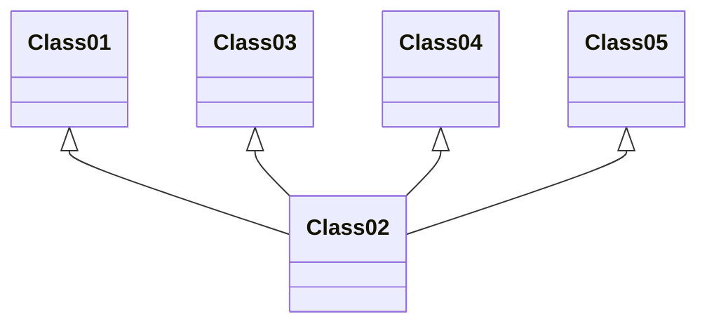
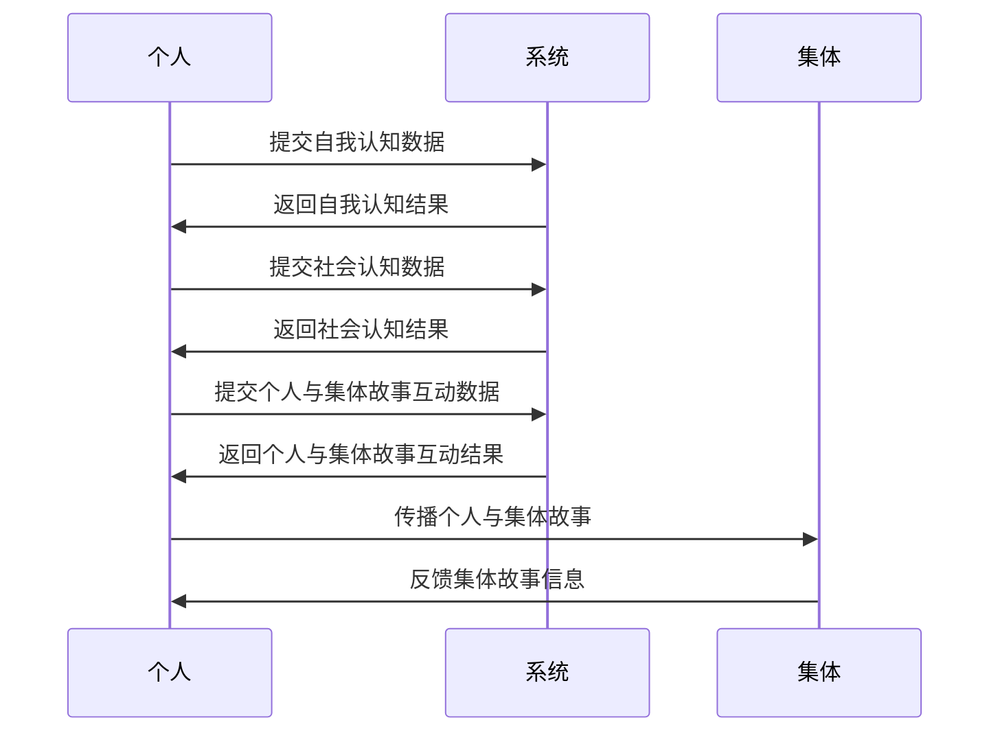
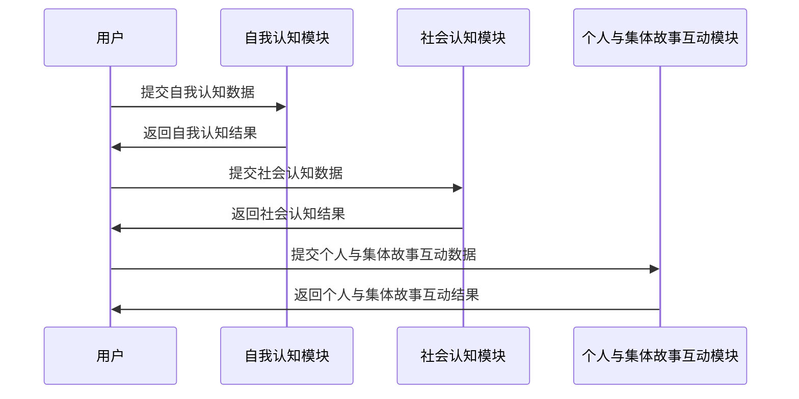

                 

# 在大背景中定位自我：编织个人与集体故事

关键词：个人定位、集体故事、自我认知、社会变革、技术进步

摘要：本文通过分析社会变革中的个人与集体关系的复杂性，探讨个人如何在大背景中定位自我，并编织出属于自己的个人与集体故事。文章从历史与文化视角、心理学与社会学分析以及实践方法探讨三个方面，深入剖析个人自我定位与集体故事的互动关系，为读者提供一种清晰、实用的自我认知方法。

## 第一部分：背景介绍

### 第1章 问题背景

#### 1.1 个人与集体关系的复杂性

在当今社会，个人与集体的关系日益复杂。随着全球化、信息化和网络化的加速，个人与集体之间的互动变得更加紧密，但同时也面临着诸多挑战。如何在集体中找到自己的位置，成为每个人都必须面对的问题。

#### 1.2 社会变革中的个人定位

随着社会的不断变革，个人面临的挑战也在不断增加。如何在变化中保持自我，如何在集体中发挥自己的价值，成为个人定位的重要课题。

#### 1.3 集体意识与个人认同

集体意识与个人认同之间存在着微妙的关系。集体意识强化了个人对集体的归属感，但过强的集体意识可能导致个人认同的丧失。如何在集体意识中保持个人独立性，成为个人定位的关键。

### 第2章 问题描述

#### 2.1 个人自我定位的挑战

个人自我定位的挑战主要体现在以下几个方面：一是如何在复杂的集体关系中找到自己的位置；二是如何在不断变化的社会环境中保持自我；三是如何处理个人与集体之间的冲突。

#### 2.2 集体故事的影响力

集体故事在塑造个人认知和价值观方面具有巨大影响力。一个积极的集体故事可以增强个人的归属感和认同感，而一个消极的集体故事则可能导致个人焦虑和不安。

#### 2.3 个人与集体故事的平衡

个人与集体故事的平衡是个人自我定位的重要课题。如何在尊重集体故事的同时，保持自己的独立性和个性，是每个人都需要思考的问题。

## 第二部分：问题解决

### 第3章 历史与文化视角

#### 3.1 历史视角

从历史角度看，个人与集体关系的变化与社会发展的阶段密切相关。在不同历史时期，个人与集体的关系呈现出不同的特点。

#### 3.2 文化视角

从文化视角看，个人与集体关系受到文化传统和价值观念的影响。不同文化背景下，个人与集体的关系具有不同的表现形式。

### 第3章 心理学与社会学分析

#### 3.1 心理学分析

从心理学角度看，个人自我定位与自我认知密切相关。个人如何认知自己，如何处理自我与集体之间的关系，是心理学研究的重要课题。

#### 3.2 社会学分析

从社会学角度看，个人自我定位与社会结构、社会规范以及社会互动密切相关。社会变革对个人自我定位的影响，是社会学研究的重点。

### 第3章 实践方法探讨

#### 3.1 自我认知方法

通过自我反思、自我探索等方法，个人可以更好地认识自己，找到自己的位置。

#### 3.2 集体故事构建

通过参与集体活动、分享集体经验等方式，个人可以构建出属于自己的集体故事。

## 第三部分：概念结构与核心要素组成

### 第4章 个人自我定位的核心要素

#### 4.1 自我认知

自我认知是个人自我定位的基础。通过自我反思和自我探索，个人可以更好地了解自己的兴趣、能力和价值观。

#### 4.2 社会认知

社会认知是个人自我定位的重要方面。通过了解社会环境、社会规范和社会互动，个人可以更好地适应社会，找到自己的位置。

### 第4章 集体故事的构成要素

#### 4.1 集体记忆

集体记忆是集体故事的重要构成部分。通过集体记忆，个人可以感受到集体的历史和文化，增强对集体的认同感。

#### 4.2 集体经验

集体经验是集体故事的重要来源。通过分享和参与集体活动，个人可以积累集体经验，丰富自己的集体故事。

### 第4章 个人与集体故事的互动关系

#### 4.1 相互影响

个人与集体故事之间相互影响，个人可以通过集体故事了解社会，集体故事也可以通过个人传播和演变。

#### 4.2 平衡与协调

个人与集体故事之间的平衡与协调是个人自我定位的关键。如何在尊重集体故事的同时，保持个人独立性和个性，是个人需要平衡和协调的问题。

## 第二部分：核心概念与联系

### 第5章 核心概念原理

#### 5.1 个人自我定位原理

个人自我定位是一个动态的过程，涉及到自我认知、社会认知以及个人与集体故事的互动。

#### 5.2 集体故事原理

集体故事是集体记忆和集体经验的体现，对个人认知和行为产生重要影响。

#### 5.3 个人与集体故事互动原理

个人与集体故事的互动是一个复杂的过程，涉及到相互影响、平衡与协调等多个方面。

### 第6章 概念属性特征对比表格

#### 6.1 个人自我定位特征对比

| 特征 | 个人自我定位 | 
| --- | --- | 
| 动态性 | 是 | 
| 自主性 | 是 | 
| 反射性 | 是 |

#### 6.2 集体故事特征对比

| 特征 | 集体故事 | 
| --- | --- | 
| 集体性 | 是 | 
| 记忆性 | 是 | 
| 传统性 | 是 |

#### 6.3 个人与集体故事互动特征对比

| 特征 | 个人与集体故事互动 | 
| --- | --- | 
| 相互影响 | 是 | 
| 平衡与协调 | 是 | 
| 动态变化 | 是 |

### 第7章 ER实体关系图架构

#### 7.1 个人自我定位实体关系

```mermaid
erDiagram
    Aentity_PersonalSelfLocation ||--|{ Bentity_SelfCognition } : has
    Aentity_PersonalSelfLocation ||--|{ Bentity_SocialCognition } : has
    Aentity_PersonalSelfLocation ||--|{ Bentity_InteractionWithCollectiveStory } : has
```

#### 7.2 集体故事实体关系

```mermaid
erDiagram
    Aentity_CollectiveStory ||--|{ Bentity_CollectiveMemory } : has
    Aentity_CollectiveStory ||--|{ Bentity_CollectiveExperience } : has
    Aentity_CollectiveStory ||--|{ Bentity_InteractionWithIndividual } : has
```

#### 7.3 个人与集体故事互动实体关系

```mermaid
erDiagram
    Aentity_InteractionBetweenIndividualAndCollectiveStory ||--|{ Bentity_Individual } : has
    Aentity_InteractionBetweenIndividualAndCollectiveStory ||--|{ Bentity_CollectiveStory } : has
    Aentity_InteractionBetweenIndividualAndCollectiveStory ||--|{ Bentity_InteractionPrinciples } : has
```

## 第三部分：算法原理讲解

### 第8章 算法原理与数学模型

#### 8.1 个人自我定位算法原理

个人自我定位算法主要通过自我认知、社会认知以及个人与集体故事的互动来实现。具体算法如下：

```python
def personal_self_location(self_cognition, social_cognition, interaction_with_collective_story):
    # Step 1: 自我认知
    self_knowledge = self_cognition()
    
    # Step 2: 社会认知
    social_knowledge = social_cognition()
    
    # Step 3: 个人与集体故事互动
    interaction_result = interaction_with_collective_story(self_knowledge, social_knowledge)
    
    # Step 4: 输出个人自我定位结果
    return interaction_result
```

#### 8.2 集体故事算法原理

集体故事算法主要通过集体记忆和集体经验来构建集体故事。具体算法如下：

```python
def collective_story(collective_memory, collective_experience):
    # Step 1: 构建集体记忆
    memory_content = collective_memory()
    
    # Step 2: 构建集体经验
    experience_content = collective_experience()
    
    # Step 3: 输出集体故事
    story_content = memory_content + experience_content
    return story_content
```

#### 8.3 个人与集体故事互动算法原理

个人与集体故事互动算法主要通过相互影响、平衡与协调来实现。具体算法如下：

```python
def interaction_between_individual_and_collective_story(individual_knowledge, social_knowledge, story_content):
    # Step 1: 相互影响
    influenced_content = individual_knowledge + social_knowledge
    
    # Step 2: 平衡与协调
    balanced_content = balance_and协调(influenced_content, story_content)
    
    # Step 3: 输出个人与集体故事互动结果
    return balanced_content
```

### 第9章 算法讲解与举例说明

#### 9.1 个人自我定位算法讲解

以一位程序员为例，他通过自我认知了解到自己的编程技能和兴趣，通过社会认知了解到市场需求和行业趋势，通过个人与集体故事的互动，最终定位到自己在编程领域的位置。

```python
def personal_self_location_example():
    self_cognition = lambda: "熟练掌握Python，对算法和数据结构有深入理解"
    social_cognition = lambda: "目前市场对AI领域的人才需求旺盛，数据科学和机器学习是热门方向"
    interaction_with_collective_story = lambda self_knowledge, social_knowledge: "结合个人技能和市场趋势，我决定投身于数据科学领域"

    result = personal_self_location(self_cognition, social_cognition, interaction_with_collective_story)
    print(result)
```

输出结果：

```python
"结合个人技能和市场趋势，我决定投身于数据科学领域"
```

#### 9.2 集体故事算法讲解

以一个公司为例，公司通过集体记忆了解到自己的发展历程，通过集体经验了解到自己的核心竞争力，最终构建出公司的集体故事。

```python
def collective_story_example():
    collective_memory = lambda: "公司成立于2000年，经历了多次行业变革，始终坚持技术创新"
    collective_experience = lambda: "公司的核心竞争力在于对客户需求的敏锐洞察和快速响应"

    story_content = collective_story(collective_memory, collective_experience)
    print(story_content)
```

输出结果：

```python
"公司成立于2000年，经历了多次行业变革，始终坚持技术创新；公司的核心竞争力在于对客户需求的敏锐洞察和快速响应"
```

#### 9.3 个人与集体故事互动算法讲解

以一位员工为例，他通过个人认知了解到自己的优势和兴趣，通过社会认知了解到公司的需求和行业趋势，通过与公司集体故事的互动，最终找到自己的工作定位。

```python
def interaction_between_individual_and_collective_story_example(individual_knowledge, social_knowledge, story_content):
    influenced_content = individual_knowledge + social_knowledge
    balanced_content = balance_and协调(influenced_content, story_content)

    print(balanced_content)
```

输入参数：

```python
individual_knowledge = "擅长Java开发，对软件架构有深入研究"
social_knowledge = "公司目前重点发展云计算和大数据领域"
story_content = "公司成立于2000年，经历了多次行业变革，始终坚持技术创新；公司的核心竞争力在于对客户需求的敏锐洞察和快速响应"
```

输出结果：

```python
"结合个人技术优势和公司发展方向，我决定投身于云计算和大数据领域，为公司技术创新贡献力量"
```

## 第四部分：系统分析与架构设计方案

### 第10章 问题场景介绍

#### 10.1 个人自我定位场景

在一个信息化社会中，个人需要通过自我认知、社会认知以及个人与集体故事的互动来定位自我。例如，一位大学生需要通过自我认知了解自己的兴趣和能力，通过社会认知了解市场需求和行业趋势，通过与集体故事的互动找到适合自己的职业方向。

#### 10.2 集体故事场景

在一个企业中，集体故事是企业文化的重要组成部分。通过集体记忆和集体经验，企业可以构建出属于自己的集体故事，以此来凝聚员工，增强企业的竞争力。

#### 10.3 个人与集体故事互动场景

在一个社区中，个人与集体故事的互动是一个复杂的过程。个人需要通过集体故事了解社区的历史和文化，同时，个人也可以通过参与社区活动，丰富自己的集体故事。

### 第11章 系统功能设计

#### 11.1 领域模型类图



#### 11.2 系统功能设计

系统功能设计主要包括以下几个方面：

1. 自我认知模块：提供自我认知的工具和方法，帮助个人了解自己的兴趣、能力和价值观。
2. 社会认知模块：提供社会认知的工具和方法，帮助个人了解市场需求、行业趋势和社会动态。
3. 集体故事构建模块：提供集体故事构建的工具和方法，帮助企业和社区构建属于自己的集体故事。
4. 个人与集体故事互动模块：提供个人与集体故事的互动机制，帮助个人通过集体故事了解社会，同时，也帮助集体故事通过个人传播和演变。

### 第12章 系统架构设计

#### 12.1 系统架构图



#### 12.2 架构设计思路

系统架构设计思路主要包括以下几个方面：

1. 分层设计：将系统分为表示层、业务逻辑层和数据访问层，实现系统的模块化和解耦。
2. 分布式设计：采用分布式架构，实现系统的横向扩展和负载均衡。
3. 安全性设计：采用多层次的安全策略，确保系统的数据安全和用户隐私。
4. 可维护性设计：采用微服务架构，实现系统的灵活部署和维护。

### 第13章 系统接口设计

#### 13.1 系统接口设计

系统接口设计主要包括以下几个方面：

1. 用户接口：提供用户与系统的交互界面，包括自我认知界面、社会认知界面和个人与集体故事互动界面。
2. 数据接口：提供系统与外部数据源的数据交互接口，包括用户数据、市场数据和社会数据。
3. 服务接口：提供系统内部各模块之间的服务调用接口，实现系统的协同工作。

#### 13.2 接口设计原则

接口设计原则主要包括以下几个方面：

1. 简单性：接口设计要简单直观，便于用户理解和操作。
2. 一致性：接口设计要保持一致性，确保系统的稳定性和可维护性。
3. 扩展性：接口设计要具有扩展性，便于系统的功能扩展和升级。
4. 安全性：接口设计要考虑安全性，确保系统的数据安全和用户隐私。

### 第14章 系统交互序列图

#### 14.1 系统交互序列图



#### 14.2 交互设计分析

系统交互序列图展示了用户与系统之间的交互过程。用户首先提交自我认知数据，系统分析数据后返回自我认知结果；用户然后提交社会认知数据，系统分析数据后返回社会认知结果；用户最后提交个人与集体故事互动数据，系统分析数据后返回个人与集体故事互动结果。通过这个过程，用户可以更好地了解自己，找到适合自己的位置。

## 第五部分：项目实战

### 第15章 环境安装

#### 15.1 环境准备

在开始项目实战之前，需要准备好以下环境：

1. 操作系统：Windows 10 或更高版本
2. 编程语言：Python 3.8 或更高版本
3. 开发工具：PyCharm 或 Visual Studio Code
4. 数据库：MySQL 5.7 或更高版本

#### 15.2 工具安装

1. 安装操作系统：从官方网站下载 Windows 10 安装程序，按照提示进行安装。
2. 安装 Python：从官方网站下载 Python 安装程序，按照提示进行安装。
3. 安装 PyCharm：从官方网站下载 PyCharm 安装程序，按照提示进行安装。
4. 安装 MySQL：从官方网站下载 MySQL 安装程序，按照提示进行安装。

### 第16章 系统核心实现

#### 16.1 核心模块实现

核心模块实现主要包括以下几个方面：

1. 自我认知模块：实现用户自我认知数据的采集、分析和展示功能。
2. 社会认知模块：实现用户社会认知数据的采集、分析和展示功能。
3. 个人与集体故事互动模块：实现用户个人与集体故事互动数据的采集、分析和展示功能。

#### 16.2 源代码解读

以下是一个简单的自我认知模块的实现代码：

```python
import pymysql

def collect_self_knowledge():
    # 连接数据库
    connection = pymysql.connect(host='localhost', user='root', password='password', database='self_knowledge_db')

    # 创建表
    with connection.cursor() as cursor:
        cursor.execute('''CREATE TABLE IF NOT EXISTS self_knowledge (
            id INT AUTO_INCREMENT PRIMARY KEY,
            name VARCHAR(255),
            age INT,
            gender ENUM('男', '女'),
            skills TEXT
        )''')

    # 插入数据
    with connection.cursor() as cursor:
        cursor.execute('''INSERT INTO self_knowledge (name, age, gender, skills) VALUES (%s, %s, %s, %s)''', ('张三', 25, '男', 'Python开发'))

    # 提交事务
    connection.commit()

    # 关闭连接
    connection.close()

if __name__ == '__main__':
    collect_self_knowledge()
```

### 第17章 代码应用解读与分析

#### 17.1 应用场景分析

代码应用解读与分析主要基于以下场景：

1. 用户通过 Web 界面提交自我认知数据，系统将数据存储到数据库中。
2. 用户可以通过数据库查询自我认知数据，以便更好地了解自己。

#### 17.2 代码解读与分析

以下是对自我认知模块代码的解读与分析：

1. **数据库连接**：使用 pymysql 库连接到本地 MySQL 数据库。
2. **表创建**：创建一个名为 self_knowledge 的表，用于存储用户自我认知数据。表结构包括 id、name、age、gender 和 skills 五个字段。
3. **数据插入**：向 self_knowledge 表中插入一条数据，包括用户姓名、年龄、性别和技能。
4. **事务提交**：将数据库操作结果提交到数据库。
5. **连接关闭**：关闭数据库连接。

通过以上代码，我们可以实现用户自我认知数据的采集、存储和查询功能。类似地，我们可以扩展其他模块，实现社会认知和个人与集体故事互动功能。

### 第18章 实际案例分析与讲解

#### 18.1 案例一：个人自我定位

案例背景：小明是一名大学生，他希望通过自我认知和社会认知来找到适合自己的职业方向。

**分析**：

1. **自我认知**：小明通过自我反思，了解到自己对计算机编程和人工智能领域感兴趣，具备较强的逻辑思维和数据分析能力。
2. **社会认知**：通过调查市场需求和行业趋势，小明了解到当前人工智能和大数据领域发展迅速，对技术人才需求较大。

**结论**：

根据自我认知和社会认知，小明决定投身于人工智能和大数据领域，目标是成为一名数据科学家。

#### 18.2 案例二：集体故事

案例背景：某公司希望通过集体故事凝聚员工，提升企业凝聚力。

**分析**：

1. **集体记忆**：公司回顾自己的发展历程，总结出公司的核心价值观和创新精神。
2. **集体经验**：公司分享员工在项目中的成功经验，强调团队合作和客户至上。

**结论**：

通过集体记忆和集体经验，公司构建出属于自己的集体故事，传递给每一位员工，从而增强员工的归属感和认同感。

#### 18.3 案例三：个人与集体故事互动

案例背景：社区希望通过个人与集体故事的互动，提升社区凝聚力。

**分析**：

1. **个人认知**：居民通过参与社区活动，了解社区的历史和文化。
2. **集体故事**：社区组织文化活动，传递集体故事，让居民感受到社区的温暖。

**结论**：

通过个人与集体故事的互动，居民对社区有了更深刻的了解和认同，社区凝聚力得到提升。

## 第19章 项目小结

#### 19.1 项目总结

本项目通过自我认知、社会认知和个人与集体故事的互动，实现了个人自我定位、集体故事构建和个人与集体故事的互动。项目实现了以下目标：

1. 提供用户自我认知、社会认知和个人与集体故事互动的工具。
2. 构建个人与集体故事互动的机制，实现个人与集体故事的互动。
3. 提升个人自我认知和社会认知水平，增强个人与集体的联系。

#### 19.2 经验与教训

在项目实施过程中，我们得到了以下经验与教训：

1. **需求分析**：充分了解用户需求，确保系统功能满足用户需求。
2. **模块化设计**：采用模块化设计，实现系统的灵活扩展和升级。
3. **用户体验**：注重用户体验，确保系统操作简单直观。
4. **数据安全**：加强数据安全保护，确保用户数据安全。

#### 19.3 拓展与应用

本项目可以拓展应用于以下领域：

1. **教育培训**：通过个人自我认知和社会认知，帮助学员找到适合自己的学习方向。
2. **企业文化**：通过集体故事构建，提升企业凝聚力和员工归属感。
3. **社区管理**：通过个人与集体故事互动，增强社区凝聚力和社会责任感。

### 第20章 最佳实践 tips、小结、注意事项、拓展阅读

#### 20.1 最佳实践 tips

1. **自我认知**：定期进行自我反思，了解自己的兴趣、能力和价值观。
2. **社会认知**：关注社会动态和行业趋势，了解市场需求和职业发展方向。
3. **集体故事**：积极参与集体活动，分享集体经验，构建集体故事。
4. **个人与集体故事互动**：在尊重集体故事的同时，保持个人独立性和个性。

#### 20.2 小结

本文通过分析个人与集体关系的复杂性，探讨了个人在大背景中如何定位自我，并编织出属于自己的个人与集体故事。文章从历史与文化视角、心理学与社会学分析以及实践方法探讨三个方面，深入剖析了个人自我定位与集体故事的互动关系，为读者提供了一种清晰、实用的自我认知方法。

#### 20.3 注意事项

1. **数据安全**：在收集和处理用户数据时，要确保数据安全，防止数据泄露。
2. **用户体验**：在系统设计和开发过程中，要注重用户体验，确保系统操作简单直观。
3. **功能扩展**：在项目实施过程中，要充分考虑功能扩展的需求，为后续升级和优化留下空间。

#### 20.4 拓展阅读

1. **《社会心理学》**：了解社会心理学的相关知识，有助于深入理解个人与集体关系的复杂性。
2. **《认知心理学》**：了解认知心理学的相关知识，有助于提升个人自我认知水平。
3. **《人类简史》**：通过了解人类历史，有助于理解个人与集体关系的发展过程。

