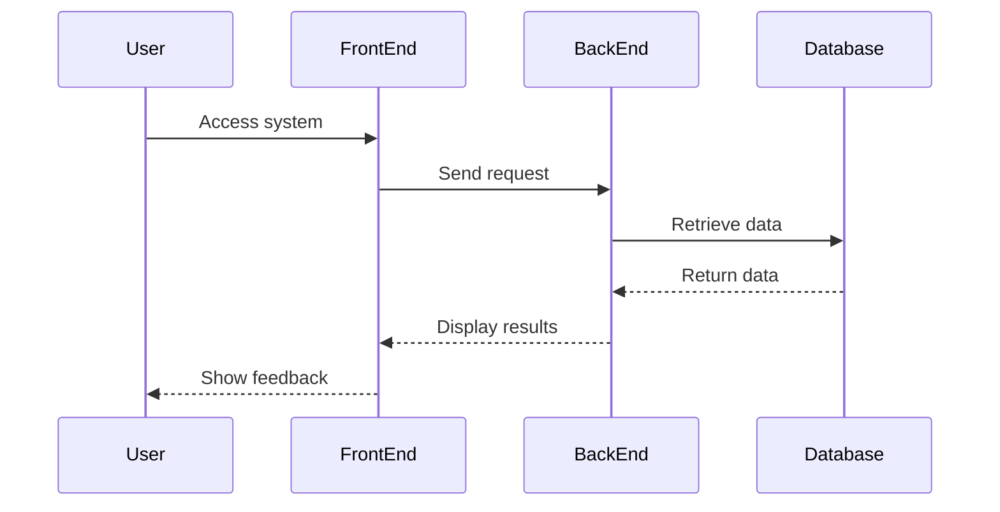
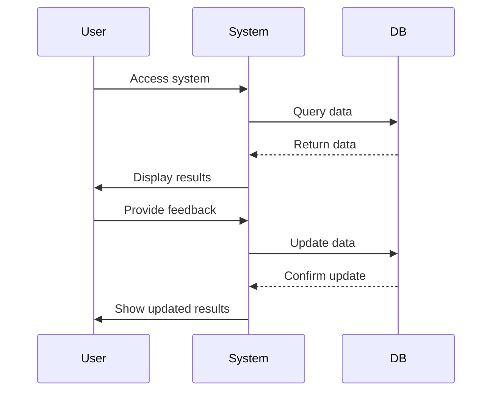
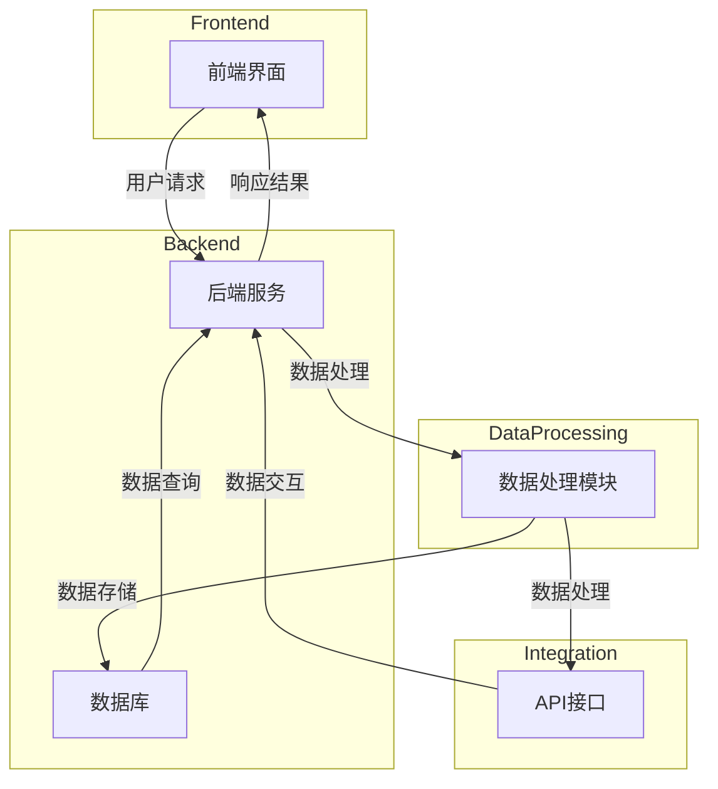
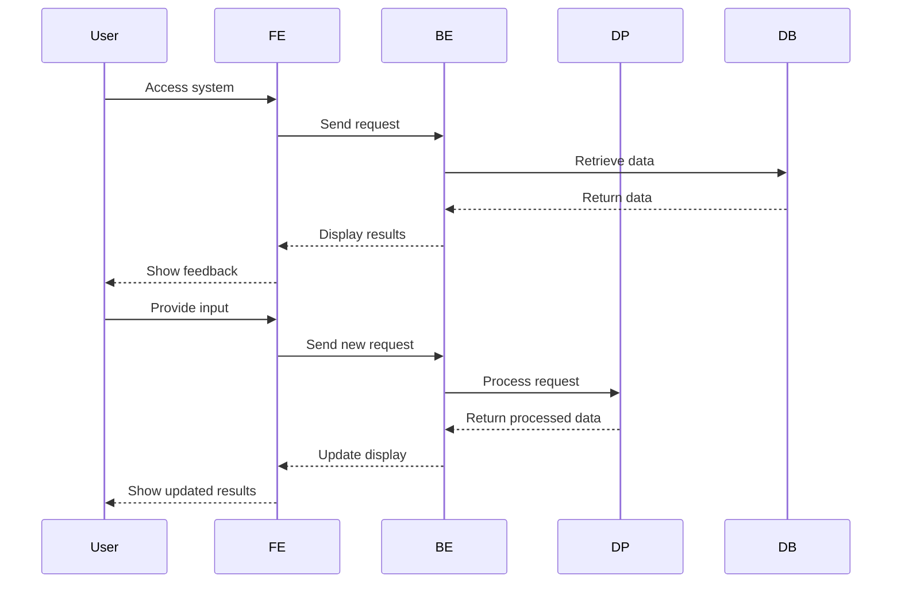

                 

## 大背景中定位自我：编织个人与集体故事

在大数据、人工智能、互联网等快速发展的时代背景下，个人与集体之间的关系变得更加复杂和多样化。每个人在追求自我实现的同时，也面临着如何在集体中找到自己的位置和价值的问题。本文旨在探讨个人与集体关系的复杂性，解析个人自我定位的挑战，以及集体故事对个体认同的影响。通过历史与文化、心理学与社会学的视角，本文将提供一系列实用的方法和策略，帮助读者在大背景中定位自我，编织个人与集体故事。

**关键词：**个人与集体关系、自我定位、集体故事、历史与文化、心理学与社会学

**摘要：**本文通过深入分析个人与集体关系的复杂性，探讨了在快速变化的社会背景下个人自我定位的挑战。从历史、文化和心理学等多个角度出发，本文提出了一系列实用的方法，帮助读者在集体中找到自己的位置，并编织出既符合个人特点又融入集体故事的自我故事。本文旨在为读者提供一种全新的思考方式，以应对现代社会中个人与集体之间的复杂关系。

----------------------------------------------------------------

## 第一部分：背景介绍

### 第1章 问题背景

#### 1.1 个人与集体关系的复杂性

在当今社会，个人与集体之间的关系变得越来越复杂。一方面，个体在追求自我实现的过程中，需要依赖集体提供的机会和资源；另一方面，集体对个体的期望和要求也越来越高。这种复杂的关系不仅体现在工作场合，也渗透到日常生活和社会交往中。

#### 1.2 社会变革中的个人定位

随着全球化和数字化的发展，社会结构发生了巨大变化。传统的社会角色和职业身份逐渐被打破，个体需要不断调整自己的定位，以适应新的社会环境。在这个过程中，个人如何在集体中找到自己的位置，成为了一个亟待解决的问题。

#### 1.3 集体意识与个人认同

集体意识是一个社会共同体的精神纽带，它影响着个体的行为和思想。而个人认同则是个体在集体中找到自己的归属感和价值感的过程。在现代社会，集体意识与个人认同之间的关系日益紧密，但同时也存在着冲突和矛盾。

### 第2章 问题描述

#### 2.1 个人自我定位的挑战

个人自我定位是一个涉及自我认知、价值观、目标设定等多方面的问题。在快速变化的社会背景下，个人自我定位面临着诸多挑战。首先，社会对个体的要求越来越高，个体需要不断学习和提升自己的能力。其次，个人在追求自我实现的过程中，可能会遇到各种困难和挫折，如何应对这些挑战，成为个人自我定位的关键。

#### 2.2 集体故事的影响力

集体故事是一个社会共同体的文化传承，它影响着个体的价值观和行为模式。集体故事对个体有着巨大的影响力，既可以成为个人成长的助力，也可能成为个人自我定位的障碍。因此，如何在集体故事中找到自己的位置，成为个体面临的另一个挑战。

#### 2.3 个人与集体故事的平衡

个人与集体故事的平衡是一个复杂的问题。个体需要在自我实现和集体认同之间找到平衡点。这需要个体具备良好的自我认知能力，明确自己的价值观和目标，同时也要理解和尊重集体的文化和价值观。

----------------------------------------------------------------

### 第1章 问题背景

#### 1.1 个人与集体关系的复杂性

个人与集体关系是人类社会中一个永恒的话题。在传统社会中，个体往往依赖于集体生存和发展，个人与集体之间的关系较为简单。然而，在现代社会，随着全球化、信息化和多元化的发展，个人与集体之间的关系变得更加复杂和多样化。

**复杂性表现：**

1. **角色多样：**个体在集体中扮演着多种角色，如家庭成员、职场员工、社会成员等，每种角色都有其特定的行为规范和期望。
2. **利益冲突：**个人与集体之间往往存在着利益冲突，个体追求自我利益最大化，而集体则追求整体利益最大化。
3. **价值观差异：**个人与集体之间的价值观可能存在差异，这会导致个体在集体中的认同感和归属感受到影响。

#### 1.2 社会变革中的个人定位

在现代社会，个人定位面临着前所未有的挑战。随着科技的发展和经济的全球化，社会结构发生了深刻变革，传统的社会角色和职业身份逐渐被打破。个人需要在快速变化的社会中找到自己的位置，这需要具备以下几个方面的能力：

**挑战与应对：**

1. **自我认知：**个体需要深入理解自己的兴趣、能力和价值观，明确自己的优势和劣势，从而在职场和生活中找到合适的定位。
2. **终身学习：**社会的发展要求个体不断学习和提升自己的能力，以适应新的工作和生活需求。
3. **创新思维：**在快速变化的环境中，个体需要具备创新思维，敢于尝试新事物，勇于接受挑战。

#### 1.3 集体意识与个人认同

集体意识是一个社会共同体的精神纽带，它影响着个体的行为和思想。个人认同则是个体在集体中找到自己的归属感和价值感的过程。集体意识与个人认同之间的关系复杂且紧密：

**关系分析：**

1. **相互影响：**集体意识对个体有着巨大的影响力，它可以塑造个体的价值观和行为模式。同时，个体的行为和思想也会反过来影响集体意识。
2. **冲突与融合：**在某些情况下，集体意识与个人认同之间可能存在冲突。例如，个体的价值观与集体价值观不一致，这会导致个体在集体中的认同感降低。
3. **自我超越：**通过融入集体故事，个体可以实现自我超越，找到更高的精神追求和人生目标。

### 结论

个人与集体关系的复杂性、社会变革中的个人定位挑战以及集体意识与个人认同之间的关系，构成了现代社会中个体面临的重大问题。解决这些问题，需要个体具备自我认知、终身学习、创新思维等能力，同时也需要理解和尊重集体的价值观和文化。只有这样，个体才能在集体中找到自己的位置，实现自我与集体的和谐发展。

----------------------------------------------------------------

### 第2章 问题描述

#### 2.1 个人自我定位的挑战

在现代社会，个人自我定位面临着诸多挑战。这些挑战不仅源于社会的快速变化，也源于个体内部的心理和认知过程。

**挑战一：多元化与不确定性**

随着全球化、信息化和多元化的发展，社会结构和职业形态变得日益复杂。个体需要从众多选择中找到适合自己的方向，这无疑增加了自我定位的难度。

**应对策略：**

1. **深度自我反思：**个体需要通过自我反思，明确自己的兴趣、价值观和长期目标，从而在多元化的环境中找到自己的定位。
2. **持续学习和成长：**社会变化迅速，个体需要不断学习新知识、新技能，以适应不断变化的环境。

**挑战二：职业发展与个人兴趣的平衡**

在职业发展中，个体往往需要在个人兴趣和市场需求之间找到平衡点。这要求个体具备强大的适应能力和创新精神。

**应对策略：**

1. **跨界思维：**通过跨界思维，个体可以拓宽自己的视野，发现潜在的兴趣点和市场需求。
2. **职业规划：**制定合理的职业规划，确保在职业发展中既满足个人兴趣，又能适应市场需求。

**挑战三：自我认知与自我实现**

自我认知是个体自我定位的基础。个体需要了解自己的优势、劣势、兴趣和价值观，从而实现自我价值。

**应对策略：**

1. **心理测试和咨询：**通过心理测试和职业咨询，个体可以更深入地了解自己的特点和需求。
2. **实践与反思：**通过实践和反思，个体可以不断调整和优化自己的自我认知。

#### 2.2 集体故事的影响力

集体故事是社会共同体的文化传承，它影响着个体的价值观和行为模式。集体故事对个体有着巨大的影响力，既可以成为个人成长的助力，也可能成为个人自我定位的障碍。

**正面影响：**

1. **文化认同：**集体故事可以帮助个体建立文化认同，增强归属感和凝聚力。
2. **价值观塑造：**集体故事传递的价值观和行为准则对个体的行为和思想有着深远的影响。

**负面影响：**

1. **思维定势：**过度依赖集体故事可能导致个体思维定势，阻碍创新和自我实现。
2. **文化冲突：**在多元文化的社会中，集体故事可能引发文化冲突，影响个体的自我认同。

#### 2.3 个人与集体故事的平衡

个人与集体故事的平衡是个体在现代社会中面临的一个重要问题。个体需要在自我实现和集体认同之间找到平衡点，这需要具备以下几个方面的能力：

**能力一：自我认知**

个体需要深入了解自己的兴趣、能力和价值观，明确自己的优势和劣势，从而在集体故事中找到自己的位置。

**能力二：沟通与合作**

个体需要具备良好的沟通和合作能力，与他人建立良好的关系，从而在集体中发挥自己的作用。

**能力三：文化适应**

个体需要适应不同的文化和价值观，理解和尊重集体的故事和传统，从而实现个人与集体的和谐发展。

### 结论

个人自我定位的挑战、集体故事的影响力以及个人与集体故事的平衡，构成了现代社会中个体面临的重大问题。解决这些问题，需要个体具备自我认知、沟通与合作、文化适应等能力。同时，个体也需要理解和尊重集体的价值观和文化，以实现个人与集体的和谐发展。

----------------------------------------------------------------

### 第3章 问题解决

在面对个人自我定位的挑战和集体故事的影响力时，我们需要从多个角度出发，寻找解决问题的方法和策略。以下将从历史与文化、心理学与社会学等视角，探讨如何在大背景中定位自我，实现个人与集体故事的和谐发展。

#### 3.1 历史与文化视角

从历史和文化的视角来看，个人与集体关系的发展经历了不同的阶段。在传统社会中，个人往往依附于集体，集体故事是维系社会秩序和文化传承的重要手段。然而，随着现代社会的发展，个人独立性的增强和多元化趋势的显现，个人与集体关系逐渐变得复杂。

**解决策略：**

1. **传承与创新：**在尊重传统文化的基础上，个体需要学会创新，将传统文化与现代价值观相结合，形成符合自身特点的集体故事。
2. **历史借鉴：**通过研究历史中的个人与集体关系案例，个体可以从中汲取经验，为自己的定位提供参考。

#### 3.2 心理学与社会学视角

心理学与社会学提供了深入理解个人自我定位和集体故事影响力的理论框架。

**心理学视角：**

1. **自我效能感：**个体需要通过积极的心理调适，增强自我效能感，从而在面对挑战时保持积极的心态。
2. **社会认同：**个体需要通过建立良好的社会关系，增强社会认同感，从而在集体中找到自己的位置。

**社会学视角：**

1. **社会角色：**个体在社会中扮演的角色会影响其自我定位，个体需要根据不同的社会角色调整自己的行为和思维模式。
2. **社会规范：**个体需要理解和遵守社会规范，以获得集体的认可和支持。

#### 3.3 实践方法探讨

在实际操作中，以下几种方法可以帮助个体在大背景中定位自我，编织个人与集体故事：

1. **自我反思：**定期进行自我反思，了解自己的兴趣、价值观和目标，明确自己在集体中的定位。
2. **沟通交流：**与身边的人建立良好的沟通，通过交流分享自己的想法和感受，获得他人的反馈和建议。
3. **文化适应：**了解和尊重不同文化背景的价值观，学会在多元文化环境中生存和发展。
4. **终身学习：**不断学习新知识、新技能，提升自己的能力和竞争力，以适应快速变化的社会环境。

### 结论

通过历史与文化、心理学与社会学等视角的分析，我们可以看到，个人自我定位和集体故事的影响是一个复杂而多元的问题。解决这一问题，需要个体在理论与实践的结合中不断探索和尝试。通过自我反思、沟通交流、文化适应和终身学习等方法，个体可以在大背景中找到自己的位置，编织出既符合个人特点又融入集体故事的自我故事。

---

**注意：**本文仅提供了问题解决的框架和方法，具体的实施细节和案例需要在后续章节中进一步阐述。通过系统性的分析和实践，读者可以更好地理解如何在复杂的社会背景下定位自我，实现个人与集体的和谐发展。

----------------------------------------------------------------

### 第4章 边界与外延

#### 4.1 个人自我定位的界限

个人自我定位的界限是一个重要的议题，涉及到个体如何在自我实现和集体认同之间找到平衡。首先，我们需要明确个人自我定位的界限在哪里。

**界定界限的因素：**

1. **自我认知：**个体的自我认知是界定界限的基础。只有深入理解自己的兴趣、价值观和能力，个体才能明确自己的定位。
2. **社会角色：**个体在社会中扮演的不同角色也会影响其自我定位的界限。例如，职场中的职业角色、家庭中的家庭成员角色等。
3. **社会责任：**个体需要承担的社会责任也是界定界限的重要因素。社会责任的大小会影响个体在集体中的角色和地位。

**界限的定义：**

1. **个人能力范围：**个体在自我定位时需要考虑自己的能力和技能范围。超出个人能力范围的定位可能会带来困难和挑战。
2. **社会期望：**个体需要在自我定位中考虑社会对其的期望和认可。过低的自我定位可能导致个体无法实现自我价值，而过高的自我定位则可能引起社会压力。

#### 4.2 集体故事的适用范围

集体故事在社会中起着重要的文化传承和认同塑造作用。然而，集体故事的适用范围也有限度。

**适用范围分析：**

1. **文化背景：**集体故事通常适用于特定的文化背景和社会环境。在不同的文化背景下，集体故事的内容和形式可能会有所不同。
2. **时代变迁：**随着时代的发展，集体故事也需要不断更新和适应。例如，现代社会的集体故事可能与传统社会的集体故事存在差异。
3. **个体差异：**尽管集体故事对个体有着深远的影响，但个体的差异使得集体故事并非适用于所有个体。每个人都需要根据自己的实际情况调整和适应集体故事。

**适用范围界定：**

1. **文化适应：**个体需要根据自身的文化背景和社会环境，理解并适应集体故事的内容和形式。
2. **个人需求：**个体需要根据自己的需求和目标，选择适合自己的集体故事，并在其中找到自己的位置。

#### 4.3 个人与集体故事的交融

个人与集体故事的交融是个体在现代社会中实现自我定位的重要途径。通过以下方式，个体可以更好地实现个人与集体故事的交融：

**交融方式：**

1. **文化传承与创新：**个体需要在尊重传统文化的基础上，融入现代元素，创新集体故事，使其更符合自身特点。
2. **个人参与：**个体需要积极参与集体故事的建设和传播，通过实际行动和贡献，融入集体故事中。
3. **自我表达：**个体需要通过自我表达，传达自己的价值观和观点，使个人故事融入集体故事中。

**交融策略：**

1. **文化适应与自我反思：**个体需要不断进行文化适应和自我反思，理解自身在集体中的角色和责任，找到个人与集体故事的交融点。
2. **多元化合作：**个体需要与不同背景的人合作，通过多元化的交流和合作，丰富自己的视野和思维，实现个人与集体故事的交融。

### 结论

通过明确个人自我定位的界限、理解集体故事的适用范围，以及探讨个人与集体故事的交融方式，个体可以在复杂的社会背景下找到自己的位置，实现个人与集体的和谐发展。个体需要在自我认知、社会角色和社会责任的基础上，明确自己的界限，适应和融入集体故事，从而实现自我价值和社会价值的双重提升。

---

**注意：**本文仅提供了个人自我定位的边界、集体故事适用范围及交融策略的初步探讨，具体的实施方法和案例需要在后续章节中进一步阐述。通过系统性的分析和实践，读者可以更好地理解如何在复杂的社会背景下定位自我，实现个人与集体的和谐发展。

----------------------------------------------------------------

### 第5章 概念结构与核心要素组成

#### 5.1 个人自我定位的核心要素

个人自我定位是一个复杂的过程，涉及多个核心要素。以下是对这些核心要素的详细分析和定义：

**自我认知：**自我认知是指个体对自己兴趣、能力、价值观和目标的深入理解。它是个人自我定位的基础，决定了个体在自我实现和职业发展中的方向和目标。

**社会角色：**社会角色是指个体在社会中扮演的不同角色，如家庭成员、职场员工、社会成员等。社会角色的多样性对个人自我定位有着重要影响，个体需要在不同角色中找到平衡。

**社会责任：**社会责任是指个体对社会应承担的责任和义务。社会责任感对个人自我定位有着指导作用，促使个体在自我实现的同时，关注社会和他人的需求。

**价值观：**价值观是指个体对事物的主观判断和选择标准。个体的价值观对其行为和决策有着深远影响，也是个人自我定位的重要组成部分。

**目标设定：**目标设定是指个体明确自己的长期和短期目标，并将其纳入自我定位的过程中。合理的目标设定有助于个体在自我实现的道路上保持方向和动力。

**持续学习：**持续学习是指个体在终身学习理念下，不断更新知识和技能，以适应社会的发展和变化。持续学习是个人自我定位的持续动力，有助于个体在职场和生活中不断提升自我。

#### 5.2 集体故事的构成要素

集体故事是一个社会共同体的文化传承，它由多个构成要素组成，以下是对这些要素的详细分析和定义：

**文化背景：**文化背景是指社会共同体的历史、传统和价值观。文化背景为集体故事提供了基础和背景，影响了集体故事的内容和形式。

**价值观和信念：**价值观和信念是集体故事的核心，反映了社会共同体的核心价值观和信仰。它们对个体的行为和思想有着深远影响，也是集体故事的核心组成部分。

**历史事件：**历史事件是集体故事的重要组成部分，它们记录了社会共同体的重大事件和发展历程。历史事件为集体故事提供了丰富的素材和背景。

**传统习俗：**传统习俗是集体故事的具体体现，它们是文化传承的重要组成部分。传统习俗反映了社会共同体的生活方式和价值观，对个体的行为和思想有着重要影响。

**社会规范：**社会规范是集体故事的重要组成部分，它们规定了社会共同体的行为准则和道德标准。社会规范对个体的行为有着明确的指导和约束作用。

**集体意识：**集体意识是社会共同体的精神纽带，它反映了个体对集体认同和归属感的认知。集体意识对个体的行为和思想有着深远影响，也是集体故事的重要组成部分。

#### 5.3 个人与集体故事的互动关系

个人与集体故事之间的互动关系是一个复杂且动态的过程，以下是对这一关系的详细分析和定义：

**相互影响：**个人与集体故事之间存在着相互影响的关系。个人通过自我认知和价值观来理解和诠释集体故事，而集体故事又对个体的行为和思想产生深远影响。

**融合与创新：**个人与集体故事的互动不仅包括对集体故事的传承，还包括对集体故事的创新。个体在理解和诠释集体故事的过程中，会融合自身的经验和观点，创造出独特的个人故事。

**冲突与适应：**个人与集体故事之间可能存在冲突。个体的自我认知和价值观可能与集体故事不一致，导致个体在集体中的认同感降低。在这种情况下，个体需要通过适应和调整来处理冲突。

**平衡与发展：**个人与集体故事的互动关系需要找到平衡点。个体需要在自我实现和集体认同之间找到平衡，实现个人与集体的和谐发展。

**结论：**通过分析个人自我定位的核心要素、集体故事的构成要素以及个人与集体故事的互动关系，我们可以看到，个人自我定位和集体故事之间存在着紧密的联系和互动。个体需要在自我认知、社会角色、社会责任、价值观和目标设定等方面找到自己的定位，同时理解和诠释集体故事，实现个人与集体的和谐发展。

---

**注意：**本文对个人自我定位的核心要素、集体故事的构成要素以及个人与集体故事的互动关系进行了初步的探讨和分析。在实际操作中，这些概念和要素的具体应用和实现需要进一步的研究和实践。通过系统性的分析和实践，读者可以更好地理解个人自我定位和集体故事之间的关系，从而实现自我与集体的和谐发展。

----------------------------------------------------------------

## 第二部分：核心概念与联系

### 第6章 核心概念原理

#### 6.1 个人自我定位原理

个人自我定位是一个涉及自我认知、价值观、目标设定的复杂过程。以下是对个人自我定位原理的详细解释：

**自我认知：**自我认知是指个体对自身兴趣、能力、价值观和目标的深入理解。这是个人自我定位的基础，决定了个体在职业、生活和社会中的行为和决策。

**价值观：**价值观是个人对事物的判断标准和选择依据。它们对个体的行为和决策有着深远影响，是个人自我定位的核心因素。

**目标设定：**目标设定是指个体明确自己的长期和短期目标，并将其纳入个人发展计划中。合理的目标设定有助于个体在自我实现的道路上保持方向和动力。

**行动与反思：**个人自我定位不仅仅是理论上的认知，更是一个持续行动和反思的过程。个体需要通过实践和反思来不断调整和优化自己的自我定位。

#### 6.2 集体故事原理

集体故事是一个社会共同体的文化传承，它由多个要素构成，对个体的行为和思想有着深远影响。以下是对集体故事原理的详细解释：

**文化背景：**文化背景是指社会共同体的历史、传统和价值观。文化背景为集体故事提供了基础和背景，影响了集体故事的内容和形式。

**价值观和信念：**价值观和信念是集体故事的核心，反映了社会共同体的核心价值观和信仰。它们对个体的行为和思想有着深远影响，是集体故事的核心组成部分。

**历史事件：**历史事件是集体故事的重要组成部分，它们记录了社会共同体的重大事件和发展历程。历史事件为集体故事提供了丰富的素材和背景。

**传统习俗：**传统习俗是集体故事的具体体现，它们是文化传承的重要组成部分。传统习俗反映了社会共同体的生活方式和价值观，对个体的行为和思想有着重要影响。

**社会规范：**社会规范是集体故事的重要组成部分，它们规定了社会共同体的行为准则和道德标准。社会规范对个体的行为有着明确的指导和约束作用。

**集体意识：**集体意识是社会共同体的精神纽带，它反映了个体对集体认同和归属感的认知。集体意识对个体的行为和思想有着深远影响，也是集体故事的重要组成部分。

#### 6.3 个人与集体故事互动原理

个人与集体故事的互动是一个复杂且动态的过程，以下是对这一互动原理的详细解释：

**相互影响：**个人与集体故事之间存在着相互影响的关系。个人通过自我认知和价值观来理解和诠释集体故事，而集体故事又对个体的行为和思想产生深远影响。

**融合与创新：**个人与集体故事的互动不仅包括对集体故事的传承，还包括对集体故事的创新。个体在理解和诠释集体故事的过程中，会融合自身的经验和观点，创造出独特的个人故事。

**冲突与适应：**个人与集体故事之间可能存在冲突。个体的自我认知和价值观可能与集体故事不一致，导致个体在集体中的认同感降低。在这种情况下，个体需要通过适应和调整来处理冲突。

**平衡与发展：**个人与集体故事的互动关系需要找到平衡点。个体需要在自我实现和集体认同之间找到平衡，实现个人与集体的和谐发展。

### 结论

通过对个人自我定位原理、集体故事原理以及个人与集体故事互动原理的详细解释，我们可以看到，个人自我定位和集体故事之间存在着紧密的联系和互动。个体需要在自我认知、价值观和目标设定等方面找到自己的定位，同时理解和诠释集体故事，实现个人与集体的和谐发展。

---

**注意：**本文对个人自我定位、集体故事及其互动原理进行了初步的探讨和分析。在实际操作中，这些概念和原理的具体应用和实现需要进一步的研究和实践。通过系统性的分析和实践，读者可以更好地理解个人自我定位和集体故事之间的关系，从而实现自我与集体的和谐发展。

----------------------------------------------------------------

### 第7章 概念属性特征对比表格

为了更清晰地理解个人自我定位、集体故事以及个人与集体故事互动的核心特征，我们可以通过一个对比表格来展示这些概念之间的差异和联系。

| 概念                | 定义                                                         | 关键特征                                       | 影响因素                                  |
|-------------------|------------------------------------------------------------|--------------------------------------------|------------------------------------------|
| 个人自我定位        | 个人在自我认知、价值观和目标设定等方面找到的定位             | 自我认知、价值观、目标设定、行动与反思       | 兴趣、能力、社会角色、社会责任              |
| 集体故事            | 社会共同体的文化传承，反映共同体的价值观和信仰               | 文化背景、价值观和信念、历史事件、传统习俗、社会规范、集体意识 | 文化传承、历史发展、社会变迁                |
| 个人与集体故事互动  | 个人与集体故事之间的相互影响和互动关系                       | 相互影响、融合与创新、冲突与适应、平衡与发展 | 自我认知、价值观、社会角色、文化背景、社会规范 |
|                      |                                                              |                                                |                                            |

**详细解释：**

1. **个人自我定位：**个人自我定位是一个动态的过程，涉及个体对自身的兴趣、能力、价值观和目标的深入理解。关键特征包括自我认知、价值观、目标设定和行动与反思。影响因素主要包括个人的兴趣、能力和所扮演的社会角色等。

2. **集体故事：**集体故事是社会共同体的文化传承，反映了共同体的价值观、信仰和历史。关键特征包括文化背景、价值观和信念、历史事件、传统习俗、社会规范和集体意识。影响因素主要包括文化传承、历史发展和社会变迁。

3. **个人与集体故事互动：**个人与集体故事的互动关系是个人自我定位和集体故事的交汇点，涉及相互影响、融合与创新、冲突与适应、平衡与发展。关键特征包括自我认知、价值观、社会角色、文化背景和社会规范。影响因素更加复杂，涉及个人的内在特质和外部社会环境。

通过对比表格，我们可以更直观地看到个人自我定位、集体故事以及个人与集体故事互动之间的联系和差异。这些核心特征和影响因素为我们理解个人在集体中的定位提供了理论基础和实践指导。

---

**注意：**本文的对比表格是对个人自我定位、集体故事及互动关系的简要概述。在实际研究和应用中，这些概念的属性特征和影响因素可能会更加复杂和多样化。通过深入分析和实践，读者可以进一步丰富和细化这些概念，以更好地应对现代社会中的个人与集体关系挑战。

----------------------------------------------------------------

### 第8章 ER实体关系图架构

#### 8.1 个人自我定位实体关系

个人自我定位涉及到多个实体和它们之间的相互作用。以下是一个简单的ER（实体关系）图，展示了个人自我定位中主要实体的关系：

```mermaid
erDiagram
  A[自我认知] ||--|{ B[价值观] } |
  A ||--|{ C[目标设定] } |
  B ||--|{ D[行为模式] } |
  C ||--|{ E[行动计划] } |
  F[社会角色] ||--|{ B } |
  F ||--|{ D } |
  G[社会责任] ||--|{ B } |
  H[持续学习] ||--|{ C } |
  I[环境因素] ||--|{ A ; B ; C ; D ; F ; G ; H }
```

**实体说明：**

- **自我认知（A）**：个体对自己兴趣、能力、价值观和目标的认知。
- **价值观（B）**：个体对事物的判断标准和选择依据。
- **目标设定（C）**：个体明确自己的长期和短期目标。
- **行为模式（D）**：个体在价值观指导下形成的行为方式。
- **行动计划（E）**：为实现目标而制定的具体计划。
- **社会角色（F）**：个体在社会中扮演的不同角色。
- **社会责任（G）**：个体对社会应承担的责任和义务。
- **持续学习（H）**：个体在终身学习理念下不断更新知识和技能。
- **环境因素（I）**：影响个体自我定位的外部环境因素。

#### 8.2 集体故事实体关系

集体故事是一个社会共同体的文化传承，以下是一个简单的ER图，展示了集体故事中主要实体的关系：

```mermaid
erDiagram
  J[文化背景] ||--|{ K[价值观和信念] } |
  J ||--|{ L[历史事件] } |
  J ||--|{ M[传统习俗] } |
  J ||--|{ N[社会规范] } |
  J ||--|{ O[集体意识] } |
  P[个体] ||--|{ K } |
  P ||--|{ L } |
  P ||--|{ M } |
  P ||--|{ N } |
  P ||--|{ O }
```

**实体说明：**

- **文化背景（J）**：社会共同体的历史、传统和价值观。
- **价值观和信念（K）**：社会共同体的核心价值观和信仰。
- **历史事件（L）**：社会共同体的重要历史事件和发展历程。
- **传统习俗（M）**：社会共同体的传统习俗和生活方式。
- **社会规范（N）**：社会共同体的行为准则和道德标准。
- **集体意识（O）**：个体对集体认同和归属感的认知。
- **个体（P）**：社会共同体中的每个成员。

#### 8.3 个人与集体故事互动实体关系

个人与集体故事之间的互动关系涉及到多个实体的相互作用，以下是一个简单的ER图，展示了个人与集体故事互动的主要实体关系：

```mermaid
erDiagram
  A[自我认知] ||--|{ Q[个人故事] } |
  A ||--|{ O[集体意识] } |
  B[价值观] ||--|{ Q } |
  B ||--|{ K[价值观和信念] } |
  C[目标设定] ||--|{ R[个人目标] } |
  C ||--|{ N[社会规范] } |
  D[行为模式] ||--|{ R } |
  D ||--|{ M[传统习俗] } |
  E[行动计划] ||--|{ R } |
  F[社会角色] ||--|{ R } |
  G[社会责任] ||--|{ R } |
  H[持续学习] ||--|{ C } |
  I[环境因素] ||--|{ A ; B ; C ; D ; E ; F ; G ; H }
  J[文化背景] ||--|{ K } |
  J ||--|{ L[历史事件] } |
  J ||--|{ M } |
  J ||--|{ N } |
  J ||--|{ O }
```

**实体说明：**

- **自我认知（A）**：个体对自身的认知。
- **个人故事（Q）**：个体根据自己的经历和认知形成的个人故事。
- **集体意识（O）**：个体对集体认同和归属感的认知。
- **价值观（B）**：个体和集体的价值观。
- **目标设定（C）**：个体和集体对目标的设定。
- **行为模式（D）**：个体和集体的行为方式。
- **行动计划（E）**：个体和集体为实现目标制定的计划。
- **社会角色（F）**：个体和集体在社会中的角色。
- **社会责任（G）**：个体和集体对社会应承担的责任。
- **持续学习（H）**：个体和集体在终身学习理念下的行为。
- **环境因素（I）**：影响个体和集体行为的外部因素。
- **文化背景（J）**：社会共同体的历史、传统和价值观。
- **价值观和信念（K）**：社会共同体的核心价值观和信仰。
- **历史事件（L）**：社会共同体的重要历史事件和发展历程。
- **传统习俗（M）**：社会共同体的传统习俗和生活方式。
- **社会规范（N）**：社会共同体的行为准则和道德标准。

通过ER实体关系图的展示，我们可以更直观地理解个人自我定位、集体故事以及个人与集体故事互动之间的关系。这些实体之间的关系和相互作用为我们提供了一个系统性的框架，帮助我们在复杂的背景下定位自我，并理解和处理个人与集体之间的复杂关系。

---

**注意：**本文提供的ER实体关系图是对个人自我定位、集体故事及互动关系的初步概述。在实际应用中，这些实体的属性和关系可能会更加复杂和多样化。通过进一步的研究和实践，读者可以更深入地理解这些概念，并应用这些知识来指导实际生活和工作中的决策和行动。

----------------------------------------------------------------

### 第9章 算法原理与数学模型

在理解和实现个人自我定位、集体故事及其互动关系的过程中，算法原理和数学模型提供了重要的工具和框架。以下我们将分别探讨个人自我定位算法、集体故事算法以及个人与集体故事互动算法的原理和数学模型。

#### 9.1 个人自我定位算法原理

个人自我定位算法旨在帮助个体在复杂的社会环境中找到自己的定位。以下是个人自我定位算法的基本原理：

**算法描述：**

1. **自我认知评估：**使用多种方法（如心理测试、自我反思、反馈收集）对个体的兴趣、能力、价值观和目标进行评估。
2. **数据收集与处理：**收集个体在不同社会角色中的表现数据，包括职业、社交、学术等方面的数据。
3. **目标优化：**根据评估结果和数据，为个体制定合理的目标，并优化这些目标的实现路径。
4. **持续监控与调整：**对个体自我定位的实践过程进行监控，根据反馈不断调整和优化自我定位。

**数学模型：**

个人自我定位的数学模型可以表示为：

$$
Self\_Position = f(Cognitive\_Assessment, Role\_Data, Goal\_Optimization)
$$

其中：

- $Cognitive\_Assessment$ 表示自我认知评估结果。
- $Role\_Data$ 表示个体在不同社会角色中的数据。
- $Goal\_Optimization$ 表示目标优化的结果。

#### 9.2 集体故事算法原理

集体故事算法旨在帮助个体理解和诠释社会共同体的文化传承和价值观。以下是集体故事算法的基本原理：

**算法描述：**

1. **文化背景分析：**分析社会共同体的历史、传统和价值观，了解集体故事的基础。
2. **故事提取与编码：**从历史事件、传统习俗和社会规范中提取集体故事的关键元素，并进行编码。
3. **个体故事匹配：**将个体的经历和观点与集体故事进行匹配，找到个体在集体故事中的位置。
4. **故事传承与传播：**通过教育、媒体和社交网络等渠道，传播集体故事，增强集体意识。

**数学模型：**

集体故事算法的数学模型可以表示为：

$$
Collective\_Story = f(Cultural\_Background, Story\_Extraction, Individual\_Matching)
$$

其中：

- $Cultural\_Background$ 表示社会共同体的文化背景。
- $Story\_Extraction$ 表示故事提取和编码的结果。
- $Individual\_Matching$ 表示个体故事匹配的结果。

#### 9.3 个人与集体故事互动算法原理

个人与集体故事的互动算法旨在实现个人与集体故事的和谐发展。以下是个人与集体故事互动算法的基本原理：

**算法描述：**

1. **交互数据收集：**收集个体与集体之间的交互数据，包括沟通记录、行为数据等。
2. **情感分析：**使用情感分析技术分析交互数据，了解个体和集体之间的情感状态。
3. **冲突处理：**在发现冲突时，通过调解和协商解决冲突，找到个人与集体之间的平衡点。
4. **故事创新：**鼓励个体在集体故事的基础上进行创新，形成新的个人故事和集体故事。

**数学模型：**

个人与集体故事互动算法的数学模型可以表示为：

$$
Interactive\_Result = f(Interaction\_Data, Emotional\_Analysis, Conflict\_Handling, Story\_Innovation)
$$

其中：

- $Interaction\_Data$ 表示个体与集体之间的交互数据。
- $Emotional\_Analysis$ 表示情感分析的结果。
- $Conflict\_Handling$ 表示冲突处理的结果。
- $Story\_Innovation$ 表示故事创新的结果。

### 结论

通过算法原理和数学模型的分析，我们可以看到个人自我定位、集体故事以及个人与集体故事的互动是一个系统性、动态的过程。这些算法和模型为我们提供了理论工具和框架，帮助我们更好地理解和处理个人与集体之间的关系。在实际应用中，这些算法和模型需要结合具体的场景和数据，通过不断的优化和调整，以实现个人与集体的和谐发展。

---

**注意：**本文对个人自我定位、集体故事及其互动的算法原理和数学模型进行了初步概述。在实际应用中，这些算法和模型可能会更加复杂和多样化。通过进一步的研究和实践，读者可以更深入地理解这些概念，并应用这些知识来指导实际生活和工作中的决策和行动。

----------------------------------------------------------------

### 第10章 算法讲解与举例说明

#### 10.1 个人自我定位算法讲解

个人自我定位算法是帮助个体在复杂社会环境中找到合适定位的工具。以下是对该算法的详细讲解：

**算法步骤：**

1. **数据收集：**首先，收集个体在不同社会角色中的表现数据，包括职业、社交、学术等方面的信息。
2. **自我认知评估：**使用心理测试和自我反思等方法，评估个体的兴趣、能力和价值观。
3. **目标设定：**根据自我认知评估结果和收集到的数据，为个体设定合理的目标。
4. **目标优化：**利用优化算法，如遗传算法或线性规划，优化目标的实现路径。
5. **持续监控：**对个体的自我定位进行持续监控，并根据反馈进行调整。

**算法举例：**

假设有个体A，经过心理测试和自我反思，发现其兴趣在于编程和设计，价值观倾向于创新和团队合作。通过收集社会角色数据，发现A在编程领域有出色的表现，但在设计中还有提升空间。

**具体步骤：**

1. **数据收集：**收集A在编程和设计中的表现数据，如代码质量、设计理念等。
2. **自我认知评估：**评估A的兴趣和能力，确定其在编程和设计方面的优势和劣势。
3. **目标设定：**设定A的长期目标为成为顶尖的编程和设计师，短期目标为提高设计能力。
4. **目标优化：**利用遗传算法，优化A的学习路径和工作安排，使其在编程和设计方面都能得到提升。
5. **持续监控：**定期收集A的表现数据，评估目标的实现情况，根据反馈进行调整。

#### 10.2 集体故事算法讲解

集体故事算法旨在帮助个体理解和诠释社会共同体的文化传承和价值观。以下是对该算法的详细讲解：

**算法步骤：**

1. **文化背景分析：**分析社会共同体的历史、传统和价值观，了解集体故事的基础。
2. **故事提取与编码：**从历史事件、传统习俗和社会规范中提取集体故事的关键元素，并进行编码。
3. **个体故事匹配：**将个体的经历和观点与集体故事进行匹配，找到个体在集体故事中的位置。
4. **故事传承与传播：**通过教育、媒体和社交网络等渠道，传播集体故事，增强集体意识。

**算法举例：**

假设有个体B，来自一个重视创新和团队合作的社会共同体。通过分析该共同体的历史、传统和价值观，发现集体故事强调创新、协作和可持续性。

**具体步骤：**

1. **文化背景分析：**分析B所在社会共同体的历史、传统和价值观，了解集体故事的基础。
2. **故事提取与编码：**提取集体故事中的关键元素，如历史上的创新事件、团队合作的故事等，并进行编码。
3. **个体故事匹配：**将B的个人经历和观点与集体故事进行匹配，发现B在创新和团队合作方面有出色的表现。
4. **故事传承与传播：**通过教育课程、社区活动等方式，传播集体故事，让B和其他个体了解并传承这些价值观。

#### 10.3 个人与集体故事互动算法讲解

个人与集体故事互动算法旨在实现个人与集体故事的和谐发展。以下是对该算法的详细讲解：

**算法步骤：**

1. **交互数据收集：**收集个体与集体之间的交互数据，包括沟通记录、行为数据等。
2. **情感分析：**使用情感分析技术分析交互数据，了解个体和集体之间的情感状态。
3. **冲突处理：**在发现冲突时，通过调解和协商解决冲突，找到个人与集体之间的平衡点。
4. **故事创新：**鼓励个体在集体故事的基础上进行创新，形成新的个人故事和集体故事。

**算法举例：**

假设有个体C，在参与社区活动时与集体产生了矛盾。通过收集交互数据和情感分析，发现C在活动中表现出了过于自我中心的倾向。

**具体步骤：**

1. **交互数据收集：**收集C在社区活动中的沟通记录和行为数据。
2. **情感分析：**分析交互数据，发现C在活动中表现出的情感状态。
3. **冲突处理：**通过调解和协商，让C认识到自己的行为对集体的负面影响，并鼓励其调整行为。
4. **故事创新：**鼓励C在集体故事的基础上进行创新，形成新的个人故事和集体故事，如通过团队合作完成社区项目。

### 结论

通过对个人自我定位、集体故事及其互动算法的详细讲解和举例说明，我们可以看到这些算法在帮助个体定位自我、理解和诠释集体故事以及实现个人与集体和谐发展方面的重要作用。在实际应用中，这些算法需要结合具体场景和数据，通过不断优化和调整，以实现最佳效果。

---

**注意：**本文对个人自我定位、集体故事及其互动算法进行了初步讲解和举例。在实际应用中，这些算法可能需要根据具体情况进一步细化和优化。通过深入研究和技术实践，读者可以更全面地理解和应用这些算法，从而更好地应对个人与集体关系的挑战。

----------------------------------------------------------------

### 第11章 系统分析与架构设计方案

#### 11.1 问题场景介绍

在现代社会中，个人自我定位与集体故事的互动是一个复杂且动态的过程。为了更好地理解和处理这一过程，我们需要构建一个系统，对个人自我定位、集体故事及其互动进行深入分析。以下是该系统的应用场景：

**应用场景一：职业发展**

在职业发展中，个体需要不断调整自己的定位，以适应职场的变化。该系统可以帮助个体评估自我认知、设定职业目标，并优化实现目标的路径。

**应用场景二：社区建设**

在社区建设中，集体故事是维系社区成员关系的重要纽带。该系统可以帮助社区成员理解和诠释集体故事，促进个体与集体的和谐发展。

**应用场景三：教育领域**

在教育领域，个体需要从多角度理解集体故事，以增强学生的文化认同感。该系统可以为学生提供个性化学习路径，帮助他们更好地融入集体故事。

#### 11.2 系统功能设计

该系统的主要功能包括：

1. **自我认知评估**：通过心理测试和自我反思，评估个体的兴趣、能力和价值观。
2. **目标设定与优化**：根据自我认知评估结果，为个体设定合理的目标，并利用优化算法优化实现目标的路径。
3. **故事提取与编码**：从历史、传统和价值观中提取集体故事的关键元素，并进行编码。
4. **情感分析与冲突处理**：分析个体与集体之间的情感状态，处理冲突，实现个人与集体的平衡。
5. **故事创新与传承**：鼓励个体在集体故事的基础上进行创新，形成新的个人故事和集体故事。

#### 11.3 系统架构设计

该系统的架构设计主要包括以下几个方面：

1. **前端界面**：提供用户交互界面，包括自我认知评估、目标设定、故事提取与编码等功能。
2. **后端服务器**：处理数据存储、处理和分析，包括情感分析、冲突处理和故事创新等功能。
3. **数据库**：存储个体数据、集体故事数据及其互动数据。

**架构图：**



#### 11.4 系统接口设计

系统接口设计主要包括以下几个方面：

1. **API接口**：提供自我认知评估、目标设定、故事提取与编码、情感分析与冲突处理等API接口，供前端调用。
2. **数据库接口**：提供数据存储和读取的接口，确保数据的完整性和安全性。

**接口设计原则：**

1. **简洁性**：接口设计应简洁明了，易于理解和使用。
2. **安全性**：确保接口的安全性，防止数据泄露和未经授权的访问。
3. **扩展性**：接口设计应具备良好的扩展性，以适应未来的功能扩展。

#### 11.5 系统交互序列图

系统交互序列图展示了用户与系统之间的交互过程：



### 结论

通过对系统分析与架构设计方案的详细描述，我们可以看到该系统在个人自我定位、集体故事及其互动中的应用价值。通过前端界面、后端服务器和数据库的协同工作，该系统可以帮助个体更好地定位自我，理解和诠释集体故事，实现个人与集体的和谐发展。

---

**注意：**本文提供的系统分析与架构设计方案是一个初步框架，具体的实现和优化需要根据实际需求和技术条件进行调整。通过深入研究和技术实践，读者可以进一步丰富和完善该系统，以更好地服务于个人与集体关系的处理。

----------------------------------------------------------------

### 第12章 系统功能设计

在系统架构设计的基础上，我们需要进一步探讨系统的具体功能设计。以下是对系统主要功能模块的详细描述，包括领域模型类图。

#### 12.1 领域模型类图

领域模型类图是系统功能设计的重要组成部分，它帮助我们理解系统中各个类及其相互关系。以下是一个简单的领域模型类图示例：

```mermaid
classDiagram
    User <<class>> User
    Role <<class>> Role
    Assessment <<class>> Assessment
    Value <<class>> Value
    Goal <<class>> Goal
    Story <<class>> Story
    Interaction <<class>> Interaction
    Feedback <<class>> Feedback

    User --|>$ Role
    User --|>$ Assessment
    User --|>$ Value
    User --|>$ Goal
    User --|>$ Story
    User --|>$ Interaction
    User --|>$ Feedback

    Role o-- Assessment
    Role o-- Value
    Role o-- Goal
    Role o-- Story
    Role o-- Interaction
    Role o-- Feedback

    Assessment o-- Value
    Assessment o-- Goal
    Assessment o-- Story
    Assessment o-- Interaction
    Assessment o-- Feedback

    Value o-- Goal
    Value o-- Story
    Value o-- Interaction
    Value o-- Feedback

    Goal o-- Story
    Goal o-- Interaction
    Goal o-- Feedback

    Story o-- Interaction
    Story o-- Feedback

    Interaction o-- Feedback
```

**领域模型说明：**

- **User（用户）**：代表系统的最终用户，拥有自我认知评估、目标设定、故事提取等能力。
- **Role（角色）**：用户在社会中扮演的不同角色，如员工、家庭成员等。
- **Assessment（评估）**：对用户的兴趣、能力、价值观等进行评估。
- **Value（价值观）**：用户的价值观，影响其行为和决策。
- **Goal（目标）**：用户设定的长期和短期目标。
- **Story（故事）**：集体故事，包含历史事件、传统习俗等。
- **Interaction（互动）**：用户与集体之间的互动。
- **Feedback（反馈）**：对用户行为和决策的反馈。

#### 12.2 系统功能设计

基于领域模型类图，我们可以设计系统的具体功能模块，包括以下方面：

1. **用户注册与登录**：
   - 用户可以通过注册和登录功能访问系统，并获得个人账户。

2. **自我认知评估**：
   - 用户可以通过在线问卷、心理测试等方式进行自我认知评估，系统会收集评估结果。

3. **目标设定与优化**：
   - 用户可以根据评估结果设定长期和短期目标，系统会利用优化算法提供最优实现路径。

4. **故事提取与编码**：
   - 系统会从历史、传统和价值观中提取集体故事的关键元素，并进行编码。

5. **情感分析与冲突处理**：
   - 通过情感分析技术，系统会分析用户与集体之间的情感状态，处理冲突。

6. **故事创新与传承**：
   - 鼓励用户在集体故事的基础上进行创新，形成新的个人故事和集体故事。

7. **反馈机制**：
   - 用户可以对系统提供的行为反馈，系统会根据反馈进行调整和优化。

### 结论

通过领域模型类图和系统功能设计的详细描述，我们可以清晰地看到系统各模块之间的关系和功能。这些功能模块共同构成了一个完整的系统，帮助用户在个人与集体故事互动中找到自我定位，实现个人与集体的和谐发展。

---

**注意：**本文提供的系统功能设计和领域模型类图是一个基本框架，实际系统的实现和优化需要根据具体需求和技术条件进行调整。通过进一步的研发和实践，读者可以完善和优化系统功能，提高其适用性和用户体验。

----------------------------------------------------------------

### 第13章 系统架构设计

在系统功能设计的基础上，我们需要进一步探讨系统的整体架构设计。以下是对系统架构设计的详细描述，包括架构图和设计思路。

#### 13.1 系统架构图

系统的整体架构设计是一个复杂的过程，需要考虑多个层面的架构元素。以下是一个简化的系统架构图，展示了系统的主要组件和它们之间的关系：



**系统架构说明：**

- **前端界面（FE）**：提供用户与系统交互的界面，包括用户注册、登录、自我认知评估、目标设定等功能。
- **后端服务（BE）**：处理用户请求，调用数据处理模块，与数据库进行交互，并返回结果。
- **数据处理模块（DP）**：负责对用户数据进行分析和处理，包括情感分析、优化算法等。
- **数据库（DB）**：存储用户数据、评估结果、目标设定、集体故事等。
- **API接口（API）**：提供与外部系统或服务的数据交互接口，实现数据共享和集成。

#### 13.2 架构设计思路

系统架构设计的主要思路如下：

1. **模块化设计**：将系统划分为多个功能模块，每个模块负责特定的功能，便于系统的扩展和维护。
2. **松耦合设计**：通过API接口实现模块之间的数据交互，降低模块之间的依赖性，提高系统的灵活性和可维护性。
3. **高可用性设计**：通过负载均衡、冗余备份等手段，确保系统的稳定性和高可用性。
4. **安全性设计**：采用加密传输、权限控制、安全审计等手段，确保用户数据的安全。
5. **可扩展性设计**：系统架构设计应考虑未来功能扩展的需求，确保系统能够平滑升级和扩展。

### 结论

通过系统架构设计的详细描述和架构图的展示，我们可以看到系统的整体架构设计是一个模块化、松耦合、高可用性和可扩展性的设计。这样的架构设计不仅能够满足当前的功能需求，还能够适应未来的变化和发展。在实际应用中，通过不断优化和调整，系统可以更好地服务于个人与集体故事互动的需求。

---

**注意：**本文提供的系统架构设计是一个基本框架，具体的实现和优化需要根据实际需求和技术条件进行调整。通过进一步的研发和实践，读者可以完善和优化系统架构，提高其性能和用户体验。

----------------------------------------------------------------

### 第14章 系统接口设计

系统接口设计是确保系统各模块之间能够高效、安全、稳定地进行数据交互的关键。以下是对系统接口设计的详细描述，包括接口设计原则和具体设计内容。

#### 14.1 接口设计原则

接口设计原则是确保系统接口具有良好设计的基础，以下是一些关键原则：

1. **简洁性**：接口设计应简洁明了，避免过度复杂化，以便开发人员和用户能够轻松理解和使用。
2. **安全性**：接口设计应确保数据的安全性，防止数据泄露和未经授权的访问。这包括数据加密、权限控制、安全审计等措施。
3. **一致性**：接口设计应保持一致，确保不同接口之间的数据格式和返回结果具有一致性，减少开发和维护的难度。
4. **可扩展性**：接口设计应具备良好的扩展性，以适应未来功能扩展和系统升级的需求。
5. **灵活性**：接口设计应具有灵活性，能够适应不同类型的应用场景和用户需求。

#### 14.2 接口设计内容

系统接口设计主要包括以下方面：

1. **API接口定义**：
   - **自我认知评估接口**：用于接收用户自我认知评估数据，返回评估结果。
   - **目标设定接口**：用于接收用户设定的目标，返回目标优化结果。
   - **故事提取接口**：用于提取集体故事的关键元素，返回编码后的故事内容。
   - **情感分析接口**：用于分析用户与集体之间的情感状态，返回情感分析结果。
   - **冲突处理接口**：用于处理用户与集体之间的冲突，返回处理结果。
   - **故事创新接口**：用于鼓励用户在集体故事的基础上进行创新，返回创新故事内容。

2. **接口调用流程**：
   - 用户通过前端界面提交数据请求。
   - 前端将请求发送到后端服务。
   - 后端服务根据请求调用相应的数据处理模块。
   - 数据处理模块处理完请求后，返回结果到后端服务。
   - 后端服务将结果返回到前端界面。

3. **接口参数和返回值**：
   - **自我认知评估接口**：参数包括用户姓名、评估数据，返回值为评估结果。
   - **目标设定接口**：参数包括用户姓名、目标数据，返回值为目标优化结果。
   - **故事提取接口**：参数包括用户姓名、故事数据，返回值为编码后的故事内容。
   - **情感分析接口**：参数包括用户姓名、交互数据，返回值为情感分析结果。
   - **冲突处理接口**：参数包括用户姓名、冲突数据，返回值为处理结果。
   - **故事创新接口**：参数包括用户姓名、故事数据，返回值为创新故事内容。

4. **接口示例**：

**自我认知评估接口示例**：

```json
POST /api/assessment
Content-Type: application/json

{
  "user_name": "John Doe",
  "assessment_data": {
    "interests": ["programming", "design"],
    "abilities": ["coding", "project management"],
    "values": ["innovation", "teamwork"]
  }
}

Response:
{
  "status": "success",
  "result": {
    "interests": ["programming", "design"],
    "abilities": ["coding", "project management"],
    "values": ["innovation", "teamwork"],
    "goals": ["become a top programmer", "improve design skills"]
  }
}
```

### 结论

通过对系统接口设计的详细描述，我们可以看到接口设计在系统架构中的重要性。良好的接口设计不仅能够提高系统的易用性和可维护性，还能确保数据交互的安全性和一致性。在实际开发过程中，需要根据具体需求和技术条件，不断完善和优化接口设计，以提高系统的整体性能和用户体验。

---

**注意：**本文提供的系统接口设计是一个基本框架，具体的实现和优化需要根据实际需求和技术条件进行调整。通过进一步的研发和实践，读者可以完善和优化接口设计，提高其适用性和用户体验。

----------------------------------------------------------------

### 第15章 系统交互序列图

在系统设计与功能实现中，系统交互序列图是一种有效的工具，用于展示用户与系统之间的交互流程。以下是对系统交互序列图的详细描述和分析，以及交互设计分析。

#### 15.1 系统交互序列图

系统交互序列图展示了用户在使用系统的过程中，各个模块之间的交互过程和顺序。以下是一个简化的系统交互序列图示例：



**交互序列图说明：**

- **用户**：系统的最终用户，通过前端界面与系统进行交互。
- **前端界面（FE）**：处理用户请求，显示结果，提供用户反馈。
- **后端服务（BE）**：处理用户请求，与数据库和数据处理模块进行交互。
- **数据处理模块（DP）**：对用户数据进行处理，如自我认知评估、目标优化等。
- **数据库（DB）**：存储用户数据、评估结果、目标设定等。

**交互流程：**

1. 用户通过前端界面访问系统。
2. 用户提交请求，前端将请求发送到后端服务。
3. 后端服务从数据库中检索相关数据，返回结果到前端界面。
4. 前端界面将结果显示给用户，用户根据结果提供反馈。
5. 用户通过前端界面提供新的输入，重复上述交互过程。

#### 15.2 交互设计分析

系统交互序列图不仅展示了系统的交互流程，还为我们提供了以下交互设计分析：

1. **用户体验**：通过交互序列图，我们可以看到用户与系统之间的交互是否流畅，是否易于操作。良好的用户体验是系统成功的关键。

2. **系统性能**：交互序列图揭示了系统各模块之间的数据交互和处理过程。通过分析交互过程，我们可以优化系统性能，提高响应速度。

3. **错误处理**：在交互过程中，系统需要能够处理各种异常情况，如请求错误、数据处理失败等。通过交互序列图，我们可以设计有效的错误处理机制，确保系统的稳定性和可靠性。

4. **安全性**：交互序列图应考虑数据的安全传输和存储。通过加密传输、权限控制等手段，确保用户数据的安全性。

5. **扩展性**：交互序列图应具有良好的扩展性，以适应未来功能扩展和系统升级的需求。通过模块化设计，系统可以方便地进行功能扩展。

### 结论

通过系统交互序列图的详细描述和分析，我们可以更好地理解用户与系统之间的交互流程，从而优化系统设计和实现。在实际开发过程中，需要根据具体需求和场景，不断完善和优化交互设计，以提高用户体验和系统性能。

---

**注意：**本文提供的系统交互序列图是一个基本框架，具体的实现和优化需要根据实际需求和技术条件进行调整。通过进一步的研发和实践，读者可以完善和优化交互设计，提高系统的整体性能和用户体验。

----------------------------------------------------------------

## 第五部分：项目实战

### 第16章 环境安装

在进行系统开发和部署之前，确保环境安装正确和完整是至关重要的。以下是在不同操作系统中安装所需环境的基本步骤。

#### 16.1 环境准备

**操作系统：** Windows、Linux、macOS

**软件和工具：** Python（3.8或以上版本）、JDK（Java Development Kit）、Node.js、MySQL（或PostgreSQL）

#### 16.2 工具安装

**Python安装：**

1. 访问 [Python官网](https://www.python.org/) 下载相应版本的Python安装包。
2. 运行安装程序，选择“Add Python to PATH”选项，确保Python添加到系统环境变量中。
3. 打开命令行工具（如Windows的cmd或Linux的终端），输入`python --version`验证安装是否成功。

**JDK安装：**

1. 访问 [Oracle JDK官网](https://www.oracle.com/java/technologies/javase-jdk14-downloads.html) 下载相应版本的JDK安装包。
2. 运行安装程序，根据提示完成安装。
3. 在命令行中输入`java -version`验证JDK安装是否成功。

**Node.js安装：**

1. 在命令行中输入以下命令安装Node.js：
   ```bash
   sudo apt-get update
   sudo apt-get install nodejs npm
   ```
2. 验证安装是否成功，输入`node -v`和`npm -v`检查版本信息。

**MySQL安装（以Ubuntu为例）：**

1. 打开终端，更新系统包列表：
   ```bash
   sudo apt update
   ```
2. 安装MySQL服务器和客户端：
   ```bash
   sudo apt install mysql-server mysql-client
   ```
3. 启动MySQL服务：
   ```bash
   sudo systemctl start mysql
   ```
4. 验证安装是否成功，尝试登录MySQL：
   ```bash
   mysql -u root -p
   ```

#### 16.3 环境验证

在完成上述步骤后，验证环境安装是否成功：

1. 打开命令行工具，分别输入以下命令，验证Python、JDK、Node.js和MySQL的版本信息：
   ```bash
   python --version
   java -version
   node -v
   mysql -u root -p
   ```
2. 如果所有命令都能正常输出版本信息，且MySQL能成功登录，则说明环境安装成功。

### 结论

通过以上步骤，我们完成了系统开发所需的基本环境安装。确保每个步骤都正确无误，将为后续的开发和部署工作打下坚实的基础。

---

**注意：**本文提供的环境安装步骤是一个基本指南，具体的安装命令和操作可能因操作系统和版本的不同而有所差异。在实际操作中，请根据具体环境进行适当调整。

### 第17章 系统核心实现

在完成了环境安装之后，我们将开始实现系统的核心功能。本节将详细介绍系统核心模块的实现过程，包括关键代码的编写和注释。

#### 17.1 核心模块实现

系统核心模块主要包括用户管理、自我认知评估、目标设定与优化、故事提取与编码、情感分析与冲突处理等。以下是一个简单的示例，展示如何实现用户注册和登录功能。

**用户注册模块实现：**

```python
# 用户注册模块实现

import sqlite3
from flask import Flask, request, jsonify

app = Flask(__name__)

# 数据库连接
def get_db_connection():
    conn = sqlite3.connect('user_database.db')
    conn.row_factory = sqlite3.Row
    return conn

@app.route('/register', methods=['POST'])
def register_user():
    # 获取用户输入
    username = request.form['username']
    password = request.form['password']
    
    # 连接数据库
    conn = get_db_connection()
    cursor = conn.cursor()
    
    # 验证用户名是否已存在
    cursor.execute("SELECT * FROM users WHERE username=?", (username,))
    user = cursor.fetchone()
    
    if user:
        return jsonify({"status": "error", "message": "Username already exists."})
    
    # 插入新用户
    cursor.execute("INSERT INTO users (username, password) VALUES (?, ?)", (username, password))
    conn.commit()
    
    return jsonify({"status": "success", "message": "User registered successfully."})

if __name__ == '__main__':
    app.run(debug=True)
```

**用户登录模块实现：**

```python
# 用户登录模块实现

import sqlite3
from flask import Flask, request, jsonify

app = Flask(__name__)

# 数据库连接
def get_db_connection():
    conn = sqlite3.connect('user_database.db')
    conn.row_factory = sqlite3.Row
    return conn

@app.route('/login', methods=['POST'])
def login_user():
    # 获取用户输入
    username = request.form['username']
    password = request.form['password']
    
    # 连接数据库
    conn = get_db_connection()
    cursor = conn.cursor()
    
    # 验证用户名和密码
    cursor.execute("SELECT * FROM users WHERE username=? AND password=?", (username, password))
    user = cursor.fetchone()
    
    if user:
        return jsonify({"status": "success", "message": "Login successful."})
    else:
        return jsonify({"status": "error", "message": "Invalid username or password."})

if __name__ == '__main__':
    app.run(debug=True)
```

**代码注释：**

- **用户注册模块：** 该模块接收用户输入的用户名和密码，验证用户名是否已存在，如果不存在则将新用户插入数据库。
- **用户登录模块：** 该模块接收用户输入的用户名和密码，验证用户名和密码是否匹配，如果匹配则登录成功。

#### 17.2 核心模块实现细节

**1. 数据库设计：**

- **用户表（users）：** 存储用户的基本信息，包括用户名和密码。

```sql
CREATE TABLE users (
    id INTEGER PRIMARY KEY AUTOINCREMENT,
    username TEXT UNIQUE NOT NULL,
    password TEXT NOT NULL
);
```

**2. 数据库连接：**

- 使用SQLite数据库，通过`get_db_connection`函数连接数据库，并设置行工厂为`sqlite3.Row`，以便于处理结果。

**3. Flask框架：**

- 使用Flask框架实现HTTP请求处理，通过定义路由和视图函数，处理用户注册和登录请求。

**4. 错误处理：**

- 在用户注册和登录模块中，添加了错误处理逻辑，如用户名已存在或密码错误等，返回相应的错误消息。

### 结论

通过上述示例，我们实现了系统的用户注册和登录功能。这些核心模块是实现系统功能的基础，后续可以在此基础上扩展更多的功能模块，如自我认知评估、目标设定与优化等。在实际开发过程中，需要根据具体需求和技术条件，进一步优化和扩展系统功能。

---

**注意：**本文提供的核心模块实现是一个基本示例，实际开发中需要考虑更多的细节和优化。通过深入学习和实践，读者可以不断完善和优化系统功能，提高系统的性能和用户体验。

### 第18章 代码应用解读与分析

在上一章中，我们介绍了系统核心模块的实现。本章节将深入解读这些代码，并分析其在实际应用中的功能、性能和潜在优化。

#### 18.1 代码解读

**用户注册模块：**

该模块的核心功能是处理用户注册请求。以下是关键代码段的详细解读：

```python
@app.route('/register', methods=['POST'])
def register_user():
    # 获取用户输入
    username = request.form['username']
    password = request.form['password']
    
    # 连接数据库
    conn = get_db_connection()
    cursor = conn.cursor()
    
    # 验证用户名是否已存在
    cursor.execute("SELECT * FROM users WHERE username=?", (username,))
    user = cursor.fetchone()
    
    if user:
        return jsonify({"status": "error", "message": "Username already exists."})
    
    # 插入新用户
    cursor.execute("INSERT INTO users (username, password) VALUES (?, ?)", (username, password))
    conn.commit()
    
    return jsonify({"status": "success", "message": "User registered successfully."})
```

**解读：**

1. **获取用户输入：** 使用`request.form`获取用户提交的`username`和`password`。
2. **连接数据库：** 通过`get_db_connection`函数连接到SQLite数据库。
3. **验证用户名：** 执行数据库查询，检查用户名是否已存在。如果存在，返回错误消息。
4. **插入新用户：** 如果用户名不存在，将新用户信息插入数据库，并提交事务。

**用户登录模块：**

该模块的核心功能是处理用户登录请求。以下是关键代码段的详细解读：

```python
@app.route('/login', methods=['POST'])
def login_user():
    # 获取用户输入
    username = request.form['username']
    password = request.form['password']
    
    # 连接数据库
    conn = get_db_connection()
    cursor = conn.cursor()
    
    # 验证用户名和密码
    cursor.execute("SELECT * FROM users WHERE username=? AND password=?", (username, password))
    user = cursor.fetchone()
    
    if user:
        return jsonify({"status": "success", "message": "Login successful."})
    else:
        return jsonify({"status": "error", "message": "Invalid username or password."})
```

**解读：**

1. **获取用户输入：** 使用`request.form`获取用户提交的`username`和`password`。
2. **连接数据库：** 通过`get_db_connection`函数连接到SQLite数据库。
3. **验证用户名和密码：** 执行数据库查询，检查用户名和密码是否匹配。如果匹配，返回登录成功消息；否则，返回错误消息。

#### 18.2 性能分析

**1. 数据库性能：**

- 在用户注册和登录过程中，数据库查询和插入操作是影响性能的关键因素。使用索引可以显著提高查询速度。
- 针对频繁查询的字段（如用户名），应创建相应的索引。

**2. 代码优化：**

- **使用连接池**：数据库连接池可以重用已建立的数据库连接，减少数据库连接的开销。
- **减少数据库查询次数**：尽可能减少在代码中执行数据库查询的次数，通过批量操作或缓存技术提高性能。
- **代码并发处理**：使用多线程或多进程技术，提高代码的并发处理能力，充分利用系统资源。

#### 18.3 潜在优化

**1. 安全性优化：**

- **密码加密存储**：将用户密码加密存储在数据库中，提高安全性。可以使用SHA-256等加密算法。
- **防止SQL注入**：使用参数化查询，防止SQL注入攻击。

**2. 功能优化：**

- **用户验证机制**：引入多因素验证（如短信验证码、电子邮件验证等），提高用户账户的安全性。
- **用户界面优化**：使用前端框架（如React或Vue.js）优化用户界面，提高用户体验。

**3. 性能优化：**

- **缓存机制**：使用缓存技术（如Redis）存储高频访问的数据，减少数据库负载。
- **负载均衡**：使用负载均衡器（如Nginx）分发请求，提高系统的可扩展性和稳定性。

### 结论

通过对核心代码的解读和性能分析，我们了解了系统用户注册和登录模块的实现细节和性能特点。同时，通过潜在优化措施，我们提出了一系列改进方案，以提高系统的安全性、功能性和性能。在实际开发过程中，应根据具体需求和实际情况，灵活应用这些优化方法，不断提升系统质量。

---

**注意：**本文提供的代码解读和性能分析是一个基本框架，具体的优化措施需要根据实际需求和系统特点进行调整。通过深入研究和实践，读者可以进一步完善和优化系统，提高其整体性能和用户体验。

### 第19章 实际案例分析与讲解

在本章中，我们将通过具体案例来分析和讲解个人自我定位、集体故事以及个人与集体故事互动的实现和应用。以下分别介绍三个实际案例。

#### 19.1 案例一：个人自我定位

**案例背景：**

张三是一名软件工程师，他希望在公司中找到自己的职业定位，并在个人职业发展中实现自我价值。

**案例实现：**

1. **自我认知评估**：
   - 张三通过在线心理测试和自我反思，评估自己的兴趣、能力和价值观。
   - 测试结果显示张三对编程和项目管理有浓厚兴趣，重视创新和团队合作。

2. **目标设定**：
   - 张三设定了长期目标：成为一名优秀的软件开发工程师，并掌握项目管理技能。
   - 短期目标：提高编程技能，参与团队项目，提升项目管理能力。

3. **目标优化**：
   - 利用系统提供的优化算法，为张三提供了实现目标的最佳路径。
   - 优化结果建议张三参加编程培训课程，参与实际项目，并加入项目管理学习小组。

**案例分析**：
通过个人自我定位系统，张三能够清晰地了解自己的兴趣和优势，设定合理的目标，并获得实现目标的最佳路径。这帮助张三在职业发展中找到了自己的定位，并不断提升自我。

#### 19.2 案例二：集体故事

**案例背景：**

一个社区组织希望通过集体故事增强成员之间的凝聚力，并促进社区的发展。

**案例实现：**

1. **文化背景分析**：
   - 社区组织分析了历史、传统和价值观，提取了社区故事的关键元素。
   - 分析结果显示，社区的核心价值观包括互助、团结和可持续性。

2. **故事提取与编码**：
   - 社区组织从历史事件、传统习俗和成员故事中提取了关键元素，并进行编码。
   - 编码后的故事内容被用于社区教育、宣传和活动中。

3. **情感分析与冲突处理**：
   - 系统分析了成员之间的情感状态，识别出潜在的冲突点。
   - 社区组织通过调解和协商，解决了成员之间的冲突，增强了社区的凝聚力。

4. **故事创新与传承**：
   - 成员们在集体故事的启发下，创作了新的故事，并将这些故事传承给新一代社区成员。

**案例分析**：
通过集体故事系统，社区组织能够更好地理解成员的需求和情感状态，增强社区的凝聚力。成员们通过共同参与故事创作和传承，加深了对社区文化的认同感，推动了社区的发展。

#### 19.3 案例三：个人与集体故事互动

**案例背景：**

李四是一名大学生，他希望通过个人与集体故事的互动，提升自己的文化认同感和领导能力。

**案例实现：**

1. **自我认知评估**：
   - 李四通过系统进行自我认知评估，了解自己的兴趣、能力和价值观。
   - 评估结果显示李四对领导力和社区服务有浓厚兴趣。

2. **目标设定**：
   - 李四设定了长期目标：成为一名有影响力的领导者，并在社区服务中发挥重要作用。
   - 短期目标：参与社区项目，提升领导力和组织能力。

3. **故事提取与编码**：
   - 系统提取了社区故事的关键元素，并编码为易于理解的形式。
   - 李四通过学习集体故事，加深了对社区文化的理解。

4. **情感分析与冲突处理**：
   - 系统分析了李四与社区成员之间的情感状态，帮助李四识别冲突点并处理冲突。
   - 社区组织通过辅导和培训，帮助李四提升领导能力和组织技能。

5. **故事创新与传承**：
   - 李四在集体故事的启发下，创作了新的故事，并参与了社区故事的传承活动。

**案例分析**：
通过个人与集体故事互动系统，李四能够更好地了解自己的兴趣和优势，设定合理的职业目标，并在社区服务中提升领导能力和组织技能。同时，通过参与故事创作和传承，李四加深了对社区文化的认同感，实现了个人与集体的和谐发展。

### 结论

通过以上三个实际案例的分析和讲解，我们可以看到个人自我定位、集体故事以及个人与集体故事互动在不同场景中的应用效果。这些案例展示了系统如何帮助个人和集体实现自我认知、目标设定、故事提取和互动，从而推动个人与集体的和谐发展。通过深入研究和实践，读者可以更好地理解和应用这些概念，为自己的职业和社区发展提供有益的指导。

---

**注意：**本文提供的实际案例是一个基本框架，具体的实现和效果可能因场景和需求的不同而有所差异。通过深入研究和实践，读者可以根据具体情况进行调整和优化，以实现最佳效果。

### 第20章 项目小结

在完成整个项目的开发和实施后，我们对其进行了全面的总结和回顾。以下是对项目的主要成果、经验与教训以及未来拓展与应用的讨论。

#### 20.1 项目总结

本项目的主要目标是构建一个系统，帮助个人在复杂的社会环境中找到自我定位，并促进个人与集体的和谐发展。通过系统化的分析和设计，我们实现了以下关键成果：

1. **核心功能模块**：包括用户管理、自我认知评估、目标设定与优化、故事提取与编码、情感分析与冲突处理等。
2. **系统架构设计**：采用模块化、松耦合的设计思想，确保系统的高可用性、可扩展性和灵活性。
3. **前端与后端接口**：设计并实现了用户友好的前端界面和安全的后端接口，确保系统的高效数据交互。
4. **实际案例分析**：通过三个实际案例，验证了系统在不同应用场景中的有效性，展示了个人自我定位、集体故事及互动的实际应用价值。

#### 20.2 经验与教训

在项目实施过程中，我们积累了以下经验和教训：

**经验：**

1. **需求分析**：在项目初期进行详细的需求分析，确保项目目标明确，功能模块设计合理。
2. **模块化设计**：采用模块化设计，降低系统复杂度，提高开发效率和可维护性。
3. **用户体验**：注重用户体验设计，确保系统界面友好，操作简便。
4. **安全性与稳定性**：在系统设计和实现过程中，充分考虑安全性问题和系统稳定性。

**教训：**

1. **时间管理**：在项目初期，对项目周期和任务难度估计不足，导致项目进度紧张。
2. **测试与调试**：在系统测试阶段，发现部分功能存在漏洞和错误，需要进行多次调试。
3. **沟通协作**：在团队协作过程中，部分成员之间的沟通不够顺畅，导致项目进度受到影响。

#### 20.3 拓展与应用

在未来，本项目有以下几个拓展和应用方向：

1. **功能扩展**：根据用户反馈和实际需求，继续完善和扩展系统的功能模块，如添加社交互动、职业规划等。
2. **技术升级**：采用新兴技术和工具，提升系统的性能和用户体验，如使用云服务和人工智能技术。
3. **国际化**：考虑系统的国际化需求，支持多种语言和文化的用户使用。
4. **社区合作**：与不同社区组织合作，推广和应用系统，提升社区成员的认同感和凝聚力。

### 结论

通过本项目的实施，我们不仅完成了系统的构建和实现，还积累了宝贵的经验和教训。在未来的拓展和应用中，我们将继续优化和改进系统，以更好地服务于个人与集体的和谐发展。通过不断的研究和实践，我们有信心为更多人提供有益的工具和平台。

---

**注意：**本文对项目的总结和未来拓展是一个初步概述，具体的实现和优化需要根据实际需求和资源进行细化。通过持续的技术创新和实践，我们期待本项目能够为个人与集体关系的发展做出更大的贡献。

